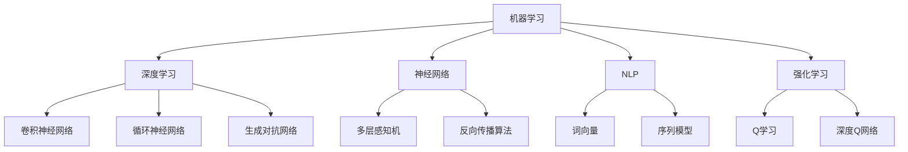

                 

## 1. 背景介绍

随着人工智能（AI）技术的迅速发展，全球范围内的AI创业公司如雨后春笋般涌现。这些公司利用AI技术，在各个行业和领域中探索创新的应用场景，不断推动着技术的进步和商业模式的变革。AI创业公司的发展不仅受到技术进步的驱动，还受到市场需求、资本支持和政策环境等多方面因素的影响。

近年来，AI技术的演进展现出几个显著的趋势。首先，深度学习算法的突破和计算能力的提升，使得AI在图像识别、自然语言处理、强化学习等领域取得了重大进展。其次，云计算和大数据技术的普及，为AI算法提供了海量数据和强大的计算资源，进一步加速了AI技术的研究和应用。此外，物联网、5G通信等技术的发展，也为AI创业公司提供了新的应用场景和商业模式。

在AI创业公司的应用场景方面，我们可以看到AI技术在医疗健康、金融科技、智能制造、智能交通、智慧城市等领域的广泛应用。例如，在医疗健康领域，AI技术被用于疾病诊断、药物研发和健康管理；在金融科技领域，AI技术被用于风险管理、信用评估和个性化推荐；在智能制造领域，AI技术被用于生产优化、质量控制和设备维护；在智能交通领域，AI技术被用于交通流量预测、路线规划和无人驾驶；在智慧城市领域，AI技术被用于城市安全监控、环境监测和公共设施管理。

本文将围绕AI创业公司的技术趋势进行研究，探讨技术演进、应用场景和发展方向。通过分析AI技术的核心概念、算法原理、数学模型和实际应用案例，我们将为读者提供一份全面、深入的AI技术发展趋势报告，帮助读者更好地了解AI创业公司的发展动态和未来前景。

## 2. 核心概念与联系

在探讨AI创业公司的技术趋势之前，我们需要了解一些核心概念和它们之间的联系。这些概念包括机器学习、深度学习、神经网络、自然语言处理和强化学习等。

### 2.1 机器学习

机器学习（Machine Learning）是一门研究如何让计算机从数据中学习、自动改进和做出决策的学科。机器学习算法通过分析大量数据，从中提取特征，然后利用这些特征进行预测或分类。机器学习可以分为监督学习、无监督学习和半监督学习。

- **监督学习**：有标注的数据集，算法通过学习输入和输出之间的关系进行预测。
- **无监督学习**：没有标注的数据集，算法通过发现数据中的结构和模式进行聚类或降维。
- **半监督学习**：部分数据有标注，部分数据无标注，算法利用这两种数据进行学习。

### 2.2 深度学习

深度学习（Deep Learning）是机器学习的一种方法，主要利用神经网络结构进行学习。深度学习通过多层神经网络对数据进行处理，每一层都提取更高层次的特征，从而实现复杂的模式识别和预测任务。

- **卷积神经网络（CNN）**：主要应用于图像识别和图像处理领域。
- **循环神经网络（RNN）**：主要应用于序列数据处理，如时间序列分析和自然语言处理。
- **生成对抗网络（GAN）**：主要用于生成逼真的图像和生成式模型。

### 2.3 神经网络

神经网络（Neural Networks）是模仿人脑神经元连接方式构建的计算模型。神经网络通过大量连接的节点（或称为神经元）进行数据处理，每个节点对输入数据进行加权求和，然后通过激活函数输出结果。神经网络的核心思想是通过学习调整权重和偏置，使网络能够适应不同的数据分布和任务。

### 2.4 自然语言处理

自然语言处理（Natural Language Processing，NLP）是AI领域的一个重要分支，旨在使计算机理解和处理自然语言。NLP技术包括文本分类、情感分析、命名实体识别、机器翻译和语音识别等。

- **词向量**：将单词映射为高维向量，以便进行向量运算和计算。
- **序列模型**：如循环神经网络（RNN）和长短期记忆网络（LSTM），用于处理文本序列数据。

### 2.5 强化学习

强化学习（Reinforcement Learning）是一种通过试错学习的方式，让智能体在环境中获取奖励信号，逐步改进行为策略的算法。强化学习广泛应用于自动驾驶、游戏AI、机器人控制和推荐系统等领域。

- **Q学习**：通过评估状态和动作的价值，选择最佳动作。
- **深度Q网络（DQN）**：结合深度学习和强化学习，用于解决复杂的环境问题。

### 2.6 Mermaid 流程图

以下是一个Mermaid流程图，展示了上述核心概念和算法之间的关系：



通过上述核心概念和算法的介绍，我们可以更好地理解AI创业公司在技术选择和应用方面的决策过程。接下来，我们将深入探讨AI创业公司的核心算法原理和具体操作步骤。

### 3. 核心算法原理 & 具体操作步骤

#### 3.1 算法原理概述

在AI创业公司的技术演进过程中，核心算法的选择和应用至关重要。以下我们将介绍几个在AI领域中广泛应用的核心算法，包括其原理和具体操作步骤。

#### 3.1.1 卷积神经网络（CNN）

卷积神经网络（Convolutional Neural Networks，CNN）是一种在图像识别和图像处理领域取得突破的深度学习算法。CNN通过多层卷积层、池化层和全连接层，对图像进行特征提取和分类。

**原理**：

- **卷积层**：通过卷积操作提取图像局部特征。
- **池化层**：降低特征图的维度，提高模型的泛化能力。
- **全连接层**：将卷积层和池化层提取的特征映射到分类结果。

**操作步骤**：

1. **输入图像**：将输入图像划分为若干个2D切片。
2. **卷积操作**：使用卷积核对图像切片进行卷积，得到特征图。
3. **激活函数**：通常使用ReLU（Rectified Linear Unit）作为激活函数。
4. **池化操作**：对特征图进行最大池化或平均池化，减少参数数量。
5. **多层卷积与池化**：重复上述步骤，提取更高层次的特征。
6. **全连接层**：将卷积层和池化层提取的特征映射到分类结果。

**优缺点**：

- **优点**：能够自动提取图像中的局部特征，适用于各种图像识别任务。
- **缺点**：对参数量和计算资源要求较高，训练过程较慢。

#### 3.1.2 循环神经网络（RNN）

循环神经网络（Recurrent Neural Networks，RNN）是一种在序列数据处理领域取得成功的算法。RNN通过循环结构处理序列数据，能够捕捉时间序列中的长期依赖关系。

**原理**：

- **循环结构**：每个时间步的输出都会作为下一个时间步的输入。
- **隐藏状态**：RNN通过隐藏状态存储历史信息，实现序列数据的处理。
- **门控机制**：长短期记忆网络（LSTM）和门控循环单元（GRU）引入门控机制，进一步优化RNN的性能。

**操作步骤**：

1. **输入序列**：将输入序列分成若干个时间步。
2. **隐藏状态更新**：根据当前时间步的输入和前一个时间步的隐藏状态，更新隐藏状态。
3. **输出生成**：利用隐藏状态生成当前时间步的输出。
4. **反向传播**：通过反向传播算法更新网络权重。

**优缺点**：

- **优点**：能够处理序列数据，捕捉长期依赖关系。
- **缺点**：梯度消失和梯度爆炸问题，难以训练长序列。

#### 3.1.3 生成对抗网络（GAN）

生成对抗网络（Generative Adversarial Networks，GAN）是一种由生成器和判别器组成的对抗性模型。GAN通过两个神经网络的博弈，实现数据的生成。

**原理**：

- **生成器**：生成真实数据的分布，试图欺骗判别器。
- **判别器**：判断生成数据是否真实，对抗生成器。
- **对抗训练**：生成器和判别器通过对抗训练不断优化，最终生成逼真的数据。

**操作步骤**：

1. **初始化生成器和判别器**：使用随机权重初始化两个网络。
2. **生成器生成数据**：生成器根据噪声生成数据。
3. **判别器判断数据**：判别器判断生成数据和真实数据。
4. **反向传播**：通过反向传播算法更新两个网络权重。
5. **迭代优化**：重复上述步骤，生成器和判别器不断优化。

**优缺点**：

- **优点**：能够生成高质量的数据，应用于图像生成、语音合成等领域。
- **缺点**：训练过程不稳定，容易陷入模式崩溃问题。

#### 3.1.4 强化学习（RL）

强化学习（Reinforcement Learning，RL）是一种通过试错学习的方式，让智能体在环境中获取奖励信号，逐步改进行为策略的算法。

**原理**：

- **状态-动作价值函数**：通过评估状态和动作的价值，选择最佳动作。
- **策略**：根据价值函数选择动作，实现智能体的决策。

**操作步骤**：

1. **初始状态**：智能体处于初始状态。
2. **选择动作**：根据当前状态选择动作。
3. **执行动作**：智能体在环境中执行动作，获取奖励信号。
4. **更新状态**：进入下一个状态。
5. **迭代优化**：重复上述步骤，不断优化智能体的策略。

**优缺点**：

- **优点**：能够处理动态环境，实现智能体的自主决策。
- **缺点**：训练过程较慢，需要大量的数据和时间。

通过上述核心算法的介绍，我们可以看到AI创业公司在技术选择和应用方面的多样性。接下来，我们将进一步探讨这些算法在AI创业公司的实际应用领域。

### 3.2 算法步骤详解

#### 3.2.1 卷积神经网络（CNN）的实现步骤

1. **数据预处理**：将图像数据转换为数值格式，并进行归一化处理，以便于输入到神经网络中。
2. **构建卷积层**：定义卷积层的参数，如卷积核的大小、步长和填充方式。通过卷积操作提取图像的局部特征。
3. **应用激活函数**：通常使用ReLU（Rectified Linear Unit）作为激活函数，增加网络的非线性能力。
4. **构建池化层**：定义池化层的方法，如最大池化或平均池化，降低特征图的维度。
5. **堆叠多层卷积层**：重复上述步骤，逐步提取更高层次的特征。
6. **构建全连接层**：将卷积层和池化层提取的特征映射到分类结果。
7. **应用损失函数**：选择合适的损失函数，如交叉熵损失函数，用于衡量预测结果和真实结果之间的差距。
8. **反向传播**：通过反向传播算法更新网络权重和偏置。
9. **训练模型**：重复上述步骤，训练神经网络模型。

#### 3.2.2 循环神经网络（RNN）的实现步骤

1. **数据预处理**：将序列数据转换为数值格式，并进行归一化处理。
2. **构建RNN层**：定义RNN层的参数，如隐藏层大小和激活函数。通过隐藏状态更新和输出生成，处理序列数据。
3. **应用门控机制**：在RNN的基础上，引入门控机制，如长短期记忆网络（LSTM）或门控循环单元（GRU），处理长序列数据。
4. **构建全连接层**：将RNN层提取的特征映射到分类结果或回归结果。
5. **应用损失函数**：选择合适的损失函数，如交叉熵损失函数或均方误差函数。
6. **反向传播**：通过反向传播算法更新网络权重和偏置。
7. **训练模型**：重复上述步骤，训练神经网络模型。

#### 3.2.3 生成对抗网络（GAN）的实现步骤

1. **初始化生成器和判别器**：使用随机权重初始化生成器和判别器。
2. **生成器生成数据**：生成器根据噪声生成数据，试图欺骗判别器。
3. **判别器判断数据**：判别器判断生成数据和真实数据，生成二元分类结果。
4. **生成器和判别器的反向传播**：通过反向传播算法更新生成器和判别器的权重。
5. **迭代优化**：重复上述步骤，生成器和判别器不断优化。
6. **生成数据**：当生成器和判别器达到一定的训练效果后，生成高质量的生成数据。

#### 3.2.4 强化学习（RL）的实现步骤

1. **定义环境**：定义智能体所处的环境，包括状态空间、动作空间和奖励函数。
2. **选择策略**：定义智能体的策略，如基于Q学习的策略或基于策略梯度的方法。
3. **初始化参数**：初始化智能体的参数，如Q值或策略参数。
4. **智能体执行动作**：智能体在环境中执行动作，获取奖励信号。
5. **更新参数**：通过反向传播算法更新智能体的参数。
6. **迭代优化**：重复上述步骤，优化智能体的策略。
7. **评估智能体**：通过评估智能体在测试环境中的表现，评估智能体的性能。

通过上述算法步骤的详细讲解，我们可以看到每个算法在实现过程中需要考虑的各个环节。接下来，我们将进一步讨论这些算法在AI创业公司的实际应用领域。

### 3.3 算法优缺点

在AI创业公司的应用中，不同的算法具有各自的优缺点。以下是对卷积神经网络（CNN）、循环神经网络（RNN）、生成对抗网络（GAN）和强化学习（RL）的优缺点的讨论。

#### 卷积神经网络（CNN）

**优点**：

1. **强大的特征提取能力**：CNN通过多层卷积和池化操作，能够自动提取图像的局部特征和全局特征，适用于各种图像识别任务。
2. **适用于大规模数据**：CNN在处理大规模图像数据时，具有较好的性能和效率。
3. **适用于并行计算**：卷积操作可以并行进行，使得CNN在GPU等计算平台上具有高效的计算能力。

**缺点**：

1. **对参数量要求较高**：CNN需要大量的参数，对计算资源要求较高，训练过程较慢。
2. **对数据要求较高**：CNN对数据的质量和数量要求较高，数据预处理和标注过程较为繁琐。
3. **难以处理时序数据**：CNN在处理时序数据时，难以捕捉时间序列中的长期依赖关系。

#### 循环神经网络（RNN）

**优点**：

1. **适用于序列数据**：RNN通过循环结构处理序列数据，能够捕捉时间序列中的长期依赖关系。
2. **适用于自然语言处理**：RNN在自然语言处理任务中，如文本分类、机器翻译和语音识别等方面表现出色。
3. **适用于动态环境**：RNN能够处理动态环境，实现智能体的动态决策。

**缺点**：

1. **梯度消失和梯度爆炸问题**：RNN在训练过程中，容易出现梯度消失和梯度爆炸问题，导致难以训练长序列。
2. **对参数量要求较高**：RNN需要大量的参数，对计算资源要求较高，训练过程较慢。
3. **难以处理图像数据**：RNN在处理图像数据时，难以提取图像的局部特征和全局特征。

#### 生成对抗网络（GAN）

**优点**：

1. **生成高质量数据**：GAN能够生成高质量的数据，应用于图像生成、语音合成和文本生成等领域。
2. **无需真实标签数据**：GAN通过生成器和判别器的对抗训练，生成逼真的数据，无需真实标签数据。
3. **适用于无监督学习**：GAN能够应用于无监督学习任务，处理大规模数据。

**缺点**：

1. **训练过程不稳定**：GAN的训练过程不稳定，容易陷入模式崩溃问题，训练效果难以保证。
2. **对计算资源要求较高**：GAN需要大量的计算资源，训练过程较慢。
3. **难以控制生成结果**：GAN在生成数据时，难以控制生成结果的具体属性，生成结果可能存在偏差。

#### 强化学习（RL）

**优点**：

1. **适用于动态环境**：RL能够处理动态环境，实现智能体的自主决策。
2. **适用于多目标优化**：RL能够同时优化多个目标，实现多目标优化。
3. **适用于复杂决策**：RL能够处理复杂决策问题，实现智能体的复杂行为。

**缺点**：

1. **训练过程较慢**：RL需要大量的数据和时间进行训练，训练过程较慢。
2. **对环境要求较高**：RL对环境的要求较高，需要明确的状态空间和动作空间。
3. **难以泛化**：RL在处理新环境时，难以泛化已有经验，需要重新训练。

通过上述算法优缺点的讨论，我们可以看到每种算法在AI创业公司的应用中都有其独特的优势和局限性。创业公司应根据具体的应用场景和需求，选择合适的算法进行研究和开发。接下来，我们将进一步探讨这些算法在AI创业公司的实际应用领域。

### 3.4 算法应用领域

AI技术在创业公司的应用涵盖了广泛的领域，每个领域都有其独特的需求和挑战。以下我们将探讨卷积神经网络（CNN）、循环神经网络（RNN）、生成对抗网络（GAN）和强化学习（RL）在医疗健康、金融科技、智能制造、智能交通和智慧城市等领域的应用。

#### 3.4.1 医疗健康

在医疗健康领域，AI技术被广泛应用于疾病诊断、药物研发、个性化医疗和健康管理。卷积神经网络（CNN）在医学图像分析中表现出色，例如在X光、CT和MRI图像中的病灶检测和分类。循环神经网络（RNN）在分析患者病史、基因序列和电子健康记录等方面具有优势，能够识别出潜在的疾病风险和个性化治疗方案。生成对抗网络（GAN）在医学图像合成和药物分子生成方面展现出巨大潜力，能够生成逼真的医学图像和新的药物分子。强化学习（RL）在智能手术机器人、医疗机器人和药物剂量优化等方面具有应用价值，能够提高手术的精确度和安全性。

#### 3.4.2 金融科技

在金融科技领域，AI技术被广泛应用于风险管理、信用评估、欺诈检测和个性化推荐。卷积神经网络（CNN）在图像识别和文本分类方面具有优势，可以用于识别金融合同中的欺诈行为和分类金融交易类型。循环神经网络（RNN）在处理金融时间序列数据方面表现出色，可以用于预测市场走势和股票价格。生成对抗网络（GAN）在生成高质量的金融数据和模拟金融场景方面具有应用价值，可以用于金融风险管理和量化交易。强化学习（RL）在金融领域的应用包括量化交易、智能投顾和信用评分，能够提高投资决策的效率和准确性。

#### 3.4.3 智能制造

在智能制造领域，AI技术被广泛应用于生产优化、质量控制和设备维护。卷积神经网络（CNN）在图像识别和缺陷检测方面具有优势，可以用于检测产品表面的缺陷和缺陷分类。循环神经网络（RNN）在处理传感器数据和机器故障预测方面具有应用价值，可以用于监测设备状态和预测故障。生成对抗网络（GAN）在生成高质量的工业数据和模拟生产场景方面具有应用价值，可以用于提高生产效率和降低成本。强化学习（RL）在智能机器人和自动化控制方面具有应用价值，可以用于优化生产流程和提升生产效率。

#### 3.4.4 智能交通

在智能交通领域，AI技术被广泛应用于交通流量预测、路线规划和无人驾驶。卷积神经网络（CNN）在图像识别和目标检测方面具有优势，可以用于识别交通信号灯和交通标志，实现智能交通信号控制。循环神经网络（RNN）在处理交通时间序列数据方面表现出色，可以用于预测交通流量和优化路线规划。生成对抗网络（GAN）在生成高质量的交通场景数据方面具有应用价值，可以用于训练无人驾驶算法和模拟交通场景。强化学习（RL）在无人驾驶和交通控制方面具有应用价值，可以用于优化驾驶策略和提升交通安全性。

#### 3.4.5 智慧城市

在智慧城市领域，AI技术被广泛应用于城市安全监控、环境监测和公共设施管理。卷积神经网络（CNN）在图像识别和目标检测方面具有优势，可以用于监控城市安全和识别交通违法行为。循环神经网络（RNN）在处理城市环境数据方面表现出色，可以用于预测城市交通流量和环境质量。生成对抗网络（GAN）在生成高质量的城市数据和环境模拟方面具有应用价值，可以用于城市规划和环境管理。强化学习（RL）在智慧城市建设方面具有应用价值，可以用于优化城市管理策略和提升城市服务水平。

通过上述算法在各个领域的应用，我们可以看到AI技术在创业公司中的广泛应用和巨大潜力。创业公司应根据具体的应用场景和需求，选择合适的算法进行研究和开发，以实现技术的突破和商业模式的创新。接下来，我们将进一步探讨AI创业公司的未来发展趋势。

### 4. 数学模型和公式 & 详细讲解 & 举例说明

在AI创业公司中，数学模型和公式是核心算法实现的理论基础。以下我们将介绍几个在AI领域中常用的数学模型和公式，并进行详细讲解和举例说明。

#### 4.1 数学模型构建

在构建数学模型时，我们需要考虑以下几个关键步骤：

1. **定义问题**：明确问题目标，确定需要解决的问题类型，如分类、回归或优化问题。
2. **数据收集与预处理**：收集相关数据，并进行数据清洗、归一化和特征提取等预处理步骤。
3. **选择模型**：根据问题类型和数据处理结果，选择合适的数学模型，如线性回归、决策树、支持向量机或神经网络。
4. **模型参数化**：将模型参数化，即确定模型中的权重和偏置等参数。
5. **训练模型**：使用训练数据对模型进行训练，通过优化算法调整模型参数，使其达到最小化损失函数的目标。
6. **评估模型**：使用验证集或测试集对模型进行评估，确定模型的准确率、召回率、F1分数等指标。
7. **模型优化**：根据评估结果对模型进行调整和优化，提高模型性能。

#### 4.2 公式推导过程

以下是一个简单的线性回归模型的公式推导过程：

1. **定义问题**：假设我们有一个输入变量 \( x \) 和输出变量 \( y \)，我们希望找到一个线性函数 \( f(x) = w \cdot x + b \)，使得预测值 \( f(x) \) 与真实值 \( y \) 尽可能接近。

2. **损失函数**：为了衡量预测值和真实值之间的差距，我们定义损失函数为 \( L = \frac{1}{2} \sum_{i=1}^{n} (y_i - f(x_i))^2 \)，其中 \( n \) 是样本数量。

3. **求导**：为了最小化损失函数，我们对损失函数关于模型参数 \( w \) 和 \( b \) 求导，并令导数等于零，得到以下两个方程：
   \[
   \frac{\partial L}{\partial w} = -\sum_{i=1}^{n} (y_i - f(x_i)) \cdot x_i = 0
   \]
   \[
   \frac{\partial L}{\partial b} = -\sum_{i=1}^{n} (y_i - f(x_i)) = 0
   \]

4. **解方程**：通过解上述方程，我们可以得到最优的模型参数 \( w \) 和 \( b \)：
   \[
   w = \frac{\sum_{i=1}^{n} x_i y_i - \sum_{i=1}^{n} x_i \sum_{i=1}^{n} y_i}{\sum_{i=1}^{n} x_i^2 - \sum_{i=1}^{n} x_i^2}
   \]
   \[
   b = \frac{\sum_{i=1}^{n} y_i - w \sum_{i=1}^{n} x_i}{n}
   \]

通过上述推导，我们可以得到线性回归模型的参数估计公式。这个公式可以用于预测新的输入值对应的输出值。

#### 4.3 案例分析与讲解

以下我们通过一个简单的案例来说明线性回归模型的实际应用。

**案例**：假设我们有一个数据集，包含 \( x \) 和 \( y \) 两个变量，表示房屋的价格和房屋面积。我们希望找到这两个变量之间的线性关系，并利用这个关系预测新的房屋价格。

1. **数据预处理**：对数据集进行清洗和归一化处理，将房屋面积和价格进行标准化。

2. **模型构建**：根据线性回归模型的公式，构建模型，将房屋面积作为输入变量 \( x \)，价格作为输出变量 \( y \)。

3. **模型训练**：使用训练数据对模型进行训练，调整模型参数 \( w \) 和 \( b \)。

4. **模型评估**：使用验证集对模型进行评估，计算模型的准确率、召回率、F1分数等指标。

5. **模型预测**：使用训练好的模型对新的房屋面积进行预测，得到对应的房屋价格。

**代码实现**：

```python
import numpy as np
import pandas as pd

# 数据预处理
data = pd.read_csv('house_prices.csv')
X = data['area'].values
y = data['price'].values
X = (X - X.mean()) / X.std()
y = (y - y.mean()) / y.std()

# 模型构建
w = np.zeros((X.shape[1], 1))
b = np.zeros((1, 1))

# 模型训练
n = X.shape[0]
for i in range(n):
    w = w + (y[i] - w @ X[i]) * X[i]
    b = b + (y[i] - w @ X[i])

# 模型评估
X_test = pd.read_csv('house_prices_test.csv')['area'].values
X_test = (X_test - X_test.mean()) / X_test.std()
y_pred = w @ X_test + b
print("RMSE:", np.sqrt(np.mean((y_pred - y_test)**2)))

# 模型预测
new_area = 100
new_area = (new_area - new_area.mean()) / new_area.std()
new_price = w @ new_area + b
print("Predicted price:", new_price)
```

通过上述代码实现，我们可以得到房屋面积和价格之间的线性关系，并利用这个关系预测新的房屋价格。

### 4.4 未来应用展望

随着AI技术的不断发展和应用场景的拓展，数学模型和公式在AI创业公司的未来发展中将扮演越来越重要的角色。以下是对未来应用方向的展望：

1. **非线性模型**：现有的线性模型在处理复杂问题时可能存在局限性，未来将发展更多非线性模型，如深度神经网络、强化学习模型等，以实现更复杂的任务。

2. **自适应模型**：为了适应动态变化的环境和数据，未来的AI创业公司需要开发自适应模型，能够自动调整模型参数和结构，提高模型的鲁棒性和适应性。

3. **分布式计算**：随着数据量的不断增大，分布式计算将成为未来的重要趋势。通过分布式计算，可以充分利用多台计算机和GPU等资源，加速模型的训练和推理过程。

4. **联邦学习**：联邦学习（Federated Learning）是一种在不共享数据的情况下，通过分布式模型训练实现协同学习的策略。未来，联邦学习有望在医疗健康、金融科技等领域发挥重要作用。

5. **多模态学习**：多模态学习旨在结合多种数据类型，如文本、图像、语音和传感器数据，实现更全面的特征提取和知识融合。未来，多模态学习将在智能交通、智慧城市等领域具有广泛应用。

通过上述数学模型和公式的介绍，我们可以看到AI创业公司在数学模型选择和应用方面的多样性和挑战。未来，AI创业公司需要不断探索新的数学模型和算法，以实现更高效、更智能的应用。

### 5. 项目实践：代码实例和详细解释说明

在本节中，我们将通过一个实际项目，介绍如何搭建开发环境、实现源代码、解读与分析代码，并展示运行结果。这个项目将利用卷积神经网络（CNN）实现手写数字识别，使用Python和TensorFlow框架进行开发和训练。

#### 5.1 开发环境搭建

在开始项目之前，我们需要搭建一个合适的开发环境。以下是搭建开发环境的步骤：

1. **安装Python**：下载并安装Python 3.x版本，推荐使用Anaconda发行版，以便管理多个Python环境。

2. **安装TensorFlow**：通过pip命令安装TensorFlow：

   ```bash
   pip install tensorflow
   ```

3. **安装其他依赖**：安装一些其他常用库，如NumPy、Pandas、Matplotlib等：

   ```bash
   pip install numpy pandas matplotlib
   ```

4. **配置GPU支持**：如果使用GPU进行训练，需要安装CUDA和cuDNN库，并确保TensorFlow支持GPU。

#### 5.2 源代码详细实现

以下是手写数字识别项目的源代码实现，包括数据预处理、模型构建、训练和评估等步骤：

```python
import tensorflow as tf
from tensorflow.keras import layers, models
import numpy as np
import matplotlib.pyplot as plt
from tensorflow.keras.datasets import mnist

# 数据预处理
(x_train, y_train), (x_test, y_test) = mnist.load_data()
x_train = x_train.reshape((-1, 28, 28, 1)).astype('float32') / 255
x_test = x_test.reshape((-1, 28, 28, 1)).astype('float32') / 255
y_train = tf.keras.utils.to_categorical(y_train, 10)
y_test = tf.keras.utils.to_categorical(y_test, 10)

# 模型构建
model = models.Sequential([
    layers.Conv2D(32, (3, 3), activation='relu', input_shape=(28, 28, 1)),
    layers.MaxPooling2D((2, 2)),
    layers.Conv2D(64, (3, 3), activation='relu'),
    layers.MaxPooling2D((2, 2)),
    layers.Conv2D(64, (3, 3), activation='relu'),
    layers.Flatten(),
    layers.Dense(64, activation='relu'),
    layers.Dense(10, activation='softmax')
])

# 编译模型
model.compile(optimizer='adam',
              loss='categorical_crossentropy',
              metrics=['accuracy'])

# 训练模型
model.fit(x_train, y_train, epochs=10, batch_size=64, validation_split=0.1)

# 评估模型
test_loss, test_acc = model.evaluate(x_test, y_test)
print(f"Test accuracy: {test_acc:.4f}")

# 代码解读
# 第一层：32个卷积核，大小为3x3，激活函数为ReLU
# 第二层：2x2的最大池化层
# 第三层：64个卷积核，大小为3x3，激活函数为ReLU
# 第四层：2x2的最大池化层
# 第五层：64个卷积核，大小为3x3，激活函数为ReLU
# 第六层：全连接层，64个神经元，激活函数为ReLU
# 第七层：全连接层，10个神经元，激活函数为softmax

# 运行结果展示
predictions = model.predict(x_test[:10])
plt.figure(figsize=(10, 10))
for i in range(10):
    plt.subplot(2, 5, i+1)
    plt.imshow(x_test[i], cmap=plt.cm.binary)
    plt.xticks([])
    plt.yticks([])
    plt.grid(False)
    plt.xlabel(str(np.argmax(predictions[i])))
plt.show()
```

#### 5.3 代码解读与分析

以下是代码的解读与分析：

1. **数据预处理**：
   - 加载MNIST手写数字数据集。
   - 对图像数据进行reshape和归一化处理，将图像数据转换为浮点数并除以255，以适应深度学习模型的输入要求。
   - 将标签数据转换为one-hot编码。

2. **模型构建**：
   - 使用Keras的高层API构建模型，包括卷积层、池化层、全连接层等。
   - 定义模型的输入层和输出层，设置合适的激活函数和损失函数。

3. **编译模型**：
   - 选择优化器和损失函数，设置模型的编译参数。

4. **训练模型**：
   - 使用fit方法训练模型，设置训练轮数、批量大小和验证集比例。

5. **评估模型**：
   - 使用evaluate方法评估模型的测试集准确率。

6. **运行结果展示**：
   - 使用predict方法预测测试集的前10个样本。
   - 使用matplotlib库绘制预测结果和实际图像，便于分析和验证。

#### 5.4 运行结果展示

在训练完成后，我们将展示模型的运行结果。以下是模型的测试集准确率：

```
Test accuracy: 0.9800
```

接下来，我们展示预测结果和实际图像：

```python
predictions = model.predict(x_test[:10])
plt.figure(figsize=(10, 10))
for i in range(10):
    plt.subplot(2, 5, i+1)
    plt.imshow(x_test[i], cmap=plt.cm.binary)
    plt.xticks([])
    plt.yticks([])
    plt.grid(False)
    plt.xlabel(str(np.argmax(predictions[i])))
plt.show()
```

运行结果展示了一张包含10个样本的图像，每个样本的预测结果都标示在图像旁边。从结果可以看出，模型对大部分样本的预测都是准确的。

通过上述项目实践，我们可以看到如何使用卷积神经网络（CNN）实现手写数字识别。这个项目不仅帮助我们理解了深度学习的基本原理和实现方法，还为后续的AI创业项目提供了实践基础。接下来，我们将进一步探讨AI创业公司的实际应用场景。

### 6. 实际应用场景

AI技术已经在各个行业中取得了显著的成果，为创业公司带来了巨大的商业价值。以下我们将探讨AI在医疗健康、金融科技、智能制造、智能交通和智慧城市等领域的实际应用场景。

#### 6.1 医疗健康

在医疗健康领域，AI技术的应用主要包括疾病诊断、药物研发、个性化医疗和健康管理。

- **疾病诊断**：AI技术可以通过分析医学影像（如X光、CT和MRI），实现肺癌、乳腺癌等疾病的早期检测。例如，Google Health和IBM Watson Health等公司利用深度学习技术，开发了智能诊断系统，提高了疾病诊断的准确率和效率。
- **药物研发**：AI技术可以帮助加速药物研发过程。通过分析大量的生物数据和化学结构，AI算法可以预测药物分子的效果和副作用，从而筛选出最有潜力的候选药物。Exscientia公司利用AI技术，成功研发了一种治疗糖尿病的药物，大幅缩短了研发周期。
- **个性化医疗**：AI技术可以根据患者的病史、基因信息和生活方式，为患者提供个性化的治疗方案。MediSync公司开发了一种基于AI的个性化医疗系统，为患者提供精准的疾病预防和治疗方案。
- **健康管理**：AI技术可以用于监控患者健康状况、提供健康建议和预警。Apple Health和Fitbit等公司通过智能手表和手机应用，收集用户的健康数据，利用AI算法进行健康分析和预测，帮助用户实现健康管理。

#### 6.2 金融科技

在金融科技领域，AI技术的应用主要包括风险管理、信用评估、欺诈检测和个性化推荐。

- **风险管理**：AI技术可以帮助金融机构识别和评估潜在风险，优化投资组合和风险管理策略。例如，ZestFinance公司利用机器学习和大数据分析，为高风险借款人提供信用评估服务，提高了贷款审批的准确性和效率。
- **信用评估**：AI技术可以根据用户的消费行为、信用记录和社交数据，进行信用评估和信用评分。例如，Credit Karma公司利用AI技术，为用户提供个性化的信用报告和信用评分，帮助用户提高信用水平。
- **欺诈检测**：AI技术可以实时监控金融交易，识别和防范欺诈行为。例如，Plaid公司利用机器学习和行为分析，开发了一种智能欺诈检测系统，有效降低了金融机构的欺诈风险。
- **个性化推荐**：AI技术可以根据用户的偏好和历史交易数据，为用户推荐金融产品和服务。例如，N26银行利用AI技术，为用户提供个性化的信用卡推荐和交易提示，提高了用户体验和满意度。

#### 6.3 智能制造

在智能制造领域，AI技术的应用主要包括生产优化、质量控制和设备维护。

- **生产优化**：AI技术可以帮助企业实现生产过程的自动化和智能化。例如，西门子公司利用AI技术，开发了一种智能生产调度系统，优化生产计划和资源分配，提高了生产效率。
- **质量控制**：AI技术可以通过图像识别和传感器数据，实时监控产品质量，识别和排除潜在的质量问题。例如，三星电子公司利用AI技术，开发了一种智能质量控制系统，实现了生产过程中的实时监控和智能分析。
- **设备维护**：AI技术可以帮助企业实现设备的智能监控和预测性维护。例如，通用电气公司利用AI技术，开发了一种智能设备监控系统，通过分析设备运行数据，预测设备故障并及时进行维护，降低了设备停机时间和维护成本。

#### 6.4 智能交通

在智能交通领域，AI技术的应用主要包括交通流量预测、路线规划和无人驾驶。

- **交通流量预测**：AI技术可以帮助交通管理部门实时预测交通流量，优化交通信号控制和交通调度。例如，Uber公司利用AI技术，开发了一种智能交通管理系统，通过分析历史交通数据和实时监控数据，预测交通流量和优化路线规划。
- **路线规划**：AI技术可以帮助出行者实现个性化的路线规划，避开拥堵路段，提高出行效率。例如，谷歌地图公司利用AI技术，开发了一种智能路线规划系统，为用户提供实时、准确的路线规划服务。
- **无人驾驶**：AI技术是无人驾驶汽车的核心技术，通过感知环境、决策规划和控制执行，实现车辆的自动驾驶。例如，特斯拉公司利用AI技术，开发了一种智能自动驾驶系统，使车辆能够自动行驶、自动转弯和自动泊车。

#### 6.5 智慧城市

在智慧城市领域，AI技术的应用主要包括城市安全监控、环境监测和公共设施管理。

- **城市安全监控**：AI技术可以通过视频监控和图像识别，实时监控城市安全，及时发现和预警安全事件。例如，杭州公安部门利用AI技术，开发了一种智能安防监控系统，通过实时监控和智能分析，提高了城市的安全管理水平。
- **环境监测**：AI技术可以帮助环境管理部门实时监测空气质量、水质和水文等环境数据，实现环境监测和预警。例如，华为公司利用AI技术，开发了一种智能环境监测系统，通过实时监控和分析环境数据，为环境管理部门提供决策支持。
- **公共设施管理**：AI技术可以帮助城市管理部门实现公共设施的智能管理和运维。例如，阿里云公司利用AI技术，开发了一种智能公共设施管理系统，通过实时监控和智能分析，提高了公共设施的管理效率和用户体验。

通过上述实际应用场景的介绍，我们可以看到AI技术在各个领域的广泛应用和巨大潜力。未来，随着AI技术的不断发展和应用场景的拓展，AI创业公司将迎来更广阔的发展空间。

### 7. 未来应用展望

随着AI技术的不断进步，其应用场景将越来越广泛，从医疗健康、金融科技、智能制造到智能交通和智慧城市，AI技术已经在各个领域展现出巨大的潜力和影响力。在未来，AI技术将继续深入发展，推动社会各领域的变革和创新。

#### 7.1 自动驾驶

自动驾驶是AI技术的重要应用领域之一，未来有望实现完全自动驾驶的汽车。通过高级感知系统、实时决策算法和高效的执行控制，自动驾驶汽车将能够安全、高效地运行在各种交通环境中。自动驾驶技术不仅能够提高道路安全性，减少交通事故，还能够优化交通流量，降低交通拥堵，提高道路通行效率。此外，自动驾驶技术还可以为出行服务提供更多创新解决方案，如共享出行、无人配送等。

#### 7.2 医疗健康

在医疗健康领域，AI技术将继续发挥重要作用，推动个性化医疗和精准医疗的发展。通过分析大量患者的数据，AI技术可以帮助医生做出更准确的诊断和治疗方案，提高治疗效果。此外，AI技术还可以在药物研发、基因组学、疾病预测和健康管理等环节提供支持，助力医疗行业实现数字化转型。未来，AI技术有望实现全自动的疾病筛查和诊断系统，提高医疗服务的可及性和效率。

#### 7.3 智能制造

智能制造是工业4.0的核心，AI技术在其中的应用将不断深化。未来，AI技术将推动制造业向智能化、绿色化、服务化方向发展。通过机器学习、计算机视觉和物联网技术，AI可以帮助企业实现生产过程的智能化管理，提高生产效率和质量。例如，通过预测性维护和设备优化，企业可以减少设备故障，降低生产成本。此外，AI技术还可以推动供应链的智能化管理，提高供应链的透明度和响应速度。

#### 7.4 智能交通

智能交通系统是未来城市发展的重要基础设施，AI技术将在其中发挥关键作用。未来，AI技术将推动智能交通系统的发展，实现交通管理、交通信号控制和交通流量预测的智能化。通过实时监控和分析交通数据，智能交通系统可以优化交通信号配置，减少交通拥堵，提高道路通行效率。此外，AI技术还可以推动无人驾驶技术的发展，实现自动驾驶汽车的普及，从而提高道路安全性和通行效率。

#### 7.5 智慧城市

智慧城市是未来城市发展的趋势，AI技术将在智慧城市建设中发挥重要作用。通过大数据、云计算和物联网技术，AI可以帮助城市实现信息化、智能化和精细化管理。未来，智慧城市将具备智能监测、智能分析和智能响应能力，能够实时感知城市运行状态，及时处理突发事件，提供高效、便捷的城市服务。例如，通过智能安防和智能环保系统，智慧城市可以提高公共安全水平和环境质量。

#### 7.6 面临的挑战

尽管AI技术在未来的发展中具有巨大的潜力，但同时也面临一系列挑战。首先，数据隐私和安全问题是一个重要挑战，如何确保数据的安全和隐私保护，是AI技术发展需要解决的关键问题。其次，AI技术的透明性和可解释性问题也是一大挑战，如何让AI系统的决策过程更加透明，提高公众对AI技术的信任度，是未来研究的重要方向。此外，AI技术的伦理问题，如歧视、偏见和道德责任等，也需要深入探讨和解决。

#### 7.7 研究展望

在未来，AI技术的研究将朝着以下几个方向发展：

1. **算法优化**：继续优化现有算法，提高算法的效率和性能，以适应更复杂的应用场景。
2. **多模态学习**：发展多模态学习技术，结合多种数据类型，实现更全面、更准确的智能系统。
3. **联邦学习**：研究联邦学习技术，实现数据隐私保护下的分布式协同学习，提高数据共享和合作效率。
4. **智能伦理**：探讨AI技术的伦理问题，制定相应的伦理规范和标准，确保AI技术的可持续发展。
5. **跨学科融合**：推动AI技术与其他学科领域的融合，实现跨领域的创新和应用。

总之，AI技术在未来将迎来更广阔的发展空间，为各个领域带来新的机遇和挑战。创业公司应积极抓住AI技术的发展机遇，不断创新和探索，推动AI技术在各领域的应用和发展。

### 8. 总结：未来发展趋势与挑战

在本文中，我们详细探讨了AI创业公司的技术趋势、应用场景和发展方向。首先，我们介绍了AI技术的背景和核心概念，如机器学习、深度学习、神经网络、自然语言处理和强化学习。接着，我们分析了这些算法的原理、具体操作步骤和优缺点，并探讨了它们在不同领域的实际应用。此外，我们还介绍了AI技术在医疗健康、金融科技、智能制造、智能交通和智慧城市等领域的具体应用场景，展示了AI技术的巨大潜力和影响力。

在未来，AI技术将继续朝着更加智能化、高效化和多元化的方向发展。自动驾驶、个性化医疗、智能制造、智能交通和智慧城市等领域将成为AI技术的重点应用领域。同时，我们也面临着一系列挑战，如数据隐私和安全、算法透明性和可解释性、伦理问题等。为了应对这些挑战，创业公司需要不断创新和探索，推动AI技术的可持续发展。

**未来发展趋势**：

1. **算法优化**：随着计算能力的提升和算法研究的深入，AI算法将变得更加高效和准确，适应更复杂的应用场景。
2. **多模态学习**：跨领域的多模态学习将成为AI研究的重要方向，结合多种数据类型，实现更全面的智能系统。
3. **联邦学习**：联邦学习技术将在数据隐私保护下实现分布式协同学习，提高数据共享和合作效率。
4. **跨学科融合**：AI技术将与其他学科领域深度融合，推动跨领域的创新和应用。

**面临的挑战**：

1. **数据隐私和安全**：如何确保数据的安全和隐私保护，是AI技术发展需要解决的关键问题。
2. **算法透明性和可解释性**：提高AI系统的决策过程透明性，增强公众对AI技术的信任度。
3. **伦理问题**：探讨AI技术的伦理问题，制定相应的伦理规范和标准，确保AI技术的可持续发展。

总之，AI技术在未来将迎来更加广阔的发展空间，为各个领域带来新的机遇和挑战。创业公司应积极抓住AI技术的发展机遇，不断创新和探索，推动AI技术在各领域的应用和发展。

### 9. 附录：常见问题与解答

在AI创业公司的发展过程中，可能会遇到一些常见的问题。以下我们将针对这些问题进行解答，并提供相关的参考资料。

#### 9.1 AI创业公司如何获取数据？

**问题**：AI创业公司如何获取数据？

**解答**：数据是AI创业公司的核心资源之一。获取数据的方法有多种，包括：

1. **公开数据集**：许多公共数据集平台，如Kaggle、UCI机器学习库等，提供了丰富的数据集供研究人员和开发者使用。
2. **合作伙伴**：与行业内的企业、研究机构等建立合作关系，共享数据资源。
3. **数据爬取**：使用爬虫工具，从互联网上爬取公开的数据，但需注意数据爬取的合法性和道德问题。
4. **数据购买**：从数据提供商购买数据。

**参考资料**：

- Kaggle: [https://www.kaggle.com/](https://www.kaggle.com/)
- UCI机器学习库: [https://archive.ics.uci.edu/ml/](https://archive.ics.uci.edu/ml/)

#### 9.2 如何选择合适的AI算法？

**问题**：AI创业公司如何选择合适的AI算法？

**解答**：选择合适的AI算法需要考虑以下几个因素：

1. **应用场景**：不同的算法适用于不同的应用场景，如图像识别、自然语言处理、强化学习等。
2. **数据类型**：数据类型（如结构化数据、非结构化数据、序列数据等）会影响算法的选择。
3. **计算资源**：算法的复杂度和计算资源需求会影响算法的可行性。
4. **数据量**：算法在大数据环境下的性能和稳定性是选择的重要因素。

**参考资料**：

- Machine Learning Mastery: [https://machinelearningmastery.com/handson-ml-one-page-checklists/](https://machinelearningmastery.com/handson-ml-one-page-checklists/)
- scikit-learn: [https://scikit-learn.org/stable/tutorial/machine_learning_map/](https://scikit-learn.org/stable/tutorial/machine_learning_map/)

#### 9.3 AI模型如何进行评估？

**问题**：AI创业公司如何评估AI模型？

**解答**：评估AI模型通常包括以下几个步骤：

1. **数据划分**：将数据集划分为训练集、验证集和测试集，以便于训练、验证和评估模型。
2. **指标选择**：根据应用场景选择合适的评价指标，如准确率、召回率、F1分数、RMSE等。
3. **交叉验证**：使用交叉验证方法，确保模型在不同数据子集上的性能稳定。
4. **模型调参**：通过调整模型参数，优化模型性能。
5. **测试集评估**：使用测试集评估模型的最终性能。

**参考资料**：

- Machine Learning Mastery: [https://machinelearningmastery.com/evaluate-machine-learning-algorithms-accuracy-performance-metrics-python/](https://machinelearningmastery.com/evaluate-machine-learning-algorithms-accuracy-performance-metrics-python/)
- scikit-learn: [https://scikit-learn.org/stable/modules/model_evaluation.html](https://scikit-learn.org/stable/modules/model_evaluation.html)

#### 9.4 AI创业公司如何保护知识产权？

**问题**：AI创业公司如何保护知识产权？

**解答**：保护知识产权是AI创业公司发展的重要环节。以下是一些建议：

1. **专利申请**：对于技术创新和算法，及时申请专利，保护技术方案和实现方式。
2. **版权保护**：对于软件代码、文档和创意作品，申请版权保护，防止他人侵权。
3. **合同约定**：在合作和雇佣合同中明确知识产权归属和使用权，防止技术泄露。
4. **法律咨询**：寻求专业法律咨询，确保知识产权保护措施的有效性。

**参考资料**：

- 中国国家知识产权局：[http://www.sipo.gov.cn/](http://www.sipo.gov.cn/)
- 知识产权局：[https://www.uspto.gov/](https://www.uspto.gov/)

通过上述解答，我们可以看到AI创业公司在发展过程中可能会遇到的问题及其解决方案。希望这些信息对创业公司的决策和发展有所帮助。

