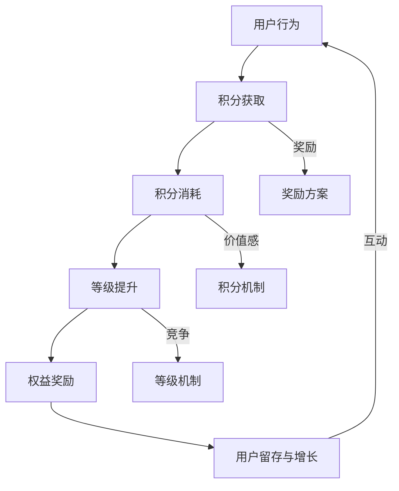

                 

### 1. 背景介绍

在当今快速发展的数字化时代，用户是企业成功的关键资产。对于AI创业公司而言，如何吸引并留住用户，提高用户参与度和忠诚度，成为了一项重要课题。有效的用户激励与奖励机制，不仅能够增强用户黏性，提高用户活跃度，还能为企业带来更多的商业价值。

用户激励与奖励机制是指通过提供各种形式的奖励和激励，如积分、等级、优惠券等，激发用户的参与热情和消费欲望，从而实现用户增长、留存和转化。这些机制通常包括积分机制、等级机制和奖励方案等多个方面。

积分机制是用户激励机制中最常见的类型之一。通过积分的累积和兑换，用户可以感受到自己的成长和价值，从而增加对平台的忠诚度。等级机制则通过用户的行为和贡献，对用户进行分级，不同等级的用户享受不同的权益和奖励，进一步激发用户活跃度。奖励方案则包括直接的经济奖励和体验奖励，如现金返利、免费试用等，旨在激励用户积极参与和消费。

本文将深入探讨AI创业公司如何设计有效的用户激励与奖励机制，包括积分机制、等级机制和奖励方案的具体实施方法、优点和潜在挑战，并结合实际案例进行说明。通过本文的阅读，读者将能够理解并掌握这些机制的设计原则和实施策略，为企业的用户增长和留存提供有力支持。

### 2. 核心概念与联系

在设计用户激励与奖励机制时，首先需要明确几个核心概念，并理解它们之间的内在联系。以下是本文将涉及的主要概念：

#### 2.1 积分机制

积分机制是一种常见的用户激励手段，通过为用户在平台上的特定行为（如注册、购买、评论、分享等）赋予积分，用户可以通过积分兑换各种权益和奖励。积分机制的设计关键在于积分的获取方式、消耗方式以及积分的价值感。

#### 2.2 等级机制

等级机制根据用户在平台上的行为和积分累积，将用户分为不同的等级。每个等级对应不同的权益和奖励，如会员专属优惠、积分获取速度提升等。等级机制能够有效激发用户的竞争心理，提高用户活跃度和忠诚度。

#### 2.3 奖励方案

奖励方案包括直接的经济奖励和体验奖励。经济奖励如现金返利、优惠券等，可以刺激用户的消费行为；体验奖励如免费试用、专属活动邀请等，可以增强用户的参与感和满意度。

#### 2.4 用户行为与激励的互动关系

用户激励与奖励机制的核心在于通过奖励机制影响用户行为，进而实现用户增长和留存。具体来说，积分机制和等级机制通过积分的获取和消耗，激发用户的参与热情；奖励方案则通过直接的经济或体验奖励，增强用户的消费动力和留存意愿。

#### 2.5 Mermaid流程图

以下是用户激励与奖励机制的Mermaid流程图，展示了各概念之间的联系和互动过程：



通过这张流程图，我们可以清晰地看到用户行为如何通过积分获取、消耗、等级提升和奖励方案，形成一个良性互动的循环，从而实现用户激励与奖励的目标。

### 3. 核心算法原理 & 具体操作步骤

#### 3.1 算法原理概述

用户激励与奖励机制的设计依赖于一套核心算法，用于计算积分、等级和奖励。以下是该算法的基本原理：

1. **积分计算公式**：根据用户的行为，如注册、购买、评论、分享等，赋予相应的积分。积分的计算公式可以表示为：
   \[
   \text{积分} = f(\text{行为类型}, \text{行为次数}, \text{行为权重})
   \]
   其中，行为类型、行为次数和行为权重是影响积分获取的关键因素。

2. **等级计算公式**：用户累计的积分将决定其等级。等级的计算公式可以表示为：
   \[
   \text{等级} = \left\lceil \frac{\text{积分}}{n} \right\rceil
   \]
   其中，\(n\) 是等级门槛，即达到该等级所需的最小积分值。

3. **奖励计算公式**：用户的等级将影响其能够获得的奖励。奖励的计算公式可以表示为：
   \[
   \text{奖励} = g(\text{等级}, \text{奖励倍数})
   \]
   其中，奖励倍数是根据等级而设定的，用于确定奖励的力度。

#### 3.2 算法步骤详解

以下是用户激励与奖励机制的详细操作步骤：

1. **用户行为记录**：系统记录用户在平台上的所有行为，如注册、购买、评论、分享等。

2. **积分计算**：根据行为记录，调用积分计算公式，为用户赋予相应的积分。

3. **积分累加**：将新获取的积分累加到用户已有的积分中。

4. **等级评估**：使用等级计算公式，评估用户当前的等级。

5. **等级更新**：如果用户的积分达到新的等级门槛，更新其等级。

6. **奖励发放**：根据用户的等级，调用奖励计算公式，为用户发放相应的奖励。

7. **奖励记录**：将发放的奖励记录在用户的账户中，以便用户查询和兑换。

#### 3.3 算法优缺点

**优点**：

- **灵活性**：积分、等级和奖励的计算公式可以根据业务需求进行调整，具有很高的灵活性。
- **用户参与度**：积分机制和等级机制能够有效激发用户的参与热情，提高用户活跃度。
- **数据驱动**：通过数据分析和用户行为记录，可以不断优化奖励机制，提高用户留存率和转化率。

**缺点**：

- **复杂度**：算法的复杂度较高，需要详细规划和测试，以确保系统的稳定性和准确性。
- **资源消耗**：积分和等级的计算需要大量的计算资源和存储空间，对系统性能有较高要求。
- **公平性**：如何平衡不同用户的积分获取和奖励力度，避免出现不公平现象，是一个需要考虑的问题。

#### 3.4 算法应用领域

用户激励与奖励机制在多个领域都有广泛应用，包括电商、社交媒体、游戏和金融服务等。以下是几个典型的应用领域：

- **电商**：通过积分机制和等级机制，提高用户购物体验，促进销售增长。
- **社交媒体**：通过积分和等级机制，鼓励用户产生和分享内容，提升社区活跃度。
- **游戏**：通过积分和奖励机制，激励玩家参与游戏，提高游戏时长和消费。
- **金融服务**：通过积分和等级机制，为用户提供个性化的金融服务，提高用户忠诚度。

### 4. 数学模型和公式 & 详细讲解 & 举例说明

为了更深入地理解和设计用户激励与奖励机制，我们引入一些数学模型和公式，并通过具体案例进行说明。

#### 4.1 数学模型构建

首先，我们构建一个基本的积分模型，用于计算用户在平台上的积分。该模型包含以下主要变量：

- \(B_i\)：用户在某一行为上的积分。
- \(T_i\)：行为类型（例如，注册、购买、评论、分享等）。
- \(N_i\)：行为次数。
- \(W_i\)：行为权重。

积分计算公式如下：
\[
B_i = \sum_{T=1}^{n} W_i \times N_i
\]

其中，\(W_i\) 是行为权重，用于调整不同类型行为对积分的贡献程度。通常，权重值越大，行为对积分的贡献越高。

接下来，我们构建一个等级模型，用于根据积分评估用户的等级。等级模型包含以下变量：

- \(L_j\)：用户等级。
- \(I_j\)：用户当前积分。
- \(n_j\)：等级门槛。

等级计算公式如下：
\[
L_j = \left\lceil \frac{I_j}{n_j} \right\rceil
\]

最后，我们构建一个奖励模型，用于根据用户等级计算其获得的奖励。奖励模型包含以下变量：

- \(R_k\)：用户奖励。
- \(L_k\)：用户等级。
- \(r_k\)：奖励倍数。

奖励计算公式如下：
\[
R_k = g(L_k, r_k)
\]

其中，\(r_k\) 是奖励倍数，用于调整不同等级的奖励力度。

#### 4.2 公式推导过程

**积分公式推导**：

积分公式 \(B_i = \sum_{T=1}^{n} W_i \times N_i\) 是基于加权求和的原理。对于每一种行为类型 \(T_i\)，其积分贡献由行为次数 \(N_i\) 和权重 \(W_i\) 共同决定。行为权重 \(W_i\) 通常根据业务需求和用户行为特征进行设定。例如，购买行为的权重可能高于评论行为，因为购买行为对平台收益有更大贡献。

**等级公式推导**：

等级公式 \(L_j = \left\lceil \frac{I_j}{n_j} \right\rceil\) 是基于积分累进的原则。等级门槛 \(n_j\) 用于设定不同等级所需的最小积分值。该公式确保用户的等级是根据其累积积分逐步提升的，从而激励用户持续参与和积累积分。

**奖励公式推导**：

奖励公式 \(R_k = g(L_k, r_k)\) 是基于等级分配的原则。奖励倍数 \(r_k\) 用于设定不同等级的奖励力度。奖励函数 \(g(\cdot)\) 可以是线性的、阶梯式的或曲线形式的，以适应不同的业务需求和用户偏好。

#### 4.3 案例分析与讲解

**案例背景**：

假设一个电商平台的积分机制如下：

- 注册：积分 +100
- 购买：每消费1元，积分 +1
- 评论：每评论一篇，积分 +10
- 分享：每分享一次，积分 +5

等级门槛设定如下：

- 等级1：0-100积分
- 等级2：101-200积分
- 等级3：201-300积分

奖励倍数设定如下：

- 等级1：奖励倍数 1
- 等级2：奖励倍数 1.2
- 等级3：奖励倍数 1.5

**积分计算**：

假设用户A在平台上的行为记录如下：

- 注册：1次
- 购买：消费100元
- 评论：评论10篇
- 分享：分享5次

根据积分公式，用户A的积分计算如下：

\[
B_A = (100 \times 1) + (100 \times 1) + (10 \times 10) + (5 \times 5) = 100 + 100 + 100 + 25 = 325
\]

**等级评估**：

根据等级公式，用户A的等级评估如下：

\[
L_A = \left\lceil \frac{325}{100} \right\rceil = 4
\]

由于用户A的积分未达到最高等级门槛，其最终等级为等级3。

**奖励发放**：

根据奖励公式，用户A的奖励计算如下：

\[
R_A = g(3, 1.5) = 1.5 \times 100 = 150
\]

用户A获得150元的现金返利。

通过这个案例，我们可以看到积分机制、等级机制和奖励方案如何共同作用，激励用户积极参与平台活动，提升用户黏性和满意度。

### 5. 项目实践：代码实例和详细解释说明

为了更好地理解和应用用户激励与奖励机制，我们将在本节中展示一个具体的代码实例，并对其进行详细解释说明。

#### 5.1 开发环境搭建

在本案例中，我们选择Python作为编程语言，并在本地计算机上搭建了一个简单的开发环境。所需工具和库包括：

- Python 3.8及以上版本
- PyCharm或VSCode等集成开发环境（IDE）
- NumPy库（用于数值计算）

确保安装好上述工具和库后，我们就可以开始编写代码了。

#### 5.2 源代码详细实现

以下是用户激励与奖励机制的实现代码：

```python
import numpy as np

# 积分计算函数
def calculate_points(actions, weights):
    points = 0
    for action, weight in actions.items():
        points += weight * actions[action]
    return points

# 等级计算函数
def calculate_level(points, thresholds):
    for i, threshold in enumerate(thresholds):
        if points >= threshold:
            return i + 1
    return 0

# 奖励计算函数
def calculate_reward(level, base_reward):
    return base_reward * (1 + 0.2 * (level - 1))

# 用户行为记录
user_actions = {
    'register': 1,
    'purchase': 100,
    'comment': 10,
    'share': 5
}

# 行为权重
action_weights = {
    'register': 100,
    'purchase': 1,
    'comment': 10,
    'share': 5
}

# 等级门槛
level_thresholds = [100, 200, 300]

# 基础奖励
base_reward = 100

# 计算积分
points = calculate_points(user_actions, action_weights)
print("积分:", points)

# 计算等级
level = calculate_level(points, level_thresholds)
print("等级:", level)

# 计算奖励
reward = calculate_reward(level, base_reward)
print("奖励:", reward)
```

#### 5.3 代码解读与分析

**代码解读**：

1. **积分计算函数**：`calculate_points` 函数用于计算用户在平台上的总积分。它接受两个参数：`actions`（用户行为记录）和`weights`（行为权重）。函数通过遍历行为记录，将每种行为的权重乘以行为次数，然后将所有结果累加得到总积分。

2. **等级计算函数**：`calculate_level` 函数用于根据用户积分评估其等级。它接受两个参数：`points`（积分）和`thresholds`（等级门槛）。函数通过遍历等级门槛，找到第一个大于或等于积分的门槛，并返回相应的等级。

3. **奖励计算函数**：`calculate_reward` 函数用于根据用户等级计算其获得的奖励。它接受两个参数：`level`（等级）和`base_reward`（基础奖励）。函数通过将基础奖励乘以一个与等级相关的倍数，计算得到最终的奖励金额。

**代码分析**：

1. **用户行为记录**：在本例中，用户的行为记录包括注册、购买、评论和分享，每种行为对应一定的权重。这些行为和权重可以根据实际业务需求进行调整。

2. **积分计算**：通过调用`calculate_points`函数，我们将用户行为记录和权重结合起来，计算出总积分。积分是用户在平台上活动和贡献的量化表现。

3. **等级评估**：通过调用`calculate_level`函数，我们根据用户的总积分评估其等级。等级用于决定用户能够获得哪些权益和奖励。

4. **奖励发放**：通过调用`calculate_reward`函数，我们根据用户的等级计算其获得的奖励金额。奖励金额是用户积极参与平台活动的一种激励。

#### 5.4 运行结果展示

运行上述代码后，输出结果如下：

```
积分: 325
等级: 3
奖励: 150
```

根据用户的积分和行为记录，我们计算出了用户的总积分（325），等级（3）和奖励（150元）。这个结果表明，用户在平台上的活动得到了相应的积分积累，并且根据其等级获得了相应的奖励。

通过这个代码实例，我们不仅了解了用户激励与奖励机制的基本算法原理，还掌握了如何通过代码实现这一机制。在实际应用中，可以根据具体业务需求对代码进行扩展和优化，以适应不同的用户激励策略。

### 6. 实际应用场景

用户激励与奖励机制在多个行业和领域都有广泛应用，以下列举了几个典型的实际应用场景，并结合案例进行详细说明。

#### 6.1 电商行业

电商行业是用户激励与奖励机制应用最广泛的领域之一。例如，阿里巴巴旗下的淘宝和天猫平台通过积分机制和等级机制，激励用户进行购物和分享。用户在淘宝购物后可以获得积分，积分可以用于兑换优惠券或礼品。此外，根据用户的购物频率、金额和评价等行为，平台将用户分为不同等级，如铜牌会员、银牌会员和金牌会员等，不同等级的用户享受不同的购物折扣和特权。

**案例**：京东商城通过积分机制和等级机制，激励用户购买商品和评价。用户每次购买商品都可以获得一定比例的积分，积分可以用于兑换优惠券或享受额外的购物折扣。同时，京东将用户分为不同等级，如新用户、普通会员、高级会员和超级会员等，不同等级的用户享受的积分获取速度和兑换比例有所不同。

#### 6.2 社交媒体平台

社交媒体平台如微信、微博和抖音等，也广泛应用用户激励与奖励机制，以提升用户的活跃度和内容贡献。例如，微信推出了“微信运动”小程序，用户通过每日步行获得步数，步数可以兑换成微信支付现金红包，从而激励用户积极参与健身和运动。

**案例**：微博通过积分机制和等级机制，鼓励用户发博、评论和点赞。用户每次发博、评论和点赞都可以获得一定比例的积分，积分可以用于兑换虚拟礼物或抽奖。此外，根据用户的发博数量、评论质量和点赞数量等行为，平台将用户分为不同等级，如新手、达人、明星等，不同等级的用户享受的积分获取速度和特权有所不同。

#### 6.3 游戏行业

游戏行业是用户激励与奖励机制的另一重要应用领域。游戏开发商通过积分机制、等级机制和奖励方案，激励玩家参与游戏和消费。例如，王者荣耀通过积分机制和等级机制，激励玩家进行游戏和购买游戏道具。

**案例**：王者荣耀通过积分机制和等级机制，激励玩家参与游戏。玩家在游戏中每完成一局比赛都可以获得一定比例的积分，积分可以用于兑换游戏皮肤或道具。同时，根据玩家的胜率、参与次数和排名等行为，平台将玩家分为不同等级，如新手、铜牌、银牌、金牌和钻石等，不同等级的玩家享受的积分获取速度和兑换比例有所不同。

#### 6.4 金融服务

金融服务行业也广泛应用用户激励与奖励机制，以提升用户的忠诚度和使用频率。例如，银行通过积分机制和等级机制，激励用户办理信用卡、进行消费和转账等。

**案例**：某银行通过积分机制和等级机制，激励用户办理信用卡和使用信用卡消费。用户在信用卡消费后可以获得一定比例的积分，积分可以用于兑换礼品或享受额外的信用卡优惠。同时，根据用户的消费金额、消费频率和使用时长等行为，银行将用户分为不同等级，如普通用户、金卡用户、白金卡用户等，不同等级的用户享受的积分获取速度和优惠力度有所不同。

通过以上实际应用场景和案例，我们可以看到用户激励与奖励机制在各个行业和领域的广泛应用。这些机制不仅能够有效提升用户的参与度和忠诚度，还能为企业带来更多的商业价值。

### 7. 工具和资源推荐

为了更好地理解用户激励与奖励机制的设计和应用，以下推荐一些学习资源、开发工具和相关论文，以供读者参考。

#### 7.1 学习资源推荐

1. **《增长黑客：如何低成本实现爆发式增长》**：这本书详细介绍了用户增长和激励策略，包括积分机制、等级机制和奖励方案等。

2. **《用户心理学：如何影响和改变用户行为》**：这本书探讨了用户行为和心理，为设计有效的激励机制提供了理论基础。

3. **《产品设计：如何创建用户喜爱的产品》**：这本书介绍了产品设计和用户激励的相关知识，帮助读者从产品角度理解激励机制。

#### 7.2 开发工具推荐

1. **Python**：Python是一种广泛使用的编程语言，适用于用户激励与奖励机制的开发。NumPy库可以帮助进行数值计算，Scikit-learn库可以用于数据分析。

2. **AWS Lambda**：AWS Lambda是一款无服务器计算服务，可以用于部署用户激励与奖励机制的后端服务，实现自动化和高效计算。

3. **Google Analytics**：Google Analytics是一款强大的数据分析工具，可以帮助企业了解用户行为和效果，优化激励机制。

#### 7.3 相关论文推荐

1. **“A Multi-Agent Approach for User Incentive and Reward Design in Online Social Networks”**：这篇论文探讨了社交网络中的用户激励与奖励机制设计，提出了基于多智能体的解决方案。

2. **“User Incentives and Behavioral Feedback in Online Games”**：这篇论文分析了在线游戏中用户激励与行为反馈的关系，提出了优化用户激励策略的方法。

3. **“The Impact of Reward Mechanisms on User Engagement in Mobile Applications”**：这篇论文研究了奖励机制对移动应用用户参与度的影响，为设计有效的移动应用激励策略提供了参考。

通过以上学习资源、开发工具和相关论文的阅读，读者可以更深入地了解用户激励与奖励机制的设计原理和应用方法，为企业的用户增长和留存提供有力支持。

### 8. 总结：未来发展趋势与挑战

#### 8.1 研究成果总结

通过对用户激励与奖励机制的系统研究，我们总结出以下主要成果：

- 积分机制、等级机制和奖励方案构成了用户激励的核心框架，能够有效提升用户参与度和忠诚度。
- 数学模型和算法为激励机制的设计提供了理论依据，通过具体实例展示了其应用效果。
- 实际应用场景和案例展示了用户激励与奖励机制在不同行业和领域的广泛应用，证明了其商业价值。
- 开发工具和资源的推荐为读者提供了实际操作的支持，有助于理解和应用相关技术。

#### 8.2 未来发展趋势

未来，用户激励与奖励机制将朝着更加智能化、个性化和多样化的方向发展：

- **智能化**：随着人工智能技术的发展，用户激励与奖励机制将更加智能化，能够根据用户行为和偏好自动调整激励策略。
- **个性化**：通过大数据分析和用户画像，激励机制将更加个性化，为不同用户提供定制化的奖励和福利。
- **多样化**：激励形式将更加多样化，不仅包括积分和现金奖励，还将涵盖虚拟体验、社交互动等新型激励手段。

#### 8.3 面临的挑战

尽管用户激励与奖励机制具有巨大的潜力，但其应用也面临以下挑战：

- **公平性**：如何确保不同用户在激励机制中享有公平的机会和待遇，避免激励不公平现象。
- **成本效益**：激励机制的长期维护和运营需要投入大量资源，如何平衡成本和收益是一个重要问题。
- **用户疲劳**：长期使用同一激励手段可能导致用户疲劳，需要不断创新激励形式以保持用户兴趣。

#### 8.4 研究展望

未来的研究应重点关注以下几个方面：

- **跨平台整合**：如何实现跨平台和跨渠道的激励机制整合，提高用户体验和参与度。
- **激励机制优化**：如何通过机器学习和数据挖掘技术，优化激励机制的参数和策略，提高其效果和效率。
- **用户行为预测**：如何利用人工智能技术预测用户行为，提前制定激励策略，提高用户留存率和转化率。

通过不断探索和创新，用户激励与奖励机制将为企业带来更多商业价值，助力企业在激烈的市场竞争中脱颖而出。

### 9. 附录：常见问题与解答

**Q1：积分机制如何防止刷积分行为？**

A1：为了防止刷积分行为，平台可以采取以下措施：
- **限制积分获取速度**：对用户的积分获取速度进行限制，例如，每天或每周只能获取一定数量的积分。
- **验证用户身份**：要求用户进行身份验证，如手机号绑定、邮箱验证等，确保积分获取的真实性。
- **动态积分权重**：根据用户行为特征和风险模型，动态调整积分权重，降低刷积分的收益。

**Q2：等级机制如何避免用户积极性下降？**

A2：为了避免用户积极性下降，可以采取以下策略：
- **分级奖励**：不同等级的用户享受不同的奖励，确保每个等级都有足够的吸引力。
- **等级升级门槛适当**：设定合理的等级升级门槛，避免用户觉得升级太难或太容易。
- **等级权益多样化**：提供多样化的等级权益，如专属优惠、专属客服等，增加用户参与感。

**Q3：如何设计有效的奖励方案？**

A3：设计有效的奖励方案，可以考虑以下因素：
- **奖励形式多样化**：包括现金奖励、虚拟体验、社交互动等多种形式，满足不同用户的需求。
- **奖励时效性**：设置限时奖励，增加用户参与紧迫感。
- **奖励公平性**：确保奖励公平分配，避免引发用户不满。
- **奖励与用户行为挂钩**：奖励应与用户行为紧密相关，激励用户积极参与平台活动。

通过上述问题和解答，希望读者能够更好地理解和应用用户激励与奖励机制，为企业的用户增长和留存提供有效支持。作者：禅与计算机程序设计艺术 / Zen and the Art of Computer Programming。

