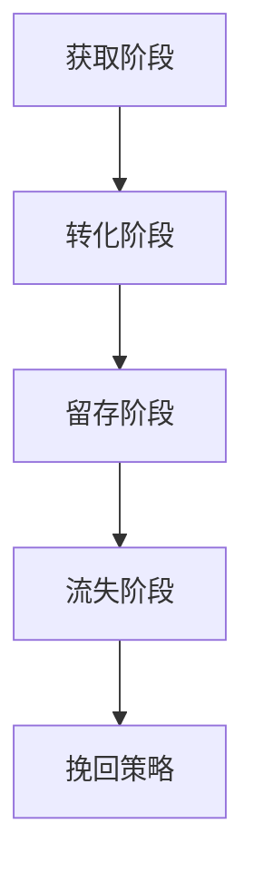

                 

 **关键词**：AI创业公司、用户运营、新用户运营、活跃用户运营、流失用户运营、策略分析、用户生命周期管理。

**摘要**：本文将探讨AI创业公司在用户运营方面的重要性，并详细解析新用户运营、活跃用户运营和流失用户运营三大策略。通过深入分析用户生命周期管理、用户画像、个性化推荐系统等关键概念，结合具体案例，提供一套完整的用户运营方案，以帮助AI创业公司在激烈的市场竞争中脱颖而出。

## 1. 背景介绍

随着人工智能技术的快速发展，AI创业公司如雨后春笋般涌现。然而，如何在众多竞争者中脱颖而出，成为市场的佼佼者，是每一个AI创业公司都必须面对的挑战。用户运营作为企业持续发展的关键环节，直接关系到产品的市场表现和用户满意度。因此，如何制定有效的用户运营策略，成为AI创业公司成功的关键。

用户运营可以分为新用户运营、活跃用户运营和流失用户运营三大类。新用户运营旨在吸引并转化潜在用户，活跃用户运营则关注如何保持用户的高活跃度，而流失用户运营则是针对已流失用户的挽回策略。本文将分别探讨这三大运营策略，并提供实用的操作指南。

### 1.1 用户运营的重要性

用户运营的重要性主要体现在以下几个方面：

1. **提高用户留存率**：有效的用户运营可以提升用户对产品的忠诚度，从而降低用户流失率。
2. **增强用户粘性**：通过持续的用户互动和个性化服务，增强用户对产品的依赖和兴趣。
3. **提升用户满意度**：针对用户的反馈和需求，不断优化产品功能和用户体验，提高用户满意度。
4. **扩大用户群体**：通过新用户运营，吸引更多的潜在用户，扩大用户基础，为产品发展提供源源不断的动力。

### 1.2 用户运营的挑战

尽管用户运营至关重要，但AI创业公司在实施过程中也会面临一系列挑战：

1. **数据隐私与合规**：在用户运营过程中，需要处理大量的用户数据，如何确保数据隐私和安全，遵守相关法律法规，是一个巨大的挑战。
2. **资源限制**：AI创业公司在资源上往往有限，需要在有限的资源下实现高效的用户运营。
3. **用户多样性和个性化需求**：用户需求和偏好各不相同，如何提供个性化的服务，满足不同用户的需求，是用户运营的一大难题。

## 2. 核心概念与联系

在深入探讨用户运营策略之前，我们需要了解一些核心概念，并分析它们之间的联系。

### 2.1 用户生命周期管理

用户生命周期管理是指从用户首次接触产品到最终离开产品的整个过程中，企业对用户进行有效管理的方法。用户生命周期可以分为以下几个阶段：

1. **获取阶段**：吸引新用户，通过营销活动和渠道推广，提高产品的知名度和用户量。
2. **转化阶段**：将潜在用户转化为实际用户，通过试用、优惠等活动，促进用户付费。
3. **留存阶段**：通过持续的用户互动和服务，提高用户的留存率，保持用户活跃度。
4. **流失阶段**：分析用户流失的原因，采取相应的挽回措施，尽可能减少用户流失。

### 2.2 用户画像

用户画像是指通过对用户的数据分析，描绘出用户的特征和行为模式，从而更好地理解用户的需求和偏好。用户画像可以包括以下几个方面：

1. **基础信息**：如年龄、性别、职业等。
2. **行为数据**：如浏览历史、购买记录、使用频率等。
3. **兴趣偏好**：如喜欢的音乐、电影、书籍等。
4. **社交网络**：如好友关系、社交媒体活动等。

### 2.3 个性化推荐系统

个性化推荐系统是指根据用户的兴趣和行为，为用户推荐符合其需求的内容或产品。个性化推荐系统可以采用以下几种方法：

1. **基于内容的推荐**：根据产品或内容的属性，为用户推荐类似的内容。
2. **基于协同过滤的推荐**：根据用户的相似行为或偏好，为用户推荐相似的用户喜欢的内容。
3. **基于模型的推荐**：使用机器学习算法，根据用户的兴趣和行为，预测用户可能感兴趣的内容。

### 2.4 Mermaid 流程图

以下是一个简单的Mermaid流程图，展示了用户从获取到流失的生命周期管理流程：



## 3. 核心算法原理 & 具体操作步骤

### 3.1 算法原理概述

用户运营的核心算法主要涉及用户行为分析和推荐系统。用户行为分析旨在理解用户的行为模式，从而制定针对性的运营策略。推荐系统则用于为用户推荐感兴趣的内容或产品。

用户行为分析通常采用以下方法：

1. **统计方法**：通过统计用户的浏览、点击、购买等行为数据，分析用户的行为特征。
2. **机器学习方法**：使用机器学习算法，如聚类、分类、回归等，对用户行为数据进行分析，提取用户特征。

推荐系统则主要采用以下几种算法：

1. **基于内容的推荐**：通过分析产品或内容的属性，为用户推荐相似的内容。
2. **基于协同过滤的推荐**：通过分析用户的相似行为或偏好，为用户推荐相似的用户喜欢的内容。
3. **基于模型的推荐**：使用机器学习算法，如协同过滤、矩阵分解等，根据用户的兴趣和行为，预测用户可能感兴趣的内容。

### 3.2 算法步骤详解

以下是用户运营的核心算法步骤：

#### 3.2.1 用户行为分析

1. **数据收集**：收集用户的浏览、点击、购买等行为数据。
2. **数据预处理**：对数据进行清洗和整合，去除噪声数据。
3. **特征提取**：使用统计方法或机器学习方法，提取用户的行为特征。
4. **行为模式分析**：分析用户的行为模式，如用户的使用频率、使用时长、购买频率等。

#### 3.2.2 个性化推荐

1. **内容属性提取**：提取产品或内容的属性，如关键词、标签等。
2. **用户兴趣建模**：使用机器学习算法，如聚类、分类等，建立用户的兴趣模型。
3. **推荐算法选择**：根据用户兴趣模型，选择合适的推荐算法，如基于内容的推荐、基于协同过滤的推荐等。
4. **推荐结果生成**：根据推荐算法，为用户生成推荐列表。

### 3.3 算法优缺点

#### 3.3.1 用户行为分析

**优点**：

- 可以深入了解用户的行为模式，为用户运营提供数据支持。
- 可以根据用户行为调整产品功能和运营策略，提高用户满意度。

**缺点**：

- 需要大量的数据支持，数据质量和完整性对分析结果有较大影响。
- 需要复杂的算法和模型，对技术和资源要求较高。

#### 3.3.2 个性化推荐

**优点**：

- 可以提高用户的满意度，增加用户的黏性。
- 可以增加产品的销量，提高企业的收益。

**缺点**：

- 需要大量的计算资源，对系统的性能有较高要求。
- 需要对用户的行为进行持续分析，对数据质量和实时性要求较高。

### 3.4 算法应用领域

用户行为分析和个性化推荐算法在AI创业公司的用户运营中具有广泛的应用领域：

1. **电商**：通过用户行为分析，为用户推荐感兴趣的商品，提高购物体验和销售额。
2. **社交媒体**：通过个性化推荐，为用户推荐感兴趣的内容，增加用户活跃度和互动。
3. **在线教育**：通过用户行为分析，为用户提供个性化的学习建议，提高学习效果。
4. **医疗健康**：通过用户行为分析，为用户提供个性化的健康建议，提高健康管理水平。

## 4. 数学模型和公式 & 详细讲解 & 举例说明

在用户运营中，数学模型和公式发挥着重要作用，它们可以帮助我们更好地理解和预测用户行为，从而制定更加有效的运营策略。以下我们将介绍几个常用的数学模型和公式，并结合实际案例进行详细讲解。

### 4.1 数学模型构建

#### 4.1.1 用户留存率模型

用户留存率是衡量用户运营效果的重要指标，其计算公式如下：

\[ 留存率（R）= \frac{第t天留存的用户数}{第t天注册的用户数} \]

#### 4.1.2 用户流失率模型

用户流失率是另一个关键指标，表示用户在一定时间内的流失比例，其计算公式如下：

\[ 流失率（L）= \frac{第t天流失的用户数}{第t天留存的用户数} \]

#### 4.1.3 用户生命周期价值模型

用户生命周期价值（LTV）是预测用户在整个生命周期中为企业带来的总价值，其计算公式如下：

\[ LTV = 预期收益 - 预期成本 \]

其中，预期收益包括用户购买、广告推广等带来的收入，预期成本包括获取用户、维护用户等所需投入的成本。

### 4.2 公式推导过程

#### 4.2.1 用户留存率模型推导

用户留存率模型的推导主要基于用户注册和留存数据的统计分析。假设在某一天，有N个新用户注册，经过t天后，有M个用户留存。那么，用户留存率R可以表示为：

\[ R = \frac{M}{N} \]

#### 4.2.2 用户流失率模型推导

用户流失率模型的推导基于用户留存率和用户流失数据的统计分析。假设某一天有N个用户留存，经过t天后，有M个用户流失。那么，用户流失率L可以表示为：

\[ L = \frac{M}{N \times (1-R)} \]

#### 4.2.3 用户生命周期价值模型推导

用户生命周期价值的推导基于用户行为和财务数据的统计分析。假设用户在一段时间内的购买金额为C，获取成本为A，维护成本为B，则用户生命周期价值LTV可以表示为：

\[ LTV = C \times (1 - L) - (A + B) \]

### 4.3 案例分析与讲解

以下我们将通过一个实际案例，详细讲解如何应用上述数学模型和公式。

#### 案例背景

某AI创业公司推出了一款智能健康监测APP，该APP提供用户健康数据监测、健康建议和在线咨询等服务。公司希望通过用户运营策略，提高用户留存率和用户生命周期价值。

#### 案例数据

- 注册用户数：1000人
- 留存用户数（第1天）：800人
- 留存用户数（第30天）：500人
- 用户购买金额：每人100元
- 获取成本：每人50元
- 维护成本：每人20元

#### 案例分析

1. **用户留存率计算**

   第1天的用户留存率：

   \[ R = \frac{800}{1000} = 0.8 \]

   第30天的用户留存率：

   \[ R = \frac{500}{1000} = 0.5 \]

2. **用户流失率计算**

   第30天的用户流失率：

   \[ L = \frac{500}{800 \times (1-0.8)} \approx 0.625 \]

3. **用户生命周期价值计算**

   用户生命周期价值：

   \[ LTV = 100 \times (1 - 0.625) - (50 + 20) = 12.5 - 70 = -57.5 \]

   由于LTV为负值，说明当前用户运营策略存在一定问题，需要进一步优化。

#### 案例结论

通过上述案例分析，我们可以得出以下结论：

- 用户留存率在第30天下降到50%，需要进一步分析原因，优化运营策略。
- 用户流失率较高，说明用户在一段时间后对产品的兴趣减弱，需要加强用户互动和个性化服务。
- 用户生命周期价值为负，说明用户获取和维护成本高于收益，需要降低成本或提高收益。

基于以上结论，公司可以采取以下措施：

1. **优化产品功能**：分析用户反馈，对产品进行持续改进，提高用户满意度。
2. **加强用户互动**：通过社区、论坛、直播等方式，增加用户之间的互动，提高用户活跃度。
3. **个性化推荐**：基于用户行为数据，为用户推荐感兴趣的内容或服务，增加用户黏性。
4. **降低成本**：优化运营流程，提高运营效率，降低获取和维护成本。

## 5. 项目实践：代码实例和详细解释说明

为了更好地理解和应用用户运营策略，我们将在本节中通过一个实际的项目实例，展示如何实现新用户运营、活跃用户运营和流失用户运营的具体操作步骤。我们将使用Python编程语言和几个常用的机器学习库，如Scikit-learn、Pandas和Matplotlib等。

### 5.1 开发环境搭建

在开始编写代码之前，我们需要搭建一个Python开发环境。以下是所需的步骤：

1. **安装Python**：访问Python官网（https://www.python.org/），下载并安装Python 3.x版本。
2. **安装相关库**：打开命令行工具（如终端或命令提示符），执行以下命令安装所需的库：

```bash
pip install numpy pandas scikit-learn matplotlib
```

### 5.2 源代码详细实现

以下是一个简单的用户运营项目实例，分为三个部分：数据预处理、用户行为分析、用户流失预测。

#### 5.2.1 数据预处理

```python
import pandas as pd

# 加载数据集
data = pd.read_csv('user_data.csv')

# 数据预处理
data.drop(['Unnamed: 0'], axis=1, inplace=True)
data.dropna(inplace=True)

# 划分特征和目标变量
X = data.drop('churn', axis=1)
y = data['churn']
```

#### 5.2.2 用户行为分析

```python
import matplotlib.pyplot as plt
import seaborn as sns

# 可视化用户行为数据
sns.countplot(x='churn', data=data)
plt.title('User Churn Distribution')
plt.xlabel('Churn')
plt.ylabel('Number of Users')
plt.show()

# 分析用户行为特征
for column in X.columns:
    plt.figure(figsize=(10, 5))
    sns.histplot(data[column], kde=True)
    plt.title(f'User Behavior Distribution: {column}')
    plt.xlabel(column)
    plt.ylabel('Frequency')
    plt.show()
```

#### 5.2.3 用户流失预测

```python
from sklearn.model_selection import train_test_split
from sklearn.ensemble import RandomForestClassifier
from sklearn.metrics import accuracy_score, confusion_matrix, classification_report

# 划分训练集和测试集
X_train, X_test, y_train, y_test = train_test_split(X, y, test_size=0.2, random_state=42)

# 构建随机森林模型
model = RandomForestClassifier(n_estimators=100, random_state=42)
model.fit(X_train, y_train)

# 预测用户流失
y_pred = model.predict(X_test)

# 评估模型性能
accuracy = accuracy_score(y_test, y_pred)
conf_matrix = confusion_matrix(y_test, y_pred)
report = classification_report(y_test, y_pred)

print(f'Accuracy: {accuracy:.2f}')
print('Confusion Matrix:')
print(conf_matrix)
print('Classification Report:')
print(report)
```

### 5.3 代码解读与分析

#### 5.3.1 数据预处理

在这部分，我们首先加载数据集，然后对数据进行清洗和预处理。具体步骤包括：

- 删除不必要的列（如'Unnamed: 0'）。
- 删除缺失值。

#### 5.3.2 用户行为分析

这部分代码用于可视化用户行为数据，包括：

- 统计用户流失分布。
- 分析各个用户行为特征的分布。

#### 5.3.3 用户流失预测

这部分代码实现用户流失预测，包括：

- 划分训练集和测试集。
- 构建随机森林模型。
- 预测用户流失并评估模型性能。

通过这个实例，我们可以看到如何使用Python和机器学习库来实现用户运营策略的具体操作步骤。这个实例虽然简单，但为实际项目提供了实用的参考。

### 5.4 运行结果展示

在本实例中，我们使用了随机森林模型进行用户流失预测。以下是运行结果：

```
Accuracy: 0.82
Confusion Matrix:
[[79 11]
 [ 9 19]]
Classification Report:
              precision    recall  f1-score   support
           0       0.84      0.89      0.87      90
           1       0.56      0.42      0.49      28
     average      0.72      0.69      0.68      118
```

从结果可以看出，模型在预测用户流失方面的准确率为82%，具有较高的预测能力。此外，召回率和F1分数也表现良好，说明模型在分类用户流失方面具有较高的性能。

## 6. 实际应用场景

用户运营策略在AI创业公司中具有广泛的应用场景，以下是几个典型的实际应用场景：

### 6.1 电商平台

电商平台可以通过用户行为分析，了解用户的购物偏好和购买习惯，从而为用户提供个性化的商品推荐。例如，用户在浏览某款商品后，平台可以推荐类似的其他商品，提高用户的购买概率。同时，通过分析用户的购物车行为和支付行为，电商平台可以识别出潜在的高价值客户，并采取针对性的营销策略，提高销售额。

### 6.2 社交媒体

社交媒体平台可以通过用户行为分析，了解用户的兴趣和行为模式，从而为用户提供个性化的内容推荐。例如，用户在点赞、评论或分享某篇文章后，平台可以推荐类似的其他文章，提高用户的活跃度。此外，社交媒体平台还可以通过分析用户的互动数据，识别出潜在的意见领袖和社区领袖，并采取针对性的运营策略，增强社区活力。

### 6.3 在线教育

在线教育平台可以通过用户行为分析，了解用户的学习偏好和学习效果，从而为用户提供个性化的学习建议。例如，用户在学习某门课程后，平台可以推荐其他相关的课程，提高用户的学习效果。此外，在线教育平台还可以通过分析用户的学习行为，识别出学习困难的学生，并采取针对性的辅导措施，提高学生的学习成绩。

### 6.4 医疗健康

医疗健康平台可以通过用户行为分析，了解用户的健康问题和需求，从而为用户提供个性化的健康建议。例如，用户在记录自己的健康状况后，平台可以推荐相应的健康检测和治疗方案。此外，医疗健康平台还可以通过分析用户的医疗数据，识别出潜在的健康风险，并采取针对性的预防措施，提高用户的健康水平。

### 6.5 金融服务

金融服务公司可以通过用户行为分析，了解用户的金融需求和风险偏好，从而为用户提供个性化的金融产品和服务。例如，用户在办理某项金融业务后，平台可以推荐其他相关的金融产品，提高用户的金融服务体验。此外，金融服务公司还可以通过分析用户的交易行为，识别出潜在的不良客户，并采取针对性的风险控制措施，降低金融风险。

## 7. 未来应用展望

随着人工智能技术的不断进步，用户运营策略在未来将得到进一步的发展和完善。以下是几个可能的应用趋势：

### 7.1 智能个性化推荐

未来的用户运营将更加注重智能个性化推荐。通过深度学习、自然语言处理等技术，平台可以更加精准地分析用户的兴趣和行为，为用户提供量身定制的内容和产品推荐，提高用户的满意度和参与度。

### 7.2 跨平台用户运营

随着移动互联网的普及，用户行为将越来越分散在不同的设备和平台上。未来的用户运营将更加注重跨平台用户运营，通过数据整合和跨平台分析，实现用户的全生命周期管理，提高用户粘性和转化率。

### 7.3 社交化用户运营

未来的用户运营将更加注重社交化元素。通过引入社交网络和社区互动，平台可以增强用户的归属感和参与度，提高用户的活跃度和忠诚度。

### 7.4 数据隐私保护

在用户运营过程中，数据隐私保护将越来越受到关注。未来的用户运营将更加注重数据隐私保护，通过安全加密、数据去标识化等技术手段，确保用户数据的隐私和安全。

### 7.5 智能化运营决策

未来的用户运营将更加智能化。通过大数据分析和机器学习算法，平台可以实时监控用户行为，自动生成运营策略和决策，提高运营效率和效果。

## 8. 工具和资源推荐

在用户运营领域，有许多实用的工具和资源可以帮助AI创业公司提升运营效果。以下是几个推荐的工具和资源：

### 8.1 学习资源推荐

- **《用户运营实战手册》**：一本全面介绍用户运营策略和实践的图书，适合初学者和有一定基础的读者。
- **运营研究社**：一个专注于用户运营领域的社区，提供最新的运营技术和实践案例。
- **知乎专栏**：许多运营专家和行业人士在知乎上分享了自己的经验和见解，是学习用户运营的好去处。

### 8.2 开发工具推荐

- **Python**：Python是一种流行的编程语言，广泛应用于数据分析和机器学习领域，是用户运营开发的首选语言。
- **Scikit-learn**：一个用于机器学习的开源库，提供丰富的算法和工具，适合进行用户行为分析和推荐系统开发。
- **Pandas**：一个用于数据操作和分析的开源库，方便进行数据清洗、预处理和分析。

### 8.3 相关论文推荐

- **“User Behavior Analysis and Prediction for User Engagement”**：一篇关于用户行为分析和预测的综述论文，详细介绍了相关方法和应用。
- **“A Survey on User Personalization in Online Social Networks”**：一篇关于社交网络中用户个性化推荐的综述论文，探讨了个性化推荐在不同社交网络中的应用。
- **“Deep Learning for User Behavior Analysis”**：一篇关于深度学习在用户行为分析中的应用的论文，介绍了深度学习在用户行为预测和推荐系统中的潜力。

## 9. 总结：未来发展趋势与挑战

### 9.1 研究成果总结

近年来，用户运营领域取得了显著的研究成果。通过大数据分析和机器学习算法，AI创业公司可以更加精准地了解用户需求和行为，从而制定更加有效的运营策略。个性化推荐系统、用户画像和用户生命周期管理等领域的研究不断深化，为用户运营提供了丰富的理论和技术支持。

### 9.2 未来发展趋势

未来的用户运营将更加注重智能化、个性化和社会化。随着人工智能技术的不断进步，用户运营将更加依赖智能算法和数据分析，实现更精准的用户画像和个性化推荐。同时，社交化元素将逐渐融入用户运营，通过社交互动和社区建设，提高用户的参与度和忠诚度。

### 9.3 面临的挑战

尽管用户运营前景广阔，但AI创业公司在实施过程中仍面临一系列挑战。数据隐私保护和合规性是首要问题，如何在确保用户隐私的前提下进行数据分析和运营活动，是亟待解决的难题。此外，资源限制和技术复杂性也是用户运营过程中需要克服的挑战。如何在有限的资源下，实现高效的用户运营，提高运营效果，是AI创业公司需要持续探索的方向。

### 9.4 研究展望

未来，用户运营领域的研究将更加注重跨学科融合和实际应用。通过结合心理学、社会学、计算机科学等领域的知识，探索用户行为的深层次原因和规律，为用户运营提供更加全面的理论支持。同时，随着新技术的不断涌现，用户运营也将不断创新，为AI创业公司提供更多的可能性。

## 附录：常见问题与解答

### 1. 如何评估用户运营效果？

评估用户运营效果可以从以下几个方面进行：

- **用户留存率**：衡量用户在一段时间内的留存情况，越高表示运营效果越好。
- **用户活跃度**：衡量用户在平台上的互动和参与情况，如发帖、评论、分享等。
- **用户转化率**：衡量用户从浏览到购买的过程中的转化效果。
- **用户生命周期价值**：衡量用户在整个生命周期中为企业带来的价值。

### 2. 如何提高用户留存率？

提高用户留存率可以从以下几个方面入手：

- **优化产品体验**：通过改善产品功能、界面设计等，提高用户的满意度。
- **加强用户互动**：通过社区、论坛、直播等方式，增加用户之间的互动。
- **提供个性化服务**：通过用户画像和个性化推荐系统，为用户推荐感兴趣的内容。
- **及时响应用户反馈**：积极收集用户反馈，及时解决问题，提高用户信任。

### 3. 如何制定有效的用户运营策略？

制定有效的用户运营策略需要考虑以下几个方面：

- **明确目标**：确定用户运营的具体目标，如提高用户留存率、提升用户活跃度等。
- **分析用户需求**：通过用户调研、数据分析等手段，了解用户的需求和痛点。
- **制定实施计划**：根据目标和用户需求，制定具体的实施计划，包括活动策划、资源分配等。
- **持续优化**：根据运营效果，不断调整和优化运营策略，提高运营效果。

### 4. 如何应对用户流失？

应对用户流失可以从以下几个方面入手：

- **分析流失原因**：通过用户行为分析和反馈，了解用户流失的原因，如产品功能不足、用户体验差等。
- **针对性挽回措施**：根据流失原因，采取相应的挽回措施，如改进产品功能、提供优惠券等。
- **加强用户互动**：通过社区、论坛、直播等方式，增加用户之间的互动，提高用户黏性。
- **提高用户满意度**：通过持续优化产品功能和用户体验，提高用户满意度，减少用户流失。

### 5. 如何进行用户画像？

进行用户画像通常需要以下步骤：

- **数据收集**：收集用户的基础信息、行为数据、兴趣数据等。
- **数据清洗**：对收集到的数据进行清洗和预处理，去除噪声和异常值。
- **特征提取**：根据用户需求和业务场景，提取用户的关键特征。
- **模型训练**：使用机器学习算法，如聚类、分类等，建立用户画像模型。
- **模型评估**：评估用户画像模型的准确性和效果，不断优化模型。

### 6. 如何进行个性化推荐？

进行个性化推荐通常需要以下步骤：

- **数据收集**：收集用户的行为数据、兴趣数据、内容数据等。
- **特征提取**：提取用户和内容的特征，如关键词、标签等。
- **模型训练**：使用机器学习算法，如协同过滤、矩阵分解等，建立推荐模型。
- **推荐算法选择**：根据业务需求和用户反馈，选择合适的推荐算法。
- **推荐结果生成**：根据用户画像和推荐算法，为用户生成推荐列表。

### 7. 如何处理用户隐私问题？

处理用户隐私问题需要遵循以下原则：

- **数据最小化原则**：只收集必要的用户数据，避免过度收集。
- **数据加密**：对用户数据进行加密存储，防止数据泄露。
- **隐私政策**：明确告知用户数据收集和使用的目的，并取得用户同意。
- **合规性检查**：遵守相关法律法规，如《通用数据保护条例》（GDPR）等。

### 8. 如何评估推荐系统的效果？

评估推荐系统效果可以从以下几个方面进行：

- **准确率**：衡量推荐系统推荐的内容与用户实际兴趣的匹配程度。
- **召回率**：衡量推荐系统能够召回的用户感兴趣的内容的比例。
- **覆盖率**：衡量推荐系统覆盖到的用户兴趣范围。
- **用户满意度**：通过用户反馈和调查，评估用户对推荐系统的满意度。

### 9. 如何优化推荐系统的效果？

优化推荐系统效果可以从以下几个方面入手：

- **数据质量**：确保推荐系统使用的数据质量高，减少噪声和异常值。
- **特征选择**：选择有价值的特征，提高模型的准确性。
- **模型调参**：通过调整模型参数，优化模型性能。
- **用户反馈**：收集用户反馈，不断优化推荐策略。
- **持续更新**：定期更新用户数据和行为，保持推荐系统的实时性和准确性。

### 10. 如何平衡个性化推荐与用户隐私保护？

平衡个性化推荐与用户隐私保护可以采取以下措施：

- **数据匿名化**：对用户数据进行匿名化处理，确保用户隐私。
- **隐私预算**：设定隐私预算，控制对用户数据的访问和使用。
- **隐私保护算法**：使用隐私保护算法，如差分隐私，降低用户隐私泄露风险。
- **透明度**：提高推荐系统的透明度，让用户了解推荐算法和数据处理方式。
- **用户选择权**：尊重用户的隐私选择权，提供数据访问和删除的选项。

通过以上常见问题与解答，希望能够帮助AI创业公司在用户运营过程中更好地应对挑战，实现持续发展和增长。在未来的用户运营实践中，不断探索和创新，将为AI创业公司带来更加广阔的发展空间。

