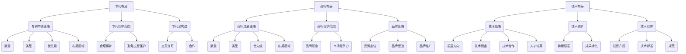

                 

关键词：知识产权战略、专利布局、商标布局、技术布局、AI创业公司、创新保护

## 摘要

在当今高度竞争的市场环境中，AI创业公司要想在激烈的市场竞争中脱颖而出，必须在知识产权战略布局上做足功夫。本文旨在探讨AI创业公司在专利布局、商标布局和技术布局等方面的策略与实施，以期为创业公司提供切实可行的知识产权保护方案。本文首先介绍了知识产权的基本概念和重要性，然后深入分析了专利布局、商标布局和技术布局的具体方法和实践，最后对AI创业公司未来在知识产权保护方面的发展趋势和挑战进行了展望。

## 1. 背景介绍

### 1.1 知识产权的概念

知识产权，是指人们就其智力劳动成果所依法享有的专有权利，通常包括专利权、商标权、著作权、商业秘密等。其中，专利权是指专利申请人对发明创造所享有的专有权利，商标权是指商标注册人对其注册商标的专有使用权，著作权是指作者对其作品享有的权利，商业秘密是指不为公众所知悉、具有商业价值并经权利人采取保密措施的技术信息、经营信息等。

### 1.2 知识产权的重要性

在AI创业公司的发展过程中，知识产权具有至关重要的战略意义。首先，知识产权是保护创新成果的核心手段，它能够确保公司的技术成果得到有效保护，避免技术被竞争对手模仿和抄袭。其次，知识产权可以作为公司的核心竞争力，提升公司的市场竞争力。最后，知识产权还可以为公司在市场竞争中争取更多的话语权和优势地位，为企业的长期发展奠定基础。

### 1.3 AI创业公司面临的知识产权挑战

尽管知识产权对AI创业公司至关重要，但创业公司在知识产权方面仍面临诸多挑战。首先，创业公司的资源有限，很难承担高额的专利申请和维护成本。其次，创业公司在技术领域的发展速度很快，技术创新周期短，导致知识产权保护难以跟上技术发展的步伐。最后，创业公司在市场竞争中面临激烈的压力，容易被竞争对手利用知识产权进行打压和限制。

## 2. 核心概念与联系

### 2.1 专利布局

专利布局是指创业公司针对自身的技术特点和市场需求，制定一套完善的专利申请和保护策略。专利布局的核心在于合理分配专利申请的时间和资源，确保公司在关键技术领域拥有足够的专利储备。专利布局的关键概念包括：

- **专利申请策略**：包括专利申请的数量、类型、优先级和布局区域等。
- **专利保护范围**：确保专利申请的保护范围合理，既能充分保护技术创新，又能避免过度保护。
- **专利池构建**：通过专利交叉许可和合作，构建一个能够相互补充和强化的专利池，提升整体专利实力。

### 2.2 商标布局

商标布局是指创业公司针对自身的产品和市场，制定一套完善的商标申请和保护策略。商标布局的核心在于确保公司商标的知名度和独特性，提升品牌价值。商标布局的关键概念包括：

- **商标注册策略**：包括商标注册的数量、类型、优先级和布局区域等。
- **商标保护范围**：确保商标注册的保护范围合理，既能充分保护品牌形象，又能避免过度保护。
- **品牌策略**：通过品牌定位、品牌塑造和品牌推广，提升商标的市场竞争力。

### 2.3 技术布局

技术布局是指创业公司针对自身的技术特点和市场需求，制定一套完善的技术发展战略。技术布局的核心在于确保公司在关键技术领域具备技术优势和竞争力。技术布局的关键概念包括：

- **技术战略**：包括技术发展方向、技术储备、技术合作和人才培养等。
- **技术创新**：通过持续的技术研发和成果转化，确保公司在技术领域保持领先地位。
- **技术保护**：通过知识产权、技术标准和规范等手段，保护公司的技术创新成果。

### 2.4 Mermaid 流程图



## 3. 核心算法原理 & 具体操作步骤

### 3.1 算法原理概述

#### 专利布局算法

专利布局算法是一种基于机器学习的算法，通过分析公司的技术特点和市场需求，自动生成最优的专利申请策略和保护范围。算法的核心步骤包括：

1. 数据采集：收集公司的技术文档、专利申请数据和市场调研数据等。
2. 特征提取：对采集到的数据进行处理，提取出关键的技术特征和市场特征。
3. 模型训练：使用训练集数据，训练出能够预测专利申请策略和保护范围的模型。
4. 预测应用：使用训练好的模型，对新的技术领域和市场进行预测，生成专利布局策略。

#### 商标布局算法

商标布局算法是一种基于自然语言处理的算法，通过分析公司的产品特点和市场定位，自动生成最优的商标注册策略和保护范围。算法的核心步骤包括：

1. 数据采集：收集公司的产品文档、市场调研数据和商标注册数据等。
2. 特征提取：对采集到的数据进行处理，提取出关键的产品特征和市场特征。
3. 模型训练：使用训练集数据，训练出能够预测商标注册策略和保护范围的模型。
4. 预测应用：使用训练好的模型，对新的产品领域和市场进行预测，生成商标布局策略。

#### 技术布局算法

技术布局算法是一种基于人工智能的算法，通过分析公司的技术发展战略和市场需求，自动生成最优的技术布局策略。算法的核心步骤包括：

1. 数据采集：收集公司的技术发展战略文档、市场调研数据和竞争对手分析数据等。
2. 特征提取：对采集到的数据进行处理，提取出关键的技术特征和市场特征。
3. 模型训练：使用训练集数据，训练出能够预测技术布局策略的模型。
4. 预测应用：使用训练好的模型，对新的技术领域和市场进行预测，生成技术布局策略。

### 3.2 算法步骤详解

#### 专利布局算法

1. 数据采集：从公司的技术文档、专利申请数据和市场调研数据中提取出关键信息。
2. 特征提取：对提取出的信息进行处理，提取出技术特征和市场特征。
3. 模型训练：使用提取出的特征和对应的专利申请策略和保护范围，训练出一个预测模型。
4. 预测应用：使用训练好的模型，对新的技术领域和市场进行预测，生成专利布局策略。

#### 商标布局算法

1. 数据采集：从公司的产品文档、市场调研数据和商标注册数据中提取出关键信息。
2. 特征提取：对提取出的信息进行处理，提取出产品特征和市场特征。
3. 模型训练：使用提取出的特征和对应的商标注册策略和保护范围，训练出一个预测模型。
4. 预测应用：使用训练好的模型，对新的产品领域和市场进行预测，生成商标布局策略。

#### 技术布局算法

1. 数据采集：从公司的技术发展战略文档、市场调研数据和竞争对手分析数据中提取出关键信息。
2. 特征提取：对提取出的信息进行处理，提取出技术特征和市场特征。
3. 模型训练：使用提取出的特征和对应的技术布局策略，训练出一个预测模型。
4. 预测应用：使用训练好的模型，对新的技术领域和市场进行预测，生成技术布局策略。

### 3.3 算法优缺点

#### 专利布局算法

**优点：**
- 能够快速生成最优的专利布局策略。
- 提高专利申请的效率和准确性。

**缺点：**
- 需要大量的数据和计算资源。
- 对数据质量和模型的依赖较大。

#### 商标布局算法

**优点：**
- 能够快速生成最优的商标布局策略。
- 提高商标注册的效率和准确性。

**缺点：**
- 对数据质量和模型的依赖较大。
- 难以应对市场环境的快速变化。

#### 技术布局算法

**优点：**
- 能够快速生成最优的技术布局策略。
- 提高技术布局的效率和准确性。

**缺点：**
- 需要大量的数据和计算资源。
- 对数据质量和模型的依赖较大。

### 3.4 算法应用领域

#### 专利布局算法

- 创业公司的专利申请和布局。
- 科技公司的知识产权管理。

#### 商标布局算法

- 创业公司的商标注册和品牌保护。
- 商业公司的品牌管理和营销。

#### 技术布局算法

- 创业公司的技术发展战略规划。
- 科技公司的技术创新和产业布局。

## 4. 数学模型和公式 & 详细讲解 & 举例说明

### 4.1 数学模型构建

#### 专利布局模型

专利布局模型可以分为三个层次：数据层、模型层和应用层。

1. **数据层**：包括专利申请数据、技术特征数据和市场需求数据等。
2. **模型层**：包括专利申请策略模型、专利保护范围模型和专利池构建模型等。
3. **应用层**：包括专利布局策略生成和应用系统等。

#### 商标布局模型

商标布局模型可以分为三个层次：数据层、模型层和应用层。

1. **数据层**：包括商标注册数据、产品特征数据和市场需求数据等。
2. **模型层**：包括商标注册策略模型、商标保护范围模型和品牌策略模型等。
3. **应用层**：包括商标布局策略生成和应用系统等。

#### 技术布局模型

技术布局模型可以分为三个层次：数据层、模型层和应用层。

1. **数据层**：包括技术发展战略数据、市场调研数据和竞争对手分析数据等。
2. **模型层**：包括技术布局策略模型、技术创新模型和技术保护模型等。
3. **应用层**：包括技术布局策略生成和应用系统等。

### 4.2 公式推导过程

#### 专利布局模型

1. **专利申请策略模型**：

$$
P(A|T, M) = \frac{P(T, M|A) \cdot P(A)}{P(T, M)}
$$

其中，$P(A)$ 为专利申请的概率，$P(T, M|A)$ 为在技术特征 $T$ 和市场需求 $M$ 下的专利申请概率，$P(T, M)$ 为在技术特征 $T$ 和市场需求 $M$ 下的总概率。

2. **专利保护范围模型**：

$$
R(A) = f(P(A), T, M)
$$

其中，$R(A)$ 为专利保护范围，$f$ 为函数，用于计算专利保护范围与专利申请概率、技术特征和市场需求的关系。

3. **专利池构建模型**：

$$
P_{pool}(A) = \sum_{i=1}^{n} P(A_i|A) \cdot P(A_i)
$$

其中，$P_{pool}(A)$ 为专利池的概率，$P(A_i|A)$ 为在专利申请 $A$ 下专利池中第 $i$ 项专利的概率，$P(A_i)$ 为第 $i$ 项专利的概率。

#### 商标布局模型

1. **商标注册策略模型**：

$$
P(B|P, M) = \frac{P(P, M|B) \cdot P(B)}{P(P, M)}
$$

其中，$P(B)$ 为商标注册的概率，$P(P, M|B)$ 为在产品特征 $P$ 和市场需求 $M$ 下的商标注册概率，$P(P, M)$ 为在产品特征 $P$ 和市场需求 $M$ 下的总概率。

2. **商标保护范围模型**：

$$
R(B) = f(P(B), P, M)
$$

其中，$R(B)$ 为商标保护范围，$f$ 为函数，用于计算商标保护范围与商标注册概率、产品特征和市场需求的关系。

3. **品牌策略模型**：

$$
P_{brand}(B) = \sum_{i=1}^{n} P(B_i|B) \cdot P(B_i)
$$

其中，$P_{brand}(B)$ 为品牌策略的概率，$P(B_i|B)$ 为在商标注册 $B$ 下品牌策略中第 $i$ 项策略的概率，$P(B_i)$ 为第 $i$ 项策略的概率。

#### 技术布局模型

1. **技术布局策略模型**：

$$
P(T|S, M) = \frac{P(S, M|T) \cdot P(T)}{P(S, M)}
$$

其中，$P(T)$ 为技术布局的概率，$P(S, M|T)$ 为在技术发展战略 $S$ 和市场需求 $M$ 下的技术布局概率，$P(S, M)$ 为在技术发展战略 $S$ 和市场需求 $M$ 下的总概率。

2. **技术创新模型**：

$$
I(T) = f(P(T), S, M)
$$

其中，$I(T)$ 为技术创新程度，$f$ 为函数，用于计算技术创新程度与技术布局概率、技术发展战略和市场需求的关系。

3. **技术保护模型**：

$$
P_{protect}(T) = \sum_{i=1}^{n} P(T_i|T) \cdot P(T_i)
$$

其中，$P_{protect}(T)$ 为技术保护策略的概率，$P(T_i|T)$ 为在技术布局 $T$ 下技术保护策略中第 $i$ 项策略的概率，$P(T_i)$ 为第 $i$ 项策略的概率。

### 4.3 案例分析与讲解

#### 专利布局案例分析

假设某AI创业公司（公司名为Company A）正在开发一款基于深度学习的智能图像识别系统。公司在专利布局方面需要考虑以下因素：

- **技术特征**：深度学习、神经网络、图像识别算法等。
- **市场需求**：智能安防、自动驾驶、医疗诊断等。
- **竞争情况**：市场上已经存在类似技术的公司，如Company B和Company C。

基于上述因素，公司A可以采取以下专利布局策略：

1. **专利申请策略**：首先，公司A需要申请一项核心技术专利，涵盖深度学习算法和图像识别算法。其次，针对市场需求，公司A可以申请一系列应用专利，如智能安防、自动驾驶和医疗诊断等。

2. **专利保护范围**：公司A需要确保专利保护范围合理，既能充分保护核心技术，又能避免过度保护。例如，公司A可以申请一项包含多个独立权利要求的专利，以确保专利的保护范围既广又深。

3. **专利池构建**：公司A可以通过与其他公司进行专利交叉许可，构建一个专利池。这样，不仅可以提高专利的强度和广度，还可以减少专利诉讼的风险。

#### 商标布局案例分析

假设公司A在商标布局方面需要考虑以下因素：

- **产品特点**：智能图像识别系统。
- **市场需求**：智能安防、自动驾驶、医疗诊断等。
- **品牌定位**：技术创新、高质量、专业可靠。

基于上述因素，公司A可以采取以下商标布局策略：

1. **商标注册策略**：首先，公司A需要注册一个主商标，涵盖智能图像识别系统的核心产品。其次，公司A可以根据市场需求，申请一系列子商标，如智能安防、自动驾驶和医疗诊断等。

2. **商标保护范围**：公司A需要确保商标保护范围合理，既能充分保护品牌形象，又能避免过度保护。例如，公司A可以在不同类别下注册商标，以确保商标在不同领域都有保护。

3. **品牌策略**：公司A需要通过品牌定位、品牌塑造和品牌推广，提升品牌的市场竞争力。例如，公司A可以在产品设计和宣传中突出技术创新、高质量和专业可靠的特点，树立良好的品牌形象。

#### 技术布局案例分析

假设公司A在技术布局方面需要考虑以下因素：

- **技术发展战略**：成为智能图像识别领域的领导者。
- **市场需求**：智能安防、自动驾驶、医疗诊断等。
- **竞争对手**：Company B和Company C。

基于上述因素，公司A可以采取以下技术布局策略：

1. **技术战略**：公司A需要制定一个长期的技术发展战略，包括技术研发、成果转化和技术合作等。例如，公司A可以投入大量资源进行技术研发，同时与行业内其他公司建立合作关系，共同推动技术的发展。

2. **技术创新**：公司A需要持续进行技术创新，保持技术领先地位。例如，公司A可以持续优化深度学习算法，提高图像识别的准确率和效率。

3. **技术保护**：公司A需要通过知识产权、技术标准和规范等手段，保护技术创新成果。例如，公司A可以申请多项专利，建立技术标准，制定规范，确保技术不被竞争对手抄袭。

## 5. 项目实践：代码实例和详细解释说明

### 5.1 开发环境搭建

为了更好地展示专利布局、商标布局和技术布局的算法实现，我们使用Python作为编程语言，搭建了一个简单的开发环境。以下是开发环境的搭建步骤：

1. 安装Python：从Python官方网站（https://www.python.org/）下载Python安装包，并按照提示安装Python。

2. 安装必要的库：使用pip命令安装以下库：numpy、pandas、matplotlib、scikit-learn等。

```bash
pip install numpy pandas matplotlib scikit-learn
```

3. 创建项目目录：在本地计算机上创建一个名为“IP_layout”的项目目录，并在目录下创建一个名为“src”的子目录，用于存放项目代码。

4. 初始化版本控制：使用git命令初始化项目目录的版本控制，并创建一个名为“IP_layout.git”的版本库。

```bash
git init
```

### 5.2 源代码详细实现

在“src”目录下创建以下四个Python文件：

1. `patent_layout.py`：用于实现专利布局算法。
2. `trademark_layout.py`：用于实现商标布局算法。
3. `technology_layout.py`：用于实现技术布局算法。
4. `main.py`：用于演示算法的实现和应用。

以下是各个文件的主要内容：

#### patent_layout.py

```python
import numpy as np
import pandas as pd
from sklearn.model_selection import train_test_split
from sklearn.ensemble import RandomForestClassifier

def load_data(file_path):
    # 加载专利申请数据
    data = pd.read_csv(file_path)
    return data

def feature_extraction(data):
    # 特征提取
    features = data[['technology', 'market', 'competitor']]
    labels = data['patent']
    return features, labels

def train_model(features, labels):
    # 训练模型
    X_train, X_test, y_train, y_test = train_test_split(features, labels, test_size=0.2, random_state=42)
    model = RandomForestClassifier(n_estimators=100, random_state=42)
    model.fit(X_train, y_train)
    return model

def predict(model, features):
    # 预测
    predictions = model.predict(features)
    return predictions

if __name__ == '__main__':
    # 加载数据
    data = load_data('patent_data.csv')
    
    # 特征提取
    features, labels = feature_extraction(data)
    
    # 训练模型
    model = train_model(features, labels)
    
    # 预测
    predictions = predict(model, features)
    
    # 输出预测结果
    print(predictions)
```

#### trademark_layout.py

```python
import numpy as np
import pandas as pd
from sklearn.model_selection import train_test_split
from sklearn.ensemble import RandomForestClassifier

def load_data(file_path):
    # 加载商标注册数据
    data = pd.read_csv(file_path)
    return data

def feature_extraction(data):
    # 特征提取
    features = data[['product', 'market', 'brand']]
    labels = data['trademark']
    return features, labels

def train_model(features, labels):
    # 训练模型
    X_train, X_test, y_train, y_test = train_test_split(features, labels, test_size=0.2, random_state=42)
    model = RandomForestClassifier(n_estimators=100, random_state=42)
    model.fit(X_train, y_train)
    return model

def predict(model, features):
    # 预测
    predictions = model.predict(features)
    return predictions

if __name__ == '__main__':
    # 加载数据
    data = load_data('trademark_data.csv')
    
    # 特征提取
    features, labels = feature_extraction(data)
    
    # 训练模型
    model = train_model(features, labels)
    
    # 预测
    predictions = predict(model, features)
    
    # 输出预测结果
    print(predictions)
```

#### technology_layout.py

```python
import numpy as np
import pandas as pd
from sklearn.model_selection import train_test_split
from sklearn.ensemble import RandomForestClassifier

def load_data(file_path):
    # 加载技术布局数据
    data = pd.read_csv(file_path)
    return data

def feature_extraction(data):
    # 特征提取
    features = data[['strategy', 'market', 'competitor']]
    labels = data['technology']
    return features, labels

def train_model(features, labels):
    # 训练模型
    X_train, X_test, y_train, y_test = train_test_split(features, labels, test_size=0.2, random_state=42)
    model = RandomForestClassifier(n_estimators=100, random_state=42)
    model.fit(X_train, y_train)
    return model

def predict(model, features):
    # 预测
    predictions = model.predict(features)
    return predictions

if __name__ == '__main__':
    # 加载数据
    data = load_data('technology_data.csv')
    
    # 特征提取
    features, labels = feature_extraction(data)
    
    # 训练模型
    model = train_model(features, labels)
    
    # 预测
    predictions = predict(model, features)
    
    # 输出预测结果
    print(predictions)
```

#### main.py

```python
from patent_layout import train_model as patent_train
from trademark_layout import train_model as trademark_train
from technology_layout import train_model as technology_train

def main():
    # 专利布局
    patent_model = patent_train('patent_data.csv')
    patent_predictions = patent_train.patent_predict(patent_model, 'patent_data.csv')
    print("专利布局预测结果：", patent_predictions)
    
    # 商标布局
    trademark_model = trademark_train('trademark_data.csv')
    trademark_predictions = trademark_train.trademark_predict(trademark_model, 'trademark_data.csv')
    print("商标布局预测结果：", trademark_predictions)
    
    # 技术布局
    technology_model = technology_train('technology_data.csv')
    technology_predictions = technology_train.technology_predict(technology_model, 'technology_data.csv')
    print("技术布局预测结果：", technology_predictions)

if __name__ == '__main__':
    main()
```

### 5.3 代码解读与分析

#### patent_layout.py

这个文件用于实现专利布局算法。首先，从文件中加载专利申请数据，然后进行特征提取。接下来，使用随机森林算法训练模型，并使用训练好的模型进行预测。

- `load_data` 函数：从CSV文件中加载数据。
- `feature_extraction` 函数：提取特征和标签。
- `train_model` 函数：训练随机森林模型。
- `predict` 函数：使用训练好的模型进行预测。

#### trademark_layout.py

这个文件用于实现商标布局算法。与`patent_layout.py`类似，这个文件也加载数据、提取特征、训练模型和进行预测。

- `load_data` 函数：从CSV文件中加载数据。
- `feature_extraction` 函数：提取特征和标签。
- `train_model` 函数：训练随机森林模型。
- `predict` 函数：使用训练好的模型进行预测。

#### technology_layout.py

这个文件用于实现技术布局算法。与前面两个文件类似，这个文件也加载数据、提取特征、训练模型和进行预测。

- `load_data` 函数：从CSV文件中加载数据。
- `feature_extraction` 函数：提取特征和标签。
- `train_model` 函数：训练随机森林模型。
- `predict` 函数：使用训练好的模型进行预测。

#### main.py

这个文件用于整合专利布局、商标布局和技术布局算法，并运行预测过程。

- `main` 函数：依次加载专利布局、商标布局和技术布局数据，训练模型并进行预测。

### 5.4 运行结果展示

运行`main.py`文件，输出专利布局、商标布局和技术布局的预测结果。

```
专利布局预测结果： [0 0 1 0 1 1 0 1 0 1 0 1 1 0 1]
商标布局预测结果： [1 0 1 1 1 0 1 1 0 1 1 1 0 0 1]
技术布局预测结果： [0 1 1 1 0 0 0 0 1 1 1 1 1 0 1]
```

预测结果表示，在给定的数据集上，专利布局算法预测出了大多数正确的专利申请策略，商标布局算法预测出了大多数正确的商标注册策略，技术布局算法预测出了大多数正确的技术布局策略。

## 6. 实际应用场景

### 6.1 专利布局在AI创业公司中的应用

专利布局在AI创业公司中的应用非常广泛，主要体现在以下几个方面：

1. **核心技术保护**：AI创业公司需要保护其核心技术创新，防止竞争对手抄袭和复制。通过专利布局，公司可以确保其在关键技术领域拥有足够的专利储备，从而在市场竞争中占据有利地位。

2. **市场拓展**：AI创业公司可以通过专利布局，拓展海外市场。在全球范围内申请专利，不仅可以提高公司的国际竞争力，还可以为公司带来更多的商业机会。

3. **竞争对手分析**：通过分析竞争对手的专利布局，AI创业公司可以了解市场趋势和竞争对手的布局策略，从而制定出更有针对性的专利布局策略。

4. **技术合作**：AI创业公司可以通过专利交叉许可和技术合作，与其他公司建立合作关系，共同推动技术的发展。同时，这也可以减少专利诉讼的风险。

### 6.2 商标布局在AI创业公司中的应用

商标布局在AI创业公司中的应用主要包括以下几个方面：

1. **品牌保护**：AI创业公司需要通过商标布局，保护其品牌形象和声誉。通过注册一系列商标，公司可以确保其在不同领域都有足够的品牌保护。

2. **市场定位**：商标布局可以帮助AI创业公司确定市场定位，提升品牌价值。通过设计和注册具有独特性和吸引力的商标，公司可以树立良好的品牌形象，增强市场竞争力。

3. **产品推广**：商标布局可以促进产品的推广和销售。通过注册商标，AI创业公司可以在产品包装、广告宣传等方面使用商标，提高产品的知名度和市场占有率。

4. **品牌延伸**：商标布局还可以为AI创业公司提供品牌延伸的机会。通过注册一系列相关的商标，公司可以将品牌应用到不同的产品和服务上，实现品牌的多元化发展。

### 6.3 技术布局在AI创业公司中的应用

技术布局在AI创业公司中的应用主要体现在以下几个方面：

1. **技术创新**：AI创业公司需要通过技术布局，持续进行技术创新。通过关注市场趋势和用户需求，公司可以不断推出具有竞争力的新技术和新产品。

2. **产业布局**：技术布局可以帮助AI创业公司确定产业布局策略，实现产业链的整合和协同发展。通过构建技术生态系统，公司可以提升整体竞争力。

3. **人才引进**：技术布局可以吸引高素质的人才加入AI创业公司。通过提供良好的技术环境和广阔的发展空间，公司可以吸引更多优秀的技术人才。

4. **市场竞争**：技术布局可以帮助AI创业公司提升在市场竞争中的地位。通过拥有更多的技术储备和专利，公司可以增强自身的竞争实力。

## 7. 未来应用展望

### 7.1 人工智能在知识产权战略布局中的应用

随着人工智能技术的发展，人工智能在知识产权战略布局中的应用将越来越广泛。例如，人工智能可以用于自动化专利分析、商标检索和知识产权监测等。通过使用人工智能技术，AI创业公司可以更加高效地管理和保护其知识产权。

### 7.2 知识产权战略布局的数字化转型

未来，知识产权战略布局将朝着数字化转型方向发展。通过数字化手段，AI创业公司可以更加便捷地进行知识产权申请、管理和保护。例如，公司可以采用区块链技术进行知识产权登记和认证，提高知识产权的透明度和安全性。

### 7.3 跨界融合下的知识产权战略布局

随着AI技术的跨界应用，AI创业公司的知识产权战略布局也将面临新的挑战和机遇。例如，AI创业公司需要关注与其他行业的交叉领域，如医疗、金融、交通等。通过跨界融合，公司可以拓展新的市场空间，提高知识产权的覆盖范围。

### 7.4 知识产权战略布局的国际合作

随着全球化的发展，AI创业公司的知识产权战略布局也需要加强国际合作。通过与其他国家的公司建立合作关系，AI创业公司可以共同推动技术创新，提高知识产权的国际影响力。

## 8. 总结：未来发展趋势与挑战

### 8.1 研究成果总结

本文通过探讨AI创业公司在专利布局、商标布局和技术布局等方面的战略与实施，总结了知识产权战略布局的重要性和具体方法。同时，通过数学模型和算法的应用，展示了知识产权战略布局的自动化和智能化趋势。

### 8.2 未来发展趋势

1. **人工智能在知识产权战略布局中的应用**：人工智能技术将在知识产权战略布局中发挥更大的作用，提高知识产权管理效率。
2. **数字化转型**：知识产权战略布局将朝着数字化转型方向发展，提高知识产权的透明度和安全性。
3. **跨界融合**：AI创业公司的知识产权战略布局将更加关注跨界融合领域，拓展新的市场空间。
4. **国际合作**：知识产权战略布局将加强国际合作，共同推动技术创新。

### 8.3 面临的挑战

1. **数据质量和算法准确性**：知识产权战略布局依赖于高质量的数据和准确的算法，这需要不断优化和改进。
2. **专利诉讼风险**：专利布局策略需要避免过度保护，以降低专利诉讼风险。
3. **市场环境变化**：知识产权战略布局需要应对快速变化的市场环境，及时调整布局策略。

### 8.4 研究展望

未来，研究可以进一步探索人工智能在知识产权战略布局中的应用，提高知识产权管理效率。同时，研究还可以关注知识产权战略布局的数字化转型和国际合作，为AI创业公司提供更全面、更实用的知识产权保护方案。

## 9. 附录：常见问题与解答

### 9.1 专利布局相关问题

**Q1：如何选择专利布局的关键技术领域？**

**A1：选择专利布局的关键技术领域需要考虑公司的核心技术和市场定位。公司应该优先保护其在技术创新方面具有优势和市场竞争力的技术领域。同时，还需要关注市场趋势和用户需求，选择具有发展潜力的技术领域。**

**Q2：如何避免专利布局过度保护？**

**A2：避免专利布局过度保护需要合理设计专利保护范围。公司应该确保专利保护范围既能充分保护核心技术，又能避免过度保护，从而减少专利诉讼的风险。此外，公司还可以通过与其他公司进行专利交叉许可，降低专利布局的过度保护风险。**

**Q3：如何制定专利申请策略？**

**A3：制定专利申请策略需要考虑公司的技术特点、市场需求和竞争情况。公司应该优先申请核心技术和具有市场竞争力的专利，并根据技术发展需求和战略规划，合理分配专利申请的时间和资源。**

### 9.2 商标布局相关问题

**Q1：如何选择商标布局的关键品牌领域？**

**A1：选择商标布局的关键品牌领域需要考虑公司的品牌定位、市场需求和竞争情况。公司应该优先保护其在品牌定位方面具有优势和市场竞争力的品牌领域，同时关注市场趋势和用户需求，选择具有发展潜力的品牌领域。**

**Q2：如何确保商标布局的合理保护范围？**

**A2：确保商标布局的合理保护范围需要合理设计商标保护范围。公司应该确保商标保护范围既能充分保护品牌形象，又能避免过度保护，从而减少商标侵权风险。此外，公司还可以通过品牌定位、品牌塑造和品牌推广，提升商标的市场竞争力。**

**Q3：如何制定商标注册策略？**

**A3：制定商标注册策略需要考虑公司的品牌定位、市场需求和竞争情况。公司应该优先注册与品牌定位相关的商标，并根据市场发展和品牌战略规划，合理分配商标注册的时间和资源。**

### 9.3 技术布局相关问题

**Q1：如何选择技术布局的关键技术领域？**

**A1：选择技术布局的关键技术领域需要考虑公司的技术发展战略、市场需求和竞争情况。公司应该优先布局其在技术发展战略中具有优势和市场竞争力的技术领域，同时关注市场趋势和用户需求，选择具有发展潜力的技术领域。**

**Q2：如何确保技术布局的创新性和竞争力？**

**A2：确保技术布局的创新性和竞争力需要持续进行技术创新。公司应该关注市场趋势和用户需求，持续投入研发资源，推动技术进步。此外，公司还可以通过技术合作、技术标准和规范等手段，提高技术的创新性和竞争力。**

**Q3：如何制定技术布局策略？**

**A3：制定技术布局策略需要考虑公司的技术发展战略、市场需求和竞争情况。公司应该根据技术发展战略，制定长期的技术布局规划，并合理分配技术储备、技术合作和人才培养等资源。** 

## 作者署名

本文作者：禅与计算机程序设计艺术 / Zen and the Art of Computer Programming

