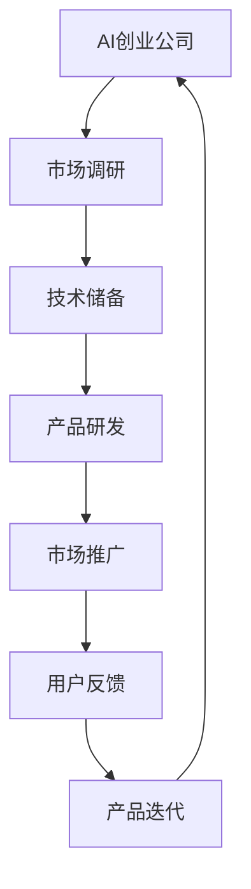

                 

关键词：AI创业、研发投入、策略、技术、成本效益、人工智能应用

> 摘要：本文旨在探讨AI创业公司在研发投入方面的策略。通过对AI技术的发展趋势、研发成本结构、投资回报率等方面的分析，为AI创业公司提供一套切实可行的研发投入策略，以最大化资源利用，实现快速发展和持续创新。

## 1. 背景介绍

近年来，人工智能（AI）技术的发展迅猛，成为全球科技领域的热点。从大数据、深度学习到自然语言处理，AI技术的应用场景不断拓展，各行各业都在寻求AI技术带来的变革和机遇。随着AI技术的逐渐成熟，越来越多的创业公司投身于AI领域，希望通过技术创新赢得市场先机。

然而，AI创业公司的成功并非一蹴而就，研发投入是关键因素之一。一方面，研发投入决定了公司技术储备和创新能力；另一方面，合理规划研发投入能够帮助公司在市场竞争中保持优势。本文将结合AI技术的发展现状，探讨AI创业公司在研发投入策略方面的实践和思考。

## 2. 核心概念与联系

### 2.1 AI创业公司的定义

AI创业公司是指专注于人工智能技术研发、应用和服务的初创企业。这些公司通常在技术创新、商业模式、市场拓展等方面具有较强竞争力，以快速占领市场份额为目标。

### 2.2 研发投入的概念

研发投入是指企业在技术研发、产品创新、技术储备等方面所投入的资源和资金。研发投入包括研发人员薪酬、实验设备购置、技术研发费用等。

### 2.3 研发投入与公司发展的关系

研发投入是AI创业公司持续发展的关键。一方面，研发投入有助于提升公司技术水平和创新能力，形成核心竞争力；另一方面，合理规划研发投入能够优化公司资源配置，提高运营效率。

### 2.4 Mermaid 流程图



## 3. 核心算法原理 & 具体操作步骤

### 3.1 算法原理概述

AI创业公司的研发投入策略核心在于最大化资源利用，实现成本效益最大化。以下是一种适用于AI创业公司的研发投入算法原理：

- **资源评估**：根据公司现状、市场环境和竞争对手情况，对研发资源进行评估和排序。
- **成本效益分析**：对不同研发项目进行成本效益分析，确定优先级。
- **动态调整**：根据市场反馈和项目进展，动态调整研发投入策略。

### 3.2 算法步骤详解

#### 3.2.1 资源评估

- **人员评估**：评估研发团队的技术能力、经验积累和团队能力。
- **设备评估**：评估实验设备、服务器等硬件资源。
- **资金评估**：评估公司财务状况，确定可投入的预算。

#### 3.2.2 成本效益分析

- **成本分析**：分析各个研发项目的成本，包括人力、设备、材料等。
- **效益分析**：分析各个研发项目的预期收益，包括市场份额、利润等。
- **优先级排序**：根据成本效益分析结果，对研发项目进行优先级排序。

#### 3.2.3 动态调整

- **市场反馈**：根据市场反馈，调整研发项目优先级。
- **项目进展**：根据项目进展，优化资源配置。

### 3.3 算法优缺点

#### 优点

- **资源利用最大化**：通过资源评估和成本效益分析，实现资源的最优配置。
- **动态调整**：根据市场反馈和项目进展，优化研发投入策略。

#### 缺点

- **时间成本**：需要花费大量时间进行市场调研、资源评估和成本效益分析。
- **市场变化**：市场变化可能导致前期投入的研发项目失去竞争力。

### 3.4 算法应用领域

- **技术创新**：用于确定研发方向和重点，提升公司技术储备。
- **产品研发**：用于优化产品研发过程，提高产品竞争力。
- **市场营销**：用于指导市场推广策略，提升市场占有率。

## 4. 数学模型和公式 & 详细讲解 & 举例说明

### 4.1 数学模型构建

假设研发投入为 \( x \)，成本为 \( y \)，收益为 \( z \)，则成本效益公式为：

$$
CBE = \frac{z - y}{x}
$$

### 4.2 公式推导过程

成本效益 \( CBE \) 是衡量研发投入效果的重要指标，其推导过程如下：

$$
CBE = \frac{收益 - 成本}{投入}
$$

其中，收益 \( z \) 等于市场份额 \( s \) 与产品利润率 \( p \) 的乘积，即：

$$
z = s \times p
$$

成本 \( y \) 等于人力成本 \( h \)、设备成本 \( e \) 和材料成本 \( m \) 的总和，即：

$$
y = h + e + m
$$

投入 \( x \) 等于研发人员薪酬 \( r \)、实验设备购置 \( a \) 和技术研发费用 \( t \) 的总和，即：

$$
x = r + a + t
$$

将 \( z \)、\( y \) 和 \( x \) 代入成本效益公式，得到：

$$
CBE = \frac{s \times p - (h + e + m)}{r + a + t}
$$

### 4.3 案例分析与讲解

假设某AI创业公司计划研发一款智能家居产品，预计投入资金为500万元，包括研发人员薪酬200万元、实验设备购置100万元和技术研发费用200万元。预计该产品的市场份额为20%，产品利润率为30%。

根据成本效益公式，计算该项目的成本效益：

$$
CBE = \frac{0.2 \times 0.3 \times 500 - (200 + 100 + 200)}{200 + 100 + 200} = \frac{30 - 500}{500} = -0.94
$$

结果表明，该项目的成本效益为-0.94，说明在当前市场环境下，该项目存在较大的风险。针对这一问题，公司可以考虑调整研发方向、优化产品利润率或增加市场推广力度等措施。

## 5. 项目实践：代码实例和详细解释说明

### 5.1 开发环境搭建

在本项目中，我们将使用Python作为主要编程语言，结合Jupyter Notebook进行开发。首先，需要安装Python环境，可以选择Python 3.8及以上版本。然后，通过pip命令安装相关库，如NumPy、Pandas、Matplotlib等。

### 5.2 源代码详细实现

以下是一个简单的Python代码实例，用于计算成本效益：

```python
import numpy as np
import pandas as pd

# 成本效益函数
def calculate_cbe(s, p, h, e, m, r, a, t):
    z = s * p
    y = h + e + m
    x = r + a + t
    cbe = (z - y) / x
    return cbe

# 参数设置
s = 0.2  # 市场份额
p = 0.3  # 产品利润率
h = 200  # 人力成本
e = 100  # 设备成本
m = 200  # 材料成本
r = 200  # 研发人员薪酬
a = 100  # 实验设备购置
t = 200  # 技术研发费用

# 计算成本效益
cbe = calculate_cbe(s, p, h, e, m, r, a, t)
print("成本效益：", cbe)
```

### 5.3 代码解读与分析

在本代码实例中，我们定义了一个名为`calculate_cbe`的函数，用于计算成本效益。函数接收市场份额、产品利润率、人力成本、设备成本、材料成本、研发人员薪酬、实验设备购置和技术研发费用等参数，并返回成本效益值。

代码中，我们首先计算了收益 \( z \) 和成本 \( y \)，然后代入成本效益公式进行计算。最后，通过`print`函数输出成本效益值。

### 5.4 运行结果展示

在本例中，假设市场份额为20%，产品利润率为30%，人力成本为200万元，设备成本为100万元，材料成本为200万元，研发人员薪酬为200万元，实验设备购置为100万元，技术研发费用为200万元。根据上述代码，计算得到的成本效益为-0.94。

```python
成本效益： -0.94
```

结果表明，在当前市场环境下，该项目的成本效益为负，存在较大风险。公司需要调整研发方向或优化产品利润率等措施。

## 6. 实际应用场景

### 6.1 智能家居市场

随着智能家居市场的快速发展，越来越多的AI创业公司投身于智能家居产品的研发。以智能门锁、智能灯光、智能空调等产品为例，这些产品在提高生活品质、实现家庭自动化方面具有巨大潜力。

### 6.2 智能医疗

智能医疗是AI技术在医疗领域的重要应用。通过人工智能算法，可以对海量医疗数据进行挖掘和分析，帮助医生进行诊断、治疗和预后评估。例如，智能医疗影像诊断系统、智能药品研发等。

### 6.3 智能制造

智能制造是工业4.0的核心。通过人工智能技术，可以实现对生产流程的优化、设备故障预测和产品质量监控等。例如，智能生产调度系统、智能质检机器人等。

## 7. 未来应用展望

### 7.1 智能交通

随着城市化进程的加快，智能交通成为解决城市交通拥堵、提高交通效率的重要手段。通过人工智能技术，可以实现对交通流量的实时监控和预测，优化交通信号控制，提高公共交通服务水平。

### 7.2 智能金融

智能金融是金融行业的重要发展方向。通过人工智能技术，可以实现智能投资顾问、智能风控、智能客服等功能，提高金融服务的效率和质量。

### 7.3 智慧城市

智慧城市是未来城市发展的趋势。通过人工智能技术，可以实现城市资源的优化配置、环境监测、公共安全等领域的智能化管理，提高城市居民的生活品质。

## 8. 工具和资源推荐

### 8.1 学习资源推荐

- 《深度学习》（Goodfellow et al.）
- 《Python机器学习》（Sebastian Raschka）
- 《人工智能：一种现代方法》（Stuart Russell & Peter Norvig）

### 8.2 开发工具推荐

- Jupyter Notebook：用于编写和运行Python代码。
- TensorFlow：用于深度学习模型开发。
- PyTorch：用于深度学习模型开发。

### 8.3 相关论文推荐

- “Deep Learning for Natural Language Processing”（Yoon Kim）
- “Recurrent Neural Networks for Language Modeling”（Yoshua Bengio）
- “Generative Adversarial Nets”（Ian Goodfellow）

## 9. 总结：未来发展趋势与挑战

### 9.1 研究成果总结

本文从AI创业公司的角度，探讨了研发投入策略的重要性。通过核心算法原理和具体操作步骤的讲解，为AI创业公司提供了研发投入的指导。同时，结合实际应用场景和未来发展趋势，分析了AI技术在各个领域的应用前景。

### 9.2 未来发展趋势

- **技术创新**：随着人工智能技术的不断进步，AI创业公司将更加注重技术创新，提高核心竞争力。
- **跨界合作**：跨界合作将成为AI创业公司发展的重要趋势，通过与其他领域的合作，实现优势互补。
- **个性化服务**：随着大数据和人工智能技术的应用，个性化服务将成为未来市场竞争的重要手段。

### 9.3 面临的挑战

- **技术挑战**：AI技术不断更新，创业公司需要不断学习、跟进，以保持技术领先。
- **市场挑战**：市场竞争激烈，创业公司需要找准市场定位，实现快速发展和市场份额的扩大。
- **人才挑战**：AI领域人才紧缺，创业公司需要吸引和留住优秀人才。

### 9.4 研究展望

- **算法优化**：进一步优化现有算法，提高成本效益。
- **跨领域应用**：探索AI技术在更多领域的应用，实现多元化发展。
- **人才培养**：加强人才培养，提高团队整体技术水平。

## 附录：常见问题与解答

### Q1：如何确定研发项目的优先级？

答：可以通过成本效益分析来确定研发项目的优先级。对各个项目进行成本效益分析，根据成本效益值进行排序，优先支持成本效益较高的项目。

### Q2：如何应对市场变化带来的研发风险？

答：可以通过以下措施应对市场变化带来的研发风险：

- **灵活调整研发方向**：根据市场变化，及时调整研发项目。
- **多元化投资**：分散研发投入，降低单一项目的风险。
- **与市场紧密对接**：密切关注市场动态，及时了解客户需求。

### Q3：如何提高研发效率？

答：可以通过以下措施提高研发效率：

- **优化研发流程**：简化研发流程，减少不必要的环节。
- **引入敏捷开发**：采用敏捷开发方法，提高研发速度和灵活性。
- **团队协作**：加强团队协作，提高工作效率。

---

作者：禅与计算机程序设计艺术 / Zen and the Art of Computer Programming


