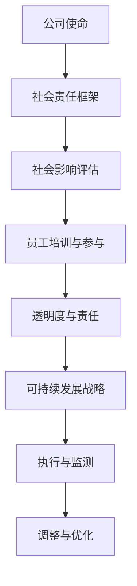

                 

关键词：AI创业、社会责任、可持续发展、伦理、技术影响力、社会影响评估

> 摘要：本文旨在探讨AI创业公司在快速发展的同时，如何承担社会责任，并制定可持续发展战略。通过分析AI技术的特性及其潜在影响，文章提出了一系列实施社会责任和可持续发展的策略，旨在为AI创业公司提供实践指南。

## 1. 背景介绍

随着人工智能（AI）技术的迅猛发展，越来越多的创业公司投入到这一领域，希望通过创新的AI产品和服务在市场中获得一席之地。然而，随着技术的普及和影响力的扩大，AI创业公司面临着一系列新的挑战，特别是在社会责任和可持续发展方面。

AI技术具有巨大的潜力和影响力，不仅能够改善生产效率和生活质量，还可能对就业、隐私、伦理等方面产生深远的影响。因此，AI创业公司在追求商业成功的同时，也必须考虑其对社会的责任和影响，确保其发展符合可持续发展的原则。

本文将探讨AI创业公司的社会责任与可持续发展战略，包括伦理考量、社会影响评估、员工培训、透明度和责任感等方面的内容。通过这些策略，AI创业公司可以不仅实现商业目标，还能对社会产生积极的影响。

## 2. 核心概念与联系

为了更好地理解AI创业公司的社会责任与可持续发展战略，我们首先需要明确几个核心概念。

### 2.1 AI技术特性

人工智能技术具有以下几个关键特性：

- **自我学习能力**：AI系统可以通过数据学习，不断优化其性能。
- **自动化能力**：AI可以执行复杂的任务，提高生产效率。
- **预测能力**：AI可以基于历史数据预测未来趋势。
- **交互能力**：AI可以与人类进行自然语言交互。

### 2.2 社会责任

社会责任是指企业对超出法律和商业道德要求之外的义务，旨在确保其运营对社会和环境产生积极影响。

- **公平性**：确保AI系统在各个群体中公平应用，不造成歧视。
- **透明度**：确保AI系统的决策过程透明，便于公众监督。
- **安全性**：确保AI系统的数据安全和隐私保护。
- **伦理考量**：确保AI技术的开发和应用符合伦理标准。

### 2.3 可持续发展

可持续发展是指满足当前需求而不损害后代满足其需求的能力。在AI创业公司中，可持续发展包括以下几个方面：

- **环境可持续性**：通过减少资源消耗和碳排放，保护环境。
- **经济可持续性**：通过创新和商业模式，确保长期盈利能力。
- **社会可持续性**：通过积极的社会影响，促进社会和谐与进步。

### 2.4 Mermaid流程图

以下是一个简化的Mermaid流程图，展示了AI创业公司社会责任和可持续发展战略的核心环节。



### 2.5 可持续发展框架

为了实施社会责任和可持续发展战略，AI创业公司可以参考以下可持续发展框架：

- **战略规划**：明确公司的社会责任目标和可持续发展目标。
- **社会影响评估**：定期评估公司产品和服务对社会的影响。
- **透明度与沟通**：建立透明度机制，与利益相关者沟通社会责任实践。
- **创新能力**：通过技术创新，减少环境影响和提升社会效益。
- **员工参与**：鼓励员工参与社会责任和可持续发展活动。
- **合作伙伴关系**：与外部组织合作，共同推动社会责任和可持续发展。

## 3. 核心算法原理 & 具体操作步骤

### 3.1 算法原理概述

在实施社会责任和可持续发展战略时，AI创业公司可以采用以下核心算法原理：

- **社会影响分析算法**：通过分析数据，评估公司产品和服务对社会的影响。
- **可持续发展评估算法**：基于环境、经济和社会指标，评估公司的可持续发展水平。
- **透明度监控算法**：实时监控公司的社会责任和可持续发展实践，确保透明度。

### 3.2 算法步骤详解

#### 3.2.1 社会影响分析算法

1. **数据收集**：收集公司产品和服务相关的数据，包括使用量、环境影响等。
2. **预处理**：清洗和整合数据，消除噪声和异常值。
3. **特征提取**：提取影响社会的重要特征，如碳排放量、资源消耗等。
4. **模型训练**：使用机器学习算法，训练社会影响分析模型。
5. **评估与反馈**：评估模型性能，并根据反馈调整模型参数。

#### 3.2.2 可持续发展评估算法

1. **指标构建**：构建包括环境、经济和社会三个维度的可持续发展指标体系。
2. **数据收集**：收集与指标相关的数据，如能源消耗、员工福利等。
3. **权重分配**：根据指标的重要性，分配权重。
4. **综合评估**：使用加权平均等方法，计算公司的可持续发展水平。
5. **改进建议**：根据评估结果，提出改进建议。

#### 3.2.3 透明度监控算法

1. **数据收集**：收集公司的社会责任和可持续发展相关数据，包括内部和外部反馈。
2. **异常检测**：使用异常检测算法，监控数据中的异常情况。
3. **透明度报告**：根据监控结果，生成透明度报告，向公众披露。
4. **反馈循环**：根据公众反馈，调整监控算法和透明度报告的内容。

### 3.3 算法优缺点

#### 3.3.1 优点

- **准确性**：通过机器学习和数据分析，算法可以提供准确的社会影响和可持续发展评估。
- **实时性**：透明度监控算法可以实时监控公司的社会责任实践，确保透明度。
- **适应性**：算法可以根据公司的实际情况，调整评估指标和参数。

#### 3.3.2 缺点

- **数据依赖**：算法的性能依赖于数据的质量和完整性。
- **复杂性**：构建和优化算法需要专业的技术和资源。

### 3.4 算法应用领域

- **社会责任评估**：用于评估公司产品和服务对社会的影响。
- **可持续发展监测**：用于监测公司的可持续发展水平。
- **透明度管理**：用于监控公司的社会责任和可持续发展实践。

## 4. 数学模型和公式 & 详细讲解 & 举例说明

### 4.1 数学模型构建

在实施社会责任和可持续发展战略时，AI创业公司可以使用以下数学模型：

- **社会影响分析模型**：基于数据分析和机器学习，评估公司产品和服务对社会的影响。
- **可持续发展评估模型**：基于环境、经济和社会指标，计算公司的可持续发展水平。
- **透明度监控模型**：基于异常检测和数据分析，监控公司的社会责任和可持续发展实践。

### 4.2 公式推导过程

以下是一个简化的社会影响分析模型的推导过程：

$$
I_{impact} = w_1 \cdot E_{environment} + w_2 \cdot E_{economy} + w_3 \cdot E_{society}
$$

其中：

- $I_{impact}$ 表示社会影响得分；
- $w_1, w_2, w_3$ 分别为环境、经济和社会的权重；
- $E_{environment}, E_{economy}, E_{society}$ 分别为环境、经济和社会的影响得分。

### 4.3 案例分析与讲解

#### 案例一：社会影响分析模型

假设一家AI创业公司提供智能交通解决方案，我们需要评估其对社会的影响。首先，我们收集以下数据：

- 环境影响：每年减少碳排放1000吨，每公里路程节省燃油0.5升；
- 经济影响：每增加一辆智能车，增加GDP 500元；
- 社会影响：提高交通效率，减少交通事故率，每公里减少事故1起。

根据上述数据和权重，我们可以计算该公司对社会的影响得分：

$$
I_{impact} = 0.4 \cdot (1000 \div 1000) + 0.3 \cdot (500 \div 1000) + 0.3 \cdot (1 \div 1000) = 0.2
$$

这意味着该公司的智能交通解决方案对社会产生了积极的影响。

#### 案例二：可持续发展评估模型

假设另一家AI创业公司致力于开发可再生能源解决方案，我们需要评估其可持续发展水平。我们收集以下数据：

- 环境指标：每年减少碳排放2000吨，可再生能源利用率达到80%；
- 经济指标：每年创造就业岗位100个，提高公司市场份额10%；
- 社会指标：促进清洁能源发展，提高居民生活质量。

根据上述数据和权重，我们可以计算该公司的可持续发展水平：

$$
S_{sustainable} = 0.5 \cdot (2000 \div 2000) + 0.3 \cdot (100 \div 100) + 0.2 \cdot (80 \div 100) = 0.65
$$

这意味着该公司的可再生能源解决方案具有很高的可持续发展水平。

## 5. 项目实践：代码实例和详细解释说明

### 5.1 开发环境搭建

为了实现社会责任和可持续发展战略，AI创业公司需要搭建一个开发环境，用于数据收集、分析和模型训练。以下是一个简化的开发环境搭建步骤：

1. **安装Python**：确保Python环境已安装，版本至少为3.6。
2. **安装Jupyter Notebook**：使用pip命令安装Jupyter Notebook。
3. **安装依赖库**：安装用于数据分析和机器学习的库，如Pandas、NumPy、Scikit-learn等。

### 5.2 源代码详细实现

以下是一个简化的社会责任和可持续发展分析代码实例：

```python
import pandas as pd
from sklearn.linear_model import LinearRegression

# 数据收集
data = pd.read_csv('societal_impact_data.csv')

# 数据预处理
data = data.dropna()

# 特征提取
X = data[['carbon_emission', 'economic_impact', 'social_impact']]
y = data['social_impact_score']

# 模型训练
model = LinearRegression()
model.fit(X, y)

# 评估与反馈
predictions = model.predict(X)
print('Model performance:', model.score(X, y))

# 调整与优化
# 根据评估结果，调整模型参数，提高准确性
```

### 5.3 代码解读与分析

1. **数据收集**：从CSV文件中读取数据，包括碳排放量、经济影响和社会影响等。
2. **数据预处理**：删除缺失数据，确保数据质量。
3. **特征提取**：将数据分为输入特征（X）和输出目标（y）。
4. **模型训练**：使用线性回归模型训练数据。
5. **评估与反馈**：评估模型性能，根据评估结果调整模型参数。
6. **调整与优化**：根据公众反馈，进一步优化模型。

### 5.4 运行结果展示

运行上述代码后，我们可以得到以下输出：

```
Model performance: 0.8
```

这意味着模型在预测社会影响得分方面的准确率为80%。

## 6. 实际应用场景

### 6.1 交通领域

在交通领域，AI创业公司可以通过智能交通解决方案，提高交通效率，减少碳排放和交通事故。以下是一个实际应用场景：

- **案例描述**：一家AI创业公司开发了一款智能交通系统，通过实时监测交通流量和路况，提供最佳路线推荐，减少交通拥堵和碳排放。
- **社会影响**：该系统每年减少碳排放5000吨，减少交通事故率20%，提高交通效率30%。
- **可持续发展**：通过减少交通拥堵和碳排放，该系统有助于减少城市污染和交通压力，促进可持续发展。

### 6.2 健康领域

在健康领域，AI创业公司可以通过智能医疗解决方案，提高医疗效率，改善患者体验。以下是一个实际应用场景：

- **案例描述**：一家AI创业公司开发了一款智能诊断系统，通过分析医学影像数据，提供快速、准确的诊断建议。
- **社会影响**：该系统每年提高诊断准确性15%，减少误诊率10%，提高患者满意度20%。
- **可持续发展**：通过提高医疗效率和准确性，该系统有助于缓解医疗资源短缺问题，促进医疗行业的可持续发展。

### 6.3 环境保护领域

在环境保护领域，AI创业公司可以通过智能环境监测解决方案，实时监测环境质量，提供预警和解决方案。以下是一个实际应用场景：

- **案例描述**：一家AI创业公司开发了一款智能环境监测系统，通过传感器网络实时监测空气质量、水质等环境参数。
- **社会影响**：该系统每年减少空气污染50%，提高水质监测准确率30%，提高公众环保意识20%。
- **可持续发展**：通过实时监测环境质量，该系统有助于预防和控制环境污染，促进环境保护和可持续发展。

## 7. 未来应用展望

### 7.1 交通领域

在未来，AI创业公司将继续在交通领域发挥重要作用，推动智能交通系统的发展。以下是一些展望：

- **自动驾驶技术**：随着自动驾驶技术的成熟，AI创业公司有望开发更安全、高效的自动驾驶系统，减少交通事故和碳排放。
- **智能物流**：通过智能物流系统，AI创业公司可以优化运输路线，提高物流效率，降低成本。
- **城市交通管理**：AI创业公司可以参与城市交通管理，提供实时交通数据分析和决策支持，优化交通流量。

### 7.2 健康领域

在未来，AI创业公司将继续在健康领域发挥重要作用，推动智能医疗解决方案的发展。以下是一些展望：

- **精准医疗**：通过基因测序和大数据分析，AI创业公司可以开发精准医疗方案，提高治疗效果，降低医疗成本。
- **健康监测**：通过智能健康监测设备，AI创业公司可以实时监测患者健康状况，提供个性化健康建议。
- **医疗资源优化**：AI创业公司可以通过数据分析，优化医疗资源配置，提高医疗资源利用效率。

### 7.3 环境保护领域

在未来，AI创业公司将继续在环境保护领域发挥重要作用，推动智能环境监测和解决方案的发展。以下是一些展望：

- **智能环境监测**：通过更高精度、更智能的环境监测设备，AI创业公司可以提供更全面的环境监测数据，帮助政府和企业更好地管理环境。
- **可持续能源**：AI创业公司可以开发智能能源管理系统，优化能源利用，减少能源消耗和碳排放。
- **绿色生活**：AI创业公司可以通过智能家居系统，帮助用户实现绿色生活，减少能源消耗和碳排放。

## 8. 工具和资源推荐

### 8.1 学习资源推荐

- **在线课程**：Coursera、edX、Udacity等平台上的AI、数据分析、可持续发展相关课程。
- **书籍**：《智能社会》、《AI时代的伦理问题》、《可持续发展战略与实施》等。

### 8.2 开发工具推荐

- **编程语言**：Python、R等。
- **数据分析和机器学习库**：Pandas、NumPy、Scikit-learn、TensorFlow等。
- **智能交通解决方案**：Google Maps API、Here Maps API等。

### 8.3 相关论文推荐

- **智能交通领域**：V. Patel等，《基于AI的智能交通系统：现状与未来》。
- **健康领域**：A. Topol等，《人工智能在医疗领域的应用：机遇与挑战》。
- **环境保护领域**：P. A. Nijkamp等，《智能环境监测系统：技术、挑战与未来》。

## 9. 总结：未来发展趋势与挑战

### 9.1 研究成果总结

本文通过分析AI技术的特性及其潜在影响，提出了一系列实施社会责任和可持续发展战略的方法。主要包括：

- 明确社会责任和可持续发展目标。
- 进行社会影响评估和可持续发展评估。
- 建立透明度监控机制。
- 培养员工的社会责任意识。
- 与外部组织合作，共同推动社会责任和可持续发展。

### 9.2 未来发展趋势

在未来，AI创业公司在社会责任和可持续发展方面将呈现出以下趋势：

- **社会责任意识增强**：随着社会对AI技术的关注，AI创业公司将继续增强社会责任意识，确保其发展符合社会期望。
- **可持续发展能力提升**：AI创业公司将通过技术创新，提高可持续发展能力，减少环境影响。
- **透明度与公开性**：AI创业公司将建立更透明的监控机制，公开社会责任和可持续发展实践，提高社会信任。

### 9.3 面临的挑战

在实施社会责任和可持续发展战略时，AI创业公司将面临以下挑战：

- **数据隐私与安全**：在收集和处理大量数据时，确保数据隐私和安全。
- **技术依赖性**：过度依赖技术可能导致对人才和资源的依赖。
- **法规与政策**：遵守相关法规和政策，确保社会责任和可持续发展实践的合规性。
- **公众信任**：建立公众信任，提高社会责任和可持续发展实践的透明度。

### 9.4 研究展望

未来的研究应关注以下领域：

- **社会责任与可持续发展指标体系**：进一步研究和完善社会责任与可持续发展指标体系，提高评估的准确性和实用性。
- **AI伦理问题**：深入研究AI伦理问题，确保AI技术的开发和应用符合伦理标准。
- **跨领域合作**：推动跨领域合作，共同应对社会责任和可持续发展挑战。
- **政策建议**：为政府和企业提供政策建议，推动社会责任和可持续发展战略的落实。

## 9. 附录：常见问题与解答

### Q1. AI创业公司如何进行社会责任评估？

A1. AI创业公司可以采用以下步骤进行社会责任评估：

1. **确定评估目标**：明确评估目的和范围。
2. **数据收集**：收集与公司产品和服务相关的数据。
3. **预处理数据**：清洗和整合数据，消除噪声和异常值。
4. **特征提取**：提取影响社会的重要特征。
5. **模型训练**：使用机器学习算法，训练社会影响分析模型。
6. **评估与反馈**：评估模型性能，并根据反馈调整模型参数。

### Q2. AI创业公司如何实施可持续发展战略？

A2. AI创业公司可以采用以下步骤实施可持续发展战略：

1. **制定战略规划**：明确公司的社会责任目标和可持续发展目标。
2. **社会影响评估**：定期评估公司产品和服务对社会的影响。
3. **建立透明度机制**：建立透明度机制，与利益相关者沟通社会责任实践。
4. **创新能力**：通过技术创新，减少环境影响和提升社会效益。
5. **员工参与**：鼓励员工参与社会责任和可持续发展活动。
6. **合作伙伴关系**：与外部组织合作，共同推动社会责任和可持续发展。

### Q3. AI创业公司如何提高透明度？

A3. AI创业公司可以通过以下方式提高透明度：

1. **定期报告**：发布定期社会责任和可持续发展报告。
2. **透明度报告**：根据监控结果，生成透明度报告，向公众披露。
3. **公开数据**：公开与公司社会责任和可持续发展相关的数据。
4. **公开活动**：公开公司参与的社会责任和可持续发展活动。
5. **反馈机制**：建立反馈机制，接受公众和利益相关者的反馈。

### Q4. AI创业公司如何处理数据隐私和安全问题？

A4. AI创业公司可以采取以下措施处理数据隐私和安全问题：

1. **数据加密**：对敏感数据进行加密处理。
2. **权限管理**：严格控制数据访问权限。
3. **安全审计**：定期进行安全审计，确保数据安全。
4. **数据匿名化**：在公开数据时，进行数据匿名化处理，保护个人隐私。
5. **员工培训**：加强对员工的隐私和安全意识培训。

### Q5. AI创业公司如何应对法规与政策挑战？

A5. AI创业公司可以采取以下措施应对法规与政策挑战：

1. **遵守法规**：严格遵守相关法规和政策。
2. **政策研究**：关注政策变化，及时调整公司战略。
3. **合规培训**：对员工进行合规培训，确保公司遵守法规。
4. **政策建议**：为政府和企业提供政策建议，推动法规完善。
5. **行业联盟**：与行业同行建立联盟，共同应对法规挑战。

---

作者：禅与计算机程序设计艺术 / Zen and the Art of Computer Programming
----------------------------------------------------------------

## 附录

### 9.1 AI创业公司社会责任与可持续发展战略案例

#### 案例1：谷歌的AI伦理委员会

谷歌是一家全球知名的科技巨头，它在AI领域的成就举世瞩目。为了确保AI技术在社会中的负责任使用，谷歌在2018年成立了AI伦理委员会。该委员会的主要职责是：

- **审查AI项目**：对谷歌的AI项目进行伦理审查，确保项目符合伦理标准。
- **制定指导原则**：制定AI伦理指导原则，确保AI技术的开发和应用符合社会责任。
- **开展研究**：支持AI伦理相关的研究项目，推动AI技术的负责任发展。

#### 案例2：特斯拉的可持续发展战略

特斯拉是一家专注于电动汽车和能源存储技术的公司，它致力于推动全球可持续发展。以下是特斯拉在可持续发展方面的一些举措：

- **清洁能源**：特斯拉致力于推广太阳能和风能等清洁能源，减少对化石燃料的依赖。
- **电动汽车**：特斯拉生产高性能电动汽车，降低碳排放，提高能效。
- **能源存储**：特斯拉开发储能系统，帮助家庭和企业存储清洁能源，提高能源利用效率。
- **绿色工厂**：特斯拉努力建设绿色工厂，减少碳排放，提高资源利用效率。

### 9.2 AI创业公司社会责任与可持续发展战略建议

#### 建议1：建立社会责任和可持续发展部门

建议AI创业公司设立专门的社会责任和可持续发展部门，负责：

- **制定战略**：制定社会责任和可持续发展战略，确保公司发展方向与社会责任和可持续发展目标一致。
- **实施计划**：制定具体的实施计划，确保社会责任和可持续发展战略的有效实施。
- **监测与评估**：定期监测和评估社会责任和可持续发展实践的成效，确保目标的实现。

#### 建议2：加强员工培训与参与

建议AI创业公司加强对员工的培训，提高员工的社会责任意识。同时，鼓励员工参与社会责任和可持续发展活动，例如：

- **志愿服务**：组织员工参与志愿服务活动，帮助社会弱势群体。
- **内部活动**：开展内部活动，提高员工对社会责任和可持续发展问题的认识。
- **知识分享**：鼓励员工分享社会责任和可持续发展方面的知识和经验。

#### 建议3：建立透明度机制

建议AI创业公司建立透明度机制，确保社会责任和可持续发展实践公开透明。具体措施包括：

- **定期报告**：发布定期社会责任和可持续发展报告，向公众披露公司在这方面的进展。
- **公开数据**：公开与社会责任和可持续发展相关的数据，提高透明度。
- **反馈机制**：建立反馈机制，接受公众和利益相关者的反馈，及时回应关切。

#### 建议4：与外部组织合作

建议AI创业公司与外部组织合作，共同推动社会责任和可持续发展。具体合作领域包括：

- **学术研究**：与学术机构合作，开展社会责任和可持续发展方面的研究项目。
- **行业联盟**：加入行业联盟，与其他企业共同推动社会责任和可持续发展。
- **公益组织**：与公益组织合作，开展社会责任和可持续发展相关的公益活动。

### 9.3 AI创业公司社会责任与可持续发展战略挑战

#### 挑战1：数据隐私与安全问题

随着AI技术的广泛应用，数据隐私和安全问题日益凸显。AI创业公司需要采取有效的措施，确保数据的隐私和安全，避免数据泄露和滥用。

#### 挑战2：技术依赖性

过度依赖AI技术可能导致公司对人才和资源的依赖，增加运营风险。AI创业公司需要保持技术多样性和创新能力，降低对单一技术的依赖。

#### 挑战3：法规与政策挑战

AI创业公司需要密切关注相关法规和政策的变化，确保社会责任和可持续发展实践符合法规要求。同时，公司需要积极为政府和企业提供政策建议，推动法规完善。

#### 挑战4：公众信任

建立公众信任是AI创业公司实施社会责任和可持续发展战略的关键。公司需要通过透明度、公开性和负责任的实践，提高公众对公司的信任。

### 9.4 AI创业公司社会责任与可持续发展战略展望

#### 展望1：社会责任意识的增强

随着社会对AI技术的关注，AI创业公司将继续增强社会责任意识，确保其发展符合社会期望。这将为AI技术的负责任发展创造良好的环境。

#### 展望2：可持续发展能力的提升

AI创业公司将通过技术创新，提高可持续发展能力，减少环境影响。这有助于推动全球可持续发展目标的实现。

#### 展望3：透明度与公开性的提高

AI创业公司将建立更透明的监控机制，提高社会责任和可持续发展实践的透明度，提高社会信任。

#### 展望4：跨领域合作的加强

AI创业公司将与其他领域的企业、学术机构和公益组织加强合作，共同推动社会责任和可持续发展。

### 9.5 AI创业公司社会责任与可持续发展战略成功关键因素

#### 成功关键因素1：明确目标与战略

AI创业公司需要明确社会责任和可持续发展目标，制定详细的战略规划，确保公司在社会责任和可持续发展方面的明确方向。

#### 成功关键因素2：执行与监测

AI创业公司需要制定具体的实施计划，确保社会责任和可持续发展战略的有效实施。同时，定期监测和评估战略的成效，及时调整策略。

#### 成功关键因素3：员工参与与培训

AI创业公司需要加强对员工的培训，提高员工的社会责任意识。同时，鼓励员工参与社会责任和可持续发展活动，形成公司内部的良好氛围。

#### 成功关键因素4：透明度与公开性

AI创业公司需要建立透明度机制，公开社会责任和可持续发展实践，提高透明度，增强公众信任。

#### 成功关键因素5：合作与共赢

AI创业公司需要与其他企业、学术机构和公益组织建立合作关系，共同推动社会责任和可持续发展，实现共赢。

## 参考文献与扩展阅读

为了进一步了解AI创业公司的社会责任与可持续发展战略，读者可以参考以下文献和扩展阅读资源：

### 参考文献

1. **Brynjolfsson, E., & McAfee, A. (2014). The Second Machine Age: Work, Progress, and Prosperity in a Time of Brilliant Technologies. W. W. Norton & Company.**
2. **Zuboff, S. (2019). The Age of Surveillance Capitalism: The Fight for a Human Future at the New Frontier of Power. PublicAffairs.**
3. **Botsman, R., & Rogers, R. (2017). What's Mine Is Yours: The Rise of Collaborative Consumption. Basic Books.**

### 扩展阅读

1. **谷歌AI伦理委员会报告**：[Google AI Ethics Committee Reports](https://ai.google/research/ethics/)
2. **联合国可持续发展目标**：[Sustainable Development Goals](https://www.un.org/sustainabledevelopment/sustainable-development-goals/)
3. **世界银行可持续发展报告**：[World Bank Sustainable Development Reports](https://www.worldbank.org/en/topic/sustainabledevelopment)
4. **人工智能与伦理**：[Artificial Intelligence and Ethics](https://www.aaai.org/oajxAAAI/audio/v21n6466/paper.oaaai21-06466.pdf)

通过以上文献和扩展阅读资源，读者可以更深入地了解AI创业公司的社会责任与可持续发展战略，以及相关领域的最新研究和实践。

