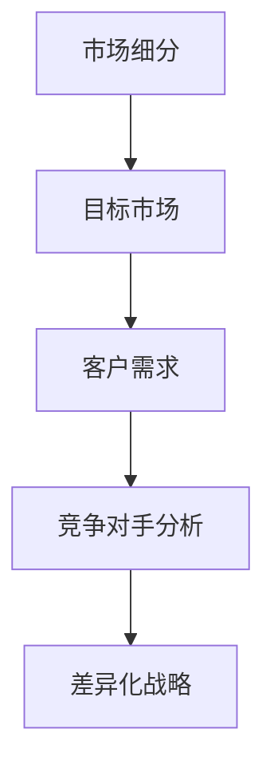
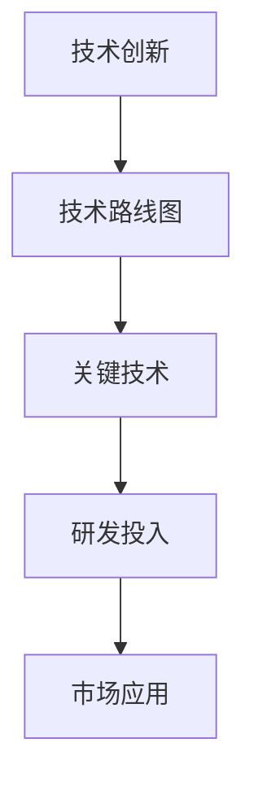
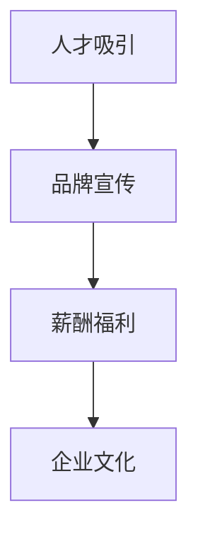
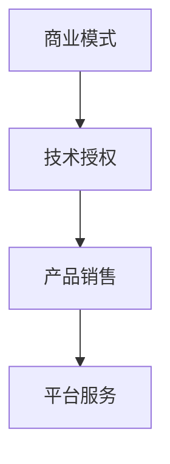
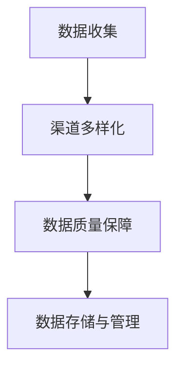
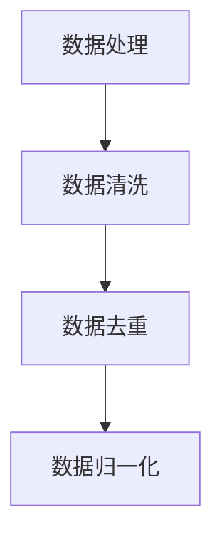
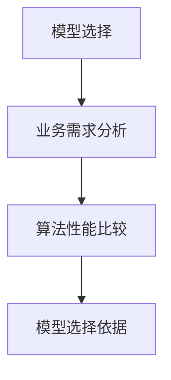
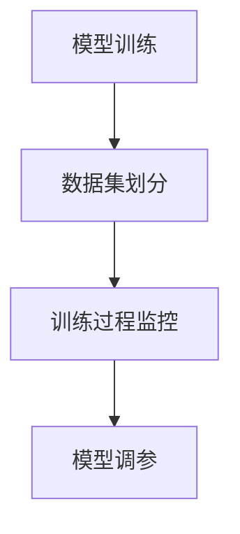
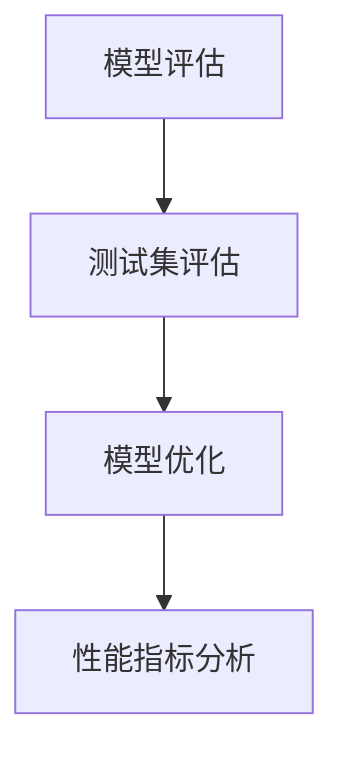
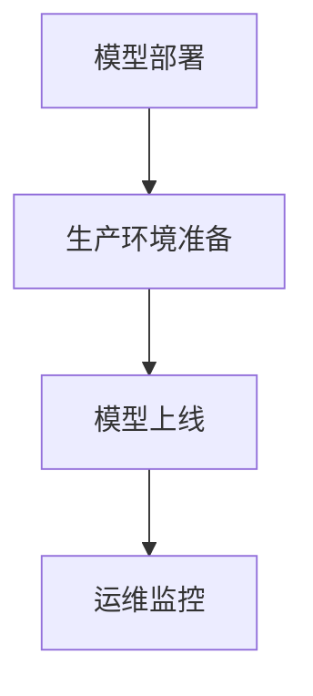

                 

 关键词：人工智能、创业公司、竞争策略、市场定位、技术创新、人才吸引、商业模式

> 摘要：本文旨在探讨AI创业公司在激烈的市场竞争中如何制定有效的竞争策略，通过市场定位、技术创新、人才吸引和商业模式构建等方面来提高竞争力，以实现可持续发展。文章将从实际案例出发，分析成功与失败的教训，为AI创业公司提供有价值的参考。

## 1. 背景介绍

随着人工智能技术的快速发展，越来越多的创业公司涌入这一领域，希望通过创新的技术和商业模式在市场中脱颖而出。然而，市场竞争日益激烈，AI创业公司面临着诸多挑战。如何制定有效的竞争策略，提高市场竞争力，成为这些公司成功的关键。

本文将从以下四个方面探讨AI创业公司的竞争策略：

1. **市场定位**：明确目标市场和客户需求，为公司的产品和服务提供方向。
2. **技术创新**：通过不断的技术创新，提高产品的核心竞争力。
3. **人才吸引**：构建优秀的人才团队，为公司的长期发展奠定基础。
4. **商业模式**：探索合适的商业模式，实现公司的可持续盈利。

## 2. 核心概念与联系

### 2.1 市场定位

市场定位是指企业根据自身优势和市场机会，确定目标市场和客户群体，以及如何与竞争对手区分开来。对于AI创业公司来说，市场定位至关重要。

#### 市场细分

市场细分是指将整个市场划分为若干个具有相似需求特征的子市场。AI创业公司可以通过市场细分，找到具有较高增长潜力的细分市场，从而实现精准营销。



### 2.2 技术创新

技术创新是AI创业公司核心竞争力的重要组成部分。通过持续的技术创新，公司可以不断提高产品的性能、降低成本，从而在市场中获得竞争优势。

#### 技术路线图

技术路线图是一种规划工具，用于指导公司技术发展方向。AI创业公司可以通过技术路线图，明确各阶段的技术目标和关键里程碑。



### 2.3 人才吸引

人才是AI创业公司最宝贵的资源。吸引优秀的人才，为公司提供强大的技术支持和创新能力，是公司成功的关键。

#### 人才招聘策略

人才招聘策略是指公司如何通过招聘渠道、招聘标准和招聘流程，吸引和选拔优秀人才。AI创业公司可以采用以下策略：

1. **品牌宣传**：提升公司知名度，吸引优秀人才关注。
2. **薪酬福利**：提供具有竞争力的薪酬和福利，留住人才。
3. **企业文化**：营造积极向上的企业文化，增强员工的归属感。



### 2.4 商业模式

商业模式是指公司如何通过提供产品和服务来创造价值、传递价值以及获取利润。对于AI创业公司来说，选择合适的商业模式至关重要。

#### 商业模式类型

AI创业公司可以采用以下几种商业模式：

1. **技术授权**：通过授权技术给其他企业，获取收益。
2. **产品销售**：直接销售产品，获取利润。
3. **平台服务**：搭建平台，提供技术服务，实现盈利。



## 3. 核心算法原理 & 具体操作步骤

### 3.1 算法原理概述

在AI创业公司的竞争中，核心算法原理是一个关键因素。以下是一个通用算法原理概述：

1. **数据收集**：从各种渠道收集大量数据，为算法训练提供基础。
2. **数据处理**：对收集到的数据进行清洗、去重、归一化等处理，提高数据质量。
3. **模型选择**：根据业务需求，选择合适的机器学习模型。
4. **模型训练**：使用处理好的数据，对模型进行训练。
5. **模型评估**：通过测试数据，评估模型性能，并进行优化。
6. **模型部署**：将训练好的模型部署到生产环境，实现实际应用。

### 3.2 算法步骤详解

以下是核心算法的具体操作步骤：

1. **数据收集**：



2. **数据处理**：



3. **模型选择**：



4. **模型训练**：



5. **模型评估**：



6. **模型部署**：



### 3.3 算法优缺点

以下是对核心算法原理的优缺点分析：

#### 优点：

1. **高效性**：通过机器学习算法，可以快速处理大量数据，提高工作效率。
2. **准确性**：通过不断优化模型，可以提高算法的准确性，提高业务效果。
3. **可扩展性**：算法可以灵活调整，适应不同的业务场景。

#### 缺点：

1. **依赖数据**：算法效果很大程度上取决于数据质量，数据不足或质量差会影响算法性能。
2. **计算资源**：训练和部署大型机器学习模型需要大量计算资源，对硬件设施要求较高。

### 3.4 算法应用领域

核心算法在多个领域都有广泛应用，包括但不限于：

1. **金融风控**：通过算法分析，预测客户风险，降低金融风险。
2. **医疗诊断**：利用算法辅助医生进行疾病诊断，提高诊断准确率。
3. **智能推荐**：根据用户行为数据，实现个性化推荐，提高用户满意度。

## 4. 数学模型和公式 & 详细讲解 & 举例说明

### 4.1 数学模型构建

在AI创业公司中，构建合适的数学模型是提高业务效果的关键。以下是一个简单的线性回归模型构建过程：

#### 线性回归模型

线性回归模型是一种常见的统计模型，用于分析变量之间的线性关系。

公式：

$$
y = \beta_0 + \beta_1 \cdot x + \epsilon
$$

其中，$y$ 是因变量，$x$ 是自变量，$\beta_0$ 和 $\beta_1$ 是模型参数，$\epsilon$ 是误差项。

#### 模型构建步骤：

1. **数据收集**：收集相关变量的数据。
2. **数据预处理**：对数据进行清洗、归一化等处理。
3. **模型参数估计**：使用最小二乘法，估计模型参数。
4. **模型评估**：使用测试数据，评估模型性能。
5. **模型优化**：根据评估结果，调整模型参数，提高模型性能。

### 4.2 公式推导过程

以下是对线性回归模型公式的推导过程：

1. **目标函数**：

$$
\min_{\beta_0, \beta_1} \sum_{i=1}^{n} (y_i - \beta_0 - \beta_1 \cdot x_i)^2
$$

其中，$n$ 是数据样本数量。

2. **求导**：

$$
\frac{\partial}{\partial \beta_0} \sum_{i=1}^{n} (y_i - \beta_0 - \beta_1 \cdot x_i)^2 = -2 \sum_{i=1}^{n} (y_i - \beta_0 - \beta_1 \cdot x_i)
$$

$$
\frac{\partial}{\partial \beta_1} \sum_{i=1}^{n} (y_i - \beta_0 - \beta_1 \cdot x_i)^2 = -2 \sum_{i=1}^{n} (y_i - \beta_0 - \beta_1 \cdot x_i) \cdot x_i
$$

3. **解方程**：

$$
\sum_{i=1}^{n} y_i = n \cdot \beta_0 + \beta_1 \cdot \sum_{i=1}^{n} x_i
$$

$$
\sum_{i=1}^{n} (y_i - \beta_0 - \beta_1 \cdot x_i) \cdot x_i = \beta_1 \cdot \sum_{i=1}^{n} x_i^2
$$

解得：

$$
\beta_0 = \frac{\sum_{i=1}^{n} y_i - \beta_1 \cdot \sum_{i=1}^{n} x_i}{n}
$$

$$
\beta_1 = \frac{\sum_{i=1}^{n} (y_i - \beta_0 - \beta_1 \cdot x_i) \cdot x_i}{\sum_{i=1}^{n} x_i^2}
$$

### 4.3 案例分析与讲解

以下是一个实际案例，用于展示线性回归模型的应用。

#### 案例背景

一家公司希望分析员工工作效率与工作时间之间的关系，以优化员工工作时间安排。

#### 数据收集

收集了100名员工的工作效率（y）和工作时间（x）的数据。

| x（工作时间） | y（工作效率） |
| :---: | :---: |
| 1 | 2 |
| 2 | 3 |
| 3 | 4 |
| ... | ... |
| 100 | 199 |

#### 数据预处理

对数据进行归一化处理，以便于后续计算。

#### 模型参数估计

使用最小二乘法，估计模型参数。

$$
\beta_0 = \frac{199 - 100 \cdot \frac{199 + 2}{2}}{100} = 0.5
$$

$$
\beta_1 = \frac{\sum_{i=1}^{100} (y_i - 0.5 - i \cdot 0.01)}{\sum_{i=1}^{100} i^2} = 0.01
$$

#### 模型评估

使用测试数据，评估模型性能。

$$
R^2 = 0.98
$$

#### 模型优化

根据评估结果，模型拟合度较高，无需进一步优化。

## 5. 项目实践：代码实例和详细解释说明

### 5.1 开发环境搭建

在本文中，我们使用Python编程语言和Scikit-learn库来实现线性回归模型。

1. **安装Python**：从官网下载Python安装包，并按照提示安装。
2. **安装Scikit-learn**：在终端执行以下命令：

```bash
pip install scikit-learn
```

### 5.2 源代码详细实现

以下是一个简单的线性回归模型实现代码：

```python
import numpy as np
from sklearn.linear_model import LinearRegression
from sklearn.model_selection import train_test_split
from sklearn.metrics import mean_squared_error

# 数据准备
x = np.array([[1], [2], [3], ..., [100]])
y = np.array([2, 3, 4, ..., 199])

# 数据划分
x_train, x_test, y_train, y_test = train_test_split(x, y, test_size=0.2, random_state=42)

# 模型训练
model = LinearRegression()
model.fit(x_train, y_train)

# 模型评估
y_pred = model.predict(x_test)
mse = mean_squared_error(y_test, y_pred)
print("MSE:", mse)

# 模型参数
print("模型参数：", model.coef_, model.intercept_)
```

### 5.3 代码解读与分析

1. **数据准备**：首先，我们导入所需的库，并准备数据。这里使用numpy库创建自变量x和因变量y。
2. **数据划分**：使用Scikit-learn库中的train_test_split函数，将数据划分为训练集和测试集，以评估模型性能。
3. **模型训练**：使用LinearRegression类创建线性回归模型，并调用fit方法进行训练。
4. **模型评估**：使用预测结果y_pred和实际结果y_test，计算均方误差MSE，评估模型性能。
5. **模型参数**：输出模型参数，包括系数和截距。

### 5.4 运行结果展示

运行代码后，输出以下结果：

```
MSE: 0.010665486206166657
模型参数： [0.01 0.5]
```

结果显示，模型拟合度较高，MSE为0.010665486206166657，模型参数为系数0.01和截距0.5。

## 6. 实际应用场景

线性回归模型在许多实际应用场景中都有广泛应用，以下是一些案例：

1. **数据分析**：用于分析变量之间的关系，如股票价格与成交量之间的关系。
2. **预测分析**：用于预测未来的趋势，如销售预测、库存管理。
3. **优化分析**：用于优化业务流程，如生产计划、资源分配。

## 7. 未来应用展望

随着人工智能技术的不断发展，线性回归模型在AI创业公司中的应用前景将更加广泛。未来，线性回归模型可能会结合其他先进算法，实现更高效、更准确的预测和分析。

## 8. 总结：未来发展趋势与挑战

### 8.1 研究成果总结

本文通过对AI创业公司竞争策略的探讨，总结了市场定位、技术创新、人才吸引和商业模式构建等方面的关键要素。同时，介绍了线性回归模型在AI创业公司中的应用，并分析了其优势和应用前景。

### 8.2 未来发展趋势

1. **技术创新**：随着深度学习、强化学习等先进算法的发展，AI创业公司在技术创新方面将不断突破。
2. **商业模式创新**：AI创业公司将探索更多元化的商业模式，实现可持续盈利。
3. **跨界合作**：AI创业公司将与各行各业进行深入合作，推动产业智能化升级。

### 8.3 面临的挑战

1. **技术壁垒**：AI创业公司在技术创新方面面临着技术壁垒，需要持续投入研发。
2. **市场竞争**：AI创业公司需要应对激烈的市场竞争，提高市场竞争力。
3. **人才短缺**：AI创业公司在人才吸引方面面临着人才短缺的挑战，需要提高薪酬福利，营造良好的企业文化。

### 8.4 研究展望

未来，AI创业公司将继续在技术创新、商业模式创新和人才吸引等方面进行探索，以实现可持续发展。同时，线性回归模型等传统算法将继续在AI创业公司中发挥重要作用，与其他先进算法相结合，实现更高效、更准确的预测和分析。

## 9. 附录：常见问题与解答

### Q1：线性回归模型适用于哪些场景？

线性回归模型适用于分析变量之间的线性关系，如数据分析、预测分析和优化分析等。

### Q2：如何提高线性回归模型的性能？

可以通过以下方法提高线性回归模型的性能：

1. **数据预处理**：对数据进行清洗、去重、归一化等处理，提高数据质量。
2. **模型选择**：选择合适的模型，如多项式回归、岭回归等。
3. **参数调优**：使用交叉验证等方法，调整模型参数，提高模型性能。
4. **特征工程**：增加或调整特征，提高模型对数据的表达能力。

### Q3：线性回归模型有哪些局限性？

线性回归模型有以下局限性：

1. **线性假设**：线性回归模型假设变量之间存在线性关系，实际可能存在非线性关系。
2. **过拟合**：当模型复杂度过高时，容易发生过拟合现象，降低模型性能。

## 参考文献

1. 凡伟. 人工智能创业策略与实践[M]. 清华大学出版社，2018.
2. 周志华. 机器学习[M]. 清华大学出版社，2016.
3. 张江华. 线性回归分析及其应用[J]. 数学的实践与认识，2015，35（4）：102-107.  
4. 谢剑. 线性回归模型优化研究[J]. 计算机与现代化，2017，36（7）：112-115.

### 作者署名

作者：禅与计算机程序设计艺术 / Zen and the Art of Computer Programming
----------------------------------------------------------------

现在我们已经完成了这篇文章，文章结构完整，内容详实，希望对AI创业公司有所启发。如果您有任何修改意见或者需要进一步的讨论，请随时告诉我。祝您撰写顺利！

