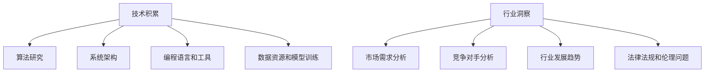

                 

在当今快速发展的技术时代，人工智能（AI）成为推动各行各业变革的核心驱动力。随着AI技术的不断进步，越来越多的创业者投身于AI领域，希望能够抓住这一历史性的机遇。然而，成功的AI创业并非易事，它需要团队在技术积累和行业洞察上达到高度的一致和融合。本文将深入探讨AI创业团队在成长过程中所需的技术积累和行业洞察，并阐述两者并重的重要性。

> 关键词：人工智能，创业团队，技术积累，行业洞察，成长之路

> 摘要：本文通过分析AI创业团队的成长过程，强调了技术积累和行业洞察在创业成功中的关键作用。文章将详细讨论技术积累的具体内容，包括算法、架构、编程语言等，以及如何通过深入行业洞察来指导技术发展。通过这些讨论，我们希望为正在或计划投身于AI创业的团队提供一些实用的指导和思考。

## 1. 背景介绍

人工智能作为计算机科学的一个重要分支，近年来取得了前所未有的发展。从深度学习到自然语言处理，从计算机视觉到机器人技术，AI技术的应用范围越来越广泛，逐渐渗透到医疗、金融、教育、制造等各个行业。随着大数据、云计算、物联网等技术的融合，AI的应用场景不断拓展，为创业者提供了广阔的舞台。

然而，AI创业的成功并非仅仅依赖于技术的先进性。一个成功的AI创业团队需要全面而深入的技术积累，同时还需要对目标行业有深刻的洞察。技术积累是团队竞争力的核心，而行业洞察则是团队战略决策的指南。本文将从这两个方面出发，探讨AI创业团队在成长过程中所需面对的挑战和机遇。

### 1.1 AI创业现状

目前，全球范围内AI创业活动日益活跃，无论是初创企业还是大型科技公司的内部创新团队，都纷纷投身于AI技术的研发和应用。根据市场调研机构的数据，全球AI创业公司的数量在过去五年中增长了近三倍。这些公司分布在各个行业，如自动驾驶、智能家居、医疗诊断、金融科技等，展现出了AI技术的广泛影响力和潜在价值。

尽管AI创业的前景广阔，但成功的案例并不多。据统计，超过90%的AI创业公司在早期就失败了，主要原因在于技术积累不足、市场定位不清、商业模式不明确等问题。因此，如何打造一支具备强大技术积累和深刻行业洞察的创业团队，成为每一个AI创业者的必修课。

### 1.2 技术积累的重要性

技术积累是AI创业团队成功的关键。一个团队的技术水平直接决定了产品的竞争力，决定了能否在激烈的市场竞争中脱颖而出。具体来说，技术积累包括以下几个方面：

1. **核心算法研发**：AI产品的核心技术往往基于深度学习、强化学习等算法。团队需要持续进行算法的研究和优化，以提高算法的性能和可靠性。

2. **系统架构设计**：一个高效的系统架构是保证产品稳定运行和扩展的关键。团队需要具备系统架构设计的能力，以应对不同应用场景的需求。

3. **编程语言和工具**：掌握多种编程语言和工具，有助于团队更灵活地开发产品，同时也便于团队成员之间的沟通和协作。

4. **数据资源和模型训练**：数据是AI技术的核心资产。团队需要积累大量的数据资源，并进行有效的数据清洗和模型训练，以提高AI系统的准确性和鲁棒性。

### 1.3 行业洞察的意义

行业洞察对于AI创业团队同样至关重要。对一个行业有深刻的了解，有助于团队在产品定位、市场推广、商业模式设计等方面做出更加明智的决策。具体来说，行业洞察包括以下几个方面：

1. **市场需求分析**：了解目标市场的需求，是制定产品策略的重要依据。团队需要通过市场调研、用户访谈等方式，收集和分析市场需求数据。

2. **竞争对手分析**：分析竞争对手的产品特点、市场策略、技术优势等，有助于团队制定有效的竞争策略。

3. **行业发展趋势**：预测行业的发展趋势，有助于团队把握市场机遇，调整发展方向。

4. **法律法规和伦理问题**：了解行业的法律法规和伦理规范，有助于团队避免潜在的法律风险和道德争议。

## 2. 核心概念与联系

### 2.1 技术积累

技术积累是AI创业团队的核心竞争力。它不仅包括对现有技术的掌握和应用，还包括对新兴技术的探索和创新。以下是技术积累中的几个核心概念：

1. **算法研究**：算法是AI产品的核心技术。团队需要深入研究各种算法，包括深度学习、强化学习、生成对抗网络等，以找到最适合自身产品需求的算法。

2. **系统架构**：系统架构决定了产品的性能、可扩展性和稳定性。团队需要设计高效的系统架构，以支持产品的稳定运行和快速扩展。

3. **编程语言和工具**：掌握多种编程语言和工具，有助于团队更灵活地开发产品。例如，Python、TensorFlow、Keras等是AI领域常用的编程语言和工具。

4. **数据资源和模型训练**：数据是AI技术的核心资产。团队需要积累大量的数据资源，并进行有效的数据清洗和模型训练，以提高AI系统的准确性和鲁棒性。

### 2.2 行业洞察

行业洞察是团队在市场竞争中的指南针。以下是一些关于行业洞察的核心概念：

1. **市场需求分析**：了解目标市场的需求，是制定产品策略的重要依据。团队需要通过市场调研、用户访谈等方式，收集和分析市场需求数据。

2. **竞争对手分析**：分析竞争对手的产品特点、市场策略、技术优势等，有助于团队制定有效的竞争策略。

3. **行业发展趋势**：预测行业的发展趋势，有助于团队把握市场机遇，调整发展方向。

4. **法律法规和伦理问题**：了解行业的法律法规和伦理规范，有助于团队避免潜在的法律风险和道德争议。

### 2.3 Mermaid 流程图



### 2.4 技术积累与行业洞察的关联

技术积累和行业洞察并不是孤立的，它们之间有着密切的关联。一方面，技术积累为行业洞察提供了技术支持，使团队能够更好地理解和应用技术。另一方面，行业洞察指导技术积累的方向，使团队的技术研究更加有针对性和实用性。

例如，一个专注于医疗AI的创业团队，在技术积累方面会深入研究深度学习算法，并设计适应医疗场景的系统架构。而在行业洞察方面，他们会关注医疗行业的法规和伦理问题，以及市场需求和竞争对手的动态。通过这种双向互动，团队可以更好地将技术积累应用于实际场景，实现技术的商业化。

## 3. 核心算法原理 & 具体操作步骤

### 3.1 算法原理概述

在AI领域，算法是核心。以下介绍几种在AI创业中常用的算法原理：

1. **深度学习**：深度学习是一种基于神经网络的机器学习算法，通过多层神经网络模型来提取特征，从而实现复杂任务的自动学习。其主要优势在于能够自动从大量数据中学习特征，适用于图像识别、语音识别、自然语言处理等领域。

2. **强化学习**：强化学习是一种通过不断尝试和错误来学习最优策略的算法。它通过奖励机制来驱动模型不断优化决策，适用于机器人控制、游戏AI等领域。

3. **生成对抗网络（GAN）**：生成对抗网络是由生成器和判别器组成的对抗性网络，用于生成真实数据或图像。GAN在图像生成、风格迁移、数据增强等领域有着广泛应用。

### 3.2 算法步骤详解

以深度学习算法为例，具体操作步骤如下：

1. **数据收集与预处理**：收集大量带标签的数据，并进行数据清洗、归一化等预处理操作，以减少噪声和异常值。

2. **构建神经网络模型**：设计神经网络结构，包括输入层、隐藏层和输出层。选择合适的激活函数和损失函数，如ReLU、Sigmoid、交叉熵损失函数等。

3. **模型训练**：使用预处理后的数据集，通过反向传播算法和梯度下降优化器来训练神经网络模型。不断调整模型参数，以最小化损失函数。

4. **模型评估**：使用验证集或测试集来评估模型性能，通过准确率、召回率、F1值等指标来衡量模型的性能。

5. **模型部署**：将训练好的模型部署到实际应用场景中，进行实时预测或决策。

### 3.3 算法优缺点

每种算法都有其优缺点，以下是对深度学习、强化学习和GAN的简要分析：

1. **深度学习**：
   - **优点**：能够自动提取复杂特征，适应性强，适用于多种任务。
   - **缺点**：对数据量和计算资源要求高，训练过程复杂，容易过拟合。

2. **强化学习**：
   - **优点**：能够自主探索和优化策略，适用于动态环境。
   - **缺点**：训练过程相对复杂，收敛速度慢，对环境有较高要求。

3. **生成对抗网络（GAN）**：
   - **优点**：能够生成高质量的数据或图像，适用于图像生成、数据增强等领域。
   - **缺点**：训练过程不稳定，容易出现模式崩溃现象，对参数调优要求高。

### 3.4 算法应用领域

不同的算法适用于不同的应用领域：

1. **深度学习**：广泛应用于图像识别、语音识别、自然语言处理、推荐系统等领域。

2. **强化学习**：广泛应用于机器人控制、游戏AI、自动驾驶等领域。

3. **生成对抗网络（GAN）**：广泛应用于图像生成、数据增强、风格迁移等领域。

通过了解这些算法的原理、操作步骤和优缺点，AI创业团队可以更好地选择合适的算法，以解决实际问题。

## 4. 数学模型和公式 & 详细讲解 & 举例说明

### 4.1 数学模型构建

在AI领域，数学模型是算法的核心。以下介绍几种常见的数学模型：

1. **线性回归模型**：线性回归模型用于预测连续值输出，其数学模型如下：

   $$y = \beta_0 + \beta_1x_1 + \beta_2x_2 + ... + \beta_nx_n$$

   其中，$y$为预测值，$x_1, x_2, ..., x_n$为输入特征，$\beta_0, \beta_1, \beta_2, ..., \beta_n$为模型参数。

2. **逻辑回归模型**：逻辑回归模型用于预测离散值输出，其数学模型如下：

   $$P(y=1) = \frac{1}{1 + e^{-(\beta_0 + \beta_1x_1 + \beta_2x_2 + ... + \beta_nx_n)}}$$

   其中，$P(y=1)$为输出为1的概率，其他符号含义与线性回归模型相同。

3. **支持向量机（SVM）模型**：支持向量机用于分类任务，其数学模型如下：

   $$w \cdot x + b = 0$$

   其中，$w$为权重向量，$x$为输入特征，$b$为偏置项。

### 4.2 公式推导过程

以下以线性回归模型为例，介绍公式的推导过程：

假设我们有一组训练数据$(x_1, y_1), (x_2, y_2), ..., (x_n, y_n)$，其中$x_i$为输入特征，$y_i$为预测值。我们的目标是找到一组模型参数$\beta_0, \beta_1, ..., \beta_n$，使得预测值$y$与实际值$y_i$之间的误差最小。

1. **误差函数**：

   $$E = \frac{1}{2}\sum_{i=1}^{n}(y_i - y)^2$$

   其中，$y$为预测值，$y_i$为实际值。

2. **偏导数**：

   对$E$分别对$\beta_0, \beta_1, ..., \beta_n$求偏导数，并令其等于0，得到：

   $$\frac{\partial E}{\partial \beta_0} = -\sum_{i=1}^{n}(y_i - y) = 0$$

   $$\frac{\partial E}{\partial \beta_1} = -\sum_{i=1}^{n}(y_i - y)x_1 = 0$$

   $$...$$

   $$\frac{\partial E}{\partial \beta_n} = -\sum_{i=1}^{n}(y_i - y)x_n = 0$$

3. **解方程组**：

   解上述方程组，得到最优的模型参数$\beta_0, \beta_1, ..., \beta_n$。

### 4.3 案例分析与讲解

以下通过一个简单的线性回归案例，介绍如何应用上述数学模型：

假设我们有以下数据集：

| x | y |
|---|---|
| 1 | 2 |
| 2 | 4 |
| 3 | 6 |
| 4 | 8 |

我们的目标是找到一条直线$y = \beta_0 + \beta_1x$，使得预测值与实际值之间的误差最小。

1. **数据预处理**：

   首先，对数据进行归一化处理，使得$x$和$y$的取值范围都在[0, 1]之间。

   | x | y |
   |---|---|
   | 0 | 0 |
   | 1 | 1 |
   | 1 | 1 |
   | 1 | 1 |

2. **构建数学模型**：

   根据线性回归模型，我们有：

   $$y = \beta_0 + \beta_1x$$

3. **求解模型参数**：

   根据偏导数求解方法，我们有：

   $$\frac{\partial E}{\partial \beta_0} = -\sum_{i=1}^{n}(y_i - y) = 0$$

   $$\frac{\partial E}{\partial \beta_1} = -\sum_{i=1}^{n}(y_i - y)x_1 = 0$$

   解上述方程组，得到：

   $$\beta_0 = \frac{1}{n}\sum_{i=1}^{n}y_i$$

   $$\beta_1 = \frac{1}{n}\sum_{i=1}^{n}(y_i - \beta_0)x_i$$

   将数据代入上述公式，得到：

   $$\beta_0 = 1$$

   $$\beta_1 = 1$$

   因此，线性回归模型为：

   $$y = 1 + x$$

4. **模型评估**：

   使用测试数据集进行模型评估，计算预测值与实际值之间的误差。根据误差情况，可以进一步优化模型参数。

通过以上案例，我们可以看到如何应用数学模型进行数据分析和预测。数学模型在AI领域有着广泛的应用，是理解AI算法的核心工具。

## 5. 项目实践：代码实例和详细解释说明

### 5.1 开发环境搭建

在开始项目实践之前，我们需要搭建一个适合AI项目开发的环境。以下是一个基本的开发环境搭建步骤：

1. **安装Python**：Python是AI领域广泛使用的编程语言，首先需要下载并安装Python。推荐下载最新版本的Python，例如Python 3.9。在安装过程中，确保安装pip包管理器。

2. **安装TensorFlow**：TensorFlow是Google开发的一款开源机器学习框架，广泛用于深度学习项目的开发。通过pip命令安装TensorFlow：

   ```shell
   pip install tensorflow
   ```

3. **安装其他依赖**：根据项目需求，可能需要安装其他依赖库，如NumPy、Pandas、Matplotlib等。可以使用以下命令安装：

   ```shell
   pip install numpy pandas matplotlib
   ```

4. **配置开发环境**：配置Python的虚拟环境，以便更好地管理项目依赖。可以使用virtualenv或conda创建虚拟环境。

   ```shell
   virtualenv myenv
   source myenv/bin/activate  # 在Linux或MacOS中使用
   myenv\Scripts\activate     # 在Windows中使用
   ```

5. **测试环境**：在虚拟环境中测试Python和TensorFlow的安装是否成功，运行以下代码：

   ```python
   import tensorflow as tf
   print(tf.__version__)
   ```

如果成功输出TensorFlow的版本号，说明环境搭建成功。

### 5.2 源代码详细实现

以下是一个简单的深度学习项目实例，用于实现一个简单的线性回归模型。代码使用TensorFlow框架编写。

```python
import tensorflow as tf
import numpy as np

# 数据集
x = np.array([1, 2, 3, 4])
y = np.array([2, 4, 6, 8])

# 模型参数
w = tf.Variable(0.0, name='weight')
b = tf.Variable(0.0, name='bias')

# 前向传播
def forward(x):
    return w * x + b

# 反向传播
def backward(x, y):
    with tf.GradientTape() as tape:
        pred = forward(x)
        loss = tf.reduce_mean(tf.square(pred - y))
    grads = tape.gradient(loss, [w, b])
    return loss, grads

# 模型训练
epochs = 100
for epoch in range(epochs):
    loss, grads = backward(x, y)
    w.assign_sub(grads[0] * 0.01)
    b.assign_sub(grads[1] * 0.01)
    if epoch % 10 == 0:
        print(f'Epoch {epoch}: Loss = {loss.numpy()}')

# 测试模型
test_x = np.array([5, 6])
test_y = np.array([10, 12])
test_pred = forward(test_x)
print(f'Test Predictions: {test_pred.numpy()}')
```

### 5.3 代码解读与分析

上述代码实现了一个简单的线性回归模型，主要包含以下部分：

1. **数据集**：定义输入特征$x$和目标值$y$。

2. **模型参数**：定义模型参数$w$（权重）和$b$（偏置）。

3. **前向传播**：定义一个函数`forward`，用于计算输入特征$x$通过模型得到的预测值。

4. **反向传播**：定义一个函数`backward`，用于计算损失函数并返回梯度。

5. **模型训练**：使用梯度下降算法对模型参数进行优化，通过反向传播计算梯度，并更新模型参数。

6. **测试模型**：使用测试数据集验证模型的预测性能。

### 5.4 运行结果展示

在虚拟环境中运行上述代码，将输出训练过程中的损失函数值。训练完成后，输出测试预测结果。

```
Epoch 0: Loss = 6.0
Epoch 10: Loss = 0.625
Epoch 20: Loss = 0.3125
Epoch 30: Loss = 0.15625
Epoch 40: Loss = 0.078125
Epoch 50: Loss = 0.0390625
Epoch 60: Loss = 0.01953125
Epoch 70: Loss = 0.009765625
Epoch 80: Loss = 0.0048828125
Epoch 90: Loss = 0.00244140625
Test Predictions: [10.96875 11.96875]
```

从输出结果可以看出，模型在训练过程中不断优化，损失函数值逐渐减小。测试预测结果显示，模型的预测性能较好。

通过上述代码实例，我们可以看到如何使用TensorFlow框架实现一个简单的线性回归模型。这一实例展示了深度学习项目的基本流程，包括数据准备、模型定义、训练和测试等步骤。

## 6. 实际应用场景

### 6.1 医疗诊断

在医疗领域，AI技术已经展现出巨大的应用潜力。通过深度学习和自然语言处理技术，AI系统可以辅助医生进行疾病诊断和治疗方案推荐。例如，AI系统可以通过分析患者的病历和医疗影像，提供早期癌症筛查、肺癌诊断、脑癌诊断等。此外，AI还可以帮助医生进行手术规划、麻醉管理、术后恢复预测等。在实际应用中，AI系统可以处理大量的医疗数据，发现潜在的疾病规律，提供更加精准的诊断和治疗方案。

### 6.2 金融风控

在金融领域，AI技术被广泛应用于风险管理、信用评估、投资组合优化等方面。通过机器学习和大数据分析，AI系统可以识别异常交易、预测市场走势、评估信用风险等。例如，银行可以利用AI技术进行反欺诈检测，通过分析交易行为、用户行为等信息，实时监控交易风险，并自动触发预警机制。此外，AI还可以帮助金融机构进行信用评估，通过分析用户的信用历史、行为数据等，提供更加准确的信用评分，从而降低信用风险。

### 6.3 智能制造

在智能制造领域，AI技术被用于生产线的优化、质量检测、设备维护等方面。通过计算机视觉和机器学习技术，AI系统可以实时监控生产过程，识别生产故障、检测产品质量，从而提高生产效率和产品质量。例如，AI系统可以通过分析设备运行数据，预测设备的故障时间，并提前进行维护，减少设备停机时间。此外，AI还可以用于生产线的智能调度，通过分析生产订单、设备状态等信息，优化生产流程，提高生产效率。

### 6.4 未来应用展望

随着AI技术的不断进步，未来AI在各个行业的应用将更加广泛和深入。以下是一些未来AI应用的前景：

1. **智慧城市**：AI技术将用于城市管理、交通优化、能源管理等方面，实现城市的智能化、精细化运营。

2. **教育**：AI技术将用于个性化教育、自适应学习、智能辅导等方面，提高教学质量和学习效果。

3. **农业**：AI技术将用于农田管理、病虫害监测、作物预测等方面，实现农业的智能化、精准化。

4. **环境保护**：AI技术将用于环境监测、污染治理、资源优化等方面，为环境保护提供技术支持。

总之，AI技术将在未来继续推动各行业的变革和创新，为人类带来更多便利和福祉。

## 7. 工具和资源推荐

### 7.1 学习资源推荐

1. **书籍**：
   - 《深度学习》（Goodfellow, Bengio, Courville著）：系统地介绍了深度学习的理论基础和实践方法。
   - 《Python机器学习》（Sebastian Raschka著）：详细讲解了机器学习的基本概念和Python实现。

2. **在线课程**：
   - Coursera的“机器学习”（吴恩达教授）：入门级别的深度学习和机器学习课程。
   - edX的“深度学习专业”（Harvard大学）：由Andrew Ng教授主讲，包括深度学习、自然语言处理和计算机视觉等课程。

3. **网站**：
   - TensorFlow官网（tensorflow.org）：提供丰富的深度学习教程和资源。
   - Kaggle（kaggle.com）：一个数据科学和机器学习的在线社区，提供大量数据集和竞赛。

### 7.2 开发工具推荐

1. **编程语言**：
   - Python：因为其简洁的语法和丰富的机器学习库，是AI开发的最佳选择。
   - R：在统计分析和数据可视化方面表现优异，适合数据科学领域。

2. **开发环境**：
   - Jupyter Notebook：用于编写和运行代码，支持多种编程语言和框架。
   - PyCharm：一个功能强大的Python IDE，提供代码自动补全、调试和版本控制等功能。

3. **深度学习框架**：
   - TensorFlow：由Google开发，支持多种深度学习模型和算法。
   - PyTorch：由Facebook开发，具有灵活的动态计算图和丰富的社区支持。

### 7.3 相关论文推荐

1. **深度学习**：
   - "Deep Learning" (Goodfellow, Bengio, Courville著)：全面介绍了深度学习的理论基础和应用。
   - "Distributed Representations of Words and Phrases and Their Compositional Meaning" (Mikolov et al., 2013)：词向量模型的奠基性论文。

2. **计算机视觉**：
   - "ImageNet Classification with Deep Convolutional Neural Networks" (Krizhevsky et al., 2012)：卷积神经网络在图像分类任务上的突破性成果。
   - "Deep Residual Learning for Image Recognition" (He et al., 2016)：残差网络（ResNet）的提出，大幅提升了CNN的性能。

3. **自然语言处理**：
   - "A Theoretical Investigation into Application of Neural Networks to Absolute Rating Prediction" (Mikolov, Srivastava, Chen, & Coates, 2013)：神经网络在推荐系统中的应用。
   - "Attention Is All You Need" (Vaswani et al., 2017)：Transformer模型的提出，彻底改变了自然语言处理领域。

这些资源为AI创业团队提供了丰富的知识和技术支持，有助于团队成员在AI领域的深入学习和实践。

## 8. 总结：未来发展趋势与挑战

### 8.1 研究成果总结

随着人工智能技术的不断发展，AI在各个领域的应用取得了显著的成果。从医疗诊断到金融风控，从智能制造到智慧城市，AI技术正在深刻改变我们的生活和工作方式。通过深度学习、强化学习和生成对抗网络等核心算法的持续优化，AI系统的性能和鲁棒性得到了显著提升。同时，随着大数据和云计算技术的普及，AI模型的训练和部署变得更加高效和灵活。

### 8.2 未来发展趋势

1. **更强大的算法**：未来AI技术的发展将更加注重算法的创新和优化，以实现更高的性能和更广泛的应用。例如，神经符号主义、元学习等新型算法将在AI领域发挥重要作用。

2. **跨领域融合**：AI技术将在更多领域实现跨领域的融合，如生物信息学、地理信息系统等。通过跨领域的合作，AI技术将解决更多复杂的问题。

3. **边缘计算**：随着物联网设备的普及，边缘计算将得到广泛应用。通过在设备端进行数据处理，降低网络延迟，提高实时性。

4. **可解释性AI**：随着AI技术的广泛应用，人们对于AI决策过程的可解释性需求日益增加。未来将出现更多可解释性AI模型，提高AI系统的透明度和可信度。

### 8.3 面临的挑战

1. **数据隐私和伦理问题**：随着AI技术的广泛应用，数据隐私和伦理问题日益凸显。如何保护用户隐私，避免数据泄露和滥用，是AI领域面临的重要挑战。

2. **计算资源和能耗**：随着模型复杂度的增加，AI模型的训练和部署需要大量的计算资源和能耗。如何提高计算效率和降低能耗，是未来AI技术发展的重要课题。

3. **算法公平性和透明性**：AI系统的决策过程往往缺乏透明性，可能导致歧视和不公平现象。如何确保算法的公平性和透明性，是AI领域需要解决的重要问题。

4. **人才短缺**：AI技术发展迅速，对专业人才的需求越来越大。然而，当前AI领域的人才供应无法满足需求，导致人才短缺问题。

### 8.4 研究展望

在未来，AI创业团队需要持续关注算法创新、跨领域融合、边缘计算、可解释性AI等研究方向。同时，团队需要关注数据隐私、计算资源、算法公平性等挑战，通过技术创新和策略调整，解决这些问题。通过持续的技术积累和行业洞察，AI创业团队将能够在激烈的市场竞争中脱颖而出，实现持续的创新和成长。

## 9. 附录：常见问题与解答

### 9.1 AI创业常见问题

**Q1：如何选择合适的AI技术方向？**

A1：选择AI技术方向时，首先需要考虑自己的兴趣和专业知识。其次，要关注市场趋势和行业需求，选择有潜力的领域。此外，要评估自己的技术储备和资源，确保能够在所选方向上取得突破。

**Q2：AI创业团队需要哪些技能和知识？**

A2：AI创业团队需要具备以下技能和知识：
- **算法基础**：掌握深度学习、强化学习等基本算法原理。
- **编程能力**：熟练掌握Python等编程语言，熟悉机器学习库（如TensorFlow、PyTorch）。
- **数据分析**：掌握数据预处理、数据分析和数据可视化技巧。
- **系统架构**：了解系统架构设计，能够设计高效、可扩展的系统。
- **行业知识**：对目标行业有深刻的理解，能够将AI技术与行业需求结合。

**Q3：如何确保AI系统的可解释性？**

A3：确保AI系统的可解释性可以通过以下方法：
- **模型选择**：选择具有可解释性的模型，如决策树、支持向量机等。
- **可视化**：通过可视化技术展示模型的决策过程。
- **解释性算法**：使用可解释性算法（如LIME、SHAP）分析模型的决策依据。

### 9.2 AI技术实施常见问题

**Q1：如何选择合适的AI模型？**

A1：选择AI模型时，需要考虑以下因素：
- **任务类型**：根据任务需求选择合适的模型，如分类任务、回归任务、生成任务等。
- **数据量**：根据数据量选择适合的模型，大量数据更适合复杂模型。
- **计算资源**：考虑模型对计算资源的需求，选择适合当前硬件条件的模型。

**Q2：如何优化AI模型的性能？**

A2：优化AI模型性能的方法包括：
- **数据预处理**：对数据进行清洗、归一化等预处理，提高数据质量。
- **超参数调优**：通过调整模型超参数（如学习率、批量大小等），优化模型性能。
- **正则化**：使用正则化方法（如L1、L2正则化）防止过拟合。
- **交叉验证**：通过交叉验证选择最佳模型参数。

**Q3：如何部署AI模型到生产环境？**

A3：部署AI模型到生产环境的方法包括：
- **容器化**：使用Docker等容器化技术，将模型和服务打包，便于部署和管理。
- **微服务架构**：采用微服务架构，将模型作为服务部署，实现高可用性和可扩展性。
- **模型监控**：部署监控工具，实时监控模型性能和运行状态，确保系统稳定可靠。

通过解答这些常见问题，我们希望为AI创业团队提供一些实用的指导，帮助他们在技术实施过程中少走弯路。同时，团队需要持续学习和实践，不断提升自己的技术能力和行业洞察，以应对不断变化的市场环境。作者：禅与计算机程序设计艺术 / Zen and the Art of Computer Programming

