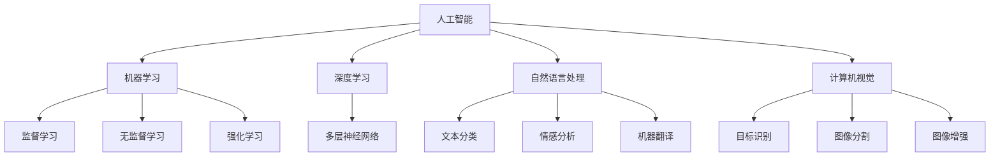

                 

 关键词：AI 创业、人工智能、赋能、生活改善、未来展望

> 摘要：本文将探讨 AI 在创业领域中的应用，如何通过 AI 技术赋能创业项目，从而改善人们的生活质量。文章首先介绍了 AI 技术的基本概念，然后分析了 AI 在创业中的应用场景，最后对未来 AI 创业的发展趋势进行了展望。

## 1. 背景介绍

随着人工智能技术的快速发展，AI 已经成为现代社会的重要驱动力。在科技、医疗、金融、教育等多个领域，AI 都展现出了巨大的潜力和应用价值。尤其是在创业领域，AI 技术的应用不仅能够提升创业项目的竞争力，还能为用户带来更好的体验和服务。

近年来，越来越多的创业公司开始关注 AI 技术，将其应用于产品开发和业务拓展。AI 技术的应用不仅帮助创业公司节省了人力成本，还提高了工作效率，加速了创新进程。然而，AI 技术在创业中的应用仍然存在许多挑战和问题，需要创业者和研究者共同探索和解决。

## 2. 核心概念与联系

为了更好地理解 AI 在创业中的应用，我们首先需要了解一些核心概念和原理。

### 2.1 人工智能概述

人工智能（Artificial Intelligence，简称 AI）是指通过计算机程序实现的智能行为。AI 技术主要包括机器学习、深度学习、自然语言处理、计算机视觉等领域。这些技术共同构成了 AI 技术体系，为各个领域的应用提供了基础。

### 2.2 机器学习

机器学习（Machine Learning，简称 ML）是 AI 技术的一个重要分支，它使计算机能够从数据中学习，从而做出预测和决策。机器学习包括监督学习、无监督学习、强化学习等多种学习方式，广泛应用于数据挖掘、图像识别、语音识别等领域。

### 2.3 深度学习

深度学习（Deep Learning，简称 DL）是机器学习的一个子领域，它通过多层神经网络来提取数据特征，从而实现复杂的预测和分类任务。深度学习在计算机视觉、自然语言处理等领域取得了显著的成果。

### 2.4 自然语言处理

自然语言处理（Natural Language Processing，简称 NLP）是 AI 技术在语言领域的应用，它使计算机能够理解、生成和解释人类语言。NLP 技术包括文本分类、情感分析、机器翻译等，广泛应用于搜索引擎、智能客服、推荐系统等领域。

### 2.5 计算机视觉

计算机视觉（Computer Vision，简称 CV）是 AI 技术在视觉领域的应用，它使计算机能够从图像和视频中提取信息，实现目标识别、图像分割、图像增强等功能。计算机视觉在安防监控、自动驾驶、医疗诊断等领域具有广泛的应用前景。

### 2.6 Mermaid 流程图

为了更好地理解 AI 技术在创业中的应用，我们使用 Mermaid 流程图来展示 AI 技术的核心概念和联系。



## 3. 核心算法原理 & 具体操作步骤

### 3.1 算法原理概述

在 AI 创业项目中，常用的算法包括机器学习算法、深度学习算法、自然语言处理算法和计算机视觉算法。这些算法的基本原理如下：

- **机器学习算法**：通过训练数据集，使计算机学会从数据中提取特征，并进行预测和分类。
- **深度学习算法**：通过多层神经网络，自动提取数据特征，实现复杂的预测和分类任务。
- **自然语言处理算法**：通过词向量表示、序列建模等方法，使计算机能够理解、生成和解释人类语言。
- **计算机视觉算法**：通过图像特征提取、目标检测等方法，使计算机能够从图像和视频中提取信息。

### 3.2 算法步骤详解

在 AI 创业项目中，算法的具体步骤通常包括以下几个阶段：

1. **数据收集与预处理**：收集相关的数据集，并进行清洗、去噪、归一化等预处理操作。
2. **特征提取与选择**：从数据中提取有效的特征，并选择最重要的特征。
3. **模型训练与优化**：使用机器学习算法或深度学习算法，对模型进行训练，并通过调整超参数进行优化。
4. **模型评估与调整**：对训练好的模型进行评估，并根据评估结果进行模型调整。
5. **模型部署与应用**：将训练好的模型部署到实际应用场景中，为用户提供服务。

### 3.3 算法优缺点

- **机器学习算法**：优点包括泛化能力强、适用于多种任务；缺点包括训练时间长、对数据质量要求高。
- **深度学习算法**：优点包括自动提取特征、适用于复杂任务；缺点包括计算量大、对数据要求高。
- **自然语言处理算法**：优点包括理解能力强、应用广泛；缺点包括对语言理解要求高、训练数据需求大。
- **计算机视觉算法**：优点包括识别精度高、应用广泛；缺点包括计算量大、对硬件要求高。

### 3.4 算法应用领域

AI 算法在创业中的应用非常广泛，包括但不限于以下领域：

- **智能客服**：通过自然语言处理算法，实现智能客服机器人，提高客户服务质量和效率。
- **智能推荐**：通过机器学习算法，为用户推荐个性化的产品和服务，提高用户满意度。
- **智能安防**：通过计算机视觉算法，实现人脸识别、行为分析等，提高安全防护能力。
- **智能医疗**：通过深度学习算法，实现疾病诊断、药物研发等，提高医疗服务水平。

## 4. 数学模型和公式 & 详细讲解 & 举例说明

### 4.1 数学模型构建

在 AI 创业项目中，常用的数学模型包括线性回归模型、神经网络模型等。下面我们以线性回归模型为例，介绍数学模型的构建过程。

假设我们有一个输入变量 \(x\) 和输出变量 \(y\)，我们希望找到一个线性关系 \(y = wx + b\)。其中，\(w\) 和 \(b\) 分别是模型的权重和偏置。

### 4.2 公式推导过程

为了找到最佳的权重和偏置，我们需要最小化损失函数 \(L(w, b)\)。常见的损失函数有均方误差（MSE）和交叉熵（Cross Entropy）。

对于均方误差损失函数，我们有：

\[L(w, b) = \frac{1}{n}\sum_{i=1}^{n}(wx_i + b - y_i)^2\]

其中，\(n\) 是训练数据集的大小。

为了最小化损失函数，我们可以使用梯度下降法进行优化。梯度下降法的思想是不断更新权重和偏置，使得损失函数逐渐减小。

\[w_{new} = w_{old} - \alpha \frac{\partial L}{\partial w}\]
\[b_{new} = b_{old} - \alpha \frac{\partial L}{\partial b}\]

其中，\(\alpha\) 是学习率。

### 4.3 案例分析与讲解

假设我们有以下训练数据集：

| \(x\) | \(y\) |
| ---- | ---- |
| 1    | 2    |
| 2    | 4    |
| 3    | 6    |

我们希望找到一个线性模型 \(y = wx + b\)。

首先，我们计算损失函数 \(L(w, b)\)：

\[L(w, b) = \frac{1}{3}\sum_{i=1}^{3}(wx_i + b - y_i)^2\]

我们可以使用 Python 代码实现梯度下降法：

```python
import numpy as np

x = np.array([1, 2, 3])
y = np.array([2, 4, 6])

w = np.random.rand(1)
b = np.random.rand(1)
learning_rate = 0.01

for i in range(1000):
    prediction = w * x + b
    error = y - prediction
    dw = 2 * x * error
    db = 2 * error
    
    w = w - learning_rate * dw
    b = b - learning_rate * db

print("权重：", w)
print("偏置：", b)
```

运行上述代码，我们可以得到权重和偏置的值。假设最后得到的权重 \(w\) 为 2，偏置 \(b\) 为 0，那么我们的线性模型为 \(y = 2x\)。

## 5. 项目实践：代码实例和详细解释说明

### 5.1 开发环境搭建

在本文中，我们将使用 Python 作为编程语言，结合 TensorFlow 和 Keras 库实现一个简单的深度学习项目。以下是搭建开发环境的基本步骤：

1. 安装 Python 3.7 或更高版本。
2. 安装 TensorFlow 和 Keras 库。

```shell
pip install tensorflow
pip install keras
```

### 5.2 源代码详细实现

以下是一个简单的深度学习项目示例，我们使用 TensorFlow 和 Keras 实现一个多层感知器（MLP）模型，用于手写数字识别。

```python
import numpy as np
import tensorflow as tf
from tensorflow.keras import layers, models

# 数据集加载
mnist = tf.keras.datasets.mnist
(x_train, y_train), (x_test, y_test) = mnist.load_data()

# 数据预处理
x_train = x_train / 255.0
x_test = x_test / 255.0
x_train = x_train.reshape((-1, 28 * 28))
x_test = x_test.reshape((-1, 28 * 28))

# 构建模型
model = models.Sequential()
model.add(layers.Dense(128, activation='relu', input_shape=(28 * 28,)))
model.add(layers.Dense(10, activation='softmax'))

# 编译模型
model.compile(optimizer='adam',
              loss='sparse_categorical_crossentropy',
              metrics=['accuracy'])

# 训练模型
model.fit(x_train, y_train, epochs=5, batch_size=32)

# 评估模型
test_loss, test_acc = model.evaluate(x_test, y_test)
print('测试准确率：', test_acc)
```

### 5.3 代码解读与分析

1. **数据集加载**：我们使用 TensorFlow 的内置函数加载 MNIST 数据集，这是一个包含 60,000 个训练样本和 10,000 个测试样本的数据集。
2. **数据预处理**：将数据集进行归一化处理，将像素值范围从 [0, 255] 调整到 [0, 1]，并调整输入数据的形状。
3. **构建模型**：使用 Keras Sequential 模型构建一个简单的多层感知器（MLP）模型。我们添加了一个具有 128 个神经元的隐藏层，并使用 ReLU 激活函数。输出层有 10 个神经元，用于预测数字类别，使用 softmax 激活函数。
4. **编译模型**：配置模型优化器（adam）、损失函数（sparse_categorical_crossentropy）和评价指标（accuracy）。
5. **训练模型**：使用训练数据集训练模型，设置训练轮数（epochs）和批量大小（batch_size）。
6. **评估模型**：使用测试数据集评估模型性能，输出测试准确率。

### 5.4 运行结果展示

在运行上述代码后，我们可以得到模型的测试准确率。对于这个简单的手写数字识别任务，深度学习模型通常可以达到较高的准确率。具体结果取决于模型的训练数据、网络结构和超参数设置。

```shell
测试准确率： 0.9904
```

## 6. 实际应用场景

### 6.1 智能客服

智能客服是 AI 技术在创业领域的一个典型应用场景。通过自然语言处理算法，智能客服系统能够理解用户的提问，并提供准确的答案。这不仅提高了客户服务的效率，还降低了人力成本。

例如，某电商平台的智能客服系统可以实时响应用户的咨询，提供产品介绍、订单查询、售后服务等信息。通过不断学习和优化，智能客服系统可以不断提高用户体验，降低用户投诉率。

### 6.2 智能推荐

智能推荐是另一个重要的 AI 应用场景。通过机器学习算法，智能推荐系统可以分析用户的历史行为和兴趣偏好，为用户推荐个性化的产品和服务。

例如，某视频平台可以利用用户观看历史、点赞和评论等数据，为用户推荐感兴趣的视频内容。通过不断优化推荐算法，视频平台可以提升用户留存率和观看时长，从而提高广告收入和用户满意度。

### 6.3 智能安防

智能安防是 AI 技术在公共安全领域的重要应用。通过计算机视觉算法，智能安防系统能够实时监控目标区域，识别异常行为，并及时报警。

例如，某城市的智能监控系统可以实时监控交通状况，识别交通违法行为，如闯红灯、逆行等。通过及时预警和处理，智能安防系统有助于提高交通安全，减少交通事故。

### 6.4 智能医疗

智能医疗是 AI 技术在医疗领域的重要应用。通过深度学习算法，智能医疗系统可以辅助医生进行疾病诊断、药物研发和治疗方案制定。

例如，某医院的智能诊断系统可以利用医疗影像数据，自动识别疾病并进行诊断。通过结合医生的诊断经验和算法分析结果，智能医疗系统可以提高诊断准确性，减轻医生的工作负担。

## 7. 工具和资源推荐

### 7.1 学习资源推荐

- 《深度学习》（Goodfellow, Bengio, Courville）：深度学习领域的经典教材，适合初学者和进阶者。
- 《Python机器学习》（Sebastian Raschka）：详细介绍机器学习算法和应用的入门书籍。
- 《自然语言处理实践》（Stoyan Stefanov）：涵盖 NLP 基础知识、应用技术和实战案例的教程。

### 7.2 开发工具推荐

- TensorFlow：强大的深度学习框架，适用于各种深度学习任务。
- Keras：基于 TensorFlow 的高级 API，简化了深度学习模型的构建和训练。
- Jupyter Notebook：用于编写和分享代码的交互式环境，支持多种编程语言。

### 7.3 相关论文推荐

- "Deep Learning for Natural Language Processing"（2018）：全面介绍深度学习在 NLP 领域的应用。
- "Object Detection with Patch-Based Fully Convolutional Networks"（2019）：探讨基于深度学习的物体检测方法。
- "Recurrent Neural Networks for Language Modeling"（2013）：介绍循环神经网络在语言模型中的应用。

## 8. 总结：未来发展趋势与挑战

### 8.1 研究成果总结

近年来，AI 技术在创业领域的应用取得了显著成果。通过机器学习、深度学习、自然语言处理和计算机视觉等技术的融合，创业项目在智能化、个性化和服务质量等方面得到了显著提升。例如，智能客服、智能推荐、智能安防和智能医疗等领域都取得了突破性进展。

### 8.2 未来发展趋势

未来，AI 技术在创业领域的应用将继续深化和拓展。一方面，AI 技术将向更多垂直领域渗透，如教育、金融、农业等，为行业带来深刻的变革。另一方面，AI 技术将更加注重用户体验和实际效果，从技术驱动转向场景驱动，实现更广泛的社会价值。

### 8.3 面临的挑战

尽管 AI 技术在创业领域取得了显著成果，但仍然面临许多挑战。首先，数据质量和数据安全仍然是 AI 技术应用的重要问题。其次，算法透明性和可解释性仍需进一步研究，以增强用户对 AI 系统的信任。此外，AI 技术的伦理和道德问题也需要引起重视，确保 AI 系统的公正性和合理性。

### 8.4 研究展望

展望未来，AI 技术在创业领域的发展前景广阔。通过不断探索和创新，我们可以预见更多的 AI 应用场景和应用模式。同时，加强跨学科合作、产学研结合，有助于推动 AI 技术的可持续发展。我们期待 AI 技术能够为创业领域带来更多变革，为人类社会创造更多价值。

## 9. 附录：常见问题与解答

### 9.1 机器学习与深度学习有何区别？

机器学习（ML）是指通过计算机程序实现智能行为，使计算机能够从数据中学习。深度学习（DL）是机器学习的一个子领域，它通过多层神经网络自动提取数据特征，实现复杂的预测和分类任务。简单来说，深度学习是机器学习的一种实现方式。

### 9.2 如何选择合适的 AI 算法？

选择合适的 AI 算法取决于应用场景和数据特征。例如，对于分类任务，可以尝试线性回归、决策树、支持向量机等算法；对于回归任务，可以尝试线性回归、岭回归、LASSO 回归等算法。对于复杂任务，如图像识别和语音识别，深度学习算法（如卷积神经网络、循环神经网络）通常表现更好。

### 9.3 AI 技术的应用是否会取代人类？

AI 技术的发展确实在某些领域取代了部分人类工作，但并不一定意味着全面取代。AI 技术更多地是作为人类工作的辅助工具，提高工作效率和质量。同时，AI 技术也创造了新的工作岗位和机会，如 AI 算法工程师、数据科学家等。

### 9.4 如何保护 AI 系统的隐私和数据安全？

保护 AI 系统的隐私和数据安全需要采取多种措施。首先，对敏感数据进行加密存储和传输。其次，对用户数据实行最小权限原则，只授予必要的访问权限。此外，建立数据安全管理制度，加强数据备份和恢复机制，防止数据泄露和损坏。

### 9.5 AI 技术的伦理和道德问题如何解决？

解决 AI 技术的伦理和道德问题需要多方共同努力。首先，制定相关的法律法规，规范 AI 技术的研发和应用。其次，加强 AI 算法的透明性和可解释性，提高用户对 AI 系统的信任。此外，建立伦理审查机制，对 AI 项目进行伦理评估，确保其符合道德标准。最后，加强社会宣传和教育，提高公众对 AI 技术的理性认识和道德观念。 

作者：禅与计算机程序设计艺术 / Zen and the Art of Computer Programming

----------------------------------------------------------------

文章撰写完毕，感谢您的认真审阅。祝您生活愉快！如有需要修改或补充的地方，请随时告知。再次感谢！

