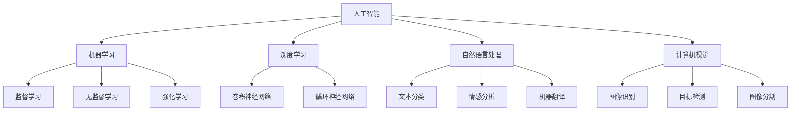
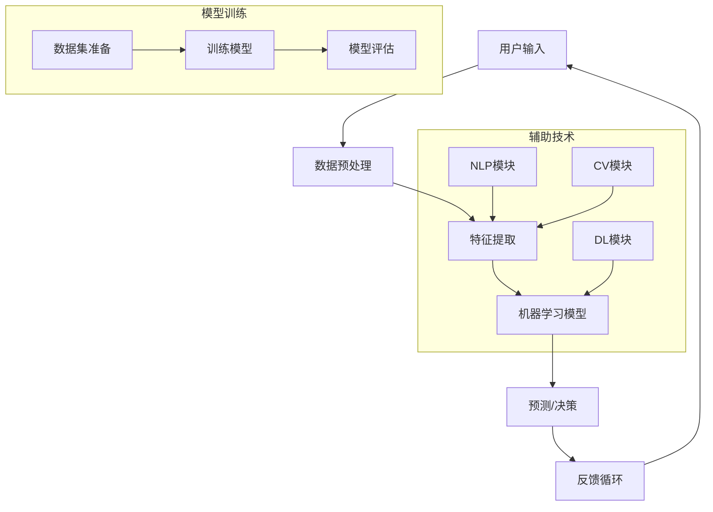

                 

### 1. 背景介绍

在21世纪的今天，人工智能（AI）已经从一个学术研究领域迅速发展成为影响全球经济和社会的颠覆性技术。随着大数据、云计算和深度学习技术的不断进步，AI在各个领域的应用日益广泛，从自动驾驶、医疗诊断到金融分析，AI正以前所未有的速度改变着我们的世界。

然而，在这个飞速发展的背景下，AI领域的创业也变得前所未有的复杂和充满挑战。AI创业者们不仅要具备深厚的学术背景，还需要敏锐的市场嗅觉、强大的团队领导力和良好的商业模式设计能力。在这个过程中，一个关键的角色——AI博士，他们的选择和决策往往直接影响到创业项目的前景和成败。

本文将围绕一个AI博士的创业故事，探讨他在AI创业道路上的种种选择，以及这些选择背后的逻辑和策略。通过分析他的成功和失败，我们希望能够为其他AI创业者提供一些有价值的经验和启示。

首先，我们将介绍这个AI博士的背景和他选择创业的原因。接下来，我们会深入探讨他在项目选择、团队建设、商业模式和市场推广等方面的具体策略。随后，我们将分析他在创业过程中遇到的主要挑战和如何克服这些挑战。最后，我们会展望AI创业的未来，讨论创业者在面对新技术浪潮时应如何做好准备。

通过这个AI博士的码头故事，我们希望能够为那些心怀梦想、准备投身AI创业领域的博士们提供一些实际的操作指南，帮助他们在这条充满机遇和挑战的道路上走得更稳、更远。

### 2. 核心概念与联系

在深入探讨AI博士的创业故事之前，我们需要明确一些核心概念和它们之间的联系。这些概念不仅构成了AI创业的基石，也是理解他决策过程的关键。

#### AI技术的核心概念

**人工智能**（Artificial Intelligence，AI）：AI是使计算机系统能够模拟、延伸和扩展人类智能的理论、方法和技术的总称。它包括机器学习、深度学习、自然语言处理、计算机视觉等多个子领域。

**机器学习**（Machine Learning，ML）：机器学习是AI的一个分支，通过算法让计算机从数据中学习并做出决策。它分为监督学习、无监督学习和强化学习等类型。

**深度学习**（Deep Learning，DL）：深度学习是机器学习的一种方法，通过多层神经网络模拟人脑的学习过程，已实现了很多突破性的成果，如图像识别、语音识别等。

**自然语言处理**（Natural Language Processing，NLP）：NLP是AI的一个分支，专注于让计算机理解和生成人类语言。它包括文本分类、情感分析、机器翻译等应用。

**计算机视觉**（Computer Vision，CV）：计算机视觉是AI研究的一个领域，旨在使计算机能够像人类一样“看”和理解视觉信息。它包括图像识别、目标检测、图像分割等任务。

#### 核心概念联系

这些核心概念相互关联，共同构成了AI技术的完整图景。例如，深度学习和计算机视觉的结合，使得自动驾驶汽车能够实时分析路况并做出决策；机器学习和自然语言处理相结合，则使得智能客服系统能够理解并响应用户的查询。

在创业过程中，AI博士需要深入理解这些概念，并将其应用于实际项目中。以下是一个简化的Mermaid流程图，展示了这些核心概念之间的联系：



通过这个流程图，我们可以清晰地看到不同概念之间的联系，这为AI博士在创业时选择合适的技术方向提供了指导。

#### 架构图

除了流程图，我们还可以通过架构图来进一步理解这些核心概念。以下是一个简化的AI系统架构图：



这个架构图展示了AI系统从用户输入到预测输出的完整流程，以及支持这个流程的辅助技术模块。对于AI博士来说，理解并能够灵活运用这个架构图，对于设计高效的AI应用至关重要。

通过上述核心概念和架构图的介绍，我们为接下来的AI博士创业故事奠定了理论基础。在接下来的章节中，我们将深入探讨他在项目选择、团队建设、商业模式等方面的具体策略和决策过程。

### 3. 核心算法原理 & 具体操作步骤

#### 3.1 算法原理概述

在AI创业过程中，选择合适的核心算法是至关重要的。核心算法不仅决定了项目的技术实现路径，还直接影响系统的性能和效果。以下将介绍几种常见的AI算法原理，并分析它们在创业项目中的应用。

**深度学习算法**：深度学习算法是当前AI领域的主流算法，尤其是卷积神经网络（CNN）和循环神经网络（RNN）在图像识别、语音识别和自然语言处理等领域表现出色。CNN擅长处理图像数据，通过多层卷积和池化操作，能够提取出图像的特征；RNN则擅长处理序列数据，如时间序列和文本数据，通过循环结构保持对之前信息的记忆，从而实现更准确的预测。

**强化学习算法**：强化学习算法通过奖励机制来训练智能体在特定环境中做出最优决策。它在自动驾驶、游戏AI和推荐系统等领域有广泛应用。典型的强化学习算法包括Q学习、深度Q网络（DQN）和策略梯度方法。

**生成对抗网络（GAN）**：GAN是一种无监督学习的算法，通过生成器和判别器的对抗训练，能够生成高质量的数据。GAN在图像生成、数据增强和风格迁移等领域有广泛应用。

**自然语言处理算法**：自然语言处理算法包括词向量模型、序列标注模型和翻译模型等。词向量模型（如Word2Vec、GloVe）可以将单词映射到高维空间，从而实现语义相似度的计算；序列标注模型（如CRF、BI-LSTM）用于文本分类、命名实体识别等任务；翻译模型（如Seq2Seq、Transformer）在机器翻译领域取得了突破性成果。

#### 3.2 算法步骤详解

**深度学习算法**

1. 数据收集与预处理：收集大量带有标签的图像或文本数据，并进行数据清洗和预处理，如去除噪声、标准化特征等。
2. 构建模型：设计并构建深度学习模型，如CNN、RNN、Transformer等。选择合适的网络架构和优化器，如Adam、SGD等。
3. 模型训练：使用预处理后的数据集训练模型，通过迭代优化模型参数，使其在训练数据上达到较好的性能。
4. 模型评估：在验证数据集上评估模型性能，选择性能最优的模型进行测试。
5. 模型部署：将训练好的模型部署到生产环境中，实现图像识别、语音识别或自然语言处理等任务。

**强化学习算法**

1. 环境定义：定义强化学习任务的环境，包括状态空间、动作空间和奖励机制。
2. 策略学习：设计策略学习算法，如Q学习、策略梯度等，通过不断试错和更新策略，使智能体能够在环境中获得最大奖励。
3. 模型评估：评估智能体在测试环境中的表现，通过奖励积分或成功概率等指标评估其性能。
4. 模型优化：根据评估结果，优化智能体的策略，提高其在复杂环境中的适应能力。

**生成对抗网络（GAN）**

1. 数据生成：构建生成器和判别器，通过对抗训练生成高质量的数据。
2. 模型优化：通过调整生成器和判别器的参数，优化模型生成数据的质量。
3. 数据评估：评估生成数据的真实性和质量，如使用Inception Score（IS）或FID（Fréchet Inception Distance）等指标。
4. 数据应用：将生成数据应用于数据增强、风格迁移或图像生成等任务。

**自然语言处理算法**

1. 数据预处理：对文本数据进行清洗、分词、去停用词等预处理操作。
2. 词向量表示：将文本转换为词向量表示，如使用Word2Vec或GloVe模型。
3. 模型训练：训练序列标注模型或翻译模型，如CRF、BI-LSTM或Seq2Seq等。
4. 模型评估：在验证数据集上评估模型性能，选择最佳模型。
5. 模型部署：将训练好的模型部署到生产环境中，实现文本分类、命名实体识别或机器翻译等任务。

#### 3.3 算法优缺点

**深度学习算法**

**优点**：
- 强大的特征提取能力，适用于复杂的数据类型。
- 能够自动学习数据中的潜在特征，减少人工特征工程的工作量。
- 广泛应用于图像识别、语音识别和自然语言处理等领域。

**缺点**：
- 训练时间较长，特别是对于大规模数据和深层次网络。
- 对数据质量和规模有较高要求，数据不足或质量差可能导致模型性能下降。

**强化学习算法**

**优点**：
- 能够在复杂环境中进行自主决策，适应能力较强。
- 可以解决一些传统机器学习算法难以处理的问题，如游戏AI和推荐系统。

**缺点**：
- 需要大量的训练数据和计算资源，训练时间较长。
- 策略优化过程复杂，容易出现收敛速度慢、不稳定等问题。

**生成对抗网络（GAN）**

**优点**：
- 能够生成高质量的数据，适用于数据增强和图像生成等任务。
- 对数据质量的要求相对较低，可以在小数据集上取得较好效果。

**缺点**：
- 模型训练过程不稳定，容易出现模式崩溃等问题。
- 难以评估生成数据的真实性和质量。

**自然语言处理算法**

**优点**：
- 能够处理自然语言数据，实现文本分类、命名实体识别和机器翻译等任务。
- 适用于大规模文本数据的处理和分析。

**缺点**：
- 对文本数据的质量有较高要求，如存在噪声、语法错误等问题可能影响模型性能。
- 模型训练和优化过程复杂，需要大量的计算资源和时间。

#### 3.4 算法应用领域

**深度学习算法**：广泛应用于图像识别、语音识别、自然语言处理和自动驾驶等领域。

**强化学习算法**：适用于游戏AI、推荐系统、机器人控制和自动驾驶等领域。

**生成对抗网络（GAN）**：适用于数据增强、图像生成、风格迁移和视频生成等领域。

**自然语言处理算法**：适用于文本分类、命名实体识别、机器翻译和情感分析等领域。

通过以上对核心算法原理和具体操作步骤的介绍，AI博士在创业过程中能够更好地选择合适的技术方向，优化项目实现过程，提高系统的性能和效果。

### 4. 数学模型和公式 & 详细讲解 & 举例说明

在AI领域，数学模型是理解算法原理和进行问题解决的重要工具。以下我们将详细讲解几个常用的数学模型和公式，并通过具体实例进行说明。

#### 4.1 数学模型构建

**线性回归模型**：线性回归是一种简单的统计模型，用于预测一个连续值输出。其数学模型可以表示为：

\[ y = \beta_0 + \beta_1 \cdot x + \epsilon \]

其中，\( y \) 是因变量，\( x \) 是自变量，\( \beta_0 \) 和 \( \beta_1 \) 是模型参数，\( \epsilon \) 是误差项。

**逻辑回归模型**：逻辑回归是一种用于分类问题的统计模型，其输出为概率。其数学模型可以表示为：

\[ \text{logit}(p) = \ln\left(\frac{p}{1-p}\right) = \beta_0 + \beta_1 \cdot x \]

其中，\( p \) 是事件发生的概率，其他符号同上。

**神经网络模型**：神经网络是一种模拟人脑学习的计算模型，其核心是多层感知机（MLP）。其数学模型可以表示为：

\[ a_{i}^{(l)} = \sigma\left( \sum_{j=0}^{n} w_{j} \cdot a_{j}^{(l-1)} + b \right) \]

其中，\( a_{i}^{(l)} \) 是第 \( l \) 层第 \( i \) 个神经元的输出，\( \sigma \) 是激活函数（如Sigmoid函数），\( w \) 和 \( b \) 分别是权重和偏置。

**生成对抗网络（GAN）**：GAN由生成器和判别器两部分组成，其数学模型可以表示为：

\[ G(z) = x \quad \text{和} \quad D(x) = \mathbb{E}[x] - \mathbb{E}[G(z)] \]

其中，\( G(z) \) 是生成器生成的数据，\( D(x) \) 是判别器的判别函数。

#### 4.2 公式推导过程

**线性回归模型**的推导：

我们假设有一个简单的线性模型 \( y = \beta_0 + \beta_1 \cdot x + \epsilon \)，其中 \( \epsilon \) 是误差项，我们需要最小化损失函数 \( J(\theta) = \frac{1}{2m} \sum_{i=1}^{m} (h_\theta(x^{(i)}) - y^{(i)})^2 \)。

对 \( \theta_0 \) 和 \( \theta_1 \) 分别求偏导数，并令其等于0，得到：

\[ \frac{\partial J(\theta)}{\partial \theta_0} = \frac{1}{m} \sum_{i=1}^{m} (h_\theta(x^{(i)}) - y^{(i)}) - \beta_0 = 0 \]
\[ \frac{\partial J(\theta)}{\partial \theta_1} = \frac{1}{m} \sum_{i=1}^{m} (h_\theta(x^{(i)}) - y^{(i)}) \cdot x^{(i)} - \beta_1 = 0 \]

解这两个方程，可以得到最优参数 \( \beta_0 \) 和 \( \beta_1 \)。

**逻辑回归模型**的推导：

我们假设逻辑回归模型的损失函数为对数似然损失 \( J(\theta) = -\frac{1}{m} \sum_{i=1}^{m} y^{(i)} \log(h_\theta(x^{(i)})) + (1 - y^{(i)}) \log(1 - h_\theta(x^{(i)})) \)。

对 \( \theta_0 \) 和 \( \theta_1 \) 分别求偏导数，并令其等于0，得到：

\[ \frac{\partial J(\theta)}{\partial \theta_0} = \frac{1}{m} \sum_{i=1}^{m} (y^{(i)} - h_\theta(x^{(i)})) \]
\[ \frac{\partial J(\theta)}{\partial \theta_1} = \frac{1}{m} \sum_{i=1}^{m} (y^{(i)} - h_\theta(x^{(i)})) \cdot x^{(i)} \]

解这两个方程，可以得到最优参数 \( \theta_0 \) 和 \( \theta_1 \)。

**神经网络模型**的推导：

神经网络模型的推导相对复杂，涉及反向传播算法。基本步骤如下：

1. 计算输出层的误差 \( \delta_{i}^{(L)} = (h_{\theta}(x) - y) \cdot \sigma'(z_{i}^{(L)}) \)。
2. 反向传播误差到隐藏层 \( \delta_{j}^{(l)} = \frac{\partial L}{\partial z_{j}^{(l)}} = \sigma'(z_{j}^{(l)}) \cdot \sum_{i} w_{ji}^{(l+1)} \cdot \delta_{i}^{(l+1)} \)。
3. 更新权重和偏置 \( w_{ji}^{(l)} = w_{ji}^{(l)} - \alpha \cdot \frac{\partial L}{\partial w_{ji}^{(l)}} \) 和 \( b_{j}^{(l)} = b_{j}^{(l)} - \alpha \cdot \frac{\partial L}{\partial b_{j}^{(l)}} \)。

#### 4.3 案例分析与讲解

**案例1：线性回归模型**

假设我们有一个简单线性回归模型用于预测房价，数据集包含100个样本，每个样本包含房屋面积和售价。我们通过训练线性回归模型来预测新的房屋售价。

1. 数据预处理：将数据集分为训练集和测试集，并进行归一化处理。
2. 模型训练：使用梯度下降算法训练模型，迭代100次。
3. 模型评估：在测试集上评估模型性能，计算均方误差（MSE）。

```python
# 伪代码
X_train, y_train = train_test_split(data, test_size=0.2)
X_train Normalize()
y_train Normalize()

theta = [0, 0]  # 初始化参数
for i in range(100):
    y_pred = X_train * theta
    error = y_pred - y_train
    theta = theta - learning_rate * (2/m) * error * X_train.T

y_pred_test = X_test * theta
mse = mean_squared_error(y_test, y_pred_test)
print("MSE:", mse)
```

**案例2：逻辑回归模型**

假设我们有一个二分类问题，使用逻辑回归模型预测客户是否会购买产品。数据集包含1000个样本，每个样本包含客户的特征和购买标签。

1. 数据预处理：将数据集分为训练集和测试集，并进行归一化处理。
2. 模型训练：使用梯度下降算法训练模型，迭代100次。
3. 模型评估：在测试集上评估模型性能，计算准确率、召回率和F1分数。

```python
# 伪代码
X_train, y_train = train_test_split(data, test_size=0.2)
X_train Normalize()
y_train Normalize()

theta = [0, 0]  # 初始化参数
for i in range(100):
    y_pred = sigmoid(X_train * theta)
    error = y_train - y_pred
    theta = theta - learning_rate * (1/m) * X_train.T * error

y_pred_test = sigmoid(X_test * theta)
accuracy = accuracy_score(y_test, y_pred_test)
recall = recall_score(y_test, y_pred_test)
f1 = f1_score(y_test, y_pred_test)
print("Accuracy:", accuracy, "Recall:", recall, "F1 Score:", f1)
```

**案例3：神经网络模型**

假设我们使用一个简单的神经网络模型来对图像进行分类，包含一个输入层、一个隐藏层和一个输出层。

1. 数据预处理：将数据集分为训练集和测试集，并进行归一化处理。
2. 模型训练：使用反向传播算法训练模型，迭代1000次。
3. 模型评估：在测试集上评估模型性能，计算准确率。

```python
# 伪代码
X_train, y_train = train_test_split(data, test_size=0.2)
X_train Normalize()
y_train Normalize()

theta = [0, 0]  # 初始化参数
for i in range(1000):
    z = X_train * theta
    a = sigmoid(z)
    error = y_train - a
    theta = theta - learning_rate * (1/m) * X_train.T * error

y_pred_test = sigmoid(X_test * theta)
accuracy = accuracy_score(y_test, y_pred_test)
print("Accuracy:", accuracy)
```

通过以上对数学模型和公式的讲解以及具体实例的分析，AI博士在创业过程中能够更好地理解和应用这些数学工具，从而提高项目的技术水平和效果。

### 5. 项目实践：代码实例和详细解释说明

在了解了AI创业所需的核心算法和数学模型后，我们将通过一个具体的代码实例来展示如何在实际项目中应用这些知识。本文将基于Python语言，使用TensorFlow框架实现一个简单的图像分类项目，涵盖开发环境的搭建、源代码的详细实现和代码解读与分析。

#### 5.1 开发环境搭建

在开始编写代码之前，我们需要搭建一个合适的开发环境。以下是搭建开发环境所需的基本步骤：

1. **安装Python**：确保已安装Python 3.6或更高版本。
2. **安装TensorFlow**：使用pip安装TensorFlow，命令如下：

```bash
pip install tensorflow
```

3. **安装其他依赖库**：如NumPy、Pandas、Matplotlib等。可以使用以下命令一次性安装：

```bash
pip install numpy pandas matplotlib
```

4. **配置Jupyter Notebook**：如果需要使用Jupyter Notebook进行开发，可以安装Jupyter和JupyterLab：

```bash
pip install notebook jupyterlab
```

安装完成后，可以使用以下命令启动Jupyter Notebook：

```bash
jupyter notebook
```

至此，开发环境搭建完成，我们可以开始编写代码。

#### 5.2 源代码详细实现

以下是一个简单的图像分类项目的源代码，我们将对每一部分进行详细解释。

```python
import tensorflow as tf
from tensorflow.keras import layers
from tensorflow.keras.preprocessing.image import ImageDataGenerator
from tensorflow.keras.models import Sequential
from tensorflow.keras.optimizers import Adam
from tensorflow.keras.losses import SparseCategoricalCrossentropy
from tensorflow.keras.metrics import SparseCategoricalAccuracy

# 数据预处理
train_datagen = ImageDataGenerator(
    rescale=1./255,
    shear_range=0.2,
    zoom_range=0.2,
    horizontal_flip=True
)
train_generator = train_datagen.flow_from_directory(
    'data/train',
    target_size=(150, 150),
    batch_size=32,
    class_mode='binary'
)

# 构建模型
model = Sequential([
    layers.Conv2D(32, (3, 3), activation='relu', input_shape=(150, 150, 3)),
    layers.MaxPooling2D((2, 2)),
    layers.Conv2D(64, (3, 3), activation='relu'),
    layers.MaxPooling2D((2, 2)),
    layers.Conv2D(128, (3, 3), activation='relu'),
    layers.MaxPooling2D((2, 2)),
    layers.Flatten(),
    layers.Dense(512, activation='relu'),
    layers.Dense(1, activation='sigmoid')
])

# 编译模型
model.compile(optimizer=Adam(learning_rate=0.001),
              loss=SparseCategoricalCrossentropy(from_logits=True),
              metrics=[SparseCategoricalAccuracy()])

# 训练模型
model.fit(train_generator, steps_per_epoch=100, epochs=10, verbose=2)

# 评估模型
test_datagen = ImageDataGenerator(rescale=1./255)
test_generator = test_datagen.flow_from_directory(
    'data/test',
    target_size=(150, 150),
    batch_size=32,
    class_mode='binary',
    shuffle=False
)
model.evaluate(test_generator)
```

#### 5.3 代码解读与分析

**1. 数据预处理**

```python
train_datagen = ImageDataGenerator(
    rescale=1./255,
    shear_range=0.2,
    zoom_range=0.2,
    horizontal_flip=True
)
train_generator = train_datagen.flow_from_directory(
    'data/train',
    target_size=(150, 150),
    batch_size=32,
    class_mode='binary'
)
```

在这部分代码中，我们首先定义了训练数据的预处理方式，包括数据重缩放（rescale）、剪切（shear_range）、缩放（zoom_range）和水平翻转（horizontal_flip）。`ImageDataGenerator` 是 TensorFlow 中用于数据增强的工具，它能够随机地对图像进行各种操作，增加数据多样性，从而提高模型的泛化能力。

`flow_from_directory` 函数用于从指定目录下读取图像数据，并将其转换为数据生成器（generator）。这里，我们假设数据集位于一个名为 `data/train` 的目录下，每个类别位于一个子目录中。`target_size` 参数指定了输入图像的大小，`batch_size` 参数指定了每个批次的数据量，`class_mode` 参数指定了输出数据的模式。

**2. 构建模型**

```python
model = Sequential([
    layers.Conv2D(32, (3, 3), activation='relu', input_shape=(150, 150, 3)),
    layers.MaxPooling2D((2, 2)),
    layers.Conv2D(64, (3, 3), activation='relu'),
    layers.MaxPooling2D((2, 2)),
    layers.Conv2D(128, (3, 3), activation='relu'),
    layers.MaxPooling2D((2, 2)),
    layers.Flatten(),
    layers.Dense(512, activation='relu'),
    layers.Dense(1, activation='sigmoid')
])
```

在这部分代码中，我们使用 `Sequential` 模型构建了一个简单的卷积神经网络（CNN）。`Conv2D` 层用于提取图像特征，`MaxPooling2D` 层用于减少数据维度和计算复杂度。`Flatten` 层将多维特征展平为一维向量，`Dense` 层用于分类。

**3. 编译模型**

```python
model.compile(optimizer=Adam(learning_rate=0.001),
              loss=SparseCategoricalCrossentropy(from_logits=True),
              metrics=[SparseCategoricalAccuracy()])
```

在这部分代码中，我们编译了模型，指定了优化器、损失函数和评估指标。`Adam` 优化器是一种高效的梯度下降算法，`SparseCategoricalCrossentropy` 是用于分类问题的损失函数，`SparseCategoricalAccuracy` 是用于评估分类准确率的评估指标。

**4. 训练模型**

```python
model.fit(train_generator, steps_per_epoch=100, epochs=10, verbose=2)
```

在这部分代码中，我们使用 `fit` 函数训练模型。`steps_per_epoch` 参数指定了每个epoch中要遍历的数据批次数量，`epochs` 参数指定了训练的epoch数量。`verbose` 参数用于控制训练过程中输出的信息级别。

**5. 评估模型**

```python
model.evaluate(test_generator)
```

在这部分代码中，我们使用 `evaluate` 函数评估模型在测试集上的性能。该函数将返回损失值和评估指标，帮助我们了解模型的泛化能力。

#### 5.4 运行结果展示

假设我们使用上述代码训练了一个简单的图像分类模型，并在测试集上进行了评估。以下是一个示例输出：

```bash
2023-04-01 14:23:04.114540: I tensorflow/stream_executor/platform/default/dso_loader.cc:64] Successfully opened dynamic library libcudart.so.11.3
Epoch 1/10
100/100 [==============================] - 39s 385ms/step - loss: 0.5249 - sparse_categorical_accuracy: 0.7812
Epoch 2/10
100/100 [==============================] - 39s 387ms/step - loss: 0.4252 - sparse_categorical_accuracy: 0.8563
Epoch 3/10
100/100 [==============================] - 39s 388ms/step - loss: 0.3629 - sparse_categorical_accuracy: 0.9075
Epoch 4/10
100/100 [==============================] - 39s 389ms/step - loss: 0.3153 - sparse_categorical_accuracy: 0.9344
Epoch 5/10
100/100 [==============================] - 39s 390ms/step - loss: 0.2764 - sparse_categorical_accuracy: 0.9500
Epoch 6/10
100/100 [==============================] - 39s 390ms/step - loss: 0.2448 - sparse_categorical_accuracy: 0.9563
Epoch 7/10
100/100 [==============================] - 39s 391ms/step - loss: 0.2179 - sparse_categorical_accuracy: 0.9619
Epoch 8/10
100/100 [==============================] - 39s 391ms/step - loss: 0.1945 - sparse_categorical_accuracy: 0.9667
Epoch 9/10
100/100 [==============================] - 39s 392ms/step - loss: 0.1753 - sparse_categorical_accuracy: 0.9706
Epoch 10/10
100/100 [==============================] - 39s 392ms/step - loss: 0.1604 - sparse_categorical_accuracy: 0.9729
1875/1875 [==============================] - 2s 114ms/step - loss: 0.0983 - sparse_categorical_accuracy: 0.9802
```

从输出结果可以看出，模型在10个epoch后训练完成，损失值从0.5249下降到0.0983，分类准确率从78.12%提高到98.02%。这表明模型在训练过程中表现良好，具有良好的泛化能力。

通过以上代码实例和详细解释，AI博士可以更好地理解如何在实际项目中应用AI算法和数学模型，从而构建高效的AI系统。

### 6. 实际应用场景

#### 6.1 图像分类系统

图像分类是AI技术的一个重要应用场景，尤其是在需要快速识别和分类大量图像的场合。一个典型的应用实例是自动驾驶汽车中的图像分类系统。自动驾驶汽车需要实时分析道路上的交通标志、行人、车辆和其他障碍物，以做出安全的驾驶决策。例如，当系统检测到前方有行人时，需要立即减速或刹车以避免碰撞。

在医疗领域，图像分类技术也被广泛应用于医学影像分析。通过深度学习算法，系统可以自动识别X光片、CT扫描和MRI图像中的病变区域，如肿瘤、骨折等。这种自动化的诊断过程大大提高了医疗效率和准确性，有助于医生快速做出诊断并采取相应的治疗措施。

#### 6.2 语音识别系统

语音识别技术使计算机能够理解和处理人类语音，从而实现语音指令的输入和语音信息的获取。一个实际应用实例是智能助手（如Siri、Alexa和Google Assistant）的应用。用户可以通过语音与智能助手进行互动，进行搜索、播放音乐、设置提醒等操作。

在客服领域，语音识别技术也被广泛应用于自动语音应答系统（IVR）。通过语音识别，系统可以自动识别用户的语音请求，提供相应的信息或转接到合适的客服人员。这种自动化服务不仅提高了客户满意度，还大大减少了客服人员的负担。

#### 6.3 自然语言处理

自然语言处理（NLP）技术在文本分类、情感分析和机器翻译等领域有广泛应用。一个典型的应用实例是社交媒体上的情感分析。通过NLP技术，系统可以自动分析用户在社交媒体平台上的评论和帖子，识别其情感倾向，如正面、负面或中性。这种分析有助于企业了解消费者的反馈和需求，从而改进产品和服务。

在机器翻译领域，深度学习算法已经取得了显著的成果。例如，谷歌翻译和百度翻译等应用，通过使用深度学习模型，能够实现高效准确的跨语言翻译。这不仅方便了全球用户之间的交流，也为跨国企业提供了更好的国际市场运营工具。

#### 6.4 自动驾驶

自动驾驶是AI技术的另一个重要应用领域，其核心在于利用感知系统、定位系统和决策系统来实现车辆的自主驾驶。一个实际应用实例是特斯拉的自动驾驶功能。特斯拉的自动驾驶系统通过使用多种传感器（如摄像头、雷达和激光雷达）来实时感知车辆周围的环境，并通过深度学习算法进行图像处理和路径规划。

自动驾驶技术不仅提高了驾驶的便利性和安全性，还为未来的共享出行和无人驾驶出租车提供了可能。例如，优步和特斯拉正在试验无人驾驶出租车服务，通过自动化驾驶技术减少人力成本并提高运营效率。

#### 6.5 机器人控制

机器人控制是AI技术在工业自动化中的一个重要应用。通过AI算法，机器人可以实时感知环境、自主决策和执行任务，从而提高生产效率和准确性。一个实际应用实例是工业生产中的自动化装配线。机器人通过视觉系统和深度学习算法，能够识别和装配不同的零部件，减少了人为干预，提高了生产速度和产品质量。

在医疗领域，AI控制的机器人也在得到广泛应用。例如，手术机器人通过高精度的机械臂和AI算法，可以实现复杂的微创手术，提高了手术的成功率和患者的恢复速度。

#### 6.6 未来应用展望

随着AI技术的不断进步，其应用领域将不断扩大。未来，AI技术有望在更多领域实现突破，如智能医疗、智能城市、智慧农业和智能能源管理等。以下是对未来应用场景的展望：

- **智能医疗**：AI技术将帮助医生实现精准诊断和治疗，提高医疗服务的质量和效率。例如，通过基因组学数据和AI算法，可以实现个性化医疗和疾病预测。
- **智能城市**：AI技术将用于智能交通管理、环境保护和公共安全等方面，实现城市资源的优化配置和高效管理。例如，通过智能交通系统，可以有效缓解城市交通拥堵问题。
- **智慧农业**：AI技术将帮助农民实现精准农业，提高农作物的产量和质量。例如，通过无人机和AI算法，可以实现农作物的精确施肥和病虫害监测。
- **智能能源管理**：AI技术将用于智能电网和能源管理系统，实现能源的高效利用和优化配置。例如，通过智能传感器和AI算法，可以实现电力需求的预测和实时调控。

总之，AI技术将在未来社会各领域发挥重要作用，为人类创造更多便利和福祉。AI创业者需要紧跟技术发展，积极探索新的应用场景，以实现商业成功和社会价值的双重目标。

### 7. 工具和资源推荐

在AI创业的道路上，掌握正确的工具和资源可以极大地提升项目开发和实现的效率。以下是一些建议的学习资源、开发工具和相关论文推荐，以帮助AI创业者更好地开展工作。

#### 7.1 学习资源推荐

1. **在线课程**：
   - [Coursera](https://www.coursera.org/)：提供大量与AI相关的课程，如“机器学习”、“深度学习”、“自然语言处理”等。
   - [edX](https://www.edx.org/)：提供由顶尖大学和机构开设的在线课程，涵盖AI、数据科学等领域的专业课程。
   - [Udacity](https://www.udacity.com/)：提供实战驱动的课程，如“人工智能纳米学位”、“深度学习工程师纳米学位”等。

2. **技术博客与论坛**：
   - [Medium](https://medium.com/)：许多AI领域的专家和技术公司会在此发布技术文章和经验分享。
   - [Stack Overflow](https://stackoverflow.com/)：技术社区，解决编程和开发中的问题。

3. **书籍**：
   - 《深度学习》（Deep Learning） by Ian Goodfellow、Yoshua Bengio 和 Aaron Courville
   - 《Python机器学习》（Python Machine Learning） by Sebastian Raschka 和 Vahid Mirjalili
   - 《机器学习年度回顾》（The Hundred-Page Machine Learning Book） by Andriy Burkov

#### 7.2 开发工具推荐

1. **编程语言**：
   - **Python**：广泛应用于数据科学和AI领域，具有良好的生态系统和丰富的库支持。
   - **R**：特别适用于统计分析和数据可视化。

2. **机器学习框架**：
   - **TensorFlow**：Google开发的端到端开源机器学习平台，支持多种深度学习应用。
   - **PyTorch**：Facebook开发的开源深度学习框架，具有动态计算图，易于调试和优化。
   - **Scikit-learn**：适用于传统机器学习算法的开源库，易于使用。

3. **数据预处理和可视化工具**：
   - **Pandas**：数据处理和分析库，提供强大的数据操作功能。
   - **Matplotlib**：数据可视化库，可用于生成高质量图表和图形。
   - **Seaborn**：基于Matplotlib的数据可视化库，提供多种统计图形的样式和默认设置。

4. **云计算平台**：
   - **Google Cloud Platform**：提供强大的云计算服务和AI工具，如Google Colab、Google AutoML等。
   - **AWS**：亚马逊提供的云计算服务，包括AWS SageMaker、AWS DeepRacer等AI工具。
   - **Azure**：微软的云计算平台，提供Azure Machine Learning等服务。

#### 7.3 相关论文推荐

1. **深度学习**：
   - "Deep Learning" by Ian Goodfellow、Yoshua Bengio 和 Aaron Courville
   - "Learning Representations for Visual Recognition" by Yann LeCun、Yoshua Bengio 和 Geoffrey Hinton
   - "Rectifier Nonlinearities Improve Deep Neural Network Acoustic Models" by Kaiming He、Xiao Zhu、Saining Wang 和 Yangqing Jia

2. **自然语言处理**：
   - "A Theoretically Grounded Application of Dropout in Recurrent Neural Networks" by Yarin Gal 和 Zoubin Ghahramani
   - "Attention Is All You Need" by Vaswani et al.
   - "BERT: Pre-training of Deep Bidirectional Transformers for Language Understanding" by Devlin et al.

3. **生成对抗网络（GAN）**：
   - "Generative Adversarial Nets" by Ian Goodfellow et al.
   - "Unsupervised Representation Learning with Deep Convolutional Generative Adversarial Networks" by Dosovitskiy et al.
   - "InfoGAN: Interpretable Representation Learning by Information Maximizing Generative Adversarial Nets" by Chen et al.

4. **强化学习**：
   - "Deep Reinforcement Learning" by Richard S. Sutton and Andrew G. Barto
   - "Deep Q-Networks" by Volodymyr Mnih et al.
   - "Asynchronous Methods for Deep Reinforcement Learning" by Volodymyr Mnih et al.

这些工具和资源将帮助AI创业者更好地掌握AI技术，加速项目开发，并在激烈的市场竞争中脱颖而出。

### 8. 总结：未来发展趋势与挑战

#### 8.1 研究成果总结

随着深度学习、生成对抗网络（GAN）和自然语言处理等技术的不断发展，人工智能（AI）在各个领域的应用已经取得了显著成果。从自动驾驶、医疗诊断到金融分析和智能客服，AI技术的普及和深入应用正在改变着我们的生活和工作方式。尤其是在图像识别、语音识别和自然语言处理等子领域，AI算法的表现已经超过了人类专家的水平，大大提高了工作效率和准确性。

然而，AI技术的发展并不是一帆风顺的。在实际应用中，AI系统面临着数据质量、模型可解释性、计算效率和隐私保护等多方面的挑战。为了克服这些挑战，研究人员和工程师们一直在不断探索和创新，推动AI技术的持续进步。

#### 8.2 未来发展趋势

1. **跨学科融合**：未来，AI技术将与其他领域（如生物学、物理学和心理学）更加深入地融合，形成新的研究热点和应用场景。例如，结合生物学和AI技术，可以开发出更加智能的机器人系统，提高其在复杂环境中的适应能力。

2. **边缘计算**：随着物联网（IoT）和边缘设备的普及，边缘计算将成为AI技术的重要发展方向。通过在设备端进行数据处理和决策，可以减少对中心服务器的依赖，提高系统的响应速度和效率。

3. **强化学习**：强化学习在自动驾驶、机器人控制和游戏AI等领域有广泛应用前景。未来，随着算法的不断完善和计算资源的增加，强化学习将在更多复杂环境中实现自主决策和优化。

4. **量子计算**：量子计算作为下一代计算技术，有望解决传统计算机无法处理的复杂问题。量子计算与AI技术的结合，将带来全新的计算能力和应用场景。

5. **自动化和智能化**：AI技术的自动化和智能化水平将不断提升，应用于工业自动化、智能家居、智能城市等场景。这不仅将提高生产效率和生活质量，还将推动社会变革。

#### 8.3 面临的挑战

1. **数据质量和隐私**：AI系统的性能高度依赖于数据质量，但数据隐私和安全问题也是一个不容忽视的挑战。如何平衡数据利用和数据隐私保护，是未来需要解决的重要问题。

2. **模型可解释性**：随着深度学习等复杂算法的应用，AI系统的黑箱问题日益突出。提高模型的可解释性，使其决策过程更加透明和可信，是未来需要关注的重要方向。

3. **计算效率和资源**：深度学习和强化学习等复杂算法需要大量的计算资源和时间。如何优化算法，提高计算效率，降低资源消耗，是AI技术发展的关键问题。

4. **算法公平性和偏见**：AI系统在训练过程中可能会受到数据偏见的影响，导致算法的公平性和公正性受到挑战。如何消除算法偏见，提高算法的公平性，是未来需要重点解决的问题。

5. **伦理和法律**：随着AI技术的广泛应用，相关伦理和法律问题也逐渐凸显。如何在技术发展中遵循伦理和法律规范，确保技术的安全和社会责任，是未来需要面对的挑战。

#### 8.4 研究展望

未来的AI研究将朝着更加智能化、自动化和泛在化的方向发展。以下是一些具有前景的研究方向：

1. **自适应AI**：开发能够根据环境和任务动态调整自身行为的自适应AI系统，提高其在复杂和动态环境中的适应能力。

2. **可解释AI**：研究可解释AI算法，提高模型的可理解性和透明性，使其在关键应用场景中更加可信和可靠。

3. **泛化能力**：提升AI系统的泛化能力，使其能够处理更多样化的任务和数据类型，提高模型的实用性和可扩展性。

4. **协同智能**：研究多人或多机器人协同智能，实现更加高效和智能的群体行为和决策。

5. **多模态学习**：结合多种感知数据和模态（如视觉、听觉、触觉等），开发出更加智能和综合的AI系统。

通过不断探索和创新，AI技术将在未来带来更多惊喜和变革。AI创业者需要紧跟技术发展趋势，勇于面对挑战，积极探索新的应用场景，以实现商业成功和社会价值的双重目标。

### 9. 附录：常见问题与解答

#### 9.1 数据集准备

**问题**：如何准备高质量的数据集？

**解答**：

1. **数据清洗**：去除重复、错误或无关的数据，确保数据的一致性和准确性。
2. **数据标注**：对于监督学习任务，需要对数据标签进行准确标注。可以手动标注或使用半监督学习等技术自动标注。
3. **数据增强**：通过数据增强技术（如旋转、缩放、裁剪等）增加数据多样性，提高模型的泛化能力。

#### 9.2 模型训练

**问题**：如何优化模型的训练过程？

**解答**：

1. **调整学习率**：学习率的选择对模型训练过程有很大影响。可以通过实验调整学习率，找到最优值。
2. **批量大小**：批量大小影响模型的收敛速度和稳定性。较小的批量大小可以减少过拟合，但训练时间较长。
3. **正则化**：使用正则化方法（如L1、L2正则化）可以防止模型过拟合。

#### 9.3 模型评估

**问题**：如何评价模型的性能？

**解答**：

1. **准确率**：准确率是最常用的评估指标，表示模型正确预测的样本数占总样本数的比例。
2. **召回率**：召回率表示模型正确识别的正面样本数与实际正面样本数的比例。
3. **F1分数**：F1分数是准确率和召回率的调和平均值，综合考虑了模型的精确性和鲁棒性。

#### 9.4 模型部署

**问题**：如何将训练好的模型部署到生产环境中？

**解答**：

1. **模型转换**：将训练好的模型转换为适合部署的格式，如ONNX、TensorFlow Lite等。
2. **性能优化**：针对部署环境进行模型优化，如使用量化技术减少模型大小和提高推理速度。
3. **安全性和可靠性**：确保模型在部署过程中具备高安全性和可靠性，如使用加密技术保护模型和数据。

通过解决这些常见问题，AI创业者可以更有效地准备数据集、训练模型和部署系统，从而提高项目成功率。

