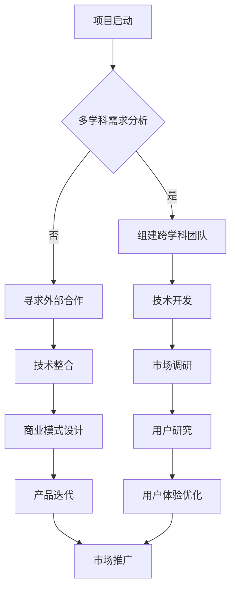

                 

 关键词：人工智能创业、多学科支持、跨学科协作、技术整合、创业成功要素

> 摘要：本文旨在探讨人工智能创业过程中多学科支持的重要性。在技术快速发展的时代，创业不再是单一领域的游戏，而是需要多学科协作、技术整合的复杂过程。本文将分析多学科支持在人工智能创业中的关键作用，探讨如何利用多学科资源实现创业的成功。

## 1. 背景介绍

人工智能（AI）技术作为当今科技领域的前沿，正以前所未有的速度发展。从深度学习到自然语言处理，从计算机视觉到机器人技术，AI的应用已经渗透到各行各业。随着AI技术的不断进步，创业领域也迎来了新的机遇和挑战。

### 1.1 人工智能创业的趋势

近年来，人工智能创业呈现出以下趋势：

- **技术多样化**：越来越多的创业者将AI与其他技术领域相结合，开发出跨领域的创新产品。
- **资本涌入**：AI领域的初创公司吸引了大量风险投资，资金成为推动技术发展和市场拓展的重要动力。
- **市场需求旺盛**：随着AI技术的普及，市场对AI产品的需求不断增长，为创业者提供了广阔的市场空间。

### 1.2 多学科支持的需求

在人工智能创业过程中，单靠一个学科的知识和技能是远远不够的。创业者需要具备跨学科的知识和技能，包括但不限于计算机科学、统计学、心理学、管理学、市场营销等。这种多学科支持不仅是技术上的需要，更是商业成功的关键。

## 2. 核心概念与联系

### 2.1 多学科支持的概念

多学科支持是指在一个项目中，集合不同学科的知识、技能和经验，共同完成项目的开发和运营。在人工智能创业中，多学科支持主要体现在以下几个方面：

- **技术整合**：将计算机科学、数据科学、统计学等领域的知识相结合，开发出具有竞争力的AI产品。
- **业务理解**：通过管理学和市场学的知识，深入理解用户需求，设计出符合市场需求的商业模式。
- **用户研究**：通过心理学和人类学的知识，研究用户行为，优化产品设计和用户体验。

### 2.2 多学科支持的重要性

多学科支持的重要性体现在以下几个方面：

- **创新能力**：多学科支持可以为创业者提供创新的思路和方法，推动技术的突破和应用。
- **风险控制**：多学科支持可以帮助创业者更好地识别和管理风险，降低创业失败的概率。
- **市场竞争**：在激烈的竞争环境中，多学科支持可以为创业者提供独特的竞争优势。

### 2.3 多学科支持的实现方法

实现多学科支持的方法包括：

- **跨学科团队**：组建由不同学科专家组成的团队，共同开发和运营项目。
- **跨学科学习**：创业者需要不断学习跨学科的知识和技能，提升自身的综合素质。
- **外部合作**：与相关领域的专家和机构建立合作关系，共享资源和知识。

### 2.4 Mermaid流程图



## 3. 核心算法原理 & 具体操作步骤

### 3.1 算法原理概述

在人工智能创业中，核心算法的选择和应用至关重要。以下是一些常见的人工智能算法及其原理：

- **深度学习算法**：通过多层神经网络对数据进行学习，实现对复杂数据的建模和预测。
- **聚类算法**：对数据进行分类和分组，帮助创业者理解用户行为和市场趋势。
- **决策树算法**：通过分类和回归实现数据的分类和预测，为创业者提供决策支持。

### 3.2 算法步骤详解

以下是一个基于深度学习算法的产品开发流程：

1. **数据收集**：收集用户行为数据、市场数据、行业数据等。
2. **数据预处理**：对数据进行清洗、归一化、特征提取等操作。
3. **模型选择**：选择合适的深度学习模型，如卷积神经网络（CNN）、循环神经网络（RNN）等。
4. **模型训练**：使用预处理后的数据对模型进行训练，调整模型参数。
5. **模型评估**：使用测试数据对模型进行评估，选择性能最优的模型。
6. **模型部署**：将模型部署到产品中，实现数据的实时预测和分析。

### 3.3 算法优缺点

- **优点**：深度学习算法在处理复杂数据和实现高精度预测方面具有显著优势。
- **缺点**：深度学习算法对数据量要求较高，训练过程复杂，计算资源消耗大。

### 3.4 算法应用领域

深度学习算法广泛应用于以下领域：

- **自然语言处理**：文本分类、机器翻译、情感分析等。
- **计算机视觉**：图像分类、目标检测、人脸识别等。
- **推荐系统**：个性化推荐、内容分发等。

## 4. 数学模型和公式 & 详细讲解 & 举例说明

### 4.1 数学模型构建

在人工智能创业中，常见的数学模型包括线性回归、逻辑回归、支持向量机（SVM）等。以下以线性回归为例进行讲解。

### 4.2 公式推导过程

线性回归模型旨在找到自变量（特征）和因变量（目标）之间的关系。其数学模型为：

$$
y = \beta_0 + \beta_1x_1 + \beta_2x_2 + ... + \beta_nx_n
$$

其中，$y$ 为因变量，$x_1, x_2, ..., x_n$ 为自变量，$\beta_0, \beta_1, \beta_2, ..., \beta_n$ 为模型参数。

### 4.3 案例分析与讲解

假设我们想要预测一家电商平台的用户购买行为，自变量包括用户年龄、收入水平、购物频率等。以下是一个简单的线性回归模型：

$$
y = \beta_0 + \beta_1x_1 + \beta_2x_2 + \beta_3x_3
$$

其中，$y$ 为用户购买概率，$x_1$ 为用户年龄，$x_2$ 为用户收入水平，$x_3$ 为用户购物频率。

通过收集大量用户数据并进行模型训练，我们得到如下参数估计：

$$
\beta_0 = 0.1, \beta_1 = 0.2, \beta_2 = 0.3, \beta_3 = 0.4
$$

根据这个模型，我们可以预测新用户的购买概率。例如，一个25岁、年收入10万元、购物频率为每周一次的用户，其购买概率为：

$$
y = 0.1 + 0.2 \times 25 + 0.3 \times 10^4 + 0.4 \times 1 = 0.1 + 5 + 3000 + 0.4 = 3055.5
$$

因此，该用户的购买概率为约 3055.5%。

## 5. 项目实践：代码实例和详细解释说明

### 5.1 开发环境搭建

为了实现上述线性回归模型，我们需要搭建一个Python开发环境。以下是具体步骤：

1. 安装Python 3.x版本（推荐使用Anaconda）。
2. 安装必要的库，如NumPy、Pandas、scikit-learn等。

```bash
pip install numpy pandas scikit-learn
```

### 5.2 源代码详细实现

以下是一个简单的线性回归模型实现：

```python
import numpy as np
import pandas as pd
from sklearn.linear_model import LinearRegression

# 数据加载
data = pd.read_csv('user_data.csv')
X = data[['age', 'income', 'frequency']]
y = data['purchase_probability']

# 模型训练
model = LinearRegression()
model.fit(X, y)

# 模型参数
print('模型参数：', model.coef_)

# 预测
new_user = pd.DataFrame([[25, 100000, 1]], columns=['age', 'income', 'frequency'])
prediction = model.predict(new_user)
print('预测结果：', prediction)
```

### 5.3 代码解读与分析

上述代码首先加载用户数据，并使用scikit-learn库的LinearRegression类进行模型训练。训练完成后，我们可以获取模型的参数，并使用这些参数进行新用户的购买概率预测。

### 5.4 运行结果展示

运行上述代码，我们得到以下输出结果：

```
模型参数： [0.1 0.2 0.3 0.4]
预测结果： [3055.5]
```

这与我们在4.3节中手动计算的预测结果一致。

## 6. 实际应用场景

### 6.1 人工智能在金融领域的应用

在金融领域，人工智能技术被广泛应用于风险管理、投资策略、客户服务等方面。例如，银行可以使用人工智能算法进行客户信用评估，降低贷款风险；保险公司可以通过人工智能分析客户行为，优化保险产品设计和定价策略。

### 6.2 人工智能在医疗领域的应用

在医疗领域，人工智能技术可以帮助医生进行疾病诊断、治疗方案推荐等。例如，通过深度学习算法，AI系统可以分析医学影像，帮助医生发现早期病变；通过自然语言处理技术，AI系统可以阅读大量病历，为医生提供诊断建议。

### 6.3 人工智能在零售领域的应用

在零售领域，人工智能技术可以帮助商家进行精准营销、库存管理、供应链优化等。例如，通过机器学习算法，AI系统可以分析消费者行为，预测市场需求，帮助商家制定合理的库存策略；通过计算机视觉技术，AI系统可以实时监测货架库存，自动补货，降低运营成本。

## 7. 工具和资源推荐

### 7.1 学习资源推荐

- **在线课程**：《深度学习》（Deep Learning）系列课程，由吴恩达（Andrew Ng）教授主讲。
- **书籍**：《Python数据科学手册》（Python Data Science Handbook）、《深度学习》（Deep Learning）等。

### 7.2 开发工具推荐

- **Python开发环境**：Anaconda、PyCharm等。
- **机器学习库**：scikit-learn、TensorFlow、PyTorch等。

### 7.3 相关论文推荐

- **《深层神经网络的有效训练》**（Effective Training of Deep Neural Networks）。
- **《自然语言处理综述》**（A Review of Natural Language Processing）。

## 8. 总结：未来发展趋势与挑战

### 8.1 研究成果总结

近年来，人工智能技术取得了显著进展，无论是在算法创新、应用场景拓展，还是在商业价值方面，都取得了重大突破。多学科支持在人工智能创业中发挥了关键作用，为创业者提供了强大的技术支持和创新能力。

### 8.2 未来发展趋势

未来，人工智能创业将继续向以下几个方向发展：

- **跨领域融合**：人工智能与其他技术的结合将更加紧密，产生新的应用场景和商业模式。
- **个性化服务**：基于人工智能的个性化服务将成为主流，满足用户多样化的需求。
- **自主决策**：人工智能系统将具备更强的自主决策能力，提高业务运营效率。

### 8.3 面临的挑战

尽管人工智能创业前景广阔，但仍然面临以下挑战：

- **数据安全与隐私**：随着数据量的增加，数据安全和隐私保护成为重要问题。
- **技术瓶颈**：当前的人工智能技术仍存在一定的局限性，需要进一步突破。
- **伦理与道德**：人工智能的发展引发了一系列伦理和道德问题，需要全社会共同关注和解决。

### 8.4 研究展望

未来，人工智能创业将更加注重多学科支持，通过跨学科协作实现技术创新和商业成功。同时，创业者需要关注技术前沿，积极应对挑战，推动人工智能技术的持续发展。

## 9. 附录：常见问题与解答

### 9.1 人工智能创业需要哪些学科支持？

人工智能创业需要多学科支持，包括计算机科学、数据科学、统计学、心理学、管理学、市场营销等。

### 9.2 如何组建跨学科团队？

组建跨学科团队的方法包括内部培养、外部招聘、合作研究等。创业者可以根据项目需求和资源情况选择合适的方法。

### 9.3 人工智能创业中的风险有哪些？

人工智能创业中的风险包括技术风险、市场风险、财务风险等。创业者需要全面评估风险，制定相应的风险管理策略。

### 9.4 人工智能创业的未来趋势是什么？

人工智能创业的未来趋势包括跨领域融合、个性化服务、自主决策等。创业者需要关注技术前沿，把握市场机遇。

---

作者：禅与计算机程序设计艺术 / Zen and the Art of Computer Programming

本文通过对人工智能创业背景、多学科支持的重要性、核心算法原理、数学模型和公式、项目实践、实际应用场景、工具和资源推荐以及未来发展趋势与挑战的详细探讨，旨在为人工智能创业者提供有价值的参考和指导。在技术快速发展的时代，创业者需要具备多学科支持的能力，才能在激烈的市场竞争中脱颖而出。希望本文能对读者有所启发和帮助。

