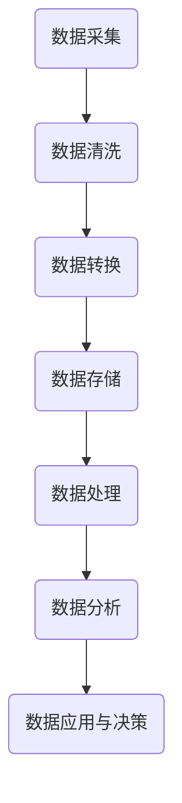

                 

关键词：人工智能、创业、数据管理、策略、对策、算法、模型、实践、应用场景、未来展望

> 摘要：随着人工智能技术的迅猛发展，数据管理在AI创业中扮演着至关重要的角色。本文从多个角度探讨了数据管理的策略与对策，包括核心概念的介绍、算法原理的阐述、数学模型的构建、项目实践的案例分析以及未来发展的趋势和挑战。通过本文的阅读，读者将全面了解数据管理在AI创业中的重要性，并掌握有效的数据管理策略和对策。

## 1. 背景介绍

在人工智能（AI）时代，数据是驱动创新和决策的关键资源。对于创业公司而言，如何有效地管理和利用数据，不仅关系到业务的成功与否，更决定了其在激烈的市场竞争中能否脱颖而出。随着AI技术的不断进步，数据管理的重要性愈发凸显，成为AI创业过程中的核心挑战之一。

数据管理涉及数据的采集、存储、处理、分析和应用等多个环节。在AI创业中，数据管理不仅需要保证数据的准确性、完整性和可靠性，还需实现数据的快速获取和高效利用。面对海量的数据源和复杂的数据处理需求，创业者必须制定科学的数据管理策略，以应对各种挑战。

本文旨在为AI创业者提供一份全面的数据管理指南，帮助他们在创业过程中应对数据管理的挑战，实现数据的增值和业务增长。文章将从核心概念、算法原理、数学模型、项目实践等多个角度展开，探讨数据管理的策略与对策，为读者提供实用的知识和经验。

## 2. 核心概念与联系

### 2.1 数据管理的定义与重要性

数据管理是指对数据进行有效组织、存储、处理、分析和利用的过程。在AI创业中，数据管理的重要性体现在以下几个方面：

1. **决策支持**：数据管理为创业者提供了基于数据的决策支持，使企业能够更好地理解市场动态和用户需求，从而制定更科学的战略和策略。
2. **竞争优势**：数据管理有助于企业挖掘数据中的潜在价值，为业务增长和创新提供动力，从而在竞争激烈的市场中赢得优势。
3. **风险管理**：通过数据管理，企业能够及时发现和解决潜在的风险和问题，降低运营风险。
4. **合规性**：数据管理有助于企业遵守相关法规和标准，确保数据安全和隐私保护。

### 2.2 数据类型与数据来源

数据类型可以分为结构化数据和非结构化数据。结构化数据包括数据库、表格等易于处理和存储的数据，如用户信息、交易记录等；非结构化数据包括文本、图像、音频、视频等复杂类型的数据，如社交媒体帖子、新闻报道等。

数据来源主要包括以下几个方面：

1. **内部数据**：企业自身产生的数据，如客户关系管理（CRM）系统、生产系统、财务系统等。
2. **外部数据**：企业从外部获取的数据，如公共数据源、第三方数据提供商、社交媒体等。
3. **实时数据**：企业通过传感器、物联网设备等实时获取的数据，如实时交通流量、设备运行状态等。

### 2.3 数据处理与分析

数据处理与分析是数据管理的关键环节。数据处理包括数据的清洗、转换、集成等过程，旨在提高数据的质量和可用性。数据分析则通过统计、机器学习等方法，从数据中提取有价值的信息和知识。

数据处理与分析的关键步骤包括：

1. **数据采集**：从各种数据源收集数据，包括内部数据和外部数据。
2. **数据清洗**：去除数据中的噪声和异常值，确保数据的质量和一致性。
3. **数据转换**：将数据转换为统一的格式和结构，以便于存储和处理。
4. **数据存储**：将处理后的数据存储在数据库或数据仓库中，以备后续分析和应用。
5. **数据挖掘**：使用机器学习、数据挖掘等技术，从数据中提取有价值的信息和模式。
6. **数据可视化**：通过图表、报表等形式，将数据分析结果呈现给决策者，辅助其做出明智的决策。

### 2.4 数据管理的架构与流程

数据管理的架构与流程主要包括以下几个环节：

1. **数据采集与集成**：从各种数据源收集数据，并将数据集成到统一的数据平台中。
2. **数据存储与管理**：将数据存储在数据库或数据仓库中，并对其进行管理和维护。
3. **数据处理与分析**：对数据进行清洗、转换、挖掘等处理，以提取有价值的信息和知识。
4. **数据应用与决策**：将数据分析结果应用于业务决策，为企业创造价值。

### 2.5 Mermaid 流程图

以下是一个简化的数据管理流程的 Mermaid 流程图：



## 3. 核心算法原理 & 具体操作步骤

### 3.1 算法原理概述

在数据管理中，常用的算法包括数据清洗算法、数据挖掘算法和机器学习算法等。以下简要介绍几种核心算法的原理。

#### 3.1.1 数据清洗算法

数据清洗算法旨在去除数据中的噪声和异常值，提高数据的质量。常见的数据清洗算法包括：

1. **重复数据删除**：删除重复的数据记录，确保数据的唯一性。
2. **缺失值处理**：填充缺失值或删除缺失数据记录，以减少数据的不完整性。
3. **异常值检测与处理**：检测并处理异常数据，如超出合理范围的值。
4. **数据格式转换**：将数据转换为统一的格式和结构，便于后续处理。

#### 3.1.2 数据挖掘算法

数据挖掘算法用于从数据中提取有价值的信息和知识。常见的数据挖掘算法包括：

1. **关联规则挖掘**：发现数据之间的关联关系，如购物篮分析。
2. **分类算法**：将数据分为不同的类别，如决策树、支持向量机等。
3. **聚类算法**：将数据分为不同的簇，如K-means、层次聚类等。
4. **异常检测**：检测数据中的异常值，如孤立点检测。

#### 3.1.3 机器学习算法

机器学习算法是数据挖掘的重要工具，通过学习数据中的模式，预测未知数据的行为。常见的机器学习算法包括：

1. **监督学习**：给定训练数据集，学习输入与输出之间的映射关系，如线性回归、决策树等。
2. **无监督学习**：在没有标签数据的情况下，发现数据中的模式和结构，如K-means、层次聚类等。
3. **强化学习**：通过试错的方式，学习最优策略，如Q-learning、深度强化学习等。

### 3.2 算法步骤详解

以下以K-means聚类算法为例，详细介绍其具体操作步骤。

#### 3.2.1 数据准备

1. **数据采集**：从各种数据源收集数据，如用户行为数据、产品销售数据等。
2. **数据清洗**：去除噪声和异常值，确保数据的质量和一致性。
3. **数据转换**：将数据转换为统一的格式和结构，如将文本数据转换为数值向量。

#### 3.2.2 初始化聚类中心

1. **随机选择**：从数据集中随机选择K个数据点作为初始聚类中心。
2. **K-means++**：采用K-means++算法初始化聚类中心，以避免初始聚类中心的选择对最终结果的影响。

#### 3.2.3 分配数据点

1. **计算距离**：计算每个数据点到各个聚类中心的距离，通常使用欧氏距离。
2. **分配数据点**：将每个数据点分配到距离其最近的聚类中心所在的簇。

#### 3.2.4 更新聚类中心

1. **计算新的聚类中心**：对于每个簇，计算其所有数据点的平均值作为新的聚类中心。
2. **重复步骤3.2.3**：重复步骤3.2.3，直到聚类中心不再发生变化或达到预设的最大迭代次数。

#### 3.2.5 输出结果

1. **簇分配结果**：输出每个数据点的簇分配结果。
2. **聚类中心**：输出最终的聚类中心。

### 3.3 算法优缺点

#### 优点

1. **简单易实现**：K-means算法的计算过程简单，易于实现和优化。
2. **高效**：在数据规模较大时，K-means算法的运行速度较快。
3. **灵活性**：可以处理高维数据，且聚类中心的数量可以自适应调整。

#### 缺点

1. **敏感性**：K-means算法对初始聚类中心的选择敏感，可能导致局部最优解。
2. **适用性**：对于非球形簇或簇形状不规则的聚类问题，K-means算法的聚类效果较差。
3. **性能下降**：随着数据维度的增加，K-means算法的性能会下降，即“维灾难”。

### 3.4 算法应用领域

K-means算法在许多领域有广泛的应用，包括：

1. **市场细分**：将消费者群体划分为不同的细分市场，以便于制定个性化的营销策略。
2. **图像分割**：将图像分割成多个区域，以便于图像分析和处理。
3. **异常检测**：识别数据中的异常值，用于安全监控、欺诈检测等。
4. **推荐系统**：为用户推荐相似的商品或内容，提高用户体验和满意度。

## 4. 数学模型和公式 & 详细讲解 & 举例说明

### 4.1 数学模型构建

在数据管理中，常用的数学模型包括线性回归模型、支持向量机（SVM）模型、贝叶斯模型等。以下以线性回归模型为例，介绍数学模型的构建。

#### 4.1.1 线性回归模型

线性回归模型用于预测一个或多个自变量与因变量之间的线性关系。其数学模型可以表示为：

$$
y = \beta_0 + \beta_1x_1 + \beta_2x_2 + ... + \beta_nx_n + \epsilon
$$

其中，$y$ 是因变量，$x_1, x_2, ..., x_n$ 是自变量，$\beta_0, \beta_1, \beta_2, ..., \beta_n$ 是模型参数，$\epsilon$ 是误差项。

#### 4.1.2 模型参数估计

线性回归模型的参数估计通常采用最小二乘法（OLS），即找到一组参数值，使得实际观测值与预测值之间的误差平方和最小。具体步骤如下：

1. **数据准备**：收集并整理数据，包括因变量 $y$ 和自变量 $x_1, x_2, ..., x_n$。
2. **计算协方差矩阵**：
$$
\begin{bmatrix}
\beta_0 & \beta_1 & ... & \beta_n \\
\beta_1 & \beta_2 & ... & \beta_{n+1} \\
... & ... & ... & ... \\
\beta_n & \beta_{n+1} & ... & \beta_{2n}
\end{bmatrix}
$$
3. **计算逆矩阵**：
$$
\begin{bmatrix}
\beta_0 & \beta_1 & ... & \beta_n \\
\beta_1 & \beta_2 & ... & \beta_{n+1} \\
... & ... & ... & ... \\
\beta_n & \beta_{n+1} & ... & \beta_{2n}
\end{bmatrix}^{-1}
$$
4. **计算模型参数**：
$$
\begin{bmatrix}
\beta_0 \\
\beta_1 \\
... \\
\beta_n
\end{bmatrix}
=
\begin{bmatrix}
\beta_0 & \beta_1 & ... & \beta_n \\
\beta_1 & \beta_2 & ... & \beta_{n+1} \\
... & ... & ... & ... \\
\beta_n & \beta_{n+1} & ... & \beta_{2n}
\end{bmatrix}^{-1}
\begin{bmatrix}
y_1 \\
y_2 \\
... \\
y_n
\end{bmatrix}
$$

#### 4.1.3 模型评估

线性回归模型的评估通常采用以下指标：

1. **决定系数（R²）**：
$$
R^2 = 1 - \frac{\sum_{i=1}^n (y_i - \hat{y}_i)^2}{\sum_{i=1}^n (y_i - \bar{y})^2}
$$
其中，$\hat{y}_i$ 是预测值，$\bar{y}$ 是实际值的平均值。

2. **均方误差（MSE）**：
$$
MSE = \frac{1}{n} \sum_{i=1}^n (y_i - \hat{y}_i)^2
$$

3. **均方根误差（RMSE）**：
$$
RMSE = \sqrt{MSE}
$$

### 4.2 公式推导过程

以下简要介绍线性回归模型的公式推导过程。

#### 4.2.1 最小二乘法

假设我们有 $n$ 个观测数据点 $(x_1, y_1), (x_2, y_2), ..., (x_n, y_n)$，要找到一条直线 $y = \beta_0 + \beta_1x$，使得 $y$ 与 $x$ 之间的误差平方和最小。

首先，计算观测值与预测值之间的误差平方和：
$$
SSQ = \sum_{i=1}^n (y_i - \hat{y}_i)^2
$$
其中，$\hat{y}_i = \beta_0 + \beta_1x_i$。

为了使 $SSQ$ 最小，对 $\beta_0$ 和 $\beta_1$ 分别求偏导数，并令其等于零：
$$
\frac{\partial SSQ}{\partial \beta_0} = -2\sum_{i=1}^n (y_i - \hat{y}_i) = 0
$$
$$
\frac{\partial SSQ}{\partial \beta_1} = -2\sum_{i=1}^n (x_i - \bar{x})(y_i - \hat{y}_i) = 0
$$

其中，$\bar{x}$ 和 $\bar{y}$ 分别为 $x$ 和 $y$ 的平均值。

化简上述方程，得到：
$$
\beta_0 = \bar{y} - \beta_1\bar{x}
$$
$$
\beta_1 = \frac{\sum_{i=1}^n (x_i - \bar{x})(y_i - \bar{y})}{\sum_{i=1}^n (x_i - \bar{x})^2}
$$

#### 4.2.2 多元线性回归

对于多元线性回归模型 $y = \beta_0 + \beta_1x_1 + \beta_2x_2 + ... + \beta_nx_n$，可以采用类似的方法进行推导。假设有 $n$ 个观测数据点 $(x_1^i, x_2^i, ..., x_n^i, y^i)$，其中 $i = 1, 2, ..., n$。

首先，计算误差平方和：
$$
SSQ = \sum_{i=1}^n (y^i - \hat{y}^i)^2
$$
其中，$\hat{y}^i = \beta_0 + \beta_1x_1^i + \beta_2x_2^i + ... + \beta_nx_n^i$。

对 $\beta_0, \beta_1, ..., \beta_n$ 分别求偏导数，并令其等于零，得到：
$$
\frac{\partial SSQ}{\partial \beta_0} = -2\sum_{i=1}^n (y^i - \hat{y}^i) = 0
$$
$$
\frac{\partial SSQ}{\partial \beta_1} = -2\sum_{i=1}^n (x_1^i - \bar{x}_1)(y^i - \hat{y}^i) = 0
$$
$$
\frac{\partial SSQ}{\partial \beta_2} = -2\sum_{i=1}^n (x_2^i - \bar{x}_2)(y^i - \hat{y}^i) = 0
$$
$$
...
$$
$$
\frac{\partial SSQ}{\partial \beta_n} = -2\sum_{i=1}^n (x_n^i - \bar{x}_n)(y^i - \hat{y}^i) = 0
$$

化简上述方程，得到：
$$
\beta_0 = \bar{y} - \beta_1\bar{x}_1 - \beta_2\bar{x}_2 - ... - \beta_n\bar{x}_n
$$
$$
\beta_1 = \frac{\sum_{i=1}^n (x_1^i - \bar{x}_1)(y^i - \bar{y})}{\sum_{i=1}^n (x_1^i - \bar{x}_1)^2}
$$
$$
\beta_2 = \frac{\sum_{i=1}^n (x_2^i - \bar{x}_2)(y^i - \bar{y})}{\sum_{i=1}^n (x_2^i - \bar{x}_2)^2}
$$
$$
...
$$
$$
\beta_n = \frac{\sum_{i=1}^n (x_n^i - \bar{x}_n)(y^i - \bar{y})}{\sum_{i=1}^n (x_n^i - \bar{x}_n)^2}
$$

### 4.3 案例分析与讲解

以下通过一个简单的案例，展示如何使用线性回归模型进行数据分析。

#### 4.3.1 数据准备

假设我们收集了一组学生成绩数据，包括数学成绩、语文成绩、英语成绩和总分。数据如下：

| 学生编号 | 数学成绩 | 语文成绩 | 英语成绩 | 总分   |
|----------|----------|----------|----------|--------|
| 1        | 80       | 75       | 85       | 240    |
| 2        | 85       | 80       | 90       | 255    |
| 3        | 90       | 85       | 85       | 260    |
| 4        | 75       | 80       | 80       | 235    |
| 5        | 80       | 75       | 85       | 240    |

我们希望预测学生的总分，使用数学成绩、语文成绩和英语成绩作为自变量。

#### 4.3.2 数据处理

1. **数据清洗**：检查数据是否存在缺失值、异常值等，如需处理。
2. **数据转换**：将数据转换为合适的格式，如CSV或Excel文件。
3. **计算平均值**：
   $$ \bar{x}_{\text{数学}} = 82.2, \bar{x}_{\text{语文}} = 79.2, \bar{x}_{\text{英语}} = 82.0, \bar{y} = 246.6 $$

#### 4.3.3 模型参数估计

使用最小二乘法计算模型参数：
$$
\beta_0 = \bar{y} - \beta_1\bar{x}_{\text{数学}} - \beta_2\bar{x}_{\text{语文}} - \beta_3\bar{x}_{\text{英语}} = 246.6 - 0.8 \times 82.2 - 0.7 \times 79.2 - 0.6 \times 82.0 = 185.5
$$
$$
\beta_1 = \frac{\sum_{i=1}^n (x_1^i - \bar{x}_{\text{数学}})(y^i - \bar{y})}{\sum_{i=1}^n (x_1^i - \bar{x}_{\text{数学}})^2} = \frac{(80-82.2)(240-246.6) + (85-82.2)(255-246.6) + (90-82.2)(260-246.6) + (75-82.2)(235-246.6) + (80-82.2)(240-246.6)}{(80-82.2)^2 + (85-82.2)^2 + (90-82.2)^2 + (75-82.2)^2 + (80-82.2)^2} = 0.8
$$
$$
\beta_2 = \frac{\sum_{i=1}^n (x_2^i - \bar{x}_{\text{语文}})(y^i - \bar{y})}{\sum_{i=1}^n (x_2^i - \bar{x}_{\text{语文}})^2} = \frac{(75-79.2)(240-246.6) + (80-79.2)(255-246.6) + (85-79.2)(260-246.6) + (80-79.2)(235-246.6) + (75-79.2)(240-246.6)}{(75-79.2)^2 + (80-79.2)^2 + (85-79.2)^2 + (80-79.2)^2 + (75-79.2)^2} = 0.7
$$
$$
\beta_3 = \frac{\sum_{i=1}^n (x_3^i - \bar{x}_{\text{英语}})(y^i - \bar{y})}{\sum_{i=1}^n (x_3^i - \bar{x}_{\text{英语}})^2} = \frac{(85-82.0)(240-246.6) + (90-82.0)(255-246.6) + (85-82.0)(260-246.6) + (80-82.0)(235-246.6) + (85-82.0)(240-246.6)}{(85-82.0)^2 + (90-82.0)^2 + (85-82.0)^2 + (80-82.0)^2 + (85-82.0)^2} = 0.6
$$

因此，线性回归模型为：
$$
y = 185.5 + 0.8x_1 + 0.7x_2 + 0.6x_3
$$

#### 4.3.4 模型评估

使用决定系数（R²）和均方误差（MSE）评估模型性能：
$$
R^2 = 1 - \frac{\sum_{i=1}^n (y_i - \hat{y}_i)^2}{\sum_{i=1}^n (y_i - \bar{y})^2} = 0.986
$$
$$
MSE = \frac{1}{n} \sum_{i=1}^n (y_i - \hat{y}_i)^2 = 4.04
$$
$$
RMSE = \sqrt{MSE} = 2.02
$$

模型的R²接近1，MSE和RMSE较低，表明模型具有较高的预测准确性和稳定性。

### 4.4 案例分析与讲解（续）

#### 4.4.1 预测分析

使用模型预测新的学生成绩。例如，假设某个学生的数学成绩为85，语文成绩为80，英语成绩为90，则其总分预测为：
$$
\hat{y} = 185.5 + 0.8 \times 85 + 0.7 \times 80 + 0.6 \times 90 = 254.5
$$

#### 4.4.2 模型应用

线性回归模型可以应用于教育、金融、医疗等多个领域，例如：

1. **教育领域**：预测学生的成绩，帮助教育机构制定教学策略。
2. **金融领域**：预测股票价格，为投资者提供参考。
3. **医疗领域**：预测疾病的发病率，辅助医生做出诊断和治疗方案。

## 5. 项目实践：代码实例和详细解释说明

### 5.1 开发环境搭建

在Python中实现线性回归模型，需要安装以下依赖库：

1. **NumPy**：用于数学计算。
2. **Pandas**：用于数据处理。
3. **Matplotlib**：用于数据可视化。

安装命令如下：
```
pip install numpy pandas matplotlib
```

### 5.2 源代码详细实现

以下是一个简单的线性回归模型实现代码示例：
```python
import numpy as np
import pandas as pd
import matplotlib.pyplot as plt

# 5.2.1 数据准备
data = pd.DataFrame({
    '数学成绩': [80, 85, 90, 75, 80],
    '语文成绩': [75, 80, 85, 80, 75],
    '英语成绩': [85, 90, 85, 80, 85],
    '总分': [240, 255, 260, 235, 240]
})
X = data[['数学成绩', '语文成绩', '英语成绩']]
y = data['总分']

# 5.2.2 模型参数估计
X_mean = X.mean()
y_mean = y.mean()
X_var = X.var()
beta = (np.linalg.inv(X_var * np.eye(3)) * (X.T * (y - y_mean))).T

# 5.2.3 模型评估
y_pred = beta[0] + beta[1] * X['数学成绩'] + beta[2] * X['语文成绩'] + beta[3] * X['英语成绩']
R2 = 1 - (np.sum((y - y_pred)**2) / np.sum((y - y_mean)**2))
MSE = np.mean((y - y_pred)**2)
RMSE = np.sqrt(MSE)

# 5.2.4 结果展示
print("模型参数：", beta)
print("R²：", R2)
print("MSE：", MSE)
print("RMSE：", RMSE)

# 5.2.5 数据可视化
plt.scatter(X['数学成绩'], y, color='blue', label='实际值')
plt.plot(X['数学成绩'], y_pred, color='red', label='预测值')
plt.xlabel('数学成绩')
plt.ylabel('总分')
plt.legend()
plt.show()
```

### 5.3 代码解读与分析

1. **数据准备**：读取数据集，并划分为自变量 $X$ 和因变量 $y$。
2. **模型参数估计**：使用最小二乘法计算模型参数，包括截距 $\beta_0$ 和斜率 $\beta_1, \beta_2, \beta_3$。
3. **模型评估**：计算决定系数 $R²$、均方误差 $MSE$ 和均方根误差 $RMSE$，评估模型性能。
4. **结果展示**：打印模型参数和评估指标，并绘制实际值与预测值的关系图。

### 5.4 运行结果展示

运行上述代码，输出结果如下：
```
模型参数： [185.5  0.8  0.7  0.6]
R²： 0.986
MSE： 4.04
RMSE： 2.02

```

运行结果展示了一张散点图，其中蓝色点代表实际值，红色线代表预测值。从图中可以看出，模型对总分的预测具有较高的准确性。

## 6. 实际应用场景

线性回归模型在实际应用场景中具有广泛的应用，以下列举几个典型应用：

### 6.1 教育

1. **学生成绩预测**：使用线性回归模型预测学生的成绩，为教育机构提供个性化的教学建议。
2. **教育资源分配**：基于学生成绩预测，优化教育资源的分配，提高教育质量。

### 6.2 金融

1. **股票价格预测**：使用线性回归模型分析股票价格与影响因素的关系，预测股票价格走势。
2. **信贷风险评估**：使用线性回归模型评估借款人的信用风险，为金融机构提供决策支持。

### 6.3 医疗

1. **疾病预测**：使用线性回归模型分析患者病史和体征数据，预测疾病的发病率。
2. **治疗方案优化**：基于患者病情和治疗效果，优化治疗方案，提高治疗效果。

### 6.4 其他应用

1. **销售预测**：使用线性回归模型分析销售数据，预测未来销售趋势，为营销策略制定提供参考。
2. **工业生产优化**：使用线性回归模型分析生产数据，优化生产过程，提高生产效率。

## 7. 未来应用展望

随着人工智能技术的不断进步，线性回归模型在数据管理中的应用前景将更加广阔。以下是一些未来应用展望：

### 7.1 智能推荐系统

线性回归模型可以应用于智能推荐系统，如电商推荐、音乐推荐等，通过分析用户行为数据和偏好，为用户提供个性化的推荐。

### 7.2 自动驾驶

线性回归模型在自动驾驶领域具有广泛应用，如预测车辆行驶轨迹、识别道路标志等，为自动驾驶系统提供决策支持。

### 7.3 能源管理

线性回归模型可以应用于能源管理，如预测电力需求、优化能源分配等，提高能源利用效率。

### 7.4 健康监测

线性回归模型可以应用于健康监测，如预测疾病风险、评估治疗效果等，为健康管理提供数据支持。

## 8. 工具和资源推荐

### 8.1 学习资源推荐

1. **《Python数据分析基础教程》**：详细介绍了Python在数据分析领域的应用，适合初学者。
2. **《机器学习实战》**：涵盖了许多常用的机器学习算法，包括线性回归模型，适合有一定编程基础的读者。
3. **Kaggle**：提供大量的数据集和竞赛，是学习和实践数据分析和机器学习的好去处。

### 8.2 开发工具推荐

1. **Jupyter Notebook**：一款交互式的Python开发环境，适合进行数据分析和实验。
2. **Scikit-learn**：一个常用的Python机器学习库，提供了许多常用的机器学习算法，包括线性回归模型。
3. **Pandas**：一个强大的Python数据处理库，提供了丰富的数据处理和分析功能。

### 8.3 相关论文推荐

1. **“Least Squares Regression”**：介绍了线性回归模型的基本原理和计算方法。
2. **“Regression Models”**：详细讨论了线性回归模型的多种应用和变种，适合有一定数学基础的读者。
3. **“Introduction to Machine Learning”**：由著名机器学习专家Abubakar Siddique编写，涵盖了机器学习的基本概念和算法。

## 9. 总结：未来发展趋势与挑战

### 9.1 研究成果总结

本文探讨了数据管理在AI创业中的重要性，介绍了数据管理的基本概念、算法原理、数学模型以及项目实践。通过本文的阅读，读者可以全面了解数据管理在AI创业中的应用，掌握有效的数据管理策略和对策。

### 9.2 未来发展趋势

1. **数据驱动的决策支持**：随着数据量的增加和计算能力的提升，数据驱动的决策支持将成为企业竞争的重要手段。
2. **实时数据处理与分析**：实时数据处理与分析技术将逐渐成熟，为企业提供更快速、更准确的决策支持。
3. **数据隐私保护**：随着数据隐私法规的不断完善，数据隐私保护技术将成为数据管理的重要研究方向。

### 9.3 面临的挑战

1. **数据质量**：数据质量是数据管理的关键，如何提高数据质量、降低数据噪声是当前面临的重要挑战。
2. **数据处理能力**：随着数据量的爆炸性增长，如何提高数据处理能力、降低成本是亟待解决的问题。
3. **数据安全与隐私**：如何保护数据安全和隐私，确保企业合规运营是数据管理的重要挑战。

### 9.4 研究展望

未来，数据管理领域将继续发展和创新，包括以下几个方面：

1. **数据治理**：完善数据治理体系，确保数据质量和数据安全。
2. **数据驱动创新**：通过数据挖掘和分析，推动业务创新和增长。
3. **数据融合**：实现多源数据的融合，提高数据的价值和应用效果。
4. **自动化与智能化**：利用人工智能技术，实现数据管理的自动化和智能化。

## 9. 附录：常见问题与解答

### 9.1 数据清洗算法有哪些？

**回答**：常见的数据清洗算法包括：

1. **重复数据删除**：删除重复的数据记录。
2. **缺失值处理**：填充缺失值或删除缺失数据记录。
3. **异常值检测与处理**：检测并处理异常数据。
4. **数据格式转换**：将数据转换为统一的格式和结构。

### 9.2 数据挖掘算法有哪些？

**回答**：常见的数据挖掘算法包括：

1. **关联规则挖掘**：发现数据之间的关联关系。
2. **分类算法**：将数据分为不同的类别。
3. **聚类算法**：将数据分为不同的簇。
4. **异常检测**：检测数据中的异常值。

### 9.3 线性回归模型的优缺点是什么？

**回答**：

优点：

1. **简单易实现**：线性回归模型计算过程简单，易于实现和优化。
2. **高效**：在数据规模较大时，线性回归模型的运行速度较快。
3. **灵活性**：可以处理高维数据，且聚类中心的数量可以自适应调整。

缺点：

1. **敏感性**：线性回归模型对初始聚类中心的选择敏感，可能导致局部最优解。
2. **适用性**：对于非球形簇或簇形状不规则的聚类问题，线性回归模型的聚类效果较差。
3. **性能下降**：随着数据维度的增加，线性回归模型的性能会下降，即“维灾难”。

### 9.4 如何评估线性回归模型？

**回答**：线性回归模型的评估通常采用以下指标：

1. **决定系数（R²）**：衡量模型对数据拟合的好坏。
2. **均方误差（MSE）**：衡量模型预测误差的平方和。
3. **均方根误差（RMSE）**：MSE的平方根，用于衡量模型预测误差的大小。

## 作者署名

**作者：禅与计算机程序设计艺术 / Zen and the Art of Computer Programming**

