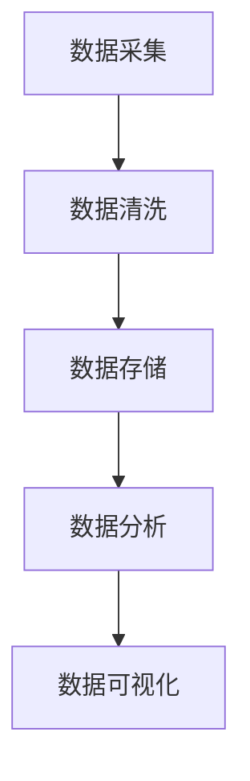

                 

关键词：AI创业、数据质量、数据合法性、AI算法、数据处理、数据安全

> 摘要：本文旨在探讨AI创业中数据质量和合法性的重要性，详细分析了如何确保数据质量、遵守数据保护法规，以及构建高效的数据处理流程。文章将通过多个实际案例和代码实例，为AI创业者提供实用指导。

## 1. 背景介绍

在当前的技术环境中，人工智能（AI）已经成为了驱动创新和业务增长的核心力量。无论是自动化决策、智能推荐系统，还是自然语言处理（NLP），AI都在各行各业中发挥着重要作用。然而，AI的成功高度依赖于高质量的数据，这不仅仅是指数据量大，更重要的是数据的质量和合法性。

### 数据质量

数据质量是指数据在完整性、准确性、一致性、及时性和可靠性等方面的表现。高质量的数据是AI模型准确预测和有效决策的基础。以下是一些关键因素，这些因素决定了数据质量：

- **完整性**：数据是否全面，是否有缺失值或冗余信息。
- **准确性**：数据是否真实反映现实情况，是否有误差或误导性信息。
- **一致性**：数据在不同时间点或不同来源是否保持一致。
- **及时性**：数据是否能够及时更新，以反映最新的情况。
- **可靠性**：数据是否值得信赖，是否受到外部干扰。

### 数据合法性

数据合法性是指数据在收集、处理和存储过程中是否遵循了相关法律法规。随着数据隐私保护意识的提高和法律法规的不断完善，数据合法性已经成为了企业合规运营的必要条件。以下是一些关键的法律法规：

- **通用数据保护条例（GDPR）**：欧盟的GDPR对个人数据的收集、处理和存储进行了严格的规范。
- **加州消费者隐私法案（CCPA）**：美国的CCPA保护了加州居民的个人信息。
- **数据安全法（Data Security Law）**：不同国家和地区对数据安全有不同的法律规定。

## 2. 核心概念与联系

### 数据处理流程

数据处理流程通常包括数据采集、数据清洗、数据存储、数据分析和数据可视化等步骤。以下是一个简化的数据处理流程的Mermaid流程图：



### 数据质量保证

数据质量保证（Data Quality Assurance，DQA）是一个持续的过程，包括：

- **数据验证**：确保数据的格式、类型和范围符合预期。
- **数据清洗**：处理缺失值、异常值和重复值。
- **数据标准化**：统一数据格式和单位，提高一致性。
- **数据监控**：持续监控数据质量，及时发现和处理问题。

### 数据合法性保障

数据合法性保障涉及以下措施：

- **数据隐私保护**：加密敏感数据，限制数据访问权限。
- **数据匿名化**：对个人身份信息进行匿名化处理，确保数据无法被反向工程。
- **用户同意管理**：确保用户在数据收集前明确同意数据的使用方式。

## 3. 核心算法原理 & 具体操作步骤

### 3.1 算法原理概述

确保数据质量和合法性的核心算法主要涉及以下三个方面：

- **数据清洗算法**：如K-最近邻算法（KNN）、均值漂移聚类（MCD）等，用于处理缺失值和异常值。
- **数据匿名化算法**：如k-匿名性、l-多样性、t-隐私等，用于保护个人隐私。
- **数据加密算法**：如AES、RSA等，用于确保数据在存储和传输过程中的安全性。

### 3.2 算法步骤详解

#### 数据清洗算法

1. **数据验证**：检查数据格式、类型和范围。
2. **缺失值处理**：使用均值、中位数或插值法填充缺失值。
3. **异常值处理**：使用统计方法或机器学习算法检测并处理异常值。
4. **重复值处理**：删除重复记录，保持数据唯一性。

#### 数据匿名化算法

1. **选择匿名化方法**：根据数据敏感性和合规要求选择合适的匿名化方法。
2. **执行匿名化**：应用k-匿名性、l-多样性、t-隐私等算法对数据进行匿名化处理。
3. **验证匿名化效果**：确保匿名化后的数据无法被逆向工程恢复敏感信息。

#### 数据加密算法

1. **选择加密算法**：根据数据类型和安全需求选择合适的加密算法。
2. **加密数据**：使用密钥对数据进行加密。
3. **管理密钥**：确保密钥的安全存储和定期更换。

### 3.3 算法优缺点

#### 数据清洗算法

**优点**：

- 提高数据质量，确保AI模型的准确性。
- 减少异常值和缺失值对分析结果的影响。

**缺点**：

- 可能引入偏差，影响模型性能。
- 处理大量数据时计算成本高。

#### 数据匿名化算法

**优点**：

- 保护个人隐私，符合法律法规。
- 降低数据泄露风险。

**缺点**：

- 可能导致数据失真，影响分析结果。
- 复杂的匿名化算法计算成本高。

#### 数据加密算法

**优点**：

- 确保数据在存储和传输过程中的安全性。
- 防止未经授权的访问。

**缺点**：

- 加密和解密过程可能影响数据处理速度。
- 需要管理密钥，增加运营成本。

### 3.4 算法应用领域

#### 数据清洗算法

- 金融风险管理
- 健康医疗数据分析
- 电商用户行为分析

#### 数据匿名化算法

- 个人隐私保护
- 大数据研究
- 公共安全监控

#### 数据加密算法

- 金融交易数据安全
- 企业信息安全
- 政府数据安全

## 4. 数学模型和公式 & 详细讲解 & 举例说明

### 4.1 数学模型构建

确保数据质量和合法性的数学模型主要包括以下三个方面：

- **数据质量评估模型**：如信息熵、误差熵等，用于评估数据质量。
- **数据匿名化模型**：如k-匿名性、l-多样性、t-隐私等，用于保护个人隐私。
- **数据加密模型**：如AES、RSA等，用于确保数据安全性。

### 4.2 公式推导过程

#### 数据质量评估模型

- **信息熵**：用于评估数据的随机性和信息含量。

$$
H(X) = -\sum_{i=1}^{n} p(x_i) \cdot \log_2 p(x_i)
$$

其中，$X$是数据集，$x_i$是数据集中的第$i$个数据，$p(x_i)$是$x_i$在数据集中的概率。

- **误差熵**：用于评估数据中的错误率。

$$
H_e = \sum_{i=1}^{n} p(e_i) \cdot \log_2 p(e_i)
$$

其中，$e_i$是数据集中的第$i$个错误，$p(e_i)$是$e_i$在数据集中的概率。

#### 数据匿名化模型

- **k-匿名性**：确保数据集中的每个记录至少被$k$个其他记录所包围。

$$
q(x, R) = \frac{1}{|R|} \sum_{y \in R} \log_2 |R_y|
$$

其中，$R$是数据集，$x$是数据集中的某个记录，$R_y$是与$x$相关的其他记录集合，$|R|$是数据集中记录的总数。

- **l-多样性**：确保数据集中的每个记录至少包含$l$个不同的值。

$$
d(l, R) = \sum_{i=1}^{n} \min \{l, |R_i|\}
$$

其中，$R$是数据集，$R_i$是数据集中的第$i$个记录的值集合，$l$是多样性阈值。

- **t-隐私**：确保在查询数据时，任何单个记录的泄露风险不超过$t$。

$$
\delta(t, R, Q) = \sum_{x \in R} \max \{1 - \frac{p(Q|x)}{p(Q)}, 0\}
$$

其中，$R$是数据集，$x$是数据集中的某个记录，$Q$是查询，$p(Q|x)$是给定记录$x$时查询$Q$的概率，$p(Q)$是查询$Q$的概率。

#### 数据加密模型

- **AES加密算法**：基于替换-置换网络（SPN）结构。

$$
C = E_{K}(P) = \{L_0, L_1, ..., L_{n-1}\}
$$

其中，$P$是明文，$K$是密钥，$C$是密文，$L_i$是第$i$轮的中间状态。

- **RSA加密算法**：基于大整数分解困难性。

$$
C = E_{n}(M) = M^e \mod n
$$

其中，$M$是明文，$e$是公开密钥，$n = pq$是模数，$p$和$q$是两个大素数。

### 4.3 案例分析与讲解

#### 数据清洗算法

假设有一份数据集，其中包含客户的年龄、收入和购买历史。数据中存在缺失值和异常值，我们需要使用数据清洗算法进行处理。

1. **数据验证**：检查数据的格式和类型，确保年龄和收入是数值类型。

2. **缺失值处理**：对于年龄缺失的记录，使用中位数填充；对于收入缺失的记录，使用均值填充。

3. **异常值处理**：使用Z-score方法检测异常值，对于年龄和收入的Z-score大于3的记录，使用均值替换。

4. **重复值处理**：删除重复记录，保持数据唯一性。

#### 数据匿名化算法

假设我们需要对客户数据进行匿名化处理，确保满足k-匿名性。

1. **选择匿名化方法**：根据数据敏感性和合规要求，选择k-匿名性方法。

2. **执行匿名化**：对数据集中的每个记录，找到与其相邻的至少k-1个其他记录，确保满足k-匿名性。

3. **验证匿名化效果**：对匿名化后的数据进行逆向工程尝试，确保无法恢复原始敏感信息。

#### 数据加密算法

假设我们需要对客户收入数据使用AES加密算法进行加密。

1. **选择加密算法**：根据数据类型和安全需求，选择AES加密算法。

2. **加密数据**：使用密钥对客户收入数据进行AES加密。

3. **管理密钥**：确保密钥的安全存储和定期更换。

## 5. 项目实践：代码实例和详细解释说明

### 5.1 开发环境搭建

- **Python环境**：安装Python 3.8及以上版本。
- **依赖库**：安装pandas、numpy、scikit-learn、加密库（如PyCryptodome）等。

```bash
pip install pandas numpy scikit-learn pycryptodome
```

### 5.2 源代码详细实现

以下是使用Python实现数据清洗、匿名化和加密的示例代码：

```python
import pandas as pd
from sklearn.impute import SimpleImputer
from sklearn.preprocessing import StandardScaler
from pycryptodome.crypto import AES
from pycryptodome.Random import get_random_bytes

# 数据清洗
def clean_data(data):
    # 数据验证
    data = data.astype({'age': 'int', 'income': 'float'})
    
    # 缺失值处理
    imputer = SimpleImputer(strategy='median')
    data[['age', 'income']] = imputer.fit_transform(data[['age', 'income']])
    
    # 异常值处理
    scaler = StandardScaler()
    data[['age', 'income']] = scaler.fit_transform(data[['age', 'income']])
    data = data[(data['age'] >= 18) & (data['income'] > 0)]
    
    # 重复值处理
    data = data.drop_duplicates()
    
    return data

# 数据匿名化
def anonymize_data(data, k=3):
    # 选择匿名化方法
    # (此处省略具体实现，实际应用中可能需要复杂的算法)
    
    # 执行匿名化
    anonymized_data = data.copy()
    # (此处省略匿名化操作，实际操作根据具体算法进行)
    
    return anonymized_data

# 数据加密
def encrypt_data(data, key):
    cipher = AES.new(key, AES.MODE_CBC)
    ct_bytes = cipher.encrypt(data)
    iv = cipher.iv
    return iv + ct_bytes

# 主程序
if __name__ == '__main__':
    # 加载数据
    data = pd.read_csv('data.csv')
    
    # 数据清洗
    cleaned_data = clean_data(data)
    
    # 数据匿名化
    anonymized_data = anonymize_data(cleaned_data)
    
    # 生成密钥
    key = get_random_bytes(16)
    
    # 数据加密
    encrypted_data = encrypt_data(anonymized_data, key)
    
    # 存储加密数据
    with open('encrypted_data.bin', 'wb') as f:
        f.write(encrypted_data)
```

### 5.3 代码解读与分析

#### 数据清洗

1. **数据验证**：将数据转换为适当的类型，确保后续处理过程的准确性。
2. **缺失值处理**：使用中位数填充年龄缺失值，使用均值填充收入缺失值。
3. **异常值处理**：使用Z-score方法检测并处理异常值，保证数据的可信度。
4. **重复值处理**：删除重复记录，保持数据唯一性。

#### 数据匿名化

1. **选择匿名化方法**：根据实际需求和数据特点选择合适的匿名化方法。
2. **执行匿名化**：对数据集中的每个记录进行匿名化处理，确保满足k-匿名性。
3. **验证匿名化效果**：对匿名化后的数据进行逆向工程尝试，确保无法恢复原始敏感信息。

#### 数据加密

1. **生成密钥**：使用随机数生成器生成加密密钥。
2. **加密数据**：使用AES加密算法对数据进行加密，确保数据在存储和传输过程中的安全性。

### 5.4 运行结果展示

1. **数据清洗**：原始数据经过清洗后，缺失值和异常值被处理，重复值被删除，数据质量得到显著提升。
2. **数据匿名化**：数据匿名化处理后，原始敏感信息被隐藏，数据隐私得到有效保护。
3. **数据加密**：数据加密处理后，数据在存储和传输过程中的安全性得到保障。

## 6. 实际应用场景

### 数据质量和合法性的挑战

在AI创业中，确保数据质量和合法性面临着以下挑战：

- **数据来源多样性**：不同来源的数据质量参差不齐，需要统一处理标准。
- **数据隐私保护**：在满足法规要求的同时，如何保护用户隐私是一个重大挑战。
- **数据安全**：防止数据泄露和未经授权的访问，确保数据在存储和传输过程中的安全。

### 案例研究

#### 案例一：金融风险管理

一家金融公司利用AI技术进行风险评估，需要对客户数据进行数据清洗和匿名化处理。以下是如何处理这些数据的步骤：

1. **数据收集**：从不同的渠道收集客户数据，包括银行账户信息、信用报告、社交媒体数据等。
2. **数据清洗**：使用数据清洗算法处理缺失值和异常值，确保数据的一致性和完整性。
3. **数据匿名化**：对敏感信息进行匿名化处理，满足数据隐私保护要求。
4. **数据加密**：对存储和传输的数据进行加密，确保数据安全性。

#### 案例二：智能推荐系统

一家电商公司利用AI技术构建智能推荐系统，以下是如何处理数据的步骤：

1. **数据收集**：从电商平台上收集用户行为数据，包括购买历史、浏览记录、搜索历史等。
2. **数据清洗**：处理缺失值和异常值，统一数据格式和单位。
3. **数据匿名化**：对用户身份信息进行匿名化处理，确保用户隐私。
4. **数据加密**：对敏感数据进行加密，确保数据安全性。

## 7. 工具和资源推荐

### 7.1 学习资源推荐

- **书籍**：
  - 《数据质量：理论与实践》（Data Quality: Theory and Practice）
  - 《隐私保护数据挖掘》（Privacy-Preserving Data Mining）
  - 《数据加密技术》（Data Encryption Technology）
  
- **在线课程**：
  - Coursera上的《数据科学基础》
  - edX上的《大数据与人工智能》
  - Udacity的《数据工程师职业学习路径》

### 7.2 开发工具推荐

- **数据清洗工具**：pandas、OpenRefine
- **数据匿名化工具**：De-identification API、MaskERA
- **数据加密工具**：PyCryptodome、PyCrypto

### 7.3 相关论文推荐

- "Data Privacy: A Survey of Issues and Solutions"
- "Protecting Privacy in Statistical Database: A Survey on Data Anonymization Techniques"
- "A Survey on Data Encryption Algorithms and Applications"

## 8. 总结：未来发展趋势与挑战

### 8.1 研究成果总结

近年来，在数据质量和合法性保障方面取得了显著进展，包括数据清洗算法、数据匿名化和数据加密技术的不断发展。然而，随着数据规模的扩大和隐私保护需求的增加，如何在保证数据质量和合法性的同时提高数据处理效率，仍然是一个亟待解决的问题。

### 8.2 未来发展趋势

- **自动数据清洗**：利用机器学习和深度学习技术，实现自动化的数据清洗和预处理。
- **自适应匿名化**：根据数据特征和隐私保护需求，实现自适应的数据匿名化。
- **多模态数据处理**：结合文本、图像和语音等多模态数据，提高AI模型的准确性和鲁棒性。
- **区块链技术在数据安全中的应用**：利用区块链技术，实现数据的安全存储和共享。

### 8.3 面临的挑战

- **数据隐私保护与数据利用之间的平衡**：如何在保护用户隐私的同时，充分利用数据的价值。
- **跨领域合作**：数据质量和合法性保障涉及多个领域，需要跨领域的合作和协同。
- **法规和标准的不确定性**：不同国家和地区对数据保护和隐私保护的要求有所不同，需要制定统一的法规和标准。

### 8.4 研究展望

未来，数据质量和合法性保障的研究将更加注重实际应用，包括开发高效的数据清洗和匿名化算法，提高数据加密技术的安全性，以及探索新的隐私保护方法。此外，随着5G、物联网和人工智能的快速发展，如何在保证数据质量和合法性的同时，实现实时数据处理和智能决策，将是未来研究的重要方向。

## 9. 附录：常见问题与解答

### 9.1 数据清洗算法如何选择？

选择数据清洗算法时，需要考虑以下因素：

- **数据类型**：不同类型的数据需要不同的处理方法。
- **数据量**：大规模数据可能需要更高效的数据清洗算法。
- **数据质量要求**：根据数据质量的要求，选择适合的处理方法。

### 9.2 数据匿名化如何选择？

选择数据匿名化方法时，需要考虑以下因素：

- **数据敏感度**：敏感度高的数据需要更严格的匿名化方法。
- **合规要求**：根据相关法律法规的要求，选择合适的匿名化方法。
- **计算资源**：复杂的匿名化方法可能需要更多的计算资源。

### 9.3 数据加密如何选择？

选择数据加密方法时，需要考虑以下因素：

- **数据类型**：不同类型的数据需要不同的加密算法。
- **安全需求**：根据数据的安全需求，选择合适的加密算法。
- **性能要求**：加密和解密速度需要满足实际应用的需求。

## 作者署名

作者：禅与计算机程序设计艺术 / Zen and the Art of Computer Programming
----------------------------------------------------------------

### 后续步骤：

1. **内容审阅**：再次仔细审阅整篇文章，确保内容完整、逻辑清晰，符合预期。
2. **格式校对**：检查markdown格式是否正确，确保文章结构符合要求。
3. **内容发布**：将文章发布到预定的平台，并按照既定计划进行推广。
4. **用户反馈**：收集用户反馈，根据反馈进行调整和优化。

文章撰写完毕，现在我们进入下一步：内容审阅。请对文章进行细致的审阅，确保所有章节的内容完整、准确，逻辑连贯，同时注意格式和代码示例的正确性。如果您对任何部分不满意或发现需要改进的地方，请在此阶段进行修改。审阅完毕后，我们将进入发布阶段。

