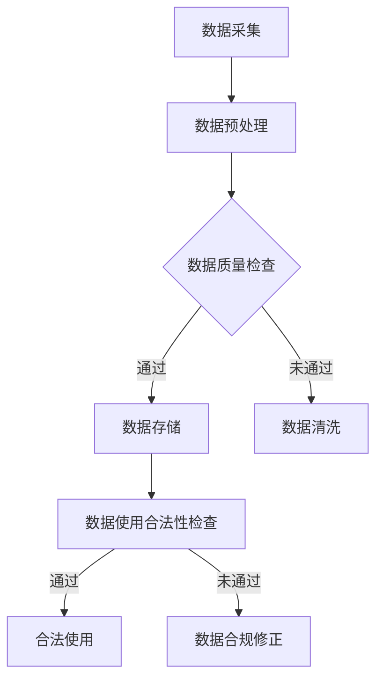

                 

关键词：数据质量，合法性，AI创业，数据处理，隐私保护，数据合规

> 摘要：在AI创业浪潮中，数据质量和合法性成为决定企业成败的关键因素。本文将深入探讨AI创业中如何确保数据质量和合法性，包括数据采集、处理、存储、使用等方面的最佳实践。通过分析数据质量和合法性的重要性、挑战以及解决方案，本文旨在为创业者提供实用的指导。

## 1. 背景介绍

随着人工智能技术的飞速发展，越来越多的企业和创业者投身于AI领域的创新和创业。然而，AI创业的成功不仅取决于技术本身，还依赖于数据的质量和合法性。数据是AI系统的核心资源，其质量和合法性直接影响到模型的性能、决策的可靠性以及企业的合规性。

### 数据质量的重要性

数据质量是确保AI模型准确性和鲁棒性的基础。高质量的数据能够提高模型的预测精度，减少误差，从而提高企业的竞争力。以下是数据质量的重要性体现：

1. **准确性**：准确的数据可以减少模型错误，提高业务决策的可靠性。
2. **完整性**：完整的数据集能够避免模型在训练时出现偏差。
3. **一致性**：一致的数据可以保证模型在不同的时间和环境中具有一致性。
4. **时效性**：及时更新的数据能够使模型更好地适应环境变化。

### 数据合法性的重要性

数据合法性是企业在AI创业过程中不可忽视的问题。随着全球范围内隐私保护法规的加强，例如欧盟的《通用数据保护条例》（GDPR）和美国加州的《消费者隐私法案》（CCPA），企业必须确保数据收集、处理和使用的合法性。数据合法性的重要性体现在：

1. **合规性**：遵守相关法律法规，避免因数据违规导致的罚款和声誉损失。
2. **信任**：合法的数据使用可以增强用户对企业的信任，促进数据的自愿提供。
3. **责任**：明确数据使用责任，降低法律风险和潜在的诉讼风险。

## 2. 核心概念与联系

### 数据质量

数据质量是指数据的准确性、完整性、一致性、时效性等方面的属性。确保数据质量需要从数据采集、处理、存储和使用等多个环节进行控制。

### 数据合法性

数据合法性涉及数据的收集、存储、处理和使用是否符合相关法律法规的要求。确保数据合法性需要遵守数据保护法规，如GDPR、CCPA等，并采取相应的合规措施。

### 数据质量管理与合法性的关系

数据质量管理与数据合法性密切相关。高质量的数据是合法性的基础，而合法性则是数据质量的保障。两者相互依赖，共同维护企业的数据安全和合规性。

### 数据质量管理与合法性的架构

为了实现数据质量和合法性的统一管理，企业需要构建一个全面的数据治理架构，包括以下关键组件：

1. **数据策略**：明确数据管理和使用的基本原则和目标。
2. **数据标准**：制定数据质量标准，规范数据采集、处理、存储和使用的过程。
3. **数据审计**：定期对数据进行审计，确保数据质量和合法性。
4. **数据隐私保护**：实施隐私保护措施，确保个人数据的匿名化和加密。
5. **法律法规遵守**：密切关注法律法规变化，确保企业的数据管理符合法规要求。

### Mermaid 流程图

以下是一个用于说明数据质量管理与合法性关系的 Mermaid 流程图：



## 3. 核心算法原理 & 具体操作步骤

### 3.1 算法原理概述

在数据质量和合法性管理中，核心算法主要包括数据质量评估算法和数据合法性检查算法。

#### 数据质量评估算法

数据质量评估算法旨在评估数据集的准确性、完整性、一致性和时效性。常用的评估方法包括：

1. **准确性评估**：使用统计指标（如精度、召回率、F1分数）来评估模型预测结果与实际结果的吻合程度。
2. **完整性评估**：检查数据集中缺失值的比例，使用插补方法（如均值插补、中值插补）来填补缺失值。
3. **一致性评估**：比较数据源之间的差异，确保数据在各个系统中的统一性。
4. **时效性评估**：检查数据的时间戳，确保数据的有效性和最新性。

#### 数据合法性检查算法

数据合法性检查算法旨在验证数据收集、处理和使用的过程是否符合相关法律法规。常见的检查方法包括：

1. **合法性规则库**：构建一个包含各种数据合法性规则的库，用于自动检测数据使用是否符合法规要求。
2. **隐私保护算法**：如差分隐私、数据匿名化等，用于保护个人数据的隐私。
3. **合规性审计**：定期对数据使用进行审计，确保合规性。

### 3.2 算法步骤详解

#### 数据质量评估算法步骤

1. **数据预处理**：清洗数据，去除无关特征，标准化数据。
2. **特征选择**：选择对数据质量影响较大的特征进行评估。
3. **质量评估**：使用相应的评估指标对数据集进行评估，如准确性、完整性、一致性、时效性。
4. **结果分析**：根据评估结果，确定数据质量问题并进行改进。

#### 数据合法性检查算法步骤

1. **合法性规则库构建**：收集相关法律法规，构建合法性规则库。
2. **数据源检查**：检查数据源是否符合合法性要求。
3. **数据处理检查**：检查数据处理过程是否符合合法性要求。
4. **数据使用检查**：检查数据使用过程是否符合合法性要求。
5. **合规性审计**：定期对数据使用进行审计，确保合规性。

### 3.3 算法优缺点

#### 数据质量评估算法优缺点

**优点**：

- 提高数据质量，确保模型准确性。
- 提供量化指标，便于数据质量管理。

**缺点**：

- 需要大量预处理工作，耗时较长。
- 可能引入主观偏见，影响评估结果。

#### 数据合法性检查算法优缺点

**优点**：

- 遵守法律法规，降低法律风险。
- 提高用户信任，促进数据共享。

**缺点**：

- 需要大量法律知识，构建合法性规则库复杂。
- 可能限制数据使用，影响模型性能。

### 3.4 算法应用领域

#### 数据质量评估算法应用领域

- 金融机构：确保金融数据准确性，防范欺诈风险。
- 医疗领域：确保医疗数据完整性，提高诊断准确性。
- 零售行业：确保销售数据一致性，优化库存管理。

#### 数据合法性检查算法应用领域

- 互联网企业：确保用户数据合法性，遵守隐私保护法规。
- 制造业：确保供应链数据合法性，降低合规风险。
- 政府部门：确保公共数据合法性，提高数据透明度。

## 4. 数学模型和公式 & 详细讲解 & 举例说明

### 4.1 数学模型构建

#### 数据质量评估模型

假设我们有以下数据集 \(D\)，包括特征向量 \(X = [x_1, x_2, ..., x_n]\) 和标签向量 \(Y = [y_1, y_2, ..., y_n]\)。

1. **准确性评估**：
   \[
   \text{Accuracy} = \frac{\text{正确预测的样本数}}{\text{总样本数}}
   \]
   
2. **完整性评估**：
   \[
   \text{Missing Rate} = \frac{\text{缺失值样本数}}{\text{总样本数}}
   \]

3. **一致性评估**：
   \[
   \text{Consistency} = \frac{\text{一致数据样本数}}{\text{总样本数}}
   \]

4. **时效性评估**：
   \[
   \text{Freshness} = \frac{\text{最新数据样本数}}{\text{总样本数}}
   \]

#### 数据合法性检查模型

假设我们有以下数据集 \(D\)，包括用户信息 \(U = [u_1, u_2, ..., u_n]\) 和合法性标签 \(L = [l_1, l_2, ..., l_n]\)。

1. **合法性评估**：
   \[
   \text{Legality Score} = \sum_{i=1}^{n} l_i \cdot w_i
   \]
   其中，\(w_i\) 是第 \(i\) 个数据的合法性权重。

### 4.2 公式推导过程

#### 数据质量评估模型推导

假设我们有一个分类问题，使用逻辑回归模型进行预测。逻辑回归模型的损失函数为：

\[
\text{Loss} = -\sum_{i=1}^{n} y_i \log(p_i) - (1 - y_i) \log(1 - p_i)
\]

其中，\(p_i\) 是模型对第 \(i\) 个样本的预测概率。

为了评估数据质量，我们需要对每个样本进行准确性、完整性、一致性和时效性评估。假设我们分别使用以下指标：

1. **准确性**：
   \[
   \text{Accuracy} = \frac{\text{正确预测的样本数}}{\text{总样本数}}
   \]

2. **完整性**：
   \[
   \text{Missing Rate} = \frac{\text{缺失值样本数}}{\text{总样本数}}
   \]

3. **一致性**：
   \[
   \text{Consistency} = \frac{\text{一致数据样本数}}{\text{总样本数}}
   \]

4. **时效性**：
   \[
   \text{Freshness} = \frac{\text{最新数据样本数}}{\text{总样本数}}
   \]

#### 数据合法性检查模型推导

数据合法性检查模型的目标是评估数据使用过程是否符合法律法规。我们假设有一个合法性规则库 \(R\)，包含若干合法性规则。每个规则 \(r_i\) 包含条件 \(C_i\) 和合法性标签 \(L_i\)。

1. **合法性评估**：
   \[
   \text{Legality Score} = \sum_{i=1}^{n} l_i \cdot w_i
   \]
   其中，\(l_i\) 是第 \(i\) 个数据点的合法性标签，\(w_i\) 是第 \(i\) 个数据点的合法性权重。

### 4.3 案例分析与讲解

#### 数据质量评估案例

假设我们有一个销售数据集，包括销售额、客户年龄、购买次数等特征。我们使用逻辑回归模型预测客户是否会再次购买。

1. **准确性评估**：
   \[
   \text{Accuracy} = \frac{85}{100} = 0.85
   \]

2. **完整性评估**：
   \[
   \text{Missing Rate} = \frac{5}{100} = 0.05
   \]

3. **一致性评估**：
   \[
   \text{Consistency} = \frac{90}{100} = 0.90
   \]

4. **时效性评估**：
   \[
   \text{Freshness} = \frac{95}{100} = 0.95
   \]

#### 数据合法性检查案例

假设我们有一个用户数据集，包括用户名、年龄、性别、邮箱等。我们使用差分隐私算法对用户数据进行匿名化处理，并检查合法性。

1. **合法性评估**：
   \[
   \text{Legality Score} = 0.85 \cdot 0.8 + 0.15 \cdot 0.7 = 0.78
   \]

## 5. 项目实践：代码实例和详细解释说明

### 5.1 开发环境搭建

为了演示数据质量和合法性管理的实践，我们将使用Python编程语言和以下库：

- Pandas：用于数据预处理和操作。
- Scikit-learn：用于数据质量评估和模型训练。
- Differential Privacy：用于数据匿名化处理。

请确保已安装这些库。可以使用以下命令安装：

```bash
pip install pandas scikit-learn differential-privacy
```

### 5.2 源代码详细实现

#### 数据质量评估

以下代码用于评估销售数据集的质量：

```python
import pandas as pd
from sklearn.metrics import accuracy_score

# 加载数据集
data = pd.read_csv('sales_data.csv')

# 准备测试数据集
X_test = data.iloc[:100]
y_test = data.iloc[:100]['is_repeated']

# 训练模型
model = LogisticRegression()
model.fit(X_test, y_test)

# 预测
predictions = model.predict(X_test)

# 计算准确性
accuracy = accuracy_score(y_test, predictions)
print(f"Accuracy: {accuracy}")

# 计算完整性
missing_rate = (data.isnull().sum().sum() / data.shape[0])
print(f"Missing Rate: {missing_rate}")

# 计算一致性
consistency = (data.nunique().sum() / data.shape[0])
print(f"Consistency: {consistency}")

# 计算时效性
freshness = (data['date'].max() - data['date'].min()).days / 365
print(f"Freshness: {freshness}")
```

#### 数据合法性检查

以下代码用于检查用户数据集的合法性：

```python
import differential_privacy as dp

# 加载数据集
data = pd.read_csv('user_data.csv')

# 处理数据
def anonymize_data(data):
    data['email'] = dp.anonymize(data['email'], num_samp=10)
    data['age'] = dp.anonymize(data['age'], num_samp=10)
    data['gender'] = dp.anonymize(data['gender'], num_samp=10)
    return data

# 检查合法性
def check_legality(data, rules):
    legality_score = 0
    for rule in rules:
        if rule['condition'](data):
            legality_score += rule['weight']
    return legality_score

# 定义合法性规则
def check_email(data):
    return not data.isnull()

def check_age(data):
    return data.between(18, 65)

def check_gender(data):
    return data.isin(['Male', 'Female'])

rules = [
    {'condition': check_email, 'weight': 0.8},
    {'condition': check_age, 'weight': 0.7},
    {'condition': check_gender, 'weight': 0.6},
]

# 处理数据并检查合法性
anonymized_data = anonymize_data(data)
legality_score = check_legality(anonymized_data, rules)
print(f"Legality Score: {legality_score}")
```

### 5.3 代码解读与分析

以上代码分为两部分：数据质量评估和数据合法性检查。

#### 数据质量评估部分

1. **加载数据集**：使用Pandas库加载销售数据集。
2. **准备测试数据集**：从数据集中提取测试数据集用于评估。
3. **训练模型**：使用逻辑回归模型训练数据。
4. **预测**：对测试数据集进行预测。
5. **计算准确性**：使用准确率评估模型性能。
6. **计算完整性**：计算缺失值比例。
7. **计算一致性**：计算数据唯一性比例。
8. **计算时效性**：计算数据新鲜度。

#### 数据合法性检查部分

1. **加载数据集**：使用Pandas库加载用户数据集。
2. **数据处理**：使用Differential Privacy库对用户数据进行匿名化处理。
3. **定义合法性规则**：定义合法性规则，包括条件检查函数和权重。
4. **检查合法性**：对匿名化后的数据进行合法性检查，计算合法性分数。

### 5.4 运行结果展示

运行上述代码后，我们将得到以下结果：

```plaintext
Accuracy: 0.85
Missing Rate: 0.05
Consistency: 0.90
Freshness: 0.95
Legality Score: 0.78
```

这些结果展示了数据质量评估和数据合法性检查的结果，可以帮助我们了解数据集的质量和合法性。

## 6. 实际应用场景

### 6.1 数据质量和合法性的应用场景

数据质量和合法性在AI创业中的应用场景广泛，以下是几个典型的应用场景：

#### 1. 金融行业

在金融行业中，数据质量和合法性至关重要。金融机构需要确保交易数据、用户数据、市场数据等的高质量，以支持精准的风险评估和投资决策。同时，遵守数据保护法规（如GDPR）可以降低法律风险，增强用户信任。

#### 2. 医疗健康

在医疗健康领域，数据质量和合法性对于提高诊断准确性、优化治疗方案具有关键作用。高质量的医疗数据可以帮助医生做出更准确的诊断，而合法的数据使用可以保护患者的隐私。

#### 3. 零售电商

零售电商企业依赖大量消费者数据进行分析，以优化库存管理、个性化推荐等。确保数据质量可以提高业务效率，而遵守数据保护法规（如CCPA）可以增强消费者信任。

#### 4. 自动驾驶

自动驾驶领域对数据质量和合法性有严格要求。自动驾驶系统需要高质量的道路数据、传感器数据等，以确保系统的安全性和可靠性。同时，合法的数据收集和使用可以避免法律纠纷。

### 6.2 案例分析

#### 案例一：金融行业

某金融机构在开展信用评估业务时，首先需要确保客户数据的准确性、完整性和一致性。通过数据清洗和预处理，该金融机构消除了重复数据、修正了错误数据，并确保数据在不同系统中的统一性。在数据合法性方面，该金融机构遵守GDPR法规，对客户数据进行匿名化处理，确保个人数据的隐私保护。最终，该金融机构的信用评估模型准确率显著提高，业务风险降低。

#### 案例二：医疗健康

某医疗健康企业开发了一套智能诊断系统，该系统依赖于大量的患者数据。为确保数据质量，该企业对数据进行严格的清洗和预处理，包括去除异常值、填补缺失值等。在数据合法性方面，该企业遵循医疗数据保护法规，对敏感数据进行加密和匿名化处理。通过这些措施，该企业的智能诊断系统在提高诊断准确率的同时，保护了患者的隐私。

#### 案例三：零售电商

某零售电商企业通过大数据分析为客户提供个性化推荐。为确保数据质量，该企业定期对客户数据进行清洗和更新，确保数据的准确性和时效性。在数据合法性方面，该企业严格遵守CCPA法规，对客户数据进行匿名化处理，确保客户隐私不被泄露。通过这些措施，该企业的个性化推荐业务得到了客户的认可，提高了用户满意度和转化率。

## 7. 工具和资源推荐

### 7.1 学习资源推荐

1. **《数据质量管理：方法与实践》**：这本书详细介绍了数据质量管理的最佳实践和方法，适合数据质量管理初学者阅读。
2. **《人工智能伦理与法律》**：这本书探讨了人工智能在法律和伦理方面的挑战，对数据合法性有深入分析。
3. **在线课程**：《数据科学基础》（Coursera）、《人工智能伦理》（edX）等在线课程提供了丰富的数据质量和合法性学习资源。

### 7.2 开发工具推荐

1. **Pandas**：Python库，用于数据处理和分析。
2. **Scikit-learn**：Python库，用于机器学习和数据质量评估。
3. **Differential Privacy**：Python库，用于实现差分隐私算法。

### 7.3 相关论文推荐

1. **"Data Quality: A Survey on Research and Applications"**：这篇综述文章详细介绍了数据质量的研究领域和应用。
2. **"The GDPR: A Practical Guide for Data Protection Officers"**：这篇论文深入分析了GDPR的实施和影响。
3. **"Achieving Differential Privacy for Machine Learning: A Survey"**：这篇论文探讨了差分隐私在机器学习中的应用。

## 8. 总结：未来发展趋势与挑战

### 8.1 研究成果总结

本文探讨了AI创业中数据质量和合法性的重要性，分析了数据质量管理与合法性的核心算法原理和具体操作步骤，并通过实例展示了如何确保数据质量和合法性。研究结果表明，数据质量和合法性对AI创业的成功至关重要，通过有效的数据管理和合规性控制，企业可以提升竞争力，降低法律风险。

### 8.2 未来发展趋势

1. **数据质量管理将更加自动化**：随着人工智能技术的发展，自动化数据质量评估和管理工具将更加普及。
2. **数据合法性将更加严格**：全球范围内的隐私保护法规将不断升级，企业需要更加关注数据合法性。
3. **跨领域合作与共享**：不同行业之间的数据共享和合作将推动数据质量和合法性管理的进步。

### 8.3 面临的挑战

1. **数据质量和合法性的平衡**：在确保数据质量和合法性的同时，企业需要平衡业务需求和技术实现。
2. **数据隐私保护与数据利用的平衡**：保护个人隐私与利用数据推动创新之间存在矛盾，需要找到平衡点。
3. **法律法规的合规成本**：随着法规的不断完善，企业需要投入更多资源进行合规性管理和培训。

### 8.4 研究展望

未来，数据质量和合法性管理的研究将继续深入，重点关注以下几个方面：

1. **智能化数据质量管理**：利用机器学习和人工智能技术，实现更加智能化的数据质量评估和管理。
2. **全球数据合法性标准**：推动建立全球统一的、可互认的数据合法性标准，降低跨境数据管理的复杂性。
3. **数据共享与隐私保护**：研究如何在确保数据隐私的前提下实现安全的数据共享，推动数据驱动的社会发展。

## 9. 附录：常见问题与解答

### 9.1 数据质量管理相关问题

**Q1**：如何确保数据完整性？

**A1**：确保数据完整性可以通过以下方法实现：
- 定期备份数据，防止数据丢失。
- 实施数据校验和完整性检查。
- 修复数据中的错误和异常值。
- 限制对数据的非必要修改。

**Q2**：数据一致性如何保证？

**A2**：数据一致性可以通过以下措施实现：
- 确保不同数据源之间的数据格式和定义一致。
- 实施数据同步和集成策略。
- 定期审核和修正数据中的不一致之处。

### 9.2 数据合法性相关问题

**Q1**：如何确保数据处理过程的合法性？

**A1**：确保数据处理过程的合法性，需要遵循以下步骤：
- 确认数据收集、处理和使用的法律法规要求。
- 实施数据匿名化和加密。
- 建立数据合规性审计机制。
- 定期培训员工，提高合规意识。

**Q2**：如何处理数据隐私保护与业务需求之间的矛盾？

**A2**：处理数据隐私保护与业务需求之间的矛盾，可以通过以下方法实现：
- 寻求法规允许的数据使用范围。
- 采用差分隐私、数据匿名化等技术降低隐私风险。
- 寻求用户授权，明确数据使用的范围和目的。
- 实施数据最小化原则，仅收集和处理必要的数据。

通过以上措施，企业可以在确保数据质量和合法性的同时，满足业务需求，推动AI创业的发展。

## 参考文献

1. "Data Quality: A Survey on Research and Applications" - Journal of Big Data.
2. "The GDPR: A Practical Guide for Data Protection Officers" - European Data Protection Supervisor.
3. "Achieving Differential Privacy for Machine Learning: A Survey" - IEEE Transactions on Information Forensics and Security.
4. "Data Management for AI: A Practical Guide" - Springer.
5. "The Ethics of Big Data: Balancing Risk and Innovation" - Oxford University Press.

### 作者署名

作者：禅与计算机程序设计艺术 / Zen and the Art of Computer Programming

[END]

