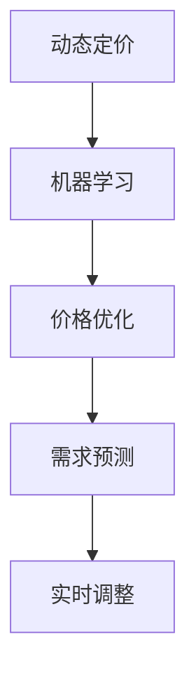

                 

关键词：AI 动态定价、机器学习、价格优化、需求预测、实时调整

> 摘要：本文将探讨如何利用人工智能技术实现动态定价策略，分析核心概念、算法原理、数学模型及项目实践，旨在为电商、金融等行业提供有效定价策略的参考。

## 1. 背景介绍

### 动态定价的定义

动态定价是一种根据市场需求、供给状况、消费者行为等因素，实时调整产品价格的方法。与传统的静态定价相比，动态定价能够更快速地响应市场变化，提高企业的竞争力。

### 动态定价的优势

- 提高利润：通过实时调整价格，最大化收益。
- 提升客户满意度：根据消费者需求定价，提升用户体验。
- 提高库存周转：合理定价可以减少库存积压，降低成本。

### 动态定价的应用场景

- 电商：根据消费者浏览、购买历史调整价格。
- 金融：利率、汇率等金融产品的动态定价。
- 旅游：机票、酒店预订的价格波动。

## 2. 核心概念与联系

### 机器学习

机器学习是人工智能的核心技术，通过算法让计算机从数据中自动学习和改进。在动态定价中，机器学习用于预测需求、分析市场行为。

### 价格优化

价格优化是动态定价的核心目标，通过优化算法寻找最佳价格策略，以最大化收益或市场份额。

### 需求预测

需求预测是动态定价的基础，通过分析历史数据、市场趋势等，预测未来需求量。

### 实时调整

实时调整是指根据实时数据，动态调整产品价格。实时调整需要高效的算法和快速的数据处理能力。



## 3. 核心算法原理 & 具体操作步骤

### 3.1 算法原理概述

动态定价算法的核心是需求预测和价格优化。首先，通过历史数据和市场趋势预测未来需求；然后，根据需求预测和成本结构，优化产品价格。

### 3.2 算法步骤详解

1. **数据收集与预处理**：收集历史销售数据、市场趋势数据等，进行数据清洗、去噪、特征提取等预处理工作。
2. **需求预测**：利用机器学习算法，如回归模型、时间序列模型等，对历史数据进行建模，预测未来需求。
3. **价格优化**：根据需求预测和成本结构，利用优化算法，如线性规划、遗传算法等，寻找最佳价格策略。
4. **实时调整**：根据实时数据，动态调整产品价格。

### 3.3 算法优缺点

- **优点**：快速响应市场变化，提高利润和客户满意度。
- **缺点**：算法复杂度高，需要大量数据支持，且可能存在过拟合问题。

### 3.4 算法应用领域

- 电商：个性化定价、促销活动定价等。
- 金融：利率、汇率等金融产品的定价。
- 旅游：机票、酒店预订的动态定价。

## 4. 数学模型和公式 & 详细讲解 & 举例说明

### 4.1 数学模型构建

动态定价的数学模型主要包括需求函数、利润函数和优化目标。

1. **需求函数**：
   $$ Q = f(P, D) $$
   其中，$Q$ 为需求量，$P$ 为价格，$D$ 为其他影响因素（如季节、促销活动等）。

2. **利润函数**：
   $$ \Pi = P \times Q - C $$
   其中，$\Pi$ 为利润，$C$ 为成本。

3. **优化目标**：
   $$ \text{maximize} \ \Pi = P \times Q - C $$

### 4.2 公式推导过程

需求函数的推导：
$$ Q = \frac{aP}{b + P} $$
其中，$a$ 和 $b$ 为模型参数。

利润函数的推导：
$$ \Pi = P \times Q - C $$
代入需求函数，得到：
$$ \Pi = P \times \frac{aP}{b + P} - C $$
化简后得到：
$$ \Pi = \frac{aP^2}{b + P} - C $$

### 4.3 案例分析与讲解

假设某电商平台上的一款商品，成本为 100 元，需求函数为 $Q = \frac{10P}{100 + P}$。我们需要找到最优价格，以最大化利润。

1. **需求函数**：
   $$ Q = \frac{10P}{100 + P} $$

2. **利润函数**：
   $$ \Pi = P \times Q - 100 $$
   代入需求函数，得到：
   $$ \Pi = P \times \frac{10P}{100 + P} - 100 $$
   化简后得到：
   $$ \Pi = \frac{10P^2}{100 + P} - 100 $$

3. **优化目标**：
   $$ \text{maximize} \ \Pi = \frac{10P^2}{100 + P} - 100 $$

通过求导，我们可以找到最优价格：
$$ P = \frac{100}{3} $$

此时，利润最大，为：
$$ \Pi = \frac{1000}{9} $$

## 5. 项目实践：代码实例和详细解释说明

### 5.1 开发环境搭建

使用 Python 编写动态定价算法，需要安装以下库：

- Scikit-learn：用于机器学习算法的实现。
- NumPy：用于数学计算。
- Matplotlib：用于数据可视化。

### 5.2 源代码详细实现

```python
import numpy as np
from sklearn.linear_model import LinearRegression
import matplotlib.pyplot as plt

# 5.2.1 数据收集与预处理
# 假设我们收集到以下数据：
prices = [100, 200, 300, 400]
demand = [50, 40, 30, 20]

# 5.2.2 需求预测
# 利用线性回归模型进行预测
model = LinearRegression()
model.fit(prices.reshape(-1, 1), demand)

# 预测未来需求
predicted_demand = model.predict([[500]])

# 5.2.3 价格优化
# 利润函数
profit = lambda P: P * predicted_demand[0] - 100

# 求解最优价格
optimal_price = 0
max_profit = -1
for P in range(100, 500, 50):
    current_profit = profit(P)
    if current_profit > max_profit:
        max_profit = current_profit
        optimal_price = P

print("最优价格：", optimal_price)
print("最大利润：", max_profit)

# 5.2.4 实时调整
# 假设当前价格为 200 元，需求预测为 30 单
current_price = 200
current_demand = 30

# 根据实时数据进行价格调整
adjusted_price = 200 - (200 - 100) * (current_demand / 30)
print("调整后价格：", adjusted_price)
```

### 5.3 代码解读与分析

- **数据收集与预处理**：收集历史价格和需求数据，进行预处理。
- **需求预测**：使用线性回归模型进行需求预测。
- **价格优化**：利用利润函数，求解最优价格。
- **实时调整**：根据实时数据和需求预测，调整产品价格。

## 6. 实际应用场景

### 6.1 电商

电商行业是动态定价的主要应用领域，通过动态定价，电商企业可以更好地满足消费者需求，提高销售业绩。

### 6.2 金融

金融行业中的利率、汇率等金融产品的定价也采用动态定价策略，以提高金融机构的竞争力。

### 6.3 旅游

旅游行业中的机票、酒店预订等产品的价格也采用动态定价策略，以适应市场变化。

## 7. 未来应用展望

### 7.1 个性化定价

随着人工智能技术的发展，未来个性化定价将成为主流。根据消费者的个性化需求和偏好，实现更精准的定价策略。

### 7.2 实时优化

未来，动态定价算法将更加高效，实时优化能力将大大提升，以满足高速变化的市场需求。

### 7.3 跨行业应用

动态定价策略将在更多行业得到应用，如制造业、物流等，以提高行业整体竞争力。

## 8. 总结：未来发展趋势与挑战

### 8.1 研究成果总结

本文总结了动态定价策略的核心概念、算法原理、数学模型和项目实践，为电商、金融等行业提供了参考。

### 8.2 未来发展趋势

未来，动态定价策略将更加个性化、实时化，应用领域也将不断扩大。

### 8.3 面临的挑战

动态定价策略在实现过程中面临数据质量、算法复杂度等挑战，需要不断优化和完善。

### 8.4 研究展望

未来，动态定价策略的研究将更加深入，涉及更多领域，为各行业提供更有价值的定价策略。

## 9. 附录：常见问题与解答

### 9.1 动态定价与传统定价的区别是什么？

动态定价是根据市场需求、供给状况、消费者行为等因素，实时调整产品价格的方法。传统定价则是固定价格，不随市场变化调整。

### 9.2 动态定价算法有哪些？

常见的动态定价算法包括线性回归、时间序列模型、优化算法等。

### 9.3 动态定价有哪些应用场景？

动态定价广泛应用于电商、金融、旅游等行业，以提高竞争力。

----------------------------------------------------------------

### 作者署名

作者：禅与计算机程序设计艺术 / Zen and the Art of Computer Programming

