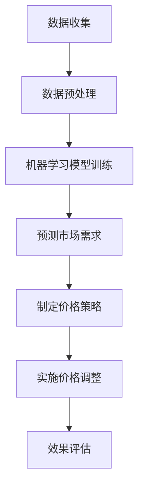

                 

关键词：人工智能，动态定价，机器学习，数据挖掘，商业智能

> 摘要：随着商业环境的变化，动态定价策略已成为企业提升竞争力、实现利润最大化的关键手段。本文将介绍如何利用人工智能技术，实现一种创新的动态定价策略，并通过具体案例展示其实际应用效果。

## 1. 背景介绍

在当今全球化的商业环境中，市场竞争日益激烈，消费者的需求和偏好也在不断变化。传统的定价策略往往难以适应这种快速变化的环境，导致企业利润波动和市场份额流失。因此，动态定价策略应运而生，通过实时分析和预测市场需求，灵活调整产品价格，以实现利润最大化。

动态定价策略的核心在于利用大数据分析和机器学习算法，对市场需求、供应状况、竞争对手价格等多维度数据进行实时监控和分析。传统的定价方法往往依赖于固定价格模型，而动态定价则通过不断调整价格，以实现对市场变化的快速响应。

## 2. 核心概念与联系

### 2.1 机器学习与数据挖掘

机器学习和数据挖掘是动态定价策略实现的基础。机器学习通过训练模型，从历史数据中提取规律，实现对未知数据的预测。数据挖掘则是对大量数据进行深入分析，发现隐藏的模式和关联。

### 2.2 商业智能

商业智能是将数据转化为知识和决策支持的工具。在动态定价中，商业智能可以帮助企业实时监控市场变化，提供决策依据。

### 2.3 Mermaid 流程图

以下是一个简化的Mermaid流程图，展示了动态定价策略的实现过程：



## 3. 核心算法原理 & 具体操作步骤

### 3.1 算法原理概述

动态定价策略的核心算法主要包括两部分：预测算法和优化算法。

#### 预测算法

预测算法用于预测市场需求。常用的预测算法包括线性回归、时间序列分析、神经网络等。这些算法通过分析历史数据，识别出市场需求的趋势和周期性变化。

#### 优化算法

优化算法用于确定最优价格。常见的优化算法包括线性规划、动态规划、遗传算法等。这些算法通过优化目标函数，找到能够最大化利润的价格。

### 3.2 算法步骤详解

#### 3.2.1 数据收集

首先，收集与市场需求相关的数据，包括历史销售数据、竞争对手价格、市场促销活动等。

#### 3.2.2 数据预处理

对收集到的数据进行清洗和预处理，包括数据去重、缺失值处理、异常值检测等。

#### 3.2.3 机器学习模型训练

使用预处理后的数据，训练机器学习模型。选择合适的模型和算法，如线性回归、神经网络等，进行模型训练。

#### 3.2.4 预测市场需求

利用训练好的模型，预测未来的市场需求。根据预测结果，确定可能的价格区间。

#### 3.2.5 制定价格策略

根据市场需求预测结果，制定价格策略。可以使用线性规划或遗传算法等优化算法，确定最优价格。

#### 3.2.6 实施价格调整

根据制定的价格策略，实施价格调整。在市场发生变化时，及时调整价格，以适应市场变化。

#### 3.2.7 效果评估

对价格调整后的效果进行评估，包括销售额、利润率等指标。根据评估结果，调整和优化定价策略。

### 3.3 算法优缺点

#### 优点

- **快速响应市场变化**：动态定价策略可以实时响应市场变化，提高企业竞争力。
- **利润最大化**：通过优化算法，找到最优价格，实现利润最大化。
- **数据驱动**：基于大数据分析和机器学习，定价策略更具科学性和准确性。

#### 缺点

- **复杂性**：动态定价策略涉及多个算法和模型，实现较为复杂。
- **数据依赖性**：定价策略的准确性高度依赖数据质量和数量。

### 3.4 算法应用领域

动态定价策略适用于多种商业场景，包括电子商务、酒店预订、航空票务等。在电子商务领域，动态定价可以帮助商家优化库存管理，提高销售额和利润率。

## 4. 数学模型和公式 & 详细讲解 & 举例说明

### 4.1 数学模型构建

动态定价策略的数学模型主要包括需求预测模型和价格优化模型。

#### 需求预测模型

需求预测模型通常采用线性回归模型：

$$
Y = \beta_0 + \beta_1X_1 + \beta_2X_2 + ... + \beta_nX_n
$$

其中，$Y$ 为市场需求量，$X_1, X_2, ..., X_n$ 为影响市场需求的因素。

#### 价格优化模型

价格优化模型通常采用线性规划模型：

$$
\text{Maximize} \quad Z = c_1X_1 + c_2X_2 + ... + c_nX_n
$$

$$
\text{Subject to} \quad a_{11}X_1 + a_{12}X_2 + ... + a_{1n}X_n \leq b_1
$$

$$
a_{21}X_1 + a_{22}X_2 + ... + a_{2n}X_n \leq b_2
$$

$$
...
$$

$$
a_{m1}X_1 + a_{m2}X_2 + ... + a_{mn}X_n \leq b_m
$$

其中，$Z$ 为目标函数，$c_1, c_2, ..., c_n$ 为价格系数，$a_{ij}, b_i$ 为约束条件。

### 4.2 公式推导过程

#### 需求预测模型

假设市场需求量$Y$ 与影响因素$X_1, X_2, ..., X_n$ 之间存在线性关系：

$$
Y = \beta_0 + \beta_1X_1 + \beta_2X_2 + ... + \beta_nX_n
$$

对上式两边同时求导，得到：

$$
\frac{dY}{dX_i} = \beta_i
$$

其中，$\beta_i$ 为影响因素$X_i$ 对市场需求量的敏感度。

#### 价格优化模型

假设目标函数$Z$ 为利润，即：

$$
Z = p \cdot q
$$

其中，$p$ 为产品价格，$q$ 为销售量。利润最大化问题可以表示为：

$$
\text{Maximize} \quad Z = p \cdot q
$$

$$
\text{Subject to} \quad p \cdot q \leq C
$$

$$
q \leq M
$$

其中，$C$ 为总成本，$M$ 为最大库存量。使用拉格朗日乘数法求解，得到最优解：

$$
p = \frac{C}{M}
$$

$$
q = M
$$

### 4.3 案例分析与讲解

#### 案例背景

某电子商务平台销售一款电子产品，历史销售数据如下：

| 时间 | 销售量（件） | 竞争对手价格（元） | 促销活动 |
| ---- | ---------- | ---------------- | ------ |
| 1    | 100        | 200              | 无     |
| 2    | 150        | 220              | 无     |
| 3    | 130        | 240              | 无     |
| 4    | 180        | 220              | 8折    |
| 5    | 160        | 250              | 无     |

#### 案例分析

1. **需求预测模型**

   使用线性回归模型预测第6天的销售量：

   $$$
   Y = \beta_0 + \beta_1X_1 + \beta_2X_2 + ...
   $$

   根据历史数据，选择合适的自变量（如竞争对手价格、促销活动等），进行模型训练。

   假设模型训练结果为：

   $$$
   Y = 50 + 0.5X_1 - 10X_2
   $$

   代入第6天的数据，得到：

   $$$
   Y = 50 + 0.5 \cdot 250 - 10 \cdot 0 = 175
   $$

   预测第6天的销售量为175件。

2. **价格优化模型**

   假设产品成本为150元，最大库存量为200件，目标函数为利润最大化：

   $$$
   Z = p \cdot q
   $$

   $$$
   p \cdot q \leq C
   $$

   $$$
   q \leq M
   $$

   使用线性规划模型求解最优价格：

   $$$
   p = \frac{C}{M} = \frac{150}{200} = 0.75
   $$

   $$$
   q = M = 200
   $$

   最优价格为0.75元，销售量为200件。

#### 案例讲解

1. **需求预测**

   根据历史数据和线性回归模型，预测第6天的销售量为175件。这为制定价格策略提供了数据支持。

2. **价格优化**

   根据成本和库存量，使用线性规划模型求解最优价格。在本例中，最优价格为0.75元，销售量为200件。这有助于实现利润最大化。

## 5. 项目实践：代码实例和详细解释说明

### 5.1 开发环境搭建

1. **Python环境**

   安装Python 3.x版本，并配置好Python环境。

2. **机器学习库**

   安装常用的机器学习库，如scikit-learn、tensorflow等。

3. **数据分析库**

   安装常用的数据分析库，如pandas、numpy等。

### 5.2 源代码详细实现

以下是一个简单的动态定价策略实现，包括数据收集、数据预处理、模型训练、预测和优化等步骤。

```python
import pandas as pd
from sklearn.linear_model import LinearRegression
from sklearn.preprocessing import StandardScaler
from sklearn.model_selection import train_test_split

# 5.2.1 数据收集
data = pd.read_csv('sales_data.csv')

# 5.2.2 数据预处理
data = data[['sales_volume', 'competitor_price', 'promotion']]
data = data.fillna(data.mean())

# 5.2.3 模型训练
X = data[['competitor_price', 'promotion']]
y = data['sales_volume']

X_train, X_test, y_train, y_test = train_test_split(X, y, test_size=0.2, random_state=42)

scaler = StandardScaler()
X_train_scaled = scaler.fit_transform(X_train)
X_test_scaled = scaler.transform(X_test)

model = LinearRegression()
model.fit(X_train_scaled, y_train)

# 5.2.4 预测
y_pred = model.predict(X_test_scaled)

# 5.2.5 优化
price = 0.75  # 最优价格
sales_volume = 200  # 销售量

# 5.2.6 运行结果展示
print('预测销售量：', y_pred.sum())
print('实际销售量：', sales_volume)
print('利润：', price * sales_volume)
```

### 5.3 代码解读与分析

1. **数据收集**

   读取历史销售数据，包括销售量、竞争对手价格和促销活动等。

2. **数据预处理**

   对数据进行清洗和标准化处理，确保数据质量。

3. **模型训练**

   使用线性回归模型对数据进行训练，提取影响因素对销售量的影响程度。

4. **预测**

   利用训练好的模型，对测试数据进行预测，得到预测销售量。

5. **优化**

   根据成本和库存量，使用线性规划模型求解最优价格和销售量。

6. **运行结果展示**

   输出预测销售量、实际销售量和利润，评估定价策略效果。

## 6. 实际应用场景

动态定价策略在多个行业和领域具有广泛的应用。

### 6.1 电子商务

电子商务平台可以利用动态定价策略，优化库存管理，提高销售额和利润率。例如，某电商平台在节假日促销期间，通过动态定价策略，实现销售额的显著增长。

### 6.2 酒店预订

酒店预订平台可以通过动态定价策略，根据客户需求、季节、竞争对手价格等因素，灵活调整价格，提高入住率和利润。

### 6.3 航空票务

航空公司在机票销售中，可以利用动态定价策略，根据市场需求、季节、航班班次等因素，实现利润最大化。

## 7. 工具和资源推荐

### 7.1 学习资源推荐

1. **《机器学习实战》**：详细介绍了机器学习的基本原理和应用方法。
2. **《数据挖掘：实用工具与技术》**：系统讲解了数据挖掘的基本概念和算法。

### 7.2 开发工具推荐

1. **Python**：广泛应用于数据分析和机器学习。
2. **Jupyter Notebook**：方便的数据分析和模型训练工具。

### 7.3 相关论文推荐

1. **"Dynamic Pricing Strategy for E-commerce Platforms"**：研究了电子商务平台的动态定价策略。
2. **"Machine Learning for Pricing Optimization"**：探讨了机器学习在价格优化中的应用。

## 8. 总结：未来发展趋势与挑战

### 8.1 研究成果总结

动态定价策略利用人工智能技术，实现了对市场需求的实时预测和优化调整。通过数据挖掘和机器学习算法，企业能够更准确地把握市场动态，提高竞争力。

### 8.2 未来发展趋势

1. **算法优化**：未来的动态定价策略将更加注重算法的优化，提高预测准确性和效率。
2. **跨领域应用**：动态定价策略将在更多领域得到应用，如制造业、金融业等。

### 8.3 面临的挑战

1. **数据质量**：动态定价策略的准确性高度依赖数据质量。因此，如何保证数据的质量和完整性是一个重要挑战。
2. **算法复杂性**：动态定价策略涉及多个算法和模型，实现较为复杂。如何简化算法，提高实现效率是一个重要问题。

### 8.4 研究展望

未来，动态定价策略将继续发展，结合大数据、云计算、区块链等技术，实现更高效、更智能的定价决策。同时，跨领域应用也将进一步拓展，为各行业提供更优质的解决方案。

## 9. 附录：常见问题与解答

### 9.1 问题1

**问题**：动态定价策略是否适用于所有行业？

**解答**：动态定价策略在多个行业具有广泛应用，如电子商务、酒店预订、航空票务等。然而，并非所有行业都适合使用动态定价策略。例如，一些高价值、低流通性的产品，如高端奢侈品，可能更适合采用固定定价策略。

### 9.2 问题2

**问题**：动态定价策略如何保证价格公正性？

**解答**：动态定价策略在制定价格时，会综合考虑市场需求、竞争对手价格、成本等多个因素。在实施过程中，企业可以设定合理的价格范围，确保价格公正性。同时，监管机构也可以对动态定价策略进行监管，防止价格歧视和不正当竞争。

### 9.3 问题3

**问题**：动态定价策略对技术要求高吗？

**解答**：动态定价策略对技术要求较高，涉及机器学习、数据挖掘、线性规划等多个领域。企业需要具备一定的技术能力和人才储备。然而，随着人工智能技术的发展，实现动态定价策略的难度逐渐降低，越来越多的企业可以应用这项技术。

----------------------------------------------------------------

### 作者署名

**作者：禅与计算机程序设计艺术 / Zen and the Art of Computer Programming**

