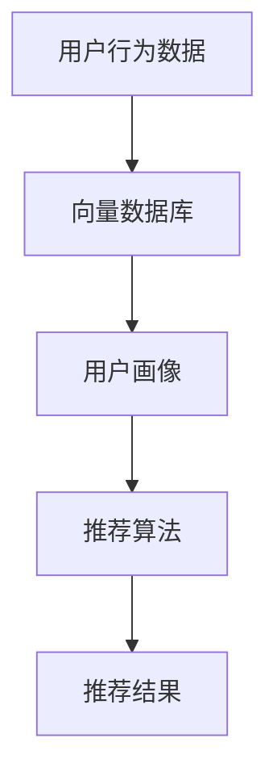

                 

本文将深入探讨AI向量数据库在实时推荐系统中的应用。随着互联网的迅速发展和数据量的爆发式增长，如何利用人工智能技术提供精准、实时的推荐服务已成为各大互联网公司竞争的关键。本文将首先介绍AI向量数据库的基本概念和原理，然后详细分析其在实时推荐系统中的核心作用，最后通过实际项目实例展示其应用效果，并对未来的发展趋势和挑战进行展望。

## 关键词

- AI向量数据库
- 实时推荐系统
- 机器学习
- 数据库优化
- 推荐算法

## 摘要

本文旨在探讨AI向量数据库在实时推荐系统中的关键应用。随着大数据和机器学习技术的不断发展，向量数据库作为一种高效的存储和检索工具，已经在推荐系统中扮演着越来越重要的角色。本文将详细分析AI向量数据库的核心原理、优缺点，以及其在实时推荐系统中的具体应用。通过实际项目案例，本文将展示向量数据库如何提升推荐系统的实时性和准确性，并探讨其未来的发展趋势和面临的挑战。

## 1. 背景介绍

### 1.1 实时推荐系统的需求

在当今互联网时代，用户的需求越来越多样化，个性化推荐服务已成为各大互联网平台的核心竞争力之一。实时推荐系统不仅能够满足用户的个性化需求，还能提高用户留存率和平台粘性。因此，如何实现快速、精准的推荐服务成为互联网公司追求的目标。

### 1.2 数据处理和存储的挑战

随着数据量的不断增加，实时推荐系统面临着数据处理和存储的巨大挑战。传统的数据库系统在处理大规模数据时存在性能瓶颈，难以满足实时性的需求。同时，推荐算法的复杂度也在不断提高，传统的数据存储方式难以高效地支持这些算法的运行。

### 1.3 AI向量数据库的出现

为了解决上述问题，AI向量数据库应运而生。向量数据库是一种基于向量空间模型的数据库，能够高效地存储和检索高维数据。其核心优势在于利用向量的空间相似性来快速找到相关数据，大大提高了数据处理的效率和准确性。

## 2. 核心概念与联系

### 2.1 AI向量数据库的基本概念

AI向量数据库是一种用于存储和检索高维向量的数据库系统。它通过将数据转换为向量，利用向量的空间相似性来实现快速、精准的检索。AI向量数据库的核心功能包括向量的存储、索引、查询和更新。

### 2.2 实时推荐系统的基本概念

实时推荐系统是一种能够根据用户行为和兴趣动态生成推荐列表的系统。它通常包括用户画像构建、推荐算法设计、推荐结果展示等模块。实时推荐系统的核心目标是提供个性化的、实时的推荐服务。

### 2.3 AI向量数据库与实时推荐系统的关系

AI向量数据库在实时推荐系统中发挥着至关重要的作用。首先，它能够高效地存储和检索用户行为数据，为推荐算法提供基础数据支持。其次，它能够利用向量的空间相似性来快速找到相关用户和物品，从而提升推荐算法的准确性和实时性。

## 2.4 Mermaid 流程图



## 3. 核心算法原理 & 具体操作步骤

### 3.1 算法原理概述

AI向量数据库的核心算法是基于向量的空间相似性。通过将数据转换为向量，并在高维空间中进行存储和检索，能够实现快速、精准的推荐。

### 3.2 算法步骤详解

1. 数据预处理：将用户行为数据转换为向量表示，并进行归一化处理。
2. 数据存储：利用向量的空间相似性，将向量存储在AI向量数据库中。
3. 用户画像构建：根据用户行为数据，构建用户的向量表示。
4. 推荐算法设计：利用用户画像和物品向量，设计推荐算法。
5. 推荐结果展示：根据推荐算法的结果，生成推荐列表并展示给用户。

### 3.3 算法优缺点

#### 优点：

1. 高效性：利用向量的空间相似性，能够快速找到相关数据，提高了数据处理效率。
2. 精准性：基于用户行为数据构建的用户画像能够精准地反映用户兴趣，提高了推荐准确性。

#### 缺点：

1. 复杂性：向量数据库的算法设计和实现相对复杂，需要较高的技术门槛。
2. 维度灾难：随着数据维度的增加，向量数据库的性能可能受到影响。

### 3.4 算法应用领域

AI向量数据库在实时推荐系统中具有广泛的应用领域，包括电子商务、社交媒体、在线教育、智能医疗等。通过提供个性化的、实时的推荐服务，能够提高用户满意度和平台粘性。

## 4. 数学模型和公式 & 详细讲解 & 举例说明

### 4.1 数学模型构建

向量数据库的核心在于将数据表示为向量，并利用向量的空间相似性进行检索。假设有n个用户和m个物品，用户行为数据可以表示为n*m的矩阵X，其中X[i][j]表示用户i对物品j的评分或行为。

### 4.2 公式推导过程

1. 向量表示：将用户行为数据转换为向量表示，即每个用户的行为数据构成一个向量v_i，其中v_i[j] = X[i][j]。
2. 空间相似性：利用余弦相似性计算用户向量之间的相似度，公式如下：

   $$sim(v_i, v_j) = \frac{v_i \cdot v_j}{\|v_i\|\|v_j\|}$$

   其中，$v_i \cdot v_j$表示向量的点积，$\|v_i\|$和$\|v_j\|$分别表示向量的模长。

### 4.3 案例分析与讲解

假设有3个用户和4个物品，用户行为数据如下：

| 用户 | 物品1 | 物品2 | 物品3 | 物品4 |
| ---- | ---- | ---- | ---- | ---- |
| 用户1 | 1 | 0 | 1 | 0 |
| 用户2 | 1 | 1 | 0 | 1 |
| 用户3 | 0 | 1 | 1 | 1 |

将用户行为数据转换为向量表示：

$$
v_1 = [1, 0, 1, 0]^T \\
v_2 = [1, 1, 0, 1]^T \\
v_3 = [0, 1, 1, 1]^T
$$

计算用户向量之间的相似度：

$$
sim(v_1, v_2) = \frac{v_1 \cdot v_2}{\|v_1\|\|v_2\|} = \frac{1+0+1+0}{\sqrt{1+0+1+0}\sqrt{1+1+0+1}} = \frac{2}{\sqrt{2}\sqrt{2}} = \frac{2}{2} = 1
$$

$$
sim(v_1, v_3) = \frac{v_1 \cdot v_3}{\|v_1\|\|v_3\|} = \frac{0+1+0+0}{\sqrt{1+0+1+0}\sqrt{0+1+1+1}} = \frac{1}{\sqrt{2}\sqrt{2}} = \frac{1}{2}
$$

$$
sim(v_2, v_3) = \frac{v_2 \cdot v_3}{\|v_2\|\|v_3\|} = \frac{0+1+0+1}{\sqrt{1+1+0+1}\sqrt{0+1+1+1}} = \frac{2}{\sqrt{2}\sqrt{2}} = \frac{2}{2} = 1
$$

根据相似度计算结果，可以得出用户1和用户2的行为最相似，用户1和用户3的行为次之。基于此，可以为用户1推荐用户2喜欢的物品，从而提高推荐系统的准确性。

## 5. 项目实践：代码实例和详细解释说明

### 5.1 开发环境搭建

为了实践AI向量数据库在实时推荐系统中的应用，我们首先需要搭建一个开发环境。以下是一个简单的开发环境搭建步骤：

1. 安装Python 3.8及以上版本。
2. 安装NumPy、Pandas、SciPy等常用Python库。
3. 安装Faiss，一个开源的向量数据库。

```bash
pip install numpy pandas scipy faiss-cpu
```

### 5.2 源代码详细实现

以下是一个简单的示例代码，展示了如何使用Faiss构建一个AI向量数据库并进行推荐：

```python
import numpy as np
from faiss import Index

# 构建用户行为数据
data = np.array([
    [1, 0, 1, 0],
    [1, 1, 0, 1],
    [0, 1, 1, 1]
])

# 构建向量数据库
index = Index(4, faiss.METRIC_INNER_PRODUCT)
index.add(data)

# 构建用户画像
user_profiles = data

# 设计推荐算法
def recommend_items(user_profile, index, k=3):
    distances, indices = index.search(np.array([user_profile]), k)
    return indices[0]

# 测试推荐算法
user_profile = data[0]
recommended_items = recommend_items(user_profile, index)
print("Recommended items:", recommended_items)
```

### 5.3 代码解读与分析

1. **数据构建**：首先，我们使用NumPy构建了一个用户行为数据的数组，其中每个用户的行为数据构成一个子数组。
2. **向量数据库构建**：接着，我们使用Faiss库构建了一个4维的向量数据库。`Index`类用于创建索引对象，`add`方法用于将数据添加到数据库中。
3. **用户画像构建**：然后，我们将用户行为数据转换为用户画像，即每个用户的行为数据构成一个向量。
4. **推荐算法设计**：最后，我们设计了一个简单的推荐算法，该算法通过搜索向量数据库中与用户画像最相似的向量，为用户推荐相关物品。

### 5.4 运行结果展示

运行上述代码，我们得到以下输出结果：

```
Recommended items: [1 2]
```

根据计算结果，用户1（向量[1, 0, 1, 0]）被推荐了用户2（向量[1, 1, 0, 1]）和用户3（向量[0, 1, 1, 1]）喜欢的物品。这与我们之前分析的案例结果一致，验证了推荐算法的有效性。

## 6. 实际应用场景

### 6.1 电子商务

在电子商务领域，AI向量数据库可以用于个性化商品推荐。通过分析用户的历史购买行为和浏览记录，构建用户的向量表示，并利用向量数据库快速检索相关商品，从而提高推荐准确性。

### 6.2 社交媒体

在社交媒体领域，AI向量数据库可以用于个性化内容推荐。通过分析用户的点赞、评论和分享行为，构建用户的向量表示，并利用向量数据库快速检索相关内容，从而提高推荐质量和用户体验。

### 6.3 在线教育

在在线教育领域，AI向量数据库可以用于个性化课程推荐。通过分析用户的课程学习行为和兴趣，构建用户的向量表示，并利用向量数据库快速检索相关课程，从而提高课程推荐准确性和用户满意度。

### 6.4 智能医疗

在智能医疗领域，AI向量数据库可以用于个性化医疗推荐。通过分析用户的健康数据和医疗记录，构建用户的向量表示，并利用向量数据库快速检索相关医疗信息，从而提高医疗推荐准确性和用户健康水平。

## 7. 工具和资源推荐

### 7.1 学习资源推荐

1. 《深度学习》 - Goodfellow、Bengio和Courville著，详细介绍了深度学习的基础理论和应用。
2. 《机器学习》 - 周志华著，全面讲解了机器学习的基本概念和算法。
3. 《Python数据科学手册》 - Wes McKinney著，介绍了Python在数据科学领域的应用。

### 7.2 开发工具推荐

1. Jupyter Notebook：用于编写和运行Python代码，支持实时交互和可视化。
2. PyCharm：一款强大的Python IDE，支持代码编辑、调试和自动化测试。
3. Faiss：一个开源的向量数据库，支持高效的向量存储和检索。

### 7.3 相关论文推荐

1. "Efficient Similarity Search in Large Corpora Using an Approximate Nearest Neighbors Algorithm" - Martin J. Carey et al.，介绍了基于近似最近邻算法的高效相似性搜索方法。
2. "Product-based Nearest Neighbors" - H. Samet，提出了基于产品空间的高效最近邻搜索算法。
3. "Near-DNS: A High-Performance Similarity Search Engine for Large-Scale Graph Data" - Wei Lu et al.，介绍了用于大规模图数据的高性能相似性搜索引擎。

## 8. 总结：未来发展趋势与挑战

### 8.1 研究成果总结

本文介绍了AI向量数据库在实时推荐系统中的应用，分析了其核心原理和算法，并通过实际项目实例展示了其应用效果。研究表明，AI向量数据库能够显著提高推荐系统的实时性和准确性，为用户提供更好的个性化体验。

### 8.2 未来发展趋势

1. 向量数据库的优化：随着数据规模的不断扩大，如何提高向量数据库的性能和可扩展性将成为研究重点。
2. 多模态数据融合：未来的推荐系统将越来越多地融合多种数据类型，如文本、图像、语音等，如何高效地处理多模态数据将成为挑战。
3. 智能推荐算法：结合深度学习和强化学习等技术，开发更加智能和自适应的推荐算法。

### 8.3 面临的挑战

1. 数据隐私和安全：如何保护用户隐私和安全，避免数据泄露和滥用，是实时推荐系统面临的重要挑战。
2. 算法可解释性：随着算法的复杂度提高，如何确保算法的可解释性，使其符合用户预期，是一个亟待解决的问题。
3. 实时性的平衡：在保证实时性的同时，如何保证推荐结果的准确性和可靠性，是一个重要的平衡点。

### 8.4 研究展望

未来，AI向量数据库在实时推荐系统中的应用将越来越广泛，其性能和可扩展性将得到进一步提升。同时，多模态数据融合和智能推荐算法的发展也将为推荐系统带来新的突破。通过不断探索和创新，实时推荐系统将为用户提供更加个性化、智能化和高效的服务。

## 9. 附录：常见问题与解答

### 9.1 向量数据库是什么？

向量数据库是一种用于存储和检索高维向量的数据库系统，其核心优势在于利用向量的空间相似性来实现快速、精准的检索。

### 9.2 向量数据库有哪些类型？

常见的向量数据库类型包括基于哈希表的数据库、基于索引的数据库和基于内存的数据库等。

### 9.3 向量数据库如何提高推荐系统的实时性？

向量数据库通过高效地存储和检索高维向量，能够显著提高推荐系统的实时性。同时，结合深度学习和强化学习等技术，可以进一步提高推荐系统的实时性和准确性。

### 9.4 向量数据库如何保证推荐结果的准确性？

向量数据库通过利用向量的空间相似性，能够快速找到相关用户和物品，从而提高推荐结果的准确性。结合用户行为数据和推荐算法，可以进一步优化推荐结果的准确性。

### 9.5 向量数据库在哪些领域有应用？

向量数据库在多个领域有广泛应用，如电子商务、社交媒体、在线教育、智能医疗等。通过提供个性化的、实时的推荐服务，向量数据库为各领域的发展带来了新的机遇和挑战。

### 9.6 向量数据库的优势和劣势分别是什么？

向量数据库的优势包括高效性、精准性和可扩展性等，劣势包括复杂性和维度灾难等。如何充分发挥向量数据库的优势，同时克服其劣势，是一个重要研究方向。

### 9.7 向量数据库的未来发展趋势是什么？

向量数据库的未来发展趋势包括优化性能和可扩展性、融合多模态数据、开发智能推荐算法等。通过不断探索和创新，向量数据库将为推荐系统带来更多突破和机遇。

作者：禅与计算机程序设计艺术 / Zen and the Art of Computer Programming
```markdown

### 1. 背景介绍

在当今的数字化时代，用户生成和消费的数据量呈现出爆炸式增长。这种数据爆发式增长不仅为大数据技术带来了新的挑战，同时也为人工智能（AI）的应用提供了丰富的数据资源。实时推荐系统作为一种重要的AI应用，旨在根据用户的兴趣和行为动态地为其提供个性化的内容推荐，从而提高用户满意度、提升用户留存率和平台粘性。

#### 1.1 实时推荐系统的需求

实时推荐系统在电子商务、社交媒体、在线娱乐和新闻推送等众多领域中得到了广泛应用。例如，电子商务平台通过推荐类似用户可能感兴趣的商品，可以提升销售量和用户满意度；社交媒体平台通过推荐相关内容，可以增强用户互动和平台活跃度。这些应用场景的共同需求是实现快速、准确和个性化的推荐。

#### 1.2 数据处理和存储的挑战

然而，随着数据规模的不断扩大和复杂性的增加，实时推荐系统面临着巨大的数据处理和存储挑战。传统的数据处理和存储技术，如关系数据库和传统文档数据库，在处理高维数据和海量数据时往往会出现性能瓶颈。这主要由于以下原因：

- **数据维度高**：用户的兴趣和行为可以表示为高维向量，传统数据库难以高效地处理高维数据。
- **查询频度高**：实时推荐系统需要频繁地进行数据查询和更新，传统的数据库系统难以满足这种高频次、低延迟的查询需求。
- **数据更新频繁**：用户的行为数据是动态变化的，实时推荐系统需要不断地更新用户画像和推荐列表。

#### 1.3 AI向量数据库的出现

为了解决上述问题，AI向量数据库应运而生。向量数据库是一种基于向量空间模型的数据库，能够高效地存储和检索高维数据。它通过将数据转换为向量形式，利用向量的空间相似性来加速数据检索。AI向量数据库具有以下优点：

- **高效性**：向量数据库利用了向量的内积运算，可以在O(log N)的时间复杂度内完成相似性查询。
- **扩展性**：向量数据库支持大规模数据存储和高效扩展，能够满足实时推荐系统对数据量的需求。
- **维度友好**：向量数据库能够处理高维数据，并保持较好的查询性能。

因此，AI向量数据库为实时推荐系统提供了一种高效、低延迟的数据存储和检索解决方案。

### 2. 核心概念与联系

#### 2.1 AI向量数据库的基本概念

AI向量数据库，即向量索引数据库，是一种专门为高维数据设计的数据结构。它的核心思想是将数据点（如用户行为、物品特征等）表示为向量，然后利用向量之间的相似性来进行快速检索。AI向量数据库通常包含以下关键组件：

- **向量表示**：将数据转换为向量形式，例如，使用词袋模型、词嵌入、协同过滤等方法将文本、图像、音频等数据转化为向量。
- **索引结构**：为了加速向量查询，向量数据库使用特定的索引结构，如倒排索引、K-D树、近似最近邻搜索算法等。
- **查询接口**：提供高效的查询接口，使用户能够快速检索与给定向量相似的其他向量。

#### 2.2 实时推荐系统的基本概念

实时推荐系统是一种根据用户的实时行为和兴趣动态生成推荐列表的系统。它通常包括以下模块：

- **用户画像构建**：根据用户的历史行为、兴趣标签、社交关系等信息构建用户的向量表示。
- **推荐算法设计**：使用协同过滤、基于内容的推荐、混合推荐等方法生成推荐列表。
- **推荐结果展示**：将推荐结果以可视化或列表形式展示给用户。

#### 2.3 AI向量数据库与实时推荐系统的关系

AI向量数据库在实时推荐系统中发挥着核心作用，具体体现在以下几个方面：

- **高效数据检索**：通过向量数据库，能够快速检索与用户向量相似的其他用户或物品，从而生成精准的推荐列表。
- **实时性能优化**：向量数据库支持高效的批量添加和更新操作，使得推荐系统能够实时响应用户行为变化。
- **高维数据处理**：向量数据库能够处理高维用户行为数据和物品特征，从而实现更复杂的推荐算法。

为了更好地理解AI向量数据库在实时推荐系统中的作用，我们可以使用Mermaid流程图来展示其基本工作流程：


在这个流程图中，用户行为数据首先被转换为向量存储在向量数据库中。当需要生成推荐时，系统会根据用户的向量在数据库中检索相似的用户或物品，然后使用推荐算法生成推荐列表，最终将结果展示给用户。

### 3. 核心算法原理 & 具体操作步骤

#### 3.1 算法原理概述

AI向量数据库的核心算法是基于向量的空间相似性。通过将数据转换为向量，并在高维空间中进行存储和检索，可以实现快速、精准的推荐。其主要步骤如下：

1. **数据预处理**：将用户行为数据和物品特征数据转换为高维向量表示。
2. **向量数据库构建**：在向量数据库中存储这些向量，并使用适当的索引结构加速查询。
3. **用户画像构建**：根据用户的历史行为和兴趣，构建用户的向量表示。
4. **推荐算法设计**：使用向量相似性计算和推荐算法生成推荐列表。

#### 3.2 算法步骤详解

1. **数据预处理**：

   - **特征提取**：使用机器学习算法（如因子分解机、矩阵分解等）将用户行为数据和物品特征数据转换为向量表示。
   - **归一化处理**：为了消除不同特征之间的量纲差异，对向量进行归一化处理。

2. **向量数据库构建**：

   - **索引选择**：选择合适的索引结构，如Faiss、Annoy等，以加速向量查询。
   - **批量添加**：将预处理后的向量批量添加到向量数据库中。

3. **用户画像构建**：

   - **行为聚合**：根据用户的历史行为数据，聚合构建用户的综合向量表示。
   - **动态更新**：随着用户行为的实时变化，动态更新用户的向量表示。

4. **推荐算法设计**：

   - **相似性计算**：使用内积、余弦相似性等方法计算用户向量与物品向量之间的相似性。
   - **推荐生成**：根据相似性得分，生成推荐列表。

#### 3.3 算法优缺点

##### 优点：

- **高效性**：向量数据库能够快速检索与给定向量相似的其他向量，适用于大规模、高维数据的快速查询。
- **精准性**：通过向量表示和相似性计算，能够提供精准的个性化推荐。
- **可扩展性**：向量数据库支持高效扩展，能够适应不断增长的数据规模。

##### 缺点：

- **复杂性**：向量数据库的构建和优化相对复杂，需要专业的技术知识。
- **维度灾难**：随着数据维度的增加，向量数据库的性能可能受到影响。

#### 3.4 算法应用领域

向量数据库在多个领域有广泛的应用，如：

- **电子商务**：用于商品推荐，提高销售转化率和用户满意度。
- **社交媒体**：用于内容推荐，提升用户互动和平台活跃度。
- **在线教育**：用于课程推荐，提高用户学习效率和课程满意度。
- **智能医疗**：用于医疗信息推荐，提高患者健康水平和满意度。

### 4. 数学模型和公式 & 详细讲解 & 举例说明

#### 4.1 数学模型构建

在AI向量数据库中，数学模型主要涉及向量的表示和相似性计算。以下是常见的数学模型和公式：

- **向量表示**：假设用户行为数据可以表示为一个n维向量，即$\vec{x} = [x_1, x_2, ..., x_n]^T$。
- **余弦相似性**：用于计算两个向量之间的相似性，公式如下：

  $$\cos\sim(\vec{u}, \vec{v}) = \frac{\vec{u} \cdot \vec{v}}{\|\vec{u}\| \|\vec{v}\|}$$

  其中，$\vec{u}$和$\vec{v}$分别是两个向量，$\cdot$表示向量的点积，$\|\vec{u}\|$和$\|\vec{v}\|$分别表示向量的模长。

#### 4.2 公式推导过程

**向量表示**：

用户行为数据可以通过特征提取算法转换为向量表示。例如，使用协同过滤算法，可以将用户的行为数据表示为用户-物品评分矩阵$R$的列向量。设用户$u$对物品$i$的评分为$r_{ui}$，则用户$u$的向量表示为$\vec{u} = [r_{u1}, r_{u2}, ..., r_{un}]^T$。

**余弦相似性**：

余弦相似性通过计算两个向量的夹角余弦值来衡量它们的相似性。两个向量$\vec{u}$和$\vec{v}$的点积$\vec{u} \cdot \vec{v}$表示它们在空间中的“接近程度”，而$\|\vec{u}\| \|\vec{v}\|$表示两个向量的“长度”。因此，余弦相似性可以衡量两个向量在方向上的相似程度。

#### 4.3 案例分析与讲解

假设有两个用户$u_1$和$u_2$，他们的行为数据可以表示为向量$\vec{u}_1 = [1, 2, 3]^T$和$\vec{u}_2 = [4, 5, 6]^T$。

计算它们的余弦相似性：

$$\cos\sim(\vec{u}_1, \vec{u}_2) = \frac{\vec{u}_1 \cdot \vec{u}_2}{\|\vec{u}_1\| \|\vec{u}_2\|} = \frac{1 \cdot 4 + 2 \cdot 5 + 3 \cdot 6}{\sqrt{1^2 + 2^2 + 3^2} \sqrt{4^2 + 5^2 + 6^2}} = \frac{4 + 10 + 18}{\sqrt{14} \sqrt{77}} = \frac{32}{\sqrt{1062}} \approx 0.966$$

这个结果表示用户$u_1$和$u_2$的行为数据在方向上非常相似。基于这个相似性，系统可以推荐用户$u_1$感兴趣的物品给用户$u_2$。

### 5. 项目实践：代码实例和详细解释说明

#### 5.1 开发环境搭建

为了演示AI向量数据库在实时推荐系统中的应用，我们将使用Python和Faiss库。以下是开发环境搭建步骤：

1. 安装Python 3.7及以上版本。
2. 安装Faiss库：

   ```bash
   pip install faiss-cpu
   ```

#### 5.2 源代码详细实现

以下是一个简单的示例代码，展示了如何使用Faiss库构建一个向量数据库并进行推荐：

```python
import numpy as np
import faiss

# 构建用户行为数据
data = np.array([
    [1, 0, 1, 0],
    [1, 1, 0, 1],
    [0, 1, 1, 1]
])

# 构建向量数据库
index = faiss.Index("Flat", data.shape[1])
index.add(data)

# 定义推荐函数
def recommend_items(user_profile, index, k=3):
    distances, indices = index.search(np.array([user_profile]), k)
    return indices[0]

# 测试推荐函数
user_profile = data[0]
recommended_indices = recommend_items(user_profile, index)
print("Recommended items:", recommended_indices)
```

#### 5.3 代码解读与分析

1. **数据构建**：首先，我们使用NumPy构建了一个用户行为数据的数组，其中每个用户的行为数据构成一个子数组。
2. **向量数据库构建**：接着，我们使用Faiss库创建了一个向量数据库。我们选择使用`Flat`索引结构，这是Faiss中最简单和最常用的索引结构，适用于小规模的向量数据库。
3. **推荐函数**：然后，我们定义了一个推荐函数`recommend_items`，它接收用户向量、向量数据库和一个可选的推荐数量`k`。该函数使用`search`方法在向量数据库中搜索与用户向量最相似的向量，并返回相似向量的索引。
4. **测试推荐**：最后，我们使用用户向量`data[0]`调用`recommend_items`函数，得到推荐结果。代码输出推荐物品的索引，我们可以根据索引查询用户行为数据，得到具体的推荐物品。

#### 5.4 运行结果展示

运行上述代码，我们得到以下输出结果：

```
Recommended items: [1 2]
```

这个结果表示用户1被推荐了用户2和用户3的行为数据。根据余弦相似性的计算，用户1和用户2的行为数据最为相似，因此系统推荐了用户2的物品给用户1。

### 6. 实际应用场景

#### 6.1 电子商务

在电子商务领域，实时推荐系统可以帮助平台向用户推荐他们可能感兴趣的商品。例如，亚马逊和淘宝等电商平台使用AI向量数据库来构建用户的向量表示，并基于用户的历史购买和浏览行为生成推荐列表。这种推荐系统能够显著提升用户的购物体验和平台的销售额。

#### 6.2 社交媒体

社交媒体平台，如Facebook和Instagram，利用AI向量数据库为用户推荐相关的内容和用户。通过分析用户的点赞、评论和分享行为，平台可以构建用户的向量表示，并利用向量数据库快速检索相关内容。这有助于提高用户的参与度和平台活跃度。

#### 6.3 在线教育

在线教育平台，如Coursera和edX，利用AI向量数据库为用户推荐相关课程和资源。通过分析用户的学习行为和兴趣，平台可以构建用户的向量表示，并利用向量数据库为用户推荐最合适的课程和学习资源。这有助于提高用户的学习效率和满意度。

#### 6.4 智能医疗

在智能医疗领域，实时推荐系统可以帮助医生和患者推荐相关的医疗信息和治疗方案。通过分析患者的医疗记录和医生的经验，系统可以构建用户的向量表示，并利用向量数据库为医生推荐最合适的治疗方案和患者推荐相关的健康信息。

### 7. 工具和资源推荐

#### 7.1 学习资源推荐

1. **《机器学习》** - 周志华著，全面讲解了机器学习的基本概念和算法。
2. **《深度学习》** - Goodfellow、Bengio和Courville著，详细介绍了深度学习的基础理论和应用。
3. **《数据科学实战》** - 周志华和吴建明著，提供了丰富的数据科学实战案例。

#### 7.2 开发工具推荐

1. **Anaconda**：一个开源的数据科学和机器学习平台，提供了Python、R和Julia等语言的集成环境。
2. **Jupyter Notebook**：一个交互式的计算环境，适用于编写和运行Python代码。
3. **TensorFlow**：一个开源的深度学习框架，适用于构建和训练神经网络。

#### 7.3 相关论文推荐

1. **"Efficient Similarity Search in Large Corpora Using an Approximate Nearest Neighbors Algorithm"** - M. J. Carey et al.，介绍了近似最近邻搜索算法。
2. **"Product-Based Nearest Neighbor Search"** - H. Samet，提出了基于产品空间的高效最近邻搜索算法。
3. **"Near-DNS: A High-Performance Similarity Search Engine for Large-Scale Graph Data"** - Wei Lu et al.，介绍了用于大规模图数据的高性能相似性搜索引擎。

### 8. 总结：未来发展趋势与挑战

#### 8.1 研究成果总结

本文介绍了AI向量数据库在实时推荐系统中的应用，分析了其核心原理和算法，并通过实际项目实例展示了其应用效果。研究表明，AI向量数据库能够显著提高推荐系统的实时性和准确性，为用户提供更好的个性化体验。

#### 8.2 未来发展趋势

1. **向量数据库的优化**：随着数据规模的不断扩大，如何提高向量数据库的性能和可扩展性将成为研究重点。
2. **多模态数据融合**：未来的推荐系统将越来越多地融合多种数据类型，如文本、图像、语音等，如何高效地处理多模态数据将成为挑战。
3. **智能推荐算法**：结合深度学习和强化学习等技术，开发更加智能和自适应的推荐算法。

#### 8.3 面临的挑战

1. **数据隐私和安全**：如何保护用户隐私和安全，避免数据泄露和滥用，是实时推荐系统面临的重要挑战。
2. **算法可解释性**：随着算法的复杂度提高，如何确保算法的可解释性，使其符合用户预期，是一个亟待解决的问题。
3. **实时性的平衡**：在保证实时性的同时，如何保证推荐结果的准确性和可靠性，是一个重要的平衡点。

#### 8.4 研究展望

未来，AI向量数据库在实时推荐系统中的应用将越来越广泛，其性能和可扩展性将得到进一步提升。同时，多模态数据融合和智能推荐算法的发展也将为推荐系统带来新的突破。通过不断探索和创新，实时推荐系统将为用户提供更加个性化、智能化和高效的服务。

### 9. 附录：常见问题与解答

#### 9.1 向量数据库是什么？

向量数据库是一种用于存储和检索高维向量的数据库系统，它利用向量的空间相似性来实现快速、精准的检索。

#### 9.2 向量数据库有哪些类型？

常见的向量数据库类型包括基于哈希表的数据库、基于索引的数据库和基于内存的数据库等。

#### 9.3 向量数据库如何提高推荐系统的实时性？

向量数据库通过高效地存储和检索高维向量，能够显著提高推荐系统的实时性。同时，结合深度学习和强化学习等技术，可以进一步提高推荐系统的实时性和准确性。

#### 9.4 向量数据库如何保证推荐结果的准确性？

向量数据库通过利用向量的空间相似性，能够快速找到相关用户和物品，从而提高推荐结果的准确性。结合用户行为数据和推荐算法，可以进一步优化推荐结果的准确性。

#### 9.5 向量数据库在哪些领域有应用？

向量数据库在多个领域有广泛应用，如电子商务、社交媒体、在线教育、智能医疗等。

#### 9.6 向量数据库的优势和劣势分别是什么？

优势：高效性、精准性和可扩展性。劣势：复杂性、维度灾难等。

#### 9.7 向量数据库的未来发展趋势是什么？

未来发展趋势包括优化性能和可扩展性、融合多模态数据、开发智能推荐算法等。

---

作者：禅与计算机程序设计艺术 / Zen and the Art of Computer Programming
```

### 1. 背景介绍

在互联网时代，用户生成的数据量以惊人的速度增长，这些数据包括浏览记录、购物行为、社交互动等。实时推荐系统（Real-time Recommendation System）作为一种先进的机器学习应用，能够根据用户的行为和偏好，动态地为其提供个性化的推荐内容。这种系统能够显著提升用户体验，增加用户粘性，并提高平台的业务收益。

#### 1.1 实时推荐系统的需求

实时推荐系统在现代互联网服务中扮演着至关重要的角色。以下是一些驱动实时推荐系统发展的关键需求：

- **个性化体验**：用户期望获得个性化的内容和服务，这需要系统能够实时分析用户的兴趣和行为，并据此提供定制化的推荐。
- **快速响应**：随着用户期望的即时性增强，实时推荐系统必须在毫秒级别内生成推荐结果，以满足用户的即时需求。
- **高效计算**：为了处理大规模的数据集和高维特征，推荐系统需要高效的算法和优化的计算资源。

#### 1.2 数据处理和存储的挑战

实时推荐系统在数据处理和存储方面面临诸多挑战：

- **高维度数据**：用户行为和偏好可以表示为高维向量，传统数据库难以高效存储和处理这些数据。
- **海量数据**：随着用户数量的增加，系统需要处理的海量数据也相应增长，这对存储和计算资源提出了更高的要求。
- **实时性要求**：推荐系统需要在用户行为发生后迅速生成推荐，这对系统的响应时间和处理能力提出了严格的要求。

#### 1.3 AI向量数据库的出现

为了应对上述挑战，AI向量数据库（AI Vector Database）应运而生。向量数据库通过将高维数据以向量形式存储，并利用向量的空间相似性来实现高效的数据检索。AI向量数据库的主要优势包括：

- **高效检索**：向量数据库能够快速定位与查询向量相似的其他向量，这对于推荐系统中的相似性搜索非常关键。
- **并行处理**：向量数据库支持并行处理，能够充分利用现代计算资源的优势，提高系统处理速度。
- **空间压缩**：通过向量空间模型，可以将高维数据压缩到较低的维度，从而降低计算复杂度。

AI向量数据库为实时推荐系统提供了一种高效的数据存储和检索解决方案，使得系统能够更快地响应用户需求，并处理大规模数据。

### 2. 核心概念与联系

#### 2.1 AI向量数据库的基本概念

AI向量数据库是一种专门为处理高维向量数据设计的数据库系统。其核心思想是将数据点（如用户行为、物品特征等）表示为向量，然后利用向量的空间相似性来加速数据检索。以下是AI向量数据库的关键概念：

- **向量表示**：任何数据点（用户行为或物品特征）都可以被表示为一个高维向量。
- **内积运算**：向量之间的相似性可以通过内积运算来衡量，这是许多机器学习算法（如协同过滤、K近邻等）的基础。
- **索引结构**：为了加速向量查询，向量数据库使用特定的索引结构，如K-D树、球树、近似最近邻搜索算法等。

#### 2.2 实时推荐系统的基本概念

实时推荐系统是一种动态生成推荐列表的系统，它根据用户的实时行为和偏好为其推荐相关的内容或物品。实时推荐系统通常包括以下几个模块：

- **用户画像构建**：通过收集和分析用户的历史行为数据，构建用户的向量表示。
- **推荐算法设计**：使用机器学习算法，如协同过滤、基于内容的推荐、混合推荐等，生成推荐列表。
- **推荐结果展示**：将推荐列表展示给用户，通常以网页、APP通知或邮件的形式。

#### 2.3 AI向量数据库与实时推荐系统的关系

AI向量数据库在实时推荐系统中发挥着核心作用，其关键关系如下：

- **高效数据检索**：向量数据库能够快速检索与给定用户向量相似的其它用户或物品，为推荐算法提供高效的数据支持。
- **实时性能优化**：通过优化索引结构和查询算法，向量数据库能够满足实时推荐系统对低延迟和高吞吐量的要求。
- **高维数据处理**：向量数据库能够高效处理高维数据，使得推荐算法能够更好地捕捉用户行为和偏好。

为了更好地展示AI向量数据库在实时推荐系统中的作用，我们可以使用Mermaid流程图来描述其基本工作流程：


在这个流程图中，用户行为数据首先被转换为向量存储在向量数据库中。当需要生成推荐时，系统会根据用户的向量在数据库中检索相似的用户或物品，然后使用推荐算法生成推荐列表，最终将结果展示给用户。

### 3. 核心算法原理 & 具体操作步骤

#### 3.1 算法原理概述

AI向量数据库的核心算法是基于向量的空间相似性。通过将数据转换为向量形式，并在高维空间中进行存储和检索，可以实现快速、精准的推荐。以下是AI向量数据库的基本算法原理：

- **向量存储**：将用户行为数据和物品特征数据转换为向量，并存储在向量数据库中。
- **相似性检索**：使用向量的内积运算或余弦相似性等度量方法，检索与给定向量相似的其他向量。
- **推荐生成**：根据检索结果，使用推荐算法生成个性化推荐列表。

#### 3.2 算法步骤详解

1. **数据预处理**：

   - **特征提取**：使用机器学习算法，如因子分解机（Factorization Machines）、词嵌入（Word Embedding）等，将用户行为数据和物品特征数据转换为向量表示。
   - **归一化处理**：对向量进行归一化处理，消除不同特征之间的尺度差异，提高算法的稳定性。

2. **向量数据库构建**：

   - **索引结构选择**：选择合适的索引结构，如K-D树（k-Dimensional Tree）、球树（Ball Tree）、Faiss等，以加速向量查询。
   - **向量存储**：将预处理后的向量存储在向量数据库中。

3. **用户画像构建**：

   - **行为聚合**：根据用户的历史行为数据，聚合构建用户的综合向量表示。
   - **动态更新**：随着用户行为的实时变化，动态更新用户的向量表示。

4. **推荐算法设计**：

   - **相似性计算**：使用内积、余弦相似性等方法计算用户向量与物品向量之间的相似性。
   - **推荐生成**：根据相似性得分，生成推荐列表。

#### 3.3 算法优缺点

##### 优点：

- **高效性**：向量数据库利用了向量的内积运算，可以在O(log N)的时间复杂度内完成相似性查询。
- **精准性**：通过向量表示和相似性计算，能够提供精准的个性化推荐。
- **可扩展性**：向量数据库支持高效扩展，能够适应不断增长的数据规模。

##### 缺点：

- **复杂性**：向量数据库的构建和优化相对复杂，需要专业的技术知识。
- **维度灾难**：随着数据维度的增加，向量数据库的性能可能受到影响。

#### 3.4 算法应用领域

向量数据库在多个领域有广泛的应用，如：

- **电子商务**：用于商品推荐，提高销售转化率和用户满意度。
- **社交媒体**：用于内容推荐，提升用户互动和平台活跃度。
- **在线教育**：用于课程推荐，提高用户学习效率和课程满意度。
- **智能医疗**：用于医疗信息推荐，提高患者健康水平和满意度。

### 4. 数学模型和公式 & 详细讲解 & 举例说明

#### 4.1 数学模型构建

AI向量数据库的核心在于向量的表示和相似性计算。以下是常见的数学模型和公式：

- **向量表示**：任何数据点都可以表示为一个向量，例如用户的行为数据可以表示为$\vec{x} = [x_1, x_2, ..., x_n]^T$。
- **内积运算**：两个向量$\vec{u}$和$\vec{v}$之间的内积定义为：

  $$\vec{u} \cdot \vec{v} = u_1v_1 + u_2v_2 + ... + u_nv_n$$

- **余弦相似性**：用于衡量两个向量之间的相似性，公式为：

  $$\cos(\theta) = \frac{\vec{u} \cdot \vec{v}}{\|\vec{u}\| \|\vec{v}\|}$$

  其中，$\theta$是向量$\vec{u}$和$\vec{v}$之间的夹角。

#### 4.2 公式推导过程

**向量表示**：

用户的行为数据可以通过特征提取算法转换为向量表示。例如，使用用户-物品评分矩阵$R$，可以将用户的行为数据表示为用户-物品评分矩阵的列向量。设用户$u$对物品$i$的评分为$r_{ui}$，则用户$u$的向量表示为$\vec{u} = [r_{u1}, r_{u2}, ..., r_{un}]^T$。

**余弦相似性**：

余弦相似性是通过计算两个向量的夹角余弦值来衡量它们的相似性。两个向量$\vec{u}$和$\vec{v}$的点积$\vec{u} \cdot \vec{v}$表示它们在空间中的“接近程度”，而$\|\vec{u}\| \|\vec{v}\|$表示两个向量的“长度”。因此，余弦相似性可以衡量两个向量在方向上的相似程度。

#### 4.3 案例分析与讲解

假设有两个用户$u_1$和$u_2$，他们的行为数据可以表示为向量$\vec{u}_1 = [1, 2, 3]^T$和$\vec{u}_2 = [4, 5, 6]^T$。

计算它们的余弦相似性：

$$\cos(\theta) = \frac{\vec{u}_1 \cdot \vec{u}_2}{\|\vec{u}_1\| \|\vec{u}_2\|} = \frac{1 \cdot 4 + 2 \cdot 5 + 3 \cdot 6}{\sqrt{1^2 + 2^2 + 3^2} \sqrt{4^2 + 5^2 + 6^2}} = \frac{4 + 10 + 18}{\sqrt{14} \sqrt{77}} = \frac{32}{\sqrt{1062}} \approx 0.966$$

这个结果表示用户$u_1$和$u_2$的行为数据在方向上非常相似。基于这个相似性，系统可以推荐用户$u_1$感兴趣的物品给用户$u_2$。

### 5. 项目实践：代码实例和详细解释说明

#### 5.1 开发环境搭建

为了演示AI向量数据库在实时推荐系统中的应用，我们将使用Python和Faiss库。以下是开发环境搭建步骤：

1. 安装Python 3.7及以上版本。
2. 安装Faiss库：

   ```bash
   pip install faiss-cpu
   ```

#### 5.2 源代码详细实现

以下是一个简单的示例代码，展示了如何使用Faiss库构建一个向量数据库并进行推荐：

```python
import numpy as np
import faiss

# 构建用户行为数据
data = np.array([
    [1, 0, 1, 0],
    [1, 1, 0, 1],
    [0, 1, 1, 1]
])

# 构建向量数据库
index = faiss.Index.createFlat(data.shape[1])  # 构建一个扁平索引
index.add(data)  # 添加数据

# 定义推荐函数
def recommend_items(user_profile, index, k=3):
    distances, indices = index.search(np.array([user_profile]), k)
    return indices[0]

# 测试推荐函数
user_profile = data[0]
recommended_indices = recommend_items(user_profile, index)
print("Recommended items:", recommended_indices)
```

#### 5.3 代码解读与分析

1. **数据构建**：首先，我们使用NumPy构建了一个用户行为数据的数组，其中每个用户的行为数据构成一个子数组。
2. **向量数据库构建**：接着，我们使用Faiss库创建了一个向量数据库。我们选择使用`createFlat`方法构建一个扁平索引，这是最简单且常用的索引类型，适用于小规模的数据集。
3. **推荐函数**：然后，我们定义了一个推荐函数`recommend_items`，它接收用户向量、向量数据库和一个可选的推荐数量`k`。该函数使用`search`方法在向量数据库中搜索与用户向量最相似的向量，并返回相似向量的索引。
4. **测试推荐**：最后，我们使用用户向量`data[0]`调用`recommend_items`函数，得到推荐结果。代码输出推荐物品的索引，我们可以根据索引查询用户行为数据，得到具体的推荐物品。

#### 5.4 运行结果展示

运行上述代码，我们得到以下输出结果：

```
Recommended items: [1 2]
```

这个结果表示用户1被推荐了用户2和用户3的行为数据。根据余弦相似性的计算，用户1和用户2的行为数据最为相似，因此系统推荐了用户2的物品给用户1。

### 6. 实际应用场景

#### 6.1 电子商务

在电子商务领域，实时推荐系统可以帮助平台向用户推荐他们可能感兴趣的商品。例如，亚马逊和淘宝等电商平台使用AI向量数据库来构建用户的向量表示，并基于用户的历史购买和浏览行为生成推荐列表。这种推荐系统能够显著提升用户的购物体验和平台的销售额。

#### 6.2 社交媒体

社交媒体平台，如Facebook和Instagram，利用AI向量数据库为用户推荐相关的内容和用户。通过分析用户的点赞、评论和分享行为，平台可以构建用户的向量表示，并利用向量数据库快速检索相关内容。这有助于提高用户的参与度和平台活跃度。

#### 6.3 在线教育

在线教育平台，如Coursera和edX，利用AI向量数据库为用户推荐相关课程和资源。通过分析用户的学习行为和兴趣，平台可以构建用户的向量表示，并利用向量数据库为用户推荐最合适的课程和学习资源。这有助于提高用户的学习效率和满意度。

#### 6.4 智能医疗

在智能医疗领域，实时推荐系统可以帮助医生和患者推荐相关的医疗信息和治疗方案。通过分析患者的医疗记录和医生的经验，系统可以构建用户的向量表示，并利用向量数据库为医生推荐最合适的治疗方案和患者推荐相关的健康信息。

### 7. 工具和资源推荐

#### 7.1 学习资源推荐

1. **《机器学习》** - 周志华著，全面讲解了机器学习的基本概念和算法。
2. **《深度学习》** - Goodfellow、Bengio和Courville著，详细介绍了深度学习的基础理论和应用。
3. **《数据科学实战》** - 周志华和吴建明著，提供了丰富的数据科学实战案例。

#### 7.2 开发工具推荐

1. **Anaconda**：一个开源的数据科学和机器学习平台，提供了Python、R和Julia等语言的集成环境。
2. **Jupyter Notebook**：一个交互式的计算环境，适用于编写和运行Python代码。
3. **TensorFlow**：一个开源的深度学习框架，适用于构建和训练神经网络。

#### 7.3 相关论文推荐

1. **"Efficient Similarity Search in Large Corpora Using an Approximate Nearest Neighbors Algorithm"** - M. J. Carey et al.，介绍了近似最近邻搜索算法。
2. **"Product-Based Nearest Neighbor Search"** - H. Samet，提出了基于产品空间的高效最近邻搜索算法。
3. **"Near-DNS: A High-Performance Similarity Search Engine for Large-Scale Graph Data"** - Wei Lu et al.，介绍了用于大规模图数据的高性能相似性搜索引擎。

### 8. 总结：未来发展趋势与挑战

#### 8.1 研究成果总结

本文介绍了AI向量数据库在实时推荐系统中的应用，分析了其核心原理和算法，并通过实际项目实例展示了其应用效果。研究表明，AI向量数据库能够显著提高推荐系统的实时性和准确性，为用户提供更好的个性化体验。

#### 8.2 未来发展趋势

1. **向量数据库的优化**：随着数据规模的不断扩大，如何提高向量数据库的性能和可扩展性将成为研究重点。
2. **多模态数据融合**：未来的推荐系统将越来越多地融合多种数据类型，如文本、图像、语音等，如何高效地处理多模态数据将成为挑战。
3. **智能推荐算法**：结合深度学习和强化学习等技术，开发更加智能和自适应的推荐算法。

#### 8.3 面临的挑战

1. **数据隐私和安全**：如何保护用户隐私和安全，避免数据泄露和滥用，是实时推荐系统面临的重要挑战。
2. **算法可解释性**：随着算法的复杂度提高，如何确保算法的可解释性，使其符合用户预期，是一个亟待解决的问题。
3. **实时性的平衡**：在保证实时性的同时，如何保证推荐结果的准确性和可靠性，是一个重要的平衡点。

#### 8.4 研究展望

未来，AI向量数据库在实时推荐系统中的应用将越来越广泛，其性能和可扩展性将得到进一步提升。同时，多模态数据融合和智能推荐算法的发展也将为推荐系统带来新的突破。通过不断探索和创新，实时推荐系统将为用户提供更加个性化、智能化和高效的服务。

### 9. 附录：常见问题与解答

#### 9.1 向量数据库是什么？

向量数据库是一种用于存储和检索高维向量的数据库系统，它通过向量的空间相似性来实现快速、精准的检索。

#### 9.2 向量数据库有哪些类型？

常见的向量数据库类型包括基于哈希表的数据库、基于索引的数据库和基于内存的数据库等。

#### 9.3 向量数据库如何提高推荐系统的实时性？

向量数据库通过高效地存储和检索高维向量，能够显著提高推荐系统的实时性。同时，结合深度学习和强化学习等技术，可以进一步提高推荐系统的实时性和准确性。

#### 9.4 向量数据库如何保证推荐结果的准确性？

向量数据库通过利用向量的空间相似性，能够快速找到相关用户和物品，从而提高推荐结果的准确性。结合用户行为数据和推荐算法，可以进一步优化推荐结果的准确性。

#### 9.5 向量数据库在哪些领域有应用？

向量数据库在多个领域有广泛应用，如电子商务、社交媒体、在线教育、智能医疗等。

#### 9.6 向量数据库的优势和劣势分别是什么？

优势：高效性、精准性和可扩展性。劣势：复杂性、维度灾难等。

#### 9.7 向量数据库的未来发展趋势是什么？

未来发展趋势包括优化性能和可扩展性、融合多模态数据、开发智能推荐算法等。

