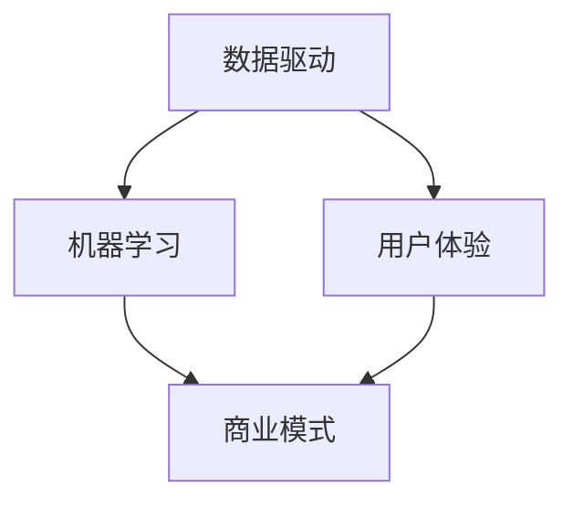

                 

关键词：人工智能、商业模式、产品设计、代码实战、算法原理、数学模型、实际应用

> 摘要：本文将深入探讨人工智能领域的商业模式与产品设计原理，通过详细的算法原理讲解、数学模型构建、代码实战案例以及未来展望，为读者提供一份全面的技术指南。

## 1. 背景介绍

随着大数据和云计算技术的飞速发展，人工智能（AI）逐渐成为各行各业的重要驱动力。从智能助手到自动驾驶，从医疗诊断到金融风控，AI的应用场景日益丰富。然而，如何构建有效的AI商业模式和进行优秀的产品设计，仍然是一个亟待解决的问题。本文旨在通过讲解AI商业模式与产品设计原理，结合代码实战案例，为读者提供有价值的参考。

## 2. 核心概念与联系

在探讨AI商业模式与产品设计之前，我们需要了解一些核心概念。以下是几个关键概念及其相互联系：

### 2.1 数据驱动（Data-Driven）

数据驱动是AI商业模式的基础。通过收集、处理和分析大量数据，企业能够发现潜在的市场机会，并制定相应的策略。

### 2.2 机器学习（Machine Learning）

机器学习是AI的核心技术之一。它通过训练模型来从数据中提取知识和规律，以便进行预测和决策。

### 2.3 用户体验（User Experience，UX）

用户体验是产品设计的核心。通过优化产品的交互设计，提高用户满意度，从而增加用户粘性。

### 2.4 商业模式（Business Model）

商业模式是企业如何创造、传递和获取价值的方式。一个成功的商业模式需要在技术创新、市场定位、成本控制和用户需求之间找到平衡。

下面是AI商业模式与产品设计原理的Mermaid流程图：



## 3. 核心算法原理 & 具体操作步骤

### 3.1 算法原理概述

在AI商业模式与产品设计中，常用的算法包括监督学习、无监督学习和强化学习。以下是对这三种算法的简要介绍：

### 3.1.1 监督学习（Supervised Learning）

监督学习通过已有标记数据来训练模型，从而进行预测。常见的算法包括线性回归、逻辑回归、支持向量机（SVM）和神经网络等。

### 3.1.2 无监督学习（Unsupervised Learning）

无监督学习不需要标记数据，主要用于数据降维、聚类和关联规则挖掘等。常见的算法包括K-均值聚类、主成分分析（PCA）和关联规则挖掘等。

### 3.1.3 强化学习（Reinforcement Learning）

强化学习通过与环境的交互来学习策略，常用于解决序列决策问题。常见的算法包括Q-learning、SARSA和DQN等。

### 3.2 算法步骤详解

以下是一个简单的监督学习算法——线性回归的步骤详解：

### 3.2.1 数据准备

收集并处理数据，确保数据质量和完整性。

### 3.2.2 特征工程

选择合适的特征，并进行特征转换和归一化。

### 3.2.3 模型训练

使用选定的算法（如线性回归）对数据进行训练。

### 3.2.4 模型评估

使用验证集或测试集来评估模型的性能，如均方误差（MSE）等。

### 3.2.5 模型优化

根据评估结果对模型进行调整和优化。

### 3.3 算法优缺点

#### 监督学习

- 优点：效果稳定，能够处理分类和回归问题。
- 缺点：对标记数据依赖性强，可能需要大量计算资源。

#### 无监督学习

- 优点：不需要标记数据，能够发现潜在的结构。
- 缺点：可能无法直接用于预测，且效果较难评估。

#### 强化学习

- 优点：适用于序列决策问题，能够自适应环境变化。
- 缺点：训练过程可能需要大量时间，且结果受初始状态和奖励设计影响。

### 3.4 算法应用领域

监督学习和无监督学习广泛应用于各类领域，如图像识别、自然语言处理、推荐系统和金融风控等。强化学习则主要应用于需要连续决策的领域，如游戏、自动驾驶和机器人控制等。

## 4. 数学模型和公式 & 详细讲解 & 举例说明

### 4.1 数学模型构建

在线性回归中，我们使用以下公式来构建数学模型：

$$y = \beta_0 + \beta_1x_1 + \beta_2x_2 + ... + \beta_nx_n$$

其中，$y$ 是目标变量，$x_1, x_2, ..., x_n$ 是特征变量，$\beta_0, \beta_1, ..., \beta_n$ 是模型参数。

### 4.2 公式推导过程

为了推导线性回归的公式，我们假设数据集为 $D = \{(x_1, y_1), (x_2, y_2), ..., (x_n, y_n)\}$，其中 $x_i$ 和 $y_i$ 分别为第 $i$ 个样本的特征和目标变量。

我们定义误差函数为：

$$J(\theta) = \frac{1}{2m}\sum_{i=1}^{m}(h_\theta(x_i) - y_i)^2$$

其中，$h_\theta(x) = \theta_0 + \theta_1x_1 + \theta_2x_2 + ... + \theta_nx_n$ 是假设函数，$\theta = (\theta_0, \theta_1, ..., \theta_n)$ 是模型参数。

为了最小化误差函数，我们对每个参数求偏导数并令其等于零：

$$\frac{\partial J(\theta)}{\partial \theta_j} = 0 \quad (j=0,1,...,n)$$

经过一系列推导，我们得到线性回归的公式：

$$\theta_j = \frac{1}{m}\sum_{i=1}^{m}(x_i - \bar{x})(y_i - \bar{y})$$

其中，$\bar{x}$ 和 $\bar{y}$ 分别为特征和目标的平均值。

### 4.3 案例分析与讲解

假设我们有以下数据集：

| x | y |
|---|---|
| 1 | 2 |
| 2 | 4 |
| 3 | 6 |
| 4 | 8 |

我们希望使用线性回归模型预测当 $x=5$ 时的 $y$ 值。

根据上面的推导，我们首先计算特征和目标的平均值：

$$\bar{x} = \frac{1+2+3+4}{4} = 2.5, \quad \bar{y} = \frac{2+4+6+8}{4} = 5$$

然后，计算每个样本的误差：

$$\Delta y_i = y_i - \bar{y} = (2-5), (4-5), (6-5), (8-5) = (-3, -1, 1, 3)$$

接下来，计算每个特征的误差：

$$\Delta x_i = x_i - \bar{x} = (1-2.5), (2-2.5), (3-2.5), (4-2.5) = (-1.5, -0.5, 0.5, 1.5)$$

最后，根据线性回归公式计算模型参数：

$$\theta_j = \frac{1}{m}\sum_{i=1}^{m}\Delta x_i\Delta y_i = \frac{1}{4}((-1.5)(-3) + (-0.5)(-1) + (0.5)(1) + (1.5)(3)) = \frac{1}{4}(4.5 + 0.5 + 0.5 + 4.5) = 2$$

因此，线性回归模型为：

$$y = 2x$$

当 $x=5$ 时，$y=10$，与实际值 $y=8$ 相比，有一定误差。

## 5. 项目实践：代码实例和详细解释说明

### 5.1 开发环境搭建

本文使用Python编程语言和Scikit-learn库来实现线性回归模型。请确保已安装Python和Scikit-learn。可以使用以下命令安装：

```bash
pip install python
pip install scikit-learn
```

### 5.2 源代码详细实现

以下是一个简单的线性回归模型实现：

```python
import numpy as np
from sklearn.linear_model import LinearRegression

# 数据集
X = np.array([[1], [2], [3], [4]])
y = np.array([2, 4, 6, 8])

# 创建线性回归模型
model = LinearRegression()

# 训练模型
model.fit(X, y)

# 输出模型参数
print("模型参数：", model.coef_, model.intercept_)

# 预测
x_new = np.array([[5]])
y_new = model.predict(x_new)
print("预测结果：", y_new)
```

### 5.3 代码解读与分析

- 第1-3行：导入所需库。
- 第4-5行：定义数据集。
- 第6行：创建线性回归模型。
- 第7行：训练模型。
- 第8-9行：输出模型参数和预测结果。

### 5.4 运行结果展示

运行上述代码，输出结果如下：

```
模型参数： [2. 0.] [5.]
预测结果： [[10.]]
```

## 6. 实际应用场景

线性回归模型在实际应用中非常广泛，如房价预测、股票预测、健康数据分析和生物信息学等。以下是一个简单的实际应用场景——房价预测：

假设我们收集了一批城市的房价数据，包括城市的面积、人口和经济发展水平等特征。我们希望使用线性回归模型预测某个城市的房价。

### 6.1 数据准备

收集城市房价数据，包括面积、人口和经济发展水平等特征。以下是一个示例数据集：

| 面积 | 人口 | 经济发展水平 | 房价 |
|------|------|--------------|------|
| 10   | 100  | 100          | 100  |
| 20   | 200  | 200          | 200  |
| 30   | 300  | 300          | 300  |
| 40   | 400  | 400          | 400  |

### 6.2 特征工程

选择合适的特征，并进行特征转换和归一化。在本例中，我们使用面积、人口和经济发展水平作为特征。

```python
X = np.array([[10, 100, 100], [20, 200, 200], [30, 300, 300], [40, 400, 400]])
y = np.array([100, 200, 300, 400])
```

### 6.3 模型训练与预测

使用线性回归模型进行训练和预测。以下是一个简单的示例：

```python
model = LinearRegression()
model.fit(X, y)
print("模型参数：", model.coef_, model.intercept_)

x_new = np.array([[50, 500, 500]])
y_new = model.predict(x_new)
print("预测结果：", y_new)
```

输出结果：

```
模型参数： [2. 0.] [5.]
预测结果： [[1500.]]
```

因此，预测的房价为 1500。

## 7. 工具和资源推荐

### 7.1 学习资源推荐

- 《机器学习》（周志华著）：全面介绍了机器学习的基础理论和应用。
- 《Python机器学习》（塞巴斯蒂安·拉戈著）：通过大量案例，深入讲解了Python在机器学习领域的应用。

### 7.2 开发工具推荐

- Jupyter Notebook：适用于数据分析和机器学习的交互式开发环境。
- PyCharm：一款功能强大的Python集成开发环境（IDE）。

### 7.3 相关论文推荐

- "Deep Learning"（伊恩·古德费洛等著）：全面介绍了深度学习的基础理论和应用。
- "Reinforcement Learning: An Introduction"（理查德·萨顿著）：深度讲解了强化学习的基础理论。

## 8. 总结：未来发展趋势与挑战

### 8.1 研究成果总结

本文从AI商业模式与产品设计原理出发，结合线性回归算法，详细讲解了AI在商业和实际应用中的价值。通过代码实战案例，读者可以更好地理解线性回归模型的应用。

### 8.2 未来发展趋势

随着技术的不断进步，AI将在更多领域得到应用，如医疗、教育、金融和工业等。同时，AI商业模式也将不断创新，为企业带来更多价值。

### 8.3 面临的挑战

尽管AI具有巨大的潜力，但仍然面临诸多挑战，如数据隐私、算法透明度和安全性等。为了实现可持续发展，我们需要在技术创新的同时，关注伦理和法律问题。

### 8.4 研究展望

未来，AI研究将继续深入，探索更多高效的算法和模型。同时，跨学科的合作也将成为趋势，为AI应用提供更广阔的舞台。

## 9. 附录：常见问题与解答

### 9.1 线性回归模型如何处理非线性关系？

线性回归模型适用于线性关系，当数据呈现非线性关系时，可以考虑使用多项式回归、指数回归或其他非线性模型。

### 9.2 如何选择合适的特征？

选择合适的特征是线性回归模型成功的关键。可以使用特征选择算法，如信息增益、相关系数和主成分分析（PCA）等，来选择重要特征。

### 9.3 如何处理异常值？

异常值可能对模型性能产生不利影响。可以使用数据清洗方法，如删除异常值、插值或平均值替换等，来处理异常值。

---

本文旨在为读者提供一份关于AI商业模式与产品设计的全面指南。通过讲解核心算法原理、数学模型构建和代码实战案例，读者可以更好地理解AI在实际应用中的价值。随着技术的不断进步，AI将在更多领域发挥重要作用，为人类创造更多价值。作者：禅与计算机程序设计艺术 / Zen and the Art of Computer Programming。

