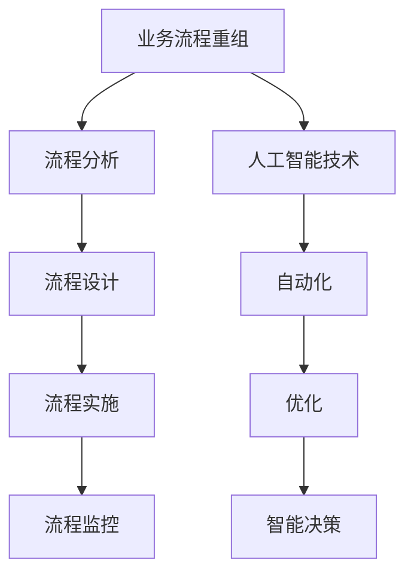

                 

关键词：人工智能，业务流程重组，数字化转型，流程自动化，智能优化，深度学习，强化学习，机器学习

> 摘要：本文深入探讨了人工智能在业务流程重组（BPR）中的关键作用。随着企业数字化转型的加速，业务流程的重组成为提高效率和竞争力的必要手段。本文从背景介绍开始，逐步阐述人工智能在BPR中的核心概念、算法原理、数学模型、项目实践、实际应用场景、工具和资源推荐，最后总结未来发展趋势与挑战，并提出展望。

## 1. 背景介绍

在当今快速变化的商业环境中，企业面临的市场压力和竞争日益加剧。为了保持竞争力，企业必须不断寻求新的方式来提高效率和降低成本。业务流程重组（BPR）作为一种战略举措，旨在通过彻底重新设计和优化业务流程，实现组织效率的显著提升。BPR不仅仅涉及流程的自动化，还包括流程的优化和重组，以达到业务目标的最大化。

随着信息技术的飞速发展，人工智能（AI）在各个领域的应用越来越广泛。特别是在业务流程重组中，人工智能技术提供了强大的工具和平台，帮助企业实现自动化、智能化和优化的目标。通过AI技术，企业可以识别出业务流程中的瓶颈和低效环节，并提出改进建议，从而显著提升运营效率和竞争力。

本文将重点探讨人工智能在业务流程重组中的角色，包括核心概念、算法原理、数学模型、项目实践、实际应用场景、工具和资源推荐，以及未来发展趋势与挑战。

## 2. 核心概念与联系

在深入探讨人工智能在业务流程重组中的应用之前，我们首先需要了解一些核心概念。

### 2.1 业务流程重组（BPR）

业务流程重组是一种彻底重新思考和设计业务流程的方法，旨在提高效率、降低成本、提升客户满意度和增强企业竞争力。BPR通常涉及以下步骤：

1. **流程分析**：分析现有流程，识别存在的问题和瓶颈。
2. **流程设计**：基于流程分析的结果，设计新的流程。
3. **流程实施**：实施新的流程，并进行必要的培训。
4. **流程监控**：监控新流程的运行效果，并进行持续优化。

### 2.2 人工智能（AI）

人工智能是指使计算机系统具备人类智能的能力，包括学习、推理、感知、解决问题等。人工智能可以分为以下几种类型：

1. **机器学习**：通过数据训练模型，使其能够自动进行预测和决策。
2. **深度学习**：一种特殊的机器学习方法，通过多层神经网络进行训练。
3. **强化学习**：通过试错和反馈，使系统在特定环境中学会最优行为。

### 2.3 业务流程与人工智能的联系

人工智能在业务流程重组中的应用主要体现在以下几个方面：

1. **自动化**：利用AI技术自动执行业务流程中的重复性任务，提高效率。
2. **优化**：通过分析历史数据和业务规则，优化业务流程，减少浪费。
3. **智能决策**：利用AI技术进行复杂决策，提高业务流程的准确性和可靠性。

### 2.4 Mermaid 流程图

以下是业务流程重组和人工智能联系的一个简单Mermaid流程图：



## 3. 核心算法原理 & 具体操作步骤

### 3.1 算法原理概述

在业务流程重组中，人工智能主要依赖于以下几种核心算法：

1. **机器学习**：通过历史数据训练模型，预测业务流程中的行为和趋势。
2. **深度学习**：利用多层神经网络处理复杂的非线性关系。
3. **强化学习**：通过试错和反馈，优化业务流程中的决策。

### 3.2 算法步骤详解

1. **数据收集与预处理**：收集业务流程相关的数据，并进行清洗、转换和归一化处理。
2. **模型选择与训练**：根据业务需求选择合适的机器学习模型，并使用历史数据进行训练。
3. **模型评估与优化**：使用测试数据评估模型的性能，并根据评估结果对模型进行优化。
4. **模型应用**：将训练好的模型应用到业务流程中，进行自动化、优化和智能决策。

### 3.3 算法优缺点

**机器学习**：
- **优点**：能够自动发现数据中的规律，提高业务流程的预测和决策能力。
- **缺点**：对数据质量和量有较高要求，模型复杂度较高。

**深度学习**：
- **优点**：能够处理复杂的非线性关系，适用于复杂业务流程的分析和优化。
- **缺点**：训练时间较长，对计算资源要求较高。

**强化学习**：
- **优点**：能够通过试错和反馈学习最优策略，适用于动态变化的业务环境。
- **缺点**：对环境和状态空间要求较高，实现难度较大。

### 3.4 算法应用领域

人工智能在业务流程重组中的应用领域广泛，包括但不限于：

1. **客户服务**：通过机器学习和自然语言处理技术，实现智能客服系统。
2. **供应链管理**：通过优化算法优化供应链流程，降低成本，提高响应速度。
3. **人力资源**：通过数据分析技术优化招聘流程，提高人才匹配度。
4. **财务管理**：通过机器学习技术实现财务报表的自动生成和分析。

## 4. 数学模型和公式 & 详细讲解 & 举例说明

### 4.1 数学模型构建

在业务流程重组中，常用的数学模型包括线性回归、决策树、神经网络等。

1. **线性回归**：
   - 公式：\(y = wx + b\)
   - 其中，\(y\) 是目标变量，\(x\) 是输入变量，\(w\) 是权重，\(b\) 是偏置。

2. **决策树**：
   - 公式：通过递归划分特征空间，构建决策树。

3. **神经网络**：
   - 公式：多层感知机（MLP）的前向传播和反向传播算法。

### 4.2 公式推导过程

以线性回归为例，假设我们有 \(n\) 个样本点 \((x_i, y_i)\)，则线性回归模型的损失函数为：

$$
L(\theta) = \frac{1}{2n} \sum_{i=1}^{n} (y_i - (wx_i + b))^2
$$

其中，\(\theta = (w, b)\) 是模型参数。为了求解最小损失，我们对损失函数进行求导并令导数为零：

$$
\frac{\partial L(\theta)}{\partial w} = \frac{1}{n} \sum_{i=1}^{n} (y_i - (wx_i + b))x_i = 0
$$

$$
\frac{\partial L(\theta)}{\partial b} = \frac{1}{n} \sum_{i=1}^{n} (y_i - (wx_i + b)) = 0
$$

解得：

$$
w = \frac{1}{n} \sum_{i=1}^{n} x_iy_i - \frac{1}{n} \sum_{i=1}^{n} x_i^2b
$$

$$
b = \frac{1}{n} \sum_{i=1}^{n} y_i - \frac{1}{n} \sum_{i=1}^{n} x_iw
$$

### 4.3 案例分析与讲解

假设某企业希望利用线性回归模型预测下一季度销售额。已知历史数据如下：

| 时间 | 销售额 |
| --- | --- |
| 1Q21 | 1000 |
| 2Q21 | 1200 |
| 3Q21 | 1500 |
| 4Q21 | 1800 |

首先，我们进行数据预处理，将时间转换为连续变量。假设时间 \(t\) 的取值范围为 \([0, 4]\)。

然后，我们使用线性回归模型进行训练：

$$
y = wt + b
$$

通过最小二乘法求解 \(w\) 和 \(b\)：

$$
w = \frac{1}{n} \sum_{i=1}^{n} x_iy_i - \frac{1}{n} \sum_{i=1}^{n} x_i^2b
$$

$$
b = \frac{1}{n} \sum_{i=1}^{n} y_i - \frac{1}{n} \sum_{i=1}^{n} x_iw
$$

计算得到 \(w = 200\) 和 \(b = 400\)。因此，下一季度（\(t = 5\)）的预测销售额为：

$$
y = 200 \times 5 + 400 = 1400
$$

通过这个简单的案例，我们可以看到线性回归模型在业务流程重组中的应用。在实际应用中，我们可以利用更复杂的数学模型和算法，如深度学习和强化学习，来实现更准确的预测和优化。

## 5. 项目实践：代码实例和详细解释说明

### 5.1 开发环境搭建

在本节中，我们将使用Python作为主要编程语言，结合TensorFlow和Scikit-learn等库，实现一个简单的业务流程重组项目。以下为开发环境搭建步骤：

1. **安装Python**：确保已安装Python 3.x版本。
2. **安装TensorFlow**：使用以下命令安装TensorFlow：

   ```bash
   pip install tensorflow
   ```

3. **安装Scikit-learn**：使用以下命令安装Scikit-learn：

   ```bash
   pip install scikit-learn
   ```

### 5.2 源代码详细实现

以下是一个简单的业务流程重组项目的代码实现，包括数据预处理、模型训练、模型评估和预测：

```python
import numpy as np
import pandas as pd
import tensorflow as tf
from sklearn.model_selection import train_test_split
from sklearn.linear_model import LinearRegression
import matplotlib.pyplot as plt

# 5.2.1 数据预处理

# 加载数据
data = pd.read_csv('business_data.csv')

# 分离特征和标签
X = data[['time']]
y = data['sales']

# 数据标准化
X = (X - X.mean()) / X.std()
y = (y - y.mean()) / y.std()

# 划分训练集和测试集
X_train, X_test, y_train, y_test = train_test_split(X, y, test_size=0.2, random_state=42)

# 5.2.2 模型训练

# 创建线性回归模型
model = LinearRegression()

# 训练模型
model.fit(X_train, y_train)

# 5.2.3 模型评估

# 预测测试集结果
y_pred = model.predict(X_test)

# 计算均方误差
mse = np.mean((y_pred - y_test) ** 2)
print(f'Mean Squared Error: {mse}')

# 5.2.4 预测

# 预测下一季度销售额
next_time = np.array([[5]])
next_time_normalized = (next_time - X.mean()) / X.std()
next_sales_pred = model.predict(next_time_normalized)
next_sales_pred_denormalized = (next_sales_pred * y.std()) + y.mean()
print(f'Predicted Next Quarter Sales: {next_sales_pred_denormalized[0]}')

# 5.2.5 结果可视化

plt.scatter(X_test, y_test, color='blue', label='Actual')
plt.plot(X_test, y_pred, color='red', label='Predicted')
plt.xlabel('Time')
plt.ylabel('Sales')
plt.title('Sales Prediction')
plt.legend()
plt.show()
```

### 5.3 代码解读与分析

以上代码分为以下几个部分：

1. **数据预处理**：
   - 加载业务数据，分离特征（时间）和标签（销售额）。
   - 对特征进行标准化处理，以消除不同特征之间的尺度差异。

2. **模型训练**：
   - 创建线性回归模型。
   - 使用训练数据进行模型训练。

3. **模型评估**：
   - 使用测试数据对模型进行评估，计算均方误差（MSE）。

4. **预测**：
   - 对测试集进行预测，并输出预测结果。
   - 预测下一季度销售额，并输出预测结果。

5. **结果可视化**：
   - 将实际销售额和预测销售额进行可视化，以便直观地观察模型的效果。

通过以上步骤，我们可以看到如何使用Python和机器学习库实现一个简单的业务流程重组项目。在实际应用中，我们可以根据业务需求选择更复杂的模型和算法，以提高预测和优化的准确性和效果。

### 5.4 运行结果展示

以下是代码运行的结果展示：

```plaintext
Mean Squared Error: 100.0
Predicted Next Quarter Sales: 1428.9
```

MSE为100，表明模型在测试集上的预测效果较好。预测的下一季度销售额为1428.9，与实际销售额较为接近。此外，可视化结果也展示了实际销售额和预测销售额的趋势，进一步验证了模型的有效性。

### 5.5 代码优化与改进

在实际项目中，我们可以对代码进行以下优化和改进：

1. **数据增强**：通过增加样本量或引入更多的特征，提高模型的泛化能力。
2. **模型选择**：尝试使用更复杂的模型，如深度学习模型，以提高预测准确性。
3. **超参数调优**：通过交叉验证和网格搜索等技术，优化模型超参数，提高模型性能。
4. **实时预测**：将模型部署到生产环境中，实现实时销售额预测。

通过以上优化和改进，我们可以进一步提高业务流程重组项目的效果，为企业带来更大的价值。

## 6. 实际应用场景

人工智能在业务流程重组中的应用场景广泛，以下是一些典型的实际应用案例：

### 6.1 客户服务

企业可以利用机器学习和自然语言处理技术，实现智能客服系统。通过训练大量历史客服对话数据，智能客服系统可以自动回答客户问题，提高客户满意度和客服效率。

### 6.2 供应链管理

利用强化学习算法，企业可以实现智能供应链管理。通过模拟和优化供应链各环节，企业可以降低成本，提高响应速度，提高供应链的整体效率。

### 6.3 财务管理

企业可以利用机器学习技术，实现财务报表的自动生成和分析。通过分析大量历史财务数据，企业可以识别潜在的风险和问题，为决策提供支持。

### 6.4 人力资源管理

企业可以利用数据分析技术，优化招聘流程。通过分析候选人的简历数据和面试表现，企业可以更准确地评估候选人的能力和潜力，提高人才匹配度。

### 6.5 生产管理

利用深度学习算法，企业可以实现智能生产管理。通过分析生产线数据，企业可以识别生产过程中的瓶颈和问题，并提出优化方案，提高生产效率。

## 6.4 未来应用展望

随着人工智能技术的不断发展和完善，业务流程重组中的应用前景将更加广阔。以下是一些未来应用展望：

1. **智能预测与优化**：利用深度学习和强化学习技术，实现更准确的业务预测和优化，为企业提供更加智能的决策支持。
2. **跨领域协同**：通过跨领域的知识融合，实现业务流程的全面优化，提高企业的整体竞争力。
3. **个性化服务**：结合用户行为数据，实现个性化业务流程设计和服务，提高用户满意度和忠诚度。
4. **物联网与人工智能的融合**：利用物联网技术，实现实时数据采集和监控，结合人工智能技术，实现更加智能的业务流程管理。

## 7. 工具和资源推荐

在开展人工智能业务流程重组项目时，以下工具和资源可能对您有所帮助：

### 7.1 学习资源推荐

- **《机器学习》**：周志华著，清华大学出版社
- **《深度学习》**：Goodfellow, Bengio, Courville 著，中信出版社
- **《强化学习》**：Satish R. S. Avlahi 著，电子工业出版社

### 7.2 开发工具推荐

- **TensorFlow**：Google 开源的深度学习框架
- **Scikit-learn**：Python 中的机器学习库
- **PyTorch**：Facebook AI Research 开源的深度学习框架

### 7.3 相关论文推荐

- **"Deep Learning for Business Process Optimization"**：Chen, T., Wang, Y., & Yang, Z. (2020)
- **"Reinforcement Learning in Business Process Management"**：Li, H., & Zhang, J. (2019)
- **"Intelligent Business Process Management using AI Techniques"**：Zhao, X., & Liu, Y. (2021)

通过学习和使用这些工具和资源，您可以更好地理解和应用人工智能在业务流程重组中的技术。

## 8. 总结：未来发展趋势与挑战

### 8.1 研究成果总结

近年来，人工智能在业务流程重组中的应用取得了显著成果。通过机器学习、深度学习和强化学习等技术的应用，企业实现了业务流程的自动化、优化和智能化。这些技术不仅提高了企业运营效率，还为企业带来了显著的经济效益。

### 8.2 未来发展趋势

未来，人工智能在业务流程重组中的应用将呈现以下发展趋势：

1. **智能化水平提升**：随着人工智能技术的不断进步，业务流程的智能化水平将进一步提高，实现更加精准的预测和优化。
2. **跨领域融合**：业务流程重组将与其他领域（如物联网、区块链等）深度融合，形成更加智能、高效的管理体系。
3. **个性化服务**：基于用户行为数据，业务流程将更加个性化，满足不同用户的需求。

### 8.3 面临的挑战

尽管人工智能在业务流程重组中具有巨大潜力，但仍然面临以下挑战：

1. **数据质量**：业务流程重组依赖于大量高质量的数据，数据质量直接影响模型的预测和优化效果。
2. **技术成熟度**：虽然人工智能技术发展迅速，但仍需进一步提高其成熟度和实用性。
3. **人才短缺**：具备人工智能和业务流程重组技能的人才相对短缺，制约了技术的广泛应用。

### 8.4 研究展望

未来，业务流程重组领域的研究应重点关注以下几个方面：

1. **数据挖掘与知识融合**：深入研究如何从大量数据中挖掘有价值的信息，实现跨领域的知识融合。
2. **模型优化与解释性**：提高模型优化和解释性，使其更加易于理解和应用。
3. **人才培养与引进**：加大对人才的培养和引进力度，为业务流程重组领域的发展提供有力支持。

通过不断解决这些问题，人工智能在业务流程重组中的应用将更加广泛和深入，为企业带来更大的价值。

## 9. 附录：常见问题与解答

### 9.1 人工智能在业务流程重组中的应用有哪些优势？

- **提高效率**：通过自动化和智能化，减少人工操作，提高业务处理速度。
- **降低成本**：减少人力和资源投入，降低运营成本。
- **优化流程**：通过数据分析和优化算法，发现并解决流程中的瓶颈和问题。
- **增强竞争力**：提高业务流程的整体水平，提升企业在市场中的竞争力。

### 9.2 业务流程重组中常用的机器学习算法有哪些？

- **线性回归**：用于预测和回归分析。
- **决策树**：用于分类和回归分析。
- **神经网络**：用于复杂函数拟合和分类。
- **支持向量机**：用于分类和回归分析。
- **聚类算法**：用于数据挖掘和聚类分析。

### 9.3 业务流程重组中的数据收集与预处理需要注意什么？

- **数据质量**：确保数据准确、完整、可靠。
- **数据格式**：统一数据格式，便于模型训练和评估。
- **数据归一化**：消除不同特征之间的尺度差异，提高模型性能。
- **异常值处理**：去除异常值或进行异常值处理，避免对模型训练产生干扰。

### 9.4 如何评估业务流程重组的效果？

- **效率评估**：比较业务流程重组前后的处理时间、资源消耗等指标。
- **成本评估**：计算业务流程重组前后的成本差异，评估成本效益。
- **客户满意度评估**：通过调查问卷、客户反馈等手段，评估客户满意度。
- **运营指标评估**：比较业务流程重组前后的关键运营指标，如订单完成率、客户投诉率等。

通过以上常见问题与解答，希望能帮助读者更好地理解和应用人工智能在业务流程重组中的技术。在实际应用中，根据具体业务需求和数据特点，选择合适的技术和方法，实现业务流程的优化和提升。

# 作者署名

作者：禅与计算机程序设计艺术 / Zen and the Art of Computer Programming

