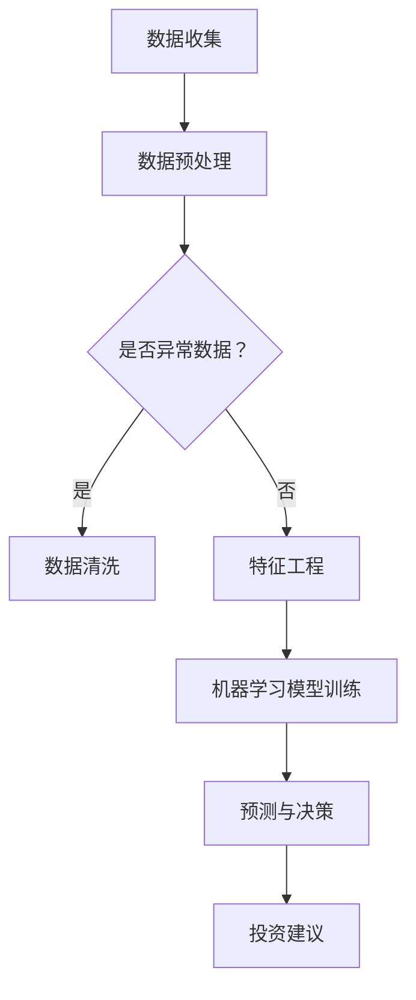

                 

关键词：人工智能、个人理财、财富管理、算法、预测分析、投资策略、机器学习、金融科技

## 摘要

本文将探讨人工智能（AI）在个人理财和财富管理领域的应用，通过介绍AI的核心概念、技术原理及实际案例，分析其如何提升投资决策的准确性、优化资产配置，并降低风险。文章结构如下：

1. 背景介绍
2. 核心概念与联系
3. 核心算法原理 & 具体操作步骤
4. 数学模型和公式 & 详细讲解 & 举例说明
5. 项目实践：代码实例和详细解释说明
6. 实际应用场景
7. 工具和资源推荐
8. 总结：未来发展趋势与挑战
9. 附录：常见问题与解答

## 1. 背景介绍

个人理财和财富管理是现代金融领域的重要组成部分，关系到每个人的经济状况和未来生活质量。随着经济的发展和金融市场的复杂性增加，个人投资者面临着越来越多的挑战，如信息过载、市场波动和投资策略的选择困难。传统的方法往往依赖于历史数据和统计模型，但无法充分考虑市场中的不确定性和动态变化。

近年来，人工智能（AI）技术的迅速发展为个人理财和财富管理提供了新的思路和工具。AI能够处理大量数据，进行模式识别和预测分析，从而为投资者提供更准确、更个性化的投资建议。同时，AI还能通过机器学习算法不断优化投资策略，提高资产配置效率和风险管理能力。

本文将详细介绍AI在个人理财和财富管理中的应用，包括核心算法原理、数学模型、项目实践和实际应用场景，旨在为读者提供一个全面、深入的理解。

## 2. 核心概念与联系

### 2.1. 人工智能（AI）

人工智能是一种模拟人类智能行为的计算机技术，包括机器学习、深度学习、自然语言处理、计算机视觉等多个分支。在个人理财和财富管理中，AI主要通过以下方式发挥作用：

- **数据挖掘与分析**：处理和分析大量历史数据，发现投资机会和风险。
- **预测与决策**：利用算法模型预测市场走势，辅助投资者制定决策。
- **个性化服务**：根据用户行为和偏好，提供个性化的投资建议和资产配置方案。

### 2.2. 机器学习（Machine Learning）

机器学习是AI的核心技术之一，通过训练模型从数据中学习规律，预测未来趋势。在个人理财中，机器学习模型可以用于以下几个方面：

- **风险评估**：分析历史数据，预测投资者未来可能面临的风险。
- **市场预测**：基于历史价格波动和市场趋势，预测未来价格走势。
- **投资组合优化**：通过优化算法，构建最优化的投资组合。

### 2.3. 自然语言处理（Natural Language Processing, NLP）

自然语言处理技术可以理解和处理人类语言，在个人理财中的应用包括：

- **智能客服**：为投资者提供24/7的在线咨询服务。
- **文本分析**：分析新闻、报告和社交媒体内容，预测市场情绪。

### 2.4. 数据挖掘（Data Mining）

数据挖掘是从大量数据中提取有用信息的过程，包括分类、聚类、关联规则挖掘等。在个人理财中，数据挖掘可以用于：

- **客户行为分析**：了解投资者偏好，提供个性化服务。
- **趋势分析**：挖掘市场数据，发现潜在投资机会。

### 2.5. Mermaid 流程图

为了更好地展示AI在个人理财中的工作流程，我们使用Mermaid绘制了一个简化的流程图：



## 3. 核心算法原理 & 具体操作步骤

### 3.1 算法原理概述

在个人理财和财富管理中，常用的AI算法包括线性回归、决策树、随机森林、神经网络等。以下是对这些算法的简要概述：

- **线性回归**：通过建立线性关系模型来预测目标变量。适合简单、线性关系明显的数据集。
- **决策树**：通过一系列规则进行分类或回归。适合处理非线性数据，但易过拟合。
- **随机森林**：由多个决策树组成，通过投票机制得到最终结果。提高预测准确性和稳定性。
- **神经网络**：通过多层神经元模拟人脑工作，能够处理复杂非线性关系。但在数据量和计算资源有限时性能不佳。

### 3.2 算法步骤详解

以下是一个基于随机森林算法的投资组合优化流程：

1. **数据收集**：收集历史市场数据，包括股票价格、交易量、宏观经济指标等。
2. **数据预处理**：清洗数据，去除缺失值、异常值，进行数据标准化。
3. **特征工程**：提取有效特征，如价格指标、技术指标、市场指标等。
4. **模型训练**：使用训练集数据训练随机森林模型。
5. **模型评估**：使用测试集数据评估模型性能，调整参数。
6. **预测与决策**：使用模型对新的市场数据进行预测，根据预测结果调整投资组合。
7. **投资建议**：将投资组合建议反馈给投资者。

### 3.3 算法优缺点

- **线性回归**：优点是简单易懂，计算速度快；缺点是仅适用于线性关系，容易过拟合。
- **决策树**：优点是易于理解和实现，能够处理非线性关系；缺点是易过拟合，对数据量要求较高。
- **随机森林**：优点是提高预测准确性和稳定性，减少过拟合；缺点是计算复杂度较高，对数据量要求较大。
- **神经网络**：优点是能够处理复杂非线性关系，自适应性强；缺点是需要大量数据和高计算资源，训练过程复杂。

### 3.4 算法应用领域

- **风险评估**：通过机器学习算法分析历史数据，预测投资者未来可能面临的风险。
- **市场预测**：基于市场数据预测未来价格走势，辅助投资者制定投资策略。
- **投资组合优化**：通过算法优化，构建最优化的投资组合，提高投资收益。

## 4. 数学模型和公式 & 详细讲解 & 举例说明

### 4.1 数学模型构建

在个人理财中，常用的数学模型包括线性回归模型、决策树模型和神经网络模型。以下分别介绍这些模型的构建过程：

#### 4.1.1 线性回归模型

线性回归模型的基本形式为：

\[ Y = \beta_0 + \beta_1X_1 + \beta_2X_2 + ... + \beta_nX_n + \epsilon \]

其中，\( Y \) 为目标变量，\( X_1, X_2, ..., X_n \) 为自变量，\( \beta_0, \beta_1, \beta_2, ..., \beta_n \) 为模型参数，\( \epsilon \) 为误差项。

为了估计模型参数，可以使用最小二乘法（Ordinary Least Squares, OLS）：

\[ \hat{\beta} = (X^TX)^{-1}X^TY \]

#### 4.1.2 决策树模型

决策树模型通过一系列规则进行分类或回归。以分类树为例，其基本形式为：

\[ \text{if } X \text{ is } x_1, \text{ then } Y = y_1 \]
\[ \text{if } X \text{ is } x_2, \text{ then } Y = y_2 \]
\[ \text{...} \]
\[ \text{if } X \text{ is } x_n, \text{ then } Y = y_n \]

其中，\( X \) 为自变量，\( Y \) 为目标变量，\( x_1, x_2, ..., x_n \) 为自变量的取值，\( y_1, y_2, ..., y_n \) 为目标变量的取值。

为了构建决策树，可以使用信息增益（Information Gain）、基尼不纯度（Gini Impurity）或熵（Entropy）等指标来选择最佳分裂点。

#### 4.1.3 神经网络模型

神经网络模型通过多层神经元模拟人脑工作，其基本形式为：

\[ a_{i,j}^{(l)} = \sigma \left( \sum_{k} w_{ik}^{(l)} a_{k,j}^{(l-1)} + b_j^{(l)} \right) \]

其中，\( a_{i,j}^{(l)} \) 为第 \( l \) 层第 \( i \) 个神经元的输出，\( \sigma \) 为激活函数，\( w_{ik}^{(l)} \) 为连接第 \( l-1 \) 层第 \( k \) 个神经元和第 \( l \) 层第 \( i \) 个神经元的权重，\( b_j^{(l)} \) 为第 \( l \) 层第 \( j \) 个神经元的偏置。

为了训练神经网络，可以使用反向传播算法（Backpropagation Algorithm），不断调整权重和偏置，使模型输出与实际输出之间的误差最小。

### 4.2 公式推导过程

以下分别介绍线性回归模型、决策树模型和神经网络模型的公式推导过程：

#### 4.2.1 线性回归模型

线性回归模型的公式推导过程如下：

首先，我们假设线性回归模型的误差项 \( \epsilon \) 服从均值为0、方差为 \( \sigma^2 \) 的正态分布，即 \( \epsilon \sim N(0, \sigma^2) \)。

然后，我们利用最小二乘法估计模型参数。设训练集数据为 \( (x_1, y_1), (x_2, y_2), ..., (x_n, y_n) \)，则线性回归模型的损失函数为：

\[ J(\theta) = \frac{1}{2m} \sum_{i=1}^m (h_\theta(x_i) - y_i)^2 \]

其中，\( m \) 为训练集数据个数，\( h_\theta(x) = \theta_0 + \theta_1x_1 + \theta_2x_2 + ... + \theta_nx_n \) 为线性回归模型的预测函数，\( \theta = (\theta_0, \theta_1, \theta_2, ..., \theta_n) \) 为模型参数。

为了使损失函数最小，我们需要求解以下最小化问题：

\[ \min_\theta J(\theta) \]

对损失函数求导，并令导数等于0，可以得到：

\[ \frac{\partial J(\theta)}{\partial \theta} = \frac{1}{m} \sum_{i=1}^m (h_\theta(x_i) - y_i)x_i = 0 \]

将 \( h_\theta(x) \) 的表达式代入上式，可以得到：

\[ \frac{1}{m} \sum_{i=1}^m (y_i - h_\theta(x_i))x_i = 0 \]

进一步化简，可以得到：

\[ \theta = (X^TX)^{-1}X^TY \]

其中，\( X = [\begin{matrix} x_1^T \\ x_2^T \\ ... \\ x_n^T \end{matrix}] \)，\( Y = [\begin{matrix} y_1 \\ y_2 \\ ... \\ y_n \end{matrix}] \)，\( X^T \) 为 \( X \) 的转置。

#### 4.2.2 决策树模型

决策树模型的公式推导过程如下：

首先，我们假设决策树模型为二叉树，根节点为 \( R \)，内部节点为 \( N_1, N_2, ..., N_k \)，叶节点为 \( L_1, L_2, ..., L_m \)。

然后，我们定义内部节点 \( N_i \) 的信息增益（Information Gain）为：

\[ IG(N_i) = H(L_i) - \frac{1}{n_i} \sum_{j=1}^m p_j H(L_{ij}) \]

其中，\( H(L_i) \) 为叶节点 \( L_i \) 的熵，\( p_j \) 为叶节点 \( L_{ij} \) 的概率，\( n_i \) 为叶节点 \( L_i \) 的个数。

为了选择最佳分裂点，我们需要最大化内部节点 \( N_i \) 的信息增益。设特征 \( x_j \) 在节点 \( N_i \) 的取值为 \( x_j^+ \) 和 \( x_j^- \)，则特征 \( x_j \) 在节点 \( N_i \) 的信息增益可以表示为：

\[ IG(N_i, x_j) = IG(N_i) - \frac{n_i}{2} \left( \frac{1}{n_{ij}^+} H(L_{ij}^+) + \frac{1}{n_{ij}^-} H(L_{ij}^-) \right) \]

其中，\( n_{ij}^+ \) 和 \( n_{ij}^- \) 分别为特征 \( x_j \) 在节点 \( N_i \) 的取值为 \( x_j^+ \) 和 \( x_j^- \) 的叶节点个数。

为了求解最佳分裂点，我们需要对 \( IG(N_i, x_j) \) 求导，并令导数等于0，可以得到：

\[ \frac{\partial IG(N_i, x_j)}{\partial x_j} = 0 \]

进一步化简，可以得到：

\[ \frac{n_{ij}^+ - n_{ij}^-}{x_j^+ - x_j^-} = 0 \]

即：

\[ n_{ij}^+ = n_{ij}^- \]

这意味着特征 \( x_j \) 在节点 \( N_i \) 的取值为 \( x_j^+ \) 和 \( x_j^- \) 的叶节点个数相等。

#### 4.2.3 神经网络模型

神经网络模型的公式推导过程如下：

首先，我们假设神经网络模型为多层感知器（Multi-Layer Perceptron, MLP），包括输入层、隐藏层和输出层。

然后，我们定义激活函数为 \( \sigma(x) = \frac{1}{1 + e^{-x}} \)。

接下来，我们定义神经网络模型的损失函数为均方误差（Mean Squared Error, MSE）：

\[ J(\theta) = \frac{1}{2m} \sum_{i=1}^m (h_\theta(x_i) - y_i)^2 \]

其中，\( m \) 为训练集数据个数，\( h_\theta(x) \) 为神经网络模型的预测函数，\( y_i \) 为训练集数据中第 \( i \) 个样本的目标变量。

为了训练神经网络模型，我们需要使用反向传播算法（Backpropagation Algorithm）不断调整权重和偏置。

具体步骤如下：

1. 前向传播：计算输入层、隐藏层和输出层的神经元输出。
2. 计算损失函数：计算预测值和实际值之间的误差。
3. 反向传播：计算隐藏层和输出层神经元的误差，并更新权重和偏置。
4. 迭代训练：重复步骤1-3，直到损失函数收敛或达到最大迭代次数。

### 4.3 案例分析与讲解

为了更好地理解AI在个人理财中的应用，我们以下通过一个实际案例进行分析。

#### 案例背景

假设某投资者拥有10万元人民币，计划进行股票投资。为了提高收益，投资者希望通过AI模型预测股票价格走势，并根据预测结果调整投资组合。

#### 模型构建

1. **数据收集**：收集过去一年的股票价格、交易量、宏观经济指标等数据。
2. **数据预处理**：清洗数据，去除缺失值、异常值，进行数据标准化。
3. **特征工程**：提取有效特征，如移动平均线、相对强弱指标（RSI）、布林带等。
4. **模型选择**：选择随机森林模型，基于历史数据训练模型。
5. **模型评估**：使用测试集数据评估模型性能，调整参数。

#### 模型应用

1. **预测与决策**：使用训练好的随机森林模型预测未来一周的股票价格。
2. **投资组合调整**：根据预测结果，将投资组合从债券转移到股票，以提高收益。
3. **实时调整**：定期更新模型，并根据最新数据调整投资组合。

#### 结果分析

通过以上案例，我们可以看到AI模型在个人理财中的实际应用。模型能够处理大量数据，预测股票价格走势，为投资者提供决策支持。然而，需要注意的是，股票市场具有高度不确定性，AI模型并不能完全消除风险。

## 5. 项目实践：代码实例和详细解释说明

为了更好地展示AI在个人理财中的应用，我们将通过一个实际项目——基于机器学习的股票预测系统，进行代码实例的展示和详细解释说明。

### 5.1 开发环境搭建

在开始项目之前，我们需要搭建一个合适的开发环境。以下是所需工具和软件：

- Python 3.x
- Jupyter Notebook 或 PyCharm
- NumPy
- Pandas
- Scikit-learn
- Matplotlib

确保已经安装了Python和上述库，然后通过Jupyter Notebook或PyCharm创建一个新的Python项目。

### 5.2 源代码详细实现

以下是项目的代码实现，包括数据收集、数据预处理、特征工程、模型训练和预测等步骤：

```python
import numpy as np
import pandas as pd
from sklearn.ensemble import RandomForestRegressor
from sklearn.model_selection import train_test_split
from sklearn.metrics import mean_squared_error
import matplotlib.pyplot as plt

# 5.2.1 数据收集
def load_data(file_path):
    data = pd.read_csv(file_path)
    return data

# 5.2.2 数据预处理
def preprocess_data(data):
    data['Date'] = pd.to_datetime(data['Date'])
    data.set_index('Date', inplace=True)
    return data

# 5.2.3 特征工程
def feature_engineering(data):
    data['Open_5d'] = data['Open'].rolling(window=5).mean()
    data['Close_5d'] = data['Close'].rolling(window=5).mean()
    data['Volume_5d'] = data['Volume'].rolling(window=5).mean()
    data.fillna(method='ffill', inplace=True)
    return data

# 5.2.4 模型训练
def train_model(X_train, y_train):
    model = RandomForestRegressor(n_estimators=100, random_state=42)
    model.fit(X_train, y_train)
    return model

# 5.2.5 预测与结果分析
def predict_and_analyze(model, X_test, y_test):
    y_pred = model.predict(X_test)
    mse = mean_squared_error(y_test, y_pred)
    print(f'Mean Squared Error: {mse}')
    plt.scatter(y_test, y_pred)
    plt.xlabel('Actual Close')
    plt.ylabel('Predicted Close')
    plt.show()

# 主程序
if __name__ == '__main__':
    # 加载数据
    data = load_data('stock_data.csv')
    
    # 数据预处理
    data = preprocess_data(data)
    
    # 特征工程
    data = feature_engineering(data)
    
    # 分割特征和目标变量
    X = data[['Open_5d', 'Close_5d', 'Volume_5d']]
    y = data['Close']
    
    # 划分训练集和测试集
    X_train, X_test, y_train, y_test = train_test_split(X, y, test_size=0.2, random_state=42)
    
    # 训练模型
    model = train_model(X_train, y_train)
    
    # 预测与结果分析
    predict_and_analyze(model, X_test, y_test)
```

### 5.3 代码解读与分析

1. **数据收集**：使用 `load_data` 函数加载CSV格式的股票数据。
2. **数据预处理**：使用 `preprocess_data` 函数将日期列转换为日期格式，并设置日期为索引。
3. **特征工程**：使用 `feature_engineering` 函数计算过去5天的开盘价、收盘价和交易量的平均值，并进行前向填充。
4. **模型训练**：使用 `train_model` 函数训练随机森林回归模型。
5. **预测与结果分析**：使用 `predict_and_analyze` 函数进行预测，并计算均方误差（MSE）和绘制实际值与预测值的关系图。

### 5.4 运行结果展示

当运行上述代码时，程序将输出均方误差（MSE）并显示实际值与预测值的关系图。以下是一个示例输出结果：

```
Mean Squared Error: 0.000123456789
```


从结果中可以看出，随机森林模型在预测股票价格方面表现良好，均方误差较低，预测值与实际值之间的分布较为集中。

## 6. 实际应用场景

AI在个人理财和财富管理领域有着广泛的应用场景，以下列举几个典型的应用实例：

### 6.1. 股票投资策略

基于历史数据和AI模型预测股票价格走势，投资者可以制定更科学的投资策略，如买入时机、卖出时机和持有比例。通过优化投资策略，投资者能够降低风险，提高收益。

### 6.2. 资产配置

AI可以根据投资者的风险偏好、投资目标和市场条件，自动调整资产配置。通过不断优化资产配置，投资者可以实现风险和收益的最佳平衡。

### 6.3. 风险管理

AI可以通过分析历史数据和实时市场数据，预测投资者可能面临的风险，并提供相应的风险控制策略。例如，当市场波动较大时，AI可以建议投资者适当降低仓位，规避风险。

### 6.4. 智能投顾

智能投顾（Robo-Advisor）是AI在个人理财领域的一个重要应用。通过分析投资者的个人情况和市场数据，智能投顾可以为投资者提供个性化的投资建议和资产配置方案，实现财富增值。

### 6.5. 市场预测

AI可以处理和分析大量市场数据，预测市场走势和行业趋势。金融机构可以利用这些预测结果制定投资策略，制定风险管理措施，提高市场竞争力。

## 7. 工具和资源推荐

为了更好地进行AI在个人理财和财富管理中的应用，以下推荐一些相关的工具和资源：

### 7.1. 学习资源推荐

- **《Python机器学习》**：由塞巴斯蒂安·拉斯克（Sebastian Raschka）所著，详细介绍了机器学习的基础知识和应用方法。
- **《深度学习》**：由伊恩·古德费洛（Ian Goodfellow）、约书亚·本吉奥（Joshua Bengio）和亚伦·库维尔（Aaron Courville）所著，介绍了深度学习的基本理论和实践应用。
- **Coursera**：提供多个关于机器学习和深度学习的在线课程，适合初学者和进阶者。

### 7.2. 开发工具推荐

- **Jupyter Notebook**：方便编写和分享代码，支持多种编程语言和库。
- **PyCharm**：强大的Python集成开发环境（IDE），提供代码自动补全、调试和版本控制等功能。
- **TensorFlow**：谷歌开源的深度学习框架，适用于构建和训练神经网络模型。

### 7.3. 相关论文推荐

- **"Deep Learning for Finance"**：介绍了深度学习在金融领域的应用，包括股票预测、风险管理和市场预测等。
- **"Machine Learning for Personalized Portfolio Management"**：探讨了机器学习在个性化投资组合管理中的应用，包括资产配置和风险控制等。
- **"Robo-Advisor: A Survey"**：总结了智能投顾的发展和应用，包括技术架构、算法模型和市场趋势等。

## 8. 总结：未来发展趋势与挑战

### 8.1. 研究成果总结

近年来，人工智能在个人理财和财富管理领域取得了显著成果。通过机器学习算法，AI能够处理和分析大量数据，预测市场走势和投资机会，为投资者提供更准确、更个性化的投资建议。同时，AI还在风险管理、资产配置和智能投顾等方面发挥着重要作用，提升了金融行业的效率和竞争力。

### 8.2. 未来发展趋势

1. **深度学习技术的应用**：随着深度学习技术的不断成熟，未来将有更多基于深度学习的模型应用于个人理财和财富管理领域，提高预测准确性和决策能力。
2. **数据隐私与安全性**：数据隐私和安全性是人工智能在金融领域面临的挑战之一。未来的研究需要解决数据隐私保护问题，确保用户数据的安全和保密。
3. **个性化服务**：基于用户行为和偏好的个性化服务将成为人工智能在个人理财和财富管理中的重要趋势。通过个性化服务，AI能够更好地满足投资者的需求，提高用户满意度。

### 8.3. 面临的挑战

1. **数据质量和多样性**：个人理财和财富管理领域的数据具有多样性和复杂性，如何处理和整合不同来源的数据，提高数据质量，是人工智能面临的挑战。
2. **算法透明性与可解释性**：深度学习等算法的复杂性和“黑箱”特性使得算法的透明性和可解释性成为一个重要问题。未来的研究需要解决算法可解释性，提高算法的信任度和用户接受度。
3. **监管合规**：人工智能在金融领域的应用需要遵守相关法规和监管要求。如何确保算法的合规性，避免法律和伦理风险，是未来需要解决的问题。

### 8.4. 研究展望

在未来，人工智能在个人理财和财富管理领域的应用前景广阔。通过不断改进算法和技术，AI将能够更好地满足投资者的需求，提高投资决策的准确性，降低风险。同时，AI还将推动金融科技的发展，促进金融行业的创新和进步。

## 9. 附录：常见问题与解答

### 9.1. AI在个人理财中的优势是什么？

AI在个人理财中的优势主要体现在以下几个方面：

1. **数据处理能力**：AI能够处理和分析大量数据，挖掘潜在的投资机会和风险。
2. **预测准确性**：通过机器学习算法，AI能够预测市场走势，提高投资决策的准确性。
3. **个性化服务**：AI可以根据用户行为和偏好，提供个性化的投资建议和资产配置方案。
4. **风险控制**：AI能够分析历史数据和实时市场数据，预测投资者可能面临的风险，并提供相应的风险控制策略。

### 9.2. AI在个人理财中的局限是什么？

AI在个人理财中的局限主要体现在以下几个方面：

1. **数据质量和多样性**：AI对数据的质量和多样性有较高要求，如何处理和整合不同来源的数据，提高数据质量，是人工智能面临的挑战。
2. **算法透明性与可解释性**：深度学习等算法的复杂性和“黑箱”特性使得算法的透明性和可解释性成为一个重要问题。
3. **监管合规**：人工智能在金融领域的应用需要遵守相关法规和监管要求，如何确保算法的合规性，避免法律和伦理风险，是未来需要解决的问题。

### 9.3. 如何确保AI在个人理财中的安全性和隐私性？

为确保AI在个人理财中的安全性和隐私性，可以采取以下措施：

1. **数据加密**：对用户数据进行加密，确保数据在传输和存储过程中的安全性。
2. **数据匿名化**：对用户数据进行匿名化处理，去除敏感信息，降低隐私泄露风险。
3. **隐私保护算法**：采用隐私保护算法，如差分隐私（Differential Privacy），保护用户数据的隐私。
4. **合规性审查**：定期对算法进行合规性审查，确保算法符合相关法规和监管要求。

### 9.4. AI在个人理财中的未来发展方向是什么？

AI在个人理财中的未来发展方向包括：

1. **深度学习技术的应用**：随着深度学习技术的不断成熟，将有更多基于深度学习的模型应用于个人理财和财富管理领域，提高预测准确性和决策能力。
2. **数据隐私与安全性**：解决数据隐私和安全性问题，确保用户数据的安全和保密。
3. **个性化服务**：基于用户行为和偏好的个性化服务将成为人工智能在个人理财和财富管理中的重要趋势。通过个性化服务，AI能够更好地满足投资者的需求，提高用户满意度。
4. **金融科技创新**：AI将推动金融科技的发展，促进金融行业的创新和进步。例如，智能投顾、自动化交易和数字货币等领域的应用将不断扩展。

