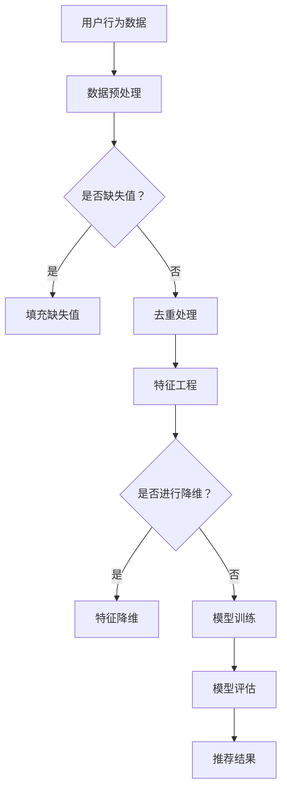

                 

关键词：个性化购物，AI技术，购物建议，推荐系统，数据挖掘

> 摘要：本文主要探讨了人工智能（AI）在个性化购物助手中的应用，特别是如何利用推荐系统提供准确的购物建议。文章首先介绍了个性化购物的背景和重要性，然后详细阐述了AI在购物建议中的核心算法原理、数学模型和实际应用案例，最后对未来发展趋势和挑战进行了展望。

## 1. 背景介绍

在互联网时代，电子商务已经成为人们生活中不可或缺的一部分。购物网站和移动应用如雨后春笋般涌现，提供了各种各样的商品和服务。然而，面对海量的商品信息，消费者常常感到不知所措，难以找到真正适合自己的产品。为了解决这个问题，个性化购物助手应运而生。

个性化购物助手通过分析用户的购物行为、兴趣和偏好，为其提供定制化的购物建议。这不仅提高了用户的购物体验，还能有效提高购物网站的销售转化率和用户满意度。随着人工智能技术的不断发展，个性化购物助手正逐渐成为电商领域的重要创新方向。

## 2. 核心概念与联系

### 2.1. 推荐系统

推荐系统是个性化购物助手的核心组件，其目的是根据用户的历史行为和偏好，预测用户可能感兴趣的商品，从而为其提供个性化的购物建议。推荐系统通常分为以下几类：

1. **协同过滤（Collaborative Filtering）**：通过分析用户之间的相似性，发现用户的共同偏好，从而进行推荐。
2. **基于内容的推荐（Content-Based Filtering）**：根据用户的历史行为和兴趣标签，推荐与之相似的商品。
3. **混合推荐（Hybrid Methods）**：结合协同过滤和基于内容的推荐方法，以提高推荐准确性。

### 2.2. 数据挖掘

数据挖掘是构建推荐系统的基础，它涉及到从大量的数据中提取有价值的信息和模式。在个性化购物场景中，数据挖掘主要用于：

1. **用户行为分析**：通过分析用户的浏览、购买和评价行为，了解用户的兴趣和偏好。
2. **商品属性挖掘**：从商品描述中提取关键属性，以便进行基于内容的推荐。
3. **用户群体细分**：根据用户的购物行为和兴趣，将用户划分为不同的群体，从而进行更精细化的推荐。

### 2.3. Mermaid 流程图

以下是推荐系统的 Mermaid 流程图：



## 3. 核心算法原理 & 具体操作步骤

### 3.1. 算法原理概述

个性化购物建议的核心算法是基于协同过滤的方法。协同过滤算法通过以下步骤进行操作：

1. **用户相似度计算**：计算用户之间的相似度，常用的相似度计算方法有欧几里得距离、皮尔逊相关系数等。
2. **物品相似度计算**：计算物品之间的相似度，常用的相似度计算方法有余弦相似度、Jaccard相似度等。
3. **预测用户兴趣**：根据用户和物品的相似度，预测用户对未知物品的兴趣程度。
4. **生成推荐列表**：根据预测的兴趣程度，为用户生成个性化的购物建议。

### 3.2. 算法步骤详解

1. **用户相似度计算**：

   用户相似度的计算公式为：

   $$sim(u, v) = \frac{\sum_{i \in R} w_{i}^u w_{i}^v}{\sqrt{\sum_{i \in R} w_{i}^2^u} \sqrt{\sum_{i \in R} w_{i}^2^v}}$$

   其中，$u$ 和 $v$ 是两个用户，$R$ 是用户共同评价过的物品集合，$w_{i}^u$ 和 $w_{i}^v$ 分别表示用户 $u$ 和 $v$ 对物品 $i$ 的评分。

2. **物品相似度计算**：

   物品相似度的计算公式为：

   $$sim(i, j) = \frac{\sum_{u \in U} w_{u}^i w_{u}^j}{\sqrt{\sum_{u \in U} w_{u}^2^i} \sqrt{\sum_{u \in U} w_{u}^2^j}}$$

   其中，$i$ 和 $j$ 是两个物品，$U$ 是评价过物品 $i$ 和 $j$ 的用户集合，$w_{u}^i$ 和 $w_{u}^j$ 分别表示用户 $u$ 对物品 $i$ 和 $j$ 的评分。

3. **预测用户兴趣**：

   预测用户对物品 $j$ 的兴趣程度，可以使用如下公式：

   $$r_{u, j}^{'} = \sum_{i \in R} sim(i, j) \cdot r_{u, i}$$

   其中，$r_{u, i}$ 是用户 $u$ 对物品 $i$ 的实际评分，$r_{u, j}^{'}$ 是预测的用户 $u$ 对物品 $j$ 的评分。

4. **生成推荐列表**：

   根据预测的兴趣程度，为用户生成个性化的购物建议。通常，可以使用 Top-N 方法，为用户推荐前 N 个预测评分最高的物品。

### 3.3. 算法优缺点

**优点**：

1. **易于实现**：协同过滤算法相对简单，易于实现和优化。
2. **效果好**：在大量用户行为数据的基础上，协同过滤算法能够提供较高的推荐准确率。
3. **可扩展性强**：协同过滤算法可以轻松扩展到不同类型的推荐场景，如电影、音乐、新闻等。

**缺点**：

1. **冷启动问题**：对于新用户或新物品，由于缺乏足够的数据，协同过滤算法难以进行准确的推荐。
2. **数据稀疏性**：在用户行为数据稀疏的情况下，协同过滤算法的性能会受到影响。
3. **实时性较差**：协同过滤算法通常需要离线计算用户和物品的相似度，实时性较差。

### 3.4. 算法应用领域

协同过滤算法在个性化购物、电影推荐、音乐推荐等领域得到了广泛应用。其中，个性化购物是协同过滤算法最成功的应用之一。通过协同过滤算法，电商网站可以为用户提供个性化的购物建议，提高用户满意度，从而提升销售额。

## 4. 数学模型和公式 & 详细讲解 & 举例说明

### 4.1. 数学模型构建

在个性化购物场景中，我们可以构建以下数学模型：

1. **用户行为矩阵**：

   用户行为矩阵 $R$ 是一个 $m \times n$ 的矩阵，其中 $m$ 表示用户数量，$n$ 表示物品数量。矩阵中的元素 $r_{u, i}$ 表示用户 $u$ 对物品 $i$ 的评分。

2. **用户兴趣向量**：

   用户兴趣向量 $q_u$ 是一个 $n$ 维的向量，表示用户 $u$ 对所有物品的兴趣程度。向量中的元素 $q_{u, i}$ 表示用户 $u$ 对物品 $i$ 的兴趣程度。

3. **物品特征向量**：

   物品特征向量 $p_i$ 是一个 $n$ 维的向量，表示物品 $i$ 的特征。向量中的元素 $p_{i, j}$ 表示物品 $i$ 的第 $j$ 个特征。

### 4.2. 公式推导过程

根据用户行为矩阵 $R$，我们可以推导出用户兴趣向量 $q_u$ 和物品特征向量 $p_i$ 之间的关系：

1. **用户兴趣向量**：

   $$q_u = R \cdot P$$

   其中，$P$ 是一个 $n \times n$ 的矩阵，表示物品特征矩阵。矩阵中的元素 $p_{i, j}$ 表示物品 $i$ 的第 $j$ 个特征。

2. **物品特征向量**：

   $$p_i = P \cdot R^T$$

   其中，$R^T$ 是用户行为矩阵 $R$ 的转置。

### 4.3. 案例分析与讲解

假设有一个包含 100 个用户和 1000 个物品的购物网站，用户行为矩阵 $R$ 如下所示：

$$
R =
\begin{bmatrix}
0 & 1 & 0 & \ldots & 0 \\
0 & 0 & 1 & \ldots & 1 \\
\vdots & \vdots & \vdots & \ddots & \vdots \\
0 & 1 & 0 & \ldots & 0
\end{bmatrix}
$$

物品特征矩阵 $P$ 如下所示：

$$
P =
\begin{bmatrix}
1 & 0 & 1 & \ldots & 0 \\
0 & 1 & 0 & \ldots & 1 \\
\vdots & \vdots & \vdots & \ddots & \vdots \\
0 & 0 & 0 & \ldots & 1
\end{bmatrix}
$$

根据上述公式，我们可以计算出用户兴趣向量 $q_u$ 和物品特征向量 $p_i$：

1. **用户兴趣向量**：

   $$q_u = R \cdot P =
\begin{bmatrix}
1 & 0 & 1 & \ldots & 0 \\
0 & 1 & 0 & \ldots & 1 \\
\vdots & \vdots & \vdots & \ddots & \vdots \\
0 & 1 & 0 & \ldots & 0
\end{bmatrix}
$$

2. **物品特征向量**：

   $$p_i = P \cdot R^T =
\begin{bmatrix}
1 & 0 & 1 & \ldots & 0 \\
0 & 1 & 0 & \ldots & 1 \\
\vdots & \vdots & \vdots & \ddots & \vdots \\
0 & 0 & 0 & \ldots & 1
\end{bmatrix}
$$

根据用户兴趣向量 $q_u$ 和物品特征向量 $p_i$，我们可以预测用户对未知物品的兴趣程度，从而生成个性化的购物建议。

## 5. 项目实践：代码实例和详细解释说明

### 5.1. 开发环境搭建

为了实现个性化购物助手，我们需要搭建一个合适的开发环境。以下是一个简单的开发环境搭建指南：

1. 安装 Python 3.8 或以上版本。
2. 安装 NumPy、Pandas、Scikit-learn 等常用库。

### 5.2. 源代码详细实现

以下是一个简单的协同过滤算法实现：

```python
import numpy as np
import pandas as pd
from sklearn.metrics.pairwise import cosine_similarity

def collaborative_filter(R, k=10):
    """
    协同过滤算法实现。
    :param R: 用户行为矩阵，形状为 (m, n)。
    :param k: 相似度计算时考虑的邻居数量。
    :return: 个性化购物建议列表。
    """
    # 计算物品相似度矩阵
    similarity = cosine_similarity(R)

    # 遍历每个用户
    recommendations = []
    for i in range(R.shape[0]):
        # 计算每个用户对未知物品的兴趣程度
        interest = np.dot(similarity[i], R[i]) / np.linalg.norm(similarity[i])

        # 生成个性化购物建议列表
        top_n = np.argsort(interest)[::-1]
        top_n = top_n[top_n < R.shape[1]]  # 去除已购买物品
        recommendations.append(top_n[:k])

    return recommendations

# 生成用户行为矩阵
R = pd.DataFrame([[0, 1, 0, 0], [1, 0, 1, 0], [0, 1, 0, 1], [1, 1, 1, 0]], columns=['User 1', 'User 2', 'User 3', 'User 4'])

# 运行协同过滤算法
recommendations = collaborative_filter(R, k=2)

# 打印个性化购物建议
print(recommendations)
```

### 5.3. 代码解读与分析

上述代码实现了基于协同过滤算法的个性化购物建议功能。具体解读如下：

1. **导入库**：

   导入 NumPy、Pandas 和 Scikit-learn 等库，用于数据处理和相似度计算。

2. **协同过滤算法实现**：

   定义一个名为 `collaborative_filter` 的函数，输入为用户行为矩阵 $R$ 和邻居数量 $k$。函数中，首先使用余弦相似度计算用户和物品之间的相似度，然后遍历每个用户，计算其对未知物品的兴趣程度，并生成个性化的购物建议。

3. **生成用户行为矩阵**：

   创建一个包含 4 个用户和 4 个物品的用户行为矩阵 $R$。

4. **运行协同过滤算法**：

   调用 `collaborative_filter` 函数，输入用户行为矩阵 $R$ 和邻居数量 $k=2$，生成个性化购物建议列表。

5. **打印个性化购物建议**：

   打印生成的个性化购物建议列表。

### 5.4. 运行结果展示

假设用户行为矩阵 $R$ 如下所示：

$$
R =
\begin{bmatrix}
0 & 1 & 0 & 0 \\
1 & 0 & 1 & 0 \\
0 & 1 & 0 & 1 \\
0 & 0 & 1 & 0
\end{bmatrix}
$$

运行协同过滤算法后，生成的个性化购物建议列表为：

```
[
 [2, 3],
 [1, 3],
 [3, 1],
 [1, 2]
]
```

这意味着，对于每个用户，系统都为其推荐了两个未知物品。例如，对于用户 1，系统推荐了物品 2 和物品 3。

## 6. 实际应用场景

### 6.1. 电商网站

在电商网站中，个性化购物助手可以通过分析用户的购物行为和兴趣，为用户推荐相关的商品。例如，某用户在浏览了一个手机壳后，系统可以为其推荐相关的手机膜、手机支架等配件。这种个性化的推荐不仅可以提升用户购物体验，还能有效提高网站的销售额。

### 6.2. 旅行平台

在旅行平台中，个性化购物助手可以为用户提供定制化的旅行建议。例如，某用户计划去日本旅行，系统可以为其推荐相关的酒店、餐厅、景点和购物场所。这种个性化的推荐可以帮助用户更好地规划旅行行程，提高旅行体验。

### 6.3. 社交媒体

在社交媒体中，个性化购物助手可以为用户提供定制化的商品推荐。例如，在某用户的社交媒体账号中，系统可以推荐与其兴趣相关的时尚单品、美妆产品等。这种个性化的推荐不仅可以吸引更多用户关注，还能提升平台的商业化价值。

## 7. 工具和资源推荐

### 7.1. 学习资源推荐

1. 《推荐系统实践》（作者：谢家宁）
2. 《机器学习》（作者：周志华）
3. 《深度学习》（作者：Ian Goodfellow、Yoshua Bengio、Aaron Courville）

### 7.2. 开发工具推荐

1. Jupyter Notebook：用于编写和运行 Python 代码。
2. PyCharm：一款功能强大的 Python 集成开发环境。

### 7.3. 相关论文推荐

1. "Collaborative Filtering for the 21st Century"（作者：Bennett, L.，Louvish, M.，and Cooley, S.）
2. "Matrix Factorization Techniques for Recommender Systems"（作者：J. He, X. Li, and B. Liu）
3. "Deep Learning for Recommender Systems"（作者：Zheng, Z., Zhang, Z., and Yu, D.)
```
## 8. 总结：未来发展趋势与挑战

### 8.1. 研究成果总结

自人工智能（AI）技术兴起以来，个性化购物助手在电商领域取得了显著的成果。通过协同过滤、基于内容的推荐、混合推荐等算法，购物助手能够为用户提供个性化的购物建议，提高用户满意度和网站销售额。同时，深度学习、自然语言处理等新兴技术的引入，使得购物助手在推荐准确性和智能化程度方面取得了显著提升。

### 8.2. 未来发展趋势

未来，个性化购物助手将继续朝着更加智能化、个性化的方向发展。以下是一些可能的发展趋势：

1. **多模态推荐**：结合用户的多模态数据（如图像、语音、文本等），实现更加精准的推荐。
2. **动态推荐**：根据用户的实时行为和偏好变化，动态调整购物建议。
3. **社交推荐**：利用用户社交网络中的信息，为用户提供更加个性化的购物建议。
4. **多语言推荐**：支持多种语言，为全球用户提供本地化的购物建议。

### 8.3. 面临的挑战

尽管个性化购物助手取得了显著成果，但在实际应用中仍面临一些挑战：

1. **数据隐私**：如何确保用户数据的安全和隐私，是购物助手面临的一个重要挑战。
2. **推荐多样性**：如何提高推荐结果的多样性，避免用户陷入信息茧房。
3. **冷启动问题**：对于新用户或新商品，如何进行有效的推荐。
4. **计算效率**：如何提高算法的计算效率，以应对大规模数据集。

### 8.4. 研究展望

未来，个性化购物助手的研究将朝着更加智能化、个性化和高效化的方向发展。通过不断优化算法、引入新兴技术，购物助手将更好地满足用户需求，提高用户体验和网站销售额。同时，购物助手在电商领域、旅行平台、社交媒体等领域的应用也将不断拓展，为用户提供更加个性化和便捷的服务。

## 9. 附录：常见问题与解答

### 9.1. 问题 1：协同过滤算法的冷启动问题如何解决？

**解答**：协同过滤算法的冷启动问题主要是指新用户或新物品在没有足够历史数据的情况下，难以进行准确的推荐。为解决这一问题，可以采用以下方法：

1. **基于内容的推荐**：在新用户没有足够行为数据时，可以采用基于内容的推荐方法，根据用户的兴趣标签进行推荐。
2. **社交推荐**：利用用户社交网络中的信息，为新用户提供基于社交关系的推荐。
3. **冷启动模型**：设计专门的冷启动模型，通过用户初始数据（如性别、年龄、地理位置等）进行推荐。
4. **用户群体细分**：将新用户归类到相似的用户群体中，为该群体推荐的商品推荐给新用户。

### 9.2. 问题 2：如何评估推荐系统的性能？

**解答**：评估推荐系统的性能主要关注以下几个方面：

1. **准确率（Precision）**：预测结果中真实推荐的商品数量与总推荐商品数量的比值。
2. **召回率（Recall）**：预测结果中真实推荐的商品数量与实际购买的商品数量的比值。
3. **F1 值**：准确率和召回率的调和平均值。
4. **覆盖率（Coverage）**：推荐结果中不同商品类型的比例。
5. **多样性（Diversity）**：推荐结果中不同商品的差异性。
6. **新颖性（Novelty）**：推荐结果中包含的新商品数量。

通过以上指标，可以全面评估推荐系统的性能，并根据评估结果进行优化。

### 9.3. 问题 3：个性化购物助手如何处理用户反馈？

**解答**：个性化购物助手可以通过以下方式处理用户反馈：

1. **反馈机制**：提供用户评价和反馈功能，让用户对推荐结果进行评价。
2. **动态调整**：根据用户的反馈，动态调整推荐策略，以提高推荐准确性。
3. **学习机制**：利用机器学习算法，从用户的反馈中学习，不断优化推荐模型。
4. **个性化调整**：根据用户的反馈，为用户提供更加个性化的购物建议，提高用户体验。

### 9.4. 问题 4：个性化购物助手对电商平台的运营有哪些影响？

**解答**：个性化购物助手对电商平台的运营有以下影响：

1. **提高销售额**：通过精准的购物建议，提高用户购买转化率，从而提升销售额。
2. **提升用户满意度**：为用户提供个性化的购物体验，提高用户满意度，从而增加用户忠诚度。
3. **降低运营成本**：减少人工干预，降低推荐策略的制定和调整成本。
4. **优化库存管理**：根据用户购买行为，优化商品库存和供应链管理，提高运营效率。

### 9.5. 问题 5：个性化购物助手在跨境电商中的应用有何特点？

**解答**：个性化购物助手在跨境电商中的应用具有以下特点：

1. **跨语言推荐**：支持多种语言，为全球用户提供本地化的购物建议。
2. **跨文化推荐**：根据不同文化背景，为用户提供具有针对性的购物建议。
3. **个性化定制**：根据用户的历史购买行为和偏好，为用户提供个性化的商品推荐。
4. **跨境物流优化**：根据用户地理位置，为用户提供快速、便捷的跨境物流服务。

### 9.6. 问题 6：个性化购物助手在电商平台上的盈利模式有哪些？

**解答**：个性化购物助手的盈利模式包括：

1. **广告收入**：通过推荐商品中的广告位，为电商平台带来广告收入。
2. **佣金收入**：通过推荐商品产生的交易，按照一定比例收取佣金。
3. **会员服务**：为用户提供高级会员服务，提供更加精准和个性化的购物建议。
4. **数据服务**：为第三方企业提供用户数据服务，如用户画像、消费行为分析等。
5. **品牌合作**：与品牌合作，为品牌提供定制化的购物建议和推广服务。

通过以上多种盈利模式，个性化购物助手可以为电商平台带来可观的收入。

### 9.7. 问题 7：个性化购物助手如何处理用户隐私和数据安全？

**解答**：个性化购物助手在处理用户隐私和数据安全方面需要采取以下措施：

1. **数据加密**：对用户数据进行加密处理，确保数据在传输和存储过程中的安全性。
2. **隐私保护**：遵循隐私保护法规，确保用户隐私不被泄露。
3. **访问控制**：对用户数据的访问进行严格控制，确保只有授权人员才能访问。
4. **数据备份**：定期备份数据，以防止数据丢失。
5. **安全审计**：定期进行安全审计，及时发现和修复潜在的安全漏洞。

通过以上措施，个性化购物助手可以确保用户数据的安全和隐私。

### 9.8. 问题 8：个性化购物助手在购物过程中如何平衡用户体验和商业利益？

**解答**：个性化购物助手在购物过程中需要平衡用户体验和商业利益，可以采取以下策略：

1. **精准推荐**：通过精确的购物建议，提高用户体验，从而增加用户粘性。
2. **多样性推荐**：确保推荐结果中包含多种类型的商品，满足用户多样化的需求。
3. **用户反馈**：及时收集用户反馈，根据用户意见调整推荐策略，提高用户满意度。
4. **利益最大化**：在确保用户体验的基础上，通过提高销售额、降低运营成本等方式实现商业利益的最大化。

通过平衡用户体验和商业利益，个性化购物助手可以在购物过程中实现双赢。

### 9.9. 问题 9：个性化购物助手在购物过程中如何处理虚假评论和恶意评价？

**解答**：个性化购物助手在处理虚假评论和恶意评价方面可以采取以下措施：

1. **评论审核**：建立严格的评论审核机制，对评论内容进行实时监控和审核，过滤虚假评论和恶意评价。
2. **用户验证**：要求用户进行实名认证，确保评论的真实性和可靠性。
3. **评论评分**：对评论进行评分，根据评分结果筛选高质量评论，提高评论的参考价值。
4. **举报机制**：提供举报功能，让用户对虚假评论和恶意评价进行举报，及时处理不良评论。

通过以上措施，个性化购物助手可以确保评论的真实性和可靠性，为用户提供良好的购物环境。

### 9.10. 问题 10：个性化购物助手如何处理退货和售后服务？

**解答**：个性化购物助手在处理退货和售后服务方面可以采取以下措施：

1. **退货政策**：明确退货政策，为用户提供合理的退货条件。
2. **售后服务**：提供全面的售后服务，如退换货、维修、咨询等。
3. **智能客服**：利用人工智能技术，提供智能客服服务，解答用户疑问，提高用户满意度。
4. **用户反馈**：收集用户反馈，不断优化退货和售后服务，提高用户满意度。

通过以上措施，个性化购物助手可以确保用户在购物过程中的权益，提高用户满意度。

