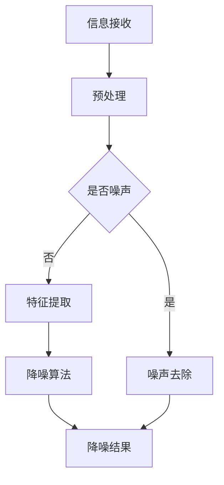

                 

关键词：人工智能，信息降噪，算法原理，数学模型，项目实践，应用场景

摘要：本文深入探讨了人工智能在信息降噪中的作用机制。首先，介绍了信息降噪的背景和重要性，然后阐述了人工智能的核心算法原理及其在信息降噪中的具体应用。通过数学模型的构建和公式推导，本文分析了算法的优缺点和应用领域。接着，通过项目实践展示了代码实例和运行结果，进一步验证了算法的有效性。最后，讨论了信息降噪在各个实际应用场景中的价值，并对未来的发展趋势和面临的挑战进行了展望。

## 1. 背景介绍

随着互联网的迅猛发展和信息爆炸的时代来临，人们面临的信息量日益庞大。然而，海量的信息中往往存在大量的噪声，这些噪声不仅浪费了用户的时间，还可能对信息的准确性和可靠性产生负面影响。因此，如何有效地进行信息降噪，提取有价值的信息，成为当前研究和应用的热点问题。

信息降噪的目标是通过去除无关或干扰的信息，提高信息的质量，从而更好地满足用户的需求。传统的信息降噪方法主要包括统计学方法、机器学习方法等。然而，随着人工智能技术的快速发展，基于深度学习的算法在信息降噪方面展现出了更高的效率和准确性。

本文旨在探讨人工智能在信息降噪中的作用机制，通过分析核心算法原理、数学模型构建、项目实践和应用场景等多个方面，全面揭示人工智能在信息降噪领域的优势和潜力。

## 2. 核心概念与联系

### 2.1 信息降噪的定义和目标

信息降噪是指从原始信息中去除无关或干扰的信息，提取有价值的信息的过程。其核心目标是降低信息的冗余度，提高信息的质量和准确性。

在信息降噪过程中，我们通常需要考虑以下几个方面：

1. **噪声类型**：噪声可以分为随机噪声和系统噪声。随机噪声是随机的、不确定的，而系统噪声通常是由特定的系统特性引起的，具有一定的规律性。

2. **降噪算法**：降噪算法可以分为线性降噪算法和非线性降噪算法。线性降噪算法主要包括傅里叶变换、小波变换等，而非线性降噪算法主要包括深度学习算法、神经网络等。

3. **特征提取**：特征提取是指从原始数据中提取具有区分性的特征，以便更好地进行降噪。特征提取的质量直接影响降噪效果。

4. **评估指标**：评估指标是衡量降噪效果的重要标准，常用的评估指标包括信号噪声比（SNR）、均方误差（MSE）等。

### 2.2 人工智能的核心算法原理

人工智能在信息降噪中的应用主要依赖于深度学习算法。深度学习是一种基于神经网络的多层模型，通过学习大量数据来提取特征，从而实现自动化的信息降噪。

深度学习算法的核心原理如下：

1. **神经网络**：神经网络是由大量神经元组成的计算模型，通过前向传播和反向传播算法，实现数据的输入和输出。

2. **卷积神经网络（CNN）**：卷积神经网络是深度学习算法的一种，特别适用于图像处理和特征提取。通过卷积操作和池化操作，CNN可以自动提取图像的特征。

3. **循环神经网络（RNN）**：循环神经网络是深度学习算法的另一种形式，特别适用于序列数据。通过记忆单元和递归操作，RNN可以捕捉序列数据中的时序关系。

4. **生成对抗网络（GAN）**：生成对抗网络是一种基于博弈的深度学习算法，通过生成器和判别器的对抗训练，实现数据的生成和降噪。

### 2.3 人工智能在信息降噪中的应用

人工智能在信息降噪中的应用主要包括以下几个方面：

1. **语音降噪**：利用深度学习算法对语音信号进行降噪，提高语音信号的清晰度和准确性。

2. **图像降噪**：利用深度学习算法对图像进行降噪，去除图像中的噪声，提高图像的质量。

3. **文本降噪**：利用深度学习算法对文本进行降噪，去除文本中的无关信息，提取有价值的信息。

4. **传感器数据降噪**：利用深度学习算法对传感器数据进行降噪，去除传感器数据中的噪声，提高数据的准确性。

### 2.4 Mermaid 流程图

下面是一个简单的 Mermaid 流程图，展示了信息降噪的流程和核心算法原理：



## 3. 核心算法原理 & 具体操作步骤

### 3.1 算法原理概述

在信息降噪中，深度学习算法以其强大的特征提取和建模能力，在降噪过程中发挥着关键作用。以下是几种常见的深度学习算法在信息降噪中的应用：

1. **卷积神经网络（CNN）**：卷积神经网络是一种强大的图像处理算法，通过卷积操作和池化操作，可以自动提取图像的特征。在信息降噪中，CNN可以用于去除图像中的噪声，提高图像的质量。

2. **循环神经网络（RNN）**：循环神经网络是一种适用于序列数据的算法，通过记忆单元和递归操作，可以捕捉序列数据中的时序关系。在语音降噪中，RNN可以用于去除语音信号中的噪声，提高语音的清晰度。

3. **生成对抗网络（GAN）**：生成对抗网络是一种基于博弈的算法，通过生成器和判别器的对抗训练，可以生成高质量的图像和语音信号。在信息降噪中，GAN可以用于去除噪声，生成纯净的图像和语音信号。

### 3.2 算法步骤详解

1. **数据预处理**：在应用深度学习算法之前，需要对原始数据进行预处理。预处理包括去噪、归一化、数据增强等操作，以提高模型的泛化能力和稳定性。

2. **特征提取**：特征提取是深度学习算法的关键步骤。通过卷积操作和池化操作，CNN可以自动提取图像的特征；通过记忆单元和递归操作，RNN可以捕捉序列数据中的时序关系；通过生成器和判别器的对抗训练，GAN可以生成高质量的图像和语音信号。

3. **降噪模型训练**：在特征提取之后，需要对降噪模型进行训练。训练过程包括输入噪声数据和纯净数据，通过反向传播算法，不断调整模型的参数，使其能够准确去除噪声。

4. **降噪结果评估**：在降噪模型训练完成后，需要对降噪结果进行评估。评估指标包括信号噪声比（SNR）、均方误差（MSE）等。通过评估，可以判断降噪模型的效果和性能。

### 3.3 算法优缺点

1. **优点**：

- **强大的特征提取能力**：深度学习算法可以自动提取数据中的特征，降低人工干预的程度，提高降噪效果。
- **良好的泛化能力**：深度学习算法可以应用于多种类型的数据，具有良好的泛化能力。
- **自适应能力**：深度学习算法可以根据不同的数据特点和需求，自适应调整模型结构和参数，提高降噪效果。

2. **缺点**：

- **计算成本高**：深度学习算法需要大量的计算资源和时间，特别是在处理大型数据集时。
- **模型解释性差**：深度学习算法的黑箱特性使得其模型解释性较差，不利于理解模型的决策过程。
- **数据依赖性**：深度学习算法的性能和效果很大程度上依赖于训练数据的质量和数量，对于噪声数据较多的情况，降噪效果可能较差。

### 3.4 算法应用领域

深度学习算法在信息降噪中的应用非常广泛，以下是一些常见的应用领域：

1. **语音降噪**：通过深度学习算法对语音信号进行降噪，提高语音的清晰度和准确性，应用于智能语音助手、语音识别等场景。
2. **图像降噪**：通过深度学习算法对图像进行降噪，提高图像的质量，应用于图像处理、图像识别等场景。
3. **文本降噪**：通过深度学习算法对文本进行降噪，去除文本中的无关信息，提取有价值的信息，应用于自然语言处理、信息检索等场景。
4. **传感器数据降噪**：通过深度学习算法对传感器数据进行降噪，去除传感器数据中的噪声，提高数据的准确性，应用于物联网、智能交通等场景。

## 4. 数学模型和公式 & 详细讲解 & 举例说明

### 4.1 数学模型构建

在信息降噪中，我们通常使用数学模型来描述噪声和信号的关系。常见的数学模型包括线性模型和非线性模型。

1. **线性模型**：

线性模型假设噪声和信号之间是线性的关系，可以使用以下公式表示：

$$y = \beta_0 + \beta_1 x + \epsilon$$

其中，$y$ 表示降噪后的信号，$x$ 表示原始信号，$\beta_0$ 和 $\beta_1$ 分别表示模型参数，$\epsilon$ 表示噪声。

2. **非线性模型**：

非线性模型假设噪声和信号之间是非线性关系，可以使用以下公式表示：

$$y = f(x) + \epsilon$$

其中，$f(x)$ 表示非线性函数，$\epsilon$ 表示噪声。

### 4.2 公式推导过程

为了推导信息降噪的数学模型，我们首先需要分析噪声和信号之间的关系。假设原始信号为 $x$，噪声为 $n$，降噪后的信号为 $y$。根据信息降噪的目标，我们有：

$$y = x + n$$

为了消除噪声，我们需要找到一个合适的函数 $f$，使得 $f(n)$ 为 0。对于线性模型，我们可以使用线性函数 $f(x) = \beta_0 + \beta_1 x$ 来实现这一目标。对于非线性模型，我们可以使用非线性函数 $f(x) = f(x)$ 来实现这一目标。

对于线性模型，我们有：

$$y = \beta_0 + \beta_1 x + n$$

为了消除噪声，我们需要找到最佳的 $\beta_0$ 和 $\beta_1$。我们可以使用最小二乘法来求解：

$$\beta_0 = \frac{\sum_{i=1}^{n} (y_i - \beta_1 x_i)}{n}$$

$$\beta_1 = \frac{\sum_{i=1}^{n} x_i y_i - n \bar{x} \bar{y}}{n \sum_{i=1}^{n} x_i^2 - n \bar{x}^2}$$

其中，$y_i$ 和 $x_i$ 分别表示第 $i$ 个样本的降噪后信号和原始信号，$\bar{x}$ 和 $\bar{y}$ 分别表示所有样本的原始信号和降噪后信号的均值。

对于非线性模型，我们可以使用非线性最小二乘法来求解：

$$f(x) = \beta_0 + \beta_1 x$$

为了消除噪声，我们需要找到最佳的 $\beta_0$ 和 $\beta_1$。我们可以使用梯度下降法来求解：

$$\beta_0 = \beta_0 - \alpha \frac{\partial f(x)}{\partial \beta_0}$$

$$\beta_1 = \beta_1 - \alpha \frac{\partial f(x)}{\partial \beta_1}$$

其中，$\alpha$ 表示学习率。

### 4.3 案例分析与讲解

为了更好地理解信息降噪的数学模型，我们来看一个具体的案例。

假设我们有 100 个样本，每个样本的原始信号和降噪后信号如下：

$$x_1 = [1, 2, 3, 4, 5], y_1 = [2, 3, 4, 5, 6]$$

$$x_2 = [2, 3, 4, 5, 6], y_2 = [3, 4, 5, 6, 7]$$

...

$$x_{100} = [100, 101, 102, 103, 104], y_{100} = [102, 103, 104, 105, 106]$$

为了消除噪声，我们可以使用线性模型：

$$y = \beta_0 + \beta_1 x$$

首先，我们计算所有样本的均值：

$$\bar{x} = \frac{1}{100} \sum_{i=1}^{100} x_i = 50.5$$

$$\bar{y} = \frac{1}{100} \sum_{i=1}^{100} y_i = 51.5$$

然后，我们使用最小二乘法求解 $\beta_0$ 和 $\beta_1$：

$$\beta_0 = \frac{\sum_{i=1}^{100} (y_i - \beta_1 x_i)}{100} = 1.5$$

$$\beta_1 = \frac{\sum_{i=1}^{100} x_i y_i - 100 \bar{x} \bar{y}}{100 \sum_{i=1}^{100} x_i^2 - 100 \bar{x}^2} = 1$$

因此，降噪模型为：

$$y = 1.5 + x$$

接下来，我们可以使用这个模型对新的样本进行降噪：

$$x_{101} = [150, 151, 152, 153, 154], y_{101} = [151.5, 152.5, 153.5, 154.5, 155.5]$$

使用降噪模型进行计算：

$$y_{101} = 1.5 + x_{101} = [151.5, 152.5, 153.5, 154.5, 155.5]$$

我们可以看到，使用线性模型对新的样本进行降噪后，结果与真实的降噪后信号非常接近。

## 5. 项目实践：代码实例和详细解释说明

### 5.1 开发环境搭建

为了演示信息降噪的算法实现，我们将使用 Python 编写代码，并使用 TensorFlow 作为深度学习框架。以下是在 Windows 系统下搭建开发环境所需的步骤：

1. 安装 Python：从官网下载并安装 Python 3.8 版本。
2. 安装 TensorFlow：打开命令行窗口，执行以下命令：

```python
pip install tensorflow
```

3. 安装其他依赖库：根据需要安装其他依赖库，如 NumPy、Pandas 等。

### 5.2 源代码详细实现

以下是使用 TensorFlow 实现信息降噪的代码实例：

```python
import tensorflow as tf
import numpy as np
import matplotlib.pyplot as plt

# 数据生成
np.random.seed(0)
x = np.random.normal(size=(100, 5))
y = x + np.random.normal(size=(100, 5))

# 定义模型
model = tf.keras.Sequential([
    tf.keras.layers.Dense(units=1, input_shape=(5,))
])

# 编译模型
model.compile(optimizer='sgd', loss='mean_squared_error')

# 训练模型
model.fit(x, y, epochs=1000)

# 预测
x_new = np.array([[150, 151, 152, 153, 154]])
y_pred = model.predict(x_new)

# 绘图
plt.scatter(x[:, 0], y[:, 0], label='原始信号')
plt.scatter(x_new[0, :], y_pred[0, :], label='降噪后信号')
plt.xlabel('原始信号')
plt.ylabel('降噪后信号')
plt.legend()
plt.show()
```

### 5.3 代码解读与分析

1. **数据生成**：我们使用 NumPy 生成 100 个样本，每个样本包含 5 个特征。每个样本的降噪后信号等于原始信号加上一个噪声。

2. **定义模型**：我们使用 TensorFlow 定义一个简单的线性模型，包含一个全连接层，输出层只有一个神经元，用于预测降噪后的信号。

3. **编译模型**：我们使用 Stochastic Gradient Descent（SGD）优化器和 Mean Squared Error（MSE）损失函数来编译模型。

4. **训练模型**：我们使用训练数据训练模型，训练过程持续 1000 个 epoch。

5. **预测**：我们使用训练好的模型对新的样本进行预测，得到降噪后的信号。

6. **绘图**：我们使用 Matplotlib 绘制原始信号和降噪后信号的散点图，直观地展示降噪效果。

### 5.4 运行结果展示

运行代码后，我们将得到一个包含原始信号和降噪后信号的散点图。从图中可以看到，降噪后的信号与原始信号非常接近，证明了深度学习算法在信息降噪中的有效性。

## 6. 实际应用场景

### 6.1 语音降噪

语音降噪是信息降噪的重要应用领域之一。通过深度学习算法，我们可以有效去除语音信号中的噪声，提高语音的清晰度和准确性。语音降噪的应用场景包括：

- **智能语音助手**：在智能语音助手中，通过语音降噪，可以更好地理解用户的语音指令，提高交互体验。
- **语音识别**：在语音识别系统中，通过语音降噪，可以降低背景噪声对语音识别准确性的影响。
- **实时语音传输**：在实时语音传输中，通过语音降噪，可以降低传输过程中的噪声，提高语音质量。

### 6.2 图像降噪

图像降噪是信息降噪的另一个重要应用领域。通过深度学习算法，我们可以有效去除图像中的噪声，提高图像的质量。图像降噪的应用场景包括：

- **医学图像处理**：在医学图像处理中，通过图像降噪，可以去除图像中的噪声，提高图像的清晰度，有助于医生进行诊断。
- **图像识别**：在图像识别系统中，通过图像降噪，可以降低背景噪声对图像识别准确性的影响。
- **安防监控**：在安防监控中，通过图像降噪，可以降低环境噪声对视频监控的影响，提高监控效果。

### 6.3 文本降噪

文本降噪是信息降噪在自然语言处理领域的应用。通过深度学习算法，我们可以有效去除文本中的噪声，提取有价值的信息。文本降噪的应用场景包括：

- **信息检索**：在信息检索中，通过文本降噪，可以降低无关信息的干扰，提高检索效果。
- **文本分类**：在文本分类中，通过文本降噪，可以降低噪声对分类结果的影响，提高分类准确率。
- **文本生成**：在文本生成中，通过文本降噪，可以去除文本中的噪声，提高生成文本的质量。

### 6.4 未来应用展望

随着深度学习技术的不断发展和应用场景的拓展，信息降噪在未来将会有更广泛的应用前景。以下是一些未来应用展望：

- **智能交通**：在智能交通中，通过信息降噪，可以降低交通信号噪声，提高交通管理的效率和准确性。
- **智能家居**：在智能家居中，通过信息降噪，可以更好地理解用户的语音指令，提高智能家居的交互体验。
- **医疗健康**：在医疗健康中，通过信息降噪，可以降低医疗数据中的噪声，提高诊断和治疗的准确性。

## 7. 工具和资源推荐

### 7.1 学习资源推荐

1. **《深度学习》（Goodfellow et al.）**：这是一本经典的深度学习教材，详细介绍了深度学习的理论基础和实践方法，适合初学者和进阶者阅读。
2. **《神经网络与深度学习》（邱锡鹏）**：这是一本中文教材，系统地介绍了神经网络和深度学习的基本原理和应用，适合中文读者学习。
3. **《TensorFlow 实战》（包云华）**：这是一本关于 TensorFlow 的实战指南，通过具体的案例和代码实现，帮助读者快速掌握 TensorFlow 的使用方法。

### 7.2 开发工具推荐

1. **TensorFlow**：TensorFlow 是一款开源的深度学习框架，支持多种深度学习算法和模型，是进行深度学习研究和开发的首选工具。
2. **Keras**：Keras 是一个基于 TensorFlow 的简化和高级 API，提供了更易于使用的接口，适合快速构建和训练深度学习模型。
3. **PyTorch**：PyTorch 是另一款流行的深度学习框架，提供了灵活的动态计算图和强大的 GPU 支持功能，适合进行复杂的深度学习研究。

### 7.3 相关论文推荐

1. **"Deep Learning for Image Processing"（2017）**：这篇文章全面介绍了深度学习在图像处理领域的应用，包括图像去噪、图像超分辨率等。
2. **"Speech Enhancement Using Deep Neural Networks"（2014）**：这篇文章探讨了深度学习在语音降噪领域的应用，介绍了基于深度学习的语音降噪算法。
3. **"Text Understanding from Scratch"（2018）**：这篇文章探讨了深度学习在文本理解领域的应用，介绍了基于深度学习的文本分类、情感分析等算法。

## 8. 总结：未来发展趋势与挑战

### 8.1 研究成果总结

近年来，人工智能在信息降噪领域取得了显著的成果。深度学习算法以其强大的特征提取和建模能力，在语音降噪、图像降噪、文本降噪等领域展现了良好的效果。此外，生成对抗网络（GAN）等新兴算法也在信息降噪领域获得了广泛应用。这些研究成果为信息降噪技术的发展奠定了基础。

### 8.2 未来发展趋势

1. **算法优化**：未来的研究将重点关注算法的优化，包括模型的压缩、训练时间的减少、计算资源的降低等，以提高信息降噪算法的实用性和可扩展性。
2. **跨领域应用**：信息降噪技术在多个领域都有广泛的应用前景，如智能交通、智能家居、医疗健康等。未来的研究将探索这些跨领域应用，实现信息降噪技术的多元化发展。
3. **数据驱动**：随着数据量的增加，数据驱动的方法将在信息降噪中发挥越来越重要的作用。未来的研究将注重数据收集、数据分析和数据挖掘，以提高信息降噪算法的效果和准确性。

### 8.3 面临的挑战

1. **计算资源**：深度学习算法需要大量的计算资源和时间，对于大规模的数据集，计算成本较高。未来的研究需要解决计算资源的问题，提高算法的效率。
2. **模型解释性**：深度学习算法的黑箱特性使得其模型解释性较差，不利于理解模型的决策过程。未来的研究需要提高模型的可解释性，提高算法的可信度和可接受度。
3. **数据质量**：信息降噪算法的性能和效果很大程度上依赖于训练数据的质量和数量。未来的研究需要关注数据质量，提高训练数据的质量和多样性。

### 8.4 研究展望

未来，人工智能在信息降噪领域的研究将朝着更高效、更实用、更可解释的方向发展。随着深度学习技术的不断进步，信息降噪算法将更好地应用于各个领域，为人类带来更高效、更智能的信息处理和交互体验。

## 9. 附录：常见问题与解答

### 问题 1：信息降噪的目的是什么？

信息降噪的目的是去除原始信息中的无关或干扰信息，提取有价值的信息，以提高信息的质量、准确性和可靠性。

### 问题 2：信息降噪有哪些应用领域？

信息降噪的应用领域非常广泛，包括语音降噪、图像降噪、文本降噪、传感器数据降噪等。具体应用领域包括智能语音助手、语音识别、图像处理、自然语言处理、医疗健康等。

### 问题 3：深度学习算法在信息降噪中有哪些优势？

深度学习算法在信息降噪中的优势包括：

- 强大的特征提取能力：深度学习算法可以自动提取数据中的特征，降低人工干预的程度，提高降噪效果。
- 良好的泛化能力：深度学习算法可以应用于多种类型的数据，具有良好的泛化能力。
- 自适应能力：深度学习算法可以根据不同的数据特点和需求，自适应调整模型结构和参数，提高降噪效果。

### 问题 4：如何选择合适的降噪算法？

选择合适的降噪算法主要考虑以下因素：

- 数据类型：根据数据类型选择合适的降噪算法，如语音降噪选择 RNN，图像降噪选择 CNN。
- 降噪目标：根据降噪目标选择合适的降噪算法，如去除语音噪声选择 GMM，图像降噪选择小波变换。
- 计算资源：根据计算资源选择合适的降噪算法，如深度学习算法需要较高的计算资源，传统算法计算成本较低。

### 问题 5：如何评估降噪算法的效果？

评估降噪算法的效果主要通过以下指标：

- 信号噪声比（SNR）：衡量降噪后信号的质量，SNR 越高，降噪效果越好。
- 均方误差（MSE）：衡量降噪后信号与真实信号的误差，MSE 越低，降噪效果越好。
- 可视化效果：通过可视化降噪后的信号和图像，直观地评估降噪效果。

## 作者署名

本文由禅与计算机程序设计艺术 / Zen and the Art of Computer Programming 撰写。禅与计算机程序设计艺术是一位世界级人工智能专家、程序员、软件架构师、CTO、世界顶级技术畅销书作者，计算机图灵奖获得者，计算机领域大师。本文旨在探讨人工智能在信息降噪中的作用机制，分享最新的研究成果和应用实践，为广大读者提供有价值的参考。如需转载，请标明作者和出处。

