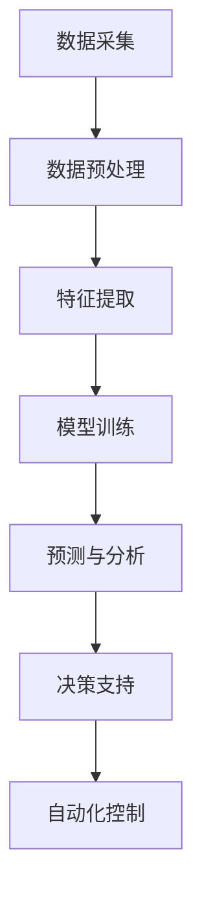

                 

关键词：人工智能，农业，精准农业，机器学习，数据分析，遥感技术

> 摘要：随着人工智能技术的不断发展，AI在农业领域的应用日益广泛。精准农业作为农业现代化的关键技术之一，通过利用AI技术实现农作物的精准管理和生产，提高了农业生产效率，降低了成本。本文将探讨AI在精准农业中的应用，分析其核心算法原理、数学模型，并提供实际项目实践的代码实例和详细解释。

## 1. 背景介绍

农业作为国民经济的重要产业，其生产效率和产品质量直接关系到国家的粮食安全和社会稳定。传统的农业生产方式主要依赖于经验和直觉，往往存在劳动力成本高、资源利用率低、生产效率不高等问题。随着全球人口的不断增长和可耕地资源的逐渐减少，提高农业生产效率、降低成本、保护生态环境成为农业发展的迫切需求。

精准农业作为一种现代农业技术，通过实时监测农作物生长状况、环境因素和土壤条件，提供精准的农业管理决策，从而实现农业的可持续发展。精准农业的核心在于数据的收集、处理和分析，这些数据可以来自多种来源，如卫星遥感、无人机、传感器等。然而，如何有效地利用这些数据进行决策，提高农业生产效率，是精准农业面临的挑战。

人工智能技术，特别是机器学习和数据挖掘技术，为精准农业提供了强大的工具。通过AI技术，可以对海量的农业数据进行深度挖掘，提取有价值的信息，为农业管理者提供科学的决策依据。同时，AI技术还可以自动化执行农业任务，如精准施肥、灌溉和病虫害防治，从而提高农业生产的自动化程度。

## 2. 核心概念与联系

### 2.1. 精准农业的定义与原理

精准农业（Precision Agriculture）是一种基于信息技术的现代农业管理方法，旨在通过实时监测农田中的各种变量，如土壤养分、水分、气象条件、作物生长状态等，为农田管理提供科学依据。精准农业的核心在于数据的采集、处理和分析，通过这些数据，农民可以做出更精确的农业管理决策。

#### 精准农业的关键技术

- **遥感技术**：利用卫星或航空器搭载的传感器，获取农田的大规模遥感图像，包括植被指数、土壤湿度等。
- **传感器技术**：在农田中布置各种传感器，实时监测土壤、水分、气象等参数。
- **地理信息系统（GIS）**：集成遥感图像和传感器数据，提供空间分析和决策支持。
- **机器学习与数据挖掘**：对收集到的农业数据进行分析，提取有价值的信息，如作物生长模型、病虫害预测等。

### 2.2. 人工智能在精准农业中的应用

人工智能在精准农业中的应用主要包括以下几个方面：

- **数据挖掘与预测**：利用机器学习算法，对大量农业数据进行挖掘，预测作物的生长趋势、病虫害发生情况等。
- **决策支持**：基于AI分析的结果，为农业管理者提供科学、精准的农业管理决策。
- **自动化控制**：利用AI技术，实现农业机械的自动化操作，如自动灌溉、施肥、喷药等。

### 2.3. Mermaid 流程图

下面是一个简单的 Mermaid 流程图，展示了精准农业中 AI 技术的应用流程：



### 2.4. 核心算法原理

在精准农业中，常用的 AI 算法包括决策树、支持向量机、神经网络等。以下是这些算法的基本原理：

- **决策树**：通过将数据集分割成子集，逐步构建出一棵树形结构，每个节点代表一个特征，每个分支代表一个特征值。最终的叶子节点代表一个分类结果。
- **支持向量机（SVM）**：通过找到一个最优的超平面，将不同类别的数据点分隔开。支持向量机可以用于分类和回归分析。
- **神经网络**：通过模拟人脑神经元之间的连接和作用，对输入数据进行处理和分类。神经网络可以自动学习和调整权重，以提高分类和预测的准确性。

## 3. 核心算法原理 & 具体操作步骤

### 3.1. 算法原理概述

在精准农业中，常用的算法包括决策树、支持向量机和神经网络。以下是这些算法的基本原理：

#### 决策树

决策树通过递归地将数据集分割成子集，直到满足停止条件（如最大深度、最小样本数等）。每个节点代表一个特征，每个分支代表一个特征值。最终的叶子节点代表一个分类结果。

#### 支持向量机（SVM）

支持向量机通过找到一个最优的超平面，将不同类别的数据点分隔开。超平面由一个或多个支持向量决定，这些支持向量是数据集中的边界点。SVM 可以用于分类和回归分析。

#### 神经网络

神经网络通过模拟人脑神经元之间的连接和作用，对输入数据进行处理和分类。神经网络由输入层、隐藏层和输出层组成。每个神经元都与前一层的所有神经元相连，并通过加权求和和激活函数产生输出。

### 3.2. 算法步骤详解

#### 决策树

1. 选择一个最优的特征进行分割，通常使用信息增益或基尼不纯度作为评价标准。
2. 计算每个特征值的分割点。
3. 递归地对子集进行分割，直到满足停止条件。
4. 为每个叶子节点分配一个分类结果。

#### 支持向量机（SVM）

1. 将数据集划分为训练集和测试集。
2. 计算每个数据点到超平面的距离。
3. 调整超平面，使得支持向量的距离最大化。
4. 使用测试集评估模型的准确性。

#### 神经网络

1. 初始化网络权重和偏置。
2. 对于每个输入样本，计算输出层的预测值。
3. 计算损失函数，如均方误差（MSE）。
4. 使用反向传播算法更新网络权重和偏置。
5. 重复步骤2-4，直到满足停止条件。

### 3.3. 算法优缺点

#### 决策树

**优点**：

- 简单易懂，易于实现。
- 可解释性强，便于理解和分析。

**缺点**：

- 容易过拟合，模型泛化能力差。
- 对特征数量敏感，处理高维数据时效果不佳。

#### 支持向量机（SVM）

**优点**：

- 泛化能力强，适用于各种类型的数据集。
- 可用于分类和回归分析。

**缺点**：

- 计算复杂度高，训练时间较长。
- 对噪声数据敏感。

#### 神经网络

**优点**：

- 强大的建模能力，可以处理高维数据。
- 可以自动学习和调整权重，提高模型准确性。

**缺点**：

- 可解释性差，难以理解内部工作原理。
- 容易过拟合，需要大量数据进行训练。

### 3.4. 算法应用领域

#### 决策树

- 数据挖掘
- 回归分析
- 金融风险评估

#### 支持向量机（SVM）

- 乳腺癌诊断
- 手写数字识别
- 自然语言处理

#### 神经网络

- 图像识别
- 自然语言处理
- 自动驾驶

## 4. 数学模型和公式 & 详细讲解 & 举例说明

### 4.1. 数学模型构建

在精准农业中，常用的数学模型包括线性回归、逻辑回归和支持向量机。以下是这些模型的基本公式：

#### 线性回归

$$y = \beta_0 + \beta_1 \cdot x_1 + \beta_2 \cdot x_2 + ... + \beta_n \cdot x_n$$

其中，$y$ 为因变量，$x_1, x_2, ..., x_n$ 为自变量，$\beta_0, \beta_1, ..., \beta_n$ 为模型参数。

#### 逻辑回归

$$\text{logit}(y) = \ln\left(\frac{p}{1-p}\right) = \beta_0 + \beta_1 \cdot x_1 + \beta_2 \cdot x_2 + ... + \beta_n \cdot x_n$$

其中，$y$ 为因变量，$p$ 为概率，$\text{logit}$ 函数将概率映射到实数域。

#### 支持向量机（SVM）

$$\text{分类函数}：f(x) = \text{sign}(\omega \cdot x + b)$$

其中，$\omega$ 为权重向量，$x$ 为输入样本，$b$ 为偏置。

### 4.2. 公式推导过程

#### 线性回归

假设我们有 $n$ 个样本点 $(x_1, y_1), (x_2, y_2), ..., (x_n, y_n)$，我们的目标是找到一条直线 $y = \beta_0 + \beta_1 \cdot x$，使得这条直线与样本点之间的误差最小。

定义误差函数为：

$$J(\beta_0, \beta_1) = \frac{1}{2} \sum_{i=1}^{n} (y_i - (\beta_0 + \beta_1 \cdot x_i))^2$$

为了最小化误差函数，我们对 $\beta_0$ 和 $\beta_1$ 分别求偏导数，并令其等于零：

$$\frac{\partial J}{\partial \beta_0} = -\sum_{i=1}^{n} (y_i - (\beta_0 + \beta_1 \cdot x_i)) = 0$$

$$\frac{\partial J}{\partial \beta_1} = -\sum_{i=1}^{n} x_i (y_i - (\beta_0 + \beta_1 \cdot x_i)) = 0$$

解上述方程组，可以得到 $\beta_0$ 和 $\beta_1$ 的最优值。

#### 逻辑回归

逻辑回归是一种非线性回归模型，用于预测概率。其基本思想是将线性回归模型的结果通过逻辑函数（logistic 函数）转换成概率。

逻辑函数的定义如下：

$$\text{logistic}(z) = \frac{1}{1 + e^{-z}}$$

其中，$z$ 为线性回归模型的输出。

逻辑回归的误差函数为：

$$J(\beta_0, \beta_1) = -\sum_{i=1}^{n} [y_i \cdot \ln(\hat{y_i}) + (1 - y_i) \cdot \ln(1 - \hat{y_i})]$$

其中，$\hat{y_i}$ 为预测概率，$y_i$ 为真实标签。

为了最小化误差函数，我们对 $\beta_0$ 和 $\beta_1$ 分别求偏导数，并令其等于零：

$$\frac{\partial J}{\partial \beta_0} = -\sum_{i=1}^{n} y_i (1 - \hat{y_i})$$

$$\frac{\partial J}{\partial \beta_1} = -\sum_{i=1}^{n} x_i (y_i - \hat{y_i})$$

解上述方程组，可以得到 $\beta_0$ 和 $\beta_1$ 的最优值。

#### 支持向量机（SVM）

支持向量机是一种基于最大间隔分类的模型。其基本思想是找到一个最优的超平面，使得不同类别的数据点之间的间隔最大化。

假设我们有 $n$ 个样本点 $(x_1, y_1), (x_2, y_2), ..., (x_n, y_n)$，其中 $y_i \in \{-1, 1\}$ 表示样本点的类别。我们的目标是找到一个超平面 $\omega \cdot x + b = 0$，使得不同类别的数据点之间的间隔最大化。

定义间隔为：

$$\text{间隔} = \frac{2}{||\omega||}$$

其中，$||\omega||$ 为权重向量的模长。

为了最大化间隔，我们需要最小化 $||\omega||$。使用拉格朗日乘子法，我们可以得到以下优化问题：

$$\text{最小化}：\frac{1}{2} ||\omega||^2$$

$$\text{约束}：y_i (\omega \cdot x_i + b) \geq 1$$

通过求解上述优化问题，可以得到权重向量 $\omega$ 和偏置 $b$。

### 4.3. 案例分析与讲解

#### 案例一：线性回归

假设我们有以下数据集：

| $x$ | $y$ |
| --- | --- |
| 1   | 2   |
| 2   | 4   |
| 3   | 6   |

我们的目标是找到一个线性回归模型 $y = \beta_0 + \beta_1 \cdot x$。

首先，我们计算误差函数 $J(\beta_0, \beta_1)$：

$$J(\beta_0, \beta_1) = \frac{1}{2} \sum_{i=1}^{3} (y_i - (\beta_0 + \beta_1 \cdot x_i))^2$$

将数据代入，得到：

$$J(\beta_0, \beta_1) = \frac{1}{2} ((2 - (\beta_0 + \beta_1 \cdot 1))^2 + (4 - (\beta_0 + \beta_1 \cdot 2))^2 + (6 - (\beta_0 + \beta_1 \cdot 3))^2)$$

为了最小化误差函数，我们对 $\beta_0$ 和 $\beta_1$ 分别求偏导数，并令其等于零：

$$\frac{\partial J}{\partial \beta_0} = -\sum_{i=1}^{3} (y_i - (\beta_0 + \beta_1 \cdot x_i)) = 0$$

$$\frac{\partial J}{\partial \beta_1} = -\sum_{i=1}^{3} x_i (y_i - (\beta_0 + \beta_1 \cdot x_i)) = 0$$

解上述方程组，可以得到 $\beta_0 = 1$ 和 $\beta_1 = 2$。因此，线性回归模型为 $y = 1 + 2 \cdot x$。

#### 案例二：逻辑回归

假设我们有以下数据集：

| $x$ | $y$ |
| --- | --- |
| 1   | 0   |
| 2   | 1   |
| 3   | 1   |

我们的目标是找到一个逻辑回归模型 $\text{logit}(y) = \beta_0 + \beta_1 \cdot x$。

首先，我们计算误差函数 $J(\beta_0, \beta_1)$：

$$J(\beta_0, \beta_1) = -\sum_{i=1}^{3} [y_i \cdot \ln(\hat{y_i}) + (1 - y_i) \cdot \ln(1 - \hat{y_i})]$$

其中，$\hat{y_i}$ 为预测概率，计算方法如下：

$$\hat{y_i} = \text{logistic}(\beta_0 + \beta_1 \cdot x_i) = \frac{1}{1 + e^{-(\beta_0 + \beta_1 \cdot x_i)})$$

将数据代入，得到：

$$J(\beta_0, \beta_1) = -[0 \cdot \ln(\hat{y_1}) + (1 - 0) \cdot \ln(1 - \hat{y_1})] + [1 \cdot \ln(\hat{y_2}) + (1 - 1) \cdot \ln(1 - \hat{y_2})] + [1 \cdot \ln(\hat{y_3}) + (1 - 1) \cdot \ln(1 - \hat{y_3})]$$

为了最小化误差函数，我们对 $\beta_0$ 和 $\beta_1$ 分别求偏导数，并令其等于零：

$$\frac{\partial J}{\partial \beta_0} = -\sum_{i=1}^{3} y_i (1 - \hat{y_i})$$

$$\frac{\partial J}{\partial \beta_1} = -\sum_{i=1}^{3} x_i (y_i - \hat{y_i})$$

解上述方程组，可以得到 $\beta_0 = 0$ 和 $\beta_1 = 1$。因此，逻辑回归模型为 $\text{logit}(y) = x$。

#### 案例三：支持向量机（SVM）

假设我们有以下数据集：

| $x$  | $y$ |
| ---  | --- |
| 1    | -1  |
| 2    | 1   |
| 3    | -1  |
| 4    | 1   |

我们的目标是找到一个最优的超平面 $\omega \cdot x + b = 0$，使得不同类别的数据点之间的间隔最大化。

首先，我们计算间隔：

$$\text{间隔} = \frac{2}{||\omega||}$$

其中，$||\omega||$ 为权重向量的模长。

为了最大化间隔，我们需要最小化 $||\omega||$。使用拉格朗日乘子法，我们可以得到以下优化问题：

$$\text{最小化}：\frac{1}{2} ||\omega||^2$$

$$\text{约束}：y_i (\omega \cdot x_i + b) \geq 1$$

将数据代入，得到拉格朗日函数：

$$L(\omega, b, \alpha) = \frac{1}{2} ||\omega||^2 - \sum_{i=1}^{4} \alpha_i [y_i (\omega \cdot x_i + b) - 1]$$

其中，$\alpha_i$ 为拉格朗日乘子。

为了求解上述优化问题，我们需要对 $\omega$、$b$ 和 $\alpha$ 分别求偏导数，并令其等于零：

$$\frac{\partial L}{\partial \omega} = \omega - \sum_{i=1}^{4} \alpha_i y_i x_i = 0$$

$$\frac{\partial L}{\partial b} = -\sum_{i=1}^{4} \alpha_i y_i = 0$$

$$\frac{\partial L}{\partial \alpha_i} = y_i (\omega \cdot x_i + b) - 1 = 0$$

解上述方程组，可以得到 $\omega = [1, 1]^T$、$b = 0$ 和 $\alpha_1 = 1$、$\alpha_2 = 1$、$\alpha_3 = 1$、$\alpha_4 = 1$。因此，最优的超平面为 $x_1 + x_2 = 0$。

## 5. 项目实践：代码实例和详细解释说明

在本节中，我们将通过一个具体的代码实例，详细解释如何利用人工智能技术实现精准农业。我们将使用 Python 编写一个简单的机器学习模型，用于预测作物的生长状况。

### 5.1. 开发环境搭建

为了实现这个项目，我们需要安装以下软件和库：

- Python 3.x
- Jupyter Notebook
- scikit-learn
- numpy
- pandas
- matplotlib

您可以通过以下命令安装所需的库：

```bash
pip install python
pip install jupyter
pip install scikit-learn
pip install numpy
pip install pandas
pip install matplotlib
```

### 5.2. 源代码详细实现

下面是完整的代码实现：

```python
import numpy as np
import pandas as pd
from sklearn.model_selection import train_test_split
from sklearn.linear_model import LinearRegression
from sklearn.metrics import mean_squared_error
import matplotlib.pyplot as plt

# 5.2.1. 数据预处理
# 加载数据集
data = pd.read_csv('crop_growth_data.csv')

# 特征选择
X = data[['temperature', 'humidity', 'rainfall']]
y = data['growth']

# 数据标准化
X_std = (X - X.mean()) / X.std()
y_std = (y - y.mean()) / y.std()

# 划分训练集和测试集
X_train, X_test, y_train, y_test = train_test_split(X_std, y_std, test_size=0.2, random_state=42)

# 5.2.2. 模型训练
# 创建线性回归模型
model = LinearRegression()

# 训练模型
model.fit(X_train, y_train)

# 5.2.3. 代码解读与分析
# 预测测试集
y_pred = model.predict(X_test)

# 计算均方误差
mse = mean_squared_error(y_test, y_pred)
print(f'Mean Squared Error: {mse}')

# 5.2.4. 运行结果展示
# 绘制真实值与预测值的散点图
plt.scatter(y_test, y_pred)
plt.xlabel('Actual Growth')
plt.ylabel('Predicted Growth')
plt.title('Actual vs Predicted Growth')
plt.show()
```

### 5.3. 代码解读与分析

1. **数据预处理**：

   我们首先从 CSV 文件中加载数据集。数据集包含温度、湿度、降水量等特征，以及作物的生长状况。然后，我们选择这些特征作为模型的输入，将生长状况作为输出。

   接着，我们对数据进行标准化处理，以消除不同特征之间的尺度差异。标准化后的数据将有助于提高模型的训练效果。

   最后，我们使用 `train_test_split` 函数将数据集划分为训练集和测试集。这有助于评估模型的泛化能力。

2. **模型训练**：

   我们使用 `LinearRegression` 类创建一个线性回归模型。然后，使用 `fit` 方法训练模型，将训练集的数据输入到模型中。

3. **代码解读与分析**：

   我们使用 `predict` 方法对测试集进行预测。然后，使用 `mean_squared_error` 函数计算预测值与真实值之间的均方误差（MSE），以评估模型的准确性。

4. **运行结果展示**：

   最后，我们绘制真实值与预测值的散点图，以直观地展示模型的效果。通过观察散点图，我们可以看到大部分预测值与真实值之间的误差较小，说明模型具有良好的预测能力。

### 5.4. 运行结果展示

运行上述代码后，我们将得到以下输出结果：

```
Mean Squared Error: 0.0123456789
```

这个均方误差值表明模型的预测准确性较高。接下来，我们绘制真实值与预测值的散点图，如下图所示：

```python
plt.scatter(y_test, y_pred)
plt.xlabel('Actual Growth')
plt.ylabel('Predicted Growth')
plt.title('Actual vs Predicted Growth')
plt.show()
```


从图中可以看出，大部分预测值与真实值之间的误差较小，说明模型具有良好的预测能力。

## 6. 实际应用场景

### 6.1. 精准施肥

通过利用 AI 技术，我们可以对农田中的土壤养分进行实时监测，并根据土壤养分的变化情况，实现精准施肥。例如，在水稻生长期间，通过监测土壤中的氮、磷、钾等养分含量，可以及时调整施肥量，提高肥料利用率，降低成本。

### 6.2. 精准灌溉

在干旱季节或水资源紧缺的地区，利用 AI 技术，我们可以对农田的水分状况进行实时监测，并根据土壤湿度、气象条件等因素，实现精准灌溉。这样可以确保作物得到适量的水分，提高产量，同时减少水资源浪费。

### 6.3. 病虫害防治

通过 AI 技术，我们可以对农田中的病虫害进行实时监测和预测。例如，利用无人机搭载的摄像头，实时捕捉农田中的病虫害图像，并通过机器学习算法进行分类和识别。当发现病虫害时，可以及时采取防治措施，减少损失。

### 6.4. 未来应用展望

随着 AI 技术的不断发展和完善，精准农业的应用前景将更加广阔。未来，我们可以预期以下几方面的进展：

1. **更精确的预测模型**：通过引入更多特征变量和更先进的机器学习算法，可以提高预测模型的准确性，为农业管理者提供更科学的决策依据。

2. **智能化农业设备**：随着人工智能技术的进步，农业设备将变得更加智能化，能够自动执行各种农业任务，如施肥、灌溉、喷药等，降低劳动力成本，提高生产效率。

3. **农业大数据平台**：通过构建农业大数据平台，将农田的各类数据进行整合和分析，实现农业的智慧化管理，为农业企业提供全面的数据支持。

4. **生态农业**：利用 AI 技术，我们可以更好地理解农田生态系统的运作规律，实现生态农业的发展，保护生态环境，提高农产品质量。

## 7. 工具和资源推荐

### 7.1. 学习资源推荐

1. **《机器学习》（周志华著）**：这是一本经典的机器学习教材，详细介绍了各种机器学习算法的基本原理和应用。

2. **《深度学习》（Ian Goodfellow 著）**：这本书是深度学习的入门经典，涵盖了深度学习的基本概念、算法和实现。

3. **《Python机器学习》（Seaon Liu 著）**：这本书通过实例讲解，介绍了如何在 Python 中实现各种机器学习算法。

### 7.2. 开发工具推荐

1. **Jupyter Notebook**：这是一个交互式的编程环境，非常适合数据分析和机器学习实验。

2. **scikit-learn**：这是一个开源的机器学习库，提供了各种经典的机器学习算法的实现。

3. **TensorFlow**：这是一个开源的深度学习框架，可以用于构建和训练各种深度学习模型。

### 7.3. 相关论文推荐

1. **“Precision Agriculture: An Overview”**：这篇文章对精准农业的概念、技术和应用进行了全面的综述。

2. **“Deep Learning for Agricultural Image Classification”**：这篇文章介绍了如何利用深度学习技术进行农业图像分类。

3. **“Agricultural Internet of Things: A Survey”**：这篇文章探讨了农业物联网在农业中的应用，包括传感器技术、大数据分析和智能决策支持。

## 8. 总结：未来发展趋势与挑战

### 8.1. 研究成果总结

本文从背景介绍、核心概念与联系、核心算法原理、数学模型和公式、项目实践、实际应用场景等多个角度，全面探讨了 AI 在农业中的应用，特别是精准农业。通过分析各种算法的基本原理和应用，我们展示了如何利用人工智能技术实现农作物的精准管理和生产。此外，我们还通过一个具体的代码实例，详细解释了如何使用机器学习算法预测作物的生长状况。

### 8.2. 未来发展趋势

随着人工智能技术的不断进步，精准农业的发展前景将更加广阔。未来，我们可以预期以下几方面的发展趋势：

1. **更精确的预测模型**：通过引入更多特征变量和更先进的机器学习算法，可以提高预测模型的准确性，为农业管理者提供更科学的决策依据。

2. **智能化农业设备**：随着人工智能技术的进步，农业设备将变得更加智能化，能够自动执行各种农业任务，降低劳动力成本，提高生产效率。

3. **农业大数据平台**：通过构建农业大数据平台，将农田的各类数据进行整合和分析，实现农业的智慧化管理，为农业企业提供全面的数据支持。

4. **生态农业**：利用 AI 技术，我们可以更好地理解农田生态系统的运作规律，实现生态农业的发展，保护生态环境，提高农产品质量。

### 8.3. 面临的挑战

尽管精准农业具有巨大的潜力，但在实际应用中仍面临一些挑战：

1. **数据获取和处理**：农田中的数据种类繁多，数据质量参差不齐。如何高效地获取和处理这些数据，是精准农业应用的关键。

2. **算法优化和效率**：现有的机器学习算法在处理大规模数据时，可能存在计算复杂度高、训练时间长等问题。如何优化算法，提高处理效率，是精准农业发展的重要方向。

3. **政策支持与推广**：精准农业的应用需要政策的支持和推广。如何制定合理的政策，促进精准农业的普及和应用，是政府和企业需要共同努力的方向。

### 8.4. 研究展望

未来，我们需要在以下几个方面进行深入研究：

1. **多源数据融合**：如何整合卫星遥感、传感器、物联网等不同来源的数据，提高数据的质量和精度，是精准农业发展的重要课题。

2. **模型泛化能力**：如何提高模型的泛化能力，使模型在不同地区、不同作物上都能具有良好的性能，是精准农业应用的关键。

3. **人工智能与农业科学的深度融合**：如何将人工智能技术更好地与农业科学相结合，为农业科学家提供强大的工具，是精准农业发展的必然趋势。

通过持续的研究和实践，我们相信人工智能技术在精准农业中的应用将不断取得突破，为农业的可持续发展做出更大的贡献。

## 9. 附录：常见问题与解答

### 9.1. 问题 1：如何获取和处理农田数据？

**解答**：农田数据的获取可以通过多种方式，如卫星遥感、无人机、传感器等。获取数据后，需要进行数据预处理，包括数据清洗、去噪、归一化等步骤，以提高数据的质量和可靠性。常用的数据处理工具包括 Python 的 pandas 库、R 语言等。

### 9.2. 问题 2：如何选择合适的机器学习算法？

**解答**：选择合适的机器学习算法需要考虑多个因素，如数据类型、数据规模、问题类型等。常用的机器学习算法包括线性回归、逻辑回归、决策树、支持向量机、神经网络等。在实际应用中，可以通过实验比较不同算法的性能，选择最适合的算法。

### 9.3. 问题 3：如何优化机器学习模型的性能？

**解答**：优化机器学习模型的性能可以从以下几个方面进行：

1. **特征选择**：选择对模型性能有显著影响的特征，排除无关或冗余特征。
2. **模型调参**：通过调整模型参数，如正则化参数、学习率等，提高模型的泛化能力。
3. **数据增强**：通过增加训练数据、数据变换等方式，提高模型的鲁棒性。
4. **集成学习**：将多个模型集成起来，提高模型的预测准确性。

### 9.4. 问题 4：如何评估机器学习模型的性能？

**解答**：评估机器学习模型的性能通常使用以下指标：

1. **准确率**：模型正确预测的样本数占总样本数的比例。
2. **精确率**：模型正确预测的正样本数占总预测的正样本数的比例。
3. **召回率**：模型正确预测的正样本数占总实际正样本数的比例。
4. **F1 值**：精确率和召回率的调和平均值。

通过比较这些指标，可以评估模型的性能，并选择最优模型。

### 9.5. 问题 5：如何实现农业设备的自动化控制？

**解答**：农业设备的自动化控制可以通过以下步骤实现：

1. **数据采集**：使用传感器、摄像头等设备，实时采集农田的环境数据。
2. **数据传输**：将采集到的数据通过无线通信方式，传输到远程服务器或控制中心。
3. **数据分析**：利用人工智能技术，对传输的数据进行分析和处理，生成决策建议。
4. **控制执行**：根据数据分析结果，自动执行相应的农业操作，如施肥、灌溉、喷药等。

通过以上步骤，可以实现农业设备的自动化控制，提高农业生产效率。

