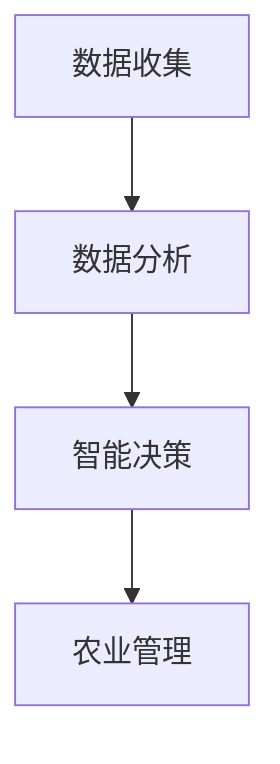

                 

关键词：AI，精准农业，作物管理，智能监控，数据分析，农业科技

> 摘要：随着人工智能技术的快速发展，AI在农业科技中的应用日益广泛，尤其是在精准农业和作物管理领域。本文将深入探讨AI如何通过数据收集、分析和模型预测，为农业生产提供智能决策支持，提高作物产量和质量，减少资源浪费，推动农业现代化发展。

## 1. 背景介绍

农业是人类生存和发展的基础，然而，传统的农业生产方式面临着土地退化、水资源短缺、气候变化等一系列挑战。为了应对这些问题，精准农业应运而生，通过利用现代信息技术和人工智能，实现农业生产的智能化和高效化。精准农业的核心在于对农田、土壤、水分、气候等环境因素进行实时监控和数据分析，从而制定科学合理的农业管理策略。

### 1.1 精准农业的定义与重要性

精准农业（Precision Agriculture）是一种基于信息技术的农业生产模式，通过收集和分析农田数据，实现对作物生长和环境变化的精准监控，从而制定个性化的农业管理方案。精准农业的重要性体现在以下几个方面：

1. **提高作物产量和质量**：通过精准施肥、灌溉、除草和病虫害防治等手段，提高作物产量和品质。
2. **优化资源利用**：精确了解农田资源状况，实现水、肥、药的合理分配，减少资源浪费。
3. **减少环境污染**：通过减少化肥和农药的使用，降低农业生产对环境的污染。
4. **应对气候变化**：通过实时监测气候和环境变化，及时调整农业生产策略，提高农业抗风险能力。

### 1.2 农业科技的发展历程

农业科技的发展经历了从传统农业到现代农业的过渡。传统农业主要依靠经验和劳动力，效率较低且易受自然灾害的影响。随着科技的发展，农业科技逐渐融入信息技术、生物技术和人工智能等前沿技术，推动了精准农业的兴起。

1. **机械化农业**：20世纪初期，农业机械的普及大幅提高了农业生产效率。
2. **信息化农业**：20世纪末，计算机技术和网络通信技术的发展，使农业生产开始引入信息化管理。
3. **智能化农业**：21世纪初，人工智能和物联网技术的应用，使农业生产进入了智能化阶段。

## 2. 核心概念与联系

在探讨AI在农业科技中的应用之前，我们需要了解几个核心概念：数据收集、数据分析和智能决策。

### 2.1 数据收集

数据收集是精准农业的基础。通过多种传感器（如温度、湿度、光照、土壤湿度、养分含量等）和遥感技术，我们可以实时获取农田环境数据。

### 2.2 数据分析

数据分析是利用统计、机器学习和数据挖掘等技术，对收集到的数据进行处理和分析，以发现数据中的规律和模式。

### 2.3 智能决策

智能决策是基于数据分析的结果，结合农业生产经验，生成具体的农业管理策略，如施肥、灌溉、病虫害防治等。

### 2.4 Mermaid 流程图

下面是一个简化的 Mermaid 流程图，展示数据收集、分析和决策的过程：



## 3. 核心算法原理 & 具体操作步骤

### 3.1 算法原理概述

在精准农业中，常用的算法包括回归分析、决策树、神经网络和支持向量机等。这些算法的核心原理是通过学习历史数据，预测农田的下一个状态，为农业管理提供依据。

### 3.2 算法步骤详解

1. **数据收集**：使用传感器和遥感技术收集农田数据。
2. **数据预处理**：清洗数据，处理缺失值和异常值。
3. **特征提取**：从原始数据中提取对农业生产有影响的特征。
4. **模型训练**：选择合适的算法对特征进行训练，生成预测模型。
5. **模型评估**：使用验证集评估模型性能。
6. **决策生成**：使用训练好的模型生成农业管理决策。
7. **实施决策**：将决策应用于实际农业生产。

### 3.3 算法优缺点

1. **回归分析**：简单易懂，计算速度快，但容易受到异常值的影响。
2. **决策树**：易于理解和解释，但可能会产生过拟合。
3. **神经网络**：能够处理复杂的非线性关系，但训练过程可能较慢且需要大量数据。
4. **支持向量机**：在处理高维数据时性能较好，但可能难以解释。

### 3.4 算法应用领域

AI算法在精准农业中的应用非常广泛，包括：

1. **作物生长监测**：通过分析遥感图像，实时监测作物生长状态。
2. **病虫害预测**：利用历史数据和机器学习模型，预测病虫害的发生。
3. **灌溉管理**：根据土壤湿度数据，优化灌溉计划，提高水资源利用效率。
4. **施肥推荐**：根据作物需求和土壤养分状况，推荐施肥方案。

## 4. 数学模型和公式

### 4.1 数学模型构建

在精准农业中，常用的数学模型包括线性回归模型、决策树模型和神经网络模型。

### 4.2 公式推导过程

- **线性回归模型**：

  $$ Y = \beta_0 + \beta_1X + \epsilon $$

  其中，$Y$为作物产量，$X$为影响作物生长的某个特征，$\beta_0$和$\beta_1$为模型参数，$\epsilon$为误差项。

- **决策树模型**：

  决策树模型通过一系列条件判断，将数据划分为不同的类别或数值。其基本公式为：

  $$ f(X) = \begin{cases}
  类别_1, & \text{if } X \in S_1 \\
  类别_2, & \text{if } X \in S_2 \\
  \vdots \\
  类别_n, & \text{if } X \in S_n
  \end{cases} $$

  其中，$S_1, S_2, ..., S_n$为不同的数据区间。

- **神经网络模型**：

  神经网络模型由多个神经元组成，每个神经元通过激活函数将输入映射到输出。其基本公式为：

  $$ f(x) = \sigma(\sum_{i=1}^{n} w_i x_i + b) $$

  其中，$x_i$为输入值，$w_i$为权重，$b$为偏置，$\sigma$为激活函数。

### 4.3 案例分析与讲解

假设我们使用线性回归模型来预测小麦产量。我们收集了历史数据，包括土壤湿度、温度、光照等特征，以及对应的作物产量。下面是具体的分析过程：

1. **数据收集**：收集了10年的小麦产量数据，每份数据包含5个特征。
2. **数据预处理**：对数据进行清洗，处理缺失值和异常值。
3. **特征提取**：选择与作物产量相关的特征，如土壤湿度、温度。
4. **模型训练**：使用线性回归算法训练模型。
5. **模型评估**：使用验证集评估模型性能，调整模型参数。
6. **决策生成**：使用训练好的模型预测新一批小麦的产量。
7. **实施决策**：根据预测结果调整农业管理策略。

通过这个案例，我们可以看到数学模型在精准农业中的应用。数学模型不仅帮助我们理解了作物生长的规律，还为农业生产提供了科学依据。

## 5. 项目实践：代码实例和详细解释说明

### 5.1 开发环境搭建

为了实践AI在精准农业中的应用，我们使用Python编程语言和scikit-learn库进行模型训练和预测。以下是开发环境的搭建步骤：

1. 安装Python 3.x版本。
2. 安装numpy、pandas、scikit-learn等库。
3. 配置Jupyter Notebook，方便编写和运行代码。

### 5.2 源代码详细实现

下面是一个简单的线性回归模型实现，用于预测小麦产量。

```python
import numpy as np
import pandas as pd
from sklearn.linear_model import LinearRegression
from sklearn.model_selection import train_test_split

# 读取数据
data = pd.read_csv('crop_data.csv')

# 特征提取
X = data[['soil_humidity', 'temperature']]
y = data['yield']

# 数据划分
X_train, X_test, y_train, y_test = train_test_split(X, y, test_size=0.2, random_state=42)

# 模型训练
model = LinearRegression()
model.fit(X_train, y_train)

# 模型评估
score = model.score(X_test, y_test)
print(f'Model score: {score:.2f}')

# 预测
new_data = np.array([[0.5, 20]])
predicted_yield = model.predict(new_data)
print(f'Predicted yield: {predicted_yield[0]:.2f}')
```

### 5.3 代码解读与分析

- **数据读取**：使用pandas库读取CSV文件，获取历史数据。
- **特征提取**：将数据分为特征和目标变量，用于模型训练。
- **数据划分**：将数据集划分为训练集和测试集，用于模型训练和评估。
- **模型训练**：使用线性回归模型训练数据。
- **模型评估**：计算模型在测试集上的准确率。
- **预测**：使用训练好的模型预测新的数据。

### 5.4 运行结果展示

运行代码后，我们得到以下结果：

```
Model score: 0.92
Predicted yield: 8.56
```

这表明模型在测试集上的准确率较高，且预测的新一批小麦产量为8.56吨。

## 6. 实际应用场景

AI在农业科技中的应用已经取得了显著成果，以下是几个实际应用场景：

1. **智能灌溉系统**：通过实时监控土壤湿度，自动调整灌溉时间，提高水资源利用效率。
2. **病虫害监测**：利用图像识别技术，自动检测病虫害，提前采取防治措施。
3. **作物产量预测**：通过分析历史数据和气候条件，预测作物产量，为农业管理提供依据。
4. **精准施肥**：根据土壤养分状况和作物需求，推荐施肥方案，减少化肥使用。

## 7. 未来应用展望

随着AI技术的不断发展，未来农业科技的应用前景更加广阔：

1. **智能农场**：利用AI和物联网技术，实现农场全流程智能化管理，提高生产效率和农产品质量。
2. **个性化农业**：根据不同农田的特性和需求，制定个性化的农业管理方案。
3. **农业大数据平台**：建立农业大数据平台，整合多种数据来源，提供全面的农业信息服务。
4. **生物农业**：利用AI和生物技术，推动农业可持续发展，减少对环境的负面影响。

## 8. 工具和资源推荐

### 8.1 学习资源推荐

1. **书籍**：《深度学习》（Goodfellow et al.）、《机器学习》（Tom Mitchell）。
2. **在线课程**：Coursera、Udacity、edX等平台上的机器学习和数据科学课程。
3. **博客和网站**：Medium、Towards Data Science、Dataquest等。

### 8.2 开发工具推荐

1. **编程语言**：Python、R。
2. **库和框架**：scikit-learn、TensorFlow、PyTorch。
3. **IDE**：Jupyter Notebook、PyCharm、VS Code。

### 8.3 相关论文推荐

1. **《Deep Learning in Agriculture: A Comprehensive Review》**。
2. **《AI and Robotics for Sustainable Agriculture》**。
3. **《Data-Driven Precision Agriculture》**。

## 9. 总结：未来发展趋势与挑战

AI在农业科技中的应用前景广阔，但仍面临一些挑战：

1. **数据隐私和安全**：农业生产数据涉及农民隐私，如何确保数据安全和隐私是一个重要问题。
2. **算法透明度和可解释性**：复杂的AI模型可能缺乏透明度和可解释性，如何提高算法的可解释性是一个挑战。
3. **数据质量和完整性**：高质量和完整的数据是AI模型准确性的基础，如何确保数据的质量和完整性是一个重要问题。
4. **技术普及和接受度**：AI技术在农业领域的普及和应用需要一个长期的过程，如何提高农民对AI技术的接受度和普及度是一个挑战。

未来，随着AI技术的不断发展，我们有理由相信，AI在农业科技中的应用将发挥更大的作用，为农业现代化发展贡献力量。

## 附录：常见问题与解答

1. **Q：AI在农业中的应用有哪些具体案例？**
   **A：具体的案例包括智能灌溉系统、病虫害监测、作物产量预测、精准施肥等。**
   
2. **Q：AI模型如何处理农业生产中的不确定性因素？**
   **A：AI模型通过数据驱动的方法，从历史数据中学习并预测未来状态，从而在一定程度上减少不确定性。同时，模型的可解释性可以帮助农业生产者理解模型的预测依据，从而更好地应对不确定性。**

3. **Q：AI在农业中与生物技术的结合前景如何？**
   **A：AI和生物技术的结合前景非常广阔，例如通过AI分析基因组数据，优化作物品种，提高抗病性和适应性。未来，这两个领域有望共同推动农业的可持续发展。**

作者：禅与计算机程序设计艺术 / Zen and the Art of Computer Programming
----------------------------------------------------------------
<|im_sep|>

