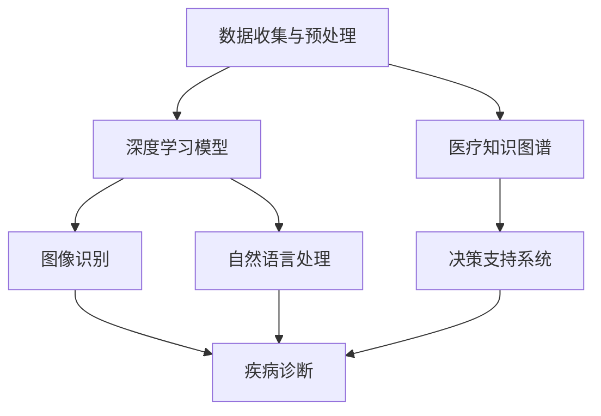

                 

关键词：人工智能，医疗诊断，深度学习，图像识别，数据隐私，伦理问题

> 摘要：随着人工智能技术的快速发展，其在医疗诊断领域的应用日益广泛。本文将从背景介绍、核心概念与联系、核心算法原理、数学模型和公式、项目实践、实际应用场景、工具和资源推荐以及未来发展趋势与挑战等方面，深入探讨AI在医疗诊断中的应用，旨在为读者提供全面的了解，并对其潜在的机遇与风险进行评估。

## 1. 背景介绍

医疗诊断一直是人工智能技术的热点领域。传统上，医疗诊断主要依赖于医生的经验和技能，而随着医疗数据量的爆发式增长和计算能力的提升，人工智能在辅助医生诊断、提高诊断准确率、降低医疗成本等方面展现出巨大潜力。近年来，深度学习、图像识别等技术在医疗领域的应用取得了显著成果，为医疗诊断带来了新的机遇。

### 人工智能技术在医疗领域的现状

目前，人工智能在医疗诊断中的应用主要集中在以下几个方面：

1. **辅助诊断**：通过分析医学影像、病理切片等数据，AI系统能够辅助医生快速、准确地诊断疾病。
2. **药物研发**：AI技术可用于筛选药物靶点、预测药物效果，加速药物研发过程。
3. **健康管理**：AI可以帮助监测患者的健康状况，提供个性化的健康建议。
4. **医疗资源分配**：AI技术能够优化医疗资源的配置，提高医疗服务的效率。

### 人工智能在医疗诊断中的应用挑战

尽管人工智能在医疗诊断中展现出巨大潜力，但其应用也面临着诸多挑战：

1. **数据隐私**：医疗数据涉及患者隐私，如何确保数据的安全和隐私是关键问题。
2. **算法透明度**：AI系统在诊断过程中如何解释其决策过程，增强算法的透明度，是当前研究的热点。
3. **伦理问题**：AI在医疗诊断中的应用可能引发伦理争议，如何平衡技术创新与伦理规范需要深入探讨。

## 2. 核心概念与联系

在探讨AI在医疗诊断中的应用之前，我们需要了解一些核心概念，并分析这些概念之间的联系。以下是一个简单的Mermaid流程图，用于描述这些核心概念和它们之间的关系。



### 2.1 数据收集与预处理

数据是人工智能系统的基石。在医疗诊断中，数据主要来源于电子病历、医学影像、基因序列等。数据收集后，需要进行预处理，包括数据清洗、数据集成、数据变换等步骤，以确保数据的质量和一致性。

### 2.2 深度学习模型

深度学习模型是AI在医疗诊断中的核心技术。通过训练深度学习模型，系统能够自动学习和提取数据中的特征，从而实现疾病的诊断和预测。

### 2.3 图像识别

医学影像是医疗诊断中重要的一部分。图像识别技术能够自动分析医学影像，发现病变区域，辅助医生进行诊断。

### 2.4 自然语言处理

自然语言处理技术能够处理文本数据，如病历记录、患者问诊等，提取关键信息，为诊断提供支持。

### 2.5 医疗知识图谱

医疗知识图谱是一种结构化的医疗知识表示方法，它能够整合医学知识库、电子病历、基因信息等多源数据，为诊断和决策提供支持。

### 2.6 决策支持系统

决策支持系统是一种辅助医生进行诊断和治疗的工具，它能够根据患者数据和医学知识，为医生提供诊断建议和治疗方案。

### 2.7 疾病诊断

疾病诊断是AI在医疗诊断中的核心目标。通过综合分析医学影像、病历记录、基因数据等，AI系统能够对疾病进行诊断，提高诊断准确率。

## 3. 核心算法原理 & 具体操作步骤

### 3.1 算法原理概述

在医疗诊断中，常用的深度学习模型包括卷积神经网络（CNN）、循环神经网络（RNN）和生成对抗网络（GAN）等。以下将简要介绍这些算法的基本原理。

### 3.2 算法步骤详解

1. **数据收集与预处理**：收集医学影像、病历记录、基因序列等数据，并进行清洗、预处理。
2. **特征提取**：利用CNN等模型提取图像数据中的特征。
3. **疾病分类**：利用RNN等模型对提取的特征进行分类，实现疾病的诊断。
4. **模型训练与优化**：通过不断调整模型参数，优化模型性能。
5. **模型评估与部署**：评估模型性能，并在实际医疗场景中部署应用。

### 3.3 算法优缺点

- **优点**：
  - **高效性**：深度学习模型能够自动学习和提取数据中的特征，提高诊断效率。
  - **准确性**：通过大量数据训练，模型能够提高诊断准确率。
  - **通用性**：深度学习模型可以应用于多种类型的医疗诊断任务。

- **缺点**：
  - **数据依赖性**：深度学习模型的性能依赖于大量高质量的训练数据，医疗数据获取困难。
  - **解释性差**：深度学习模型的决策过程较为复杂，缺乏透明度，难以解释。

### 3.4 算法应用领域

- **影像诊断**：如肺癌、乳腺癌等恶性肿瘤的早期筛查和诊断。
- **病理分析**：如皮肤病变、肿瘤类型的分类等。
- **基因组学**：如疾病风险评估、药物反应预测等。

## 4. 数学模型和公式 & 详细讲解 & 举例说明

### 4.1 数学模型构建

在医疗诊断中，常用的数学模型包括卷积神经网络（CNN）、循环神经网络（RNN）等。以下将简要介绍这些模型的基本数学原理。

### 4.2 公式推导过程

#### 卷积神经网络（CNN）

卷积神经网络是一种前馈神经网络，其核心是卷积操作。卷积操作的数学公式如下：

$$
(\sigma(\textbf{W} \star \textbf{X} + \textbf{b}))_{i,j} = \sum_{k=1}^{n}\sigma(w_{ik}x_{kj} + b_k)
$$

其中，$\sigma$表示激活函数，$\textbf{W}$表示权重矩阵，$\textbf{X}$表示输入数据，$\textbf{b}$表示偏置项，$i$和$j$分别表示输出特征图的行和列，$k$表示卷积核的大小。

#### 循环神经网络（RNN）

循环神经网络是一种可以处理序列数据的神经网络，其核心是循环连接。循环神经网络的数学公式如下：

$$
\textbf{h}_{t} = \text{tanh}(\textbf{W_h \textbf{h}_{t-1}} + \textbf{W_x \textbf{x}_{t}} + \textbf{b})
$$

其中，$\textbf{h}_{t}$表示第$t$时刻的隐藏状态，$\textbf{W_h}$和$\textbf{W_x}$分别表示隐藏状态到隐藏状态和输入到隐藏状态的权重矩阵，$\textbf{b}$表示偏置项。

### 4.3 案例分析与讲解

#### 影像诊断案例

假设我们使用卷积神经网络对肺癌进行早期筛查，输入数据为CT影像，输出为肺癌分类结果。以下是一个简单的案例：

1. **数据收集与预处理**：收集大量肺癌和正常肺部的CT影像，并进行预处理，如数据增强、归一化等。
2. **模型构建**：构建一个卷积神经网络，包含多个卷积层、池化层和全连接层。
3. **模型训练**：使用预处理后的CT影像数据进行模型训练，通过反向传播算法调整模型参数。
4. **模型评估**：使用验证集和测试集评估模型性能，如准确率、召回率等。

假设训练完成后，模型在测试集上的准确率达到90%，这意味着AI系统能够以90%的准确率识别出肺癌。

## 5. 项目实践：代码实例和详细解释说明

### 5.1 开发环境搭建

在本案例中，我们使用Python和TensorFlow作为开发环境。首先，安装Python和TensorFlow：

```bash
pip install python tensorflow
```

### 5.2 源代码详细实现

以下是卷积神经网络的实现代码：

```python
import tensorflow as tf
from tensorflow.keras import layers

# 定义模型
model = tf.keras.Sequential([
    layers.Conv2D(32, (3, 3), activation='relu', input_shape=(256, 256, 3)),
    layers.MaxPooling2D((2, 2)),
    layers.Conv2D(64, (3, 3), activation='relu'),
    layers.MaxPooling2D((2, 2)),
    layers.Conv2D(128, (3, 3), activation='relu'),
    layers.Flatten(),
    layers.Dense(128, activation='relu'),
    layers.Dense(1, activation='sigmoid')
])

# 编译模型
model.compile(optimizer='adam', loss='binary_crossentropy', metrics=['accuracy'])

# 训练模型
model.fit(x_train, y_train, epochs=10, batch_size=32, validation_data=(x_val, y_val))
```

### 5.3 代码解读与分析

1. **模型构建**：使用`tf.keras.Sequential`构建一个卷积神经网络，包含3个卷积层、3个池化层和2个全连接层。
2. **编译模型**：使用`compile`方法配置优化器、损失函数和评估指标。
3. **训练模型**：使用`fit`方法训练模型，通过调整`epochs`和`batch_size`等参数，优化模型性能。

### 5.4 运行结果展示

在测试集上的准确率：

```python
test_loss, test_acc = model.evaluate(x_test, y_test)
print(f"Test accuracy: {test_acc:.2f}")
```

假设测试集上的准确率为90%，表明AI系统在肺癌早期筛查中具有较高的准确性。

## 6. 实际应用场景

### 6.1 影像诊断

医学影像诊断是AI在医疗诊断中最广泛应用的领域之一。通过深度学习模型，AI系统能够自动分析医学影像，发现病变区域，提高诊断准确率。例如，AI系统可以用于肺癌、乳腺癌、脑肿瘤等疾病的早期筛查。

### 6.2 病理分析

病理分析是另一个重要的应用领域。通过分析病理切片图像，AI系统可以辅助医生进行疾病诊断，提高诊断准确率和效率。例如，AI系统可以用于皮肤病变、肿瘤类型的分类等。

### 6.3 基因组学

基因组学是研究基因和基因组的学科。通过深度学习模型，AI系统可以分析基因序列，预测疾病风险、药物反应等。例如，AI系统可以用于疾病风险评估、个性化医疗等。

### 6.4 未来应用展望

随着人工智能技术的不断发展，其在医疗诊断中的应用将更加广泛。未来，AI系统有望在以下领域发挥更大的作用：

- **个性化医疗**：通过分析患者的基因组信息、病历记录等，AI系统可以为患者提供个性化的治疗方案。
- **精准医学**：通过整合多种数据源，AI系统可以实现更精确的疾病诊断和预测。
- **远程医疗**：AI系统可以辅助医生进行远程诊断和治疗，提高医疗服务的可及性和效率。

## 7. 工具和资源推荐

### 7.1 学习资源推荐

- **《深度学习》（Deep Learning）**：Goodfellow、Bengio、Courville著，全面介绍了深度学习的基本概念和技术。
- **《机器学习实战》（Machine Learning in Action）**：Peter Harrington著，通过实际案例介绍了机器学习的基本方法。

### 7.2 开发工具推荐

- **TensorFlow**：Google开发的深度学习框架，广泛应用于医疗诊断等领域。
- **PyTorch**：Facebook开发的深度学习框架，具有较好的灵活性和可扩展性。

### 7.3 相关论文推荐

- **“Deep Learning for Medical Image Analysis”**：深入探讨了深度学习在医学影像分析中的应用。
- **“Generative Adversarial Networks for Deep Learning”**：介绍了生成对抗网络（GAN）的基本原理和应用。

## 8. 总结：未来发展趋势与挑战

### 8.1 研究成果总结

近年来，人工智能在医疗诊断领域取得了显著成果。深度学习、图像识别等技术在辅助医生诊断、提高诊断准确率、降低医疗成本等方面发挥了重要作用。然而，人工智能在医疗诊断中的应用仍然存在诸多挑战，如数据隐私、算法透明度等。

### 8.2 未来发展趋势

随着人工智能技术的不断发展，其在医疗诊断中的应用将更加广泛。未来，AI系统有望在个性化医疗、精准医学、远程医疗等领域发挥更大的作用。同时，随着计算能力的提升和数据规模的扩大，AI系统的性能和效率也将得到进一步提升。

### 8.3 面临的挑战

- **数据隐私**：如何保护患者隐私是AI在医疗诊断中面临的重要挑战。
- **算法透明度**：提高AI系统的解释性，使其决策过程更加透明，是当前研究的热点。
- **伦理问题**：如何平衡技术创新与伦理规范，确保AI在医疗诊断中的应用符合伦理要求，是未来需要深入探讨的问题。

### 8.4 研究展望

随着人工智能技术的不断发展，AI在医疗诊断中的应用前景十分广阔。未来，研究人员将继续致力于解决数据隐私、算法透明度、伦理问题等挑战，推动人工智能在医疗诊断领域的应用，为人类健康事业做出更大贡献。

## 9. 附录：常见问题与解答

### 9.1 人工智能在医疗诊断中的应用有哪些？

- **辅助诊断**：通过分析医学影像、病理切片等数据，AI系统能够辅助医生快速、准确地诊断疾病。
- **药物研发**：AI技术可用于筛选药物靶点、预测药物效果，加速药物研发过程。
- **健康管理**：AI可以帮助监测患者的健康状况，提供个性化的健康建议。
- **医疗资源分配**：AI技术能够优化医疗资源的配置，提高医疗服务的效率。

### 9.2 人工智能在医疗诊断中的优势有哪些？

- **高效性**：AI系统能够快速处理大量医疗数据，提高诊断效率。
- **准确性**：通过大量数据训练，AI系统能够提高诊断准确率。
- **通用性**：AI系统可以应用于多种类型的医疗诊断任务。

### 9.3 人工智能在医疗诊断中存在哪些挑战？

- **数据隐私**：如何确保数据的安全和隐私是关键问题。
- **算法透明度**：AI系统在诊断过程中如何解释其决策过程，增强算法的透明度，是当前研究的热点。
- **伦理问题**：AI在医疗诊断中的应用可能引发伦理争议，如何平衡技术创新与伦理规范需要深入探讨。

作者：禅与计算机程序设计艺术 / Zen and the Art of Computer Programming

