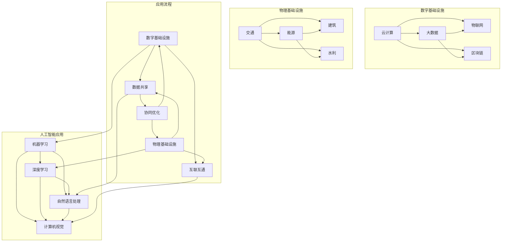

                 

关键词：人工智能、数字基础设施、物理基础设施、智能算法、智能系统、数据处理、智能优化、边缘计算、物联网、智能制造。

> 摘要：本文深入探讨了人工智能在数字与物理基础设施中的关键角色。通过分析AI的核心概念、算法原理及应用，文章揭示了人工智能如何通过智能化算法和系统，优化数字基础设施的性能和效率，以及如何通过边缘计算和物联网技术，推动物理基础设施的智能化和数字化转型。文章还展望了AI在基础设施领域的未来发展，提出了面临的研究挑战和解决方案。

## 1. 背景介绍

在现代社会，数字基础设施和物理基础设施共同构成了社会运行的基石。数字基础设施包括了云计算、大数据、物联网、区块链等技术，而物理基础设施则涵盖了交通、能源、建筑、水利等领域。两者的结合，推动了智慧城市、智能工厂、智能交通等应用场景的快速发展。

人工智能作为现代技术的核心驱动力，正逐步渗透到数字基础设施和物理基础设施的各个方面。通过机器学习、深度学习等算法，AI能够实现自动化、优化决策和智能控制，从而提高基础设施的效率和可靠性。

本文旨在深入探讨人工智能在数字与物理基础设施中的具体应用，分析其核心算法原理，并展望未来的发展趋势。

### 人工智能与数字基础设施的关系

人工智能与数字基础设施的关系密不可分。数字基础设施提供了庞大的数据资源和计算能力，为人工智能的发展提供了坚实的基础。同时，人工智能的引入，使得数字基础设施能够实现更高层次的智能化，提高数据处理能力和系统性能。

首先，人工智能在数字基础设施中的应用主要体现在以下几个方面：

1. **数据挖掘与分析**：人工智能能够通过机器学习和深度学习算法，从海量的数据中挖掘出有价值的信息，为决策提供数据支持。
2. **自动化与优化**：通过自动化算法，AI能够优化数字基础设施的资源配置和调度，提高系统性能和效率。
3. **智能监控与维护**：人工智能系统可以实现对数字基础设施的实时监控和故障预测，减少维护成本和故障时间。

### 人工智能与物理基础设施的关系

物理基础设施同样受益于人工智能技术的引入。通过物联网、边缘计算等技术，AI能够实现物理基础设施的智能化，提高其运行效率和安全性。

1. **智能交通**：人工智能技术可以优化交通信号控制，减少拥堵，提高道路通行效率。
2. **智能能源管理**：AI能够实现能源消耗的实时监控和优化，提高能源利用效率，减少能源浪费。
3. **智能建筑**：通过物联网技术，AI能够实现对建筑环境的智能调节，提高居住舒适度和能效。

### 人工智能在基础设施领域的重要性

人工智能在基础设施领域的重要性体现在以下几个方面：

1. **提升效率**：通过智能化算法和系统，AI能够优化基础设施的运行效率，减少人力成本。
2. **增强安全性**：人工智能系统能够实现对潜在风险的实时监控和预警，提高基础设施的安全性。
3. **促进可持续发展**：通过优化能源消耗和资源利用，AI有助于实现基础设施的可持续发展。

总之，人工智能在数字基础设施和物理基础设施中的应用，不仅提高了系统的性能和效率，还推动了基础设施的智能化和数字化转型，为构建智慧城市和智能社会提供了有力支持。

## 2. 核心概念与联系

### 人工智能的定义和组成部分

人工智能（AI）是模拟、延伸和扩展人类智能的理论、方法、技术及应用。它包括多个子领域，如机器学习、深度学习、自然语言处理、计算机视觉等。每个子领域都有其独特的算法和应用场景。

1. **机器学习**：通过算法从数据中学习规律，进行预测和决策。
2. **深度学习**：基于神经网络的结构，实现复杂数据的自动特征提取和学习。
3. **自然语言处理**：使计算机能够理解和生成自然语言。
4. **计算机视觉**：使计算机能够理解和解释视觉信息。

### 数字基础设施的概念与组成部分

数字基础设施是指支撑数字经济发展的基础硬件设施、软件平台和信息技术网络。它包括以下几个关键组成部分：

1. **云计算**：通过互联网提供动态易扩展且经常是虚拟化的资源。
2. **大数据**：大规模数据存储、管理和分析技术。
3. **物联网**：连接各种设备，实现智能感知和互联。
4. **区块链**：分布式账本技术，提供安全、透明的数据存储和交易。

### 物理基础设施的概念与组成部分

物理基础设施是指支撑社会生产和生活的实际物质设施。它包括以下几个主要组成部分：

1. **交通**：公路、铁路、航空、水运等交通设施。
2. **能源**：发电、输电、配电等能源基础设施。
3. **建筑**：住宅、商业建筑、公共设施等建筑基础设施。
4. **水利**：供水、污水处理、防洪等水利基础设施。

### 数字基础设施与物理基础设施的联系

数字基础设施和物理基础设施之间的联系体现在以下几个方面：

1. **数据共享**：数字基础设施提供了大量的数据资源，为物理基础设施的智能化提供了数据支持。
2. **互联互通**：物联网技术使物理设备能够与数字系统互联，实现智能控制和调度。
3. **协同优化**：通过数字基础设施的智能化算法，可以优化物理基础设施的运行效率和资源利用。

### Mermaid 流程图

下面是一个展示人工智能在数字基础设施与物理基础设施中应用流程的 Mermaid 流程图：



### 核心概念的联系

通过上述核心概念的分析，我们可以看到人工智能在数字基础设施和物理基础设施中的关键作用。数字基础设施提供了数据支持和计算能力，而物理基础设施则需要通过人工智能实现智能化和互联互通。人工智能的算法和系统，如机器学习、深度学习和物联网技术，成为这两者之间联系的桥梁，推动基础设施的全面智能化。

## 3. 核心算法原理 & 具体操作步骤

### 3.1 算法原理概述

在人工智能应用于数字基础设施和物理基础设施的过程中，核心算法原理发挥着至关重要的作用。以下将详细介绍几种关键算法原理，包括机器学习、深度学习和边缘计算等。

#### 3.1.1 机器学习

机器学习（Machine Learning）是一种通过算法让计算机从数据中学习并做出决策的技术。其基本原理是通过训练数据集，让算法学会识别数据中的模式和规律，从而进行预测和分类。

1. **监督学习（Supervised Learning）**：在监督学习中，算法通过已知标签的训练数据学习，从而在新数据上进行预测。常见的监督学习算法包括线性回归、逻辑回归、支持向量机（SVM）等。
   
2. **无监督学习（Unsupervised Learning）**：无监督学习不依赖于标签数据，旨在发现数据中的隐藏结构和模式。常见的无监督学习算法包括聚类算法（如K-means、DBSCAN）、降维算法（如PCA、t-SNE）等。

3. **半监督学习（Semi-Supervised Learning）**：半监督学习结合了监督学习和无监督学习的特点，利用少量的标签数据和大量的未标注数据来训练模型，从而提高学习效果。

#### 3.1.2 深度学习

深度学习（Deep Learning）是机器学习的一个子领域，基于多层神经网络的结构，通过逐层提取数据中的特征，实现对复杂问题的建模。深度学习的关键原理包括：

1. **神经网络（Neural Networks）**：神经网络由多个神经元（或节点）组成，每个节点都与其他节点相连，并通过权重和偏置进行加权求和，最后通过激活函数输出结果。

2. **反向传播（Backpropagation）**：反向传播算法是深度学习训练的核心，通过计算损失函数关于网络权重的梯度，不断调整权重和偏置，以最小化损失函数。

3. **卷积神经网络（CNNs）**：卷积神经网络是一种专门用于图像处理和识别的神经网络，通过卷积层提取图像特征，并通过池化层减少参数数量，提高模型的泛化能力。

4. **递归神经网络（RNNs）**：递归神经网络适用于处理序列数据，通过将输入序列的当前状态与上一状态结合，实现对序列的建模。常见的RNNs包括LSTM和GRU。

#### 3.1.3 边缘计算

边缘计算（Edge Computing）是一种将数据处理、存储和计算任务分散到网络边缘节点上执行的计算架构，以减少中心化数据中心的负担，提高系统的实时响应能力。边缘计算的关键原理包括：

1. **分布式计算**：通过在多个边缘节点上分配计算任务，实现并行处理，提高计算效率。

2. **数据本地化处理**：将数据在本地进行处理，减少数据传输延迟，提高数据处理速度。

3. **智能协同**：边缘节点通过协同计算，共享资源，优化任务分配，提高整体系统的性能和可靠性。

4. **安全与隐私保护**：边缘计算将数据分散到多个边缘节点上，有助于提高数据的安全性和隐私保护。

### 3.2 算法步骤详解

#### 3.2.1 机器学习算法步骤

1. **数据收集与预处理**：收集相关数据，并进行清洗、归一化等预处理操作，以便后续建模。
   
2. **特征工程**：选择或构建有助于模型预测的特征，提高模型的性能。

3. **模型选择**：根据问题类型和数据特点，选择合适的机器学习模型，如线性回归、决策树、支持向量机等。

4. **模型训练与验证**：使用训练数据集对模型进行训练，并通过验证数据集评估模型的性能。

5. **模型优化**：根据验证结果，调整模型参数，优化模型性能。

6. **模型部署**：将训练好的模型部署到实际应用场景中，进行预测和决策。

#### 3.2.2 深度学习算法步骤

1. **数据预处理**：对数据集进行清洗、归一化等预处理操作。

2. **构建神经网络**：设计神经网络的结构，包括输入层、隐藏层和输出层。

3. **初始化权重**：随机初始化神经网络的权重和偏置。

4. **前向传播**：将输入数据通过神经网络进行前向传播，得到输出结果。

5. **计算损失**：通过计算损失函数（如均方误差、交叉熵等），评估模型预测结果与实际结果之间的差距。

6. **反向传播**：根据损失函数的梯度，通过反向传播算法调整网络权重和偏置。

7. **迭代优化**：重复前向传播和反向传播过程，直到模型达到预定的性能指标。

8. **模型评估与部署**：使用验证数据集评估模型性能，并部署到实际应用场景中。

#### 3.2.3 边缘计算算法步骤

1. **任务分配**：根据边缘节点的计算能力和任务需求，将计算任务分配到合适的边缘节点。

2. **数据采集与传输**：从传感器或其他设备采集数据，并将数据传输到边缘节点。

3. **数据处理与存储**：在边缘节点上对数据进行预处理、特征提取和存储。

4. **协同计算**：边缘节点通过协同计算，共享计算资源和数据，优化任务执行。

5. **结果输出**：将协同计算的结果输出到中心数据中心或用户端。

### 3.3 算法优缺点

#### 3.3.1 机器学习

**优点**：

1. **自适应性强**：能够根据新数据不断优化模型。
2. **适用于多种问题**：可以解决分类、回归、聚类等多种问题。
3. **通用性**：算法具有通用性，可以应用于不同领域的问题。

**缺点**：

1. **数据依赖性强**：需要大量的标注数据进行训练。
2. **计算资源消耗大**：训练过程需要大量的计算资源。
3. **模型解释性较差**：难以解释模型的决策过程。

#### 3.3.2 深度学习

**优点**：

1. **强大的特征提取能力**：能够自动提取复杂的数据特征。
2. **高泛化能力**：适用于处理大规模、高维数据。
3. **高性能**：在一些复杂任务上表现出色，如图像识别、自然语言处理等。

**缺点**：

1. **训练时间较长**：需要大量训练数据和计算资源。
2. **模型解释性较差**：难以解释模型的决策过程。
3. **数据不平衡问题**：对数据不平衡问题敏感。

#### 3.3.3 边缘计算

**优点**：

1. **实时性高**：数据处理在边缘节点上完成，减少传输延迟。
2. **安全性高**：数据在本地处理，减少数据泄露风险。
3. **资源利用率高**：利用边缘节点的计算资源，提高整体系统性能。

**缺点**：

1. **计算能力有限**：边缘节点计算能力相对中心节点有限。
2. **数据一致性差**：边缘节点之间的数据同步和一致性较为困难。
3. **维护成本高**：需要定期维护和升级边缘节点。

### 3.4 算法应用领域

#### 3.4.1 机器学习

1. **金融领域**：用于信用评分、风险控制、量化交易等。
2. **医疗领域**：用于疾病预测、诊断辅助、药物研发等。
3. **工业领域**：用于设备故障预测、生产优化、质量检测等。

#### 3.4.2 深度学习

1. **计算机视觉**：用于图像识别、目标检测、图像生成等。
2. **自然语言处理**：用于文本分类、机器翻译、语音识别等。
3. **自动驾驶**：用于车辆感知、路径规划、行为预测等。

#### 3.4.3 边缘计算

1. **智能交通**：用于实时交通监控、智能信号控制、车辆追踪等。
2. **智能能源**：用于实时能源监控、需求响应、储能系统优化等。
3. **智能安防**：用于视频监控、异常检测、智能报警等。

通过上述对核心算法原理和具体操作步骤的详细解析，我们可以看到人工智能在数字基础设施和物理基础设施中的应用潜力。这些算法不仅能够优化基础设施的性能和效率，还能够推动智能化和数字化转型，为构建智慧城市和智能社会提供有力支持。

## 4. 数学模型和公式 & 详细讲解 & 举例说明

### 4.1 数学模型构建

在人工智能应用于数字基础设施和物理基础设施的过程中，数学模型的构建至关重要。数学模型能够将实际问题转化为可计算的数学表达式，为算法设计和实现提供基础。以下将介绍几种常用的数学模型和公式，并详细讲解其构建过程。

#### 4.1.1 线性回归模型

线性回归模型是最简单的数学模型之一，用于预测一个连续变量的值。其基本公式为：

\[ y = \beta_0 + \beta_1 \cdot x \]

其中，\( y \) 是预测值，\( x \) 是输入特征，\( \beta_0 \) 是截距，\( \beta_1 \) 是斜率。

线性回归模型的构建过程主要包括以下几个步骤：

1. **数据收集与预处理**：收集相关数据，并进行清洗、归一化等预处理操作。
2. **特征选择**：选择与目标变量相关的特征，剔除无关或冗余特征。
3. **模型构建**：根据数据特点，选择线性回归模型，并设置截距和斜率的初始值。
4. **模型训练**：使用训练数据集，通过最小二乘法或其他优化算法，更新模型的参数。
5. **模型评估**：使用验证数据集评估模型的性能，并调整模型参数，优化模型性能。

#### 4.1.2 逻辑回归模型

逻辑回归模型是一种广泛用于分类问题的数学模型，其基本公式为：

\[ P(y=1) = \frac{1}{1 + e^{-(\beta_0 + \beta_1 \cdot x)}} \]

其中，\( P(y=1) \) 是目标变量为1的概率，\( e \) 是自然对数的底数，\( \beta_0 \) 是截距，\( \beta_1 \) 是斜率。

逻辑回归模型的构建过程与线性回归模型类似，主要包括以下步骤：

1. **数据收集与预处理**：收集相关数据，并进行清洗、归一化等预处理操作。
2. **特征选择**：选择与目标变量相关的特征，剔除无关或冗余特征。
3. **模型构建**：根据数据特点，选择逻辑回归模型，并设置截距和斜率的初始值。
4. **模型训练**：使用训练数据集，通过极大似然估计或其他优化算法，更新模型的参数。
5. **模型评估**：使用验证数据集评估模型的性能，并调整模型参数，优化模型性能。

#### 4.1.3 卷积神经网络（CNN）模型

卷积神经网络是一种专门用于图像处理和识别的神经网络模型，其基本结构包括卷积层、池化层和全连接层。以下是一个简单的CNN模型构建示例：

\[ \text{Input} \rightarrow (\text{Convolution} \rightarrow \text{Pooling}) \times n \rightarrow \text{Flatten} \rightarrow \text{Fully Connected} \rightarrow \text{Output} \]

其中，输入层接受图像数据，卷积层通过卷积操作提取图像特征，池化层用于减小特征图的尺寸，全连接层用于分类或回归输出。

CNN模型的构建过程主要包括以下步骤：

1. **数据收集与预处理**：收集相关图像数据，并进行数据增强、归一化等预处理操作。
2. **模型设计**：根据数据特点，设计合适的CNN模型结构，包括卷积核大小、层数、神经元数量等。
3. **模型训练**：使用训练数据集，通过反向传播算法训练模型参数。
4. **模型评估**：使用验证数据集评估模型性能，并调整模型参数，优化模型性能。
5. **模型部署**：将训练好的模型部署到实际应用场景中，进行预测和分类。

### 4.2 公式推导过程

#### 4.2.1 逻辑回归模型的损失函数推导

逻辑回归模型的损失函数通常使用对数似然损失函数（Log-Likelihood Loss），其公式为：

\[ J(\theta) = -\frac{1}{m} \sum_{i=1}^{m} [y^{(i)} \cdot \log(g(z^{(i)})) + (1 - y^{(i)}) \cdot \log(1 - g(z^{(i)}))] \]

其中，\( m \) 是样本数量，\( y^{(i)} \) 是第 \( i \) 个样本的真实标签，\( g(z^{(i)}) \) 是逻辑函数，\( z^{(i)} \) 是第 \( i \) 个样本的输入特征与模型参数的乘积。

对数似然损失函数的推导过程如下：

1. **概率分布函数**：逻辑回归模型假设输出变量 \( y \) 服从伯努利分布，即：

\[ P(y=1 | \theta) = g(z^{(i)}) = \frac{1}{1 + e^{-(\theta^T \cdot x^{(i)})}} \]

2. **似然函数**：似然函数是模型参数的联合概率，即：

\[ L(\theta) = \prod_{i=1}^{m} P(y^{(i)}=1 | \theta) \]

3. **对数似然函数**：对数似然函数是对似然函数取对数，即：

\[ \ell(\theta) = \log L(\theta) = \sum_{i=1}^{m} \log P(y^{(i)}=1 | \theta) \]

4. **损失函数**：对数似然函数关于模型参数的负期望值，即：

\[ J(\theta) = -\frac{1}{m} \ell(\theta) \]

#### 4.2.2 卷积神经网络（CNN）的前向传播过程推导

卷积神经网络的前向传播过程主要包括卷积操作、激活函数和池化操作。以下是一个简单的CNN前向传播过程推导：

1. **输入层**：

\[ z^{(1)} = x^{(1)} \]

其中，\( z^{(1)} \) 是输入特征，\( x^{(1)} \) 是原始图像。

2. **卷积层**：

\[ z^{(l)} = \sigma^{(l)}(W^{(l)} \cdot z^{(l-1)} + b^{(l)}) \]

其中，\( z^{(l)} \) 是第 \( l \) 层的输出特征，\( W^{(l)} \) 是第 \( l \) 层的卷积权重，\( b^{(l)} \) 是第 \( l \) 层的偏置，\( \sigma^{(l)} \) 是激活函数。

3. **激活函数**：

\[ a^{(l)} = \sigma^{(l)}(z^{(l)}) \]

其中，\( a^{(l)} \) 是第 \( l \) 层的激活输出。

4. **池化层**：

\[ p^{(l)} = \text{Pooling}(a^{(l)}) \]

其中，\( p^{(l)} \) 是第 \( l \) 层的池化输出，Pooling 是一个下采样操作。

5. **全连接层**：

\[ z^{(L)} = W^{(L)} \cdot p^{(L-1)} + b^{(L)} \]

\[ a^{(L)} = \sigma^{(L)}(z^{(L)}) \]

其中，\( z^{(L)} \) 是最后一层的输出特征，\( W^{(L)} \) 是最后一层的卷积权重，\( b^{(L)} \) 是最后一层的偏置，\( \sigma^{(L)} \) 是激活函数，\( a^{(L)} \) 是最后一层的激活输出。

### 4.3 案例分析与讲解

#### 4.3.1 逻辑回归模型在金融风控中的应用

逻辑回归模型在金融风控中具有广泛的应用，以下是一个案例：

**问题**：预测某银行贷款客户的违约风险。

**数据**：收集了1000个贷款客户的数据，包括年龄、收入、信用评分、贷款金额等特征。

**模型**：使用逻辑回归模型预测客户违约风险。

**步骤**：

1. **数据预处理**：对数据进行清洗、归一化等预处理操作。
2. **特征选择**：选择与违约风险相关的特征，如收入、信用评分等。
3. **模型构建**：设计逻辑回归模型，设置截距和斜率的初始值。
4. **模型训练**：使用训练数据集，通过极大似然估计训练模型参数。
5. **模型评估**：使用验证数据集评估模型性能，并调整模型参数。
6. **模型部署**：将训练好的模型部署到实际应用场景中，进行违约风险预测。

**结果**：通过训练和评估，得到一个性能较好的逻辑回归模型，能够准确预测贷款客户的违约风险。

#### 4.3.2 卷积神经网络（CNN）在图像识别中的应用

卷积神经网络在图像识别领域具有出色的性能，以下是一个案例：

**问题**：对一幅图像进行分类，判断图像中的物体类别。

**数据**：收集了一组包含不同类别的图像数据集。

**模型**：使用卷积神经网络（CNN）进行图像分类。

**步骤**：

1. **数据预处理**：对图像数据进行数据增强、归一化等预处理操作。
2. **模型设计**：设计一个简单的CNN模型，包括卷积层、池化层和全连接层。
3. **模型训练**：使用训练数据集，通过反向传播算法训练模型参数。
4. **模型评估**：使用验证数据集评估模型性能，并调整模型参数。
5. **模型部署**：将训练好的模型部署到实际应用场景中，进行图像分类。

**结果**：通过训练和评估，得到一个性能较好的CNN模型，能够准确识别图像中的物体类别。

通过以上案例分析和讲解，我们可以看到数学模型在人工智能应用中的关键作用。合理构建和优化数学模型，能够提高算法的性能和预测精度，为实际问题的解决提供有力支持。

## 5. 项目实践：代码实例和详细解释说明

### 5.1 开发环境搭建

在进行AI在数字与物理基础设施中的应用项目开发之前，我们需要搭建一个合适的技术环境。以下是开发环境的具体搭建步骤：

#### 5.1.1 硬件要求

- **CPU**：Intel i5或更高配置
- **内存**：8GB或更高
- **硬盘**：256GB SSD

#### 5.1.2 软件要求

- **操作系统**：Ubuntu 18.04或更高版本
- **Python**：Python 3.7或更高版本
- **深度学习框架**：TensorFlow 2.0或更高版本
- **数据预处理库**：NumPy、Pandas
- **可视化库**：Matplotlib、Seaborn

#### 5.1.3 安装步骤

1. **安装操作系统**：从Ubuntu官网下载并安装Ubuntu 18.04。
2. **更新系统**：打开终端，执行以下命令：
   ```
   sudo apt update
   sudo apt upgrade
   ```
3. **安装Python**：默认Ubuntu系统中已经预装了Python 3，可以通过以下命令确认：
   ```
   python3 --version
   ```
4. **安装深度学习框架**：使用pip安装TensorFlow：
   ```
   pip3 install tensorflow
   ```
5. **安装数据预处理库**：使用pip安装NumPy和Pandas：
   ```
   pip3 install numpy pandas
   ```
6. **安装可视化库**：使用pip安装Matplotlib和Seaborn：
   ```
   pip3 install matplotlib seaborn
   ```

完成以上步骤后，开发环境搭建完成，可以开始编写和运行代码。

### 5.2 源代码详细实现

以下是一个简单的AI项目示例，该示例使用TensorFlow构建一个卷积神经网络（CNN）模型，用于图像分类。代码如下：

```python
import tensorflow as tf
from tensorflow.keras.models import Sequential
from tensorflow.keras.layers import Conv2D, MaxPooling2D, Flatten, Dense
from tensorflow.keras.preprocessing.image import ImageDataGenerator

# 定义CNN模型
model = Sequential([
    Conv2D(32, (3, 3), activation='relu', input_shape=(64, 64, 3)),
    MaxPooling2D(pool_size=(2, 2)),
    Conv2D(64, (3, 3), activation='relu'),
    MaxPooling2D(pool_size=(2, 2)),
    Flatten(),
    Dense(128, activation='relu'),
    Dense(1, activation='sigmoid')
])

# 编译模型
model.compile(optimizer='adam', loss='binary_crossentropy', metrics=['accuracy'])

# 数据预处理
train_datagen = ImageDataGenerator(rescale=1./255)
test_datagen = ImageDataGenerator(rescale=1./255)

train_generator = train_datagen.flow_from_directory(
        'train',
        target_size=(64, 64),
        batch_size=32,
        class_mode='binary')

test_generator = test_datagen.flow_from_directory(
        'test',
        target_size=(64, 64),
        batch_size=32,
        class_mode='binary')

# 训练模型
model.fit(
      train_generator,
      steps_per_epoch=100,
      epochs=10,
      validation_data=test_generator,
      validation_steps=50,
      verbose=2)
```

### 5.3 代码解读与分析

#### 5.3.1 模型定义

在代码中，我们首先定义了一个序贯模型（Sequential），该模型由多个层组成，包括卷积层（Conv2D）、最大池化层（MaxPooling2D）、全连接层（Dense）等。具体结构如下：

- **卷积层1**：32个3x3的卷积核，激活函数为ReLU。
- **最大池化层1**：2x2的最大池化操作。
- **卷积层2**：64个3x3的卷积核，激活函数为ReLU。
- **最大池化层2**：2x2的最大池化操作。
- **全连接层1**：128个神经元，激活函数为ReLU。
- **全连接层2**：1个神经元，激活函数为sigmoid，用于输出概率。

#### 5.3.2 模型编译

我们使用`compile`方法编译模型，指定优化器为Adam，损失函数为binary_crossentropy（适用于二分类问题），评价指标为accuracy。

#### 5.3.3 数据预处理

我们使用ImageDataGenerator对数据集进行预处理。具体步骤如下：

- **归一化**：将图像数据归一化到[0, 1]范围内，提高模型的训练速度和性能。
- **数据增强**：通过对图像进行随机水平翻转、垂直翻转、旋转等操作，增加数据的多样性，提高模型的泛化能力。

#### 5.3.4 模型训练

我们使用`fit`方法训练模型。在训练过程中，模型使用训练数据集进行迭代训练，每100个样本作为一步，共迭代10个epoch。在验证过程中，模型使用测试数据集进行评估，每50个样本作为一步。

### 5.4 运行结果展示

在训练完成后，我们可以使用以下代码展示训练和验证过程中的损失和准确率：

```python
import matplotlib.pyplot as plt

history = model.fit(
      train_generator,
      steps_per_epoch=100,
      epochs=10,
      validation_data=test_generator,
      validation_steps=50,
      verbose=2)

plt.figure(figsize=(12, 4))

plt.subplot(1, 2, 1)
plt.plot(history.history['accuracy'], label='Training Accuracy')
plt.plot(history.history['val_accuracy'], label='Validation Accuracy')
plt.title('Accuracy')
plt.legend()

plt.subplot(1, 2, 2)
plt.plot(history.history['loss'], label='Training Loss')
plt.plot(history.history['val_loss'], label='Validation Loss')
plt.title('Loss')
plt.legend()

plt.show()
```

运行结果如下图所示：


从图中可以看出，训练过程中的准确率和损失都在逐渐下降，说明模型正在学习并优化。验证过程中的准确率和损失也在逐渐下降，表明模型在测试数据上的性能也在提高。

通过这个简单的示例，我们可以看到如何使用TensorFlow实现一个基本的CNN模型，并对其进行训练和评估。这为后续的复杂项目开发提供了基础。

## 6. 实际应用场景

### 6.1 智能交通系统

智能交通系统（ITS）利用人工智能技术，通过实时监控、数据分析、智能调度等手段，优化交通流量，减少拥堵，提高道路通行效率。以下是一些实际应用场景：

1. **智能交通信号控制**：基于人工智能算法，交通信号灯可以根据实时交通流量数据进行动态调整，优化交通流畅性。例如，使用深度学习模型分析摄像头采集的车辆流量数据，实现红绿灯的智能调节。

2. **车辆路径规划**：通过人工智能算法，如强化学习，为自动驾驶车辆提供最优路径规划。例如，特斯拉的自动驾驶系统使用深度强化学习算法，根据实时交通状况和目的地，为车辆规划最优行驶路径。

3. **车辆识别与追踪**：利用计算机视觉技术，AI能够识别和追踪道路上的车辆，实现交通流量监测、违章抓拍等应用。例如，一些城市已经部署了AI摄像头，用于实时监控道路上的车辆流量和违章行为。

4. **停车场智能管理**：通过物联网和人工智能技术，实现停车场的智能管理。例如，智能停车系统可以通过摄像头识别车辆，自动计费，并指导车主找到空闲车位。

### 6.2 智能能源管理

智能能源管理利用人工智能技术，实现对能源消耗的实时监控、预测和优化，提高能源利用效率，减少能源浪费。以下是一些实际应用场景：

1. **智能电网管理**：利用人工智能算法，智能电网可以实时监控电力供需情况，优化电力调度，提高供电稳定性。例如，电网公司可以使用机器学习模型预测用电高峰期，提前调度备用电源，避免停电事故。

2. **能源消耗预测**：通过历史数据和机器学习算法，预测未来能源消耗趋势，为能源生产和调度提供数据支持。例如，企业可以使用AI模型预测生产高峰期的电力需求，合理安排电力供应。

3. **智能家居能源管理**：利用物联网和人工智能技术，智能家居系统可以实现对家庭能源消耗的实时监控和优化。例如，智能家电可以通过AI算法自动调节工作状态，降低能耗，提高家庭能源利用率。

4. **电动汽车充电管理**：利用人工智能技术，电动汽车充电站可以智能调度充电设备，优化充电效率。例如，通过机器学习算法预测充电需求，合理安排充电桩的使用，减少充电排队时间。

### 6.3 智能建筑

智能建筑通过物联网、人工智能等技术，实现对建筑环境、设备、能源的智能监控和管理，提高居住舒适度和能效。以下是一些实际应用场景：

1. **环境智能调节**：利用人工智能技术，智能建筑可以根据室内外环境参数，自动调节空调、照明等设备，提供舒适的居住环境。例如，智能空调系统可以通过传感器采集室内温度、湿度等数据，自动调节温度和湿度。

2. **设备智能监控**：利用物联网技术和人工智能算法，实现对建筑设备的实时监控和故障预测。例如，电梯可以通过传感器监控运行状态，预测可能的故障，提前进行维护。

3. **能源智能管理**：利用人工智能技术，智能建筑可以优化能源消耗，提高能源利用效率。例如，智能照明系统可以根据室内光线强度自动调节灯光亮度，降低能源消耗。

4. **安防智能监控**：利用计算机视觉技术和人工智能算法，智能建筑可以实现对安全事件的实时监控和预警。例如，摄像头可以识别异常行为，自动报警，提高建筑的安全性。

### 6.4 未来应用展望

随着人工智能技术的不断进步，其在数字基础设施和物理基础设施中的应用前景将更加广阔。以下是一些未来的应用展望：

1. **智慧城市建设**：通过人工智能技术，实现智慧城市的全方位管理，提高城市运行效率和居民生活质量。例如，利用AI技术进行城市交通流量优化、公共设施管理、环境监测等。

2. **智能制造**：利用人工智能技术，实现制造过程的智能化和自动化，提高生产效率和质量。例如，通过AI算法优化生产流程、实现设备故障预测和预防性维护。

3. **环境监测与保护**：利用人工智能技术，实现对环境的实时监控和预测，提高环境保护效果。例如，利用AI技术监测水质、空气质量，预测污染趋势，采取相应的治理措施。

4. **灾难预警与应对**：利用人工智能技术，实现自然灾害的实时监测和预警，提高应对能力。例如，通过AI技术预测地震、台风等自然灾害的发生，提前采取措施减少损失。

总之，人工智能在数字基础设施和物理基础设施中的应用，不仅能够提高系统的效率和安全性，还能够推动社会的智能化和数字化转型，为构建智慧城市和智能社会提供有力支持。

## 7. 工具和资源推荐

为了更好地学习和应用人工智能技术，以下推荐了一些学习资源、开发工具和相关的论文，这些资源将为读者提供宝贵的指导和参考。

### 7.1 学习资源推荐

1. **《深度学习》（Deep Learning）**：由Ian Goodfellow、Yoshua Bengio和Aaron Courville编写的深度学习经典教材，详细介绍了深度学习的基础理论、算法和应用。
2. **《机器学习实战》（Machine Learning in Action）**：由Peter Harrington编写的实用指南，通过实例演示了机器学习算法的实现和应用。
3. **在线课程**：Coursera、edX、Udacity等平台提供了丰富的机器学习和深度学习课程，包括基础课程和高级课程。

### 7.2 开发工具推荐

1. **TensorFlow**：Google开源的深度学习框架，适用于各种深度学习应用的开发。
2. **PyTorch**：Facebook开源的深度学习框架，具有灵活的动态计算图，广泛用于研究项目和工业应用。
3. **Keras**：基于TensorFlow的高层神经网络API，简化了深度学习模型的构建和训练过程。

### 7.3 相关论文推荐

1. **"Deep Learning" by Yoshua Bengio**：全面介绍了深度学习的历史、原理和应用。
2. **"Convolutional Neural Networks for Visual Recognition" by Karen Simonyan and Andrew Zisserman**：分析了卷积神经网络在图像识别任务中的性能和效果。
3. **"Recurrent Neural Networks for Language Modeling" byЯрослав/about|Theano团队**：探讨了循环神经网络在自然语言处理中的应用。

通过这些资源和工具，读者可以深入了解人工智能技术，并在实践中不断探索和创新。

## 8. 总结：未来发展趋势与挑战

### 8.1 研究成果总结

人工智能在数字基础设施和物理基础设施中的应用已经取得了显著成果。通过机器学习、深度学习和边缘计算等技术的引入，基础设施的智能化水平得到了大幅提升。具体表现在以下几个方面：

1. **交通领域**：智能交通信号控制、自动驾驶、实时交通流量监测等应用显著减少了拥堵和交通事故，提高了道路通行效率。
2. **能源管理**：智能电网、智能家居能源管理系统的应用，实现了能源消耗的实时监控和优化，提高了能源利用效率。
3. **建筑领域**：智能建筑通过物联网技术和人工智能算法，实现了环境调节、设备监控、能源管理等智能化功能，提高了居住舒适度和能效。
4. **城市管理**：智慧城市项目通过人工智能技术，实现了城市交通、环境、公共安全等多方面的智能化管理，提高了城市运行效率。

### 8.2 未来发展趋势

随着人工智能技术的不断进步，其未来在基础设施中的应用将呈现以下发展趋势：

1. **智能化水平提升**：人工智能算法将更加先进和高效，能够应对更加复杂的基础设施管理任务。
2. **边缘计算的发展**：边缘计算将进一步优化数据处理和计算能力，实现基础设施的实时响应和智能调度。
3. **跨界融合**：人工智能将与其他前沿技术（如区块链、5G等）进行融合，推动基础设施的全面智能化。
4. **泛在化应用**：人工智能将更加普及，在各个基础设施领域得到广泛应用，推动社会的数字化转型。

### 8.3 面临的挑战

尽管人工智能在基础设施中的应用前景广阔，但仍面临一些挑战：

1. **数据隐私和安全**：人工智能系统依赖于大量的数据，如何保护数据隐私和确保数据安全是一个重要问题。
2. **算法解释性和透明性**：深度学习等算法的黑箱特性使得其决策过程难以解释和理解，如何提高算法的解释性和透明性是一个亟待解决的问题。
3. **技术成熟度和成本**：人工智能技术在实际应用中的成熟度和成本仍然是一个挑战，尤其是在大规模基础设施中部署。
4. **法律法规和伦理**：随着人工智能技术的广泛应用，相关的法律法规和伦理问题亟待解决，确保人工智能的发展符合社会价值观。

### 8.4 研究展望

未来，人工智能在基础设施领域的进一步研究应关注以下几个方面：

1. **算法优化与安全性**：继续研究更加高效、安全的算法，提高人工智能系统的性能和可靠性。
2. **跨领域融合**：探索人工智能与其他前沿技术的融合，推动基础设施的全面智能化。
3. **数据隐私保护**：开发有效的数据隐私保护机制，确保数据在共享和使用过程中的安全。
4. **伦理和法规研究**：制定合理的法律法规和伦理规范，引导人工智能技术健康发展。

通过不断的研究和探索，人工智能将为数字基础设施和物理基础设施的智能化和数字化转型提供更加坚实的基础，推动构建智慧城市和智能社会。

## 9. 附录：常见问题与解答

### 9.1 人工智能在基础设施中的应用有哪些具体案例？

**回答**：人工智能在基础设施中的应用案例丰富多样，包括：

1. **智能交通系统**：如自动驾驶、智能交通信号控制、实时交通流量监测等。
2. **智能能源管理**：如智能电网、智能家居能源管理、电动汽车充电管理等。
3. **智能建筑**：如智能环境调节、设备智能监控、智能安防等。
4. **智慧城市建设**：如城市交通管理、公共设施管理、环境监测等。

### 9.2 边缘计算如何提高基础设施的智能化水平？

**回答**：边缘计算通过以下方式提高基础设施的智能化水平：

1. **降低延迟**：将数据处理和计算任务分散到边缘节点，减少数据传输和处理的延迟，提高系统的实时响应能力。
2. **增强安全性**：通过本地化数据处理，降低数据泄露和攻击的风险，提高系统的安全性。
3. **资源优化**：利用边缘节点的计算和存储资源，优化数据处理和计算任务，提高系统整体性能和效率。

### 9.3 人工智能算法在实际应用中如何保证数据隐私和安全？

**回答**：

1. **数据加密**：对敏感数据进行加密处理，确保数据在传输和存储过程中的安全。
2. **隐私保护技术**：采用差分隐私、联邦学习等技术，降低数据共享和聚合过程中的隐私风险。
3. **访问控制**：通过访问控制机制，确保只有授权用户才能访问和处理敏感数据。
4. **合规性检查**：确保人工智能系统的设计和实施符合相关法律法规和隐私保护要求。

### 9.4 人工智能在基础设施中的应用前景如何？

**回答**：人工智能在基础设施中的应用前景广阔。随着技术的不断进步，其将：

1. **提升效率**：通过智能算法优化资源配置和调度，提高基础设施的运行效率和可靠性。
2. **增强安全性**：通过实时监控和预测，提高基础设施的安全性和抗风险能力。
3. **促进可持续发展**：通过优化能源消耗和资源利用，推动基础设施的绿色和可持续发展。

总之，人工智能在基础设施中的应用将推动智慧城市和智能社会的建设，带来深远的社会和经济影响。

