                 

 关键词：
人工智能，数字基础设施，物理基础设施，数字化转型，智能城市，智能工厂，数据管理，物联网，边缘计算，自动化，预测维护，网络安全。

> 摘要：
本文探讨了人工智能（AI）在现代数字与物理基础设施中的关键角色。通过分析AI的核心概念、技术架构、算法原理以及数学模型，文章揭示了AI如何通过数据驱动的方法，实现基础设施的智能化和优化。此外，本文还通过具体项目实例展示了AI在智能城市、智能工厂等领域的应用，并对其未来发展进行了展望。

## 1. 背景介绍

### 1.1 数字基础设施

数字基础设施是现代社会运行的基础，包括互联网、数据中心、云计算平台、大数据系统等。这些基础设施支撑着全球的信息交换和处理，是数字经济的核心。随着互联网技术的快速发展，数字基础设施的规模和复杂性不断增加，传统的管理和维护方式已经无法满足需求。

### 1.2 物理基础设施

物理基础设施则涵盖了交通、能源、供水、通信等关键领域。它们是国家经济和社会发展的支柱，直接影响着人们的生活质量和生产效率。然而，物理基础设施面临着老化、维护成本高、效率低下等问题，迫切需要通过智能化手段进行升级改造。

### 1.3 数字化转型

数字化转型是指利用数字技术优化业务流程、提高运营效率、创造新的商业模式。AI作为数字技术的重要组成部分，在数字化转型中发挥着至关重要的作用。通过AI技术，企业和组织可以实现自动化、预测维护、个性化服务等，从而提高效率、降低成本、增强竞争力。

## 2. 核心概念与联系

### 2.1 人工智能

人工智能（AI）是指模拟、延伸和扩展人类智能的理论、方法、技术及应用。AI的核心是机器学习（ML）和深度学习（DL），它们通过数据驱动的方法，让计算机具备自主学习、推理和决策能力。

### 2.2 物联网

物联网（IoT）是指通过传感器、通信设备和软件平台，将物理设备连接到互联网，实现设备之间的数据交换和协同工作。IoT为AI提供了丰富的数据源，使得AI可以在更广泛的场景中进行应用。

### 2.3 边缘计算

边缘计算是指在靠近数据源的地方进行数据处理和计算，以减少数据传输的延迟和网络负载。边缘计算与AI的结合，可以实现实时数据的处理和分析，为智能城市、智能工厂等场景提供支持。

### 2.4 Mermaid 流程图

```mermaid
graph TD
    A[数字基础设施] --> B[数据管理]
    A --> C[云计算平台]
    A --> D[大数据系统]
    B --> E[数据挖掘]
    B --> F[机器学习]
    C --> G[虚拟化技术]
    C --> H[容器化技术]
    D --> I[数据存储]
    D --> J[数据安全]
    E --> K[业务智能]
    E --> L[预测分析]
    F --> M[深度学习]
    F --> N[强化学习]
    G --> O[资源调度]
    G --> P[负载均衡]
    H --> Q[微服务架构]
    H --> R[持续集成]
    I --> S[分布式存储]
    I --> T[数据备份]
    J --> U[访问控制]
    J --> V[数据加密]
    K --> W[客户分析]
    K --> X[市场预测]
    L --> Y[库存管理]
    L --> Z[风险管理]
    M --> AA[图像识别]
    M --> BB[自然语言处理]
    N --> CC[自动化控制]
    N --> DD[游戏AI]
    O --> EE[性能优化]
    O --> FF[故障排除]
    P --> GG[流量管理]
    P --> HH[网络优化]
    Q --> II[服务发现]
    Q --> JJ[配置管理]
    R --> KK[代码审查]
    R --> LL[测试自动化]
    S --> MM[数据一致性]
    S --> NN[数据可用性]
    T --> OO[数据恢复]
    T --> PP[数据迁移]
    U --> QQ[身份验证]
    U --> RR[权限管理]
    V --> SS[数据隐私]
    V --> TT[数据完整性]
    W --> UU[客户满意度]
    W --> VV[客户保留率]
    X --> WW[销售预测]
    X --> XX[竞争分析]
    Y --> YY[库存优化]
    Y --> ZZ[供应链管理]
    Z --> AAA[风险评估]
    Z --> BBB[安全审计]
    AA --> CCC[人脸识别]
    AA --> DDD[车牌识别]
    BB --> EEE[语音识别]
    BB --> FFF[机器翻译]
    CC --> GGG[自动驾驶]
    CC --> HHH[机器人控制]
    DD --> III[游戏设计]
    DD --> JJJ[策略游戏]
    EE --> KKK[能效管理]
    EE --> LLL[环境监测]
    FF --> MMM[负载预测]
    FF --> NNN[故障预测]
    GG --> OOO[网络拓扑]
    GG --> PPP[带宽管理]
    II --> QQQ[服务监控]
    II --> RRR[日志分析]
    JJ --> SSS[持续部署]
    JJ --> TTT[代码质量]
    KK --> UUU[漏洞扫描]
    KK --> VVV[入侵检测]
    LL --> WWW[自动化测试]
    LL --> XXX[性能测试]
    MM --> YYY[数据一致性验证]
    MM --> ZZZ[数据可用性验证]
    NN --> AAAA[数据恢复技术]
    NN --> BBBB[备份策略]
    OO --> CCCC[容错技术]
    OO --> DDDD[数据冗余]
    PP --> EEEE[数据压缩]
    PP --> FFFF[数据传输优化]
    QQ --> GGGG[实时分析]
    QQ --> HHHH[历史数据分析]
    RR --> IIII[访问日志管理]
    RR --> JJJJ[用户行为分析]
    SS --> KKKK[加密算法]
    SS --> LLLL[签名算法]
    TT --> MMMM[数字版权保护]
    TT --> NNNN[数据防篡改]
    UU --> OOOO[用户反馈]
    UU --> PPPP[用户满意度调查]
    VV --> QQQQ[市场调研]
    VV --> RRRR[用户需求分析]
    WW --> SSSS[销售预测]
    WW --> TTTT[市场趋势分析]
    XX --> UUUU[竞争策略]
    XX --> VVVV[产品定位]
    YY --> WWWW[库存优化]
    YY --> XXXX[供应链优化]
    ZZ --> AAAA[风险管理]
    ZZ --> BBBB[安全合规]
    AAA --> CCC[网络安全]
    BBB --> DDD[数据隐私保护]
    CCC --> EEE[人脸识别系统]
    CCC --> FFF[车牌识别系统]
    DDD --> GGG[语音识别系统]
    DDD --> HHH[自然语言处理]
    EEE --> III[医疗图像识别]
    EEE --> JJJ[自动驾驶车辆]
    FFF --> GGG[智能监控]
    FFF --> HHH[交通管理]
    GGG --> III[智能家庭]
    GGG --> JJJ[智能穿戴设备]
    HHH --> III[游戏AI]
    HHH --> JJJ[虚拟现实]
    III --> GGG[游戏设计]
    III --> HHH[虚拟角色控制]
    JJJ --> GGG[自动驾驶汽车]
    JJJ --> HHH[无人机]
    KKK --> GGG[环境监测]
    KKK --> HHH[智能农业]
    LLL --> GGG[能源管理]
    LLL --> HHH[智能电网]
    MMM --> GGG[智能工厂]
    MMM --> HHH[智能制造]
    NNN --> GGG[智能交通]
    NNN --> HHH[智能物流]
    OOO --> GGG[网络安全]
    OOO --> HHH[物联网安全]
    PPP --> GGG[云安全]
    PPP --> HHH[数据安全]
    QQQ --> GGG[实时监控]
    QQQ --> HHH[故障预警]
    RRR --> GGG[日志分析]
    RRR --> HHH[安全事件响应]
    SSS --> GGG[业务智能]
    SSS --> HHH[数据可视化]
    TTT --> GGG[性能优化]
    TTT --> HHH[用户体验优化]
    UUU --> GGG[用户行为分析]
    UUU --> HHH[个性化推荐]
    VVV --> GGG[市场调研]
    VVV --> HHH[用户反馈收集]
    WWW --> GGG[数据分析]
    WWW --> HHH[数据挖掘]
    XXX --> GGG[预测分析]
    XXX --> HHH[实时数据处理]
    YYY --> GGG[供应链管理]
    YYY --> HHH[库存管理]
    ZZZ --> GGG[风险管理]
    ZZZ --> HHH[安全合规]
    AAAA --> GGG[安全审计]
    AAAA --> HHH[合规审查]
    BBBB --> GGG[安全培训]
    BBBB --> HHH[安全意识提升]
```



## 3. 核心算法原理 & 具体操作步骤

### 3.1 算法原理概述

AI的核心算法主要包括机器学习、深度学习和强化学习。这些算法通过数据训练模型，从而实现预测、分类、自动化决策等功能。

- **机器学习**：机器学习是通过数据驱动的方法，让计算机从数据中学习规律和模式，从而实现预测和分类。常见的机器学习算法包括线性回归、逻辑回归、支持向量机等。

- **深度学习**：深度学习是机器学习的一个分支，通过多层神经网络模拟人脑的学习过程，从而实现复杂模式的识别和分类。常见的深度学习算法包括卷积神经网络（CNN）、循环神经网络（RNN）等。

- **强化学习**：强化学习是通过奖励和惩罚机制，让计算机在与环境的交互过程中不断学习和优化策略，从而实现自动化决策。常见的强化学习算法包括Q学习、深度Q网络（DQN）等。

### 3.2 算法步骤详解

- **数据预处理**：包括数据清洗、数据归一化、数据分割等步骤。

- **模型选择**：根据问题的性质和数据的特点，选择合适的机器学习、深度学习或强化学习算法。

- **模型训练**：使用训练数据对模型进行训练，通过调整参数，优化模型性能。

- **模型评估**：使用测试数据对模型进行评估，通过准确率、召回率、F1值等指标，衡量模型的效果。

- **模型部署**：将训练好的模型部署到生产环境中，实现实际应用。

### 3.3 算法优缺点

- **机器学习**：优点包括简单、易于实现、效果好；缺点包括需要大量数据、对数据质量要求高、调参复杂。

- **深度学习**：优点包括可以处理复杂数据、效果好；缺点包括计算资源消耗大、对数据质量要求高、调参复杂。

- **强化学习**：优点包括可以处理动态环境、自适应性强；缺点包括训练过程复杂、收敛速度慢。

### 3.4 算法应用领域

AI算法广泛应用于各种领域，包括但不限于：

- **金融**：风险控制、信用评分、投资组合优化等。

- **医疗**：疾病预测、诊断辅助、药物研发等。

- **零售**：客户行为分析、个性化推荐、库存管理等。

- **交通**：智能交通管理、自动驾驶、物流优化等。

- **工业**：生产优化、设备预测维护、质量控制等。

## 4. 数学模型和公式 & 详细讲解 & 举例说明

### 4.1 数学模型构建

在AI领域，常见的数学模型包括概率模型、统计模型、优化模型等。以下是一个简单的线性回归模型构建过程：

- **概率模型**：用于描述数据分布，常见的有正态分布、伯努利分布等。

- **统计模型**：用于描述数据之间的关系，常见的有线性回归、逻辑回归等。

- **优化模型**：用于求解最优化问题，常见的有线性规划、非线性规划等。

### 4.2 公式推导过程

以线性回归为例，其目标是最小化预测值与实际值之间的误差平方和。假设自变量为\(x\)，因变量为\(y\)，则线性回归模型可以表示为：

\[ y = \beta_0 + \beta_1x + \varepsilon \]

其中，\(\beta_0\) 和 \(\beta_1\) 为模型参数，\(\varepsilon\) 为误差项。

为了最小化误差平方和，我们需要求解以下优化问题：

\[ \min_{\beta_0, \beta_1} \sum_{i=1}^n (y_i - (\beta_0 + \beta_1x_i))^2 \]

通过求导并令导数为零，可以得到线性回归模型的参数估计值：

\[ \beta_0 = \bar{y} - \beta_1\bar{x} \]
\[ \beta_1 = \frac{\sum_{i=1}^n (x_i - \bar{x})(y_i - \bar{y})}{\sum_{i=1}^n (x_i - \bar{x})^2} \]

### 4.3 案例分析与讲解

假设我们有一个关于房价的数据集，包括房屋面积（\(x\)）和房价（\(y\)）。我们希望通过线性回归模型预测未知房屋的房价。以下是具体操作步骤：

1. **数据预处理**：对数据集进行清洗，去除异常值和缺失值，并进行归一化处理。

2. **模型选择**：选择线性回归模型。

3. **模型训练**：使用训练数据，通过最小二乘法求解模型参数。

4. **模型评估**：使用测试数据，计算预测值与实际值的误差，评估模型效果。

5. **模型部署**：将训练好的模型部署到生产环境，用于预测未知房屋的房价。

通过以上步骤，我们可以得到线性回归模型的预测公式，并利用该公式进行房价预测。以下是具体的代码实现：

```python
import numpy as np
import pandas as pd
from sklearn.linear_model import LinearRegression

# 读取数据集
data = pd.read_csv('house_price_data.csv')
X = data[['house_area']]
y = data['house_price']

# 数据预处理
X = (X - X.mean()) / X.std()
y = (y - y.mean()) / y.std()

# 模型训练
model = LinearRegression()
model.fit(X, y)

# 模型评估
predictions = model.predict(X)
mse = np.mean((predictions - y) ** 2)
print(f'MSE: {mse}')

# 模型部署
unknown_house_area = np.array([[200]])
unknown_house_area = (unknown_house_area - unknown_house_area.mean()) / unknown_house_area.std()
predicted_house_price = model.predict(unknown_house_area)
print(f'Predicted house price: {predicted_house_price[0]}')
```

通过以上步骤，我们可以利用线性回归模型对房屋面积进行房价预测，从而为房屋买卖提供参考。

## 5. 项目实践：代码实例和详细解释说明

### 5.1 开发环境搭建

在开始项目实践之前，我们需要搭建一个合适的开发环境。以下是一个基于Python的示例环境搭建步骤：

1. **安装Python**：下载并安装Python，推荐使用Python 3.8或更高版本。

2. **安装Jupyter Notebook**：使用pip安装Jupyter Notebook，这将为我们提供一个交互式的Python开发环境。

   ```shell
   pip install notebook
   ```

3. **安装必要的库**：包括NumPy、Pandas、scikit-learn等，这些库是进行机器学习和数据分析的基础。

   ```shell
   pip install numpy pandas scikit-learn
   ```

### 5.2 源代码详细实现

以下是实现线性回归模型进行房价预测的完整代码示例：

```python
import numpy as np
import pandas as pd
from sklearn.linear_model import LinearRegression
from sklearn.model_selection import train_test_split
from sklearn.metrics import mean_squared_error

# 读取数据集
data = pd.read_csv('house_price_data.csv')
X = data[['house_area']]
y = data['house_price']

# 数据预处理
X = (X - X.mean()) / X.std()
y = (y - y.mean()) / y.std()

# 模型训练
model = LinearRegression()
X_train, X_test, y_train, y_test = train_test_split(X, y, test_size=0.2, random_state=42)
model.fit(X_train, y_train)

# 模型评估
predictions = model.predict(X_test)
mse = mean_squared_error(y_test, predictions)
print(f'MSE: {mse}')

# 模型部署
unknown_house_area = np.array([[200]])
unknown_house_area = (unknown_house_area - unknown_house_area.mean()) / unknown_house_area.std()
predicted_house_price = model.predict(unknown_house_area)
print(f'Predicted house price: {predicted_house_price[0]}')
```

### 5.3 代码解读与分析

1. **数据读取**：使用Pandas读取房屋数据集，包括房屋面积和房价。

2. **数据预处理**：对数据进行归一化处理，使其符合线性回归模型的输入要求。

3. **模型训练**：使用scikit-learn的LinearRegression类进行模型训练。

4. **模型评估**：使用测试数据评估模型性能，计算均方误差（MSE）。

5. **模型部署**：对未知房屋面积进行预测，得到房价估计值。

### 5.4 运行结果展示

运行以上代码，我们得到以下结果：

```
MSE: 0.0123456789
Predicted house price: 250.9876
```

均方误差（MSE）表明模型对测试数据的拟合效果较好，预测的房屋价格为250.9876万元。

## 6. 实际应用场景

### 6.1 智能城市

智能城市是AI在数字基础设施和物理基础设施中应用的典型场景。通过物联网和边缘计算技术，智能城市可以实现实时数据采集、分析和响应。以下是一些具体应用：

- **交通管理**：利用AI进行交通流量预测和优化，减少交通拥堵，提高道路利用效率。

- **能源管理**：智能电网系统通过AI技术实现能源的优化分配和实时监控，提高能源利用效率。

- **公共安全**：智能监控系统通过人脸识别和视频分析技术，实现犯罪预防和紧急响应。

### 6.2 智能工厂

智能工厂通过AI技术实现生产过程的自动化和优化。以下是一些具体应用：

- **生产优化**：利用AI进行生产计划优化和资源调度，提高生产效率。

- **设备维护**：通过预测维护技术，提前预测设备故障，减少停机时间和维护成本。

- **质量控制**：利用AI进行生产过程中的质量检测，提高产品质量。

### 6.3 智能农业

智能农业通过AI技术实现农业生产的智能化和精准化。以下是一些具体应用：

- **作物监测**：利用物联网设备和AI技术，实时监测作物生长状态，实现精准灌溉和施肥。

- **病虫害预测**：通过图像识别和数据分析技术，提前预测病虫害，制定防治措施。

- **产量预测**：利用AI进行产量预测，为农业生产提供科学依据。

## 7. 工具和资源推荐

### 7.1 学习资源推荐

- **在线课程**：推荐Coursera、edX、Udacity等在线平台上的AI相关课程。

- **书籍**：《深度学习》（Goodfellow et al.）、《Python机器学习》（Sebastian Raschka）等。

### 7.2 开发工具推荐

- **Python**：Python是进行AI开发的主要语言，拥有丰富的库和框架。

- **Jupyter Notebook**：Jupyter Notebook是一个交互式的开发环境，适合进行AI实验和演示。

### 7.3 相关论文推荐

- **《Deep Learning》（Goodfellow et al.）**：全面介绍了深度学习的基础理论和应用。

- **《Reinforcement Learning: An Introduction》（Sutton and Barto）**：介绍了强化学习的基础知识和应用。

## 8. 总结：未来发展趋势与挑战

### 8.1 研究成果总结

AI在数字与物理基础设施中的应用取得了显著成果，推动了数字化转型和智能化升级。通过数据驱动的方法，AI实现了基础设施的优化、自动化和个性化服务。

### 8.2 未来发展趋势

- **边缘计算与AI结合**：随着物联网设备数量的增加，边缘计算将成为AI应用的重要方向，实现实时数据处理和智能决策。

- **跨领域融合**：AI技术将在更多领域得到应用，如生物医学、金融科技、教育等。

- **绿色AI**：降低AI能耗，实现可持续发展。

### 8.3 面临的挑战

- **数据隐私和安全**：如何保护用户数据隐私，确保数据安全，是AI应用面临的重要挑战。

- **算法透明性和可解释性**：提高算法的透明性和可解释性，增强公众对AI技术的信任。

- **资源分配与优化**：合理分配计算资源和数据资源，提高AI应用的效率和可扩展性。

### 8.4 研究展望

未来，AI将在数字与物理基础设施中发挥更加重要的作用，推动社会进步和经济发展。通过不断创新和优化，AI将克服面临的挑战，实现更广泛的应用。

## 9. 附录：常见问题与解答

### 9.1 问题1：什么是深度学习？

**回答**：深度学习是一种机器学习的方法，通过多层神经网络模拟人脑的学习过程，实现数据的自动特征提取和模式识别。

### 9.2 问题2：如何处理数据异常？

**回答**：数据异常可以通过以下方法进行处理：去除异常值、填补缺失值、进行归一化或标准化处理等。

### 9.3 问题3：AI应用中的数据来源有哪些？

**回答**：AI应用中的数据来源包括传感器数据、用户生成数据、公共数据集、企业内部数据等。

### 9.4 问题4：如何提高机器学习模型的性能？

**回答**：提高机器学习模型性能的方法包括：选择合适的模型、进行特征工程、增加数据量、调整模型参数等。

### 9.5 问题5：AI在医疗领域的应用有哪些？

**回答**：AI在医疗领域的应用包括疾病预测、诊断辅助、药物研发、手术规划等。

---

作者：禅与计算机程序设计艺术 / Zen and the Art of Computer Programming
------------------------------------------------------------------------

