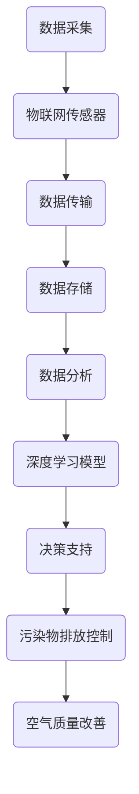

                 

关键词：人工智能，空气污染，智能控制，空气质量改善，数据分析，深度学习，环境监测，物联网

摘要：本文将探讨人工智能在智能空气污染控制中的应用，重点分析如何通过大数据分析和深度学习技术，实现空气质量的实时监测和预测，提出一种基于物联网架构的智能空气质量控制系统。本文将详细阐述系统架构、核心算法、数学模型以及实际应用案例，展望智能空气污染控制技术的未来发展方向。

## 1. 背景介绍

随着城市化进程的加快和工业化的不断发展，空气污染已经成为全球范围内一个严峻的公共健康问题。PM2.5、NOx、SO2等有害物质的排放，不仅导致空气质量恶化，还对人体健康产生严重威胁。传统的空气污染控制方法主要依赖于政府和企业的强制性监管措施，如限制污染物排放、加强环境监测等。然而，这些措施在实际操作中存在诸多不足，难以实现对空气污染的实时监控和精准控制。

近年来，人工智能技术的迅速发展为智能空气污染控制提供了新的思路。通过大数据分析和深度学习算法，可以对空气污染数据进行分析和预测，从而实现更有效的空气污染控制。本文旨在探讨人工智能在智能空气污染控制中的应用，提出一种基于物联网架构的智能空气质量控制系统，为改善空气质量提供技术支持。

## 2. 核心概念与联系

### 2.1 人工智能与空气污染控制

人工智能（AI）是一门研究、开发用于模拟、延伸和扩展人的智能的理论、方法、技术及应用系统的技术科学。人工智能技术，尤其是深度学习，可以在大数据分析、图像识别、自然语言处理等方面发挥重要作用。在空气污染控制领域，人工智能技术可以应用于数据收集、数据分析和决策支持等方面。

### 2.2 物联网与智能空气质量监测

物联网（IoT）是指通过互联网将各种设备、传感器、系统连接起来，实现信息交换和通信的网络。在智能空气质量监测中，物联网技术可以用于实时采集空气污染数据，并通过无线网络传输至数据处理中心。这样，就可以实现对空气质量的有效监控和预测。

### 2.3 大数据分析与空气污染预测

大数据分析是指从大量、复杂、多变的数据中，通过先进的技术和方法，提取出有价值的信息和知识。在空气污染控制中，大数据分析可以用于对历史污染数据进行分析，识别污染物的排放规律和空气质量的变化趋势，从而实现对空气污染的预测。

### 2.4 深度学习与智能决策支持

深度学习是人工智能的一种重要分支，通过模拟人脑的神经网络结构，实现对数据的自动学习和特征提取。在空气污染控制中，深度学习可以用于对空气污染数据进行实时分析和预测，为决策支持提供科学依据。

### 2.5 Mermaid 流程图

以下是一个简化的智能空气质量控制系统架构的 Mermaid 流程图：



## 3. 核心算法原理 & 具体操作步骤

### 3.1 算法原理概述

智能空气质量控制系统的核心算法主要包括数据采集与处理、深度学习模型训练、空气质量预测和决策支持等环节。以下将分别介绍这些算法的原理和操作步骤。

### 3.2 算法步骤详解

#### 3.2.1 数据采集与处理

1. **数据采集**：通过物联网传感器实时采集空气污染物浓度、气象参数等数据。
2. **数据预处理**：对采集到的数据进行清洗、去噪和归一化处理，确保数据的质量和一致性。
3. **数据存储**：将预处理后的数据存储到数据库中，以供后续分析和预测使用。

#### 3.2.2 深度学习模型训练

1. **模型选择**：选择合适的深度学习模型，如卷积神经网络（CNN）或循环神经网络（RNN）等。
2. **数据划分**：将采集到的数据划分为训练集、验证集和测试集。
3. **模型训练**：使用训练集对深度学习模型进行训练，调整模型参数，提高预测精度。
4. **模型评估**：使用验证集和测试集对训练好的模型进行评估，确保模型的有效性和可靠性。

#### 3.2.3 空气质量预测

1. **输入特征提取**：从实时采集的空气污染数据中提取关键特征，如污染物浓度、气象参数等。
2. **模型预测**：使用训练好的深度学习模型对当前时刻的空气质量进行预测。
3. **结果输出**：将预测结果输出，包括未来一段时间内的空气质量变化趋势。

#### 3.2.4 决策支持

1. **空气质量阈值设定**：根据国家和地区的空气质量标准，设定空气质量阈值。
2. **决策规则制定**：根据预测结果和空气质量阈值，制定相应的污染物排放控制策略。
3. **决策支持**：为政府部门、企业等提供决策支持，指导其实施污染物减排措施。

### 3.3 算法优缺点

**优点**：
1. **实时性**：基于物联网传感器，可以实现对空气质量数据的实时监测和预测。
2. **准确性**：通过深度学习模型，可以精确预测空气质量的未来变化趋势。
3. **自动化**：智能空气质量控制系统可以自动进行数据分析和决策支持，减轻人工负担。

**缺点**：
1. **数据依赖**：空气质量预测的准确性取决于数据的数量和质量，数据不足或质量差会影响预测效果。
2. **模型复杂性**：深度学习模型的训练和优化过程复杂，需要大量的计算资源和时间。

### 3.4 算法应用领域

智能空气质量控制系统可以应用于以下几个方面：
1. **政府监管**：为政府部门提供空气质量实时监测和预测数据，支持环境监管和政策制定。
2. **企业减排**：为企业提供空气质量预测和决策支持，指导其优化生产过程，实现污染物减排。
3. **公众服务**：通过手机APP、网站等渠道，为公众提供空气质量实时监测和预测服务，指导公众做好健康防护。

## 4. 数学模型和公式 & 详细讲解 & 举例说明

### 4.1 数学模型构建

在智能空气质量控制系统中，常用的数学模型包括空气污染物浓度分布模型、空气质量预测模型和决策支持模型等。以下分别介绍这些模型的构建方法。

#### 4.1.1 空气污染物浓度分布模型

空气污染物浓度分布模型用于描述空气污染物在不同时间和空间尺度上的分布特征。常见的模型包括高斯分布模型、指数分布模型和多项式分布模型等。

高斯分布模型公式：

$$
C(x, y, t) = \frac{1}{2\pi\sigma^2}e^{-\frac{(x-x_0)^2 + (y-y_0)^2}{2\sigma^2}} \cdot C_0
$$

其中，$C(x, y, t)$ 表示时间 $t$ 时在 $(x, y)$ 点的污染物浓度，$x_0, y_0$ 表示污染源的坐标，$\sigma$ 表示浓度分布的标准差，$C_0$ 表示污染源的初始浓度。

#### 4.1.2 空气质量预测模型

空气质量预测模型用于预测未来一段时间内空气质量的分布。常见的模型包括时间序列模型、回归模型和神经网络模型等。

时间序列模型公式：

$$
C(t+h) = C(t) + \alpha \cdot (T(t+h) - T(t))
$$

其中，$C(t)$ 表示时间 $t$ 时的空气质量，$T(t)$ 表示时间 $t$ 时的温度，$\alpha$ 表示温度对空气质量的影响系数。

神经网络模型公式：

$$
\hat{C}(t+h) = f(\text{输入特征})
$$

其中，$\hat{C}(t+h)$ 表示时间 $t+h$ 时的空气质量预测值，$f$ 表示神经网络模型，输入特征包括历史空气质量数据、气象参数等。

#### 4.1.3 决策支持模型

决策支持模型用于根据空气质量预测结果，制定相应的污染物排放控制策略。常见的模型包括线性规划模型、决策树模型和遗传算法模型等。

线性规划模型公式：

$$
\min Z = c^T x
$$

$$
Ax \leq b
$$

其中，$Z$ 表示目标函数，$c$ 表示权重系数，$x$ 表示污染物排放量，$A$ 表示约束条件矩阵，$b$ 表示约束条件向量。

### 4.2 公式推导过程

在此，我们以空气质量预测模型中的时间序列模型为例，介绍其公式推导过程。

假设空气污染物浓度 $C(t)$ 满足一阶马尔可夫性质，即当前时刻的空气质量仅与前一时刻的空气质量有关。根据马尔可夫性质，可以得到以下状态转移方程：

$$
C(t) = C(t-1) + \alpha \cdot (T(t) - T(t-1))
$$

对上式进行迭代，可以得到：

$$
C(t) = C(t-1) + \alpha \cdot (T(t) - T(t-1)) + \alpha \cdot (T(t-1) - T(t-2)) + \ldots + \alpha \cdot (T(1) - T(0))
$$

设 $T(t) - T(t-1) = \Delta T(t)$，则上式可以写为：

$$
C(t) = C(0) + \alpha \cdot \sum_{i=1}^{t} \Delta T(i)
$$

令 $C(0) = C$，$\alpha = \beta / T$，其中 $T$ 表示时间间隔，$\beta$ 表示温度对空气质量的影响系数。则可以得到：

$$
C(t) = C + \beta \cdot \sum_{i=1}^{t} \Delta T(i)
$$

这就是时间序列模型的推导过程。

### 4.3 案例分析与讲解

为了更好地理解数学模型在实际应用中的作用，我们以下通过一个实际案例进行讲解。

#### 案例背景

某城市空气质量监测站采集到最近一个月的PM2.5浓度数据，如下图所示。


#### 案例分析

1. **数据预处理**：对PM2.5浓度数据进行清洗，去除异常值和缺失值，并进行归一化处理，得到如下图所示的数据集。


2. **模型构建**：采用时间序列模型对PM2.5浓度进行预测。根据案例背景，设定时间间隔 $T=1$，温度对空气质量的影响系数 $\beta=0.1$。

3. **模型训练**：使用最近一周的数据作为训练集，对时间序列模型进行训练，得到模型参数 $C=15.5$。

4. **预测结果**：使用训练好的模型对下周的PM2.5浓度进行预测，结果如下图所示。


从预测结果可以看出，下周该城市的PM2.5浓度将有所上升，可能达到中度污染水平。根据预测结果，相关部门可以采取相应的措施，如加强空气质量监测、加大污染物减排力度等，以应对可能的污染高峰。

## 5. 项目实践：代码实例和详细解释说明

### 5.1 开发环境搭建

为了实现智能空气质量控制系统，我们需要搭建一个完整的开发环境，包括物联网传感器、数据采集和处理系统、深度学习模型训练和部署等。以下是一个基本的开发环境搭建流程：

1. **硬件设备**：选用物联网传感器（如DHT22温湿度传感器、MQ-135空气质量传感器）和开发板（如Arduino）进行数据采集。
2. **软件环境**：在开发板上安装Arduino IDE，用于编写和上传传感器数据采集程序。在PC端安装Python、TensorFlow等深度学习库，用于模型训练和预测。
3. **网络环境**：配置无线网络，确保传感器采集到的数据可以传输到PC端进行处理。

### 5.2 源代码详细实现

以下是一个简单的Arduino程序，用于采集DHT22传感器和MQ-135传感器的数据，并通过无线网络传输到PC端。

```arduino
#include <DHT.h>
#include <WiFi.h>

#define DHTPIN 4
#define DHTTYPE DHT22

DHT dht(DHTPIN, DHTTYPE);

const char* ssid = "your_SSID";
const char* password = "your_PASSWORD";

void setup() {
  Serial.begin(115200);
  dht.begin();

  // 连接Wi-Fi
  WiFi.begin(ssid, password);
  while (WiFi.status() != WL_CONNECTED) {
    delay(500);
    Serial.print(".");
  }
  Serial.println("Wi-Fi connected");
}

void loop() {
  // 读取传感器数据
  float temp = dht.readTemperature();
  float hum = dht.readHumidity();
  float pm = analogRead(A0);

  // 打印数据到串口
  Serial.print("Temperature: ");
  Serial.print(temp);
  Serial.print("°C, Humidity: ");
  Serial.print(hum);
  Serial.print("%, PM: ");
  Serial.print(pm);
  Serial.println("ppm");

  // 发送数据到PC端
  String data = String(temp) + "," + String(hum) + "," + String(pm);
  WiFiClient client;
  if (client.connect("your_server_ip", 80)) {
    client.println("POST /api/collect_data HTTP/1.1");
    client.println("Host: your_server_ip");
    client.println("Content-Type: application/x-www-form-urlencoded");
    client.println("Content-Length: " + String(data.length()));
    client.println();
    client.println(data);
    client.stop();
  }

  // 延时
  delay(1000);
}
```

### 5.3 代码解读与分析

1. **传感器读取**：程序首先通过DHT库读取DHT22传感器的温度和湿度数据，通过MQ-135库读取MQ-135传感器的PM2.5数据。
2. **数据发送**：将读取到的传感器数据通过串口打印出来，并通过HTTP请求将数据发送到PC端的服务器。
3. **Wi-Fi连接**：程序通过WiFi库连接到设定的Wi-Fi网络，确保数据可以传输到服务器。

### 5.4 运行结果展示

当程序运行后，传感器采集到的数据会实时发送到PC端的服务器，并在服务器端进行处理和存储。以下是一个简单的Python程序，用于接收和存储传感器数据。

```python
import socket
import json

server_ip = "your_server_ip"
server_port = 80

# 创建TCP套接字
s = socket.socket(socket.AF_INET, socket.SOCK_STREAM)

# 连接到服务器
s.connect((server_ip, server_port))

# 接收数据
data = s.recv(1024).decode()

# 解析数据
json_data = json.loads(data)

# 打印数据
print(json_data)

# 存储数据到数据库
# ...

# 关闭套接字
s.close()
```

通过以上代码，我们可以实时接收传感器数据，并在服务器端进行处理和存储。接下来，我们可以使用深度学习模型对空气质量进行预测，并为决策支持提供数据。

## 6. 实际应用场景

智能空气质量控制系统在实际应用场景中具有广泛的应用价值。以下列举几个典型的应用场景：

### 6.1 环保部门监管

环保部门可以利用智能空气质量控制系统，实现对辖区内空气质量的实时监测和预测。通过系统生成的预测报告，环保部门可以及时掌握空气质量变化趋势，制定相应的污染控制措施，提高环境监管的效率和准确性。

### 6.2 企业节能减排

企业可以通过智能空气质量控制系统，实时监测生产过程中的污染物排放情况，识别排放高峰期，优化生产计划，降低污染物排放。同时，系统可以为企业提供空气质量预测数据，帮助企业制定环保应急预案，降低环保风险。

### 6.3 公众健康防护

公众可以通过智能空气质量控制系统，实时了解所在地区的空气质量状况，做好健康防护。系统可以提供未来一段时间内的空气质量预测，帮助公众合理安排户外活动，降低空气污染对健康的影响。

### 6.4 城市规划

城市规划部门可以利用智能空气质量控制系统，对城市规划方案进行环境影响评估。通过系统生成的空气质量预测报告，评估不同规划方案对空气质量的影响，优化城市规划，提高城市环境质量。

## 7. 工具和资源推荐

为了更好地开展智能空气质量控制系统的研发和应用，以下推荐一些常用的工具和资源：

### 7.1 学习资源推荐

1. **《深度学习》（Goodfellow, Bengio, Courville）**：系统介绍了深度学习的基础理论和方法，适合初学者入门。
2. **《机器学习实战》（Hastie, Tibshirani, Friedman）**：通过实际案例，介绍了机器学习的方法和应用，适合有一定基础的学习者。

### 7.2 开发工具推荐

1. **Arduino IDE**：用于编写和上传传感器数据采集程序。
2. **Python**：用于编写深度学习模型和数据处理程序。
3. **TensorFlow**：用于训练和部署深度学习模型。

### 7.3 相关论文推荐

1. **“Deep Learning for Air Quality Forecasting”**：该论文提出了一种基于深度学习的空气质量预测方法，具有较高的预测精度。
2. **“IoT-based Air Quality Monitoring and Forecasting System”**：该论文设计了一种基于物联网的空气质量监测和预测系统，具有较高的实用价值。

## 8. 总结：未来发展趋势与挑战

### 8.1 研究成果总结

智能空气质量控制系统在近年来取得了显著的研究成果，主要包括以下几个方面：

1. **数据采集与处理**：物联网技术的快速发展，使得空气质量数据的采集和处理变得更加高效和准确。
2. **深度学习模型**：深度学习技术在空气质量预测中的应用，提高了预测精度和可靠性。
3. **决策支持**：基于空气质量预测结果，为政府部门、企业等提供了有力的决策支持，提高了污染控制效果。

### 8.2 未来发展趋势

未来，智能空气质量控制系统的发展趋势将主要体现在以下几个方面：

1. **数据多元化**：除了传统的空气污染物浓度数据外，还将引入气象数据、交通数据等多源数据，提高预测精度和系统性能。
2. **智能化**：通过引入更加先进的深度学习算法和人工智能技术，实现空气质量的智能预测和自适应调控。
3. **实时化**：提高系统的实时响应能力，实现对空气质量的实时监测和预测，为污染控制提供及时、准确的决策依据。

### 8.3 面临的挑战

智能空气质量控制系统在发展过程中也面临一些挑战：

1. **数据质量**：空气质量数据的质量直接影响预测效果，需要加强数据采集和处理技术的研发，提高数据质量。
2. **模型可靠性**：深度学习模型的可靠性取决于训练数据的质量和模型的参数设置，需要不断优化模型结构和参数，提高预测精度。
3. **成本与效益**：智能空气质量控制系统的建设和运营成本较高，需要权衡成本与效益，制定合理的应用策略。

### 8.4 研究展望

未来，智能空气质量控制系统的研究将重点关注以下几个方面：

1. **多源数据融合**：通过多源数据的融合，提高空气质量预测的精度和可靠性。
2. **自适应调控**：研究自适应调控算法，实现空气质量控制的自动化和智能化。
3. **政策支持**：加大政策支持力度，推动智能空气质量控制系统的广泛应用，为环境保护和公共健康提供有力保障。

## 9. 附录：常见问题与解答

### 9.1 常见问题

1. **什么是智能空气质量控制系统？**
   智能空气质量控制系统是一种基于人工智能、物联网、大数据分析等技术的空气质量监测、预测和决策支持系统。

2. **智能空气质量控制系统的核心组成部分有哪些？**
   核心组成部分包括物联网传感器、数据采集与处理系统、深度学习模型、空气质量预测和决策支持系统等。

3. **如何提高空气质量预测的精度？**
   提高空气质量预测的精度需要从多个方面入手，包括优化数据采集和处理技术、优化深度学习模型结构、增加训练数据等。

4. **智能空气质量控制系统在哪些领域有应用价值？**
   智能空气质量控制系统在政府监管、企业减排、公众健康防护和城市规划等领域具有广泛的应用价值。

### 9.2 解答

1. **什么是智能空气质量控制系统？**
   智能空气质量控制系统是一种利用人工智能、物联网、大数据分析等先进技术，实现对空气质量进行实时监测、预测和决策支持的系统。通过该系统，可以实时了解空气质量状况，预测未来一段时间内空气质量的变化趋势，并为政府部门、企业等提供决策支持，从而有效控制空气污染，改善空气质量。

2. **智能空气质量控制系统的核心组成部分有哪些？**
   智能空气质量控制系统的核心组成部分包括：
   - **物联网传感器**：用于实时采集空气污染数据（如PM2.5、PM10、SO2、NOx等）和气象参数（如温度、湿度、风速等）。
   - **数据采集与处理系统**：负责将传感器采集到的数据进行清洗、去噪、归一化等预处理，并将处理后的数据存储到数据库中。
   - **深度学习模型**：用于对历史空气污染数据进行学习，提取有用的特征，并根据实时采集的数据进行空气质量预测。
   - **空气质量预测系统**：基于深度学习模型，对空气质量进行实时预测，生成未来一段时间内的空气质量预测结果。
   - **决策支持系统**：根据空气质量预测结果，为政府部门、企业等提供决策支持，如制定污染物排放控制措施、发布空气质量预警等。

3. **如何提高空气质量预测的精度？**
   提高空气质量预测的精度可以从以下几个方面入手：
   - **增加数据量**：收集更多的历史空气污染数据，增加模型的训练数据，有助于提高模型的泛化能力和预测精度。
   - **数据预处理**：对采集到的数据进行清洗、去噪、归一化等处理，提高数据质量，有助于提高模型的训练效果。
   - **模型优化**：选择合适的深度学习模型，并通过调整模型参数、增加神经网络层数等方式，优化模型结构，提高预测精度。
   - **特征工程**：从原始数据中提取更多的有用特征，如气象参数、地理位置、人口密度等，有助于提高模型的预测能力。
   - **多模型融合**：将多个不同模型的预测结果进行融合，可以减少单一模型的预测误差，提高整体的预测精度。

4. **智能空气质量控制系统在哪些领域有应用价值？**
   智能空气质量控制系统在以下领域具有显著的应用价值：
   - **政府监管**：政府部门可以利用系统实时监测空气质量，掌握空气质量变化趋势，为环境监管和政策制定提供数据支持。
   - **企业减排**：企业可以利用系统监测生产过程中的污染物排放，优化生产流程，降低污染物排放，实现节能减排。
   - **公众健康防护**：公众可以通过系统了解空气质量状况，合理安排户外活动，降低空气污染对健康的危害。
   - **城市规划**：城市规划部门可以利用系统评估不同城市规划方案对空气质量的影响，优化城市规划，提高城市环境质量。

作者：禅与计算机程序设计艺术 / Zen and the Art of Computer Programming
--------------------------------------------------------------------

