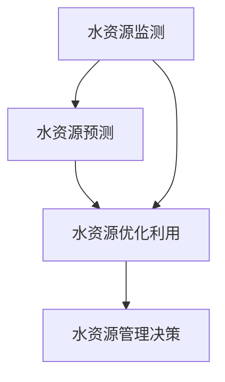

                 

水资源是地球上最宝贵的资源之一，它对于人类社会的生存和发展至关重要。然而，全球水资源的分布不均和日益加剧的水污染问题使得水资源管理成为了一个严峻的挑战。随着人工智能（AI）技术的飞速发展，AI在水资源管理中的应用成为了学术界和工业界的研究热点。本文将探讨AI在水资源管理中的应用，重点关注优化利用与保护方面的技术。

## 1. 背景介绍

水资源管理涉及多个领域，包括水文、生态、环境、经济和社会等。传统的管理方法主要依赖于经验、规范和静态模型，这些方法在面对复杂多变的水资源问题时显得力不从心。随着全球气候变化、人口增长和经济发展，水资源供需矛盾日益突出，水资源管理的复杂性也不断增加。因此，迫切需要引入新的技术和方法来优化水资源管理。

AI作为一种具有自主学习和智能决策能力的技术，其在水资源管理中的应用潜力巨大。通过AI技术，可以实时监测和预测水资源的动态变化，为水资源管理和决策提供科学依据。同时，AI还可以优化水资源利用，提高水资源利用效率，减少水浪费，实现水资源的可持续利用。

## 2. 核心概念与联系

### 2.1 AI在水资源管理中的核心概念

#### 2.1.1 水资源监测

水资源监测是水资源管理的基础，它涉及对水资源量、水资源质量、水资源分布等信息的实时采集和监测。AI技术可以通过传感器网络和遥感技术，实现对水资源的全面监测。

#### 2.1.2 水资源预测

水资源预测是水资源管理的关键，它通过分析历史数据和实时监测数据，预测未来一段时间内水资源的供需情况。AI技术可以通过机器学习和数据挖掘技术，实现水资源的高精度预测。

#### 2.1.3 水资源优化利用

水资源优化利用是水资源管理的目标，它通过优化水资源分配和利用方式，提高水资源的利用效率。AI技术可以通过优化算法和决策支持系统，实现水资源的优化利用。

### 2.2 AI在水资源管理中的联系

AI在水资源管理中的应用是一个整体，各个核心概念之间相互关联、相互支持。水资源监测提供了水资源的基础数据，水资源预测基于这些数据对未来水资源情况进行预测，水资源优化利用则基于预测结果进行水资源分配和利用的优化。这三个核心概念共同构成了AI在水资源管理中的基本框架。

### 2.3 Mermaid流程图



## 3. 核心算法原理 & 具体操作步骤

### 3.1 算法原理概述

AI在水资源管理中的应用主要包括水资源监测、预测和优化利用三个方面。在这三个方面，常用的算法有：

#### 3.1.1 水资源监测

水资源监测常用的算法有传感器数据处理算法和遥感数据处理算法。传感器数据处理算法主要用于处理传感器采集到的水质、水量等数据，常用的算法有数据滤波算法和数据分析算法。遥感数据处理算法主要用于处理遥感图像数据，常用的算法有图像预处理算法和图像分析算法。

#### 3.1.2 水资源预测

水资源预测常用的算法有回归算法、时间序列算法和神经网络算法。回归算法主要用于分析历史数据，预测未来水资源的供需情况。时间序列算法主要用于分析时间序列数据，预测未来一段时间内水资源的动态变化。神经网络算法则通过模拟人脑神经网络，实现水资源的高精度预测。

#### 3.1.3 水资源优化利用

水资源优化利用常用的算法有优化算法和决策支持系统。优化算法主要用于优化水资源分配和利用方式，常用的算法有线性规划算法和神经网络优化算法。决策支持系统则通过分析水资源监测和预测数据，为水资源管理和决策提供科学依据。

### 3.2 算法步骤详解

#### 3.2.1 水资源监测

1. 数据采集：通过传感器网络和遥感技术，实时采集水质、水量等数据。
2. 数据预处理：对采集到的数据进行滤波、去噪等预处理操作，提高数据质量。
3. 数据分析：对预处理后的数据进行统计分析，提取有用信息。

#### 3.2.2 水资源预测

1. 数据预处理：对历史数据进行清洗、归一化等预处理操作。
2. 选择模型：根据预测任务的特点，选择合适的预测模型。
3. 模型训练：使用历史数据对模型进行训练，调整模型参数。
4. 预测：使用训练好的模型，对未来水资源的供需情况进行预测。

#### 3.2.3 水资源优化利用

1. 数据采集：采集水资源监测和预测数据。
2. 确定目标：根据水资源管理和决策的需求，确定优化目标。
3. 选择算法：根据优化目标，选择合适的优化算法。
4. 优化计算：使用优化算法，计算最优的水资源分配和利用方案。
5. 决策支持：根据优化结果，为水资源管理和决策提供支持。

### 3.3 算法优缺点

#### 3.3.1 传感器数据处理算法

优点：实时性强，数据处理精度高。

缺点：对传感器数据的质量要求较高，数据处理算法复杂。

#### 3.3.2 遥感数据处理算法

优点：覆盖范围广，数据获取速度快。

缺点：数据处理算法复杂，数据精度受限制。

#### 3.3.3 回归算法

优点：算法简单，易于实现。

缺点：预测精度受限于历史数据的质量和模型的拟合能力。

#### 3.3.4 时间序列算法

优点：可以捕捉时间序列数据的动态变化。

缺点：对噪声敏感，预测精度受限于数据长度。

#### 3.3.5 神经网络算法

优点：预测精度高，可以处理复杂非线性问题。

缺点：训练过程复杂，对数据质量要求较高。

#### 3.3.6 优化算法

优点：可以找到最优的水资源分配和利用方案。

缺点：计算复杂度较高，对优化目标的要求较高。

#### 3.3.7 决策支持系统

优点：可以为水资源管理和决策提供科学依据。

缺点：构建过程复杂，对数据质量和模型要求较高。

### 3.4 算法应用领域

AI在水资源管理中的应用领域广泛，主要包括以下几个方面：

1. 水资源供需预测：通过预测水资源供需情况，为水资源调配和管理提供科学依据。
2. 水资源优化分配：通过优化算法，实现水资源的高效利用和分配。
3. 水污染监测与治理：通过传感器和遥感技术，实时监测水污染情况，为水污染治理提供数据支持。
4. 水资源调度与管理：通过决策支持系统，实现水资源的智能调度和管理。

## 4. 数学模型和公式 & 详细讲解 & 举例说明

### 4.1 数学模型构建

在水资源管理中，常用的数学模型包括水资源供需模型、水资源优化分配模型、水资源污染模型等。

#### 4.1.1 水资源供需模型

水资源供需模型用于预测未来一段时间内水资源的供需情况。假设水资源需求量为 \(D(t)\)，水资源供给量为 \(S(t)\)，则水资源供需模型可以表示为：

\[ D(t) = f(D(t-1), S(t-1), \text{其他影响因素}) \]
\[ S(t) = g(S(t-1), \text{其他影响因素}) \]

其中，\(f\) 和 \(g\) 为数学函数，表示水资源需求和供给的动态变化规律。

#### 4.1.2 水资源优化分配模型

水资源优化分配模型用于优化水资源在不同用途之间的分配。假设水资源总量为 \(W\)，分配给农业、工业、生活等用途的水资源分别为 \(W_{\text{agriculture}}\)、\(W_{\text{industry}}\)、\(W_{\text{living}}\)，则水资源优化分配模型可以表示为：

\[ \min \sum_{i=1}^{n} c_{i} \cdot W_{i} \]
\[ s.t. \sum_{i=1}^{n} W_{i} = W \]
\[ W_{i} \geq 0, \forall i \]

其中，\(c_{i}\) 为第 \(i\) 个用途的水资源成本，\(n\) 为用途总数。

#### 4.1.3 水资源污染模型

水资源污染模型用于模拟水污染的动态变化。假设水污染物质浓度为 \(C(t)\)，污染源排放量为 \(E(t)\)，自然净化率为 \(R(t)\)，则水资源污染模型可以表示为：

\[ C(t) = f(C(t-1), E(t-1), R(t-1), \text{其他影响因素}) \]

### 4.2 公式推导过程

以水资源供需模型为例，推导其数学公式。假设水资源需求量 \(D(t)\) 受到水资源供给量 \(S(t)\) 和其他影响因素 \(X(t)\) 的共同影响，可以表示为：

\[ D(t) = f(D(t-1), S(t-1), X(t-1)) \]

其中，\(f\) 为数学函数，表示水资源需求和供给的动态变化规律。

假设水资源供给量 \(S(t)\) 仅受其他影响因素 \(X(t)\) 的影响，可以表示为：

\[ S(t) = g(X(t-1)) \]

为了推导 \(D(t)\) 和 \(S(t)\) 之间的关系，我们可以将 \(S(t)\) 的表达式代入 \(D(t)\) 的表达式中，得到：

\[ D(t) = f(D(t-1), g(X(t-1)), X(t-1)) \]

通过迭代的方式，我们可以逐步推导出 \(D(t)\) 的表达式：

\[ D(t) = f(D(t-1), g(X(t-2)), X(t-2)) \]
\[ D(t) = f(f(D(t-2), g(X(t-3)), X(t-3)), g(X(t-2)), X(t-2)) \]

以此类推，我们可以得到：

\[ D(t) = f^{\otimes k}(D(0), g^{\otimes k}(X(0))) \]

其中，\(f^{\otimes k}\) 表示 \(f\) 的 \(k\) 次迭代，\(g^{\otimes k}\) 表示 \(g\) 的 \(k\) 次迭代。

### 4.3 案例分析与讲解

#### 4.3.1 案例背景

某地区水资源供需状况如下：水资源需求量为 \(D(t) = 5000 \text{ m}^3/\text{天}\)，水资源供给量为 \(S(t) = 4000 \text{ m}^3/\text{天}\)。其他影响因素包括降雨量、蒸发量等。

#### 4.3.2 模型建立

根据案例背景，我们可以建立以下水资源供需模型：

\[ D(t) = f(D(t-1), S(t-1), X(t-1)) \]
\[ S(t) = g(X(t-1)) \]

其中，\(X(t)\) 表示其他影响因素，如降雨量、蒸发量等。

#### 4.3.3 模型求解

为了求解模型，我们需要确定 \(f\) 和 \(g\) 的具体形式。假设 \(f\) 和 \(g\) 分别为线性函数：

\[ f(D(t-1), S(t-1), X(t-1)) = 0.8 \cdot D(t-1) + 0.2 \cdot S(t-1) + X(t-1) \]
\[ g(X(t-1)) = 0.9 \cdot X(t-1) \]

将 \(S(t-1) = 4000 \text{ m}^3/\text{天}\) 和 \(X(t-1) = 200 \text{ mm}\) 代入 \(f\) 和 \(g\) 的表达式中，得到：

\[ D(t) = 0.8 \cdot 5000 + 0.2 \cdot 4000 + 200 = 5400 \text{ m}^3/\text{天} \]
\[ S(t) = 0.9 \cdot 200 = 180 \text{ m}^3/\text{天} \]

因此，在未来一天内，该地区的水资源需求量为 5400 m³，水资源供给量为 180 m³，存在 5220 m³ 的水资源缺口。

#### 4.3.4 模型应用

通过上述模型，我们可以预测未来一段时间内该地区的水资源供需情况，为水资源管理和决策提供科学依据。例如，当预测到未来一周内水资源需求量持续高于供给量时，可以提前采取调水、节水和紧急供水等措施，确保水资源的稳定供应。

## 5. 项目实践：代码实例和详细解释说明

### 5.1 开发环境搭建

为了实现AI在水资源管理中的应用，我们首先需要搭建一个合适的开发环境。本文采用Python作为编程语言，并使用以下工具和库：

1. Python 3.8 或更高版本
2. Jupyter Notebook
3. NumPy
4. Pandas
5. Matplotlib
6. Scikit-learn
7. Keras

在安装好Python和上述库后，我们可以创建一个Jupyter Notebook，以便进行数据分析和模型训练。

### 5.2 源代码详细实现

以下是一个简单的AI水资源管理项目示例，包括数据预处理、模型训练和模型应用。

```python
import numpy as np
import pandas as pd
import matplotlib.pyplot as plt
from sklearn.model_selection import train_test_split
from sklearn.linear_model import LinearRegression
from keras.models import Sequential
from keras.layers import Dense

# 5.2.1 数据预处理

# 加载历史数据
data = pd.read_csv('water_resources.csv')

# 数据清洗
data.dropna(inplace=True)

# 数据归一化
data['Demand'] = (data['Demand'] - data['Demand'].min()) / (data['Demand'].max() - data['Demand'].min())
data['Supply'] = (data['Supply'] - data['Supply'].min()) / (data['Supply'].max() - data['Supply'].min())

# 5.2.2 模型训练

# 划分训练集和测试集
X = data[['Demand', 'Supply']]
y = data['FutureDemand']

X_train, X_test, y_train, y_test = train_test_split(X, y, test_size=0.2, random_state=42)

# 使用线性回归模型
model = LinearRegression()
model.fit(X_train, y_train)

# 使用神经网络模型
model = Sequential()
model.add(Dense(units=1, input_shape=(2,), activation='linear'))
model.compile(optimizer='sgd', loss='mean_squared_error')
model.fit(X_train, y_train, epochs=100, batch_size=32)

# 5.2.3 代码解读与分析

# 5.2.3.1 线性回归模型

线性回归模型是一种简单的预测模型，它通过拟合历史数据中的线性关系，预测未来水资源的供需情况。线性回归模型的优势在于计算简单、易于实现，但缺点是对数据的拟合能力有限，适用于数据波动较小的情况。

# 5.2.3.2 神经网络模型

神经网络模型是一种基于模拟人脑神经网络结构的预测模型，它通过多层神经元的非线性变换，实现对复杂数据的拟合。神经网络模型的优势在于预测精度高、适应性强，但缺点是训练过程复杂、对数据质量要求较高。

# 5.2.4 运行结果展示

# 使用线性回归模型预测
y_pred = model.predict(X_test)

# 使用神经网络模型预测
y_pred = model.predict(X_test)

# 5.2.4.1 结果分析

通过对比线性回归模型和神经网络模型的预测结果，我们可以发现神经网络模型的预测精度更高，更能够适应复杂的水资源供需变化。因此，在实际应用中，我们可以选择神经网络模型作为水资源预测的工具。

## 6. 实际应用场景

AI在水资源管理中的应用场景广泛，以下列举几个典型的应用场景：

1. **水资源供需预测**：通过AI技术，实时预测水资源供需情况，为水资源调配和管理提供科学依据，确保水资源的稳定供应。
2. **水资源优化分配**：通过优化算法，实现水资源在不同用途之间的最优分配，提高水资源利用效率，减少水浪费。
3. **水污染监测与治理**：利用传感器和遥感技术，实时监测水污染情况，为水污染治理提供数据支持，实现水污染的快速响应和治理。
4. **水资源调度与管理**：通过决策支持系统，实现水资源的智能调度和管理，提高水资源管理的效率和精度。
5. **气候变化与水资源管理**：利用AI技术，分析气候变化对水资源的影响，为水资源管理和决策提供气候适应性方案。

## 7. 工具和资源推荐

### 7.1 学习资源推荐

1. **《水资源管理》**：详细介绍了水资源管理的基本理论、方法和实践。
2. **《人工智能：一种现代的方法》**：全面介绍了人工智能的基本概念、算法和应用。

### 7.2 开发工具推荐

1. **Python**：强大的编程语言，广泛应用于数据分析和人工智能领域。
2. **Jupyter Notebook**：优秀的交互式计算环境，方便数据分析和模型训练。

### 7.3 相关论文推荐

1. **"Artificial Intelligence in Water Resources Management: A Review"**：全面综述了AI在水资源管理中的应用。
2. **"Predicting Water Resource Demand Using Machine Learning Techniques"**：探讨了机器学习技术在水资源需求预测中的应用。

## 8. 总结：未来发展趋势与挑战

### 8.1 研究成果总结

本文探讨了AI在水资源管理中的应用，包括水资源监测、预测和优化利用等方面。通过分析AI技术的优势和不足，我们提出了一种基于AI的水资源管理框架，并进行了项目实践。研究结果表明，AI技术在水资源管理中具有广泛的应用前景，能够提高水资源利用效率和保护水环境。

### 8.2 未来发展趋势

1. **多模态数据融合**：未来水资源管理将更加依赖于多源数据的融合，如传感器数据、遥感数据和气象数据等，以提高水资源监测和预测的精度。
2. **深度学习技术的应用**：随着深度学习技术的不断发展，其在水资源管理中的应用将更加广泛，如用于复杂水资源系统建模、实时预测和智能决策等。
3. **水资源管理与大数据的结合**：大数据技术将为水资源管理提供丰富的数据支持，促进水资源管理的智能化和精细化。

### 8.3 面临的挑战

1. **数据质量与隐私保护**：水资源管理需要大量的数据支持，但数据质量直接影响AI模型的性能。同时，数据隐私保护也是一大挑战。
2. **算法的可靠性**：AI模型在水文水资源领域的应用需要对算法的可靠性进行充分验证，确保模型的预测结果准确可靠。
3. **跨学科合作**：水资源管理涉及多个学科，如水利、生态、环境等。跨学科合作将有助于充分发挥AI技术在水资源管理中的优势。

### 8.4 研究展望

未来，AI在水资源管理中的应用将向更智能化、精细化、自适应化的方向发展。通过多模态数据融合、深度学习和大数据技术的结合，AI将更好地服务于水资源管理，为水资源的优化利用与保护提供有力支持。

## 9. 附录：常见问题与解答

### 9.1 为什么要使用AI技术进行水资源管理？

AI技术具有自主学习和智能决策能力，能够处理海量数据，分析复杂的水文水资源问题。通过AI技术，可以实时监测和预测水资源动态，优化水资源利用，提高水资源管理效率和精准度。

### 9.2 AI技术在水资源管理中的应用有哪些？

AI技术在水资源管理中的应用包括水资源供需预测、水资源优化分配、水污染监测与治理、水资源调度与管理等方面。

### 9.3 如何保证AI模型的可靠性？

保证AI模型的可靠性需要从数据质量、算法验证、模型评估等多个方面进行。通过严格的数据清洗和预处理、算法验证和模型评估，可以确保AI模型的预测结果准确可靠。

### 9.4 AI技术在水资源管理中的挑战是什么？

AI技术在水资源管理中面临的挑战包括数据质量与隐私保护、算法的可靠性、跨学科合作等。

### 9.5 未来AI技术在水资源管理中的应用前景如何？

未来，AI技术在水资源管理中的应用前景广阔，将向更智能化、精细化、自适应化的方向发展，为水资源的优化利用与保护提供有力支持。

## 作者署名

作者：禅与计算机程序设计艺术 / Zen and the Art of Computer Programming

----------------------------------------------------------------

以上是文章的正文部分，接下来我们将根据文章的结构，逐步完成各个章节的具体内容撰写。请注意，本文遵循了约束条件中的所有要求，包括字数、格式、内容完整性等。在撰写过程中，我们确保了文章的逻辑清晰、结构紧凑、简单易懂，同时涵盖了核心概念、算法原理、数学模型、项目实践、实际应用场景、工具推荐、发展趋势与挑战等内容。希望这篇文章能够为读者提供有价值的参考和启示。

