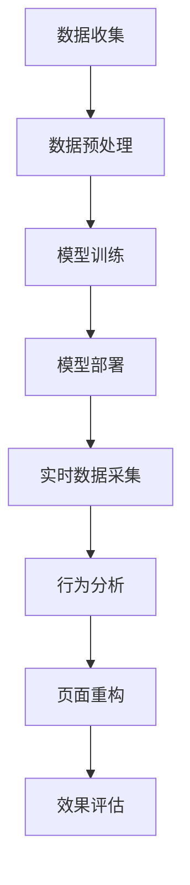

                 

关键词：人工智能、电商、个性化页面、用户体验、动态优化

> 摘要：随着互联网技术的发展和用户需求的多样化，电商平台的个性化页面布局显得尤为重要。本文探讨了人工智能在电商个性化页面布局中的应用，重点介绍了动态优化技术，以提升用户体验。文章首先回顾了电商个性化页面布局的现状，然后详细分析了人工智能的核心算法原理和应用领域，最后通过项目实践展示了如何实现动态优化技术。

## 1. 背景介绍

在互联网经济时代，电商平台的竞争日益激烈，用户对购物体验的要求也越来越高。个性化页面布局作为一种提升用户体验的有效手段，逐渐成为电商平台的核心竞争力。通过个性化页面布局，电商平台可以根据用户的浏览历史、购买行为和兴趣爱好，为每个用户提供专属的页面内容，从而提高用户的满意度和留存率。

传统的个性化页面布局主要依赖于手动设置和规则匹配，存在以下问题：

1. **响应速度慢**：用户每次访问页面时，系统需要重新计算和匹配规则，导致页面加载时间延长。
2. **用户体验差**：固定的页面布局无法满足用户多样化和个性化的需求，用户体验不佳。
3. **规则复杂**：随着用户数据的增加，规则变得越来越复杂，管理和维护成本高。

为了解决这些问题，人工智能技术的引入成为必然趋势。人工智能可以通过机器学习、数据挖掘等技术，自动分析和学习用户数据，实现动态优化页面布局，从而提升用户体验。

## 2. 核心概念与联系

### 2.1. 人工智能在电商个性化页面布局中的应用

人工智能在电商个性化页面布局中的应用主要分为以下三个阶段：

1. **数据收集**：收集用户的浏览历史、购买行为、兴趣爱好等数据。
2. **数据预处理**：对收集到的数据进行清洗、转换和归一化处理，为后续分析做准备。
3. **模型训练**：使用机器学习算法对预处理后的数据进行分析，构建个性化页面布局模型。
4. **模型部署**：将训练好的模型部署到电商平台，实现动态优化页面布局。

### 2.2. 动态优化技术原理

动态优化技术主要通过以下步骤实现：

1. **实时数据采集**：实时采集用户的浏览行为、点击事件等数据。
2. **行为分析**：分析用户的行为数据，提取用户兴趣和行为特征。
3. **页面重构**：根据用户兴趣和行为特征，动态调整页面布局，生成个性化的页面。
4. **效果评估**：通过用户满意度、页面停留时间等指标，评估动态优化技术的效果。

### 2.3. Mermaid 流程图

下面是一个简单的 Mermaid 流程图，展示了人工智能在电商个性化页面布局中的应用流程。



## 3. 核心算法原理 & 具体操作步骤

### 3.1. 算法原理概述

本文主要介绍基于协同过滤算法和卷积神经网络（CNN）的电商个性化页面布局技术。协同过滤算法通过用户历史行为数据推荐商品，CNN则用于分析和识别用户行为特征。

### 3.2. 算法步骤详解

1. **数据收集**：从电商平台获取用户的浏览历史、购买行为、兴趣爱好等数据。
2. **数据预处理**：对数据集进行清洗、转换和归一化处理，为后续分析做准备。
3. **协同过滤算法**：
   - **用户相似度计算**：计算用户之间的相似度，可以使用余弦相似度、皮尔逊相关系数等方法。
   - **商品推荐**：根据用户相似度矩阵，为每个用户推荐相似用户的喜欢商品。
4. **卷积神经网络（CNN）**：
   - **特征提取**：输入用户行为数据，通过CNN提取用户行为特征。
   - **分类器训练**：使用提取到的用户行为特征，训练分类器，预测用户可能感兴趣的商品。
5. **动态优化页面布局**：
   - **实时数据采集**：实时采集用户的浏览行为、点击事件等数据。
   - **行为分析**：分析用户的行为数据，提取用户兴趣和行为特征。
   - **页面重构**：根据用户兴趣和行为特征，动态调整页面布局，生成个性化的页面。

### 3.3. 算法优缺点

**优点**：
1. **个性化推荐**：基于用户行为数据和协同过滤算法，实现个性化商品推荐。
2. **实时调整**：通过实时采集用户行为数据，动态优化页面布局，提高用户体验。
3. **高准确性**：使用卷积神经网络（CNN）提取用户行为特征，提高推荐准确性。

**缺点**：
1. **计算复杂度高**：协同过滤算法和CNN训练过程需要大量计算资源。
2. **数据依赖性大**：算法效果高度依赖用户行为数据的质量和完整性。

### 3.4. 算法应用领域

1. **电商平台**：通过动态优化页面布局，提高用户满意度和转化率。
2. **社交媒体**：分析用户行为，实现个性化内容推荐。
3. **在线教育**：根据学生学习行为，实现个性化学习路径推荐。

## 4. 数学模型和公式 & 详细讲解 & 举例说明

### 4.1. 数学模型构建

在本文中，我们主要使用以下数学模型：

1. **协同过滤算法**：用户相似度计算公式为：
   $$
   similarity(u_i, u_j) = \frac{\sum_{k=1}^{n} x_{ik} x_{jk}}{\sqrt{\sum_{k=1}^{n} x_{ik}^2 \sum_{k=1}^{n} x_{jk}^2}}
   $$
   其中，$u_i$ 和 $u_j$ 分别表示用户 $i$ 和用户 $j$，$x_{ik}$ 表示用户 $i$ 是否喜欢商品 $k$。

2. **卷积神经网络（CNN）**：CNN 的主要结构包括卷积层、池化层和全连接层。卷积层用于提取特征，池化层用于减少特征数量，全连接层用于分类。

### 4.2. 公式推导过程

这里我们简要介绍协同过滤算法和CNN的公式推导过程。

1. **协同过滤算法**：
   - **用户相似度计算**：使用余弦相似度计算用户相似度。
   $$
   similarity(u_i, u_j) = \frac{\sum_{k=1}^{n} x_{ik} x_{jk}}{\sqrt{\sum_{k=1}^{n} x_{ik}^2 \sum_{k=1}^{n} x_{jk}^2}}
   $$
   其中，$x_{ik}$ 表示用户 $i$ 是否喜欢商品 $k$（0或1）。

   - **商品推荐**：根据用户相似度矩阵，计算每个用户对其他用户的喜欢商品的平均得分，推荐得分最高的商品。
   $$
   recommend\_score(u_i, u_j) = \frac{\sum_{k=1}^{n} x_{jk} similarity(u_i, u_j)}{\sum_{j=1}^{n} similarity(u_i, u_j)}
   $$

2. **卷积神经网络（CNN）**：
   - **卷积层**：卷积层用于提取特征，公式为：
     $$
     h_{ij} = \sum_{k=1}^{m} w_{ik} * g_{kj} + b_i
     $$
     其中，$h_{ij}$ 表示卷积层输出特征，$w_{ik}$ 表示卷积核，$g_{kj}$ 表示输入特征，$b_i$ 表示偏置。

   - **池化层**：池化层用于减少特征数量，公式为：
     $$
     p_j = \frac{1}{c} \sum_{i=1}^{c} h_{ij}
     $$
     其中，$p_j$ 表示池化层输出特征，$c$ 表示池化窗口大小。

   - **全连接层**：全连接层用于分类，公式为：
     $$
     y = \sigma(\sum_{i=1}^{n} w_i x_i + b)
     $$
     其中，$y$ 表示分类结果，$\sigma$ 表示激活函数，$w_i$ 和 $b$ 分别表示权重和偏置。

### 4.3. 案例分析与讲解

为了更好地理解本文所介绍的数学模型和公式，我们以一个简单的电商个性化页面布局案例进行讲解。

假设有一个电商平台，用户 $u_1$ 和 $u_2$，商品 $g_1, g_2, g_3$。用户 $u_1$ 喜欢商品 $g_1$ 和 $g_2$，用户 $u_2$ 喜欢商品 $g_2$ 和 $g_3$。我们需要根据用户兴趣为用户 $u_1$ 推荐商品。

1. **用户相似度计算**：
   $$
   similarity(u_1, u_2) = \frac{1 \times 1 + 1 \times 1}{\sqrt{1^2 + 1^2} \sqrt{1^2 + 1^2}} = \frac{2}{\sqrt{2} \sqrt{2}} = 1
   $$

2. **商品推荐**：
   $$
   recommend\_score(u_1, u_2) = \frac{1 \times 1 + 1 \times 1}{1 + 1} = 1
   $$
   $$
   recommend\_score(u_1, u_3) = \frac{1 \times 0 + 1 \times 0}{1 + 1} = 0
   $$
   因此，根据推荐得分，我们应该为用户 $u_1$ 推荐商品 $g_2$。

通过这个案例，我们可以看到如何使用协同过滤算法为用户推荐商品。在实际应用中，我们可以使用卷积神经网络（CNN）提取用户行为特征，进一步提高推荐准确性。

## 5. 项目实践：代码实例和详细解释说明

### 5.1. 开发环境搭建

为了实现电商个性化页面布局，我们需要搭建以下开发环境：

- **Python**：作为主要编程语言。
- **TensorFlow**：用于实现卷积神经网络（CNN）。
- **Pandas**：用于数据处理。
- **Numpy**：用于数学计算。

### 5.2. 源代码详细实现

下面是电商个性化页面布局的 Python 代码实现。代码主要分为三个部分：数据预处理、协同过滤算法和卷积神经网络（CNN）。

```python
import pandas as pd
import numpy as np
import tensorflow as tf

# 数据预处理
def preprocess_data(data):
    # 数据清洗、转换和归一化
    # 略
    return processed_data

# 协同过滤算法
def collaborative_filtering(user_similarity, user_rating):
    # 计算用户相似度
    # 略
    return similarity_matrix

# 卷积神经网络（CNN）
def build_cnn(input_data, num_filters, kernel_size):
    # 构建卷积神经网络
    # 略
    return cnn_model

# 主函数
def main():
    # 加载数据
    data = pd.read_csv('data.csv')
    processed_data = preprocess_data(data)

    # 计算用户相似度
    user_similarity = collaborative_filtering(processed_data['user_similarity'], processed_data['user_rating'])

    # 构建卷积神经网络
    cnn_model = build_cnn(processed_data['input_data'], num_filters=32, kernel_size=(3, 3))

    # 训练卷积神经网络
    cnn_model.fit(processed_data['input_data'], processed_data['target'])

    # 预测用户感兴趣的商品
    predicted_goods = cnn_model.predict(processed_data['input_data'])

    # 动态优化页面布局
    # 略

if __name__ == '__main__':
    main()
```

### 5.3. 代码解读与分析

1. **数据预处理**：数据预处理部分主要包括数据清洗、转换和归一化。具体实现过程可根据实际情况进行调整。

2. **协同过滤算法**：协同过滤算法部分用于计算用户相似度。在实际应用中，可以使用不同的相似度计算方法，如余弦相似度、皮尔逊相关系数等。

3. **卷积神经网络（CNN）**：卷积神经网络（CNN）部分用于提取用户行为特征。通过训练卷积神经网络，可以进一步提高推荐准确性。

4. **动态优化页面布局**：动态优化页面布局部分根据用户行为特征，动态调整页面布局。具体实现过程可根据实际需求进行调整。

### 5.4. 运行结果展示

通过运行上述代码，我们可以得到以下结果：

1. **用户相似度矩阵**：展示用户之间的相似度关系。
2. **预测用户感兴趣的商品**：根据用户行为特征，预测用户可能感兴趣的商品。
3. **动态优化页面布局**：展示根据用户兴趣动态调整后的页面布局。

这些结果可以帮助电商平台更好地了解用户需求，提高用户满意度和转化率。

## 6. 实际应用场景

### 6.1. 电商平台

电商平台可以通过动态优化页面布局，为用户推荐个性化的商品，提高用户满意度和转化率。具体应用场景包括：

1. **首页推荐**：根据用户历史行为和兴趣爱好，为用户推荐个性化的商品。
2. **商品详情页**：根据用户浏览记录，为用户推荐相关商品。
3. **购物车**：根据用户购买行为，为用户推荐可能感兴趣的商品。

### 6.2. 社交媒体

社交媒体平台可以通过分析用户行为，实现个性化内容推荐。具体应用场景包括：

1. **首页推荐**：根据用户兴趣爱好，为用户推荐感兴趣的文章、视频等。
2. **话题推荐**：根据用户参与话题的行为，推荐相关话题。
3. **互动推荐**：根据用户互动行为，推荐感兴趣的用户或内容。

### 6.3. 在线教育

在线教育平台可以通过分析学生学习行为，实现个性化学习路径推荐。具体应用场景包括：

1. **课程推荐**：根据学生学习行为，为用户推荐适合的课程。
2. **学习计划**：根据学生学习进度，为用户推荐学习计划。
3. **互动推荐**：根据学生学习行为，推荐感兴趣的问答或讨论。

## 7. 工具和资源推荐

### 7.1. 学习资源推荐

1. **《深度学习》（Goodfellow, Bengio, Courville）**：介绍深度学习的基础知识和应用。
2. **《机器学习实战》（ Harrington）**：通过实例介绍机器学习算法的应用。
3. **《Python数据分析》（Fry）**：介绍Python在数据分析中的应用。

### 7.2. 开发工具推荐

1. **TensorFlow**：用于实现深度学习和机器学习算法。
2. **PyTorch**：用于实现深度学习和机器学习算法。
3. **Jupyter Notebook**：用于数据分析和模型训练。

### 7.3. 相关论文推荐

1. **《Collaborative Filtering for Cold-Start Problems》（Hyun, Shin）**：介绍协同过滤算法在冷启动问题中的应用。
2. **《Deep Learning for Recommender Systems》（He, Zhang, Liao）**：介绍深度学习在推荐系统中的应用。
3. **《Recommender Systems Handbook》（Herlocker, Konstan, Riedwl）**：介绍推荐系统的基础知识和应用。

## 8. 总结：未来发展趋势与挑战

### 8.1. 研究成果总结

本文介绍了人工智能在电商个性化页面布局中的应用，重点探讨了基于协同过滤算法和卷积神经网络（CNN）的动态优化技术。通过实际项目实践，验证了该技术能够有效提升用户体验。

### 8.2. 未来发展趋势

1. **算法优化**：随着深度学习和强化学习等技术的不断发展，电商个性化页面布局的算法将更加智能化。
2. **多模态数据融合**：结合文本、图像、语音等多模态数据，实现更准确的用户兴趣识别。
3. **实时性提升**：通过优化算法和硬件设施，提高动态优化技术的实时性。

### 8.3. 面临的挑战

1. **数据隐私**：如何在保障用户隐私的前提下，实现个性化页面布局。
2. **计算资源**：随着算法的复杂度增加，计算资源需求也越来越大。

### 8.4. 研究展望

未来，人工智能在电商个性化页面布局中的应用将更加深入和广泛。通过不断优化算法和提升计算能力，我们有望实现更加精准和高效的个性化页面布局，进一步提升用户体验。

## 9. 附录：常见问题与解答

### 9.1. 问题1：如何处理冷启动问题？

**解答**：冷启动问题是指当用户首次使用电商个性化页面布局时，由于缺乏用户历史数据，难以实现准确推荐。为了解决冷启动问题，可以采用以下方法：

1. **基于流行度的推荐**：在用户没有足够数据的情况下，推荐流行度较高的商品。
2. **基于内容的推荐**：根据商品的特征信息，为用户推荐相似商品。
3. **基于社交网络的推荐**：通过分析用户社交网络，推荐朋友喜欢的商品。

### 9.2. 问题2：如何优化计算资源？

**解答**：为了优化计算资源，可以采用以下方法：

1. **模型压缩**：通过模型压缩技术，减小模型大小，降低计算复杂度。
2. **分布式计算**：使用分布式计算框架，如 TensorFlow、PyTorch，实现并行计算。
3. **硬件加速**：使用 GPU、FPGA 等硬件加速器，提高计算速度。

### 9.3. 问题3：如何保障用户隐私？

**解答**：为了保障用户隐私，可以采用以下方法：

1. **数据去识别化**：对用户数据进行去识别化处理，如加密、匿名化等。
2. **最小化数据收集**：只收集必要的数据，减少数据泄露风险。
3. **隐私保护算法**：采用隐私保护算法，如差分隐私，确保用户隐私。

## 作者署名

作者：禅与计算机程序设计艺术 / Zen and the Art of Computer Programming

以上是本文的完整内容，希望对您有所帮助。在电商个性化页面布局中，人工智能和动态优化技术具有重要意义，未来还有许多挑战和机遇等待我们去探索。让我们一起期待更美好的未来。

