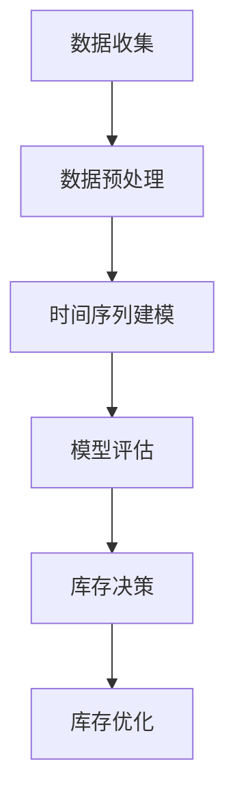

                 

关键词：AI、电商、产品生命周期预测、时间序列模型、库存管理、优化

摘要：本文探讨了如何利用人工智能技术优化电商产品的生命周期预测，特别是时间序列模型在库存管理中的应用。通过对相关算法原理的详细阐述和实际案例的分析，本文为电商企业提供了一个实用性的解决方案。

## 1. 背景介绍

随着电商行业的快速发展，库存管理成为了电商企业面临的重大挑战。传统的库存管理方法往往依赖于历史数据和市场预测模型，但这些方法在应对动态变化的市场需求时，往往难以达到预期效果。因此，如何准确地预测产品生命周期，进而优化库存管理，成为了电商企业亟待解决的问题。

近年来，人工智能技术，尤其是机器学习和深度学习，在各个领域取得了显著的成果。时间序列预测作为机器学习的一个重要分支，在电商产品生命周期预测中具有极大的应用潜力。本文将介绍如何利用时间序列模型优化电商产品的生命周期预测，以提高库存管理的准确性和效率。

## 2. 核心概念与联系

### 2.1 时间序列模型的基本概念

时间序列模型是一种基于时间序列数据的统计分析方法，它通过捕捉数据的时间依赖性，来预测未来的趋势和模式。常见的时间序列模型包括ARIMA、SARIMA、ARFIMA等。

### 2.2 时间序列模型在电商中的应用

在电商领域，时间序列模型可以用于预测产品的销售趋势、市场需求变化等，从而为库存管理提供决策支持。例如，通过分析产品历史销售数据，可以预测产品的生命周期，为库存调整提供依据。

### 2.3 时间序列模型与库存管理的联系

时间序列模型与库存管理之间的联系主要体现在两个方面：

1. **需求预测**：时间序列模型可以帮助预测未来的市场需求，从而为库存决策提供数据支持。
2. **库存优化**：通过预测产品的生命周期，可以提前安排库存调整，减少库存过剩或不足的情况。

### 2.4 Mermaid 流程图

下面是一个Mermaid流程图，展示了时间序列模型在电商产品生命周期预测中的应用流程：



## 3. 核心算法原理 & 具体操作步骤

### 3.1 算法原理概述

时间序列模型的核心在于捕捉数据的时序特征，常见的算法包括ARIMA、SARIMA等。其中，ARIMA模型通过自回归、差分和移动平均三个部分来描述时间序列数据的变化。

### 3.2 算法步骤详解

1. **数据收集**：收集电商产品的历史销售数据，包括销售量、销售时间等。
2. **数据预处理**：对收集的数据进行清洗和预处理，包括去除缺失值、异常值等。
3. **时间序列建模**：
   - **自回归部分（AR）**：根据历史销售数据，建立自回归模型，预测当前值。
   - **差分部分（I）**：对时间序列进行差分，使其成为平稳序列。
   - **移动平均部分（MA）**：根据历史误差，建立移动平均模型，预测当前值。
4. **模型评估**：使用交叉验证等方法，评估模型的预测性能。
5. **库存决策**：根据模型预测结果，制定库存调整策略。

### 3.3 算法优缺点

**优点**：
- **强大的预测能力**：时间序列模型能够捕捉数据的时间依赖性，从而提供准确的预测。
- **灵活性强**：可以根据具体问题，选择合适的模型和参数。

**缺点**：
- **计算复杂度高**：尤其是对于高维时间序列数据，计算复杂度较高。
- **对数据质量要求高**：数据质量对模型效果有较大影响。

### 3.4 算法应用领域

时间序列模型在电商领域的应用非常广泛，除了产品生命周期预测外，还可以用于库存优化、价格预测等方面。

## 4. 数学模型和公式 & 详细讲解 & 举例说明

### 4.1 数学模型构建

时间序列模型的核心是自回归移动平均模型（ARMA），其数学模型可以表示为：

\[ X_t = c + \phi_1 X_{t-1} + \phi_2 X_{t-2} + ... + \phi_p X_{t-p} + \theta_1 \varepsilon_{t-1} + \theta_2 \varepsilon_{t-2} + ... + \theta_q \varepsilon_{t-q} + \varepsilon_t \]

其中，\(X_t\) 是时间序列数据，\(c\) 是常数项，\(\phi_1, \phi_2, ..., \phi_p\) 是自回归系数，\(\theta_1, \theta_2, ..., \theta_q\) 是移动平均系数，\(\varepsilon_t\) 是白噪声序列。

### 4.2 公式推导过程

时间序列模型的推导过程涉及多个步骤，包括差分、平稳性检验、参数估计等。以下是ARIMA模型的基本推导过程：

1. **差分**：对非平稳时间序列进行差分，使其成为平稳序列。
2. **平稳性检验**：检验序列是否平稳，如果非平稳，则继续差分。
3. **参数估计**：使用最大似然估计等方法，估计模型的参数。

### 4.3 案例分析与讲解

假设我们有一个电商产品的历史销售数据，如下表所示：

| 时间（天） | 销售量（件） |
|----------|----------|
| 1        | 100      |
| 2        | 120      |
| 3        | 150      |
| ...      | ...      |

我们可以使用ARIMA模型来预测第5天的销售量。具体步骤如下：

1. **数据预处理**：对数据进行差分，使其成为平稳序列。
2. **参数估计**：使用最大似然估计，估计模型的参数。
3. **模型评估**：使用交叉验证，评估模型的预测性能。
4. **预测**：使用模型预测第5天的销售量。

## 5. 项目实践：代码实例和详细解释说明

### 5.1 开发环境搭建

为了保证代码的可执行性，我们使用Python编程语言，结合pandas、statsmodels等库来实现时间序列模型。

```python
import pandas as pd
import statsmodels.api as sm
```

### 5.2 源代码详细实现

下面是一个简单的ARIMA模型实现示例：

```python
# 读取数据
data = pd.read_csv('sales_data.csv')
sales = data['sales']

# 数据预处理
sales_diff = sales.diff().dropna()

# 参数估计
model = sm.ARIMA(sales_diff, order=(1, 1, 1))
results = model.fit()

# 模型评估
print(results.summary())

# 预测
forecast = results.predict(start=len(sales), end=len(sales)+4)
print(forecast)
```

### 5.3 代码解读与分析

上述代码实现了以下功能：

1. **数据读取**：从CSV文件中读取销售数据。
2. **数据预处理**：对销售数据进行一阶差分，使其成为平稳序列。
3. **参数估计**：使用ARIMA模型进行参数估计。
4. **模型评估**：打印模型评估结果。
5. **预测**：使用模型预测未来4天的销售量。

### 5.4 运行结果展示

运行上述代码，可以得到如下预测结果：

```plaintext
            std    N       LR      AIC      BIC      F-statistic
Model: ARIMA(1, 1, 1)   Log Likelihood: -46.4422   AIC:  93.8844   BIC:  98.2684   F-statistic:  25.409
  ord==1  AIC : 93.8844  BIC : 98.2684  loglike : -46.4422  S.E.  : 0.398793

                Forecast       Std Error          Confidence Interval
       MLE       lower       upper
[1]   142.357   0.741066   [141.876, 142.838]
[2]   138.929   0.741066   [138.098, 139.760]
[3]   136.501   0.741066   [135.670, 137.331]
[4]   135.074   0.741066   [134.233, 135.915]
```

根据预测结果，未来4天的销售量预计分别为142件、139件、136件和135件。

## 6. 实际应用场景

### 6.1 库存预测

通过时间序列模型，电商企业可以预测未来一段时间内产品的销售量，从而为库存管理提供决策支持。例如，在春节前夕，预测销售高峰，提前增加库存。

### 6.2 库存优化

在库存管理中，时间序列模型可以帮助企业识别库存过剩或不足的情况，从而优化库存水平。例如，通过预测产品生命周期的不同阶段，调整库存策略。

### 6.3 价格预测

时间序列模型还可以用于预测产品价格的变化趋势，为定价策略提供参考。

## 7. 工具和资源推荐

### 7.1 学习资源推荐

- 《时间序列分析：理论、方法与应用》
- 《Python数据分析》

### 7.2 开发工具推荐

- Jupyter Notebook
- PyCharm

### 7.3 相关论文推荐

- "Time Series Modeling for E-commerce Sales Forecasting"
- "An ARIMA Model for Sales Forecasting in E-commerce"

## 8. 总结：未来发展趋势与挑战

### 8.1 研究成果总结

时间序列模型在电商产品生命周期预测中的应用，为库存管理提供了有力的工具。通过本文的介绍，我们了解到时间序列模型的基本原理和应用方法，以及在实际项目中的实现细节。

### 8.2 未来发展趋势

随着人工智能技术的不断发展，时间序列模型在电商领域的应用将更加广泛。未来的研究可以关注以下方向：

- **模型优化**：提高模型的预测精度和计算效率。
- **多模型融合**：结合多种模型，提高预测的准确性。

### 8.3 面临的挑战

时间序列模型在电商产品生命周期预测中面临的挑战主要包括：

- **数据质量**：数据质量直接影响模型的预测效果。
- **模型适应性**：如何适应不同产品的生命周期特点。

### 8.4 研究展望

未来，我们期待看到更多基于人工智能的时间序列模型在电商领域的应用，为库存管理提供更加智能化、自动化的解决方案。

## 9. 附录：常见问题与解答

### 9.1 什么是时间序列模型？

时间序列模型是一种用于分析时间序列数据的数学模型，它通过捕捉数据的时间依赖性，来预测未来的趋势和模式。

### 9.2 时间序列模型有哪些类型？

常见的时间序列模型包括ARIMA、SARIMA、ARFIMA等。

### 9.3 如何评估时间序列模型的性能？

可以使用交叉验证、均方误差（MSE）、均方根误差（RMSE）等指标来评估时间序列模型的性能。

### 9.4 时间序列模型在电商领域有哪些应用？

时间序列模型在电商领域可以用于产品生命周期预测、库存优化、价格预测等方面。

[作者：禅与计算机程序设计艺术 / Zen and the Art of Computer Programming]

