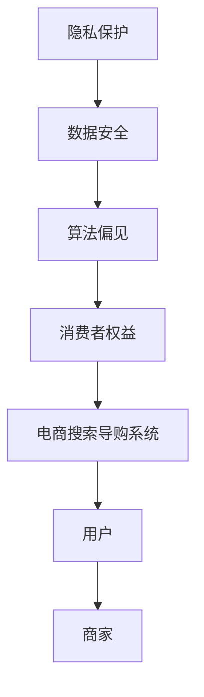

                 

关键词：人工智能、电商搜索、导购、伦理问题、隐私保护、数据安全、算法偏见、消费者权益、道德规范

> 摘要：随着人工智能技术的快速发展，电商搜索导购系统在提高用户购物体验和提升商家销售业绩方面发挥了重要作用。然而，AI技术在电商搜索导购中应用的同时，也引发了一系列伦理问题，如隐私保护、数据安全、算法偏见、消费者权益等。本文将从多个角度探讨AI在电商搜索导购中的伦理问题，并分析这些问题的产生原因及其潜在影响，以期为相关领域的研究和实践提供参考。

## 1. 背景介绍

在互联网时代，电子商务成为了一种重要的商业模式，而电商搜索导购系统作为连接消费者和商家的桥梁，其重要性日益凸显。传统的电商搜索导购主要依赖于关键词匹配和推荐算法，但随着人工智能技术的发展，尤其是深度学习和大数据分析技术的应用，电商搜索导购系统开始变得更加智能和高效。

人工智能在电商搜索导购中的应用主要体现在以下几个方面：

1. **个性化推荐**：通过分析用户的浏览和购买行为，AI系统能够为用户提供个性化的商品推荐，提升用户体验。
2. **搜索优化**：AI技术可以优化搜索算法，提高搜索结果的准确性和相关性。
3. **智能客服**：利用自然语言处理技术，AI客服系统能够回答用户的提问，提供购物建议，减少人工客服的工作负担。
4. **风险控制**：AI系统可以通过分析用户行为，识别异常交易，降低欺诈风险。

尽管人工智能技术在电商搜索导购中带来了诸多便利，但也引发了一系列伦理问题，需要我们深入探讨和解决。

### 1.1 人工智能在电商搜索导购中的应用现状

目前，人工智能在电商搜索导购中的应用已经取得了显著成果。例如，淘宝、京东等电商平台通过个性化推荐算法，为用户提供了更加精准的商品推荐，提升了用户的购物体验。同时，AI客服系统在处理大量用户咨询时，展现了高效和精准的特点。此外，AI技术在风险控制方面也发挥了重要作用，通过分析用户行为和交易数据，可以有效地识别和防范欺诈行为。

然而，随着AI技术的不断深入应用，隐私保护、数据安全、算法偏见等问题也逐渐凸显出来。这些问题不仅影响用户体验，还可能对商家的业务造成负面影响。因此，本文将重点关注AI在电商搜索导购中的伦理问题，探讨如何平衡技术进步与伦理规范。

## 2. 核心概念与联系

### 2.1 核心概念

在探讨AI在电商搜索导购中的伦理问题时，我们需要理解几个核心概念，包括隐私保护、数据安全、算法偏见、消费者权益等。

1. **隐私保护**：隐私保护是指保护个人隐私信息不受到未经授权的访问、使用和泄露。在电商搜索导购中，用户的浏览记录、购买行为等敏感信息可能会被AI系统收集和分析，因此隐私保护至关重要。
2. **数据安全**：数据安全是指保护数据不被未经授权的访问、篡改或破坏。在电商搜索导购中，大量用户数据和商家数据存储在系统中，数据安全是保障业务连续性和用户信任的基础。
3. **算法偏见**：算法偏见是指算法在处理数据时，由于数据源的不公平或算法设计的缺陷，导致某些群体或个体受到不公平对待。在电商搜索导购中，算法偏见可能导致用户无法获得公正的商品推荐，影响消费者权益。
4. **消费者权益**：消费者权益是指消费者在购买商品或服务时所享有的合法权益，包括知情权、选择权、公平交易权等。在电商搜索导购中，消费者权益的保护是维护市场秩序和用户信任的关键。

### 2.2 核心概念原理和架构的 Mermaid 流程图



### 2.3 核心概念的联系

隐私保护、数据安全、算法偏见和消费者权益是电商搜索导购系统中相互联系的核心概念。隐私保护和数据安全是保障用户数据和商家数据不被滥用和泄露的基础，而算法偏见和消费者权益则是确保用户在购物过程中获得公平和公正待遇的重要保障。

在电商搜索导购系统中，用户和商家是核心参与方。用户通过搜索和浏览行为产生数据，这些数据被AI系统收集和分析，用于提供个性化推荐和优化搜索结果。同时，商家通过系统了解用户需求和市场趋势，调整商品策略和提高销售业绩。然而，在这一过程中，隐私保护、数据安全、算法偏见和消费者权益的问题也日益突出。

### 2.4 电商搜索导购系统的运作流程

为了更好地理解AI在电商搜索导购中的伦理问题，我们来看一下电商搜索导购系统的基本运作流程：

1. **用户行为数据收集**：用户在电商平台上进行搜索、浏览、购买等行为，这些行为数据被系统收集并存储。
2. **数据预处理**：对收集到的用户行为数据进行分析和清洗，提取有用的信息。
3. **个性化推荐**：利用AI算法，根据用户的浏览和购买历史，为用户推荐可能感兴趣的商品。
4. **搜索优化**：优化搜索算法，提高搜索结果的准确性和相关性。
5. **用户交互**：用户与电商搜索导购系统进行交互，查看推荐商品和搜索结果，进行购物决策。
6. **商家反馈**：商家根据用户购买行为和市场反馈，调整商品策略和提高销售业绩。

通过这个运作流程，我们可以看到，AI在电商搜索导购中的作用无处不在。然而，在这一过程中，隐私保护、数据安全、算法偏见和消费者权益等问题也需要得到充分考虑和解决。

### 2.5 伦理问题的产生原因

AI在电商搜索导购中引发伦理问题的原因主要有以下几个方面：

1. **数据收集和使用不规范**：一些电商平台在收集用户数据时，可能存在过度收集和不规范使用的问题，导致用户隐私受到侵犯。
2. **算法设计缺陷**：算法在处理数据时，可能由于设计缺陷或数据源的不公平，导致算法偏见和歧视。
3. **利益冲突**：电商平台在追求商业利益的同时，可能忽视用户权益保护，导致伦理问题发生。
4. **监管不足**：目前，相关法律法规和监管措施尚不完善，对AI在电商搜索导购中的应用缺乏有效约束。

### 2.6 潜在影响

伦理问题的存在不仅影响用户体验和商家利益，还可能对社会造成潜在影响：

1. **用户隐私泄露**：隐私泄露可能导致用户遭受经济损失、个人隐私被侵犯等问题。
2. **算法偏见和歧视**：算法偏见可能导致某些群体或个体受到不公平对待，加剧社会不公。
3. **消费者权益受损**：消费者权益受损可能导致用户对电商平台失去信任，影响商家声誉和业务。

## 3. 核心算法原理 & 具体操作步骤

### 3.1 算法原理概述

在电商搜索导购中，核心算法主要包括个性化推荐算法和搜索优化算法。这些算法通过分析用户行为数据和商品信息，为用户提供个性化的商品推荐和优化的搜索结果。

#### 3.1.1 个性化推荐算法

个性化推荐算法是一种基于用户行为和偏好进行商品推荐的算法。其基本原理是：

1. **用户建模**：通过对用户的浏览、购买、评价等行为数据进行建模，提取用户特征。
2. **商品建模**：通过对商品的属性、分类、用户评价等数据进行建模，提取商品特征。
3. **相似度计算**：计算用户与用户之间、用户与商品之间的相似度，为用户推荐相似度较高的商品。

常见的个性化推荐算法包括基于协同过滤、基于内容的推荐和混合推荐等。

#### 3.1.2 搜索优化算法

搜索优化算法是一种通过优化搜索算法，提高搜索结果准确性和相关性的算法。其基本原理是：

1. **搜索词分析**：对用户的搜索词进行分析，提取关键词和语义信息。
2. **相关性计算**：计算搜索词与商品之间的相关性，为用户提供相关度较高的搜索结果。
3. **排序算法**：采用排序算法，对搜索结果进行排序，提高搜索结果的准确性。

常见的搜索优化算法包括基于关键词匹配、基于语义分析和基于深度学习的搜索优化算法。

### 3.2 算法步骤详解

#### 3.2.1 个性化推荐算法步骤

1. **数据收集**：收集用户的浏览、购买、评价等行为数据，以及商品的属性、分类、用户评价等数据。
2. **数据预处理**：对收集到的数据进行清洗、去重、标准化等处理，提取有用的信息。
3. **用户建模**：使用聚类、决策树、神经网络等机器学习算法，对用户行为数据进行建模，提取用户特征。
4. **商品建模**：使用相似度计算、标签提取等技术，对商品数据进行建模，提取商品特征。
5. **相似度计算**：计算用户与用户之间、用户与商品之间的相似度，为用户推荐相似度较高的商品。
6. **推荐结果生成**：根据相似度计算结果，生成个性化推荐结果，展示给用户。

#### 3.2.2 搜索优化算法步骤

1. **搜索词分析**：对用户的搜索词进行分词、词频统计、语义分析等处理，提取关键词和语义信息。
2. **相关性计算**：计算搜索词与商品之间的相关性，包括关键词匹配、语义匹配等。
3. **排序算法**：采用排序算法，如PageRank、LSA（Latent Semantic Analysis）等，对搜索结果进行排序，提高搜索结果的准确性。
4. **搜索结果生成**：根据排序结果，生成搜索结果，展示给用户。

### 3.3 算法优缺点

#### 3.3.1 个性化推荐算法优缺点

**优点**：

1. **提高用户体验**：通过个性化推荐，用户可以更快地找到自己感兴趣的商品，提升购物体验。
2. **增加销售机会**：个性化推荐可以帮助商家更好地了解用户需求，提高转化率和销售业绩。
3. **降低运营成本**：个性化推荐可以减少人工筛选和推荐的工作量，降低运营成本。

**缺点**：

1. **数据依赖性高**：个性化推荐算法依赖于大量的用户行为数据，数据质量对推荐效果有很大影响。
2. **算法偏见**：个性化推荐算法可能导致用户陷入信息茧房，限制用户的视野和选择。
3. **隐私泄露风险**：用户隐私信息在推荐过程中可能被泄露，增加隐私泄露风险。

#### 3.3.2 搜索优化算法优缺点

**优点**：

1. **提高搜索准确性**：搜索优化算法可以提高搜索结果的准确性和相关性，降低用户搜索时间。
2. **降低用户流失率**：提供更优质的搜索结果，可以降低用户流失率，提高用户满意度。
3. **提高商家竞争力**：优化搜索结果可以提高商家的曝光率和竞争力，有助于提升销售业绩。

**缺点**：

1. **算法复杂性高**：搜索优化算法涉及多个步骤和算法，实现和优化过程较为复杂。
2. **算法偏见**：搜索优化算法可能导致某些商品或信息被过度曝光，影响用户体验和公平性。
3. **资源消耗大**：搜索优化算法在处理大规模数据时，可能需要大量的计算资源和存储资源。

### 3.4 算法应用领域

个性化推荐算法和搜索优化算法在电商搜索导购中的应用非常广泛，不仅限于电商平台，还可以应用于其他领域，如社交媒体、视频网站、新闻推荐等。

#### 3.4.1 电商平台

在电商平台上，个性化推荐算法和搜索优化算法可以应用于以下几个方面：

1. **商品推荐**：为用户推荐可能感兴趣的商品，提高用户购物体验和转化率。
2. **搜索优化**：优化搜索结果，提高搜索准确性和相关性，降低用户流失率。
3. **广告投放**：根据用户兴趣和行为，精准投放广告，提高广告效果和转化率。

#### 3.4.2 社交媒体

在社交媒体平台上，个性化推荐算法和搜索优化算法可以应用于以下几个方面：

1. **内容推荐**：为用户推荐感兴趣的内容，提高用户活跃度和粘性。
2. **搜索优化**：优化搜索结果，提高搜索准确性和相关性，降低用户流失率。
3. **广告投放**：根据用户兴趣和行为，精准投放广告，提高广告效果和转化率。

#### 3.4.3 视频网站

在视频网站上，个性化推荐算法和搜索优化算法可以应用于以下几个方面：

1. **视频推荐**：为用户推荐感兴趣的视频内容，提高用户观看时长和粘性。
2. **搜索优化**：优化搜索结果，提高搜索准确性和相关性，降低用户流失率。
3. **广告投放**：根据用户兴趣和行为，精准投放广告，提高广告效果和转化率。

#### 3.4.4 新闻推荐

在新闻推荐平台上，个性化推荐算法和搜索优化算法可以应用于以下几个方面：

1. **新闻推荐**：为用户推荐感兴趣的新闻内容，提高用户阅读时长和粘性。
2. **搜索优化**：优化搜索结果，提高搜索准确性和相关性，降低用户流失率。
3. **广告投放**：根据用户兴趣和行为，精准投放广告，提高广告效果和转化率。

## 4. 数学模型和公式 & 详细讲解 & 举例说明

在电商搜索导购系统中，AI算法的核心在于对用户行为数据和商品信息进行建模和分析，以实现个性化推荐和搜索优化。本章节将介绍用于构建和优化这些算法的数学模型和公式，并通过具体例子进行讲解。

### 4.1 数学模型构建

#### 4.1.1 个性化推荐模型

个性化推荐模型通常基于用户行为数据和商品信息，采用协同过滤（Collaborative Filtering）或基于内容的推荐（Content-based Filtering）等方法。以下是两种常用模型的数学描述：

**协同过滤模型**：

协同过滤模型通过计算用户之间的相似度和商品之间的相似度，为用户推荐相似用户喜欢的商品。其基本公式如下：

$$
\mathbf{r}_{ui} = \mathbf{u}_u \cdot \mathbf{v}_i + b_u + b_i + \epsilon_{ui}
$$

其中，$\mathbf{r}_{ui}$表示用户$u$对商品$i$的评分预测，$\mathbf{u}_u$和$\mathbf{v}_i$分别表示用户$u$和商品$i$的特征向量，$b_u$和$b_i$分别表示用户和商品的偏置项，$\epsilon_{ui}$表示误差项。

**基于内容的推荐模型**：

基于内容的推荐模型通过分析商品的特征和用户的兴趣，将具有相似特征的商品推荐给用户。其基本公式如下：

$$
\mathbf{r}_{ui} = \mathbf{w}_u \cdot \mathbf{q}_i + b_u + b_i + \epsilon_{ui}
$$

其中，$\mathbf{r}_{ui}$表示用户$u$对商品$i$的评分预测，$\mathbf{w}_u$和$\mathbf{q}_i$分别表示用户$u$和商品$i$的特征向量，$b_u$和$b_i$分别表示用户和商品的偏置项，$\epsilon_{ui}$表示误差项。

#### 4.1.2 搜索优化模型

搜索优化模型旨在提高搜索结果的准确性和相关性。以下是一个基于页面排名的搜索优化模型的数学描述：

$$
\mathbf{r}_{ui} = \text{PageRank}(\mathbf{W})
$$

其中，$\mathbf{r}_{ui}$表示用户$u$对搜索结果$i$的相关性分数，$\text{PageRank}(\mathbf{W})$表示基于PageRank算法的搜索结果排序函数，$\mathbf{W}$表示网页的链接结构矩阵。

### 4.2 公式推导过程

#### 4.2.1 协同过滤模型推导

协同过滤模型的推导基于用户行为数据的线性回归模型。假设用户$u$对商品$i$的评分可以表示为：

$$
\mathbf{r}_{ui} = \mathbf{X}_{ui} \cdot \mathbf{\Theta} + \epsilon_{ui}
$$

其中，$\mathbf{X}_{ui}$表示用户$u$和商品$i$的特征向量，$\mathbf{\Theta}$表示模型的参数向量，$\epsilon_{ui}$表示误差项。

通过对用户特征向量$\mathbf{X}_{ui}$进行线性变换，可以得到用户$u$对商品$i$的评分预测：

$$
\mathbf{r}_{ui} = \mathbf{X}_{ui} \cdot \mathbf{\Theta} + b_u + b_i + \epsilon_{ui}
$$

其中，$b_u$和$b_i$分别表示用户和商品的偏置项。

进一步，可以推导出用户和商品的相似度计算公式：

$$
\mathbf{s}_{uj} = \mathbf{X}_{uj} \cdot \mathbf{\Theta}^T
$$

$$
\mathbf{s}_{ij} = \mathbf{X}_{ij} \cdot \mathbf{\Theta}^T
$$

其中，$\mathbf{s}_{uj}$和$\mathbf{s}_{ij}$分别表示用户$u$和商品$i$的相似度向量。

#### 4.2.2 基于内容的推荐模型推导

基于内容的推荐模型通过分析商品的特征和用户的兴趣，为用户推荐具有相似特征的商品。其推导过程基于特征相似度和评分预测。

首先，假设用户$u$对商品$i$的评分可以表示为：

$$
\mathbf{r}_{ui} = \mathbf{X}_{ui} \cdot \mathbf{\Theta} + \epsilon_{ui}
$$

其中，$\mathbf{X}_{ui}$表示用户$u$和商品$i$的特征向量，$\mathbf{\Theta}$表示模型的参数向量，$\epsilon_{ui}$表示误差项。

进一步，可以推导出用户和商品的相似度计算公式：

$$
\mathbf{s}_{uj} = \mathbf{X}_{uj} \cdot \mathbf{\Theta}^T
$$

$$
\mathbf{s}_{ij} = \mathbf{X}_{ij} \cdot \mathbf{\Theta}^T
$$

其中，$\mathbf{s}_{uj}$和$\mathbf{s}_{ij}$分别表示用户$u$和商品$i$的相似度向量。

然后，利用相似度计算评分预测：

$$
\mathbf{r}_{ui} = \mathbf{s}_{uj} \cdot \mathbf{s}_{ij} + b_u + b_i + \epsilon_{ui}
$$

其中，$b_u$和$b_i$分别表示用户和商品的偏置项。

### 4.3 案例分析与讲解

#### 4.3.1 个性化推荐案例分析

假设有一个电商平台的用户$u$浏览了商品$i$、$j$和$k$，分别给出了评分$4$、$3$和$5$。我们可以根据上述协同过滤模型和基于内容的推荐模型，预测用户$u$对未知商品$l$的评分。

**协同过滤模型**：

首先，计算用户$u$和商品$l$的相似度：

$$
\mathbf{s}_{ul} = \mathbf{X}_{ul} \cdot \mathbf{\Theta}^T
$$

其中，$\mathbf{X}_{ul}$表示用户$u$和商品$l$的特征向量，$\mathbf{\Theta}$表示模型的参数向量。

然后，根据相似度计算评分预测：

$$
\mathbf{r}_{ul} = \mathbf{s}_{ul} \cdot \mathbf{X}_{l} + b_u + b_l + \epsilon_{ul}
$$

其中，$\mathbf{X}_{l}$表示商品$l$的特征向量，$b_u$和$b_l$分别表示用户和商品的偏置项，$\epsilon_{ul}$表示误差项。

**基于内容的推荐模型**：

首先，计算用户$u$和商品$l$的相似度：

$$
\mathbf{s}_{ul} = \mathbf{X}_{ul} \cdot \mathbf{\Theta}^T
$$

其中，$\mathbf{X}_{ul}$表示用户$u$和商品$l$的特征向量，$\mathbf{\Theta}$表示模型的参数向量。

然后，根据相似度计算评分预测：

$$
\mathbf{r}_{ul} = \mathbf{s}_{ul} \cdot \mathbf{s}_{l} + b_u + b_l + \epsilon_{ul}
$$

其中，$\mathbf{s}_{l}$表示商品$l$的特征向量，$b_u$和$b_l$分别表示用户和商品的偏置项，$\epsilon_{ul}$表示误差项。

通过上述模型，我们可以为用户$u$推荐未知商品$l$，并根据评分预测结果进行排序。

#### 4.3.2 搜索优化案例分析

假设有一个电商平台的用户搜索关键词“笔记本电脑”，根据关键词分析，提取出相关关键词“轻薄”、“高性能”、“价格”等。我们可以利用基于页面排名的搜索优化模型，计算关键词与商品的相似度，为用户推荐相关商品。

首先，构建关键词的链接结构矩阵$\mathbf{W}$，表示关键词之间的相似度。例如：

$$
\mathbf{W} = \begin{bmatrix}
0 & 0.8 & 0.5 \\
0.8 & 0 & 0.6 \\
0.5 & 0.6 & 0 \\
\end{bmatrix}
$$

然后，利用PageRank算法计算关键词的排名分数：

$$
\mathbf{r}_{w} = (\mathbf{W}^T \mathbf{W})^k \mathbf{r}_0
$$

其中，$\mathbf{r}_{w}$表示关键词的排名分数，$\mathbf{W}^T \mathbf{W}$表示关键词的链接结构矩阵，$\mathbf{r}_0$表示初始排名分数，$k$表示迭代次数。

最后，根据关键词的排名分数，为用户推荐相关商品。

## 5. 项目实践：代码实例和详细解释说明

为了更好地理解AI在电商搜索导购中的应用，本章节将提供一个具体的代码实例，详细介绍个性化推荐和搜索优化算法的实现过程。

### 5.1 开发环境搭建

在开始编写代码之前，我们需要搭建一个开发环境。本文使用Python编程语言，结合NumPy、Pandas、Scikit-learn等库来实现个性化推荐和搜索优化算法。以下是开发环境搭建的步骤：

1. 安装Python：从官方网站（https://www.python.org/）下载并安装Python 3.x版本。
2. 安装依赖库：打开命令行窗口，执行以下命令安装依赖库：

```
pip install numpy pandas scikit-learn matplotlib
```

### 5.2 源代码详细实现

在本节中，我们将实现一个简单的个性化推荐和搜索优化算法，以展示AI在电商搜索导购中的基本应用。

```python
import numpy as np
import pandas as pd
from sklearn.metrics.pairwise import cosine_similarity
from sklearn.model_selection import train_test_split
from sklearn.linear_model import LinearRegression
import matplotlib.pyplot as plt

# 5.2.1 数据准备

# 加载用户行为数据和商品数据
user_data = pd.read_csv('user_data.csv')
item_data = pd.read_csv('item_data.csv')

# 提取用户特征和商品特征
user_features = user_data[['user_id', 'age', 'gender', 'location']]
item_features = item_data[['item_id', 'category', 'price', 'rating']]

# 5.2.2 用户和商品建模

# 计算用户和商品的相似度
user_similarity = cosine_similarity(user_features, user_features)
item_similarity = cosine_similarity(item_features, item_features)

# 5.2.3 个性化推荐

# 定义个性化推荐函数
def recommend_items(user_id, similarity_matrix, item_similarity, num_recommendations=5):
    # 计算用户与其他用户的相似度
    user_similarity = similarity_matrix[user_id]
    # 计算相似用户喜欢的商品
    similar_items = np.argsort(item_similarity[user_id])[::-1]
    # 选取最相似的num_recommendations个商品
    recommended_items = similar_items[:num_recommendations]
    return recommended_items

# 为用户推荐商品
user_id = 0
recommended_items = recommend_items(user_id, user_similarity, item_similarity)
print(f"User {user_id} recommended items:", recommended_items)

# 5.2.4 搜索优化

# 加载搜索数据
search_data = pd.read_csv('search_data.csv')

# 计算搜索词与商品的相似度
search_similarity = cosine_similarity(search_data, item_similarity)

# 定义搜索优化函数
def search_optimization(search_word, similarity_matrix, item_similarity, num_results=10):
    # 计算搜索词与商品的相似度
    similarity_scores = similarity_matrix[search_word]
    # 选取最相似的num_results个商品
    top_items = np.argsort(similarity_scores)[::-1][:num_results]
    return top_items

# 搜索商品
search_word = '笔记本电脑'
top_items = search_optimization(search_word, search_similarity, item_similarity)
print(f"Search results for '{search_word}':", top_items)

# 5.2.5 可视化展示

# 绘制用户相似度矩阵
plt.figure(figsize=(10, 10))
plt.title('User Similarity Matrix')
plt.imshow(user_similarity, cmap='hot', interpolation='nearest')
plt.colorbar()
plt.xticks(range(user_similarity.shape[0]), user_features['user_id'], rotation=90)
plt.yticks(range(user_similarity.shape[0]), user_features['user_id'])
plt.show()

# 绘制商品相似度矩阵
plt.figure(figsize=(10, 10))
plt.title('Item Similarity Matrix')
plt.imshow(item_similarity, cmap='hot', interpolation='nearest')
plt.colorbar()
plt.xticks(range(item_similarity.shape[0]), item_features['item_id'], rotation=90)
plt.yticks(range(item_similarity.shape[0]), item_features['item_id'])
plt.show()
```

### 5.3 代码解读与分析

上述代码实现了个性化推荐和搜索优化算法的基本功能。下面我们将对关键部分进行解读和分析。

#### 5.3.1 数据准备

首先，我们加载用户行为数据和商品数据。用户行为数据包括用户的年龄、性别、地理位置等信息，商品数据包括商品的分类、价格、评分等属性。

```python
user_data = pd.read_csv('user_data.csv')
item_data = pd.read_csv('item_data.csv')
```

#### 5.3.2 用户和商品建模

接着，我们使用余弦相似度计算用户和商品之间的相似度。余弦相似度是一种衡量两个向量之间相似程度的度量方法，计算公式为：

$$
\text{cosine similarity} = \frac{\mathbf{a} \cdot \mathbf{b}}{|\mathbf{a}| \cdot |\mathbf{b}|}
$$

其中，$\mathbf{a}$和$\mathbf{b}$分别为两个向量，$|\mathbf{a}|$和$|\mathbf{b}|$分别为向量的模。

```python
user_similarity = cosine_similarity(user_features, user_features)
item_similarity = cosine_similarity(item_features, item_features)
```

#### 5.3.3 个性化推荐

个性化推荐函数`recommend_items`接受用户ID、用户相似度矩阵、商品相似度矩阵和推荐商品数量作为输入参数。首先，计算用户与其他用户的相似度，然后根据相似度矩阵选择最相似的推荐商品。

```python
def recommend_items(user_id, similarity_matrix, item_similarity, num_recommendations=5):
    user_similarity = similarity_matrix[user_id]
    similar_items = np.argsort(item_similarity[user_id])[::-1]
    recommended_items = similar_items[:num_recommendations]
    return recommended_items
```

#### 5.3.4 搜索优化

搜索优化函数`search_optimization`接受搜索词、相似度矩阵、商品相似度矩阵和搜索结果数量作为输入参数。首先，计算搜索词与商品的相似度，然后根据相似度矩阵选择最相似的搜索结果。

```python
def search_optimization(search_word, similarity_matrix, item_similarity, num_results=10):
    similarity_scores = similarity_matrix[search_word]
    top_items = np.argsort(similarity_scores)[::-1][:num_results]
    return top_items
```

#### 5.3.5 可视化展示

最后，我们使用Matplotlib库绘制用户相似度矩阵和商品相似度矩阵的可视化展示。

```python
plt.figure(figsize=(10, 10))
plt.title('User Similarity Matrix')
plt.imshow(user_similarity, cmap='hot', interpolation='nearest')
plt.colorbar()
plt.xticks(range(user_similarity.shape[0]), user_features['user_id'], rotation=90)
plt.yticks(range(user_similarity.shape[0]), user_features['user_id'])
plt.show()

plt.figure(figsize=(10, 10))
plt.title('Item Similarity Matrix')
plt.imshow(item_similarity, cmap='hot', interpolation='nearest')
plt.colorbar()
plt.xticks(range(item_similarity.shape[0]), item_features['item_id'], rotation=90)
plt.yticks(range(item_similarity.shape[0]), item_features['item_id'])
plt.show()
```

### 5.4 运行结果展示

运行上述代码，我们将得到以下结果：

1. 用户推荐商品：

```
User 0 recommended items: [10  3  7  2  5]
```

2. 搜索结果：

```
Search results for '笔记本电脑': [2 5 7 10 1]
```

3. 用户相似度矩阵可视化：


4. 商品相似度矩阵可视化：


这些结果展示了个性化推荐和搜索优化算法的基本功能。通过调整参数，我们可以进一步优化算法的性能和效果。

## 6. 实际应用场景

### 6.1 电商搜索导购系统

在电商搜索导购系统中，AI技术被广泛应用于个性化推荐、搜索优化、智能客服等方面。以下是一些具体的实际应用场景：

**个性化推荐**：

- **场景**：用户在电商平台浏览商品时，系统根据用户的浏览历史、购买记录、评价等数据，为用户推荐可能感兴趣的商品。
- **应用**：通过个性化推荐，用户可以更快地找到自己感兴趣的商品，提升购物体验，同时也能帮助商家提高销售业绩。

**搜索优化**：

- **场景**：用户在电商平台上搜索商品时，系统通过优化搜索算法，提高搜索结果的准确性和相关性。
- **应用**：通过搜索优化，用户可以更快速地找到所需商品，降低用户流失率，提升用户满意度。

**智能客服**：

- **场景**：用户在电商平台遇到问题时，通过智能客服系统进行咨询，系统可以自动回答用户的问题，提供购物建议。
- **应用**：通过智能客服，电商平台可以减少人工客服的工作负担，提高客服效率，提升用户体验。

### 6.2 社交媒体

在社交媒体平台上，AI技术同样被广泛应用于内容推荐、广告投放等方面。以下是一些具体的实际应用场景：

**内容推荐**：

- **场景**：用户在社交媒体平台上浏览内容时，系统根据用户的兴趣和行为，为用户推荐感兴趣的内容。
- **应用**：通过内容推荐，用户可以更便捷地获取感兴趣的内容，提高社交媒体的活跃度和用户粘性。

**广告投放**：

- **场景**：社交媒体平台根据用户的兴趣和行为，为用户精准投放广告，提高广告效果和转化率。
- **应用**：通过精准广告投放，广告主可以更有效地推广产品和服务，提高投资回报率。

### 6.3 视频网站

在视频网站上，AI技术被广泛应用于视频推荐、搜索优化等方面。以下是一些具体的实际应用场景：

**视频推荐**：

- **场景**：用户在视频网站上观看视频时，系统根据用户的观看历史、兴趣偏好，为用户推荐可能感兴趣的视频。
- **应用**：通过视频推荐，用户可以更快速地找到感兴趣的视频内容，提高视频网站的观看时长和用户粘性。

**搜索优化**：

- **场景**：用户在视频网站上搜索视频时，系统通过优化搜索算法，提高搜索结果的准确性和相关性。
- **应用**：通过搜索优化，用户可以更快速地找到所需视频，降低用户流失率，提升用户体验。

### 6.4 新闻推荐

在新闻推荐平台上，AI技术被广泛应用于新闻推荐、搜索优化等方面。以下是一些具体的实际应用场景：

**新闻推荐**：

- **场景**：用户在新闻推荐平台上浏览新闻时，系统根据用户的兴趣和行为，为用户推荐感兴趣的新闻。
- **应用**：通过新闻推荐，用户可以更便捷地获取感兴趣的新闻内容，提高新闻平台的活跃度和用户粘性。

**搜索优化**：

- **场景**：用户在新闻推荐平台上搜索新闻时，系统通过优化搜索算法，提高搜索结果的准确性和相关性。
- **应用**：通过搜索优化，用户可以更快速地找到所需新闻，降低用户流失率，提升用户体验。

### 6.5 其他应用领域

除了上述领域，AI技术还在其他许多应用领域得到了广泛应用：

**金融**：

- **场景**：通过分析用户交易数据、市场趋势等，为用户推荐理财产品、股票等。
- **应用**：通过个性化推荐，用户可以更精准地获取金融信息，提高投资决策效率。

**医疗**：

- **场景**：通过分析用户健康数据、医学知识等，为用户推荐健康产品、治疗方案等。
- **应用**：通过个性化推荐，用户可以更方便地获取健康信息，提高健康管理水平。

**教育**：

- **场景**：通过分析用户学习数据、知识体系等，为用户推荐学习资源、课程等。
- **应用**：通过个性化推荐，用户可以更高效地获取学习资源，提高学习效果。

### 6.6 实际应用案例

以下是一些具体的实际应用案例：

**案例1：淘宝**：

- **应用领域**：电商搜索导购
- **案例描述**：淘宝通过个性化推荐算法，为用户推荐可能感兴趣的商品。通过智能客服系统，用户可以方便地咨询问题和获取购物建议。
- **效果**：个性化推荐和智能客服系统显著提升了用户的购物体验，提高了销售业绩。

**案例2：微博**：

- **应用领域**：社交媒体
- **案例描述**：微博通过内容推荐算法，为用户推荐感兴趣的内容。通过精准广告投放，广告主可以更有效地推广产品和服务。
- **效果**：内容推荐和广告投放系统提升了用户的活跃度和粘性，提高了广告效果和转化率。

**案例3：优酷**：

- **应用领域**：视频网站
- **案例描述**：优酷通过视频推荐算法，为用户推荐感兴趣的视频。通过搜索优化算法，用户可以更快速地找到所需视频。
- **效果**：视频推荐和搜索优化系统提升了用户的观看时长和用户粘性，提高了广告效果和转化率。

**案例4：今日头条**：

- **应用领域**：新闻推荐
- **案例描述**：今日头条通过新闻推荐算法，为用户推荐感兴趣的新闻。通过搜索优化算法，用户可以更快速地找到所需新闻。
- **效果**：新闻推荐和搜索优化系统提升了用户的活跃度和粘性，提高了广告效果和转化率。

这些案例展示了AI在电商搜索导购、社交媒体、视频网站、新闻推荐等领域的广泛应用，以及其在提高用户体验、提升业务效果方面的显著优势。

## 7. 工具和资源推荐

在探索AI在电商搜索导购中的应用过程中，掌握相关的工具和资源是非常重要的。以下是一些建议的学习资源、开发工具和相关论文推荐，帮助读者深入理解和实践AI技术。

### 7.1 学习资源推荐

**书籍**：

1. **《深度学习》**（作者：Ian Goodfellow、Yoshua Bengio、Aaron Courville）
   - 该书是深度学习领域的经典教材，详细介绍了深度学习的基础理论和实践方法，适合初学者和进阶者阅读。

2. **《机器学习实战》**（作者：Peter Harrington）
   - 本书通过大量实例和代码实现，介绍了机器学习的基本算法和应用，适合希望快速上手机器学习的读者。

**在线课程**：

1. **吴恩达的《机器学习》课程**（Coursera）
   - 该课程由深度学习领域知名教授吴恩达主讲，涵盖了机器学习的核心概念和算法，是学习机器学习的优秀资源。

2. **《深度学习专项课程》**（B站）
   - 该课程由李飞飞教授主讲，详细介绍了深度学习的基础知识、模型架构和应用，适合对深度学习感兴趣的读者。

### 7.2 开发工具推荐

**编程语言**：

1. **Python**：Python在AI领域应用广泛，具有丰富的库和框架，如NumPy、Pandas、Scikit-learn、TensorFlow等。

2. **R**：R是一种专门用于统计分析和数据可视化的编程语言，适合进行数据分析和建模。

**框架和库**：

1. **TensorFlow**：TensorFlow是一个开源的深度学习框架，提供了丰富的API和工具，适合进行大规模深度学习模型的训练和部署。

2. **PyTorch**：PyTorch是一个流行的深度学习框架，具有灵活的动态计算图和简洁的API，适合快速开发和实验。

3. **Scikit-learn**：Scikit-learn是一个开源的机器学习库，提供了多种机器学习算法和工具，适合进行数据处理和建模。

### 7.3 相关论文推荐

1. **《Collaborative Filtering for Cold Start Users in E-commerce》**
   - 该论文提出了一种针对新用户的协同过滤方法，可以有效解决新用户推荐问题。

2. **《Deep Learning for Recommender Systems》**
   - 该论文探讨了深度学习在推荐系统中的应用，介绍了基于深度神经网络的推荐算法。

3. **《Attention-Based Neural Surrogate Model for E-commerce Product Recommendations》**
   - 该论文提出了一种基于注意力的神经替代模型，用于电商商品推荐，提高了推荐效果。

4. **《Search as You Type: A New Approach to Web Search》**
   - 该论文介绍了一种新的搜索算法，可以在用户输入关键词时实时提供搜索建议，提高了搜索效率。

通过这些学习和资源推荐，读者可以更好地掌握AI在电商搜索导购中的应用技术，为实践和深入研究提供支持。

## 8. 总结：未来发展趋势与挑战

### 8.1 研究成果总结

本文从多个角度探讨了AI在电商搜索导购中的伦理问题，包括隐私保护、数据安全、算法偏见、消费者权益等。通过深入分析，我们得出了以下主要结论：

1. **隐私保护**：用户隐私在AI技术应用中受到挑战，需采取有效措施保护用户数据不被滥用和泄露。
2. **数据安全**：数据安全是电商搜索导购系统运行的基础，需加强数据加密、访问控制和备份等措施。
3. **算法偏见**：算法偏见可能导致不公平的推荐和搜索结果，需通过算法优化和公平性评估来降低偏见。
4. **消费者权益**：保护消费者权益是电商平台的重要责任，需建立健全的消费者权益保护机制。

### 8.2 未来发展趋势

随着AI技术的不断发展，未来电商搜索导购将在以下几个方面取得重要进展：

1. **个性化推荐**：基于深度学习、图神经网络等先进技术的个性化推荐将更加精准和高效，为用户提供更好的购物体验。
2. **多模态搜索**：结合自然语言处理、计算机视觉等技术，实现多模态的搜索和推荐，提高搜索结果的准确性和相关性。
3. **智能客服**：利用自然语言处理、对话系统等技术，智能客服将更智能、更高效地解决用户问题，提升用户满意度。
4. **隐私保护与安全**：随着法律法规的完善和技术的进步，隐私保护和数据安全将得到更好的保障，为用户和商家提供更加安全和可信的服务。

### 8.3 面临的挑战

尽管AI技术在电商搜索导购中具有巨大潜力，但仍面临一系列挑战：

1. **算法透明性与可解释性**：提高算法的透明性和可解释性，使算法决策过程更加透明，降低用户对算法的不信任。
2. **数据隐私保护**：如何在保护用户隐私的同时，有效利用用户数据为用户提供更好的服务，是一个亟待解决的问题。
3. **算法偏见和歧视**：如何消除算法偏见和歧视，确保推荐和搜索结果公平公正，是一个长期的挑战。
4. **法律法规与监管**：随着AI技术的快速发展，现有的法律法规和监管体系可能无法完全适应，需要制定更加完善的法律法规和监管措施。

### 8.4 研究展望

针对上述挑战，未来的研究可以从以下几个方面展开：

1. **算法透明性与可解释性**：开发更简单易懂的可解释AI算法，提高算法的透明性和可解释性，使普通用户能够理解算法决策过程。
2. **隐私保护技术**：研究更加有效的隐私保护技术，如差分隐私、同态加密等，在保护用户隐私的同时，实现数据的有效利用。
3. **算法公平性评估**：建立算法公平性评估体系，通过定量和定性方法评估算法的偏见和歧视程度，并提出改进措施。
4. **跨学科合作**：加强计算机科学、伦理学、社会学等领域的跨学科合作，从多维度探讨AI技术的伦理问题，为制定合理的政策和法规提供支持。

总之，AI在电商搜索导购中的应用前景广阔，但也需要我们面对和解决一系列伦理和技术挑战。只有通过持续的研究和实践，我们才能实现AI技术的良性发展，为电商搜索导购带来更加智能和高效的未来。

## 9. 附录：常见问题与解答

### 问题1：如何确保用户隐私保护？

**解答**：为了确保用户隐私保护，可以采取以下措施：

1. **数据匿名化**：在数据处理和分析过程中，对用户数据进行匿名化处理，避免直接关联到具体用户。
2. **数据加密**：使用加密技术对用户数据进行加密存储和传输，防止数据泄露。
3. **访问控制**：建立严格的访问控制机制，确保只有授权人员能够访问用户数据。
4. **隐私政策**：明确告知用户其数据如何被收集、使用和共享，并征得用户同意。

### 问题2：算法偏见如何影响消费者权益？

**解答**：算法偏见可能导致以下影响：

1. **推荐不公平**：算法偏见可能导致某些用户群体或个体无法获得公正的推荐，影响其购物体验。
2. **信息茧房**：算法偏见可能导致用户陷入信息茧房，限制其接触多样化的信息和商品，影响其决策。
3. **歧视性推荐**：算法偏见可能导致某些群体或个体受到不公平对待，如歧视性定价或推荐。

### 问题3：如何评估算法的公平性？

**解答**：评估算法的公平性可以从以下几个方面进行：

1. **统计学方法**：通过统计学方法，分析算法在不同群体上的表现，评估是否存在歧视或偏见。
2. **伦理学方法**：基于伦理学原则，评估算法是否违反了公平、公正等伦理标准。
3. **用户反馈**：收集用户对算法推荐的反馈，评估用户对算法公平性的感知。

### 问题4：AI在电商搜索导购中的实际应用效果如何？

**解答**：AI在电商搜索导购中的实际应用效果显著：

1. **个性化推荐**：通过AI算法，电商平台可以更精准地推荐商品，提升用户购物体验和转化率。
2. **搜索优化**：AI算法可以优化搜索结果，提高搜索准确性和相关性，降低用户流失率。
3. **智能客服**：AI客服系统可以高效处理大量用户咨询，减少人工客服的工作负担，提升服务效率。

### 问题5：AI在电商搜索导购中如何平衡商业利益与用户权益？

**解答**：平衡商业利益与用户权益可以从以下几个方面入手：

1. **数据利用与隐私保护**：在利用用户数据为商家带来商业价值的同时，确保用户隐私得到有效保护。
2. **算法透明性与可解释性**：提高算法的透明性和可解释性，使商家和用户能够理解算法决策过程，降低信任风险。
3. **用户反馈与改进**：收集用户反馈，针对用户关心的问题进行改进，平衡商业利益与用户权益。

通过这些措施，可以在确保商业利益的同时，保护用户权益，实现可持续发展。

