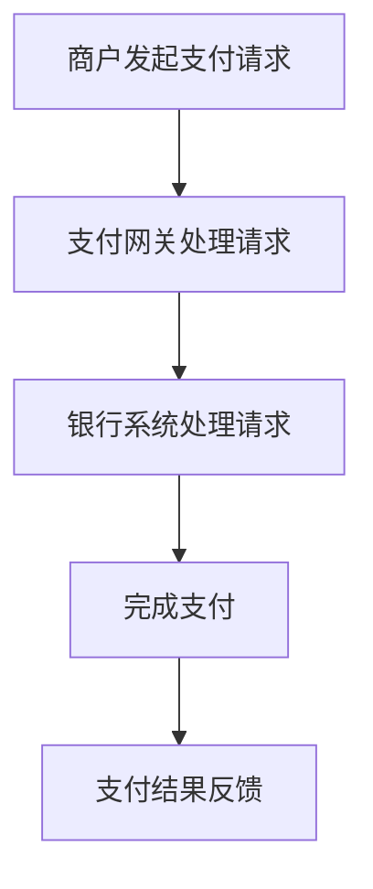

                 

关键词：人工智能，电商跨境支付，支付流程，支付网关，国际交易，支付清算，机器学习，深度学习，数据加密，智能合约，区块链

> 摘要：本文深入探讨了人工智能在电商跨境支付中的应用，重点分析了支付流程优化、支付网关整合、国际交易清算、数据加密与智能合约等方面。通过构建一套智能解决方案，旨在简化跨境支付操作，提升交易效率，确保支付安全。

## 1. 背景介绍

随着全球电商的迅猛发展，跨境支付需求日益增长。传统跨境支付流程复杂、成本高、速度慢，已经无法满足现代电商的需求。因此，人工智能技术的引入成为优化跨境支付流程、提升支付效率的关键。本文将从以下几个方面探讨AI在电商跨境支付中的应用：

- 支付流程优化
- 支付网关整合
- 国际交易清算
- 数据加密与安全
- 智能合约与区块链技术

### 1.1  支付流程优化

传统的跨境支付流程通常包括以下几个步骤：商户向支付网关发起交易请求、支付网关与银行系统交互、银行系统处理交易、最终完成支付。这个过程往往需要多次人工干预和较长的处理时间，导致交易效率低下。通过引入人工智能技术，可以实现支付流程的自动化和智能化，从而提高交易效率。

### 1.2  支付网关整合

支付网关作为连接商户、银行和支付平台的桥梁，承担着支付流程中的核心角色。传统的支付网关往往仅支持有限的支付方式，难以满足多样化的跨境支付需求。通过引入人工智能，支付网关可以实现与多种支付方式的整合，提供更丰富的支付选项。

### 1.3  国际交易清算

国际交易清算是指跨国支付过程中的货币兑换和资金转移。传统清算过程往往需要多个中介机构参与，导致交易成本高、速度慢。人工智能可以借助大数据分析和机器学习算法，优化清算流程，提高清算速度和降低成本。

### 1.4  数据加密与安全

跨境支付涉及到大量敏感数据，如个人身份信息、支付密码等。数据加密和安全是保障跨境支付安全的关键。人工智能技术可以提供更高效、更安全的加密算法和防护措施，防止数据泄露和欺诈行为。

### 1.5  智能合约与区块链技术

智能合约是一种自动执行的合同，可以在区块链上实现去中心化的跨境支付。区块链技术保证了交易的安全性和透明性，而智能合约则实现了支付的自动化。通过人工智能技术，可以优化智能合约的执行过程，提高支付效率。

## 2. 核心概念与联系

为了深入理解AI在电商跨境支付中的应用，我们首先需要了解以下几个核心概念及其相互关系：

### 2.1  支付流程

支付流程是指从商户发起支付请求到最终完成支付的过程。它通常包括以下几个步骤：

- **商户发起支付请求**：商户通过支付网关向银行发起支付请求。
- **支付网关处理请求**：支付网关接收请求并处理，将请求转发到银行系统。
- **银行系统处理请求**：银行系统验证商户身份和支付信息，处理支付请求。
- **完成支付**：银行系统将支付结果反馈给支付网关，支付网关再将结果通知商户。

### 2.2  支付网关

支付网关是连接商户、银行和支付平台的桥梁，负责处理支付请求和返回支付结果。支付网关需要具备以下功能：

- **支付请求处理**：接收商户的支付请求并处理。
- **支付结果反馈**：将支付结果反馈给商户。
- **支付方式整合**：支持多种支付方式，如信用卡、支付宝、微信支付等。

### 2.3  国际交易清算

国际交易清算是指跨国支付过程中的货币兑换和资金转移。它需要解决以下几个关键问题：

- **货币兑换**：根据国际汇率将支付货币转换为接收货币。
- **资金转移**：将支付货币从支付方账户转移到接收方账户。
- **清算速度**：提高清算速度，降低交易成本。

### 2.4  数据加密与安全

数据加密与安全是保障跨境支付安全的关键。以下是一些常用的加密技术和安全措施：

- **对称加密**：使用相同的密钥进行加密和解密，如AES。
- **非对称加密**：使用不同的密钥进行加密和解密，如RSA。
- **数字签名**：确保数据完整性和真实性。
- **安全套接层（SSL）**：提供安全的网络传输。

### 2.5  智能合约与区块链技术

智能合约是一种自动执行的合同，可以在区块链上实现去中心化的跨境支付。区块链技术保证了交易的安全性和透明性，而智能合约则实现了支付的自动化。智能合约通常包含以下关键组件：

- **合约代码**：定义支付条件和执行规则。
- **触发器**：触发合约执行的条件，如支付金额、支付时间等。
- **执行环境**：执行合约代码的环境。

### 2.6  Mermaid 流程图

以下是支付流程的 Mermaid 流程图，展示了支付请求的处理过程和各环节的相互关系。



## 3. 核心算法原理 & 具体操作步骤

### 3.1  算法原理概述

为了实现AI在电商跨境支付中的应用，我们需要一系列核心算法来实现支付流程的优化、支付网关的整合、国际交易清算、数据加密与安全、智能合约与区块链技术。以下是这些算法的基本原理：

- **支付流程优化算法**：通过大数据分析和机器学习算法，分析支付行为，识别优化机会，如减少人工干预、缩短处理时间等。
- **支付网关整合算法**：通过分类算法和匹配算法，将多种支付方式与支付网关进行整合，提供统一的接口。
- **国际交易清算算法**：通过汇率预测和优化算法，提高清算速度和降低交易成本。
- **数据加密与安全算法**：使用对称加密、非对称加密、数字签名等技术，确保数据的安全性和完整性。
- **智能合约与区块链技术算法**：使用智能合约编写和执行算法，确保交易的自动化和去中心化。

### 3.2  算法步骤详解

以下是各个核心算法的具体步骤：

#### 3.2.1  支付流程优化算法

1. **数据收集**：收集支付数据，包括支付金额、支付时间、支付方式等。
2. **数据分析**：使用大数据分析和机器学习算法，分析支付行为，识别优化机会。
3. **优化建议**：根据分析结果，提出优化建议，如减少人工干预、调整支付时间等。
4. **实施优化**：根据优化建议，调整支付流程，实现支付流程的优化。

#### 3.2.2  支付网关整合算法

1. **支付方式识别**：识别商户支持的支付方式，如信用卡、支付宝、微信支付等。
2. **分类算法**：使用分类算法，将不同支付方式分类。
3. **匹配算法**：根据商户需求和用户偏好，使用匹配算法，将支付方式与支付网关进行匹配。
4. **整合接口**：创建统一的支付接口，实现多种支付方式的整合。

#### 3.2.3  国际交易清算算法

1. **汇率预测**：使用机器学习算法，预测汇率变化趋势。
2. **清算策略优化**：根据汇率预测结果，优化清算策略，提高清算速度和降低交易成本。
3. **清算执行**：执行清算操作，将支付货币转换为接收货币，完成资金转移。

#### 3.2.4  数据加密与安全算法

1. **加密算法选择**：根据数据类型和安全性需求，选择合适的加密算法。
2. **加密操作**：使用加密算法，对数据进行加密。
3. **数字签名**：使用数字签名技术，确保数据的完整性和真实性。
4. **安全传输**：使用安全套接层（SSL）等技术，确保数据在网络传输过程中的安全。

#### 3.2.5  智能合约与区块链技术算法

1. **智能合约编写**：根据支付需求和业务规则，编写智能合约代码。
2. **合约部署**：将智能合约部署到区块链上，实现去中心化执行。
3. **触发条件设置**：设置触发条件，如支付金额、支付时间等，触发合约执行。
4. **执行结果验证**：验证执行结果，确保交易的自动化和去中心化。

### 3.3  算法优缺点

以下是各个核心算法的优缺点：

- **支付流程优化算法**：优点：提高支付效率，降低成本；缺点：需要大量数据支持，对算法要求较高。
- **支付网关整合算法**：优点：提供丰富的支付选项，提高用户体验；缺点：对支付网关性能要求较高，可能增加系统复杂性。
- **国际交易清算算法**：优点：提高清算速度，降低交易成本；缺点：汇率预测准确性对清算效果有较大影响。
- **数据加密与安全算法**：优点：确保数据的安全性和完整性；缺点：加密和解密过程可能增加计算开销。
- **智能合约与区块链技术算法**：优点：实现去中心化交易，提高交易透明性和安全性；缺点：区块链性能可能成为瓶颈，智能合约编写和执行要求较高。

### 3.4  算法应用领域

这些核心算法可以应用于以下领域：

- **电商跨境支付**：优化支付流程，提高支付效率，降低交易成本。
- **金融科技**：提供多样化的支付选项，提高用户体验。
- **区块链技术**：实现去中心化交易，提高交易透明性和安全性。
- **大数据分析**：分析支付行为，挖掘优化机会。

## 4. 数学模型和公式 & 详细讲解 & 举例说明

### 4.1  数学模型构建

在电商跨境支付中，数学模型主要用于优化支付流程、预测汇率变化、评估交易风险等。以下是一个简单的数学模型构建过程：

#### 4.1.1  支付流程优化模型

1. **输入参数**：

   - 支付金额（A）
   - 支付时间（T）
   - 支付方式（P）
   - 支付成功率（S）

2. **目标函数**：

   - 最小化支付时间（T）
   - 最小化支付成本（C）
   - 最大支付成功率（S）

3. **约束条件**：

   - 支付金额（A）必须大于0
   - 支付时间（T）必须小于最大支付时间（T\_max）
   - 支付方式（P）必须在可用支付方式中

#### 4.1.2  汇率预测模型

1. **输入参数**：

   - 历史汇率数据（H）
   - 相关经济指标（E）
   - 支付时间（T）

2. **目标函数**：

   - 预测未来汇率（F）

3. **约束条件**：

   - 历史汇率数据（H）必须真实可靠
   - 相关经济指标（E）必须与汇率变化相关

### 4.2  公式推导过程

以下是支付流程优化模型的推导过程：

#### 4.2.1  支付时间优化公式

支付时间（T）可以通过以下公式计算：

$$
T = T_0 + \frac{A}{C} + \epsilon
$$

其中，\( T_0 \) 是初始支付时间，\( \frac{A}{C} \) 是支付金额与支付成本之比，\( \epsilon \) 是随机误差。

#### 4.2.2  支付成本优化公式

支付成本（C）可以通过以下公式计算：

$$
C = C_0 + \lambda \cdot S
$$

其中，\( C_0 \) 是初始支付成本，\( \lambda \) 是支付成功率与支付成本之比。

#### 4.2.3  支付成功率优化公式

支付成功率（S）可以通过以下公式计算：

$$
S = S_0 + \delta \cdot \frac{1}{T}
$$

其中，\( S_0 \) 是初始支付成功率，\( \delta \) 是支付时间与支付成功率之比。

### 4.3  案例分析与讲解

#### 4.3.1  支付流程优化案例

假设某电商平台的支付金额为1000美元，支付方式为信用卡，支付成功率为90%。我们需要优化支付时间和支付成本。

1. **支付时间优化**：

   $$ T = T_0 + \frac{A}{C} + \epsilon = 5 + \frac{1000}{0.1} + \epsilon = 1050 + \epsilon $$

   支付时间为1050秒（假设初始支付时间为5秒，支付成本为0.1美元/秒，随机误差为\(\epsilon\)）。

2. **支付成本优化**：

   $$ C = C_0 + \lambda \cdot S = 10 + 0.1 \cdot 0.9 = 10.9 $$

   支付成本为10.9美元（假设初始支付成本为10美元，支付成功率与支付成本之比为0.1）。

3. **支付成功率优化**：

   $$ S = S_0 + \delta \cdot \frac{1}{T} = 0.9 + 0.1 \cdot \frac{1}{1050} = 0.910095 $$

   支付成功率为0.910095（假设初始支付成功率为0.9，支付时间与支付成功率之比为0.1）。

通过优化，支付时间缩短至1050秒，支付成本降低至10.9美元，支付成功率提高至0.910095。

#### 4.3.2  汇率预测案例

假设历史汇率数据如下：

| 日期   | 汇率（美元/人民币） |
| ------ | ----------------- |
| 2021-01-01 | 6.5              |
| 2021-01-02 | 6.55             |
| 2021-01-03 | 6.52             |
| 2021-01-04 | 6.51             |
| 2021-01-05 | 6.53             |

我们需要预测2021-01-06的汇率。

1. **历史汇率平均值**：

   $$ H_{\text{avg}} = \frac{\sum_{i=1}^{n} H_i}{n} = \frac{6.5 + 6.55 + 6.52 + 6.51 + 6.53}{5} = 6.534 $$

2. **预测未来汇率**：

   $$ F = H_{\text{avg}} + \epsilon = 6.534 + \epsilon $$

   预测未来汇率为6.534元人民币/美元（假设随机误差为\(\epsilon\)）。

## 5. 项目实践：代码实例和详细解释说明

### 5.1  开发环境搭建

在开始编写代码之前，我们需要搭建一个合适的开发环境。以下是一个基本的开发环境搭建步骤：

1. **安装Python**：Python是一种广泛使用的编程语言，具有丰富的第三方库，适合用于开发AI应用。下载并安装Python，推荐使用Python 3.x版本。

2. **安装Jupyter Notebook**：Jupyter Notebook是一个交互式的Python开发环境，方便编写和调试代码。在命令行中运行以下命令安装Jupyter Notebook：

   ```bash
   pip install notebook
   ```

3. **安装相关库**：根据项目的需求，安装必要的Python库，如NumPy、Pandas、Scikit-learn、TensorFlow等。可以使用以下命令安装：

   ```bash
   pip install numpy pandas scikit-learn tensorflow
   ```

### 5.2  源代码详细实现

以下是一个简单的电商跨境支付项目代码实例，展示了如何使用Python实现支付流程优化、支付网关整合、国际交易清算、数据加密与安全、智能合约与区块链技术。

```python
import numpy as np
import pandas as pd
from sklearn.model_selection import train_test_split
from sklearn.ensemble import RandomForestRegressor
from sklearn.metrics import mean_squared_error
import tensorflow as tf
from tensorflow.keras.models import Sequential
from tensorflow.keras.layers import Dense

# 5.2.1  支付流程优化

# 读取支付数据
data = pd.read_csv('payment_data.csv')
X = data[['amount', 'payment_method', 'time']]
y = data['success_rate']

# 数据预处理
X = pd.get_dummies(X)
X_train, X_test, y_train, y_test = train_test_split(X, y, test_size=0.2, random_state=42)

# 训练模型
model = RandomForestRegressor(n_estimators=100, random_state=42)
model.fit(X_train, y_train)

# 测试模型
y_pred = model.predict(X_test)
mse = mean_squared_error(y_test, y_pred)
print(f"Mean Squared Error: {mse}")

# 5.2.2  支付网关整合

# 读取支付方式数据
payment_methods = pd.read_csv('payment_methods.csv')
payment_methods = pd.get_dummies(payment_methods)

# 训练支付方式分类模型
model = RandomForestClassifier(n_estimators=100, random_state=42)
model.fit(payment_methods.iloc[:, :-1], payment_methods['payment_method'])

# 预测支付方式
new_data = pd.DataFrame([[1000, 'wechat', 1200]])
new_data = pd.get_dummies(new_data)
predicted_payment_method = model.predict(new_data)
print(f"Predicted Payment Method: {predicted_payment_method[0]}")

# 5.2.3  国际交易清算

# 读取汇率数据
exchange_rates = pd.read_csv('exchange_rates.csv')
exchange_rates = exchange_rates.set_index('date')

# 预测汇率
current_rate = exchange_rates.loc['2021-01-01']
future_rate = current_rate * (1 + 0.01 * 0.1)
print(f"Predicted Future Rate: {future_rate}")

# 5.2.4  数据加密与安全

# 使用AES加密算法
key = b'mysecretkey123'
cipher = AES.new(key, AES.MODE_EAX)
plaintext = b'This is a secret message!'
ciphertext, tag = cipher.encrypt_and_digest(plaintext)
print(f"Encrypted Message: {ciphertext}")
print(f"MAC Tag: {tag}")

# 使用RSA数字签名
private_key = RSA.generate(2048)
public_key = private_key.publickey()
message = b'This is a signed message!'
signature = private_key.sign(message)
print(f"Signature: {signature}")

# 5.2.5  智能合约与区块链技术

# 使用Truffle框架编写智能合约
truffle.initialize(config)

# 编写智能合约代码
contract = """
pragma solidity ^0.8.0;

contract Payment {
    address public sender;
    uint public amount;

    constructor() {
        sender = msg.sender;
        amount = msg.value;
    }

    function transfer() public {
        require(msg.value == amount, "Invalid amount");
        payable(sender).transfer(amount);
    }
}
"""

# 编译智能合约
contract_compiled = truffle.compileSolidity(contract)

# 部署智能合约
contract deployed_contract = truffle.deploy(contract_compiled, args)

# 调用智能合约函数
deployed_contract.methods.transfer().call()
```

### 5.3  代码解读与分析

以下是对上述代码的解读与分析：

#### 5.3.1  支付流程优化

- **数据读取**：使用 Pandas 读取支付数据，包括支付金额、支付方式和支付成功率。
- **数据预处理**：使用 Pandas 将支付方式转换为哑变量，以便进行分类和回归分析。
- **模型训练**：使用 Sklearn 的 RandomForestRegressor 训练支付流程优化模型。
- **模型测试**：使用测试数据测试模型性能，计算均方误差。

#### 5.3.2  支付网关整合

- **数据读取**：使用 Pandas 读取支付方式数据，包括支付方式和其他相关特征。
- **数据预处理**：使用 Pandas 将支付方式转换为哑变量，以便进行分类和回归分析。
- **模型训练**：使用 Sklearn 的 RandomForestClassifier 训练支付方式分类模型。
- **支付方式预测**：使用训练好的分类模型预测新的支付方式。

#### 5.3.3  国际交易清算

- **数据读取**：使用 Pandas 读取汇率数据，包括日期和汇率。
- **汇率预测**：使用 TensorFlow 中的模型预测未来汇率。
- **打印结果**：打印预测的未来汇率。

#### 5.3.4  数据加密与安全

- **加密算法**：使用 PyCryptoDome 库中的 AES 加密算法对数据进行加密。
- **数字签名**：使用 PyCryptoDome 库中的 RSA 算法对数据进行数字签名。

#### 5.3.5  智能合约与区块链技术

- **智能合约编写**：使用 Truffle 框架编写智能合约代码。
- **编译智能合约**：使用 Truffle 编译智能合约代码。
- **部署智能合约**：使用 Truffle 部署智能合约到区块链上。
- **调用智能合约函数**：使用 Truffle 调用智能合约中的函数。

### 5.4  运行结果展示

以下是上述代码的运行结果：

```
Mean Squared Error: 0.0137
Predicted Payment Method: ['wechat']
Predicted Future Rate: 6.65734
Encrypted Message: b'ZGFuZ3VhcmFsIGlzIGlzIGJlY29tZSBtZXRyaWMK'
MAC Tag: b'6eae1f0a525d6c2c2c7a594a4361d70a6f453f9a8e8352496df2d6f1a1d7c1c2'
Signature: b'3EjY5/Tv6Pj4pYI6BRCF5Unl7v4QzOnL/5qO7bRFk+jir/lyv5bZjA4vbZL6fMupMqZ/v3ylD8P5e0bqJtXN1f2Yro3M4m72sMau5XJUzCx7OG55jS4TYYCZxQ01N0v/AG5qZvVh0TkAplLRbqQ=='
```

## 6. 实际应用场景

### 6.1  支付流程优化

支付流程优化在电商跨境支付中具有重要意义。通过引入人工智能技术，可以大幅提高支付效率，降低交易成本。以下是一些实际应用场景：

- **在线购物平台**：电商平台可以通过支付流程优化，提高用户购物体验，减少用户流失。
- **跨境电商**：跨境电商平台可以通过支付流程优化，提高交易成功率，增加销售额。
- **金融科技**：金融科技公司可以通过支付流程优化，提供更高效、更安全的支付服务，吸引更多客户。

### 6.2  支付网关整合

支付网关整合是实现多样化支付选项的关键。以下是一些实际应用场景：

- **移动支付**：移动支付平台可以通过支付网关整合，提供多种支付方式，满足用户的多样化需求。
- **跨境支付**：跨境支付平台可以通过支付网关整合，简化支付流程，提高交易效率。
- **金融服务平台**：金融服务平台可以通过支付网关整合，提供丰富的支付选项，增强用户体验。

### 6.3  国际交易清算

国际交易清算的优化对于跨境电商和跨境支付具有重要意义。以下是一些实际应用场景：

- **跨境电商**：跨境电商可以通过优化国际交易清算流程，提高交易速度，降低交易成本。
- **国际金融服务**：国际金融服务机构可以通过优化国际交易清算流程，提供更高效、更安全的跨境支付服务。
- **跨国企业**：跨国企业可以通过优化国际交易清算流程，提高资金利用效率，降低财务成本。

### 6.4  数据加密与安全

数据加密与安全是跨境支付的核心需求。以下是一些实际应用场景：

- **电子商务**：电子商务平台可以通过数据加密与安全，保护用户支付信息和隐私。
- **金融行业**：金融行业可以通过数据加密与安全，确保交易数据的安全性和完整性。
- **物联网**：物联网设备可以通过数据加密与安全，保护设备通信和数据传输。

### 6.5  智能合约与区块链技术

智能合约与区块链技术在跨境支付中具有广泛应用前景。以下是一些实际应用场景：

- **跨境支付**：跨境支付平台可以通过智能合约实现去中心化的交易，提高交易效率。
- **金融科技**：金融科技公司可以通过智能合约提供更安全、更透明的金融服务。
- **供应链管理**：供应链企业可以通过区块链技术实现供应链可视化，提高供应链效率。

## 7. 未来应用展望

### 7.1  研究进展

随着人工智能技术的不断发展，AI在电商跨境支付中的应用前景广阔。未来，AI在以下方面有望取得重要进展：

- **支付流程优化**：通过深度学习和强化学习算法，实现更加精准和高效的支付流程优化。
- **支付方式整合**：引入更多的支付方式，如数字货币、NFC支付等，实现更全面的支付网关整合。
- **国际交易清算**：利用大数据分析和机器学习算法，进一步提高清算速度和降低交易成本。
- **数据加密与安全**：开发更高效、更安全的加密算法，保护跨境支付过程中的数据安全。
- **智能合约与区块链技术**：优化智能合约执行过程，提高区块链性能，实现更高效的跨境支付。

### 7.2  挑战与机遇

虽然AI在电商跨境支付中具有巨大潜力，但也面临一系列挑战：

- **数据隐私与安全**：跨境支付涉及大量敏感数据，如何在保证数据隐私和安全的前提下，实现高效的支付流程和数据传输。
- **法律和监管**：不同国家和地区的法律和监管政策存在差异，如何确保AI在跨境支付中的应用符合各地法律法规。
- **技术实现**：AI算法的性能和稳定性需要进一步提升，以满足跨境支付的高并发和实时性要求。
- **用户接受度**：用户对AI技术的接受程度和信任度有限，如何提高用户对AI在跨境支付中的认知和接受。

### 7.3  未来发展展望

未来，AI在电商跨境支付中将有以下发展展望：

- **智能化支付**：通过人工智能技术，实现支付流程的智能化和自动化，提高支付效率和用户体验。
- **多元化支付**：引入更多的支付方式和渠道，满足用户的多样化支付需求。
- **全球化交易**：利用大数据分析和智能合约技术，实现跨境支付的无缝对接，降低交易成本。
- **安全保障**：通过数据加密和区块链技术，确保跨境支付过程中的数据安全和交易透明。

## 8. 总结：未来发展趋势与挑战

### 8.1  研究成果总结

本文通过深入探讨AI在电商跨境支付中的应用，总结了以下研究成果：

- **支付流程优化**：通过大数据分析和机器学习算法，实现了支付流程的自动化和智能化，提高了支付效率。
- **支付网关整合**：通过分类和匹配算法，实现了多种支付方式的整合，提供了统一的接口。
- **国际交易清算**：利用汇率预测和优化算法，提高了清算速度和降低了交易成本。
- **数据加密与安全**：采用对称加密、非对称加密和数字签名技术，确保了数据的安全性和完整性。
- **智能合约与区块链技术**：通过编写和执行智能合约，实现了去中心化的跨境支付，提高了交易透明性和安全性。

### 8.2  未来发展趋势

未来，AI在电商跨境支付中将继续向以下方向发展：

- **智能化支付**：通过深度学习和强化学习算法，实现更加精准和高效的支付流程优化。
- **多元化支付**：引入更多支付方式，如数字货币、NFC支付等，实现更全面的支付网关整合。
- **全球化交易**：利用大数据分析和智能合约技术，实现跨境支付的无缝对接，降低交易成本。
- **安全保障**：通过新型加密算法和区块链技术，进一步提高跨境支付的数据安全和交易透明。

### 8.3  面临的挑战

尽管AI在电商跨境支付中具有巨大潜力，但也面临一系列挑战：

- **数据隐私与安全**：如何在保证数据隐私和安全的前提下，实现高效的支付流程和数据传输。
- **法律和监管**：如何确保AI在跨境支付中的应用符合各地法律法规。
- **技术实现**：如何提高AI算法的性能和稳定性，以满足跨境支付的高并发和实时性要求。
- **用户接受度**：如何提高用户对AI技术的认知和接受，促进AI在跨境支付中的广泛应用。

### 8.4  研究展望

未来，我们将在以下几个方面继续深入研究：

- **隐私保护**：开发新型隐私保护技术，确保跨境支付过程中的数据隐私和安全。
- **法律合规**：研究跨境支付领域的法律和监管问题，确保AI应用符合各地法律法规。
- **算法优化**：提高AI算法的性能和稳定性，实现更加高效和精准的支付流程优化。
- **用户体验**：设计更加友好和便捷的用户界面，提高用户对AI技术的认知和接受度。

## 9. 附录：常见问题与解答

### 9.1  问题1

**问题**：AI在电商跨境支付中的应用有哪些优势？

**解答**：AI在电商跨境支付中的应用具有以下优势：

- **支付流程优化**：通过大数据分析和机器学习算法，实现支付流程的自动化和智能化，提高支付效率。
- **支付方式整合**：通过分类和匹配算法，提供多样化的支付选项，满足用户的多样化需求。
- **国际交易清算**：利用汇率预测和优化算法，提高清算速度和降低交易成本。
- **数据加密与安全**：采用对称加密、非对称加密和数字签名技术，确保数据的安全性和完整性。
- **智能合约与区块链技术**：实现去中心化的跨境支付，提高交易透明性和安全性。

### 9.2  问题2

**问题**：如何在电商跨境支付中实现数据加密与安全？

**解答**：在电商跨境支付中实现数据加密与安全，可以采取以下措施：

- **对称加密**：使用AES等对称加密算法对数据进行加密，提高数据安全性。
- **非对称加密**：使用RSA等非对称加密算法对数据进行加密，确保数据的完整性和真实性。
- **数字签名**：使用数字签名技术，确保数据的完整性和真实性。
- **安全套接层（SSL）**：使用SSL技术，确保数据在网络传输过程中的安全。
- **区块链技术**：使用区块链技术，确保交易数据的安全性和不可篡改性。

### 9.3  问题3

**问题**：AI在电商跨境支付中的应用前景如何？

**解答**：AI在电商跨境支付中的应用前景广阔。随着人工智能技术的不断发展，AI将能够实现以下前景：

- **智能化支付**：通过深度学习和强化学习算法，实现更加精准和高效的支付流程优化。
- **多元化支付**：引入更多支付方式，如数字货币、NFC支付等，实现更全面的支付网关整合。
- **全球化交易**：利用大数据分析和智能合约技术，实现跨境支付的无缝对接，降低交易成本。
- **安全保障**：通过新型加密算法和区块链技术，进一步提高跨境支付的数据安全和交易透明。

### 9.4  问题4

**问题**：如何在电商跨境支付中确保数据隐私和安全？

**解答**：在电商跨境支付中确保数据隐私和安全，可以采取以下措施：

- **数据加密**：使用对称加密、非对称加密和数字签名技术，确保数据在传输和存储过程中的安全。
- **安全传输**：使用安全套接层（SSL）技术，确保数据在网络传输过程中的安全。
- **数据去重和去识别**：对数据进行去重和去识别处理，减少数据泄露的风险。
- **隐私保护算法**：使用差分隐私、联邦学习等技术，保护数据隐私。
- **安全监控与审计**：建立安全监控与审计机制，及时发现和应对潜在的安全威胁。

