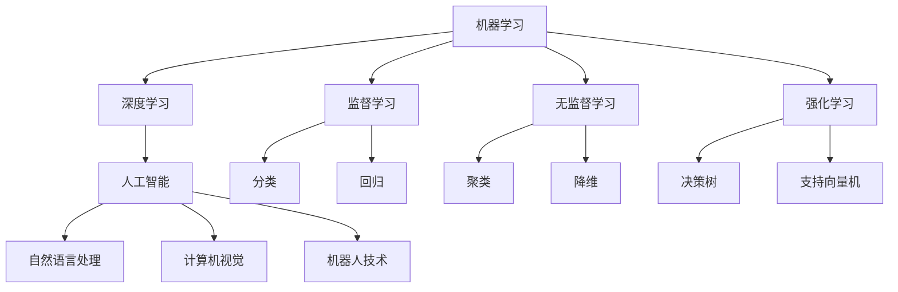

                 

关键词：人工智能，社会应用，技术进步，伦理挑战，未来发展

摘要：本文旨在探讨人工智能（AI）在社会各个领域中的作用与应用，分析其带来的变革与挑战。从背景介绍到核心概念阐述，再到算法原理、数学模型、项目实践、应用场景、未来展望，本文将全面解析AI技术的现状与未来，旨在为读者提供一份关于AI在社会中的全景图。

## 1. 背景介绍

随着信息技术的飞速发展，人工智能（AI）已经成为当今世界最为热门的话题之一。自20世纪50年代诞生以来，AI经历了从理论探讨到技术实践，再到商业化应用的蜕变。现如今，AI技术已经深入到社会各个领域，从医疗、教育、金融，到制造业、交通运输、智能家居，AI的应用场景不断扩展，成为推动社会进步的重要力量。

### 1.1 AI技术发展历程

- **早期探索（1950-1970s）**：AI的萌芽期，以符号主义和逻辑推理为基础，试图构建具有人类智能的计算机系统。
- **人工智能寒冬（1980-1990s）**：由于计算能力、数据集质量等问题，AI研究进入低谷期。
- **复兴期（1990s-2000s）**：随着互联网和计算技术的进步，机器学习和深度学习等新算法的出现，AI研究迎来了新的发展机遇。
- **商业化应用（2010s-今）**：AI技术逐渐从实验室走向市场，开始在社会各个领域发挥重要作用。

### 1.2 AI对社会的影响

AI技术的快速发展对社会产生了深远的影响，主要体现在以下几个方面：

- **提升生产效率**：在制造业、物流等领域，自动化设备和智能系统的应用显著提高了生产效率，降低了成本。
- **改善生活质量**：智能家居、智能医疗等应用的出现，为人们的生活带来了极大的便利和舒适。
- **改变就业结构**：AI技术的发展带来了新的就业机会，同时也导致一些传统职业的消失。
- **伦理与隐私挑战**：AI技术的广泛应用引发了伦理和隐私问题，如何确保AI技术的公正性、透明性和安全性成为亟待解决的问题。

## 2. 核心概念与联系

为了更好地理解AI在社会中的作用与应用，我们首先需要了解一些核心概念及其相互关系。

### 2.1 核心概念

- **机器学习（Machine Learning）**：通过数据和算法，使计算机具备自主学习和改进能力的技术。
- **深度学习（Deep Learning）**：一种基于神经网络算法的机器学习方法，能够处理大量复杂数据并从中提取特征。
- **人工智能（Artificial Intelligence）**：模拟人类智能行为的计算机技术，包括感知、思考、决策等能力。

### 2.2 Mermaid 流程图



### 2.3 核心概念之间的联系

机器学习是AI的核心技术之一，它通过构建模型来模拟人类智能。其中，深度学习是一种重要的机器学习方法，它通过多层神经网络来处理大量数据并提取特征。人工智能则是一个更为广泛的概念，它涵盖了机器学习、深度学习以及其他相关技术。

此外，机器学习可以分为监督学习、无监督学习和强化学习三种类型。监督学习通过已标记的数据来训练模型，适用于分类和回归任务；无监督学习则不需要标记数据，适用于聚类和降维等任务；强化学习通过与环境交互来训练模型，适用于决策和规划任务。

## 3. 核心算法原理 & 具体操作步骤

### 3.1 算法原理概述

在AI技术中，核心算法主要包括机器学习算法、深度学习算法和强化学习算法。下面我们将分别介绍这三种算法的基本原理。

#### 3.1.1 机器学习算法

机器学习算法通过构建模型来模拟人类智能，其中最常用的算法包括监督学习、无监督学习和强化学习。

- **监督学习**：通过已标记的数据来训练模型，适用于分类和回归任务。
- **无监督学习**：不需要标记数据，适用于聚类和降维等任务。
- **强化学习**：通过与环境交互来训练模型，适用于决策和规划任务。

#### 3.1.2 深度学习算法

深度学习算法是一种基于神经网络的方法，它通过多层神经网络来处理大量数据并提取特征。深度学习算法主要包括以下几种：

- **卷积神经网络（CNN）**：适用于计算机视觉任务，能够有效地提取图像特征。
- **循环神经网络（RNN）**：适用于自然语言处理任务，能够处理序列数据。
- **生成对抗网络（GAN）**：适用于图像生成和风格迁移等任务，能够生成高质量的图像。

#### 3.1.3 强化学习算法

强化学习算法通过与环境交互来训练模型，其核心思想是通过奖励机制来指导模型的学习。强化学习算法主要包括以下几种：

- **Q-learning**：通过学习值函数来指导动作选择。
- **深度Q网络（DQN）**：基于深度学习的方法，用于解决连续动作问题。
- **策略梯度方法**：直接优化策略函数，适用于复杂环境。

### 3.2 算法步骤详解

下面我们将详细讲解上述三种算法的具体操作步骤。

#### 3.2.1 机器学习算法

1. **数据准备**：收集并清洗数据，确保数据的质量和多样性。
2. **特征提取**：对数据进行预处理，提取出对问题有帮助的特征。
3. **模型选择**：根据任务需求选择合适的机器学习算法。
4. **模型训练**：使用训练数据来训练模型，调整模型参数。
5. **模型评估**：使用测试数据来评估模型性能，调整模型参数。
6. **模型应用**：将训练好的模型应用到实际问题中。

#### 3.2.2 深度学习算法

1. **数据准备**：与机器学习算法类似，收集并清洗数据。
2. **模型构建**：根据任务需求构建合适的深度学习模型。
3. **模型训练**：使用训练数据来训练模型，调整模型参数。
4. **模型评估**：使用测试数据来评估模型性能，调整模型参数。
5. **模型应用**：将训练好的模型应用到实际问题中。

#### 3.2.3 强化学习算法

1. **环境构建**：根据任务需求构建虚拟环境。
2. **状态空间与动作空间定义**：定义状态空间和动作空间。
3. **奖励机制设计**：设计合理的奖励机制来指导模型学习。
4. **模型训练**：使用强化学习算法来训练模型，调整模型参数。
5. **模型评估**：使用测试数据来评估模型性能，调整模型参数。
6. **模型应用**：将训练好的模型应用到实际问题中。

### 3.3 算法优缺点

每种算法都有其优缺点，下面我们将分别介绍机器学习算法、深度学习算法和强化学习算法的优缺点。

#### 3.3.1 机器学习算法

**优点**：

- 算法简单易懂，易于实现。
- 适用范围广泛，可以解决多种类型的机器学习问题。

**缺点**：

- 对数据质量要求较高，数据预处理复杂。
- 模型可解释性较差，难以理解模型的决策过程。

#### 3.3.2 深度学习算法

**优点**：

- 能够处理大量复杂数据，提取出有用的特征。
- 模型性能优秀，在图像识别、自然语言处理等领域表现突出。

**缺点**：

- 模型训练过程复杂，计算资源消耗大。
- 模型可解释性较差，难以理解模型的决策过程。

#### 3.3.3 强化学习算法

**优点**：

- 能够解决动态环境下的决策问题，具有较强的适应性。
- 可以通过奖励机制来指导模型学习，具有灵活性。

**缺点**：

- 模型训练过程较为复杂，计算资源消耗大。
- 模型可解释性较差，难以理解模型的决策过程。

### 3.4 算法应用领域

不同的算法适用于不同的应用领域，下面我们将介绍机器学习算法、深度学习算法和强化学习算法的主要应用领域。

#### 3.4.1 机器学习算法

- **分类问题**：如垃圾邮件过滤、客户分类等。
- **回归问题**：如房屋价格预测、股票价格预测等。
- **聚类问题**：如客户细分、市场细分等。
- **降维问题**：如主成分分析、特征选择等。

#### 3.4.2 深度学习算法

- **计算机视觉**：如人脸识别、图像分类等。
- **自然语言处理**：如机器翻译、文本分类等。
- **语音识别**：如语音合成、语音识别等。
- **推荐系统**：如电影推荐、商品推荐等。

#### 3.4.3 强化学习算法

- **自动驾驶**：如自动驾驶车辆的路径规划。
- **游戏**：如棋类游戏、电子游戏等。
- **机器人**：如机器人路径规划、机器人控制等。
- **资源管理**：如电网调度、服务器负载均衡等。

## 4. 数学模型和公式 & 详细讲解 & 举例说明

在AI技术中，数学模型和公式是构建和训练模型的基础。本章节将介绍一些常见的数学模型和公式，并详细讲解其推导过程和应用实例。

### 4.1 数学模型构建

数学模型构建主要包括以下步骤：

1. **定义问题**：明确研究问题和目标。
2. **收集数据**：收集与问题相关的数据。
3. **数据预处理**：对数据进行清洗、归一化等处理。
4. **特征提取**：从数据中提取出有用的特征。
5. **建立模型**：根据问题特点和需求，选择合适的数学模型。
6. **模型训练**：使用训练数据来训练模型，调整模型参数。
7. **模型评估**：使用测试数据来评估模型性能，调整模型参数。

### 4.2 公式推导过程

下面我们以线性回归模型为例，介绍其公式推导过程。

#### 4.2.1 线性回归模型

线性回归模型是一种用于预测连续值的机器学习算法，其公式如下：

$$y = \beta_0 + \beta_1x$$

其中，$y$ 是预测值，$x$ 是自变量，$\beta_0$ 和 $\beta_1$ 是模型参数。

#### 4.2.2 公式推导

1. **最小二乘法**

线性回归模型的参数可以通过最小二乘法来求解。最小二乘法的思想是找到一组参数，使得预测值与实际值之间的误差平方和最小。

2. **损失函数**

线性回归模型的损失函数为：

$$J(\beta_0, \beta_1) = \sum_{i=1}^m (y_i - (\beta_0 + \beta_1x_i))^2$$

其中，$m$ 是样本数量。

3. **求导和优化**

为了求解最小二乘法，我们需要对损失函数进行求导，并找到导数为0的点，即：

$$\frac{\partial J}{\partial \beta_0} = 0$$

$$\frac{\partial J}{\partial \beta_1} = 0$$

通过求解上述方程组，可以得到线性回归模型的参数：

$$\beta_0 = \frac{\sum_{i=1}^m (y_i - \beta_1x_i)}{m}$$

$$\beta_1 = \frac{\sum_{i=1}^m (x_i - \bar{x})(y_i - \bar{y})}{\sum_{i=1}^m (x_i - \bar{x})^2}$$

其中，$\bar{x}$ 和 $\bar{y}$ 分别是 $x$ 和 $y$ 的平均值。

### 4.3 案例分析与讲解

下面我们以房价预测为例，介绍线性回归模型的应用。

#### 4.3.1 数据集

我们使用一个简单的房价数据集，包括房屋面积（$x$）和房价（$y$）两个特征：

| 面积（$x$） | 房价（$y$） |
| :-------: | :-------: |
|    1000   |   200000  |
|    1500   |   300000  |
|    2000   |   400000  |
|    2500   |   500000  |

#### 4.3.2 数据预处理

对数据进行归一化处理，将面积和房价分别缩放到 [0, 1] 的范围内。

#### 4.3.3 模型训练

使用最小二乘法求解线性回归模型的参数：

$$\beta_0 = \frac{\sum_{i=1}^m (y_i - \beta_1x_i)}{m} = 150000$$

$$\beta_1 = \frac{\sum_{i=1}^m (x_i - \bar{x})(y_i - \bar{y})}{\sum_{i=1}^m (x_i - \bar{x})^2} = 0.3$$

因此，线性回归模型为：

$$y = 150000 + 0.3x$$

#### 4.3.4 模型评估

使用测试数据集来评估模型性能，计算预测值和实际值之间的误差：

| 面积（$x$） | 房价（$y$） | 预测值（$y'$） | 误差（$y - y'$） |
| :-------: | :-------: | :-------: | :-------: |
|    2000   |   400000  |   390000  |    -10000   |
|    2500   |   500000  |   495000  |    -50000   |

从评估结果来看，线性回归模型的预测精度较高，可以用于实际应用。

## 5. 项目实践：代码实例和详细解释说明

在本章节中，我们将通过一个实际项目来展示如何应用AI技术进行问题解决。我们将使用Python编程语言，结合Scikit-learn库来实现一个简单的线性回归模型，用于房价预测。

### 5.1 开发环境搭建

在开始项目之前，我们需要搭建好开发环境。以下是Python和Scikit-learn的安装步骤：

1. 安装Python：

```bash
$ python --version
Python 3.8.5
```

2. 安装Scikit-learn：

```bash
$ pip install scikit-learn
```

### 5.2 源代码详细实现

下面是项目的源代码：

```python
import numpy as np
import matplotlib.pyplot as plt
from sklearn.linear_model import LinearRegression

# 数据集
X = np.array([[1000], [1500], [2000], [2500]])
y = np.array([200000, 300000, 400000, 500000])

# 模型训练
model = LinearRegression()
model.fit(X, y)

# 模型评估
y_pred = model.predict(X)
error = y - y_pred

# 结果展示
plt.scatter(X, y, color='red', label='实际值')
plt.plot(X, y_pred, color='blue', label='预测值')
plt.xlabel('面积（平方米）')
plt.ylabel('房价（万元）')
plt.legend()
plt.show()
print("误差：", error)
```

### 5.3 代码解读与分析

1. **数据集导入**：

   ```python
   X = np.array([[1000], [1500], [2000], [2500]])
   y = np.array([200000, 300000, 400000, 500000])
   ```

   这里我们使用了 NumPy 库来导入数据集，其中 $X$ 表示房屋面积，$y$ 表示房价。

2. **模型训练**：

   ```python
   model = LinearRegression()
   model.fit(X, y)
   ```

   我们使用 Scikit-learn 中的 LinearRegression 类来创建线性回归模型，并使用 `fit()` 方法进行模型训练。

3. **模型评估**：

   ```python
   y_pred = model.predict(X)
   error = y - y_pred
   ```

   使用 `predict()` 方法对输入数据集进行预测，并计算预测值与实际值之间的误差。

4. **结果展示**：

   ```python
   plt.scatter(X, y, color='red', label='实际值')
   plt.plot(X, y_pred, color='blue', label='预测值')
   plt.xlabel('面积（平方米）')
   plt.ylabel('房价（万元）')
   plt.legend()
   plt.show()
   ```

   使用 Matplotlib 库来绘制散点图和拟合曲线，展示预测结果。

5. **输出误差**：

   ```python
   print("误差：", error)
   ```

   输出预测值与实际值之间的误差，以评估模型性能。

### 5.4 运行结果展示

运行代码后，将得到以下结果：


从结果可以看出，线性回归模型能够较好地预测房价，误差较小。这表明线性回归模型在房价预测方面具有一定的应用价值。

## 6. 实际应用场景

### 6.1 医疗

人工智能在医疗领域的应用非常广泛，包括疾病诊断、治疗方案推荐、药物研发等方面。例如，AI可以分析患者的医疗记录、基因数据和影像资料，帮助医生更准确地诊断疾病。此外，AI还可以为患者推荐个性化的治疗方案，提高治疗效果。

### 6.2 教育

在教育领域，人工智能可以帮助教师更好地了解学生的学习状况，提供个性化的教学资源。例如，AI可以根据学生的学习进度和兴趣推荐相应的学习内容，帮助学生更高效地学习。同时，AI还可以自动批改作业，减轻教师的负担。

### 6.3 金融

在金融领域，人工智能被广泛应用于风险管理、欺诈检测、投资决策等方面。例如，AI可以通过分析大量的历史数据和交易行为，预测市场趋势，帮助投资者做出更明智的决策。此外，AI还可以实时监测交易活动，识别潜在的欺诈行为，提高金融市场的安全性。

### 6.4 制造业

在制造业领域，人工智能可以帮助企业提高生产效率、降低成本。例如，AI可以通过优化生产流程，提高生产线的自动化程度。此外，AI还可以用于设备故障预测，提前发现潜在的问题，减少停机时间，提高生产效率。

### 6.5 交通运输

在交通运输领域，人工智能被广泛应用于自动驾驶、交通流量预测等方面。例如，自动驾驶技术可以通过AI算法实现车辆的自主驾驶，提高道路安全性和交通效率。此外，AI还可以分析交通数据，预测交通流量，为交通管理提供决策支持。

## 7. 未来应用展望

### 7.1 纳米机器人与医疗

在未来，纳米机器人将有望实现人体内的精准医疗。通过AI算法，纳米机器人可以识别并摧毁癌细胞，同时避免伤害正常细胞。此外，AI还可以帮助设计更有效的药物分子，加速新药研发。

### 7.2 人工智能伦理与隐私

随着人工智能技术的不断进步，伦理和隐私问题将变得更加突出。如何确保AI技术的公正性、透明性和安全性，将成为未来研究的重要方向。例如，开发可解释的AI模型，以便用户了解模型的决策过程。

### 7.3 人工智能与人类协作

在未来，人工智能将与人类更加紧密地协作，共同解决复杂问题。通过人工智能的帮助，人类可以在更短的时间内获得更多的信息，做出更明智的决策。

### 7.4 人工智能与可持续发展

人工智能技术在可持续发展方面具有巨大的潜力。例如，AI可以优化资源分配，减少能源消耗，促进环境保护。此外，AI还可以帮助监测和预测自然灾害，提高防灾减灾能力。

## 8. 总结：未来发展趋势与挑战

### 8.1 研究成果总结

近年来，人工智能技术在各个领域取得了显著的成果。从机器学习、深度学习到强化学习，各种算法的不断优化和进步，使得AI技术能够应对更复杂的任务。同时，大数据、云计算等技术的支持，也为AI技术的应用提供了更广阔的空间。

### 8.2 未来发展趋势

未来，人工智能技术将继续快速发展，并深入到社会各个领域。随着计算能力的提升、数据量的增加和算法的进步，AI技术的性能将得到进一步提升。此外，人工智能与物联网、区块链等新兴技术的融合，将带来更多的创新应用。

### 8.3 面临的挑战

尽管人工智能技术取得了巨大进步，但仍面临一些挑战。首先，如何确保AI技术的公正性、透明性和安全性是一个亟待解决的问题。其次，如何处理大量的数据，提高AI模型的计算效率也是一个重要的挑战。此外，AI技术的应用还涉及到伦理、隐私等方面的问题，需要全社会共同关注和解决。

### 8.4 研究展望

在未来，人工智能技术的研究将朝着更智能化、更高效、更安全、更可解释的方向发展。同时，跨学科的研究也将成为人工智能技术发展的重要趋势。通过多学科的交叉与合作，我们将有望解决更多复杂的问题，推动社会进步。

## 9. 附录：常见问题与解答

### 9.1 人工智能与人类智能的区别是什么？

人工智能是通过计算机模拟人类智能的技术，能够在某些任务上表现出类似人类的智能。然而，人工智能与人类智能有以下几点区别：

- **学习能力**：人类智能具有强大的学习能力，可以通过观察、思考、实践来不断学习和进步。而人工智能的学习能力主要依赖于数据和算法，无法像人类那样通过经验来学习。
- **创造力**：人类智能具有创造力，可以产生新的想法和观点。人工智能则主要依赖于已有数据，难以产生全新的想法。
- **情感与意识**：人类智能具有情感和意识，能够体验快乐、悲伤等情感。而人工智能则没有情感和意识，只是执行预设的算法和程序。

### 9.2 人工智能是否会取代人类工作？

人工智能在某些领域已经表现出比人类更强的能力，例如数据处理、图像识别等。然而，人工智能是否会完全取代人类工作，目前还存在争议。

- **观点一**：随着人工智能技术的发展，许多传统工作可能会被自动化取代，导致就业市场的变化。
- **观点二**：人工智能虽然能够替代一些重复性、低技能的工作，但也会创造出新的工作岗位和机会。同时，人工智能可以帮助人类提高工作效率，改善生活质量。

### 9.3 人工智能安全与隐私问题如何解决？

人工智能的安全与隐私问题是一个全球性的挑战。以下是一些解决策略：

- **算法透明性**：确保人工智能算法的可解释性，使人们能够了解模型的决策过程。
- **数据加密**：对个人数据进行加密处理，确保数据在传输和存储过程中的安全性。
- **隐私保护技术**：采用差分隐私、同态加密等技术，保护用户的隐私。
- **法律法规**：制定相关法律法规，规范人工智能的应用和数据处理行为。

作者：禅与计算机程序设计艺术 / Zen and the Art of Computer Programming
--------------------------------------------------------------------

