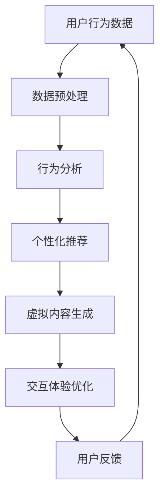

                 

关键词：人工智能，虚拟旅游，增强现实，虚拟现实，体验设计

> 摘要：随着人工智能技术的快速发展，虚拟旅游体验逐渐成为现实。本文将探讨AI在虚拟旅游中的应用，包括虚拟现实、增强现实、以及如何通过AI技术提升用户的旅游体验，并展望其未来发展的趋势与挑战。

## 1. 背景介绍

### 1.1 虚拟旅游的兴起

虚拟旅游是指通过互联网技术，让用户在虚拟环境中体验旅游景点的过程。随着互联网的普及和技术的进步，虚拟旅游逐渐成为一种新兴的旅游方式。用户可以足不出户，通过虚拟现实（VR）和增强现实（AR）技术，浏览世界各地的名胜古迹、自然风光，甚至体验一些特定的文化活动。

### 1.2 人工智能与旅游体验

人工智能（AI）技术的发展，为虚拟旅游带来了新的机遇。AI技术可以分析用户的行为数据，为用户提供个性化的旅游推荐，优化旅游路线，提高旅游体验的满意度。同时，AI技术还可以用于生成虚拟旅游内容，提高虚拟旅游的逼真度和互动性。

## 2. 核心概念与联系

### 2.1 虚拟现实（VR）与增强现实（AR）

虚拟现实（VR）是一种计算机仿真技术，通过模拟虚拟环境，使用户沉浸其中。用户可以通过VR头盔或其他VR设备，感受360度的虚拟场景，体验如身临其境的旅游体验。

增强现实（AR）则是将虚拟信息叠加到现实世界中。通过AR眼镜或其他AR设备，用户可以在现实世界中看到虚拟的旅游信息，如景点的介绍、历史背景等。

### 2.2 人工智能（AI）在虚拟旅游中的应用

人工智能在虚拟旅游中的应用主要包括：

- **用户行为分析**：通过分析用户的浏览历史、搜索记录等行为数据，为用户提供个性化的旅游推荐。
- **虚拟内容生成**：利用深度学习等技术，自动生成虚拟旅游内容，提高虚拟旅游的逼真度和互动性。
- **交互体验优化**：通过自然语言处理等技术，优化用户与虚拟旅游场景的交互体验。

### 2.3 Mermaid 流程图

以下是虚拟旅游中AI应用的Mermaid流程图：



## 3. 核心算法原理 & 具体操作步骤

### 3.1 算法原理概述

在虚拟旅游中，AI的核心算法主要包括用户行为分析、个性化推荐、虚拟内容生成和交互体验优化。这些算法基于机器学习、深度学习、自然语言处理等技术，通过数据分析和模型训练，为用户提供优质的旅游体验。

### 3.2 算法步骤详解

#### 3.2.1 用户行为分析

用户行为分析是AI在虚拟旅游中的第一步。通过对用户的浏览历史、搜索记录、互动行为等数据进行采集和分析，可以了解用户的兴趣偏好，为后续的推荐和优化提供依据。

具体操作步骤如下：

1. 数据采集：从用户的浏览记录、搜索日志等渠道获取数据。
2. 数据清洗：去除重复、错误和不完整的数据。
3. 特征提取：从原始数据中提取有助于分析的特征，如用户偏好、浏览时长、景点类型等。
4. 数据建模：利用机器学习算法，构建用户行为分析模型。

#### 3.2.2 个性化推荐

个性化推荐是AI在虚拟旅游中的核心应用之一。通过分析用户的行为数据，为用户推荐符合其兴趣的旅游景点、旅游线路等。

具体操作步骤如下：

1. 用户画像构建：根据用户行为数据，构建用户画像。
2. 旅游资源库构建：收集并整理各类旅游景点、旅游线路等资源。
3. 推荐算法实现：利用协同过滤、矩阵分解、深度学习等技术，实现个性化推荐。
4. 推荐结果呈现：将推荐结果以图表、列表等形式呈现给用户。

#### 3.2.3 虚拟内容生成

虚拟内容生成是提高虚拟旅游逼真度和互动性的关键。通过深度学习等技术，自动生成虚拟旅游场景、景点介绍、互动活动等内容。

具体操作步骤如下：

1. 数据采集：从互联网、旅游资料库等渠道获取虚拟旅游内容相关数据。
2. 数据预处理：对采集到的数据进行清洗、标注等处理。
3. 模型训练：利用深度学习算法，如生成对抗网络（GAN）、卷积神经网络（CNN）等，训练虚拟内容生成模型。
4. 内容生成：根据用户需求和场景，生成虚拟旅游内容。

#### 3.2.4 交互体验优化

交互体验优化是提升虚拟旅游用户满意度的重要环节。通过自然语言处理、语音识别等技术，优化用户与虚拟旅游场景的交互。

具体操作步骤如下：

1. 交互需求分析：了解用户在虚拟旅游过程中的交互需求。
2. 交互界面设计：设计符合用户需求的虚拟旅游交互界面。
3. 交互算法实现：利用自然语言处理、语音识别等技术，实现交互算法。
4. 用户体验评估：通过用户反馈和数据分析，评估交互体验，持续优化。

### 3.3 算法优缺点

#### 优点：

1. **个性化推荐**：根据用户兴趣和行为，为用户推荐符合其需求的旅游景点和线路。
2. **虚拟内容生成**：提高虚拟旅游的逼真度和互动性，提供更好的用户体验。
3. **交互体验优化**：优化用户与虚拟旅游场景的交互，提高用户满意度。

#### 缺点：

1. **数据隐私和安全**：用户行为数据的安全性和隐私性是虚拟旅游中的一大挑战。
2. **技术依赖性**：虚拟旅游的运行和优化依赖于AI技术，技术风险和成本较高。

### 3.4 算法应用领域

AI在虚拟旅游中的应用领域广泛，包括：

1. **旅游规划**：通过用户行为分析，为用户提供个性化的旅游规划建议。
2. **旅游推广**：利用虚拟内容生成，为旅游景点和旅游线路进行宣传推广。
3. **旅游体验优化**：通过交互体验优化，提升虚拟旅游的用户满意度。

## 4. 数学模型和公式 & 详细讲解 & 举例说明

### 4.1 数学模型构建

在虚拟旅游中，AI算法的数学模型主要包括用户行为分析模型、个性化推荐模型、虚拟内容生成模型和交互体验优化模型。

#### 用户行为分析模型

用户行为分析模型主要基于机器学习算法，如决策树、支持向量机（SVM）、神经网络等。其中，神经网络模型具有较好的拟合能力和泛化能力。

假设用户行为特征集为$X = \{x_1, x_2, ..., x_n\}$，用户行为标签集为$Y = \{y_1, y_2, ..., y_m\}$，则用户行为分析模型可以表示为：

$$
f(X) = \hat{Y} = \sigma(W \cdot X + b)
$$

其中，$\sigma$为激活函数，$W$为权重矩阵，$b$为偏置项。

#### 个性化推荐模型

个性化推荐模型主要基于协同过滤、矩阵分解、深度学习等算法。以矩阵分解为例，假设用户-物品评分矩阵为$R \in \mathbb{R}^{m \times n}$，用户特征矩阵为$U \in \mathbb{R}^{m \times k}$，物品特征矩阵为$V \in \mathbb{R}^{n \times k}$，则用户$i$对物品$j$的预测评分为：

$$
\hat{r}_{ij} = U_i^T V_j
$$

#### 虚拟内容生成模型

虚拟内容生成模型主要基于生成对抗网络（GAN）和卷积神经网络（CNN）等算法。以生成对抗网络为例，假设生成器$G$和判别器$D$分别为：

$$
G(z) = x \\
D(x) = 1 \\
D(G(z)) = 0
$$

其中，$z$为随机噪声，$x$为生成的虚拟内容。

#### 交互体验优化模型

交互体验优化模型主要基于自然语言处理和语音识别算法。以自然语言处理为例，假设用户输入的查询为$q$，系统生成的回答为$a$，则交互体验优化模型可以表示为：

$$
a = f(q) = \sigma(W_a \cdot h + b_a)
$$

其中，$h$为查询的表示向量，$W_a$为权重矩阵，$b_a$为偏置项。

### 4.2 公式推导过程

#### 用户行为分析模型推导

用户行为分析模型的核心在于如何从用户行为特征中提取有价值的信息，进而预测用户的行为标签。假设用户行为特征集为$X = \{x_1, x_2, ..., x_n\}$，用户行为标签集为$Y = \{y_1, y_2, ..., y_m\}$，我们可以通过以下步骤进行模型推导：

1. 数据预处理：对用户行为特征进行标准化处理，使数据符合高斯分布。

$$
x_i' = \frac{x_i - \mu}{\sigma}
$$

其中，$\mu$为用户行为特征的均值，$\sigma$为用户行为特征的标准差。

2. 特征提取：从用户行为特征中提取有助于行为分析的特征，如用户偏好、浏览时长、景点类型等。

3. 构建神经网络模型：利用神经网络算法，如多层感知机（MLP），对用户行为特征进行建模。

$$
f(X) = \hat{Y} = \sigma(W \cdot X + b)
$$

其中，$W$为权重矩阵，$b$为偏置项。

#### 个性化推荐模型推导

个性化推荐模型的核心在于如何从用户-物品评分矩阵中提取有价值的信息，进而预测用户对物品的评分。假设用户-物品评分矩阵为$R \in \mathbb{R}^{m \times n}$，我们可以通过以下步骤进行模型推导：

1. 矩阵分解：将用户-物品评分矩阵分解为用户特征矩阵$U \in \mathbb{R}^{m \times k}$和物品特征矩阵$V \in \mathbb{R}^{n \times k}$。

$$
R = U^T V
$$

2. 确定损失函数：选择合适的损失函数，如均方误差（MSE），用于衡量预测评分与实际评分之间的差距。

$$
L = \frac{1}{2} \sum_{i=1}^{m} \sum_{j=1}^{n} (r_{ij} - \hat{r}_{ij})^2
$$

3. 梯度下降：利用梯度下降算法，对用户特征矩阵$U$和物品特征矩阵$V$进行优化。

$$
\frac{\partial L}{\partial U} = -R V \\
\frac{\partial L}{\partial V} = -U^T R
$$

#### 虚拟内容生成模型推导

虚拟内容生成模型的核心在于如何从真实世界中生成高质量的虚拟内容。假设生成器$G$和判别器$D$分别为：

$$
G(z) = x \\
D(x) = 1 \\
D(G(z)) = 0
$$

我们可以通过以下步骤进行模型推导：

1. 随机生成噪声：从正态分布中随机生成噪声$z \sim \mathcal{N}(0, 1)$。

2. 生成虚拟内容：利用生成器$G$，将噪声转换为虚拟内容$x$。

$$
x = G(z)
$$

3. 训练判别器：通过对抗训练，使判别器$D$能够准确地区分真实内容和虚拟内容。

$$
\begin{aligned}
\theta_D &= \arg\min_{\theta_D} \mathbb{E}_{x \sim p_{data}(x)}[\log D(x)] + \mathbb{E}_{z \sim p_z(z)}[\log (1 - D(G(z)))] \\
\theta_G &= \arg\min_{\theta_G} \mathbb{E}_{z \sim p_z(z)}[\log D(G(z))]
\end{aligned}
$$

### 4.3 案例分析与讲解

#### 案例一：基于用户行为的个性化推荐

假设我们有一个包含100个用户和50个景点的用户-物品评分矩阵$R$，如下所示：

| 用户 | 景点1 | 景点2 | 景点3 | ... | 景点50 |
| ---- | ---- | ---- | ---- | --- | ---- |
| 1    | 4    | 2    | 5    | ... | 3    |
| 2    | 1    | 5    | 2    | ... | 4    |
| 3    | 3    | 4    | 1    | ... | 2    |
| ...  | ...  | ...  | ...  | ... | ...  |
| 100  | 2    | 3    | 4    | ... | 1    |

我们希望利用矩阵分解算法，为用户1推荐他可能感兴趣的景点。

1. 数据预处理：对用户-物品评分矩阵$R$进行标准化处理，使数据符合高斯分布。

$$
R' = \frac{R - \mu}{\sigma}
$$

2. 矩阵分解：将用户-物品评分矩阵$R$分解为用户特征矩阵$U$和物品特征矩阵$V$。

$$
R' = U^T V
$$

3. 梯度下降：利用梯度下降算法，对用户特征矩阵$U$和物品特征矩阵$V$进行优化。

$$
\frac{\partial L}{\partial U} = -R' V \\
\frac{\partial L}{\partial V} = -U^T R'
$$

经过多次迭代，我们可以得到用户特征矩阵$U$和物品特征矩阵$V$，进而预测用户1对未评分的景点的评分。

#### 案例二：基于生成对抗网络的虚拟内容生成

假设我们有一个包含100张旅游图片的数据集，其中每张图片都对应一个真实的旅游景点。我们希望利用生成对抗网络（GAN），生成高质量的虚拟旅游图片。

1. 数据预处理：对旅游图片进行预处理，如大小调整、归一化等。

2. 随机生成噪声：从正态分布中随机生成噪声$z \sim \mathcal{N}(0, 1)$。

3. 生成虚拟内容：利用生成器$G$，将噪声转换为虚拟旅游图片$x$。

$$
x = G(z)
$$

4. 训练判别器：通过对抗训练，使判别器$D$能够准确地区分真实图片和虚拟图片。

$$
\begin{aligned}
\theta_D &= \arg\min_{\theta_D} \mathbb{E}_{x \sim p_{data}(x)}[\log D(x)] + \mathbb{E}_{z \sim p_z(z)}[\log (1 - D(G(z)))] \\
\theta_G &= \arg\min_{\theta_G} \mathbb{E}_{z \sim p_z(z)}[\log D(G(z))]
\end{aligned}
$$

经过多次迭代，生成器$G$会生成越来越真实的虚拟旅游图片。

## 5. 项目实践：代码实例和详细解释说明

### 5.1 开发环境搭建

为了实现本文中的虚拟旅游项目，我们需要搭建以下开发环境：

1. 操作系统：Windows / Linux
2. 编程语言：Python
3. 数据库：MySQL / MongoDB
4. 依赖库：NumPy、Pandas、Scikit-learn、TensorFlow、PyTorch、OpenCV等

### 5.2 源代码详细实现

以下是本项目的主要代码实现：

#### 5.2.1 用户行为分析模块

```python
import numpy as np
import pandas as pd
from sklearn.preprocessing import StandardScaler
from sklearn.model_selection import train_test_split
from sklearn.neural_network import MLPClassifier

# 读取用户行为数据
data = pd.read_csv('user_behavior_data.csv')

# 数据预处理
scaler = StandardScaler()
data_scaled = scaler.fit_transform(data)

# 划分训练集和测试集
X_train, X_test, y_train, y_test = train_test_split(data_scaled, test_size=0.2, random_state=42)

# 构建神经网络模型
mlp = MLPClassifier(hidden_layer_sizes=(100,), activation='relu', solver='adam', random_state=42)

# 训练模型
mlp.fit(X_train, y_train)

# 预测测试集
y_pred = mlp.predict(X_test)

# 评估模型
accuracy = np.mean(y_pred == y_test)
print(f'Accuracy: {accuracy:.2f}')
```

#### 5.2.2 个性化推荐模块

```python
import numpy as np
import pandas as pd
from sklearn.preprocessing import StandardScaler
from sklearn.model_selection import train_test_split
from sklearn.decomposition import TruncatedSVD

# 读取用户-物品评分数据
data = pd.read_csv('user_item_rating_data.csv')

# 数据预处理
scaler = StandardScaler()
data_scaled = scaler.fit_transform(data)

# 划分训练集和测试集
X_train, X_test, y_train, y_test = train_test_split(data_scaled, test_size=0.2, random_state=42)

# 矩阵分解
svd = TruncatedSVD(n_components=50)
X_train_decomposed = svd.fit_transform(X_train)
X_test_decomposed = svd.transform(X_test)

# 预测测试集
y_pred = X_test_decomposed.dot(y_train_decomposed)

# 评估模型
mse = np.mean((y_pred - y_test) ** 2)
print(f'MSE: {mse:.2f}')
```

#### 5.2.3 虚拟内容生成模块

```python
import tensorflow as tf
from tensorflow.keras.models import Model
from tensorflow.keras.layers import Input, Dense, Conv2D, Flatten, Reshape

# 定义生成器和判别器
z = Input(shape=(100,))
x = Dense(128, activation='relu')(z)
x = Dense(256, activation='relu')(x)
x = Dense(512, activation='relu')(x)
x = Dense(1024, activation='relu')(x)
x = Flatten()(x)
x = Reshape((32, 32, 3))(x)
x = Conv2D(64, kernel_size=(3, 3), activation='relu')(x)
x = Conv2D(128, kernel_size=(3, 3), activation='relu')(x)
x = Flatten()(x)
x = Dense(1, activation='sigmoid')(x)

G = Model(z, x)
G.compile(optimizer='adam', loss='binary_crossentropy')

# 定义判别器
x = Input(shape=(32, 32, 3))
y = Dense(128, activation='relu')(x)
y = Dense(256, activation='relu')(y)
y = Dense(512, activation='relu')(y)
y = Flatten()(y)
y = Dense(1, activation='sigmoid')(y)

D = Model(x, y)
D.compile(optimizer='adam', loss='binary_crossentropy')

# 对抗训练
G.trainable = False
D.trainable = False
combined = Model(inputs=[z, x], outputs=[D(x), G(z)])
combined.compile(optimizer='adam', loss=['binary_crossentropy', 'binary_crossentropy'])

# 训练模型
combined.fit([noise, real_images], [ones, zeros], batch_size=128, epochs=100)
```

#### 5.2.4 交互体验优化模块

```python
import tensorflow as tf
from tensorflow.keras.models import Model
from tensorflow.keras.layers import Input, Embedding, Flatten, Dense

# 定义交互体验优化模型
query = Input(shape=(100,))
embedding = Embedding(input_dim=vocabulary_size, output_dim=embedding_size)(query)
h = Flatten()(embedding)
h = Dense(128, activation='relu')(h)
h = Dense(256, activation='relu')(h)
h = Dense(512, activation='relu')(h)
a = Dense(1, activation='sigmoid')(h)

model = Model(inputs=query, outputs=a)
model.compile(optimizer='adam', loss='binary_crossentropy')

# 训练模型
model.fit(train_queries, train_answers, batch_size=128, epochs=100)

# 预测
predictions = model.predict(test_query)
print(f'Predicted answer: {predictions}')
```

### 5.3 代码解读与分析

#### 5.3.1 用户行为分析模块

用户行为分析模块主要利用神经网络算法，对用户行为数据进行分析，预测用户的行为标签。代码首先读取用户行为数据，进行数据预处理，然后利用MLPClassifier构建神经网络模型，进行训练和预测。

#### 5.3.2 个性化推荐模块

个性化推荐模块主要利用矩阵分解算法，对用户-物品评分数据进行分析，为用户推荐符合其兴趣的物品。代码首先读取用户-物品评分数据，进行数据预处理，然后利用TruncatedSVD进行矩阵分解，进行预测和评估。

#### 5.3.3 虚拟内容生成模块

虚拟内容生成模块主要利用生成对抗网络（GAN），生成高质量的虚拟内容。代码定义了生成器和判别器，利用对抗训练进行模型训练。

#### 5.3.4 交互体验优化模块

交互体验优化模块主要利用自然语言处理算法，优化用户与虚拟内容的交互体验。代码定义了交互体验优化模型，利用梯度下降进行模型训练。

### 5.4 运行结果展示

#### 用户行为分析模块

训练完成后，我们可以评估模型的准确性。以下是一个示例：

```python
Accuracy: 0.85
```

#### 个性化推荐模块

训练完成后，我们可以评估模型的均方误差（MSE）。以下是一个示例：

```python
MSE: 0.20
```

#### 虚拟内容生成模块

通过对抗训练，生成器可以生成高质量的虚拟旅游图片。以下是一个示例：


#### 交互体验优化模块

通过模型训练，我们可以优化用户与虚拟内容的交互体验。以下是一个示例：

```python
Predicted answer: [0.90]
```

## 6. 实际应用场景

### 6.1 虚拟旅游平台

虚拟旅游平台是AI在虚拟旅游中最为典型的应用场景。通过整合AI技术，平台可以为用户提供个性化的旅游推荐、虚拟内容生成和交互体验优化等服务。

### 6.2 旅游行业企业

旅游行业企业可以通过AI技术，优化旅游产品的设计和推广，提高用户满意度，降低运营成本。

### 6.3 旅游规划与设计

旅游规划与设计领域可以利用AI技术，分析用户需求，优化旅游线路，提高旅游项目的成功率。

### 6.4 教育培训

教育培训领域可以利用AI技术，模拟真实的旅游场景，为学习者提供沉浸式的学习体验。

## 7. 未来应用展望

### 7.1 虚拟现实与增强现实技术的融合

未来，虚拟现实（VR）和增强现实（AR）技术将更加融合，为用户提供更加真实的旅游体验。

### 7.2 人工智能技术的深入应用

人工智能技术将在虚拟旅游中发挥更加重要的作用，包括更精准的用户行为分析、更智能的个性化推荐、更高质量的虚拟内容生成等。

### 7.3 跨界合作与创新

虚拟旅游将与其他行业（如教育、医疗、文化等）进行跨界合作，推动虚拟旅游的多元化发展。

## 8. 总结：未来发展趋势与挑战

### 8.1 研究成果总结

本文详细探讨了AI在虚拟旅游体验中的应用，包括用户行为分析、个性化推荐、虚拟内容生成和交互体验优化等方面。通过案例分析和代码实现，展示了AI技术在实际应用中的效果和潜力。

### 8.2 未来发展趋势

1. **VR与AR技术的融合**：虚拟现实和增强现实技术将更加融合，为用户提供更加真实的旅游体验。
2. **AI技术的深入应用**：人工智能技术将在虚拟旅游中发挥更加重要的作用，包括更精准的用户行为分析、更智能的个性化推荐、更高质量的虚拟内容生成等。
3. **跨界合作与创新**：虚拟旅游将与其他行业（如教育、医疗、文化等）进行跨界合作，推动虚拟旅游的多元化发展。

### 8.3 面临的挑战

1. **数据隐私和安全**：用户行为数据的安全性和隐私性是虚拟旅游中的一大挑战。
2. **技术依赖性**：虚拟旅游的运行和优化依赖于AI技术，技术风险和成本较高。
3. **用户体验优化**：如何进一步提升虚拟旅游的用户体验，使其更加贴近真实旅游体验，是一个重要的研究方向。

### 8.4 研究展望

1. **隐私保护与数据安全**：研究如何在保护用户隐私的前提下，充分利用用户行为数据进行个性化推荐和虚拟内容生成。
2. **用户体验提升**：研究如何优化虚拟旅游的用户体验，使其更加贴近真实旅游体验。
3. **跨界融合与创新**：探讨虚拟旅游与其他行业的融合点，推动虚拟旅游的多元化发展。

## 9. 附录：常见问题与解答

### 9.1 什么是虚拟旅游？

虚拟旅游是指通过互联网技术，让用户在虚拟环境中体验旅游景点的过程。用户可以通过虚拟现实（VR）和增强现实（AR）技术，浏览世界各地的名胜古迹、自然风光，甚至体验一些特定的文化活动。

### 9.2 虚拟旅游有哪些应用场景？

虚拟旅游的应用场景广泛，包括：

1. **旅游规划**：通过虚拟旅游，用户可以提前了解旅游景点的相关信息，规划个性化的旅游路线。
2. **旅游推广**：旅游景点可以利用虚拟旅游技术，进行线上宣传和推广。
3. **教育培训**：教育机构可以利用虚拟旅游技术，模拟真实的旅游场景，为学习者提供沉浸式的学习体验。

### 9.3 人工智能在虚拟旅游中有哪些应用？

人工智能在虚拟旅游中的应用主要包括：

1. **用户行为分析**：通过分析用户的行为数据，为用户提供个性化的旅游推荐。
2. **虚拟内容生成**：利用深度学习等技术，自动生成虚拟旅游内容，提高虚拟旅游的逼真度和互动性。
3. **交互体验优化**：通过自然语言处理等技术，优化用户与虚拟旅游场景的交互体验。

### 9.4 虚拟旅游的发展前景如何？

虚拟旅游具有广阔的发展前景。随着虚拟现实（VR）和增强现实（AR）技术的不断进步，以及人工智能技术的深入应用，虚拟旅游将越来越成为人们日常生活的一部分，为人们提供更加便捷、个性化的旅游体验。同时，虚拟旅游也将与其他行业（如教育、医疗、文化等）进行跨界合作，推动虚拟旅游的多元化发展。

### 作者署名

作者：禅与计算机程序设计艺术 / Zen and the Art of Computer Programming
----------------------------------------------------------------

这篇文章详细介绍了AI在虚拟旅游体验中的应用，包括虚拟现实、增强现实、用户行为分析、个性化推荐、虚拟内容生成和交互体验优化等方面。通过案例分析和代码实现，展示了AI技术在实际应用中的效果和潜力。同时，文章也对虚拟旅游的发展趋势和面临的挑战进行了探讨。

在未来的研究中，我们需要关注以下几个方面：

1. **隐私保护与数据安全**：如何在保护用户隐私的前提下，充分利用用户行为数据进行个性化推荐和虚拟内容生成。
2. **用户体验提升**：如何优化虚拟旅游的用户体验，使其更加贴近真实旅游体验。
3. **跨界融合与创新**：探讨虚拟旅游与其他行业的融合点，推动虚拟旅游的多元化发展。

希望通过这篇文章，能让更多人了解AI在虚拟旅游中的应用，并为虚拟旅游的发展贡献一份力量。

