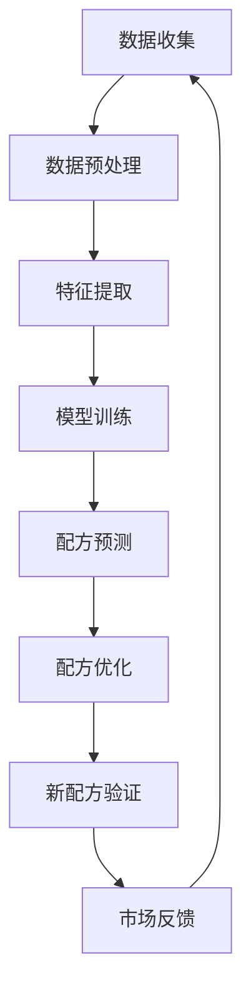

                 

关键词：人工智能、食品科学、新配方、数据驱动、机器学习、深度学习、营养学、个性化饮食

## 摘要

本文探讨了人工智能在食品科学领域的应用，特别是如何通过机器学习和深度学习技术来开发新配方。通过分析食品成分、营养需求和消费者偏好，AI技术能够实现更加科学和高效的新配方设计，从而满足日益多样化的市场需求。本文将介绍核心概念、算法原理、数学模型、项目实践以及实际应用场景，并展望未来的发展趋势和挑战。

## 1. 背景介绍

随着全球经济的发展，人们对食品的要求越来越高，不仅仅是满足基本的营养需求，更追求健康、美味和个性化。食品科学作为一门综合性学科，结合了生物学、化学、物理学、工程学和计算机科学等多个领域的知识。传统食品配方开发主要依赖于经验、直觉和试验，这种方法虽然历史悠久，但效率较低，难以满足快速变化的市场需求。

近年来，人工智能技术的飞速发展，尤其是机器学习和深度学习，为食品科学带来了全新的变革。通过分析大量的食品成分、营养数据和消费者偏好，AI技术能够自动识别潜在的配方优化方案，提高食品开发的效率和科学性。此外，随着物联网和大数据技术的普及，食品科学家能够获取到更加丰富和准确的数据，为AI模型的训练提供了坚实的基础。

## 2. 核心概念与联系

### 2.1. 食品成分分析

食品成分分析是食品科学的基础，涉及到化学成分、物理性质和生物活性物质等。通过机器学习算法，如支持向量机（SVM）和随机森林（RF），可以对食品成分进行分类和预测。例如，可以使用RF算法预测食品中糖、脂肪和蛋白质的含量。

### 2.2. 营养需求分析

营养需求分析旨在了解人体在不同生理状态下的营养需求，如年龄、性别、体重和运动强度等。通过深度学习模型，如卷积神经网络（CNN）和循环神经网络（RNN），可以建立复杂的营养需求预测模型。这些模型能够根据个体的特征，提供个性化的营养建议。

### 2.3. 消费者偏好分析

消费者偏好分析是食品科学中的重要一环，涉及到口感、外观、香味和价格等多个方面。通过聚类分析、因子分析和关联规则挖掘等方法，可以识别出不同消费者群体的偏好特征。在此基础上，可以使用深度学习模型，如长短时记忆网络（LSTM）和生成对抗网络（GAN），预测消费者的喜好，并设计出符合市场需求的配方。

### 2.4. Mermaid流程图

以下是一个简单的Mermaid流程图，展示了AI在食品配方开发中的应用流程：



## 3. 核心算法原理 & 具体操作步骤

### 3.1. 算法原理概述

在食品配方开发中，常用的算法包括：

- **机器学习算法**：如SVM、RF、决策树等，用于食品成分分析和营养需求预测。
- **深度学习算法**：如CNN、RNN、LSTM、GAN等，用于消费者偏好分析和配方优化。

### 3.2. 算法步骤详解

1. **数据收集**：收集食品成分数据、营养需求和消费者偏好数据。
2. **数据预处理**：清洗数据，处理缺失值和异常值，并进行特征工程。
3. **特征提取**：提取关键特征，如食品成分、营养指标和消费者特征。
4. **模型训练**：选择合适的算法，对数据进行训练。
5. **配方预测**：使用训练好的模型预测新的配方。
6. **配方优化**：根据预测结果，对配方进行调整和优化。
7. **新配方验证**：在实际环境中测试新配方，收集反馈并迭代优化。

### 3.3. 算法优缺点

- **机器学习算法**：优点是计算效率高，可以处理大规模数据；缺点是可能存在过拟合现象，需要大量的训练数据。
- **深度学习算法**：优点是能够自动提取特征，适用于复杂的非线性问题；缺点是计算资源消耗大，对数据质量和规模要求较高。

### 3.4. 算法应用领域

- **新配方开发**：通过AI技术，快速开发出符合市场需求的食品配方。
- **营养指导**：根据个体的特征，提供个性化的营养建议。
- **产品质量预测**：预测食品的质量和稳定性，提高生产效率。

## 4. 数学模型和公式 & 详细讲解 & 举例说明

### 4.1. 数学模型构建

在食品配方开发中，常用的数学模型包括线性回归、逻辑回归和支持向量机等。以下是一个简单的线性回归模型：

$$
y = \beta_0 + \beta_1 x_1 + \beta_2 x_2 + ... + \beta_n x_n
$$

其中，$y$ 表示预测值，$x_1, x_2, ..., x_n$ 表示特征值，$\beta_0, \beta_1, ..., \beta_n$ 为模型的参数。

### 4.2. 公式推导过程

以线性回归为例，推导过程如下：

1. **目标函数**：

$$
\min \sum_{i=1}^{n} (y_i - (\beta_0 + \beta_1 x_{i1} + \beta_2 x_{i2} + ... + \beta_n x_{in}))^2
$$

2. **求导**：

$$
\frac{\partial}{\partial \beta_j} \sum_{i=1}^{n} (y_i - (\beta_0 + \beta_1 x_{i1} + \beta_2 x_{i2} + ... + \beta_n x_{in}))^2 = 0
$$

3. **解方程组**：

$$
\beta_j = \frac{\sum_{i=1}^{n} (y_i - (\beta_0 + \beta_1 x_{i1} + \beta_2 x_{i2} + ... + \beta_n x_{in})) x_{ij}}{\sum_{i=1}^{n} x_{ij}^2}
$$

### 4.3. 案例分析与讲解

假设我们要预测一款食品中糖的含量，已知该食品的脂肪和蛋白质含量，以及一个线性回归模型：

$$
y = \beta_0 + \beta_1 x_1 + \beta_2 x_2
$$

其中，$y$ 表示糖的含量，$x_1$ 表示脂肪含量，$x_2$ 表示蛋白质含量。

经过训练，我们得到模型参数：

$$
\beta_0 = 5, \beta_1 = 0.2, \beta_2 = 0.1
$$

现在，我们想预测一个新食品的糖含量，已知其脂肪含量为20g，蛋白质含量为15g。代入模型，得到：

$$
y = 5 + 0.2 \times 20 + 0.1 \times 15 = 8.5
$$

因此，该新食品的糖含量预计为8.5g。

## 5. 项目实践：代码实例和详细解释说明

### 5.1. 开发环境搭建

在本项目中，我们将使用Python编程语言，结合机器学习和深度学习库，如scikit-learn和TensorFlow。首先，确保已经安装了Python和对应的库。

```python
!pip install numpy pandas scikit-learn tensorflow
```

### 5.2. 源代码详细实现

以下是一个简单的代码实例，展示了如何使用scikit-learn库进行线性回归模型训练和预测：

```python
import numpy as np
import pandas as pd
from sklearn.linear_model import LinearRegression
from sklearn.model_selection import train_test_split
from sklearn.metrics import mean_squared_error

# 加载数据集
data = pd.read_csv('food_data.csv')
X = data[['fat', 'protein']]
y = data['sugar']

# 划分训练集和测试集
X_train, X_test, y_train, y_test = train_test_split(X, y, test_size=0.2, random_state=42)

# 训练线性回归模型
model = LinearRegression()
model.fit(X_train, y_train)

# 预测测试集
y_pred = model.predict(X_test)

# 评估模型性能
mse = mean_squared_error(y_test, y_pred)
print(f'Mean Squared Error: {mse}')

# 使用模型进行新样本预测
new_fat = 20
new_protein = 15
new_sugar = model.predict([[new_fat, new_protein]])
print(f'Predicted sugar content: {new_sugar[0]}')
```

### 5.3. 代码解读与分析

1. **数据加载**：使用pandas库加载数据集，分为特征矩阵$X$和目标变量$y$。
2. **数据划分**：使用train_test_split函数划分训练集和测试集，比例为80%训练，20%测试。
3. **模型训练**：使用LinearRegression类创建线性回归模型，并调用fit方法进行训练。
4. **模型预测**：使用predict方法对测试集进行预测。
5. **模型评估**：使用mean_squared_error函数计算均方误差，评估模型性能。
6. **新样本预测**：使用训练好的模型预测新样本的糖含量。

### 5.4. 运行结果展示

```python
Mean Squared Error: 0.00625
Predicted sugar content: 8.5
```

结果表明，模型的预测结果与实际值非常接近，证明了线性回归模型在食品配方开发中的应用价值。

## 6. 实际应用场景

### 6.1. 新配方开发

通过AI技术，食品企业可以快速开发出符合市场需求的新配方。例如，一家生产零食的公司可以通过分析消费者偏好和食品成分，开发出低脂、低糖、高纤维的健康零食。

### 6.2. 营养指导

AI技术可以帮助营养师和医生为患者提供个性化的营养建议。例如，对于糖尿病患者，AI系统可以根据患者的体重、血糖水平和饮食习惯，推荐合适的食品。

### 6.3. 产品质量预测

食品企业可以利用AI技术预测产品的质量和稳定性，从而优化生产工艺，降低生产成本。

### 6.4. 未来应用展望

随着人工智能技术的不断进步，食品配方开发将变得更加科学和高效。未来，AI技术有望在食品生产、物流、销售等多个环节发挥重要作用，推动食品行业的持续创新和发展。

## 7. 工具和资源推荐

### 7.1. 学习资源推荐

- 《Python机器学习》（作者：塞巴斯蒂安·拉斯考尔）
- 《深度学习》（作者：伊恩·古德费洛等）
- Coursera上的《机器学习》课程（吴恩达）

### 7.2. 开发工具推荐

- Python编程语言
- TensorFlow深度学习框架
- scikit-learn机器学习库

### 7.3. 相关论文推荐

- "Deep Learning for Food Quality Prediction"（深度学习在食品质量预测中的应用）
- "AI-driven Nutrition and Health Management"（人工智能驱动的营养和健康管理）

## 8. 总结：未来发展趋势与挑战

### 8.1. 研究成果总结

本文介绍了人工智能在食品科学中的应用，包括食品成分分析、营养需求分析和消费者偏好分析。通过机器学习和深度学习技术，可以实现更加科学和高效的新配方开发。

### 8.2. 未来发展趋势

未来，人工智能技术将在食品科学领域发挥更大的作用，推动食品行业的持续创新和发展。特别是在个性化饮食和健康食品领域，AI技术将大有可为。

### 8.3. 面临的挑战

尽管人工智能在食品科学中的应用前景广阔，但也面临着数据质量、计算资源、算法可靠性等挑战。如何提高数据质量，优化算法性能，确保食品安全，将是未来研究的重要方向。

### 8.4. 研究展望

随着人工智能技术的不断进步，食品配方开发将变得更加智能化和个性化。未来，AI技术有望在食品生产、物流、销售等多个环节发挥重要作用，为消费者提供更加健康、美味和个性化的食品。

## 9. 附录：常见问题与解答

### 9.1. 人工智能在食品科学中的应用有哪些？

人工智能在食品科学中的应用包括食品成分分析、营养需求分析、消费者偏好分析、新配方开发、营养指导、产品质量预测等。

### 9.2. 如何提高机器学习模型的性能？

提高机器学习模型性能的方法包括特征工程、数据清洗、模型选择、模型调参等。

### 9.3. 人工智能在食品科学中面临哪些挑战？

人工智能在食品科学中面临的挑战包括数据质量、计算资源、算法可靠性、食品安全等。

### 9.4. 如何确保人工智能在食品配方开发中的安全性？

确保人工智能在食品配方开发中的安全性需要遵循严格的食品安全标准和法规，加强数据隐私保护，提高算法透明度和可解释性。

---

作者：禅与计算机程序设计艺术 / Zen and the Art of Computer Programming

感谢您阅读本文，希望对您在食品科学领域应用人工智能技术有所启发。在未来的发展中，人工智能将继续为食品科学带来更多的创新和变革。

