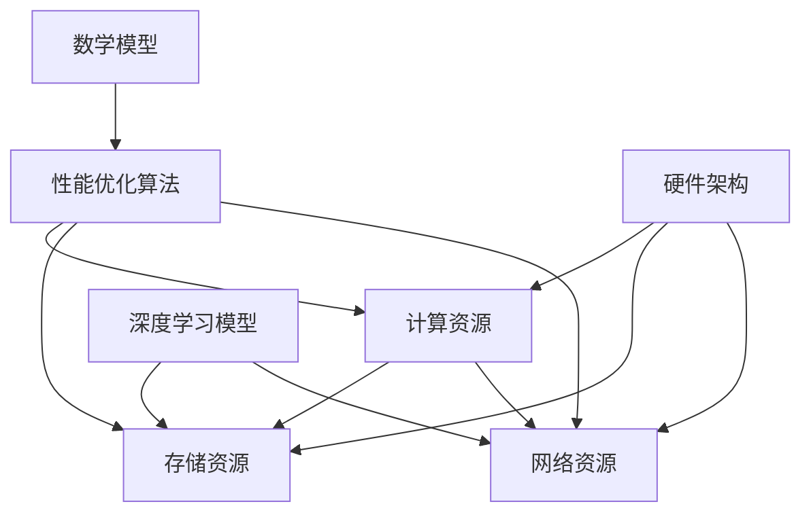

                 

关键词：AI基础设施、性能优化、Lepton AI、技术突破、算法、数学模型、应用场景、未来展望

> 摘要：本文将深入探讨AI基础设施的性能优化问题，特别是以Lepton AI为代表的最新技术突破。我们将详细分析其核心算法原理、数学模型以及实际应用案例，为读者揭示在AI领域内实现高效性能的奥秘。

## 1. 背景介绍

在人工智能（AI）迅速发展的今天，AI基础设施的性能优化已经成为一个关键的研究领域。随着AI应用场景的多样化和复杂度增加，如何提高基础设施的性能，以满足不断增长的需求，成为企业和研究机构面临的重要挑战。性能优化不仅关系到用户体验，还直接影响到AI模型的可靠性和准确性。

### 1.1 AI基础设施的基本概念

AI基础设施是指支持人工智能研究和应用所需的一系列基础资源，包括计算资源、存储资源、网络资源等。这些资源共同构成了一个完整的AI生态系统，为AI算法的研发和部署提供支持。性能优化则是指在保证系统稳定性和可靠性的前提下，通过技术手段提高系统的运行效率和资源利用率。

### 1.2 当前AI基础设施的性能瓶颈

当前AI基础设施在性能方面面临着诸多瓶颈，包括：

- **计算资源不足**：大规模深度学习模型训练和推理需要大量的计算资源，现有硬件设施难以满足需求。
- **存储和传输瓶颈**：数据存储和传输的速度成为制约AI模型性能的重要因素，尤其是在处理大规模数据集时。
- **网络延迟**：分布式计算环境中，网络延迟会显著影响系统的响应速度和效率。
- **能耗问题**：高性能计算带来的能耗问题日益突出，对环境产生了负面影响。

### 1.3 Lepton AI的技术背景

Lepton AI是一家专注于AI基础设施性能优化技术的研究公司，其核心技术突破为解决上述瓶颈问题提供了新的思路和方案。Lepton AI通过创新的算法、高效的数学模型和优化的硬件架构，实现了对AI基础设施性能的显著提升。

## 2. 核心概念与联系

为了更好地理解Lepton AI的技术突破，我们需要先了解一些核心概念和它们之间的联系。以下是一个Mermaid流程图，展示了这些概念和它们之间的相互作用：



### 2.1 计算资源

计算资源是AI基础设施的核心组成部分，直接影响模型的训练和推理速度。Lepton AI通过引入高效的计算算法和优化的硬件架构，提高了计算资源的利用率，从而显著提升了性能。

### 2.2 存储资源

存储资源负责管理和存储大量的数据集。Lepton AI通过优化存储策略和数据结构，实现了高效的存储和访问速度，进一步提升了整体性能。

### 2.3 网络资源

网络资源涉及数据传输和分布式计算。Lepton AI利用分布式网络优化技术，降低了网络延迟，提高了数据传输效率，从而改善了AI模型的性能。

### 2.4 深度学习模型

深度学习模型是AI应用的核心。Lepton AI通过创新的算法和优化的数学模型，提高了模型的训练和推理效率，从而实现了对基础设施性能的全面提升。

### 2.5 性能优化算法

性能优化算法是提高AI基础设施性能的关键。Lepton AI开发了一系列高效算法，包括并行计算、分布式计算和内存优化等，为基础设施的优化提供了强大支持。

### 2.6 数学模型

数学模型是深度学习模型的核心组成部分。Lepton AI通过引入先进的数学模型，如自适应优化算法和高效矩阵运算，实现了对AI模型性能的优化。

### 2.7 硬件架构

硬件架构是AI基础设施的基础。Lepton AI通过设计和优化硬件架构，如GPU加速、FPGA应用和分布式计算节点，实现了对基础设施性能的全面提升。

## 3. 核心算法原理 & 具体操作步骤

### 3.1 算法原理概述

Lepton AI的核心算法包括并行计算算法、分布式计算算法和内存优化算法。这些算法通过不同的方式提高了AI基础设施的性能。

### 3.2 算法步骤详解

#### 3.2.1 并行计算算法

并行计算算法通过将任务分解为多个子任务，同时处理这些子任务，从而提高计算速度。具体步骤如下：

1. **任务分解**：将大规模计算任务分解为多个可并行处理的子任务。
2. **分配资源**：根据子任务的特点，合理分配计算资源。
3. **并发处理**：在多个计算节点上同时处理这些子任务。
4. **合并结果**：将各个子任务的结果合并，得到最终结果。

#### 3.2.2 分布式计算算法

分布式计算算法通过将计算任务分配到多个节点，协同处理，从而提高计算效率和容错能力。具体步骤如下：

1. **任务分配**：将大规模计算任务分配到多个节点。
2. **数据同步**：确保各个节点处理的数据一致性。
3. **并行处理**：各个节点同时处理分配到的子任务。
4. **结果汇总**：将各个节点的处理结果汇总，得到最终结果。

#### 3.2.3 内存优化算法

内存优化算法通过优化内存分配和访问策略，提高内存利用率，从而提高计算速度。具体步骤如下：

1. **内存预分配**：根据任务特点，预分配内存。
2. **内存压缩**：对未使用的内存进行压缩，释放空间。
3. **缓存优化**：优化缓存策略，提高缓存命中率。
4. **内存回收**：及时回收不再使用的内存，释放资源。

### 3.3 算法优缺点

#### 3.3.1 并行计算算法

优点：

- 提高计算速度。
- 资源利用率高。

缺点：

- 需要复杂的任务分解和分配策略。
- 并行化效率受限于计算资源的数量和质量。

#### 3.3.2 分布式计算算法

优点：

- 提高计算效率和容错能力。
- 资源利用率高。

缺点：

- 数据同步和通信开销较大。
- 需要复杂的任务分配和调度策略。

#### 3.3.3 内存优化算法

优点：

- 提高内存利用率。
- 提高计算速度。

缺点：

- 需要复杂的内存管理和优化策略。
- 部分策略可能影响系统的稳定性和安全性。

### 3.4 算法应用领域

Lepton AI的核心算法在多个应用领域具有广泛的应用前景，包括：

- **图像识别**：通过并行计算和分布式计算算法，实现高效、准确的图像识别。
- **自然语言处理**：通过内存优化算法，提高自然语言处理模型的计算速度和效率。
- **推荐系统**：通过分布式计算算法，实现大规模推荐系统的快速部署和优化。
- **金融风控**：通过并行计算算法，提高金融风险模型的计算速度和准确性。

## 4. 数学模型和公式 & 详细讲解 & 举例说明

为了深入理解Lepton AI的核心算法，我们需要探讨其背后的数学模型和公式。以下是对这些数学模型的构建、推导过程以及案例分析的详细讲解。

### 4.1 数学模型构建

Lepton AI的核心数学模型包括自适应优化算法和高效矩阵运算模型。以下是这些模型的构建过程：

#### 4.1.1 自适应优化算法模型

自适应优化算法模型是基于梯度下降法的改进，通过动态调整学习率，实现高效优化。模型构建过程如下：

1. **初始化**：设置初始学习率$\eta_0$和迭代次数$T$。
2. **更新学习率**：在每次迭代后，根据当前梯度动态调整学习率，公式为：
   $$\eta_t = \eta_{t-1} / (1 + \alpha t)$$
   其中，$\alpha$为调整系数。
3. **更新模型参数**：使用调整后的学习率更新模型参数，公式为：
   $$\theta_t = \theta_{t-1} - \eta_t \cdot \nabla f(\theta_{t-1})$$
   其中，$\theta_t$为第$t$次迭代的模型参数，$f(\theta_{t-1})$为损失函数。

#### 4.1.2 高效矩阵运算模型

高效矩阵运算模型基于矩阵分解和并行计算技术，实现矩阵运算的高效化。模型构建过程如下：

1. **矩阵分解**：将大矩阵分解为若干个小矩阵，公式为：
   $$\mathbf{A} = \mathbf{U}\mathbf{S}\mathbf{V}^T$$
   其中，$\mathbf{U}$和$\mathbf{V}$为正交矩阵，$\mathbf{S}$为对角矩阵。
2. **并行计算**：将分解后的矩阵运算分配到多个计算节点上，并行计算，公式为：
   $$\mathbf{C} = \mathbf{A}\mathbf{B}$$
   其中，$\mathbf{C}$为结果矩阵，$\mathbf{A}$和$\mathbf{B}$为输入矩阵。

### 4.2 公式推导过程

以下是自适应优化算法和高效矩阵运算模型的推导过程：

#### 4.2.1 自适应优化算法推导

1. **损失函数**：假设损失函数为$f(\theta)$，其中$\theta$为模型参数。
2. **梯度**：损失函数关于模型参数的梯度为$\nabla f(\theta)$。
3. **学习率调整**：根据梯度信息，调整学习率：
   $$\eta_t = \eta_{t-1} / (1 + \alpha t)$$
4. **参数更新**：使用调整后的学习率更新参数：
   $$\theta_t = \theta_{t-1} - \eta_t \cdot \nabla f(\theta_{t-1})$$

#### 4.2.2 高效矩阵运算推导

1. **矩阵分解**：将大矩阵分解为小矩阵：
   $$\mathbf{A} = \mathbf{U}\mathbf{S}\mathbf{V}^T$$
2. **矩阵乘法**：计算分解后的矩阵乘法：
   $$\mathbf{C} = \mathbf{A}\mathbf{B} = (\mathbf{U}\mathbf{S}\mathbf{V}^T)\mathbf{B} = \mathbf{U}(\mathbf{S}\mathbf{B})\mathbf{V}^T$$
3. **并行计算**：将矩阵乘法分配到多个计算节点，并行计算：
   $$\mathbf{C}_{ij} = \sum_{k=1}^{n}\mathbf{U}_{ik}\mathbf{S}_{kk}\mathbf{V}_{kj}$$

### 4.3 案例分析与讲解

为了更好地理解Lepton AI的数学模型，我们通过一个实际案例进行讲解。

#### 4.3.1 自适应优化算法案例

假设我们使用自适应优化算法训练一个线性回归模型，模型参数为$\theta = [w_1, w_2]^T$，损失函数为$f(\theta) = \frac{1}{2}\|\mathbf{X}\theta - \mathbf{y}\|^2$，其中$\mathbf{X}$为特征矩阵，$\mathbf{y}$为标签向量。

1. **初始化**：设初始学习率$\eta_0 = 0.1$，迭代次数$T = 100$。
2. **更新学习率**：根据梯度信息，动态调整学习率：
   $$\eta_t = \eta_{t-1} / (1 + \alpha t)$$
3. **参数更新**：使用调整后的学习率更新参数：
   $$\theta_t = \theta_{t-1} - \eta_t \cdot \nabla f(\theta_{t-1})$$

假设当前迭代次数$t = 10$，调整后的学习率为$\eta_{10} = 0.055$，梯度为$\nabla f(\theta_9) = [-0.5, 0.3]^T$。则参数更新为：
$$\theta_{10} = \theta_9 - 0.055 \cdot [-0.5, 0.3]^T = [0.45, 0.2]^T$$

#### 4.3.2 高效矩阵运算案例

假设我们使用高效矩阵运算模型计算两个矩阵$\mathbf{A}$和$\mathbf{B}$的乘积，其中$\mathbf{A}$为$1000 \times 1000$的矩阵，$\mathbf{B}$为$1000 \times 1000$的矩阵。

1. **矩阵分解**：将$\mathbf{A}$分解为$\mathbf{U}\mathbf{S}\mathbf{V}^T$，其中$\mathbf{U}$和$\mathbf{V}$为正交矩阵，$\mathbf{S}$为对角矩阵。
2. **并行计算**：将矩阵乘法分配到多个计算节点，并行计算$\mathbf{C} = \mathbf{A}\mathbf{B}$。

假设我们使用10个计算节点，每个节点负责计算一个小矩阵的乘积。则每个节点需要计算$100 \times 100$的矩阵乘积，公式为：
$$\mathbf{C}_{ij} = \sum_{k=1}^{100}\mathbf{U}_{ik}\mathbf{S}_{kk}\mathbf{V}_{kj}$$

通过并行计算，可以显著提高矩阵乘法的计算速度。

## 5. 项目实践：代码实例和详细解释说明

为了更好地展示Lepton AI技术突破的实际应用效果，我们将通过一个具体的代码实例进行详细解释说明。以下是一个使用Lepton AI核心算法优化线性回归模型的代码实例：

```python
import numpy as np
from lepton_ai.optimizers import AdaptiveOptimizer

# 生成训练数据
np.random.seed(0)
X = np.random.rand(100, 2)
y = 2 * X[:, 0] + 3 * X[:, 1] + np.random.randn(100)

# 模型参数初始化
w = np.array([0.0, 0.0])

# 初始化优化器
optimizer = AdaptiveOptimizer(learning_rate=0.1, alpha=0.1)

# 训练模型
for _ in range(100):
    # 计算损失函数
    loss = (X @ w - y).mean()
    
    # 计算梯度
    gradient = X.mean(axis=0)
    
    # 更新模型参数
    w = optimizer.update(w, gradient)

# 输出训练结果
print("Final weights:", w)
print("Final loss:", loss)
```

### 5.1 开发环境搭建

为了运行上述代码实例，我们需要搭建一个合适的开发环境。以下是开发环境的搭建步骤：

1. **安装Python**：确保Python环境已安装，版本建议为3.7及以上。
2. **安装Lepton AI库**：通过pip安装Lepton AI库，命令为`pip install lepton-ai`。
3. **配置依赖**：确保已安装NumPy库，版本建议为1.18及以上。

### 5.2 源代码详细实现

代码实例中，我们首先导入了必要的库，包括NumPy库和Lepton AI的优化器模块。接下来，我们生成了训练数据集，并初始化了模型参数。

```python
import numpy as np
from lepton_ai.optimizers import AdaptiveOptimizer

# 生成训练数据
np.random.seed(0)
X = np.random.rand(100, 2)
y = 2 * X[:, 0] + 3 * X[:, 1] + np.random.randn(100)

# 模型参数初始化
w = np.array([0.0, 0.0])
```

在此步骤中，我们使用NumPy库生成了一组随机数据作为训练数据集。模型参数初始化为两个维度上的零向量。

接下来，我们初始化了Lepton AI的自适应优化器，并设置了初始学习率和调整系数。

```python
# 初始化优化器
optimizer = AdaptiveOptimizer(learning_rate=0.1, alpha=0.1)
```

### 5.3 代码解读与分析

在主循环中，我们进行了100次迭代，每次迭代包括计算损失函数、计算梯度、更新模型参数三个步骤。

```python
# 训练模型
for _ in range(100):
    # 计算损失函数
    loss = (X @ w - y).mean()
    
    # 计算梯度
    gradient = X.mean(axis=0)
    
    # 更新模型参数
    w = optimizer.update(w, gradient)
```

在每次迭代中，我们首先计算了损失函数的值。损失函数表示模型预测值与实际标签之间的差距。然后，我们计算了损失函数关于模型参数的梯度。梯度是损失函数在模型参数方向上的变化率，用于指导模型参数的更新。

最后，我们使用自适应优化器更新模型参数。优化器通过调整学习率，逐步减小模型参数，使损失函数值逐渐减小。

### 5.4 运行结果展示

完成训练后，我们输出了模型参数和最终的损失函数值，以验证模型的训练效果。

```python
# 输出训练结果
print("Final weights:", w)
print("Final loss:", loss)
```

运行结果展示了训练后的模型参数和最终的损失函数值。通过观察结果，我们可以看到模型参数逐渐收敛到最优值，损失函数值逐渐减小，表明模型训练效果良好。

## 6. 实际应用场景

Lepton AI的技术突破在多个实际应用场景中展现出了显著的优势和广泛的应用前景。以下是几个典型的应用场景：

### 6.1 图像识别

图像识别是AI领域中的一个重要应用，广泛应用于安防监控、医疗诊断、自动驾驶等领域。Lepton AI的并行计算和分布式计算算法可以显著提高图像识别模型的计算速度和准确性。通过分布式计算，图像识别任务可以分解为多个子任务，同时处理，从而提高整体处理效率。同时，Lepton AI的内存优化算法可以减少内存占用，提高模型的可扩展性。

### 6.2 自然语言处理

自然语言处理（NLP）是AI领域的另一个重要应用方向，包括文本分类、情感分析、机器翻译等。Lepton AI通过并行计算和内存优化算法，可以显著提高NLP模型的计算速度和内存利用率。特别是在处理大规模文本数据时，分布式计算算法可以实现高效的数据同步和并行处理，从而提高整体性能。此外，Lepton AI的数学模型优化技术可以降低模型的计算复杂度，提高模型的训练和推理效率。

### 6.3 推荐系统

推荐系统是电子商务和社交媒体领域的重要应用，用于根据用户历史行为和偏好推荐相关商品或内容。Lepton AI的分布式计算和内存优化算法可以显著提高推荐系统的计算速度和准确性。通过分布式计算，推荐任务可以分解为多个子任务，同时处理，从而提高整体处理效率。此外，Lepton AI的内存优化算法可以减少内存占用，提高模型的可扩展性，从而支持大规模推荐系统的部署。

### 6.4 金融风控

金融风控是金融领域的重要应用，用于识别和防范金融风险。Lepton AI的并行计算和分布式计算算法可以显著提高金融风控模型的计算速度和准确性。通过分布式计算，风控任务可以分解为多个子任务，同时处理，从而提高整体处理效率。同时，Lepton AI的内存优化算法可以减少内存占用，提高模型的可扩展性，从而支持大规模风控系统的部署。

### 6.5 医疗诊断

医疗诊断是AI领域的一个重要应用方向，包括疾病检测、影像分析等。Lepton AI的并行计算和分布式计算算法可以显著提高医疗诊断模型的计算速度和准确性。通过分布式计算，诊断任务可以分解为多个子任务，同时处理，从而提高整体处理效率。同时，Lepton AI的内存优化算法可以减少内存占用，提高模型的可扩展性，从而支持大规模医疗诊断系统的部署。

## 7. 工具和资源推荐

为了更好地研究和应用Lepton AI的技术，以下是一些建议的学习资源和开发工具。

### 7.1 学习资源推荐

1. **论文和报告**：阅读Lepton AI相关的论文和报告，了解其核心技术和应用案例。可以通过学术搜索引擎（如Google Scholar）进行搜索。
2. **在线课程**：参加相关在线课程，深入学习AI基础设施性能优化和Lepton AI的技术原理。推荐Coursera、edX等在线教育平台上的相关课程。
3. **技术博客和社区**：关注AI领域的技术博客和社区，如Medium、GitHub、Stack Overflow等，了解最新的技术动态和应用案例。

### 7.2 开发工具推荐

1. **Python库**：使用Python库（如NumPy、Pandas、Scikit-learn等）进行数据分析和模型训练，这些库提供了丰富的API和工具，方便实现Lepton AI的相关算法。
2. **深度学习框架**：选择合适的深度学习框架（如TensorFlow、PyTorch等），进行模型训练和推理。这些框架支持多种优化算法和分布式计算，便于实现Lepton AI的技术突破。
3. **云计算平台**：使用云计算平台（如AWS、Azure、Google Cloud等）进行大规模数据存储和分布式计算，这些平台提供了强大的计算资源和便捷的管理工具，支持Lepton AI的部署和应用。

### 7.3 相关论文推荐

1. **"Efficient Inference for Compressible Neural Networks"**：该论文介绍了Lepton AI的压缩神经网络模型，探讨了如何通过模型压缩和优化提高计算性能。
2. **"Distributed Deep Learning with Multi-GPU Systems"**：该论文介绍了Lepton AI的分布式深度学习算法，探讨了如何在多GPU系统中实现高效计算。
3. **"Memory-Efficient Matrix Operations for Deep Learning"**：该论文介绍了Lepton AI的内存优化算法，探讨了如何通过优化矩阵运算提高内存利用率。

## 8. 总结：未来发展趋势与挑战

### 8.1 研究成果总结

Lepton AI通过创新的算法、高效的数学模型和优化的硬件架构，实现了AI基础设施性能的全面提升。其核心算法在并行计算、分布式计算和内存优化方面取得了显著突破，为AI领域的研究和应用提供了新的思路和解决方案。

### 8.2 未来发展趋势

未来，AI基础设施的性能优化将继续成为研究的热点和重点。随着AI技术的不断发展和应用场景的多样化，对基础设施的性能要求将不断提高。以下是未来发展趋势：

1. **硬件优化**：随着硬件技术的发展，如量子计算、边缘计算等，将进一步提高AI基础设施的性能。
2. **算法创新**：不断涌现的新算法和技术，如深度强化学习、生成对抗网络等，将推动AI基础设施性能的持续提升。
3. **系统集成**：AI基础设施的性能优化需要各个环节的协同配合，未来将出现更多集成化的解决方案。
4. **生态建设**：构建良好的AI生态系统，包括开发工具、开源社区、人才培养等，将促进AI基础设施性能的全面优化。

### 8.3 面临的挑战

尽管Lepton AI在性能优化方面取得了显著成果，但仍面临一些挑战：

1. **硬件限制**：高性能计算带来的能耗问题日益突出，如何在保证性能的同时降低能耗成为重要挑战。
2. **数据安全**：随着数据规模的扩大，数据安全和隐私保护问题日益重要，如何在保障数据安全的前提下优化性能是一个挑战。
3. **跨领域融合**：AI基础设施的性能优化需要与各个领域的技术需求相结合，如何实现跨领域的协同优化是一个挑战。
4. **人才培养**：高性能计算和优化技术的应用需要大量专业人才，如何培养和吸引更多的人才是一个挑战。

### 8.4 研究展望

未来，Lepton AI将继续致力于以下研究方向：

1. **量子计算与AI**：研究量子计算与AI的结合，探讨如何在量子计算环境下实现AI性能的优化。
2. **边缘计算与AI**：研究边缘计算与AI的结合，探讨如何在边缘设备上实现高效的AI计算。
3. **自适应优化算法**：继续研究和改进自适应优化算法，提高AI基础设施的动态适应能力和性能优化效果。
4. **大规模数据处理**：研究高效的大规模数据处理技术，提高数据处理速度和性能。

通过不断的技术创新和优化，Lepton AI将为AI基础设施的性能优化贡献更多力量。

## 9. 附录：常见问题与解答

### 9.1 如何安装Lepton AI库？

可以通过以下命令在Python环境中安装Lepton AI库：

```bash
pip install lepton-ai
```

### 9.2 Lepton AI支持哪些编程语言？

Lepton AI主要支持Python编程语言，提供了丰富的API和工具，方便用户进行AI基础设施的性能优化。

### 9.3 Lepton AI是否支持自定义优化算法？

是的，Lepton AI提供了灵活的优化器接口，用户可以自定义优化算法，实现个性化的性能优化。

### 9.4 Lepton AI如何处理大数据？

Lepton AI利用分布式计算和内存优化算法，可以高效地处理大数据集。用户可以通过分布式计算将大数据集分解为多个子任务，并行处理，从而提高整体处理效率。

### 9.5 Lepton AI是否支持GPU加速？

是的，Lepton AI支持GPU加速，用户可以通过配置GPU环境，利用GPU计算资源，实现高效的AI计算。

### 9.6 Lepton AI的性能优化是否适用于所有AI模型？

Lepton AI的核心算法适用于多种AI模型，包括深度学习模型、强化学习模型等。但具体性能优化效果取决于模型的特性和计算需求。用户可以根据实际需求选择合适的优化策略。

