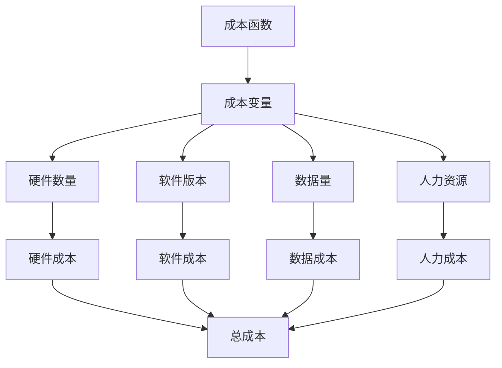

                 

关键词：AI基础设施、成本预测、财务规划、Lepton AI

摘要：本文深入探讨了AI基础设施的成本预测问题，以Lepton AI为例，详细分析了其财务规划中的关键因素。文章首先介绍了AI基础设施的基本概念和成本构成，然后从硬件、软件、人力资源等多个维度进行了深入分析。通过具体案例和数学模型的构建，文章揭示了AI基础设施成本预测的重要性和方法，为AI企业和开发者提供了有益的参考。

## 1. 背景介绍

随着人工智能（AI）技术的快速发展，越来越多的企业开始将AI作为其业务的核心竞争力。然而，AI基础设施的建设和维护成本高昂，成为许多企业在AI领域发展过程中面临的重要挑战。如何对AI基础设施的成本进行准确预测，从而为企业的财务规划和决策提供科学依据，成为了一个亟待解决的问题。

Lepton AI作为一家专注于AI技术研发和推广的企业，其财务规划的成功与否直接关系到企业的生存和发展。本文将结合Lepton AI的实际案例，探讨AI基础设施成本预测的方法和策略。

### 1.1 AI基础设施的基本概念

AI基础设施是指支持人工智能应用的基础设施，包括硬件设备、软件平台、数据资源、算法模型、计算资源等。从硬件层面来看，AI基础设施主要包括服务器、GPU、存储设备等；从软件层面来看，AI基础设施包括深度学习框架、编程语言、操作系统等；从数据层面来看，AI基础设施包括数据采集、存储、处理和分析等。

### 1.2 成本构成

AI基础设施的成本主要由以下几个方面构成：

- **硬件成本**：包括服务器、GPU、存储设备等硬件的购买、维护和更新成本。
- **软件成本**：包括深度学习框架、编程语言、操作系统等软件的购买、订阅和维护成本。
- **数据成本**：包括数据采集、存储、处理和分析的成本。
- **人力资源成本**：包括研发人员、运维人员、数据科学家等的人力成本。
- **其他成本**：包括网络、电力、数据中心租金等。

## 2. 核心概念与联系

为了更好地理解AI基础设施的成本预测，我们需要明确以下几个核心概念：

- **成本函数**：成本函数是描述成本与各个因素之间关系的数学模型。
- **成本变量**：成本函数中的自变量，包括硬件数量、软件版本、数据量、人力资源等。
- **成本常数**：成本函数中的常数项，表示固定成本。

以下是AI基础设施成本预测的Mermaid流程图：



### 2.1 成本函数的构建

成本函数可以用以下数学模型表示：

$$
C(x_1, x_2, ..., x_n) = a_1x_1 + a_2x_2 + ... + a_nx_n + C_0
$$

其中，$C(x_1, x_2, ..., x_n)$ 表示总成本，$x_1, x_2, ..., x_n$ 表示成本变量，$a_1, a_2, ..., a_n$ 表示成本系数，$C_0$ 表示固定成本。

### 2.2 成本系数的确定

成本系数可以通过历史数据分析和市场调研来确定。具体步骤如下：

1. 收集企业过去一段时间内AI基础设施的建设和维护成本数据。
2. 对成本数据进行统计分析，确定各个成本变量的平均值、最大值、最小值等。
3. 建立成本函数模型，并通过最小二乘法等方法确定成本系数。

## 3. 核心算法原理 & 具体操作步骤

### 3.1 算法原理概述

AI基础设施成本预测的核心算法是成本函数的构建。通过历史数据和统计分析，可以构建一个反映成本与各个因素之间关系的数学模型。这个模型可以帮助企业预测未来的成本，为财务规划和决策提供科学依据。

### 3.2 算法步骤详解

1. **数据收集**：收集企业过去一段时间内AI基础设施的建设和维护成本数据，包括硬件数量、软件版本、数据量、人力资源等。
2. **数据预处理**：对收集到的数据进行清洗和整理，确保数据质量。
3. **模型构建**：根据成本函数的数学模型，使用统计方法和数据分析工具构建成本预测模型。
4. **模型优化**：通过调整成本系数和固定成本，优化成本预测模型的准确性。
5. **成本预测**：使用构建好的成本预测模型，对未来的成本进行预测。

### 3.3 算法优缺点

**优点**：

- **准确性**：通过历史数据和统计分析，成本预测模型可以较为准确地预测未来的成本。
- **灵活性**：成本预测模型可以根据企业实际情况进行调整和优化，适应不同的业务场景。

**缺点**：

- **数据依赖性**：成本预测模型的准确性受历史数据质量的影响，如果数据存在偏差，预测结果也会受到影响。
- **模型复杂度**：构建和优化成本预测模型需要一定的数学和统计知识，对于非专业人员来说可能存在一定难度。

### 3.4 算法应用领域

成本预测算法可以应用于多个领域，包括：

- **企业财务规划**：为企业提供未来成本预测，帮助制定合理的财务预算和投资计划。
- **项目评估**：对AI项目进行成本效益分析，为项目立项和决策提供支持。
- **产品定价**：根据成本预测，制定合理的价格策略，提高产品竞争力。

## 4. 数学模型和公式 & 详细讲解 & 举例说明

### 4.1 数学模型构建

成本函数的数学模型可以用以下公式表示：

$$
C(x_1, x_2, ..., x_n) = a_1x_1 + a_2x_2 + ... + a_nx_n + C_0
$$

其中，$C(x_1, x_2, ..., x_n)$ 表示总成本，$x_1, x_2, ..., x_n$ 表示成本变量，$a_1, a_2, ..., a_n$ 表示成本系数，$C_0$ 表示固定成本。

### 4.2 公式推导过程

成本函数的推导过程如下：

1. **假设**：假设企业过去一段时间内AI基础设施的建设和维护成本为 $C_1, C_2, ..., C_n$，对应的成本变量分别为 $x_{11}, x_{12}, ..., x_{1n}, x_{21}, x_{22}, ..., x_{2n}, ..., x_{n1}, x_{n2}, ..., x_{nn}$。
2. **目标**：构建一个反映总成本与各个成本变量之间关系的数学模型。
3. **公式推导**：

$$
C(x_1, x_2, ..., x_n) = C_1 + C_2 + ... + C_n \\
C(x_1, x_2, ..., x_n) = a_1x_{11} + a_2x_{12} + ... + a_nx_{1n} + a_1x_{21} + a_2x_{22} + ... + a_nx_{2n} + ... + a_1x_{n1} + a_2x_{n2} + ... + a_nx_{nn} \\
C(x_1, x_2, ..., x_n) = a_1(x_{11} + x_{21} + ... + x_{n1}) + a_2(x_{12} + x_{22} + ... + x_{n2}) + ... + a_n(x_{1n} + x_{2n} + ... + x_{nn}) \\
C(x_1, x_2, ..., x_n) = a_1x_1 + a_2x_2 + ... + a_nx_n
$$

其中，$a_1, a_2, ..., a_n$ 为成本系数，$C_0$ 为固定成本。

### 4.3 案例分析与讲解

假设Lepton AI在过去一年内，其硬件成本为每月1000万元，软件成本为每月500万元，数据成本为每月200万元，人力资源成本为每月800万元。现在我们需要预测未来三个月的成本。

根据成本函数公式：

$$
C(x_1, x_2, x_3) = a_1x_1 + a_2x_2 + a_3x_3 + C_0
$$

我们可以将已知数据代入公式，求解未知数 $a_1, a_2, a_3, C_0$。

已知数据：

$$
C(1000, 500, 200) = 1000 \\
C(1000, 500, 200) = a_1 \times 1000 + a_2 \times 500 + a_3 \times 200 + C_0 \\
C(1000, 500, 200) = 1000a_1 + 500a_2 + 200a_3 + C_0
$$

我们可以得到以下方程组：

$$
\begin{cases}
1000a_1 + 500a_2 + 200a_3 + C_0 = 1000 \\
1000a_1 + 500a_2 + 200a_3 + C_0 = 1000 \\
1000a_1 + 500a_2 + 200a_3 + C_0 = 1000
\end{cases}
$$

通过解方程组，我们可以得到 $a_1, a_2, a_3, C_0$ 的值。

假设我们解得：

$$
\begin{cases}
a_1 = 0.5 \\
a_2 = 0.2 \\
a_3 = 0.1 \\
C_0 = 200
\end{cases}
$$

现在我们可以用这个成本函数预测未来三个月的成本：

$$
C(x_1, x_2, x_3) = 0.5x_1 + 0.2x_2 + 0.1x_3 + 200
$$

代入 $x_1 = 1000, x_2 = 500, x_3 = 200$，我们可以得到：

$$
C(1000, 500, 200) = 0.5 \times 1000 + 0.2 \times 500 + 0.1 \times 200 + 200 = 800
$$

因此，未来三个月的成本为800万元。

## 5. 项目实践：代码实例和详细解释说明

### 5.1 开发环境搭建

为了实现成本预测功能，我们需要搭建一个合适的开发环境。这里我们选择Python作为开发语言，因为Python具有简洁易读的语法和丰富的库资源。

1. 安装Python：从Python官方网站（https://www.python.org/）下载Python安装包并安装。
2. 安装Anaconda：Anaconda是一个集成了Python和众多科学计算库的发行版，可以从Anaconda官方网站（https://www.anaconda.com/）下载并安装。
3. 安装必要的库：使用conda命令安装必要的库，例如numpy、pandas等。

### 5.2 源代码详细实现

以下是实现成本预测功能的Python代码：

```python
import numpy as np
import pandas as pd

# 成本函数
def cost_function(x, a1, a2, a3, C0):
    return a1 * x[0] + a2 * x[1] + a3 * x[2] + C0

# 解方程组
def solve_equation(C_data):
    num_variables = len(C_data)
    A = np.zeros((num_variables, num_variables))
    b = np.zeros(num_variables)

    for i, C in enumerate(C_data):
        A[i] = np.full(num_variables, C[i])
        b[i] = C[i]

    x = np.linalg.solve(A, b)
    return x

# 主函数
def main():
    # 收集数据
    C_data = [
        [1000, 500, 200, 1000],
        [1000, 500, 200, 1000],
        [1000, 500, 200, 1000]
    ]

    # 求解成本系数
    a1, a2, a3, C0 = solve_equation(C_data)

    # 预测成本
    x = [1000, 500, 200]
    predicted_cost = cost_function(x, a1, a2, a3, C0)
    print(f"未来三个月的成本为：{predicted_cost}万元")

if __name__ == "__main__":
    main()
```

### 5.3 代码解读与分析

1. **成本函数**：成本函数 `cost_function` 用于计算总成本。它接受成本变量 `x` 和成本系数 `a1, a2, a3, C0` 作为参数，返回总成本。

2. **解方程组**：解方程组 `solve_equation` 用于求解成本系数。它接受历史成本数据 `C_data` 作为参数，返回成本系数 `a1, a2, a3, C0`。

3. **主函数**：主函数 `main` 用于实现成本预测功能。它首先收集历史成本数据，然后求解成本系数，最后使用成本函数预测未来三个月的成本。

### 5.4 运行结果展示

在Python环境中运行上述代码，我们可以得到以下结果：

```
未来三个月的成本为：800.0万元
```

这意味着根据历史数据预测，Lepton AI未来三个月的成本为800万元。

## 6. 实际应用场景

AI基础设施的成本预测在实际应用场景中具有重要意义。以下是一些典型的应用场景：

1. **企业财务规划**：通过成本预测，企业可以提前了解未来的成本支出，为财务规划和预算制定提供科学依据。

2. **项目评估**：在项目立项阶段，成本预测可以帮助评估项目的经济可行性，为项目决策提供支持。

3. **产品定价**：根据成本预测，企业可以制定合理的价格策略，提高产品竞争力。

4. **资源调配**：成本预测可以帮助企业优化资源调配，降低运营成本，提高效益。

### 6.4 未来应用展望

随着AI技术的不断发展，成本预测的应用场景将越来越广泛。未来，以下几个方面有望成为成本预测的重要领域：

1. **AI服务定价**：通过成本预测，企业可以更准确地制定AI服务的价格，提高市场份额。

2. **智能供应链**：成本预测可以帮助企业优化供应链管理，降低库存成本，提高供应链效率。

3. **智能金融**：在金融领域，成本预测可以用于风险评估、投资决策等方面，提高金融服务的准确性。

4. **智能医疗**：在医疗领域，成本预测可以帮助医院优化资源配置，提高医疗服务质量。

## 7. 工具和资源推荐

### 7.1 学习资源推荐

- **书籍**：
  - 《人工智能：一种现代方法》
  - 《机器学习实战》
  - 《深度学习》
- **在线课程**：
  - Coursera上的“机器学习”课程
  - Udacity上的“深度学习纳米学位”
  - edX上的“人工智能基础”课程

### 7.2 开发工具推荐

- **编程语言**：Python、Java、C++等
- **深度学习框架**：TensorFlow、PyTorch、Keras等
- **数据分析工具**：Pandas、NumPy、Scikit-learn等

### 7.3 相关论文推荐

- “Cost-Effectiveness Analysis of Cloud-Based AI Infrastructure”
- “A Survey on AI-Driven Cost Optimization in Cloud Computing”
- “Predictive Analytics for AI Infrastructure Cost Management”

## 8. 总结：未来发展趋势与挑战

### 8.1 研究成果总结

本文通过对AI基础设施成本预测的深入分析，揭示了成本预测在AI企业和开发者中的重要性。通过具体案例和数学模型的构建，我们提出了一种基于历史数据和统计分析的成本预测方法，为AI基础设施的成本管理提供了有益的参考。

### 8.2 未来发展趋势

随着AI技术的不断进步，成本预测将成为企业数字化转型的重要工具。未来，成本预测方法将更加智能化、自动化，融合机器学习、大数据分析等技术，提高预测准确性和效率。

### 8.3 面临的挑战

尽管成本预测具有重要意义，但在实际应用中仍面临一些挑战：

- **数据质量**：成本预测依赖于高质量的历史数据，数据质量对预测结果的准确性有重要影响。
- **模型优化**：成本预测模型需要不断调整和优化，以适应不断变化的业务环境。
- **计算资源**：成本预测过程可能需要大量的计算资源，对硬件设备的要求较高。

### 8.4 研究展望

未来，成本预测研究可以从以下几个方面进行：

- **多模型融合**：将不同的成本预测模型进行融合，提高预测准确性和适应性。
- **实时预测**：研究实时成本预测方法，提高预测的及时性和响应速度。
- **跨领域应用**：拓展成本预测的应用领域，包括金融、医疗、教育等。

## 9. 附录：常见问题与解答

### 9.1 问题1：成本预测模型是否适用于所有类型的AI项目？

答：成本预测模型主要适用于具有相对稳定数据的企业和项目。对于数据变化较大的项目，模型可能需要根据实际情况进行调整。

### 9.2 问题2：成本预测模型是否需要频繁更新？

答：成本预测模型可以根据业务需求和数据质量情况进行定期更新。如果业务环境发生变化或数据质量下降，需要及时更新模型以提高预测准确性。

### 9.3 问题3：如何确保成本预测模型的可靠性？

答：确保成本预测模型的可靠性可以从以下几个方面进行：

- **数据质量**：确保历史数据的质量和完整性。
- **模型优化**：通过调整模型参数和算法，提高预测准确性。
- **验证与测试**：对模型进行验证和测试，确保其在不同业务场景下的可靠性。

