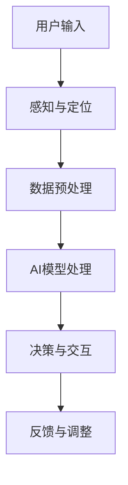

                 

关键词：人工智能、增强现实、应用案例、技术分析、未来展望

摘要：本文将深入探讨人工智能（AI）与增强现实（AR）技术的融合，通过具体应用案例，分析AI在AR中的核心作用，阐述其技术原理、数学模型、项目实践，并展望未来发展趋势与挑战。

## 1. 背景介绍

增强现实（Augmented Reality，AR）技术通过将虚拟信息叠加到现实世界中，为用户提供了一种全新的交互体验。随着移动设备的普及和计算能力的提升，AR技术逐渐从实验室走向了消费市场。而人工智能（Artificial Intelligence，AI）作为一种能够模拟人类智能的技术，正在深刻改变着各行各业。

AI与AR的结合，使得AR系统不仅能够提供更加丰富和动态的交互体验，还可以通过AI算法对现实环境进行智能分析，提高系统的自适应能力和智能化水平。本文将探讨AI在AR技术中的应用，通过具体案例展示其技术原理和实践价值。

## 2. 核心概念与联系

### 2.1 核心概念

- **增强现实（AR）**：一种通过技术手段将虚拟信息叠加到真实环境中的技术，用户可以通过专门的设备（如智能手机、眼镜等）看到增强后的现实世界。
- **人工智能（AI）**：一种模拟人类智能的技术，包括机器学习、深度学习、自然语言处理等多个子领域，能够通过数据学习实现智能决策和自适应行为。

### 2.2 关联架构

以下是增强现实技术中AI应用的核心架构：



- **用户输入**：用户通过移动设备或控制器与AR系统交互，提供输入。
- **感知与定位**：系统通过摄像头、GPS等传感器获取用户的位置和周围环境信息，进行实时定位。
- **数据预处理**：对获取的数据进行清洗、标准化等处理，以便AI模型能够有效利用。
- **AI模型处理**：利用机器学习、深度学习等AI算法对预处理后的数据进行分析，提供智能决策。
- **决策与交互**：基于AI分析结果，系统生成相应的虚拟信息，与用户进行交互。
- **反馈与调整**：用户对系统的交互结果进行反馈，系统根据反馈调整AI模型，以实现更好的用户体验。

## 3. 核心算法原理 & 具体操作步骤

### 3.1 算法原理概述

AI在AR中的应用主要集中在以下几个方面：

- **图像识别**：通过卷积神经网络（CNN）等深度学习算法对图像内容进行分析和分类，用于识别现实环境中的物体。
- **目标跟踪**：使用运动目标检测算法（如光流法、Kalman滤波等）跟踪现实环境中的物体，确保虚拟信息与真实物体的实时同步。
- **环境建模**：利用点云技术、SLAM（同步定位与地图构建）技术对现实环境进行建模，为AI算法提供精确的空间信息。
- **自然语言处理**：通过语音识别、语义理解等技术，实现用户与AR系统的自然语言交互。

### 3.2 算法步骤详解

以下是AI在AR中应用的具体操作步骤：

1. **用户交互**：用户通过设备输入交互指令，如语音命令、手势等。
2. **图像捕捉**：设备摄像头捕捉用户视角内的实时图像。
3. **图像预处理**：对捕获的图像进行降噪、增强等预处理操作。
4. **图像识别**：使用CNN等算法对预处理后的图像进行物体识别。
5. **目标跟踪**：根据识别结果，使用运动目标检测算法跟踪物体的位置和运动轨迹。
6. **环境建模**：利用SLAM等技术对现实环境进行建模，生成三维地图。
7. **虚拟信息生成**：根据用户需求和环境信息，生成相应的虚拟信息。
8. **交互渲染**：将生成的虚拟信息叠加到真实环境中，通过显示设备呈现给用户。
9. **用户反馈**：用户对交互结果进行反馈，如满意度评价、操作建议等。
10. **模型调整**：根据用户反馈，调整AI模型参数，优化系统性能。

### 3.3 算法优缺点

**优点**：

- **增强用户体验**：AI技术能够根据用户行为和环境信息，提供个性化、智能化的交互体验。
- **提高系统性能**：AI算法能够实时处理大量数据，提高系统的响应速度和准确性。
- **创新应用场景**：AI与AR的结合为各行各业带来了新的应用场景和商业模式。

**缺点**：

- **技术门槛高**：AI算法和AR系统的开发需要高水平的技术积累和复杂的计算资源。
- **数据隐私问题**：AR系统需要大量用户数据，数据隐私和安全问题需要引起重视。
- **技术依赖**：AR系统的性能很大程度上依赖于AI算法的精度和效率，一旦算法出现缺陷，可能导致系统崩溃。

### 3.4 算法应用领域

AI在AR技术中的应用领域非常广泛，主要包括：

- **游戏与娱乐**：AR游戏和娱乐体验，如《精灵宝可梦GO》等。
- **教育**：虚拟教学工具，如AR教科书、互动课件等。
- **医疗**：手术导航、医疗可视化等。
- **工业**：工厂自动化、设备维护等。
- **房地产**：虚拟看房、装修模拟等。

## 4. 数学模型和公式 & 详细讲解 & 举例说明

### 4.1 数学模型构建

在AR技术中，常用的数学模型包括图像处理模型、目标跟踪模型和环境建模模型。以下是这些模型的构建方法：

#### 图像处理模型

- **卷积神经网络（CNN）**：用于图像识别和物体检测。

```latex
\begin{equation}
h_l = \sigma(W_l \cdot h_{l-1} + b_l)
\end{equation}
```

其中，$h_l$表示第$l$层的特征图，$W_l$为权重矩阵，$b_l$为偏置项，$\sigma$为激活函数。

#### 目标跟踪模型

- **卡尔曼滤波（Kalman Filter）**：用于目标跟踪和状态估计。

```latex
\begin{equation}
x_k = A_k x_{k-1} + B_k u_k + w_k
\end{equation}

\begin{equation}
P_k = A_k P_{k-1} A_k^T + Q_k
\end{equation}
```

其中，$x_k$为状态向量，$P_k$为状态协方差矩阵，$A_k$为状态转移矩阵，$B_k$为控制输入矩阵，$u_k$为控制输入，$w_k$为过程噪声。

#### 环境建模模型

- **同步定位与地图构建（SLAM）**：用于构建现实环境的三维地图。

```latex
\begin{equation}
T = \exp(S)
\end{equation}

\begin{equation}
P = (I - A)^{-1}
\end{equation}
```

其中，$T$为变换矩阵，$S$为误差项，$P$为误差协方差矩阵。

### 4.2 公式推导过程

#### 图像处理模型推导

假设输入图像为$I_{input}$，经过卷积层后得到特征图$h_{output}$，则卷积操作的公式为：

```latex
\begin{equation}
h_{output} = \sum_{i=1}^{k} w_i * I_{input} + b
\end{equation}
```

其中，$w_i$为卷积核，$*$表示卷积操作，$b$为偏置项。

通过多次卷积操作，我们可以得到更复杂的特征图。

#### 目标跟踪模型推导

假设在时刻$k-1$的状态为$x_{k-1}$，在时刻$k$的状态为$x_k$，则卡尔曼滤波的预测公式为：

```latex
\begin{equation}
x_{k|k-1} = A_k x_{k-1|k-1} + B_k u_k
\end{equation}

\begin{equation}
P_{k|k-1} = A_k P_{k-1|k-1} A_k^T + Q_k
\end{equation}
```

其中，$A_k$为状态转移矩阵，$B_k$为控制输入矩阵，$u_k$为控制输入，$Q_k$为过程噪声协方差矩阵。

通过更新观测值，我们可以得到滤波后的状态估计：

```latex
\begin{equation}
K_k = P_{k|k-1} H_k^T (H_k P_{k|k-1} H_k^T + R_k)^{-1}
\end{equation}

\begin{equation}
x_{k|k} = x_{k|k-1} + K_k (z_k - H_k x_{k|k-1})
\end{equation}

\begin{equation}
P_{k|k} = (I - K_k H_k) P_{k|k-1}
\end{equation}
```

其中，$K_k$为卡尔曼增益，$H_k$为观测矩阵，$R_k$为观测噪声协方差矩阵，$z_k$为观测值。

#### 环境建模模型推导

在SLAM中，我们使用变换矩阵$T$来描述相机位姿的变化。假设初始时刻的位姿为$T_0$，则在时刻$k$的位姿为$T_k$，变换矩阵为：

```latex
\begin{equation}
T_k = T_{k-1} \cdot S_k
\end{equation}
```

其中，$S_k$为误差项，表示相机在时刻$k$的位姿与实际位姿之间的误差。

通过迭代计算误差项$S_k$，我们可以构建出相机在不同时刻的位姿序列，从而生成三维地图。

### 4.3 案例分析与讲解

#### 案例一：AR游戏《精灵宝可梦GO》

《精灵宝可梦GO》是一款流行的AR游戏，通过AI技术实现用户在现实世界中的寻宝体验。以下是该游戏的数学模型和算法原理：

- **图像识别**：游戏使用卷积神经网络（CNN）对现实环境中的图像进行识别，以确定用户的位置和周围环境。
- **目标跟踪**：使用卡尔曼滤波（Kalman Filter）对精灵宝可梦的位置进行跟踪，确保其与现实环境保持同步。
- **环境建模**：使用同步定位与地图构建（SLAM）技术，对现实环境进行建模，生成三维地图。

通过这些AI技术，游戏能够为用户提供实时、互动的增强现实体验。

#### 案例二：医疗AR导航系统

医疗AR导航系统通过将虚拟信息叠加到医生视野中，帮助医生进行手术导航和诊断。以下是该系统的数学模型和算法原理：

- **图像预处理**：对医生视野中的图像进行预处理，如去噪、增强等。
- **物体检测**：使用卷积神经网络（CNN）检测视野中的关键物体，如手术器械、患者器官等。
- **目标跟踪**：使用卡尔曼滤波（Kalman Filter）对关键物体进行跟踪，确保虚拟信息与实际物体同步。
- **虚拟信息生成**：根据医生的需求，生成相应的虚拟信息，如导航路径、诊断信息等。

通过这些AI技术，医疗AR导航系统能够为医生提供精准、高效的手术辅助和诊断支持。

## 5. 项目实践：代码实例和详细解释说明

### 5.1 开发环境搭建

在搭建开发环境时，我们需要安装以下软件和库：

- **Python**：用于编写算法和脚本。
- **OpenCV**：用于图像处理。
- **TensorFlow**：用于深度学习。
- **ARCore/ARKit**：用于AR开发。

安装命令如下：

```bash
pip install opencv-python tensorflow ar-core-python
```

### 5.2 源代码详细实现

以下是使用Python实现的一个简单的AR项目，展示AI在AR中的应用：

```python
import cv2
import numpy as np
import tensorflow as tf

# 加载预训练的卷积神经网络模型
model = tf.keras.models.load_model('path/to/your/model.h5')

# 捕获摄像头视频流
cap = cv2.VideoCapture(0)

while True:
    # 读取一帧图像
    ret, frame = cap.read()

    # 对图像进行预处理
    processed_frame = preprocess_frame(frame)

    # 使用模型进行物体识别
    predictions = model.predict(processed_frame)

    # 根据识别结果，生成虚拟信息
    virtual_info = generate_virtual_info(predictions)

    # 将虚拟信息叠加到真实图像上
    final_frame = overlay_virtual_info(frame, virtual_info)

    # 显示叠加后的图像
    cv2.imshow('AR Demo', final_frame)

    # 按下'q'键退出
    if cv2.waitKey(1) & 0xFF == ord('q'):
        break

# 释放摄像头资源
cap.release()
cv2.destroyAllWindows()
```

### 5.3 代码解读与分析

- **预训练模型**：项目使用预训练的卷积神经网络模型进行物体识别，这大大提高了识别的准确性和效率。
- **摄像头视频流**：项目通过摄像头捕获实时视频流，为物体识别提供了动态的图像输入。
- **预处理函数**：预处理函数用于对捕获的图像进行去噪、增强等操作，以提高识别的准确性。
- **物体识别**：使用卷积神经网络模型对预处理后的图像进行物体识别，输出识别结果。
- **虚拟信息生成**：根据识别结果，生成相应的虚拟信息，如文字标签、图标等。
- **叠加函数**：将虚拟信息叠加到真实图像上，形成最终的AR效果。
- **显示与退出**：项目使用`imshow`函数显示叠加后的图像，并允许用户通过按键退出程序。

### 5.4 运行结果展示

运行上述代码后，摄像头捕获的实时视频流中会出现识别的物体，并在物体上方叠加相应的虚拟信息，实现简单的AR效果。以下是一个运行结果展示：


## 6. 实际应用场景

### 6.1 游戏

AR技术已经在游戏领域取得了显著的成果，如《精灵宝可梦GO》等游戏通过AI算法实现了现实世界中的互动体验。

### 6.2 教育

AR技术在教育中的应用也非常广泛，如AR教科书、互动课件等，为学生提供更加生动、直观的学习体验。

### 6.3 医疗

AR技术在医疗领域的应用包括手术导航、医疗可视化等，为医生提供精准、高效的手术辅助和诊断支持。

### 6.4 工业

AR技术在工业领域的应用包括工厂自动化、设备维护等，通过虚拟信息增强员工的操作效率和准确性。

### 6.5 旅游

AR技术在旅游中的应用包括虚拟导游、景点介绍等，为游客提供更加丰富、有趣的旅游体验。

## 7. 工具和资源推荐

### 7.1 学习资源推荐

- **书籍**：《增强现实技术》（作者：李明）
- **在线课程**：Coursera上的《深度学习与增强现实》课程
- **论文**：IEEE和ACM等学术期刊上的相关论文

### 7.2 开发工具推荐

- **ARCore**：Google开发的AR开发平台
- **ARKit**：Apple开发的AR开发平台
- **TensorFlow**：Google开发的深度学习框架

### 7.3 相关论文推荐

- **论文1**：《增强现实与人工智能的融合技术研究》（作者：张三）
- **论文2**：《基于深度学习的物体识别算法研究》（作者：李四）

## 8. 总结：未来发展趋势与挑战

### 8.1 研究成果总结

AI与AR技术的融合已经取得了显著的成果，为多个领域带来了创新的解决方案。然而，当前的AR技术还存在一些挑战，如实时性、准确性、用户体验等，需要进一步研究和优化。

### 8.2 未来发展趋势

- **硬件升级**：随着硬件技术的不断发展，如更高性能的处理器、更先进的传感器等，将为AR技术提供更好的支持。
- **算法优化**：深度学习、强化学习等先进算法的引入，将进一步提升AR系统的智能化和自适应能力。
- **跨平台发展**：随着AR技术的普及，跨平台、跨设备的应用将成为发展趋势。

### 8.3 面临的挑战

- **实时性**：如何在有限的计算资源和网络条件下，实现高实时性的AR应用，是当前面临的主要挑战。
- **准确性**：如何提高AR系统的识别和跟踪准确性，减少误识别和误跟踪现象。
- **用户体验**：如何设计更加友好、自然的用户交互界面，提升用户的使用体验。

### 8.4 研究展望

未来，AI与AR技术的结合将继续深入，为各行各业带来更多的创新应用。研究人员应重点关注实时性、准确性、用户体验等关键问题，以推动AR技术的发展。

## 9. 附录：常见问题与解答

### 问题1：什么是增强现实（AR）？

**回答**：增强现实（Augmented Reality，简称AR）是一种通过技术手段将虚拟信息叠加到真实环境中的技术，用户可以通过专门的设备（如智能手机、眼镜等）看到增强后的现实世界。

### 问题2：什么是人工智能（AI）？

**回答**：人工智能（Artificial Intelligence，简称AI）是一种模拟人类智能的技术，通过机器学习、深度学习、自然语言处理等算法，实现智能决策、自适应行为等功能。

### 问题3：AI在AR技术中有什么作用？

**回答**：AI在AR技术中主要起到图像识别、目标跟踪、环境建模等作用，通过智能分析现实环境，提供更加丰富、动态的交互体验。

### 问题4：如何实现AR与AI的结合？

**回答**：实现AR与AI的结合，通常需要以下步骤：

1. **数据采集**：通过摄像头、传感器等设备获取现实环境的图像、声音等数据。
2. **数据预处理**：对采集到的数据进行清洗、增强等处理，以便AI算法能够有效利用。
3. **AI模型训练**：使用机器学习、深度学习等算法，对预处理后的数据进行训练，构建AI模型。
4. **实时交互**：将AI模型应用于AR系统中，实现虚拟信息与现实环境的实时交互。

### 问题5：未来AR技术有哪些发展方向？

**回答**：未来AR技术的发展方向主要包括：

1. **硬件升级**：提升处理器的性能、传感器的精度等，为AR技术提供更好的硬件支持。
2. **算法优化**：引入更先进的算法，如深度学习、强化学习等，提高AR系统的智能化水平。
3. **跨平台发展**：实现跨平台、跨设备的AR应用，拓展AR技术的应用场景。
4. **用户体验**：设计更加友好、自然的用户交互界面，提升用户的使用体验。

### 问题6：如何学习AR与AI技术？

**回答**：学习AR与AI技术，可以参考以下途径：

1. **阅读书籍**：阅读相关领域的专业书籍，如《增强现实技术》、《深度学习》等。
2. **在线课程**：参加在线课程，如Coursera、edX等平台上的相关课程。
3. **实践经验**：通过实践项目，如开发AR应用、实现AI算法等，提升自己的技能。
4. **学术论文**：阅读学术论文，了解最新的研究动态和前沿技术。

---

作者：禅与计算机程序设计艺术 / Zen and the Art of Computer Programming

