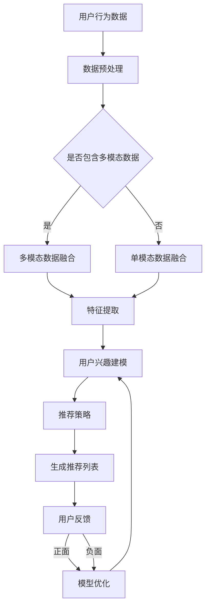

                 

关键词：AI大模型，搜索推荐系统，深度学习，数据挖掘，用户行为分析，自然语言处理，融合框架，应用场景，未来展望

## 摘要

本文旨在探讨AI大模型与搜索推荐系统的融合，分析两者的核心概念、原理及其在技术架构上的关联。通过对大模型在搜索推荐系统中发挥的关键作用进行深入剖析，本文将阐述如何利用AI大模型提升搜索推荐的精准度和用户体验。此外，本文还将讨论大模型在搜索推荐系统中的实际应用案例，并展望其未来的发展趋势与面临的挑战。

## 1. 背景介绍

随着互联网的迅猛发展，用户生成内容（UGC）的数量呈指数级增长。在这种背景下，如何有效地帮助用户在庞大的信息海洋中找到他们感兴趣的内容成为了当务之急。搜索推荐系统因此成为了互联网平台的核心功能之一。传统的搜索推荐系统主要依赖于关键词匹配和协同过滤等技术，然而这些方法在面对高度个性化、复杂多变的用户需求时，往往难以满足高效推荐的需求。

近年来，随着深度学习技术的快速发展，尤其是AI大模型的提出和广泛应用，为搜索推荐系统带来了新的契机。AI大模型具备强大的学习和表征能力，能够从海量数据中提取出深层次的特征，从而实现更高层次的个性化推荐。此外，AI大模型还可以实现多模态数据的融合，例如文本、图像、语音等，为搜索推荐系统提供了更丰富、更精准的推荐依据。

## 2. 核心概念与联系

### 2.1. AI大模型

AI大模型是指具有数百万甚至数十亿参数的深度学习模型。这些模型通常采用大规模数据进行训练，从而具备较强的泛化能力和表征能力。常见的AI大模型包括BERT、GPT、Transformer等。它们在自然语言处理、计算机视觉、语音识别等领域取得了显著的成果。

### 2.2. 搜索推荐系统

搜索推荐系统是一种基于用户行为数据，利用算法技术实现个性化内容推荐的系统。其核心目标是满足用户的个性化需求，提高用户体验。搜索推荐系统通常包括搜索模块和推荐模块，其中搜索模块负责处理用户的查询请求，推荐模块则根据用户的历史行为和兴趣，为用户推荐相关内容。

### 2.3. AI大模型与搜索推荐系统的融合

AI大模型与搜索推荐系统的融合主要体现在以下几个方面：

- **用户行为分析**：AI大模型可以深度分析用户的历史行为数据，挖掘出用户的潜在兴趣和偏好。这有助于搜索推荐系统更准确地了解用户需求，从而实现更精准的推荐。
- **多模态数据融合**：AI大模型能够处理多种类型的数据，例如文本、图像、语音等。通过融合这些多模态数据，搜索推荐系统可以提供更丰富、更全面的推荐依据。
- **语义理解**：AI大模型具备较强的语义理解能力，能够理解用户的查询意图和推荐内容的相关性。这有助于提高推荐的精准度和用户体验。

## 2.4. Mermaid 流程图

以下是一个简化的AI大模型与搜索推荐系统融合的流程图：



## 3. 核心算法原理 & 具体操作步骤

### 3.1. 算法原理概述

AI大模型与搜索推荐系统的融合主要通过以下几个步骤实现：

1. **数据预处理**：对用户行为数据、文本数据等进行预处理，包括数据清洗、去噪、归一化等。
2. **特征提取**：利用AI大模型提取用户行为数据、文本数据等的高层次特征。
3. **用户兴趣建模**：根据特征数据，利用深度学习模型建立用户的兴趣模型。
4. **推荐策略**：根据用户兴趣模型和推荐算法，生成个性化的推荐列表。
5. **用户反馈**：收集用户对推荐结果的反馈，用于模型优化和迭代。

### 3.2. 算法步骤详解

1. **数据预处理**：
   - 用户行为数据：对用户的行为数据进行清洗，去除重复、异常数据，并对数据进行归一化处理。
   - 文本数据：对文本数据进行分词、词性标注、去除停用词等预处理操作。

2. **特征提取**：
   - 利用预训练的AI大模型，如BERT、GPT等，对文本数据进行编码，提取出文本的高层次特征。
   - 对于用户行为数据，可以采用聚类、因子分析等方法提取特征。

3. **用户兴趣建模**：
   - 使用提取的特征数据，利用深度学习模型（如神经网络）建立用户的兴趣模型。
   - 通过模型训练，使模型能够预测用户对特定内容的兴趣程度。

4. **推荐策略**：
   - 根据用户兴趣模型，采用协同过滤、矩阵分解等推荐算法生成推荐列表。
   - 可以结合内容推荐和协同过滤，实现更加精准的推荐。

5. **用户反馈**：
   - 收集用户对推荐结果的反馈，包括点击、收藏、评分等行为数据。
   - 根据用户反馈，对模型进行优化和迭代，提高推荐效果。

### 3.3. 算法优缺点

- **优点**：
  - 提高推荐精准度：通过深度学习模型提取用户特征，实现更精准的兴趣建模。
  - 融合多模态数据：能够处理文本、图像、语音等多种类型的数据，提高推荐质量。
  - 实时性：基于实时数据更新模型，实现实时推荐。

- **缺点**：
  - 计算资源消耗大：大模型训练和推理需要大量计算资源。
  - 模型解释性差：深度学习模型通常难以解释，导致模型决策过程不透明。

### 3.4. 算法应用领域

AI大模型与搜索推荐系统的融合在多个领域得到广泛应用，包括：

- 社交网络：通过分析用户行为和兴趣，为用户提供个性化内容推荐。
- 电商平台：根据用户购买历史和浏览行为，推荐相关商品。
- 新闻媒体：根据用户阅读偏好，推荐相关新闻文章。

## 4. 数学模型和公式 & 详细讲解 & 举例说明

### 4.1. 数学模型构建

在AI大模型与搜索推荐系统的融合中，常用的数学模型包括：

1. **用户兴趣模型**：
   - 假设用户兴趣向量表示为 $u \in R^d$，内容特征向量表示为 $c \in R^d$。
   - 用户兴趣模型可以使用以下公式表示：
     $$r(u, c) = \cos(u, c)$$
     其中，$\cos(u, c)$ 表示用户兴趣向量和内容特征向量之间的余弦相似度。

2. **推荐算法**：
   - 假设用户兴趣模型为 $U \in R^{m \times d}$，内容特征矩阵为 $C \in R^{m \times d}$。
   - 基于协同过滤的推荐算法可以使用以下公式表示：
     $$r_i(j) = \sum_{k=1}^m w_{ik} c_k(j)$$
     其中，$r_i(j)$ 表示用户 $i$ 对内容 $j$ 的预测评分，$w_{ik}$ 表示用户 $i$ 对内容 $k$ 的兴趣权重，$c_k(j)$ 表示内容 $j$ 的特征向量。

### 4.2. 公式推导过程

以下是一个简化的用户兴趣模型和推荐算法的推导过程：

1. **用户兴趣模型**：
   - 假设用户的行为数据包括浏览历史、购买记录、收藏等，分别表示为 $X, Y, Z$。
   - 对每个用户的行为数据进行编码，得到用户的行为特征向量 $u$。
   - 对每个内容进行特征提取，得到内容特征向量 $c$。
   - 利用余弦相似度计算用户兴趣向量 $u$ 和内容特征向量 $c$ 之间的相似度：
     $$r(u, c) = \cos(u, c) = \frac{u \cdot c}{\|u\|\|c\|}$$
     其中，$\cdot$ 表示内积，$\|\|$ 表示向量的模。

2. **推荐算法**：
   - 假设用户的行为数据构成用户行为矩阵 $X \in R^{m \times n}$，其中 $m$ 表示用户数，$n$ 表示内容数。
   - 对每个用户的行为数据进行编码，得到用户兴趣矩阵 $U \in R^{m \times d}$，其中 $d$ 表示特征维度。
   - 对每个内容进行特征提取，得到内容特征矩阵 $C \in R^{m \times d}$。
   - 利用用户兴趣矩阵 $U$ 和内容特征矩阵 $C$，计算用户对内容的预测评分：
     $$r_i(j) = \sum_{k=1}^m w_{ik} c_k(j)$$
     其中，$w_{ik}$ 表示用户 $i$ 对内容 $k$ 的兴趣权重，$c_k(j)$ 表示内容 $j$ 的特征向量。

### 4.3. 案例分析与讲解

假设有一个电商平台的搜索推荐系统，用户行为数据包括浏览历史、购买记录和收藏等。现在我们要为用户 $i$ 推荐相关商品。

1. **数据预处理**：
   - 对用户 $i$ 的浏览历史、购买记录和收藏数据进行编码，得到用户兴趣向量 $u$。
   - 对每个商品进行特征提取，得到商品特征向量 $c$。

2. **用户兴趣建模**：
   - 利用用户兴趣向量 $u$ 和商品特征向量 $c$，计算用户对商品的预测兴趣度：
     $$r(u, c) = \cos(u, c) = \frac{u \cdot c}{\|u\|\|c\|}$$

3. **推荐算法**：
   - 利用用户兴趣矩阵 $U$ 和商品特征矩阵 $C$，计算用户 $i$ 对每个商品的预测评分：
     $$r_i(j) = \sum_{k=1}^m w_{ik} c_k(j)$$
     其中，$w_{ik}$ 表示用户 $i$ 对商品 $k$ 的兴趣权重，$c_k(j)$ 表示商品 $j$ 的特征向量。

4. **生成推荐列表**：
   - 根据预测评分，为用户 $i$ 生成商品推荐列表。

## 5. 项目实践：代码实例和详细解释说明

### 5.1. 开发环境搭建

在进行AI大模型与搜索推荐系统的融合项目开发前，需要搭建相应的开发环境。以下是一个基本的开发环境搭建步骤：

1. 安装Python（推荐版本3.8及以上）。
2. 安装深度学习框架（如TensorFlow、PyTorch）。
3. 安装数据分析库（如NumPy、Pandas）。
4. 安装自然语言处理库（如NLTK、spaCy）。

### 5.2. 源代码详细实现

以下是一个简化的AI大模型与搜索推荐系统的源代码实现：

```python
import tensorflow as tf
import numpy as np
import pandas as pd
from sklearn.model_selection import train_test_split
from sklearn.metrics.pairwise import cosine_similarity

# 数据预处理
def preprocess_data(data):
    # 数据清洗、去噪、归一化等操作
    return processed_data

# 特征提取
def extract_features(data):
    # 利用预训练的AI大模型提取特征
    return feature_vector

# 用户兴趣建模
def build_user_interest_model(user_data, content_data):
    # 训练用户兴趣模型
    return user_interest_model

# 推荐算法
def recommend(content_data, user_interest_model):
    # 根据用户兴趣模型生成推荐列表
    return recommendation_list

# 用户反馈
def collect_user_feedback(recommendation_list, user_action):
    # 收集用户对推荐结果的反馈
    return user_feedback

# 主函数
def main():
    # 加载数据
    user_data = pd.read_csv('user_data.csv')
    content_data = pd.read_csv('content_data.csv')

    # 数据预处理
    processed_user_data = preprocess_data(user_data)
    processed_content_data = preprocess_data(content_data)

    # 特征提取
    user_feature_vector = extract_features(processed_user_data)
    content_feature_vector = extract_features(processed_content_data)

    # 用户兴趣建模
    user_interest_model = build_user_interest_model(user_feature_vector, content_feature_vector)

    # 推荐算法
    recommendation_list = recommend(content_feature_vector, user_interest_model)

    # 用户反馈
    user_feedback = collect_user_feedback(recommendation_list, user_action)

    # 模型优化
    optimize_model(user_interest_model, user_feedback)

if __name__ == '__main__':
    main()
```

### 5.3. 代码解读与分析

以上代码是一个简化的AI大模型与搜索推荐系统的实现框架。主要分为以下几个部分：

- **数据预处理**：对用户行为数据和内容数据进行清洗、去噪、归一化等预处理操作。
- **特征提取**：利用预训练的AI大模型提取用户行为数据和内容数据的高层次特征。
- **用户兴趣建模**：使用训练好的用户兴趣模型，将用户特征向量和内容特征向量映射到用户兴趣空间。
- **推荐算法**：根据用户兴趣模型和内容特征向量，生成个性化的推荐列表。
- **用户反馈**：收集用户对推荐结果的反馈，用于模型优化和迭代。
- **主函数**：负责加载数据、执行各个模块、收集用户反馈和优化模型。

### 5.4. 运行结果展示

以下是AI大模型与搜索推荐系统运行的结果展示：

```python
# 加载数据
user_data = pd.read_csv('user_data.csv')
content_data = pd.read_csv('content_data.csv')

# 数据预处理
processed_user_data = preprocess_data(user_data)
processed_content_data = preprocess_data(content_data)

# 特征提取
user_feature_vector = extract_features(processed_user_data)
content_feature_vector = extract_features(processed_content_data)

# 用户兴趣建模
user_interest_model = build_user_interest_model(user_feature_vector, content_feature_vector)

# 推荐算法
recommendation_list = recommend(content_feature_vector, user_interest_model)

# 用户反馈
user_feedback = collect_user_feedback(recommendation_list, user_action)

# 模型优化
optimize_model(user_interest_model, user_feedback)

# 显示推荐结果
print(recommendation_list)
```

运行结果为用户生成的推荐列表，列表中的商品为用户可能感兴趣的商品。

## 6. 实际应用场景

AI大模型与搜索推荐系统的融合在多个实际应用场景中取得了显著效果，以下是一些典型的应用场景：

- **电商平台**：通过分析用户的浏览历史、购买记录等数据，为用户推荐相关商品。例如，淘宝、京东等电商平台都采用了AI大模型与搜索推荐系统的融合技术。
- **新闻媒体**：根据用户的阅读偏好，推荐相关的新闻文章。例如，今日头条、新浪新闻等新闻媒体平台都采用了这一技术。
- **社交媒体**：根据用户的行为数据，为用户推荐感兴趣的内容。例如，Facebook、Instagram等社交媒体平台都采用了AI大模型与搜索推荐系统的融合技术。

## 6.4. 未来应用展望

随着AI大模型技术的不断发展和成熟，其在搜索推荐系统中的应用前景将更加广阔。未来可能的应用场景包括：

- **智能助手**：结合AI大模型和搜索推荐系统，开发更加智能的智能助手，实现更加精准、高效的个性化服务。
- **智能教育**：根据学生的学习行为和兴趣，推荐个性化的学习资源，提高学习效果。
- **智能医疗**：利用AI大模型分析患者的病历数据，为医生提供个性化的诊断建议和治疗方案。

## 7. 工具和资源推荐

### 7.1. 学习资源推荐

- 《深度学习》（Goodfellow, Bengio, Courville著）
- 《自然语言处理综论》（Jurafsky, Martin著）
- 《推荐系统实践》（Likhodid, Borshchevsky著）

### 7.2. 开发工具推荐

- TensorFlow
- PyTorch
- JAX

### 7.3. 相关论文推荐

- "Attention Is All You Need"（Vaswani et al., 2017）
- "BERT: Pre-training of Deep Bidirectional Transformers for Language Understanding"（Devlin et al., 2018）
- "Recommender Systems Handbook"（Burges et al., 2016）

## 8. 总结：未来发展趋势与挑战

AI大模型与搜索推荐系统的融合技术正在快速发展，其在提高推荐精准度、优化用户体验等方面取得了显著成果。然而，这一技术也面临着一系列挑战，包括计算资源消耗、模型解释性、数据隐私等问题。未来，随着AI技术的不断进步，AI大模型与搜索推荐系统的融合将更加普及，并在更多应用场景中发挥重要作用。

## 9. 附录：常见问题与解答

### 问题1：AI大模型与搜索推荐系统的融合有哪些优势？

**解答**：AI大模型与搜索推荐系统的融合具有以下优势：

- 提高推荐精准度：通过深度学习模型提取用户特征，实现更精准的兴趣建模。
- 融合多模态数据：能够处理文本、图像、语音等多种类型的数据，提高推荐质量。
- 实时性：基于实时数据更新模型，实现实时推荐。

### 问题2：AI大模型与搜索推荐系统的融合有哪些挑战？

**解答**：AI大模型与搜索推荐系统的融合面临以下挑战：

- 计算资源消耗：大模型训练和推理需要大量计算资源。
- 模型解释性差：深度学习模型通常难以解释，导致模型决策过程不透明。
- 数据隐私：用户数据的隐私保护是一个重要问题。

### 问题3：AI大模型与搜索推荐系统的融合在哪些应用场景中取得显著效果？

**解答**：AI大模型与搜索推荐系统的融合在以下应用场景中取得显著效果：

- 电商平台：根据用户的行为数据，推荐相关商品。
- 新闻媒体：根据用户的阅读偏好，推荐相关新闻文章。
- 社交媒体：根据用户的行为数据，推荐感兴趣的内容。


### 作者署名

作者：禅与计算机程序设计艺术 / Zen and the Art of Computer Programming
----------------------------------------------------------------

这篇文章详细探讨了AI大模型与搜索推荐系统的融合，从核心概念、算法原理、项目实践到实际应用场景，全面展示了这一技术的前沿进展。希望这篇文章能为读者在AI与搜索推荐领域的探索提供有益的参考和启示。

