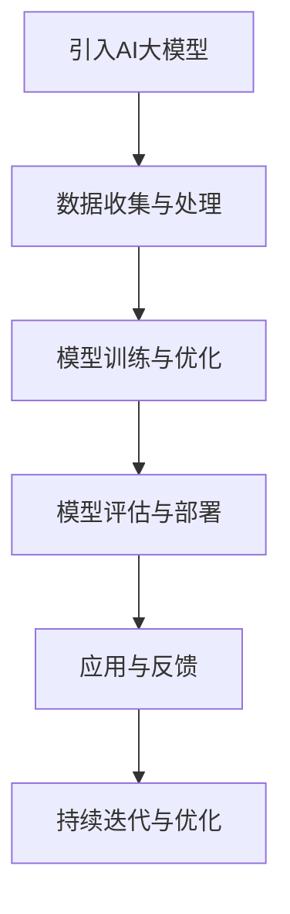

                 

关键词：人工智能大模型、创业、机遇、挑战、技术发展、市场趋势

>摘要：本文从人工智能大模型的背景和现状出发，探讨了其创业领域的挑战与机遇。通过对核心概念、算法原理、数学模型、项目实践以及未来展望的深入分析，揭示了AI大模型创业的潜力和发展方向。

## 1. 背景介绍

近年来，人工智能（AI）技术的快速发展，尤其是大模型（Large-scale Model）的突破，为各行各业带来了前所未有的变革。大模型通常指的是训练数据规模巨大、参数数量庞大的深度学习模型，如GPT-3、BERT、Megatron-LM等。这些模型不仅在自然语言处理、图像识别、语音识别等领域取得了显著进展，还在医疗、金融、教育等领域显示出强大的应用潜力。

随着AI技术的普及，越来越多的创业者看到了大模型带来的机遇。然而，AI大模型创业并非一片坦途，其中既有机遇，也有诸多挑战。本文将围绕AI大模型创业的主题，分析其中的机遇与挑战，并探讨未来的发展趋势。

## 2. 核心概念与联系

### 2.1 大模型的基本概念

大模型（Large-scale Model）是指拥有海量参数和训练数据的深度学习模型。这些模型通常具有以下特点：

- **训练数据量巨大**：大模型通常基于数十亿甚至数万亿级别的训练数据集进行训练。
- **参数数量庞大**：大模型的参数数量可以从数十万个到数十亿个不等。
- **计算资源需求高**：训练大模型需要大量的计算资源，如高性能计算集群、GPU、TPU等。
- **性能优异**：大模型在处理复杂任务时，往往表现出更优的性能。

### 2.2 大模型的架构与原理

大模型的架构通常基于深度神经网络（DNN），其核心原理包括：

- **多层感知机（MLP）**：大模型通常由多个隐含层组成，每一层都能够对输入数据进行线性变换和非线性激活。
- **反向传播算法（Backpropagation）**：通过反向传播算法，大模型能够高效地计算梯度并更新参数。
- **优化算法**：如Adam、SGD等，用于优化模型参数，提高模型性能。

### 2.3 大模型的应用领域

大模型在各个领域都有广泛应用，主要包括：

- **自然语言处理（NLP）**：如机器翻译、文本生成、问答系统等。
- **计算机视觉（CV）**：如图像识别、目标检测、图像生成等。
- **语音识别（ASR）**：如语音识别、语音合成等。
- **医疗诊断**：如疾病预测、医疗图像分析等。
- **金融风控**：如信用评估、风险控制等。

### 2.4 Mermaid 流程图



## 3. 核心算法原理 & 具体操作步骤

### 3.1 算法原理概述

大模型的算法原理主要包括以下三个方面：

1. **神经网络架构**：大模型通常采用深度神经网络架构，通过多层感知机实现数据的非线性变换和特征提取。
2. **优化算法**：大模型训练过程中，常用的优化算法包括Adam、SGD等，用于更新模型参数。
3. **学习策略**：大模型训练过程中，采用的学习策略包括批次归一化、dropout等，以提高模型的泛化能力。

### 3.2 算法步骤详解

1. **数据收集与预处理**：收集大规模训练数据集，并进行数据预处理，如数据清洗、归一化、标准化等。
2. **模型架构设计**：根据任务需求，设计合适的神经网络架构，确定网络的层数、层间连接方式等。
3. **模型训练**：使用优化算法训练模型，通过迭代更新模型参数，提高模型性能。
4. **模型评估**：使用验证集评估模型性能，调整模型参数和超参数，以优化模型表现。
5. **模型部署**：将训练好的模型部署到实际应用场景中，如自然语言处理、计算机视觉等。
6. **持续优化**：根据实际应用反馈，对模型进行持续优化和迭代，以提高模型性能和应用效果。

### 3.3 算法优缺点

**优点**：

- **性能优异**：大模型在处理复杂任务时，往往表现出更优的性能。
- **泛化能力强**：大模型通过大规模数据训练，具有较高的泛化能力。
- **适用范围广**：大模型可以应用于自然语言处理、计算机视觉、语音识别等多个领域。

**缺点**：

- **计算资源需求高**：大模型训练需要大量的计算资源和时间。
- **数据依赖性强**：大模型性能依赖于大规模训练数据集，数据质量对模型效果有很大影响。
- **隐私问题**：大规模数据训练过程中，可能涉及到用户隐私问题。

### 3.4 算法应用领域

大模型在以下领域有广泛应用：

- **自然语言处理**：如机器翻译、文本生成、问答系统等。
- **计算机视觉**：如图像识别、目标检测、图像生成等。
- **语音识别**：如语音识别、语音合成等。
- **医疗诊断**：如疾病预测、医疗图像分析等。
- **金融风控**：如信用评估、风险控制等。

## 4. 数学模型和公式 & 详细讲解 & 举例说明

### 4.1 数学模型构建

大模型的数学模型主要基于深度神经网络，其核心公式包括：

- **激活函数**：如ReLU、Sigmoid、Tanh等。
- **损失函数**：如均方误差（MSE）、交叉熵（Cross-Entropy）等。
- **优化算法**：如梯度下降（Gradient Descent）、Adam等。

### 4.2 公式推导过程

以最简单的多层感知机为例，其公式推导如下：

1. **输入层到隐藏层的传递**：

   $$ z^{(l)} = \sum_{j} w^{(l)}_{ij} x_j + b^{(l)} $$

   其中，$z^{(l)}$为第$l$层的输出，$w^{(l)}_{ij}$为第$l$层的权重，$x_j$为第$l-1$层的输出，$b^{(l)}$为第$l$层的偏置。

2. **隐藏层到输出层的传递**：

   $$ a^{(L)} = \sigma(z^{(L)}) $$

   其中，$a^{(L)}$为输出层输出，$\sigma$为激活函数。

3. **损失函数**：

   $$ J = \frac{1}{m} \sum_{i=1}^{m} \sum_{k=1}^{K} (-y^{(i)}_k \log(a^{(L)}_k) + (1 - y^{(i)}_k) \log(1 - a^{(L)}_k)) $$

   其中，$m$为样本数量，$K$为输出类别数量，$y^{(i)}_k$为第$i$个样本在第$k$个类别的标签。

### 4.3 案例分析与讲解

以GPT-3为例，其数学模型主要包括以下部分：

1. **输入层到隐藏层的传递**：

   $$ z^{(l)} = \sum_{j} w^{(l)}_{ij} x_j + b^{(l)} $$

   其中，$x_j$为输入文本序列的词向量表示，$w^{(l)}_{ij}$为权重，$b^{(l)}$为偏置。

2. **隐藏层到输出层的传递**：

   $$ a^{(L)} = \sigma(z^{(L)}) $$

   其中，$\sigma$为ReLU激活函数。

3. **损失函数**：

   $$ J = \frac{1}{m} \sum_{i=1}^{m} \sum_{k=1}^{K} (-y^{(i)}_k \log(a^{(L)}_k) + (1 - y^{(i)}_k) \log(1 - a^{(L)}_k)) $$

   其中，$y^{(i)}_k$为输入文本序列的标签。

## 5. 项目实践：代码实例和详细解释说明

### 5.1 开发环境搭建

1. 安装Python环境（版本3.8及以上）。
2. 安装深度学习框架（如TensorFlow、PyTorch）。
3. 安装辅助库（如NumPy、Pandas等）。

### 5.2 源代码详细实现

以下是一个基于TensorFlow实现的大模型简单示例：

```python
import tensorflow as tf
from tensorflow.keras.layers import Dense, Flatten
from tensorflow.keras.models import Sequential

# 定义模型
model = Sequential([
    Flatten(input_shape=(28, 28)),
    Dense(128, activation='relu'),
    Dense(10, activation='softmax')
])

# 编译模型
model.compile(optimizer='adam',
              loss='sparse_categorical_crossentropy',
              metrics=['accuracy'])

# 加载数据
(x_train, y_train), (x_test, y_test) = tf.keras.datasets.mnist.load_data()

# 预处理数据
x_train = x_train.astype('float32') / 255
x_test = x_test.astype('float32') / 255

# 训练模型
model.fit(x_train, y_train, epochs=5, batch_size=64)

# 评估模型
model.evaluate(x_test, y_test)
```

### 5.3 代码解读与分析

1. **模型定义**：使用Sequential模型定义，包含Flatten层、Dense层和softmax激活函数。
2. **模型编译**：编译模型，指定优化器、损失函数和评估指标。
3. **数据加载与预处理**：加载MNIST数据集，并进行归一化处理。
4. **模型训练**：使用fit方法训练模型，指定训练轮次和批量大小。
5. **模型评估**：使用evaluate方法评估模型在测试集上的表现。

## 6. 实际应用场景

### 6.1 自然语言处理

在自然语言处理领域，大模型广泛应用于机器翻译、文本生成、问答系统等。例如，GPT-3可以生成高质量的文本，实现文本生成、摘要、对话生成等功能。

### 6.2 计算机视觉

在计算机视觉领域，大模型应用于图像识别、目标检测、图像生成等。例如，GANs（生成对抗网络）可以生成逼真的图像，实现图像生成、风格迁移等功能。

### 6.3 医疗诊断

在医疗诊断领域，大模型可以用于疾病预测、医疗图像分析等。例如，使用深度学习模型对医学图像进行分析，实现疾病检测、诊断等功能。

### 6.4 金融风控

在金融风控领域，大模型可以用于信用评估、风险控制等。例如，使用深度学习模型分析用户行为数据，实现信用评估、欺诈检测等功能。

## 7. 工具和资源推荐

### 7.1 学习资源推荐

- **书籍**：《深度学习》（Ian Goodfellow等）、《神经网络与深度学习》（邱锡鹏）
- **在线课程**：斯坦福大学CS231n（计算机视觉）、吴恩达的深度学习专项课程
- **教程**：TensorFlow官网教程、PyTorch官方文档

### 7.2 开发工具推荐

- **深度学习框架**：TensorFlow、PyTorch、Keras
- **数据预处理工具**：Pandas、NumPy、Scikit-learn
- **可视化工具**：Matplotlib、Seaborn、TensorBoard

### 7.3 相关论文推荐

- **NLP领域**：《BERT：Pre-training of Deep Bidirectional Transformers for Language Understanding》
- **计算机视觉领域**：《You Only Look Once: Unified, Real-Time Object Detection》
- **语音识别领域**：《Wav2Vec 2.0: A Framework for Self-Supervised Learning of Speech Representations》

## 8. 总结：未来发展趋势与挑战

### 8.1 研究成果总结

近年来，AI大模型在各个领域取得了显著的研究成果，如自然语言处理、计算机视觉、医疗诊断等。大模型的性能和泛化能力得到了极大提升，为各领域应用带来了新的机遇。

### 8.2 未来发展趋势

未来，AI大模型的发展趋势将体现在以下几个方面：

- **模型规模将进一步扩大**：随着计算资源的提升，大模型的规模将继续扩大，实现更高的性能和更广的应用。
- **跨领域融合**：大模型将在更多领域实现跨领域融合，如计算机视觉与自然语言处理、医疗诊断与金融风控等。
- **自监督学习**：自监督学习将在大模型训练中发挥重要作用，提高模型的泛化能力和训练效率。

### 8.3 面临的挑战

尽管AI大模型发展迅速，但仍面临以下挑战：

- **计算资源需求**：大模型训练需要大量计算资源，对硬件设备要求较高。
- **数据隐私问题**：大规模数据训练过程中，可能涉及到用户隐私问题，需要加强数据保护。
- **模型解释性**：大模型往往具有很高的性能，但解释性较差，需要研究更易解释的模型。

### 8.4 研究展望

未来，AI大模型的研究将朝着以下方向发展：

- **模型压缩与加速**：研究更高效的模型压缩和加速技术，降低计算资源需求。
- **可解释性**：研究可解释的大模型，提高模型的透明度和可信度。
- **多模态学习**：研究多模态学习技术，实现跨领域融合应用。

## 9. 附录：常见问题与解答

### 9.1 什么是大模型？

大模型是指拥有海量参数和训练数据的深度学习模型，如GPT-3、BERT等。其特点包括训练数据量巨大、参数数量庞大、计算资源需求高。

### 9.2 大模型有哪些应用领域？

大模型在自然语言处理、计算机视觉、语音识别、医疗诊断、金融风控等多个领域有广泛应用。

### 9.3 大模型有哪些挑战？

大模型面临的挑战包括计算资源需求高、数据隐私问题、模型解释性较差等。

### 9.4 如何降低大模型计算资源需求？

可以通过模型压缩、优化算法、分布式训练等技术降低大模型的计算资源需求。

### 9.5 大模型如何保证数据隐私？

可以通过数据脱敏、差分隐私等技术保护用户数据隐私。

### 9.6 大模型如何提高解释性？

可以通过可解释性模型、模型可视化、因果推断等技术提高大模型的解释性。

作者：禅与计算机程序设计艺术 / Zen and the Art of Computer Programming
----------------------------------------------------------------

以上即为本文的完整内容。希望本文能为读者在AI大模型创业领域提供有益的参考和启示。随着AI技术的不断发展，大模型将在更多领域发挥重要作用，带来更多机遇和挑战。让我们共同探索AI大模型的无限可能！
----------------------------------------------------------------
```markdown
---
# AI大模型创业战：挑战与机遇并存的分析

> 关键词：人工智能大模型、创业、机遇、挑战、技术发展、市场趋势

> 摘要：本文从人工智能大模型的背景和现状出发，探讨了其创业领域的挑战与机遇。通过对核心概念、算法原理、数学模型、项目实践以及未来展望的深入分析，揭示了AI大模型创业的潜力和发展方向。

## 1. 背景介绍

近年来，人工智能（AI）技术的快速发展，尤其是大模型（Large-scale Model）的突破，为各行各业带来了前所未有的变革。大模型通常指的是训练数据规模巨大、参数数量庞大的深度学习模型，如GPT-3、BERT、Megatron-LM等。这些模型不仅在自然语言处理、图像识别、语音识别等领域取得了显著进展，还在医疗、金融、教育等领域显示出强大的应用潜力。

随着AI技术的普及，越来越多的创业者看到了大模型带来的机遇。然而，AI大模型创业并非一片坦途，其中既有机遇，也有诸多挑战。本文将围绕AI大模型创业的主题，分析其中的机遇与挑战，并探讨未来的发展趋势。

## 2. 核心概念与联系

### 2.1 大模型的基本概念

大模型（Large-scale Model）是指拥有海量参数和训练数据的深度学习模型。这些模型通常具有以下特点：

- **训练数据量巨大**：大模型通常基于数十亿甚至数万亿级别的训练数据集进行训练。
- **参数数量庞大**：大模型的参数数量可以从数十万个到数十亿个不等。
- **计算资源需求高**：训练大模型需要大量的计算资源，如高性能计算集群、GPU、TPU等。
- **性能优异**：大模型在处理复杂任务时，往往表现出更优的性能。

### 2.2 大模型的架构与原理

大模型的架构通常基于深度神经网络（DNN），其核心原理包括：

- **多层感知机（MLP）**：大模型通常由多个隐含层组成，每一层都能够对输入数据进行线性变换和非线性激活。
- **反向传播算法（Backpropagation）**：通过反向传播算法，大模型能够高效地计算梯度并更新参数。
- **优化算法**：如Adam、SGD等，用于优化模型参数，提高模型性能。
- **学习策略**：如批次归一化、dropout等，以提高模型的泛化能力。

### 2.3 大模型的应用领域

大模型在以下领域有广泛应用，主要包括：

- **自然语言处理（NLP）**：如机器翻译、文本生成、问答系统等。
- **计算机视觉（CV）**：如图像识别、目标检测、图像生成等。
- **语音识别（ASR）**：如语音识别、语音合成等。
- **医疗诊断**：如疾病预测、医疗图像分析等。
- **金融风控**：如信用评估、风险控制等。

### 2.4 Mermaid 流程图


## 3. 核心算法原理 & 具体操作步骤
### 3.1 算法原理概述

大模型的算法原理主要包括以下三个方面：

- **神经网络架构**：大模型通常采用深度神经网络架构，通过多层感知机实现数据的非线性变换和特征提取。
- **优化算法**：大模型训练过程中，常用的优化算法包括Adam、SGD等，用于更新模型参数。
- **学习策略**：大模型训练过程中，采用的学习策略包括批次归一化、dropout等，以提高模型的泛化能力。

### 3.2 算法步骤详解

1. **数据收集与预处理**：收集大规模训练数据集，并进行数据预处理，如数据清洗、归一化、标准化等。
2. **模型架构设计**：根据任务需求，设计合适的神经网络架构，确定网络的层数、层间连接方式等。
3. **模型训练**：使用优化算法训练模型，通过迭代更新模型参数，提高模型性能。
4. **模型评估**：使用验证集评估模型性能，调整模型参数和超参数，以优化模型表现。
5. **模型部署**：将训练好的模型部署到实际应用场景中，如自然语言处理、计算机视觉等。
6. **持续优化**：根据实际应用反馈，对模型进行持续优化和迭代，以提高模型性能和应用效果。

### 3.3 算法优缺点

**优点**：

- **性能优异**：大模型在处理复杂任务时，往往表现出更优的性能。
- **泛化能力强**：大模型通过大规模数据训练，具有较高的泛化能力。
- **适用范围广**：大模型可以应用于自然语言处理、计算机视觉、语音识别等多个领域。

**缺点**：

- **计算资源需求高**：大模型训练需要大量的计算资源，对硬件设备要求较高。
- **数据依赖性强**：大模型性能依赖于大规模训练数据集，数据质量对模型效果有很大影响。
- **隐私问题**：大规模数据训练过程中，可能涉及到用户隐私问题。

### 3.4 算法应用领域

大模型在以下领域有广泛应用：

- **自然语言处理**：如机器翻译、文本生成、问答系统等。
- **计算机视觉**：如图像识别、目标检测、图像生成等。
- **语音识别**：如语音识别、语音合成等。
- **医疗诊断**：如疾病预测、医疗图像分析等。
- **金融风控**：如信用评估、风险控制等。

## 4. 数学模型和公式 & 详细讲解 & 举例说明

### 4.1 数学模型构建

大模型的数学模型主要基于深度神经网络，其核心公式包括：

- **激活函数**：如ReLU、Sigmoid、Tanh等。
- **损失函数**：如均方误差（MSE）、交叉熵（Cross-Entropy）等。
- **优化算法**：如梯度下降（Gradient Descent）、Adam等。

### 4.2 公式推导过程

以最简单的多层感知机为例，其公式推导如下：

1. **输入层到隐藏层的传递**：

   $$ z^{(l)} = \sum_{j} w^{(l)}_{ij} x_j + b^{(l)} $$

   其中，$z^{(l)}$为第$l$层的输出，$w^{(l)}_{ij}$为第$l$层的权重，$x_j$为第$l-1$层的输出，$b^{(l)}$为第$l$层的偏置。

2. **隐藏层到输出层的传递**：

   $$ a^{(L)} = \sigma(z^{(L)}) $$

   其中，$a^{(L)}$为输出层输出，$\sigma$为激活函数。

3. **损失函数**：

   $$ J = \frac{1}{m} \sum_{i=1}^{m} \sum_{k=1}^{K} (-y^{(i)}_k \log(a^{(L)}_k) + (1 - y^{(i)}_k) \log(1 - a^{(L)}_k)) $$

   其中，$m$为样本数量，$K$为输出类别数量，$y^{(i)}_k$为第$i$个样本在第$k$个类别的标签。

### 4.3 案例分析与讲解

以GPT-3为例，其数学模型主要包括以下部分：

1. **输入层到隐藏层的传递**：

   $$ z^{(l)} = \sum_{j} w^{(l)}_{ij} x_j + b^{(l)} $$

   其中，$x_j$为输入文本序列的词向量表示，$w^{(l)}_{ij}$为权重，$b^{(l)}$为偏置。

2. **隐藏层到输出层的传递**：

   $$ a^{(L)} = \sigma(z^{(L)}) $$

   其中，$\sigma$为ReLU激活函数。

3. **损失函数**：

   $$ J = \frac{1}{m} \sum_{i=1}^{m} \sum_{k=1}^{K} (-y^{(i)}_k \log(a^{(L)}_k) + (1 - y^{(i)}_k) \log(1 - a^{(L)}_k)) $$

   其中，$y^{(i)}_k$为输入文本序列的标签。

## 5. 项目实践：代码实例和详细解释说明

### 5.1 开发环境搭建

1. 安装Python环境（版本3.8及以上）。
2. 安装深度学习框架（如TensorFlow、PyTorch）。
3. 安装辅助库（如NumPy、Pandas等）。

### 5.2 源代码详细实现

以下是一个基于TensorFlow实现的大模型简单示例：

```python
import tensorflow as tf
from tensorflow.keras.layers import Dense, Flatten
from tensorflow.keras.models import Sequential

# 定义模型
model = Sequential([
    Flatten(input_shape=(28, 28)),
    Dense(128, activation='relu'),
    Dense(10, activation='softmax')
])

# 编译模型
model.compile(optimizer='adam',
              loss='sparse_categorical_crossentropy',
              metrics=['accuracy'])

# 加载数据
(x_train, y_train), (x_test, y_test) = tf.keras.datasets.mnist.load_data()

# 预处理数据
x_train = x_train.astype('float32') / 255
x_test = x_test.astype('float32') / 255

# 训练模型
model.fit(x_train, y_train, epochs=5, batch_size=64)

# 评估模型
model.evaluate(x_test, y_test)
```

### 5.3 代码解读与分析

1. **模型定义**：使用Sequential模型定义，包含Flatten层、Dense层和softmax激活函数。
2. **模型编译**：编译模型，指定优化器、损失函数和评估指标。
3. **数据加载与预处理**：加载MNIST数据集，并进行归一化处理。
4. **模型训练**：使用fit方法训练模型，指定训练轮次和批量大小。
5. **模型评估**：使用evaluate方法评估模型在测试集上的表现。

## 6. 实际应用场景

### 6.1 自然语言处理

在自然语言处理领域，大模型广泛应用于机器翻译、文本生成、问答系统等。例如，GPT-3可以生成高质量的文本，实现文本生成、摘要、对话生成等功能。

### 6.2 计算机视觉

在计算机视觉领域，大模型应用于图像识别、目标检测、图像生成等。例如，GANs（生成对抗网络）可以生成逼真的图像，实现图像生成、风格迁移等功能。

### 6.3 医疗诊断

在医疗诊断领域，大模型可以用于疾病预测、医疗图像分析等。例如，使用深度学习模型对医学图像进行分析，实现疾病检测、诊断等功能。

### 6.4 金融风控

在金融风控领域，大模型可以用于信用评估、风险控制等。例如，使用深度学习模型分析用户行为数据，实现信用评估、欺诈检测等功能。

## 7. 工具和资源推荐

### 7.1 学习资源推荐

- **书籍**：《深度学习》（Ian Goodfellow等）、《神经网络与深度学习》（邱锡鹏）
- **在线课程**：斯坦福大学CS231n（计算机视觉）、吴恩达的深度学习专项课程
- **教程**：TensorFlow官网教程、PyTorch官方文档

### 7.2 开发工具推荐

- **深度学习框架**：TensorFlow、PyTorch、Keras
- **数据预处理工具**：Pandas、NumPy、Scikit-learn
- **可视化工具**：Matplotlib、Seaborn、TensorBoard

### 7.3 相关论文推荐

- **NLP领域**：《BERT：Pre-training of Deep Bidirectional Transformers for Language Understanding》
- **计算机视觉领域**：《You Only Look Once: Unified, Real-Time Object Detection》
- **语音识别领域**：《Wav2Vec 2.0: A Framework for Self-Supervised Learning of Speech Representations》

## 8. 总结：未来发展趋势与挑战

### 8.1 研究成果总结

近年来，AI大模型在各个领域取得了显著的研究成果，如自然语言处理、计算机视觉、医疗诊断等。大模型的性能和泛化能力得到了极大提升，为各领域应用带来了新的机遇。

### 8.2 未来发展趋势

未来，AI大模型的发展趋势将体现在以下几个方面：

- **模型规模将进一步扩大**：随着计算资源的提升，大模型的规模将继续扩大，实现更高的性能和更广的应用。
- **跨领域融合**：大模型将在更多领域实现跨领域融合，如计算机视觉与自然语言处理、医疗诊断与金融风控等。
- **自监督学习**：自监督学习将在大模型训练中发挥重要作用，提高模型的泛化能力和训练效率。

### 8.3 面临的挑战

尽管AI大模型发展迅速，但仍面临以下挑战：

- **计算资源需求**：大模型训练需要大量计算资源，对硬件设备要求较高。
- **数据隐私问题**：大规模数据训练过程中，可能涉及到用户隐私问题，需要加强数据保护。
- **模型解释性**：大模型往往具有很高的性能，但解释性较差，需要研究更易解释的模型。

### 8.4 研究展望

未来，AI大模型的研究将朝着以下方向发展：

- **模型压缩与加速**：研究更高效的模型压缩和加速技术，降低计算资源需求。
- **可解释性**：研究可解释的大模型，提高模型的透明度和可信度。
- **多模态学习**：研究多模态学习技术，实现跨领域融合应用。

## 9. 附录：常见问题与解答

### 9.1 什么是大模型？

大模型是指拥有海量参数和训练数据的深度学习模型，如GPT-3、BERT等。其特点包括训练数据量巨大、参数数量庞大、计算资源需求高。

### 9.2 大模型有哪些应用领域？

大模型在自然语言处理、计算机视觉、语音识别、医疗诊断、金融风控等多个领域有广泛应用。

### 9.3 大模型有哪些挑战？

大模型面临的挑战包括计算资源需求高、数据隐私问题、模型解释性较差等。

### 9.4 如何降低大模型计算资源需求？

可以通过模型压缩、优化算法、分布式训练等技术降低大模型的计算资源需求。

### 9.5 大模型如何保证数据隐私？

可以通过数据脱敏、差分隐私等技术保护用户数据隐私。

### 9.6 大模型如何提高解释性？

可以通过可解释性模型、模型可视化、因果推断等技术提高大模型的解释性。

作者：禅与计算机程序设计艺术 / Zen and the Art of Computer Programming
---```

