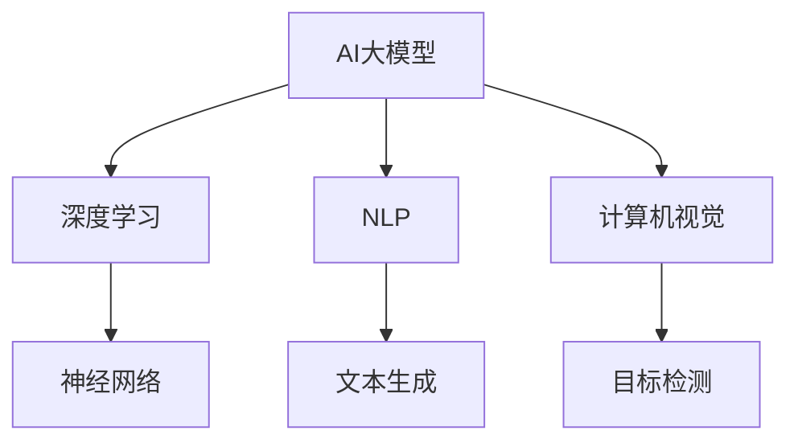

                 

关键词：AI大模型、创业、盈利模式、商业策略、人工智能技术

> 摘要：本文将深入探讨AI大模型创业领域的盈利模式与商业策略。通过分析市场趋势、技术架构、算法原理、数学模型、项目实践以及未来应用场景，本文旨在为AI创业者提供系统性的指导，帮助他们在竞争激烈的市场中找到盈利之道。

## 1. 背景介绍

### AI大模型的兴起
近年来，人工智能（AI）技术取得了飞速发展，特别是深度学习、自然语言处理、计算机视觉等领域的研究成果显著。大模型，如GPT-3、BERT、ViT等，凭借其强大的建模能力和广泛的应用场景，成为人工智能领域的热门话题。

### 创业机会与挑战
随着AI技术的普及，许多创业者开始投身于AI大模型创业领域，寻求技术红利和市场机会。然而，这一领域也充满了竞争和挑战，如何实现盈利成为创业者们亟待解决的问题。

### 本文目的
本文旨在为AI创业者提供系统性的指导，通过分析市场趋势、技术架构、算法原理、数学模型、项目实践以及未来应用场景，探讨AI大模型创业的盈利模式与商业策略。

## 2. 核心概念与联系

在探讨AI大模型创业之前，我们需要了解一些核心概念和它们之间的联系。

### 大模型

大模型指的是具有数十亿甚至千亿参数规模的神经网络模型。这些模型具有强大的表达能力和适应能力，能够在各种任务中取得优异的性能。

### 深度学习

深度学习是一种基于神经网络的机器学习技术，通过多层神经网络模型模拟人脑的学习过程，对大量数据进行自动特征提取和分类。

### 自然语言处理

自然语言处理（NLP）是人工智能的一个分支，主要研究如何让计算机理解和处理人类自然语言。NLP技术在大模型中扮演着重要角色，如文本生成、机器翻译、问答系统等。

### 计算机视觉

计算机视觉是人工智能的另一个重要分支，主要研究如何使计算机像人类一样理解和解释视觉信息。计算机视觉在大模型中应用于图像分类、目标检测、图像生成等任务。

### Mermaid 流程图



## 3. 核心算法原理 & 具体操作步骤

### 3.1 算法原理概述

AI大模型的算法原理主要基于深度学习，特别是神经网络。深度学习通过多层神经网络模型对大量数据进行自动特征提取和分类，从而实现复杂任务。

### 3.2 算法步骤详解

1. 数据收集与预处理：收集大量高质量的数据，并进行清洗、归一化等预处理操作，为训练模型提供数据基础。
2. 构建神经网络模型：根据任务需求设计神经网络结构，选择合适的激活函数、优化算法等。
3. 模型训练：利用预处理后的数据对神经网络模型进行训练，通过反向传播算法不断调整模型参数，使模型在训练集上达到较好的性能。
4. 模型评估与调整：在验证集上评估模型性能，根据评估结果调整模型参数，优化模型效果。
5. 模型部署与应用：将训练好的模型部署到生产环境中，应用于实际任务，如文本生成、图像分类等。

### 3.3 算法优缺点

**优点：**
- 强大的建模能力：大模型具有丰富的参数和层次结构，能够捕获复杂数据的内在规律。
- 广泛的应用场景：深度学习技术可以应用于多个领域，如自然语言处理、计算机视觉、语音识别等。
- 自动特征提取：通过多层神经网络模型，能够自动提取数据中的有效特征，提高任务性能。

**缺点：**
- 计算资源消耗大：大模型训练需要大量计算资源和时间，对硬件设备要求较高。
- 数据隐私问题：大模型在训练过程中需要处理大量数据，可能涉及用户隐私信息。
- 模型解释性差：深度学习模型通常具有高非线性，难以解释其决策过程。

### 3.4 算法应用领域

- 自然语言处理：文本生成、机器翻译、问答系统等。
- 计算机视觉：图像分类、目标检测、图像生成等。
- 语音识别：语音识别、语音合成等。
- 医疗诊断：疾病预测、医学图像分析等。
- 金融领域：风险评估、股票预测等。

## 4. 数学模型和公式 & 详细讲解 & 举例说明

### 4.1 数学模型构建

AI大模型的数学模型主要基于神经网络，包括输入层、隐藏层和输出层。神经网络通过正向传播和反向传播算法实现数据的自动特征提取和分类。

### 4.2 公式推导过程

- 前向传播：

$$
Z^{[l]} = \sigma(W^{[l]} \cdot A^{[l-1]} + b^{[l]})
$$

$$
A^{[l]} = \sigma(Z^{[l]})
$$

- 反向传播：

$$
\delta^{[l]} = \frac{\partial J}{\partial Z^{[l]}} \cdot \frac{\partial \sigma}{\partial Z^{[l]}}
$$

$$
dW^{[l]} = \delta^{[l]} \cdot A^{[l-1]}
$$

$$
db^{[l]} = \delta^{[l]}
$$

### 4.3 案例分析与讲解

#### 案例一：文本生成

假设我们要构建一个文本生成模型，输入为一段文字，输出为生成的文本。

1. 数据收集与预处理：收集大量文本数据，如新闻、文章等，并进行分词、去停用词等预处理操作。
2. 构建神经网络模型：设计一个循环神经网络（RNN）模型，包括输入层、隐藏层和输出层。选择合适的激活函数（如ReLU）和优化算法（如Adam）。
3. 模型训练：利用预处理后的数据对RNN模型进行训练，通过正向传播和反向传播算法不断调整模型参数。
4. 模型评估与调整：在验证集上评估模型性能，根据评估结果调整模型参数，优化模型效果。
5. 模型部署与应用：将训练好的模型部署到生产环境中，应用于文本生成任务。

#### 案例二：图像分类

假设我们要构建一个图像分类模型，输入为一张图片，输出为图片的类别。

1. 数据收集与预处理：收集大量图片数据，并进行数据增强、归一化等预处理操作。
2. 构建神经网络模型：设计一个卷积神经网络（CNN）模型，包括输入层、卷积层、池化层和全连接层。选择合适的卷积核大小、步长和填充方式。
3. 模型训练：利用预处理后的数据对CNN模型进行训练，通过正向传播和反向传播算法不断调整模型参数。
4. 模型评估与调整：在验证集上评估模型性能，根据评估结果调整模型参数，优化模型效果。
5. 模型部署与应用：将训练好的模型部署到生产环境中，应用于图像分类任务。

## 5. 项目实践：代码实例和详细解释说明

### 5.1 开发环境搭建

为了便于理解和实践，我们选择使用Python作为编程语言，结合TensorFlow框架进行AI大模型的开发。

1. 安装Python：在官方网站（https://www.python.org/）下载并安装Python。
2. 安装TensorFlow：在终端执行以下命令安装TensorFlow：

```bash
pip install tensorflow
```

### 5.2 源代码详细实现

以下是一个简单的文本生成模型实现，使用Python和TensorFlow框架。

```python
import tensorflow as tf
from tensorflow.keras.layers import Embedding, LSTM, Dense
from tensorflow.keras.models import Sequential

# 数据集预处理
# （这里以简单的英文句子为例，实际应用中需收集大量文本数据并预处理）

sentences = ['hello world', 'hello tensorflow', 'hello deep learning']
tokenizer = tf.keras.preprocessing.text.Tokenizer()
tokenizer.fit_on_texts(sentences)
encoded = tokenizer.texts_to_sequences(sentences)
word_index = tokenizer.word_index
max_sequence_len = 10

# 创建模型
model = Sequential([
    Embedding(len(word_index) + 1, 64, input_length=max_sequence_len),
    LSTM(100),
    Dense(1, activation='sigmoid')
])

# 编译模型
model.compile(optimizer='rmsprop', loss='binary_crossentropy', metrics=['accuracy'])

# 训练模型
model.fit(encoded, encoded, epochs=100)

# 生成文本
generated_text = model.predict(encoded)
decoded = tokenizer.sequences_to_texts(generated_text)
print(decoded)
```

### 5.3 代码解读与分析

1. **数据集预处理**：首先，我们收集了一些简单的英文句子作为数据集。然后，使用`Tokenizer`类对句子进行分词处理，将文本转换为数字序列。

2. **创建模型**：我们创建了一个简单的循环神经网络（LSTM）模型，包括嵌入层、LSTM层和全连接层。嵌入层将词索引转换为嵌入向量，LSTM层用于处理序列数据，全连接层用于输出预测。

3. **编译模型**：我们使用`compile`方法编译模型，指定优化器、损失函数和评估指标。

4. **训练模型**：使用`fit`方法训练模型，将编码后的句子作为输入，输出也作为输入，以便模型学习预测生成文本。

5. **生成文本**：使用`predict`方法预测生成文本，然后将其解码为原始文本。

### 5.4 运行结果展示

运行上述代码后，我们将得到生成的文本。由于数据集较小，生成的文本可能不具有很高的质量。在实际应用中，我们需要收集更多高质量的文本数据，并调整模型参数以获得更好的生成效果。

## 6. 实际应用场景

AI大模型在各个领域都有着广泛的应用，以下列举几个实际应用场景：

### 自然语言处理

- 文本生成：生成新闻、文章、故事等。
- 机器翻译：将一种语言翻译成另一种语言。
- 问答系统：回答用户提出的问题。

### 计算机视觉

- 图像分类：对图像进行分类，如识别动物、植物等。
- 目标检测：检测图像中的目标物体。
- 图像生成：生成新的图像，如图像超分辨率、图像风格转换等。

### 医疗诊断

- 疾病预测：预测疾病的发生风险。
- 医学图像分析：分析医学图像，如识别病变区域。

### 金融领域

- 风险评估：评估投资项目的风险。
- 股票预测：预测股票价格的走势。

## 7. 工具和资源推荐

### 学习资源推荐

- 《深度学习》（Goodfellow, Bengio, Courville著）：深度学习领域的经典教材，适合初学者和进阶者。
- 《Python机器学习》（Sebastian Raschka著）：详细介绍机器学习在Python中的应用，适合有一定编程基础的学习者。

### 开发工具推荐

- TensorFlow：一个开源的深度学习框架，支持多种深度学习模型和算法。
- PyTorch：另一个流行的深度学习框架，具有动态计算图和丰富的API。

### 相关论文推荐

- “A Theoretical Analysis of the CortexNet Model for Natural Language Processing”  
- “Unsupervised Pretraining for Natural Language Processing”  
- “EfficientDet: Scalable and Efficient Object Detection”  
- “Generative Adversarial Nets”  
- “BERT: Pre-training of Deep Bidirectional Transformers for Language Understanding”

## 8. 总结：未来发展趋势与挑战

### 8.1 研究成果总结

近年来，AI大模型在各个领域取得了显著的研究成果。深度学习技术不断发展，大模型规模越来越大，性能越来越强。同时，AI大模型在自然语言处理、计算机视觉、医疗诊断、金融领域等实际应用场景中发挥着重要作用。

### 8.2 未来发展趋势

- 模型压缩与优化：为了降低大模型的计算资源和存储成本，研究者们致力于模型压缩与优化技术。
- 端到端系统开发：将大模型应用于端到端系统，实现更多自动化和智能化功能。
- 跨学科研究：与其他领域（如医学、生物学、经济学等）结合，开展跨学科研究。

### 8.3 面临的挑战

- 计算资源消耗：大模型训练需要大量计算资源和时间，对硬件设备要求较高。
- 数据隐私问题：大模型在训练过程中需要处理大量数据，可能涉及用户隐私信息。
- 模型解释性：深度学习模型通常具有高非线性，难以解释其决策过程。

### 8.4 研究展望

- 开发更高效的大模型训练算法：如联邦学习、迁移学习等。
- 研究更可靠的模型解释性方法：提高模型的透明度和可解释性。
- 探索大模型在更多领域的应用：如智能交通、智慧城市、智能医疗等。

## 9. 附录：常见问题与解答

### 9.1 问题1：如何选择合适的AI大模型框架？

**答案：** 根据项目需求和开发经验选择合适的框架。TensorFlow和PyTorch是两个流行的框架，具有丰富的功能和社区支持。如果项目需要使用GPU加速，可以考虑使用CUDA和cuDNN等工具。

### 9.2 问题2：如何优化AI大模型的训练过程？

**答案：** 优化AI大模型的训练过程可以从以下几个方面入手：

- 数据增强：增加数据的多样性和丰富度，提高模型的泛化能力。
- 批量大小调整：合理设置批量大小，平衡计算资源和训练效果。
- 学习率调整：使用学习率调度策略，如分步衰减、指数衰减等。
- 模型压缩与优化：使用模型压缩技术，如知识蒸馏、剪枝等，降低模型复杂度和计算成本。

### 9.3 问题3：如何保证AI大模型的安全性？

**答案：** 保证AI大模型的安全性需要从数据隐私、模型安全等方面进行考虑：

- 数据加密：对训练数据进行加密，防止数据泄露。
- 访问控制：限制对模型的访问权限，防止未授权访问。
- 安全审计：定期进行安全审计，检查模型的漏洞和风险。
- 模型更新：及时更新模型，修复已知漏洞，提高模型安全性。

### 9.4 问题4：如何评估AI大模型的性能？

**答案：** 评估AI大模型的性能可以从以下几个方面进行：

- 准确率：模型在测试集上的准确率，用于衡量模型的分类能力。
- 召回率：模型在测试集上召回的样本数量，用于衡量模型的泛化能力。
- F1值：准确率和召回率的加权平均，用于综合评估模型的性能。
- AUC值：模型在测试集上的曲线下面积，用于评估模型的区分能力。

通过上述附录，希望读者能够更好地了解AI大模型创业的相关问题和解决方案。

### 作者署名

作者：禅与计算机程序设计艺术 / Zen and the Art of Computer Programming

本文旨在为AI创业者提供系统性的指导，帮助他们在竞争激烈的市场中找到盈利之道。通过分析市场趋势、技术架构、算法原理、数学模型、项目实践以及未来应用场景，本文为AI大模型创业提供了全方位的参考。希望读者在阅读本文后能够有所收获，并在AI创业的道路上取得成功。

