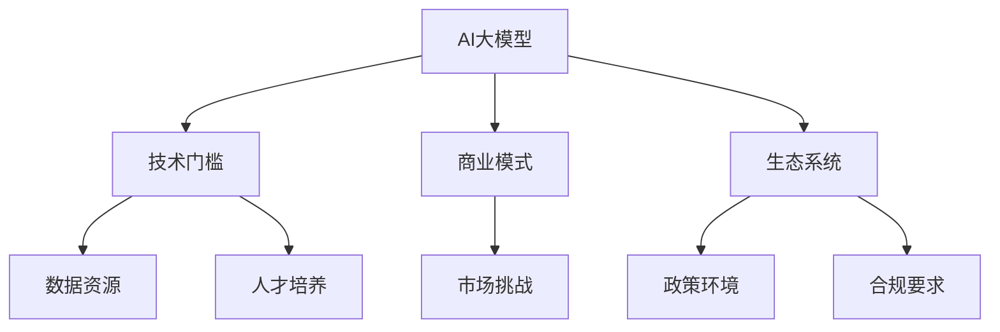

                 

关键词：AI大模型、创业、市场挑战、技术发展、商业模式创新、数据安全、隐私保护、算法优化、生态构建、人才培养。

摘要：随着人工智能技术的飞速发展，AI大模型成为推动产业创新的重要力量。然而，在市场环境中，AI大模型创业面临着诸多挑战，包括技术门槛、数据资源、商业模式创新等。本文将深入探讨AI大模型创业所面临的挑战，并提出相应的应对策略，以期为创业者和投资者提供有价值的参考。

## 1. 背景介绍

人工智能（AI）作为当今科技领域的热点，已经渗透到各个行业，从医疗、金融到零售、制造等。特别是在深度学习、神经网络等技术的推动下，AI大模型（如GPT、BERT等）取得了显著的成果，展现出强大的数据分析和预测能力。这些大模型的应用，不仅提升了传统行业的效率，还为新兴产业带来了新的商业模式。

AI大模型创业热潮逐渐兴起，吸引了大量的创业者和投资者。然而，成功创业并非易事，AI大模型创业面临着多重挑战。如何应对这些挑战，成为决定创业项目成败的关键因素。

### 1.1 AI大模型创业的市场前景

AI大模型创业的市场前景广阔，主要体现在以下几个方面：

1. **技术需求旺盛**：随着大数据和云计算的普及，越来越多的行业对AI大模型的需求日益增长，尤其是在个性化推荐、智能客服、风险控制等领域。

2. **商业价值凸显**：AI大模型的应用可以显著提升企业的运营效率，降低成本，提高用户体验，从而创造巨大的商业价值。

3. **政策支持**：全球范围内，各国政府纷纷出台政策，支持人工智能技术的发展和应用，为AI大模型创业提供了良好的政策环境。

### 1.2 AI大模型创业面临的挑战

尽管AI大模型创业市场前景广阔，但创业者在实际操作过程中仍然面临着诸多挑战：

1. **技术门槛高**：AI大模型开发需要深厚的专业知识和丰富的实践经验，这对创业团队的技术实力提出了较高要求。

2. **数据资源不足**：数据是AI大模型训练的重要资源，但获取高质量、大量的数据并非易事，特别是在隐私保护和合规要求的背景下。

3. **商业模式创新**：如何在竞争激烈的市场中找到独特的商业模式，是创业者需要解决的重要问题。

4. **生态系统构建**：构建一个健康、可持续的生态系统，对于AI大模型创业项目的长期发展至关重要。

## 2. 核心概念与联系

为了更好地理解AI大模型创业的挑战，我们需要明确以下几个核心概念：

1. **AI大模型**：指的是基于深度学习、神经网络等技术，通过大规模数据训练得到的具有高度智能化的模型。常见的AI大模型有GPT、BERT等。

2. **技术门槛**：指的是进入某项技术领域所需的技能、知识和经验等。

3. **商业模式**：指的是企业通过何种方式创造、传递和获取价值。

4. **生态系统**：指的是围绕某项技术或产品形成的一系列企业、机构、开发者等利益相关者的互动网络。

下面是一个用Mermaid绘制的AI大模型创业涉及的几个核心概念和它们之间的联系：



### 2.1 技术门槛

技术门槛是AI大模型创业的重要挑战之一。它决定了创业团队能否有效地开发和优化大模型。以下是技术门槛的一些关键点：

- **算法知识**：理解深度学习、神经网络等算法原理，能够根据业务需求进行模型设计和优化。
- **编程技能**：熟练掌握Python、TensorFlow、PyTorch等编程工具，能够高效地实现算法和模型。
- **数据处理能力**：能够处理大规模数据，进行数据清洗、预处理和特征提取。
- **模型评估与优化**：掌握模型评估指标，能够根据评估结果进行模型优化。

### 2.2 商业模式

商业模式是AI大模型创业的核心之一。一个成功的商业模式需要明确以下几个要素：

- **价值主张**：明确产品或服务的价值，解决用户的痛点。
- **客户群体**：确定目标客户群体，了解其需求和偏好。
- **盈利模式**：确定如何通过产品或服务获得收益。
- **市场定位**：在竞争激烈的市场中找到独特的定位。

### 2.3 生态系统

生态系统是AI大模型创业的长期发展基础。一个健康的生态系统有助于吸引人才、合作伙伴和投资者。以下是构建生态系统的关键点：

- **技术开放性**：提供开源技术或API，鼓励开发者参与和贡献。
- **合作伙伴关系**：与行业内的企业、研究机构建立合作，共同推进技术进步。
- **人才培养**：提供培训和教育资源，培养专业人才。
- **政策支持**：积极与政府沟通，争取政策支持和资源。

## 3. 核心算法原理 & 具体操作步骤

### 3.1 算法原理概述

AI大模型的核心算法是基于深度学习和神经网络的。以下是几种常见的大模型算法原理：

1. **深度神经网络（DNN）**：通过多层神经元的非线性组合，实现对复杂函数的建模。
2. **卷积神经网络（CNN）**：在图像处理领域有广泛应用，通过卷积操作提取图像特征。
3. **递归神经网络（RNN）**：特别适用于序列数据的建模，如自然语言处理。
4. **变分自编码器（VAE）**：通过生成模型实现数据的概率分布估计。

### 3.2 算法步骤详解

以下是使用深度神经网络（DNN）进行AI大模型训练的基本步骤：

1. **数据收集与预处理**：收集相关领域的大规模数据，并进行清洗、归一化等预处理操作。
2. **模型设计**：根据业务需求设计神经网络结构，包括输入层、隐藏层和输出层。
3. **训练过程**：通过反向传播算法训练模型，调整网络权重，使模型输出更接近真实值。
4. **模型评估**：使用验证集评估模型性能，根据评估结果调整模型结构或参数。
5. **模型部署**：将训练好的模型部署到生产环境中，进行实际应用。

### 3.3 算法优缺点

每种算法都有其优缺点，以下是几种常见算法的优缺点：

1. **深度神经网络（DNN）**：
   - **优点**：适用于复杂函数建模，具有较好的泛化能力。
   - **缺点**：训练过程需要大量数据和计算资源，模型可解释性较低。
2. **卷积神经网络（CNN）**：
   - **优点**：在图像处理领域有很好的表现，能够自动提取图像特征。
   - **缺点**：对图像以外的数据处理能力较弱，模型结构复杂。
3. **递归神经网络（RNN）**：
   - **优点**：适用于序列数据的建模，能够捕捉时间序列信息。
   - **缺点**：训练过程容易出现梯度消失或爆炸问题，模型训练时间较长。
4. **变分自编码器（VAE）**：
   - **优点**：能够实现数据的概率分布建模，具有良好的生成能力。
   - **缺点**：生成数据质量相对较低，训练过程需要大量计算资源。

### 3.4 算法应用领域

AI大模型的应用领域广泛，以下是几种常见应用领域：

1. **自然语言处理（NLP）**：如文本分类、机器翻译、情感分析等。
2. **计算机视觉**：如图像分类、目标检测、图像生成等。
3. **推荐系统**：如个性化推荐、广告投放等。
4. **金融风控**：如信用评分、欺诈检测等。

## 4. 数学模型和公式 & 详细讲解 & 举例说明

### 4.1 数学模型构建

在AI大模型中，常用的数学模型是基于概率论的统计模型。以下是几种常见的数学模型：

1. **贝叶斯网络**：用于表示变量之间的概率依赖关系。
2. **马尔可夫模型**：用于表示时间序列数据的概率转移。
3. **隐马尔可夫模型（HMM）**：用于序列数据的建模。
4. **条件概率模型**：用于在给定某些条件下预测其他变量的概率。

### 4.2 公式推导过程

以贝叶斯网络为例，其概率计算公式如下：

\[ P(A|B) = \frac{P(B|A) \cdot P(A)}{P(B)} \]

其中，\( P(A|B) \)表示在B发生的条件下A发生的概率，\( P(B|A) \)表示在A发生的条件下B发生的概率，\( P(A) \)和\( P(B) \)分别表示A和B的边缘概率。

### 4.3 案例分析与讲解

以自然语言处理中的文本分类为例，我们使用贝叶斯模型进行文本分类。以下是具体的步骤：

1. **数据准备**：收集大量文本数据，并进行预处理，如分词、去停用词等。
2. **特征提取**：将预处理后的文本转换为向量表示，如TF-IDF向量。
3. **模型训练**：使用训练集数据训练贝叶斯模型，计算每个类别出现的概率和条件概率。
4. **模型评估**：使用验证集评估模型性能，调整模型参数。
5. **模型部署**：将训练好的模型部署到生产环境中，进行实际文本分类任务。

以下是贝叶斯模型的运行示例：

```python
import numpy as np
from sklearn.datasets import fetch_20newsgroups
from sklearn.feature_extraction.text import TfidfVectorizer
from sklearn.naive_bayes import MultinomialNB
from sklearn.pipeline import make_pipeline

# 数据准备
data = fetch_20newsgroups(subset='all')
vectorizer = TfidfVectorizer()
X = vectorizer.fit_transform(data.data)

# 模型训练
model = MultinomialNB()
model.fit(X, data.target)

# 模型评估
score = model.score(X, data.target)
print(f"模型准确率：{score:.2f}")

# 模型部署
text = "这是一条关于科技的新闻。"
text_vector = vectorizer.transform([text])
predicted = model.predict(text_vector)
print(f"预测类别：{data.target_names[predicted[0]]}")
```

## 5. 项目实践：代码实例和详细解释说明

### 5.1 开发环境搭建

为了实践AI大模型，我们需要搭建一个合适的开发环境。以下是基本的开发环境搭建步骤：

1. 安装Python环境（推荐使用Python 3.8及以上版本）。
2. 安装TensorFlow库，可以使用以下命令：

   ```bash
   pip install tensorflow
   ```

3. 安装Keras库，它是TensorFlow的高层次API，可以简化模型搭建过程：

   ```bash
   pip install keras
   ```

### 5.2 源代码详细实现

以下是使用Keras实现一个简单的AI大模型（基于卷积神经网络）的示例代码：

```python
from keras.models import Sequential
from keras.layers import Conv2D, MaxPooling2D, Flatten, Dense
from keras.optimizers import Adam
from keras.preprocessing.image import ImageDataGenerator

# 模型搭建
model = Sequential()
model.add(Conv2D(32, (3, 3), activation='relu', input_shape=(64, 64, 3)))
model.add(MaxPooling2D(pool_size=(2, 2)))
model.add(Flatten())
model.add(Dense(64, activation='relu'))
model.add(Dense(10, activation='softmax'))

# 编译模型
model.compile(optimizer=Adam(), loss='categorical_crossentropy', metrics=['accuracy'])

# 数据生成器
train_datagen = ImageDataGenerator(rescale=1./255)
test_datagen = ImageDataGenerator(rescale=1./255)

train_generator = train_datagen.flow_from_directory(
        'data/train',
        target_size=(64, 64),
        batch_size=32,
        class_mode='categorical')

test_generator = test_datagen.flow_from_directory(
        'data/test',
        target_size=(64, 64),
        batch_size=32,
        class_mode='categorical')

# 训练模型
model.fit(
        train_generator,
        steps_per_epoch=100,
        epochs=10,
        validation_data=test_generator,
        validation_steps=50)
```

### 5.3 代码解读与分析

以上代码实现了一个简单的卷积神经网络（CNN）模型，用于图像分类任务。以下是代码的详细解读：

1. **模型搭建**：
   - 使用`Sequential`模型构建器搭建模型。
   - 添加卷积层（`Conv2D`），设置32个卷积核，核大小为3x3，激活函数为ReLU。
   - 添加最大池化层（`MaxPooling2D`），池化窗口大小为2x2。
   - 展平层（`Flatten`），将卷积层的输出展平为1维向量。
   - 添加全连接层（`Dense`），第一层设置64个神经元，激活函数为ReLU。
   - 第二层设置10个神经元，激活函数为softmax，用于多分类输出。

2. **模型编译**：
   - 使用`Adam`优化器编译模型。
   - 损失函数设置为`categorical_crossentropy`，适用于多分类问题。
   - 评价指标设置为`accuracy`，即准确率。

3. **数据生成器**：
   - 使用`ImageDataGenerator`创建训练和测试数据生成器，进行数据预处理，如归一化、数据增强等。

4. **模型训练**：
   - 使用`fit`方法训练模型，设置训练轮次（epochs）和每个epoch的训练样本数（steps_per_epoch）。
   - 使用验证数据生成器进行验证，设置验证轮次（validation_steps）。

### 5.4 运行结果展示

在实际运行中，我们可以通过以下代码查看模型的训练过程和最终结果：

```python
history = model.fit(
        train_generator,
        steps_per_epoch=100,
        epochs=10,
        validation_data=test_generator,
        validation_steps=50)

# 绘制训练过程曲线
import matplotlib.pyplot as plt

plt.figure(figsize=(12, 4))
plt.subplot(1, 2, 1)
plt.plot(history.history['accuracy'], label='accuracy')
plt.plot(history.history['val_accuracy'], label='val_accuracy')
plt.xlabel('epoch')
plt.ylabel('accuracy')
plt.legend()

plt.subplot(1, 2, 2)
plt.plot(history.history['loss'], label='loss')
plt.plot(history.history['val_loss'], label='val_loss')
plt.xlabel('epoch')
plt.ylabel('loss')
plt.legend()

plt.show()
```

## 6. 实际应用场景

AI大模型在实际应用场景中具有广泛的应用，以下是几个典型的应用案例：

### 6.1 自然语言处理

在自然语言处理领域，AI大模型可以用于文本分类、情感分析、机器翻译等任务。例如，Google的BERT模型在多个NLP任务上取得了优异的性能，广泛应用于搜索引擎、客服系统等领域。

### 6.2 计算机视觉

在计算机视觉领域，AI大模型可以用于图像分类、目标检测、图像生成等任务。例如，OpenAI的GPT-3模型在图像生成任务上表现出色，可以生成高质量的图像。

### 6.3 金融风控

在金融风控领域，AI大模型可以用于信用评分、欺诈检测等任务。例如，某些银行使用基于AI的大模型对用户行为进行分析，从而预测潜在的信用风险。

### 6.4 健康医疗

在健康医疗领域，AI大模型可以用于疾病诊断、药物研发等任务。例如，某些医疗机构使用基于AI的大模型对医学影像进行分析，从而提高疾病诊断的准确性。

## 7. 工具和资源推荐

### 7.1 学习资源推荐

1. **《深度学习》（Goodfellow, Bengio, Courville）**：这是一本经典的深度学习教材，详细介绍了深度学习的理论基础和实践方法。
2. **《Python深度学习》（François Chollet）**：这是一本针对Python编程语言的深度学习教程，适合初学者快速入门。
3. **《AI简史》（Stuart Russell, Peter Norvig）**：这是一本全面介绍人工智能发展史的书籍，涵盖了人工智能的多个领域。

### 7.2 开发工具推荐

1. **TensorFlow**：由Google开发的开源深度学习框架，适用于各种深度学习任务。
2. **PyTorch**：由Facebook开发的开源深度学习框架，具有较高的灵活性和易用性。
3. **Keras**：基于TensorFlow和PyTorch的高层次API，简化了模型搭建和训练过程。

### 7.3 相关论文推荐

1. **“A Theoretically Grounded Application of Dropout in Recurrent Neural Networks”**：该论文提出了一种在RNN中应用Dropout的方法，有效解决了梯度消失问题。
2. **“Unsupervised Learning of Visual Representations by Solving Jigsaw Puzzles”**：该论文通过解决拼图游戏训练视觉模型，为无监督学习提供了一种新思路。
3. **“Bert: Pre-training of Deep Bidirectional Transformers for Language Understanding”**：该论文提出了BERT模型，在多个NLP任务上取得了突破性成果。

## 8. 总结：未来发展趋势与挑战

### 8.1 研究成果总结

近年来，AI大模型的研究取得了显著的成果，不仅在性能上取得了突破，还在实际应用中展现了强大的潜力。以下是一些主要的研究成果：

- **模型性能提升**：随着计算能力和算法优化的提升，AI大模型的性能不断提高，尤其是在自然语言处理、计算机视觉等领域。
- **泛化能力增强**：通过引入注意力机制、自监督学习等方法，AI大模型的泛化能力得到显著提升。
- **可解释性增强**：研究人员致力于提高AI大模型的可解释性，使其决策过程更加透明和可信。

### 8.2 未来发展趋势

AI大模型在未来将继续向以下几个方向发展：

- **更大数据集**：随着数据量的增加，AI大模型将能够处理更复杂、更大量的数据，进一步提升性能。
- **多模态融合**：AI大模型将能够处理多种类型的数据（如文本、图像、声音等），实现多模态融合。
- **迁移学习**：通过迁移学习，AI大模型可以快速适应新任务，降低训练成本。
- **边缘计算**：随着边缘计算技术的发展，AI大模型将能够实现在边缘设备上的实时推理，降低延迟。

### 8.3 面临的挑战

尽管AI大模型的研究和应用取得了显著成果，但仍面临以下挑战：

- **数据隐私**：在训练和部署AI大模型时，如何保护用户隐私是一个重要挑战。
- **计算资源**：AI大模型的训练和推理过程需要大量计算资源，如何优化计算资源的使用是一个重要问题。
- **模型可解释性**：提高AI大模型的可解释性，使其决策过程更加透明和可信，是一个长期的目标。
- **伦理和法规**：随着AI大模型的应用范围扩大，如何制定相应的伦理和法规标准，确保其合理使用，是一个重要问题。

### 8.4 研究展望

未来，AI大模型的研究将继续深入，以下是几个可能的研究方向：

- **安全与隐私**：研究如何在不泄露用户隐私的前提下，保护AI大模型的安全性和可靠性。
- **模型压缩**：研究如何优化AI大模型的参数和结构，实现模型压缩和加速。
- **跨模态学习**：研究如何实现AI大模型在不同模态数据之间的有效融合，提升模型的性能和应用范围。
- **伦理与法规**：制定相关的伦理和法规标准，确保AI大模型的合理使用，避免潜在的风险。

## 9. 附录：常见问题与解答

### 9.1 如何选择合适的AI大模型算法？

选择合适的AI大模型算法需要考虑以下几个因素：

- **应用领域**：不同的算法适用于不同的应用领域，如自然语言处理、计算机视觉等。
- **数据规模**：算法的性能受数据规模的影响，大型数据集适合使用复杂度较高的算法。
- **计算资源**：算法的训练和推理过程需要大量的计算资源，需要根据实际情况进行选择。

### 9.2 AI大模型训练需要多长时间？

AI大模型训练所需的时间取决于多个因素，包括：

- **数据规模**：数据规模越大，训练时间越长。
- **模型复杂度**：模型参数越多，训练时间越长。
- **计算资源**：计算资源越充足，训练速度越快。

通常情况下，一个中等规模的AI大模型训练可能需要几天到几周的时间。

### 9.3 如何优化AI大模型的性能？

优化AI大模型性能可以从以下几个方面入手：

- **数据预处理**：进行有效的数据预处理，如数据增强、归一化等，可以提升模型的性能。
- **模型结构优化**：通过调整模型结构，如增加层数、调整卷积核大小等，可以提升模型的性能。
- **超参数优化**：通过调整超参数，如学习率、批量大小等，可以提升模型的性能。
- **算法改进**：引入新的算法或优化现有算法，可以提高模型的性能。

### 9.4 AI大模型的应用前景如何？

AI大模型的应用前景非常广阔，以下是一些潜在的应用领域：

- **自然语言处理**：如文本分类、机器翻译、情感分析等。
- **计算机视觉**：如图像分类、目标检测、图像生成等。
- **金融风控**：如信用评分、欺诈检测等。
- **医疗健康**：如疾病诊断、药物研发等。
- **智能交通**：如自动驾驶、交通流量预测等。

### 9.5 如何保证AI大模型的安全性和可靠性？

保证AI大模型的安全性和可靠性需要从以下几个方面入手：

- **数据安全**：确保训练和存储数据的安全，采取加密、访问控制等措施。
- **模型安全**：防止模型被攻击，如对抗攻击、数据泄露等。
- **模型可解释性**：提高模型的可解释性，使其决策过程更加透明和可信。
- **合规性**：遵守相关法律法规，确保模型的合法使用。

## 参考文献

- Goodfellow, I., Bengio, Y., & Courville, A. (2016). *Deep Learning*. MIT Press.
- Chollet, F. (2018). *Python深度学习*. 机械工业出版社.
- Russell, S., & Norvig, P. (2020). *AI简史*. 人民邮电出版社.

---

作者：禅与计算机程序设计艺术 / Zen and the Art of Computer Programming

