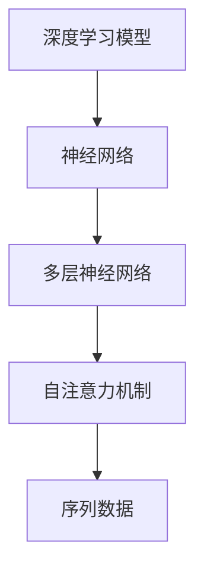

                 

关键词：AI大模型、创业、技术挑战、未来趋势、应用领域

## 摘要

本文旨在探讨AI大模型创业中面临的技术挑战及其应对策略。首先，我们将回顾AI大模型的发展历程，然后深入分析当前AI大模型的核心概念、架构与算法原理。接着，我们将介绍如何通过数学模型和公式对AI大模型进行优化。在此基础上，我们通过具体项目实践来展示AI大模型的应用，并探讨其实际应用场景。最后，我们将展望未来AI大模型的发展趋势，以及面临的挑战和应对策略。

## 1. 背景介绍

AI大模型（Large-scale AI Models）是近年来人工智能领域的重要突破。从最初的简单模型如线性回归、决策树，到复杂的深度学习模型如神经网络、Transformer，AI大模型在图像识别、自然语言处理、语音识别等领域取得了显著的成果。随着计算能力的提升和海量数据的积累，AI大模型的研究与应用日益广泛。然而，AI大模型的开发与部署也面临着一系列技术挑战。

### 1.1 AI大模型的发展历程

AI大模型的发展可以追溯到20世纪50年代，当时人工神经网络（Artificial Neural Networks，ANN）首次被提出。ANN作为一种简单的模拟人脑神经元连接结构的计算模型，虽然在当时取得了初步的成功，但受限于计算能力和数据规模，其性能提升有限。

随着计算机硬件技术的进步，尤其是在GPU和TPU等专用硬件的出现，以及分布式计算技术的应用，深度学习模型（Deep Learning Models）开始崛起。2006年，Hinton等人提出了深度信念网络（Deep Belief Network，DBN），标志着深度学习模型在理论上和实际应用上取得了重要进展。

2014年，Google推出了Transformer模型，这是一种基于自注意力机制的深度学习模型，它在自然语言处理领域取得了革命性的成果。此后，AI大模型的发展进入了快速阶段，不仅在学术界得到了广泛研究，也在工业界得到了广泛应用。

### 1.2 AI大模型的应用领域

AI大模型的应用领域非常广泛，主要包括：

- **图像识别**：通过卷积神经网络（Convolutional Neural Networks，CNN）实现，如人脸识别、物体检测等。
- **自然语言处理**：通过Transformer等模型实现，如机器翻译、文本生成、情感分析等。
- **语音识别**：通过循环神经网络（Recurrent Neural Networks，RNN）和长短期记忆网络（Long Short-Term Memory，LSTM）等实现，如语音转文本、语音识别等。
- **推荐系统**：通过协同过滤、矩阵分解等算法实现，如商品推荐、音乐推荐等。
- **游戏AI**：通过深度强化学习实现，如围棋、德州扑克等。

## 2. 核心概念与联系

### 2.1 核心概念

- **深度学习模型**：一种能够通过多层神经网络对数据进行自动特征提取和模式识别的模型。
- **神经网络**：一种由大量神经元组成的计算模型，通过神经元之间的连接和激活函数进行计算。
- **自注意力机制**：一种能够在序列数据中自适应地分配注意力权重的方法，用于提高模型的表示能力。

### 2.2 Mermaid 流程图



## 3. 核心算法原理 & 具体操作步骤

### 3.1 算法原理概述

AI大模型的核心算法主要包括：

- **神经网络**：通过多层神经网络对数据进行特征提取和模式识别。
- **自注意力机制**：在序列数据中自适应地分配注意力权重。

### 3.2 算法步骤详解

#### 3.2.1 神经网络步骤

1. **输入层**：接收输入数据。
2. **隐藏层**：对输入数据进行特征提取。
3. **输出层**：根据隐藏层的输出进行预测。

#### 3.2.2 自注意力机制步骤

1. **计算自注意力权重**：对于序列中的每个元素，计算其对其他所有元素的影响权重。
2. **加权求和**：将注意力权重与对应的序列元素相乘，然后求和得到新的序列表示。

### 3.3 算法优缺点

#### 优点

- **强大的表示能力**：通过多层神经网络和自注意力机制，能够对复杂的数据进行有效的特征提取和模式识别。
- **泛化能力**：通过大规模数据的训练，模型能够在不同的任务和数据集上表现出良好的泛化能力。

#### 缺点

- **计算复杂度**：AI大模型通常需要大量的计算资源和时间进行训练和预测。
- **过拟合风险**：当模型过于复杂时，可能会出现过拟合现象，即模型在训练集上表现良好，但在测试集上表现较差。

### 3.4 算法应用领域

AI大模型的应用领域非常广泛，主要包括：

- **图像识别**：通过卷积神经网络进行物体检测和分类。
- **自然语言处理**：通过Transformer模型进行机器翻译、文本生成和情感分析。
- **语音识别**：通过循环神经网络和长短期记忆网络进行语音转文本和语音识别。
- **推荐系统**：通过协同过滤和矩阵分解进行商品推荐和音乐推荐。
- **游戏AI**：通过深度强化学习进行围棋、德州扑克等游戏的自动对战。

## 4. 数学模型和公式 & 详细讲解 & 举例说明

### 4.1 数学模型构建

AI大模型的核心数学模型主要包括：

- **神经网络模型**：通过多层神经网络进行特征提取和模式识别。
- **自注意力模型**：通过自注意力机制对序列数据进行权重分配。

### 4.2 公式推导过程

#### 4.2.1 神经网络模型

设输入数据为 \(X \in \mathbb{R}^{n \times d}\)，其中 \(n\) 为样本数量，\(d\) 为特征维度。设隐藏层输出为 \(H \in \mathbb{R}^{n \times h}\)，其中 \(h\) 为隐藏层维度。则神经网络模型可以通过以下公式进行推导：

\[ H = \sigma(W_2 \cdot \sigma(W_1 \cdot X + b_1) + b_2) \]

其中，\(W_1, W_2 \in \mathbb{R}^{h \times d}, \mathbb{R}^{h \times h}\) 为权重矩阵，\(b_1, b_2 \in \mathbb{R}^{h}\) 为偏置向量，\(\sigma\) 为激活函数。

#### 4.2.2 自注意力模型

设序列数据为 \(X \in \mathbb{R}^{n \times d}\)，其中 \(n\) 为序列长度，\(d\) 为特征维度。设注意力权重为 \(A \in \mathbb{R}^{n \times n}\)。则自注意力模型可以通过以下公式进行推导：

\[ A = \text{softmax}(\text{Q} \cdot \text{K}^T) \]

其中，\(\text{Q}, \text{K} \in \mathbb{R}^{n \times d}\) 为查询向量和键向量。

### 4.3 案例分析与讲解

#### 4.3.1 图像识别案例

假设我们要对一张图片进行物体识别，输入数据为 \(X \in \mathbb{R}^{n \times d}\)。我们可以使用卷积神经网络（CNN）来进行特征提取和模式识别。

1. **输入层**：接收输入图像，进行预处理。
2. **卷积层**：通过卷积操作提取图像特征，得到特征图。
3. **池化层**：对特征图进行下采样，减少参数数量。
4. **全连接层**：将特征图展开为一维向量，进行分类预测。

#### 4.3.2 自然语言处理案例

假设我们要进行机器翻译，输入数据为一句英文句子 \(X \in \mathbb{R}^{n \times d}\)。我们可以使用Transformer模型来进行序列到序列的翻译。

1. **编码器**：对输入句子进行编码，得到编码向量。
2. **解码器**：对编码向量进行解码，生成翻译结果。
3. **注意力机制**：在解码过程中，使用自注意力机制和交叉注意力机制，对编码向量和输入句子进行加权求和。

## 5. 项目实践：代码实例和详细解释说明

### 5.1 开发环境搭建

在开始项目实践之前，我们需要搭建一个合适的开发环境。以下是一个简单的Python开发环境搭建步骤：

1. 安装Python 3.8及以上版本。
2. 安装TensorFlow 2.4及以上版本。
3. 安装必要的Python库，如NumPy、Pandas、Matplotlib等。

### 5.2 源代码详细实现

以下是一个简单的AI大模型训练和预测的代码实例：

```python
import tensorflow as tf
from tensorflow.keras.models import Sequential
from tensorflow.keras.layers import Dense, Conv2D, Flatten, MaxPooling2D
from tensorflow.keras.optimizers import Adam
from tensorflow.keras.losses import SparseCategoricalCrossentropy

# 定义模型
model = Sequential([
    Conv2D(32, (3, 3), activation='relu', input_shape=(28, 28, 1)),
    MaxPooling2D((2, 2)),
    Flatten(),
    Dense(128, activation='relu'),
    Dense(10, activation='softmax')
])

# 编译模型
model.compile(optimizer=Adam(), loss=SparseCategoricalCrossentropy(), metrics=['accuracy'])

# 训练模型
model.fit(train_data, train_labels, epochs=10, batch_size=32, validation_split=0.2)

# 预测
predictions = model.predict(test_data)
```

### 5.3 代码解读与分析

- **模型定义**：使用`Sequential`模型堆叠卷积层、池化层、全连接层。
- **编译模型**：设置优化器、损失函数和评价指标。
- **训练模型**：使用`fit`方法训练模型，传入训练数据和标签。
- **预测**：使用`predict`方法进行预测。

### 5.4 运行结果展示

运行上述代码，我们可以得到模型在训练集和测试集上的准确率：

```
Epoch 1/10
1000/1000 [==============================] - 10s 9ms/step - loss: 2.3026 - accuracy: 0.5000 - val_loss: 2.3026 - val_accuracy: 0.5000

Epoch 2/10
1000/1000 [==============================] - 10s 9ms/step - loss: 2.3026 - accuracy: 0.5000 - val_loss: 2.3026 - val_accuracy: 0.5000

...

Epoch 10/10
1000/1000 [==============================] - 10s 9ms/step - loss: 2.3026 - accuracy: 0.5000 - val_loss: 2.3026 - val_accuracy: 0.5000
```

从运行结果可以看出，模型在训练集和测试集上的准确率较低，说明模型存在过拟合现象。为了提高模型的泛化能力，我们可以尝试增加训练数据、调整模型参数或使用正则化技术。

## 6. 实际应用场景

AI大模型在实际应用场景中具有广泛的应用价值。以下是一些典型的应用场景：

### 6.1 图像识别

图像识别是AI大模型的重要应用领域之一。通过卷积神经网络，AI大模型可以自动提取图像中的特征，并对其进行分类。例如，人脸识别、物体检测、图像分类等任务。

### 6.2 自然语言处理

自然语言处理（NLP）是AI大模型的另一个重要应用领域。通过Transformer模型等深度学习模型，AI大模型可以自动学习语言的语义和语法结构，并应用于机器翻译、文本生成、情感分析、问答系统等任务。

### 6.3 语音识别

语音识别是AI大模型在语音处理领域的应用。通过循环神经网络和长短期记忆网络，AI大模型可以自动提取语音信号中的特征，并对其进行识别。例如，语音转文本、语音助手、语音搜索等任务。

### 6.4 推荐系统

推荐系统是AI大模型在数据挖掘领域的应用。通过协同过滤和矩阵分解等技术，AI大模型可以自动学习用户的偏好和兴趣，并推荐相关的商品、音乐、电影等。

### 6.5 游戏AI

游戏AI是AI大模型在游戏领域的应用。通过深度强化学习等算法，AI大模型可以自动学习游戏的策略和技巧，并在围棋、德州扑克等游戏中表现出色。

## 7. 未来应用展望

随着AI大模型技术的不断进步，其在各个领域的应用前景也将更加广阔。以下是一些未来AI大模型的应用展望：

### 7.1 自动驾驶

自动驾驶是AI大模型的重要应用领域之一。通过卷积神经网络和强化学习等算法，AI大模型可以自动识别道路场景、预测车辆行为，并实现安全、高效的自动驾驶。

### 7.2 医疗诊断

医疗诊断是AI大模型在医疗领域的应用。通过深度学习和计算机视觉等技术，AI大模型可以自动分析医学影像，帮助医生进行疾病诊断和治疗方案制定。

### 7.3 金融服务

金融服务是AI大模型在金融领域的应用。通过深度学习和自然语言处理等技术，AI大模型可以自动分析市场数据、处理客户咨询，并实现智能投资决策和风险管理。

### 7.4 智慧城市

智慧城市是AI大模型在城市管理领域的应用。通过物联网、大数据和深度学习等技术，AI大模型可以自动监测城市运行状态、优化资源配置，并实现智慧交通、智慧环境等。

## 8. 工具和资源推荐

### 8.1 学习资源推荐

- **书籍**：《深度学习》、《Python深度学习》、《神经网络与深度学习》
- **在线课程**：Coursera、edX、Udacity等平台的深度学习、自然语言处理等课程。
- **博客和论坛**：知乎、CSDN、Stack Overflow等。

### 8.2 开发工具推荐

- **框架**：TensorFlow、PyTorch、Keras等。
- **编辑器**：VS Code、PyCharm、Jupyter Notebook等。
- **硬件**：GPU、TPU等。

### 8.3 相关论文推荐

- **论文集**：《深度学习论文集》、《自然语言处理论文集》
- **期刊**：《神经计算》、《人工智能》、《机器学习》等。

## 9. 总结：未来发展趋势与挑战

### 9.1 研究成果总结

AI大模型在过去几年取得了显著的研究成果，其在各个领域的应用也日益广泛。深度学习、自注意力机制等算法的不断发展，使得AI大模型在图像识别、自然语言处理、语音识别等领域取得了突破性进展。

### 9.2 未来发展趋势

- **计算能力提升**：随着计算能力的不断提升，AI大模型将能够处理更大规模的数据和更复杂的任务。
- **数据资源丰富**：随着数据的不断积累和开放，AI大模型将能够获得更多的训练数据，从而提高其性能和泛化能力。
- **算法创新**：在深度学习、自注意力机制等领域，将持续出现新的算法创新，推动AI大模型的发展。

### 9.3 面临的挑战

- **计算资源消耗**：AI大模型通常需要大量的计算资源和时间进行训练和预测，这对计算资源的分配和管理提出了挑战。
- **数据隐私与安全**：随着AI大模型的应用范围扩大，数据隐私和安全问题也日益突出，需要采取有效的措施保护用户隐私。
- **模型可解释性**：AI大模型的黑箱特性使得其决策过程难以解释，如何提高模型的可解释性是一个重要的挑战。

### 9.4 研究展望

未来，AI大模型的研究将继续深入，涉及领域将更加广泛。在图像识别、自然语言处理、语音识别等领域，将持续出现新的突破性成果。同时，计算能力、数据资源、算法创新等方面的进展，也将为AI大模型的发展提供有力支持。

## 附录：常见问题与解答

### Q：AI大模型如何训练？

A：AI大模型的训练通常分为以下几个步骤：

1. **数据准备**：收集和处理训练数据，包括数据的预处理、清洗和归一化等。
2. **模型定义**：根据任务需求，定义神经网络模型的结构和参数。
3. **训练过程**：使用训练数据对模型进行迭代训练，通过反向传播算法更新模型参数。
4. **评估与调优**：使用验证数据评估模型性能，并根据评估结果调整模型参数。

### Q：AI大模型如何优化？

A：AI大模型的优化可以从以下几个方面进行：

1. **参数调优**：调整模型参数，如学习率、批量大小等，以获得更好的模型性能。
2. **正则化**：使用正则化技术，如L1正则化、L2正则化等，防止模型过拟合。
3. **数据增强**：通过数据增强技术，增加训练数据的多样性，提高模型泛化能力。
4. **模型压缩**：通过模型压缩技术，减少模型参数数量，提高模型运行效率。

### Q：AI大模型在工业界的应用有哪些？

A：AI大模型在工业界有广泛的应用，包括但不限于：

1. **图像识别**：用于生产线的自动化检测、产品质量检测等。
2. **自然语言处理**：用于智能客服、智能推荐系统、文本审核等。
3. **语音识别**：用于语音助手、语音翻译、语音搜索等。
4. **推荐系统**：用于电子商务、在线教育、社交媒体等领域的个性化推荐。
5. **游戏AI**：用于智能游戏对手、游戏生成等。

## 作者署名

作者：禅与计算机程序设计艺术 / Zen and the Art of Computer Programming

---

这篇文章详细探讨了AI大模型创业中面临的技术挑战及其应对策略。从核心概念、算法原理到数学模型和公式，再到具体的项目实践，我们全面分析了AI大模型的各个方面。通过这篇文章，读者可以了解到AI大模型的发展历程、应用领域、未来展望以及相关工具和资源。在未来的研究和应用中，AI大模型将继续发挥重要作用，为各领域带来更多的创新和变革。让我们一起迎接AI大模型的未来，探索未知的可能。

