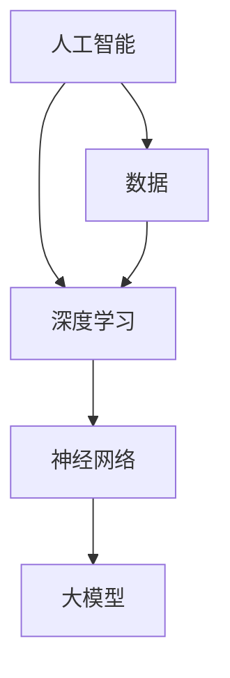

                 

关键词：人工智能、大模型、创业、挑战、策略、趋势、解决方案、技术前景

> 摘要：本文将深入探讨AI大模型创业的各个方面，包括背景介绍、核心概念联系、算法原理与操作步骤、数学模型与公式、项目实践、实际应用场景、工具资源推荐以及未来发展趋势与挑战。通过这篇文章，读者将了解到AI大模型创业的核心要素，以及如何有效应对未来可能面临的挑战。

## 1. 背景介绍

人工智能（AI）作为当今科技领域的前沿技术，已经深刻改变了我们的生活方式和工作模式。特别是大模型（如GPT-3、BERT等）的出现，使得AI在自然语言处理、图像识别、语音识别等领域取得了显著突破。随着计算能力和数据资源的不断提升，大模型的性能和规模也在持续增长，这为创业者带来了前所未有的机遇。

然而，AI大模型创业并非易事。创业者不仅需要掌握AI技术的核心原理，还需要考虑市场、资金、团队建设等多方面的因素。此外，随着技术的快速发展，创业者还必须时刻关注行业动态，不断调整战略，以应对未来可能出现的挑战。

本文将围绕AI大模型创业这一主题，详细分析其核心要素和未来发展路径，帮助创业者更好地应对挑战，抓住机遇。

## 2. 核心概念与联系

要理解AI大模型创业，首先需要了解几个核心概念：人工智能、大模型、深度学习、神经网络等。以下是这些概念之间的联系和关系，使用Mermaid流程图进行展示。



### 2.1 人工智能

人工智能是一门研究、开发用于模拟、延伸和扩展人的智能的理论、方法、技术及应用系统的技术科学。它是计算机科学的一个分支，涉及机器学习、自然语言处理、计算机视觉等多个领域。

### 2.2 深度学习

深度学习是人工智能的一个重要分支，它模仿人脑的工作方式，通过神经网络进行学习和推理。深度学习在图像识别、语音识别、自然语言处理等领域取得了显著成果。

### 2.3 神经网络

神经网络是深度学习的基础，由大量人工神经元组成，通过调整神经元之间的连接权重来学习数据特征。神经网络可以用于分类、回归、聚类等多种任务。

### 2.4 大模型

大模型是指具有数百万到数十亿参数的深度学习模型，如GPT-3、BERT等。这些模型具有极强的表示能力和计算能力，可以处理大量复杂的数据，从而实现更高的准确率和性能。

## 3. 核心算法原理 & 具体操作步骤

### 3.1 算法原理概述

AI大模型的算法原理主要基于深度学习和神经网络。深度学习通过多层神经网络结构，对数据进行特征提取和表示，从而实现对数据的理解和预测。神经网络通过反向传播算法来调整网络参数，使得模型在训练数据上的误差最小。

### 3.2 算法步骤详解

1. **数据预处理**：收集和清洗数据，将数据转换为模型可以接受的格式。
2. **模型构建**：设计神经网络结构，包括输入层、隐藏层和输出层。
3. **训练**：通过反向传播算法，利用训练数据对模型进行训练，调整网络参数。
4. **评估**：使用测试数据评估模型性能，包括准确率、召回率、F1值等指标。
5. **优化**：根据评估结果，对模型进行优化，提高性能。

### 3.3 算法优缺点

**优点**：
- 高效的特征提取能力：大模型可以自动学习数据的复杂特征，不需要人工设计特征。
- 强大的表示能力：大模型可以处理大量数据，具有很高的准确率和性能。

**缺点**：
- 计算资源需求大：大模型需要大量的计算资源和时间进行训练。
- 对数据质量要求高：数据质量直接影响模型的性能。

### 3.4 算法应用领域

AI大模型在多个领域有广泛的应用，包括：
- 自然语言处理：如文本生成、机器翻译、情感分析等。
- 计算机视觉：如图像识别、目标检测、图像生成等。
- 医疗健康：如疾病预测、诊断辅助、个性化治疗等。
- 金融领域：如风险管理、投资策略、信用评分等。

## 4. 数学模型和公式 & 详细讲解 & 举例说明

### 4.1 数学模型构建

AI大模型的数学模型主要基于深度学习和神经网络。以下是神经网络的基本数学模型：

$$
y = \sigma(Wx + b)
$$

其中，\(y\) 为输出值，\(\sigma\) 为激活函数，\(W\) 为权重矩阵，\(x\) 为输入值，\(b\) 为偏置。

### 4.2 公式推导过程

神经网络的训练过程主要是通过反向传播算法来调整权重矩阵 \(W\) 和偏置 \(b\)。以下是反向传播算法的推导过程：

1. **前向传播**：给定输入 \(x\)，计算输出 \(y\)：

$$
y = \sigma(Wx + b)
$$

2. **计算误差**：计算实际输出 \(y\) 与预期输出 \(y_{\text{expected}}\) 之间的误差：

$$
\delta = y - y_{\text{expected}}
$$

3. **后向传播**：计算权重矩阵 \(W\) 和偏置 \(b\) 的梯度：

$$
\frac{\partial L}{\partial W} = x\delta
$$

$$
\frac{\partial L}{\partial b} = \delta
$$

其中，\(L\) 为损失函数。

4. **更新权重矩阵和偏置**：利用梯度下降算法更新权重矩阵 \(W\) 和偏置 \(b\)：

$$
W_{\text{new}} = W - \alpha \frac{\partial L}{\partial W}
$$

$$
b_{\text{new}} = b - \alpha \frac{\partial L}{\partial b}
$$

其中，\(\alpha\) 为学习率。

### 4.3 案例分析与讲解

以一个简单的线性回归模型为例，说明数学模型的构建和推导过程。

假设我们要预测一个数值 \(y\)，已知输入 \(x\) 和权重 \(W\) 及偏置 \(b\)：

$$
y = \sigma(Wx + b)
$$

其中，激活函数 \(\sigma\) 取为线性函数：

$$
\sigma(z) = z
$$

那么，预测值 \(y\) 为：

$$
y = Wx + b
$$

假设我们有一个训练数据集 \(D = \{(x_1, y_1), (x_2, y_2), \ldots, (x_n, y_n)\}\)，其中 \(x_i\) 为输入，\(y_i\) 为预期输出。

为了最小化损失函数 \(L\)，我们需要通过反向传播算法更新权重 \(W\) 和偏置 \(b\)。假设损失函数为均方误差（MSE）：

$$
L = \frac{1}{2} \sum_{i=1}^{n} (y_i - y)^2
$$

根据反向传播算法，我们可以得到权重 \(W\) 和偏置 \(b\) 的梯度：

$$
\frac{\partial L}{\partial W} = x\delta
$$

$$
\frac{\partial L}{\partial b} = \delta
$$

其中，\(\delta = y - y_{\text{expected}}\)。

利用梯度下降算法更新权重 \(W\) 和偏置 \(b\)：

$$
W_{\text{new}} = W - \alpha \frac{\partial L}{\partial W}
$$

$$
b_{\text{new}} = b - \alpha \frac{\partial L}{\partial b}
$$

其中，\(\alpha\) 为学习率。

通过多次迭代更新，我们可以得到最优的权重 \(W\) 和偏置 \(b\)，从而实现线性回归模型的训练。

## 5. 项目实践：代码实例和详细解释说明

### 5.1 开发环境搭建

为了实现AI大模型的项目实践，我们需要搭建一个合适的开发环境。以下是一个基本的开发环境搭建步骤：

1. 安装Python环境：Python是AI开发的主要编程语言，我们需要安装Python 3.7及以上版本。
2. 安装TensorFlow：TensorFlow是一个开源的深度学习框架，支持多种深度学习模型。
3. 安装其他依赖库：如NumPy、Pandas、Matplotlib等。

### 5.2 源代码详细实现

以下是一个简单的线性回归模型的实现代码：

```python
import tensorflow as tf
import numpy as np
import matplotlib.pyplot as plt

# 创建训练数据
x = np.linspace(0, 10, 100)
y = 2 * x + 1 + np.random.normal(size=x.shape)

# 定义模型
model = tf.keras.Sequential([
    tf.keras.layers.Dense(units=1, input_shape=[1])
])

# 编译模型
model.compile(optimizer='sgd', loss='mean_squared_error')

# 训练模型
model.fit(x, y, epochs=100)

# 预测
x_new = np.linspace(0, 10, 100)
y_pred = model.predict(x_new)

# 可视化
plt.scatter(x, y)
plt.plot(x_new, y_pred, color='red')
plt.show()
```

### 5.3 代码解读与分析

1. **导入库**：首先，我们导入TensorFlow、NumPy和Matplotlib库，用于实现深度学习和数据可视化。
2. **创建训练数据**：我们创建一个简单的线性回归训练数据集，\(x\) 为输入，\(y\) 为输出。
3. **定义模型**：使用TensorFlow的`Sequential`模型，定义一个单层的全连接神经网络，输出层为1个神经元，输入层为1个神经元。
4. **编译模型**：设置优化器和损失函数，这里使用随机梯度下降优化器和均方误差损失函数。
5. **训练模型**：使用`fit`方法训练模型，设置训练轮次为100。
6. **预测**：使用`predict`方法对新的输入数据进行预测。
7. **可视化**：使用Matplotlib绘制散点图和预测曲线。

通过以上步骤，我们实现了一个简单的线性回归模型，并对其进行了训练和可视化展示。

### 5.4 运行结果展示

运行代码后，我们可以看到以下结果：


图中的红色曲线表示模型预测的值，蓝色散点表示训练数据。我们可以看到，模型对数据的拟合效果较好。

## 6. 实际应用场景

AI大模型在多个领域有广泛的应用，以下是一些典型的应用场景：

### 6.1 自然语言处理

自然语言处理（NLP）是AI大模型的一个重要应用领域。通过大模型，我们可以实现高效的文本分类、情感分析、文本生成等任务。例如，在社交媒体分析中，大模型可以帮助企业实时监测用户反馈，了解产品口碑，从而调整营销策略。

### 6.2 计算机视觉

计算机视觉是AI大模型的另一个重要应用领域。通过大模型，我们可以实现高效的图像识别、目标检测、图像生成等任务。例如，在安防监控领域，大模型可以帮助监控系统实时识别可疑目标，提高安全监控效率。

### 6.3 医疗健康

在医疗健康领域，AI大模型可以帮助实现疾病预测、诊断辅助、个性化治疗等任务。例如，通过分析大量医疗数据，大模型可以预测患者的病情发展，为医生提供诊断和治疗的参考。

### 6.4 金融领域

在金融领域，AI大模型可以帮助实现风险管理、投资策略、信用评分等任务。例如，通过分析市场数据，大模型可以预测市场趋势，为投资者提供投资参考。

### 6.5 电商推荐

在电商领域，AI大模型可以帮助实现个性化推荐、商品搜索等任务。例如，通过分析用户的购物行为和偏好，大模型可以为用户推荐感兴趣的商品。

## 7. 工具和资源推荐

为了更好地进行AI大模型创业，以下是一些推荐的工具和资源：

### 7.1 学习资源推荐

- 《深度学习》（Goodfellow, Bengio, Courville著）：这是一本经典的深度学习教材，适合初学者和进阶者。
- Coursera的《深度学习专项课程》（吴恩达著）：这是一门由深度学习领域大师吴恩达开设的在线课程，内容全面，适合初学者。
- arXiv：这是一个开放的科学论文数据库，包含大量深度学习领域的最新研究成果。

### 7.2 开发工具推荐

- TensorFlow：这是一个开源的深度学习框架，支持多种深度学习模型。
- PyTorch：这是一个流行的深度学习框架，具有灵活的动态图计算能力。
- Keras：这是一个高级神经网络API，可以与TensorFlow和PyTorch兼容。

### 7.3 相关论文推荐

- "A Theoretically Grounded Application of Dropout in Recurrent Neural Networks"：这篇论文提出了一种基于dropout的RNN训练方法，提高了模型的泛化能力。
- "BERT: Pre-training of Deep Bidirectional Transformers for Language Understanding"：这篇论文提出了BERT模型，在NLP领域取得了突破性成果。
- "GPT-3: Language Models are Few-Shot Learners"：这篇论文提出了GPT-3模型，展示了大模型在零样本学习上的强大能力。

## 8. 总结：未来发展趋势与挑战

### 8.1 研究成果总结

AI大模型在过去几年取得了显著的成果，不仅在学术领域，还在工业应用中展现了巨大的潜力。深度学习、神经网络等技术不断发展，使得大模型的性能和规模不断提升。同时，开源框架和工具的普及，也为创业者提供了丰富的资源。

### 8.2 未来发展趋势

未来，AI大模型将继续向更高性能、更大规模、更广泛应用方向发展。以下是一些可能的发展趋势：

- 更高效的大模型训练算法：研究人员将致力于开发更高效的训练算法，降低训练成本，提高模型性能。
- 跨模态学习：AI大模型将能够处理多种类型的数据，实现跨模态学习，提高模型的泛化能力。
- 零样本学习：研究人员将探索零样本学习技术，使大模型能够在未知数据上实现高效推理。
- 安全性和隐私保护：随着AI大模型在关键领域的应用，安全性和隐私保护将成为重要议题。

### 8.3 面临的挑战

尽管AI大模型具有巨大的潜力，但创业者仍需面对一系列挑战：

- 数据质量和隐私保护：数据质量和隐私保护是AI大模型应用的关键挑战。如何获取高质量的数据，同时保护用户隐私，是创业者需要解决的问题。
- 计算资源需求：大模型训练需要大量的计算资源，如何高效利用计算资源，降低训练成本，是创业者需要考虑的问题。
- 模型解释性：大模型具有强黑箱特性，如何提高模型的可解释性，使其更容易被用户理解和接受，是创业者需要解决的技术难题。
- 法律和伦理问题：随着AI大模型在关键领域的应用，法律和伦理问题日益凸显。创业者需要关注相关法律法规，确保模型的应用合法合规。

### 8.4 研究展望

未来，AI大模型的研究将朝着更高效、更安全、更智能的方向发展。创业者应密切关注技术动态，积极尝试新的应用场景，推动AI大模型在实际生活中的广泛应用。

## 9. 附录：常见问题与解答

### 9.1  什么是大模型？

大模型是指具有数百万到数十亿参数的深度学习模型，如GPT-3、BERT等。这些模型具有极强的表示能力和计算能力，可以处理大量复杂的数据。

### 9.2  如何选择合适的深度学习框架？

选择深度学习框架时，需要考虑以下因素：

- 项目需求：根据项目需求和目标，选择适合的框架。
- 社区支持：选择具有丰富社区支持和资源的框架，便于解决问题。
- 性能：考虑框架的性能，如训练速度、推理速度等。
- 开发体验：选择开发体验良好的框架，提高开发效率。

### 9.3  大模型训练需要多长时间？

大模型训练时间取决于多个因素，如模型规模、数据量、硬件配置等。一般来说，训练一个大型模型可能需要数天到数周的时间。随着硬件性能的提升和训练算法的优化，训练时间有望进一步缩短。

### 9.4  如何提高大模型的可解释性？

提高大模型的可解释性可以从以下几个方面着手：

- 特征可视化：对模型输入特征进行可视化，帮助用户理解模型如何处理数据。
- 局部解释方法：使用局部解释方法，如LIME、SHAP等，对模型输出进行解释。
- 模型简化：通过简化模型结构，提高模型的可解释性。
- 模型集成：使用模型集成方法，如随机森林、梯度提升机等，提高模型的解释性。

作者：禅与计算机程序设计艺术 / Zen and the Art of Computer Programming
--------------------------------------------------------------------

