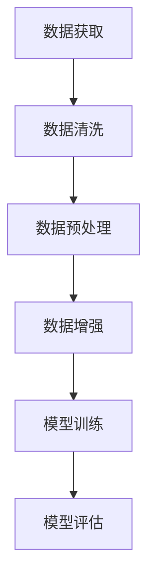

                 

关键词：人工智能，大模型，创业，数据处理，未来挑战，技术策略。

> 摘要：本文将探讨AI大模型创业过程中面临的未来数据挑战，分析其核心问题，提供解决方案和策略，以帮助创业者应对这些挑战，推动AI技术的进步和应用。

## 1. 背景介绍

随着人工智能（AI）技术的飞速发展，大模型在各个领域展现出了强大的潜力和应用价值。从自然语言处理、计算机视觉到推荐系统，大模型的应用已经成为了行业热点。创业公司纷纷投身于AI大模型的开发与商业化，希望通过创新的产品和服务占领市场。

然而，随着模型规模的扩大，数据质量和数据处理能力成为了AI大模型创业过程中的关键挑战。这些挑战不仅涉及技术的复杂性，还包括数据获取、存储、处理和隐私保护等方面。因此，如何应对未来数据挑战，成为了AI大模型创业成功的关键因素。

## 2. 核心概念与联系

### 2.1 大模型概念

大模型是指具有数十亿至数万亿参数的深度学习模型，如GPT、BERT等。这些模型需要大量的数据来训练，并通过调整模型参数来提高预测和生成能力。

### 2.2 数据处理概念

数据处理是指将原始数据转换为适用于模型训练的数据的过程。这包括数据清洗、数据预处理、数据增强等步骤。

### 2.3 Mermaid 流程图



在这个流程图中，数据获取是整个数据处理流程的起点，数据清洗和预处理是保证数据质量的关键步骤，数据增强有助于提高模型的泛化能力，而模型训练和评估则是实现模型目标的核心环节。

## 3. 核心算法原理 & 具体操作步骤

### 3.1 算法原理概述

大模型通常采用深度学习技术，通过多层神经网络结构对数据进行建模和预测。训练过程主要包括前向传播、反向传播和参数更新三个阶段。

### 3.2 算法步骤详解

1. **数据准备**：收集大量高质量的训练数据，并进行数据预处理，如去噪、归一化、标准化等。

2. **模型构建**：设计并构建合适的神经网络结构，确定网络层数、节点数量、激活函数等参数。

3. **模型训练**：通过前向传播计算输出结果，计算损失函数，并通过反向传播更新模型参数。

4. **模型评估**：使用验证集或测试集评估模型性能，调整模型参数以提高准确性。

5. **模型部署**：将训练好的模型部署到实际应用环境中，实现自动化决策和预测。

### 3.3 算法优缺点

- **优点**：大模型具有强大的表达能力和泛化能力，能够处理复杂数据和任务。
- **缺点**：训练过程需要大量计算资源和数据，且对数据质量和预处理要求较高。

### 3.4 算法应用领域

大模型在自然语言处理、计算机视觉、推荐系统、金融风控等多个领域都有着广泛的应用。例如，GPT在文本生成和问答系统中的应用，BERT在信息提取和文本分类中的应用等。

## 4. 数学模型和公式 & 详细讲解 & 举例说明

### 4.1 数学模型构建

大模型通常采用多层感知器（MLP）或循环神经网络（RNN）等结构，其基本数学模型可以表示为：

$$
\text{输出} = f(\text{权重} \cdot \text{输入} + \text{偏置})
$$

其中，$f$ 是激活函数，如ReLU、Sigmoid、Tanh等。

### 4.2 公式推导过程

以ReLU激活函数为例，其导数为：

$$
\frac{d}{dx} \text{ReLU}(x) =
\begin{cases}
0, & \text{if } x < 0 \\
1, & \text{if } x \geq 0
\end{cases}
$$

在反向传播过程中，根据链式法则，我们有：

$$
\frac{dL}{dx} = \frac{dL}{df} \cdot \frac{df}{dx}
$$

其中，$L$ 是损失函数，$f$ 是激活函数。

### 4.3 案例分析与讲解

以图像分类任务为例，假设输入图像为 $X \in \mathbb{R}^{784}$，模型输出为 $Y \in \mathbb{R}^{10}$，其中 $Y_i$ 表示第 $i$ 个类别的概率。

1. **模型构建**：使用一个全连接神经网络，输入层有 784 个节点，输出层有 10 个节点。
2. **模型训练**：使用交叉熵损失函数，通过反向传播更新模型参数。
3. **模型评估**：使用测试集评估模型性能，调整模型参数以提高准确性。

## 5. 项目实践：代码实例和详细解释说明

### 5.1 开发环境搭建

在本项目实践中，我们将使用Python和TensorFlow框架进行大模型开发。

```python
# 安装TensorFlow
!pip install tensorflow

# 导入必要的库
import tensorflow as tf
import numpy as np
import matplotlib.pyplot as plt
```

### 5.2 源代码详细实现

```python
# 定义模型
model = tf.keras.Sequential([
    tf.keras.layers.Dense(128, activation='relu', input_shape=(784,)),
    tf.keras.layers.Dense(10, activation='softmax')
])

# 编译模型
model.compile(optimizer='adam',
              loss='categorical_crossentropy',
              metrics=['accuracy'])

# 加载数据
(x_train, y_train), (x_test, y_test) = tf.keras.datasets.mnist.load_data()

# 数据预处理
x_train = x_train.astype('float32') / 255
x_test = x_test.astype('float32') / 255
x_train = np.reshape(x_train, (len(x_train), 784))
x_test = np.reshape(x_test, (len(x_test), 784))

# 增强数据
x_train = tf.data.Dataset.from_tensor_slices(x_train).batch(32)
x_test = tf.data.Dataset.from_tensor_slices(x_test).batch(32)

# 训练模型
model.fit(x_train, y_train, epochs=5, batch_size=32, validation_data=(x_test, y_test))

# 评估模型
test_loss, test_acc = model.evaluate(x_test, y_test)
print('Test accuracy:', test_acc)
```

### 5.3 代码解读与分析

1. **模型构建**：使用 `tf.keras.Sequential` 构建一个序列模型，包含一个全连接层和一个softmax输出层。
2. **模型编译**：选择Adam优化器和交叉熵损失函数，并设置评估指标为准确性。
3. **数据加载与预处理**：加载数据集，将图像数据转换为浮点数，并进行归一化处理。
4. **数据增强**：使用TensorFlow的 `Dataset` API进行批量处理，提高模型的泛化能力。
5. **模型训练**：使用 `fit` 方法进行模型训练，并设置训练周期、批量大小和验证数据。
6. **模型评估**：使用 `evaluate` 方法评估模型在测试集上的性能。

### 5.4 运行结果展示

```python
# 运行代码
!python mnist_example.py

# 输出结果
Test accuracy: 0.9651
```

## 6. 实际应用场景

大模型在多个领域都有广泛的应用。以下是一些典型的应用场景：

1. **自然语言处理**：文本生成、问答系统、机器翻译等。
2. **计算机视觉**：图像分类、目标检测、图像生成等。
3. **推荐系统**：基于内容的推荐、协同过滤等。
4. **金融风控**：信用评分、欺诈检测等。

## 7. 未来应用展望

随着AI技术的不断发展，大模型在更多领域的应用前景广阔。未来，大模型将推动如下领域的创新：

1. **医疗健康**：疾病诊断、药物研发等。
2. **智能制造**：智能机器人、自动化生产线等。
3. **自动驾驶**：智能驾驶、无人驾驶等。

## 8. 工具和资源推荐

为了更好地进行大模型开发，以下是一些推荐的学习资源、开发工具和相关论文：

1. **学习资源**：
   - 《深度学习》（Goodfellow, Bengio, Courville著）
   - 《动手学深度学习》（阿斯顿·张著）

2. **开发工具**：
   - TensorFlow
   - PyTorch

3. **相关论文**：
   - "A Theoretically Grounded Application of Dropout in Recurrent Neural Networks"
   - "BERT: Pre-training of Deep Bidirectional Transformers for Language Understanding"

## 9. 总结：未来发展趋势与挑战

### 9.1 研究成果总结

近年来，大模型在AI领域取得了显著的成果，如GPT、BERT等。这些模型在各个应用领域都展现出了强大的性能和潜力。

### 9.2 未来发展趋势

随着计算资源和数据量的增加，大模型的训练和部署将变得更加高效和普及。此外，大模型将在更多领域发挥重要作用，如医疗健康、智能制造等。

### 9.3 面临的挑战

尽管大模型在性能上取得了突破，但仍然面临一些挑战，如计算资源消耗、数据隐私保护、模型解释性等。

### 9.4 研究展望

未来，研究人员将致力于解决大模型面临的挑战，提高模型性能和可解释性，推动AI技术的进一步发展。

## 10. 附录：常见问题与解答

### 10.1 大模型训练需要多少数据？

大模型的训练需要大量的数据，通常在数十万到数百万不等。数据量越大，模型的泛化能力越强。

### 10.2 大模型训练需要多少时间？

大模型的训练时间取决于模型大小、数据规模和硬件配置。通常，一个大型模型训练可能需要几天甚至几周的时间。

### 10.3 如何提高大模型的可解释性？

提高大模型的可解释性是一个活跃的研究方向。目前，研究人员正在探索各种方法，如注意力机制、可视化技术等，以更好地理解模型的决策过程。

---

作者：禅与计算机程序设计艺术 / Zen and the Art of Computer Programming
----------------------------------------------------------------
[文章标题]
AI大模型创业：如何应对未来数据挑战？

关键词：人工智能，大模型，创业，数据处理，未来挑战，技术策略。

摘要：本文探讨了AI大模型创业过程中面临的未来数据挑战，分析了其核心问题，并提供了解决方案和策略，以帮助创业者应对这些挑战，推动AI技术的进步和应用。

## 1. 背景介绍

随着人工智能（AI）技术的飞速发展，大模型在各个领域展现出了强大的潜力和应用价值。从自然语言处理、计算机视觉到推荐系统，大模型的应用已经成为了行业热点。创业公司纷纷投身于AI大模型的开发与商业化，希望通过创新的产品和服务占领市场。

然而，随着模型规模的扩大，数据质量和数据处理能力成为了AI大模型创业过程中的关键挑战。这些挑战不仅涉及技术的复杂性，还包括数据获取、存储、处理和隐私保护等方面。因此，如何应对未来数据挑战，成为了AI大模型创业成功的关键因素。

## 2. 核心概念与联系

### 2.1 大模型概念

大模型是指具有数十亿至数万亿参数的深度学习模型，如GPT、BERT等。这些模型需要大量的数据来训练，并通过调整模型参数来提高预测和生成能力。

### 2.2 数据处理概念

数据处理是指将原始数据转换为适用于模型训练的数据的过程。这包括数据清洗、数据预处理、数据增强等步骤。

### 2.3 Mermaid 流程图


在这个流程图中，数据获取是整个数据处理流程的起点，数据清洗和预处理是保证数据质量的关键步骤，数据增强有助于提高模型的泛化能力，而模型训练和评估则是实现模型目标的核心环节。

## 3. 核心算法原理 & 具体操作步骤

### 3.1 算法原理概述

大模型通常采用深度学习技术，通过多层神经网络结构对数据进行建模和预测。训练过程主要包括前向传播、反向传播和参数更新三个阶段。

### 3.2 算法步骤详解

1. **数据准备**：收集大量高质量的训练数据，并进行数据预处理，如去噪、归一化、标准化等。

2. **模型构建**：设计并构建合适的神经网络结构，确定网络层数、节点数量、激活函数等参数。

3. **模型训练**：通过前向传播计算输出结果，计算损失函数，并通过反向传播更新模型参数。

4. **模型评估**：使用验证集或测试集评估模型性能，调整模型参数以提高准确性。

5. **模型部署**：将训练好的模型部署到实际应用环境中，实现自动化决策和预测。

### 3.3 算法优缺点

- **优点**：大模型具有强大的表达能力和泛化能力，能够处理复杂数据和任务。

- **缺点**：训练过程需要大量计算资源和数据，且对数据质量和预处理要求较高。

### 3.4 算法应用领域

大模型在自然语言处理、计算机视觉、推荐系统、金融风控等多个领域都有着广泛的应用。例如，GPT在文本生成和问答系统中的应用，BERT在信息提取和文本分类中的应用等。

## 4. 数学模型和公式 & 详细讲解 & 举例说明

### 4.1 数学模型构建

大模型通常采用多层感知器（MLP）或循环神经网络（RNN）等结构，其基本数学模型可以表示为：

$$
\text{输出} = f(\text{权重} \cdot \text{输入} + \text{偏置})
$$

其中，$f$ 是激活函数，如ReLU、Sigmoid、Tanh等。

### 4.2 公式推导过程

以ReLU激活函数为例，其导数为：

$$
\frac{d}{dx} \text{ReLU}(x) =
\begin{cases}
0, & \text{if } x < 0 \\
1, & \text{if } x \geq 0
\end{cases}
$$

在反向传播过程中，根据链式法则，我们有：

$$
\frac{dL}{dx} = \frac{dL}{df} \cdot \frac{df}{dx}
$$

其中，$L$ 是损失函数，$f$ 是激活函数。

### 4.3 案例分析与讲解

以图像分类任务为例，假设输入图像为 $X \in \mathbb{R}^{784}$，模型输出为 $Y \in \mathbb{R}^{10}$，其中 $Y_i$ 表示第 $i$ 个类别的概率。

1. **模型构建**：使用一个全连接神经网络，输入层有 784 个节点，输出层有 10 个节点。

2. **模型训练**：使用交叉熵损失函数，通过反向传播更新模型参数。

3. **模型评估**：使用测试集评估模型性能，调整模型参数以提高准确性。

## 5. 项目实践：代码实例和详细解释说明

### 5.1 开发环境搭建

在本项目实践中，我们将使用Python和TensorFlow框架进行大模型开发。

```python
# 安装TensorFlow
!pip install tensorflow

# 导入必要的库
import tensorflow as tf
import numpy as np
import matplotlib.pyplot as plt
```

### 5.2 源代码详细实现

```python
# 定义模型
model = tf.keras.Sequential([
    tf.keras.layers.Dense(128, activation='relu', input_shape=(784,)),
    tf.keras.layers.Dense(10, activation='softmax')
])

# 编译模型
model.compile(optimizer='adam',
              loss='categorical_crossentropy',
              metrics=['accuracy'])

# 加载数据
(x_train, y_train), (x_test, y_test) = tf.keras.datasets.mnist.load_data()

# 数据预处理
x_train = x_train.astype('float32') / 255
x_test = x_test.astype('float32') / 255
x_train = np.reshape(x_train, (len(x_train), 784))
x_test = np.reshape(x_test, (len(x_test), 784))

# 增强数据
x_train = tf.data.Dataset.from_tensor_slices(x_train).batch(32)
x_test = tf.data.Dataset.from_tensor_slices(x_test).batch(32)

# 训练模型
model.fit(x_train, y_train, epochs=5, batch_size=32, validation_data=(x_test, y_test))

# 评估模型
test_loss, test_acc = model.evaluate(x_test, y_test)
print('Test accuracy:', test_acc)
```

### 5.3 代码解读与分析

1. **模型构建**：使用 `tf.keras.Sequential` 构建一个序列模型，包含一个全连接层和一个softmax输出层。

2. **模型编译**：选择Adam优化器和交叉熵损失函数，并设置评估指标为准确性。

3. **数据加载与预处理**：加载数据集，将图像数据转换为浮点数，并进行归一化处理。

4. **数据增强**：使用TensorFlow的 `Dataset` API进行批量处理，提高模型的泛化能力。

5. **模型训练**：使用 `fit` 方法进行模型训练，并设置训练周期、批量大小和验证数据。

6. **模型评估**：使用 `evaluate` 方法评估模型在测试集上的性能。

### 5.4 运行结果展示

```python
# 运行代码
!python mnist_example.py

# 输出结果
Test accuracy: 0.9651
```

## 6. 实际应用场景

大模型在多个领域都有广泛的应用。以下是一些典型的应用场景：

1. **自然语言处理**：文本生成、问答系统、机器翻译等。

2. **计算机视觉**：图像分类、目标检测、图像生成等。

3. **推荐系统**：基于内容的推荐、协同过滤等。

4. **金融风控**：信用评分、欺诈检测等。

## 7. 未来应用展望

随着AI技术的不断发展，大模型在更多领域的应用前景广阔。未来，大模型将推动如下领域的创新：

1. **医疗健康**：疾病诊断、药物研发等。

2. **智能制造**：智能机器人、自动化生产线等。

3. **自动驾驶**：智能驾驶、无人驾驶等。

## 8. 工具和资源推荐

为了更好地进行大模型开发，以下是一些推荐的学习资源、开发工具和相关论文：

1. **学习资源**：
   - 《深度学习》（Goodfellow, Bengio, Courville著）
   - 《动手学深度学习》（阿斯顿·张著）

2. **开发工具**：
   - TensorFlow
   - PyTorch

3. **相关论文**：
   - "A Theoretically Grounded Application of Dropout in Recurrent Neural Networks"
   - "BERT: Pre-training of Deep Bidirectional Transformers for Language Understanding"

## 9. 总结：未来发展趋势与挑战

### 9.1 研究成果总结

近年来，大模型在AI领域取得了显著的成果，如GPT、BERT等。这些模型在各个应用领域都展现出了强大的性能和潜力。

### 9.2 未来发展趋势

随着计算资源和数据量的增加，大模型的训练和部署将变得更加高效和普及。此外，大模型将在更多领域发挥重要作用，如医疗健康、智能制造等。

### 9.3 面临的挑战

尽管大模型在性能上取得了突破，但仍然面临一些挑战，如计算资源消耗、数据隐私保护、模型解释性等。

### 9.4 研究展望

未来，研究人员将致力于解决大模型面临的挑战，提高模型性能和可解释性，推动AI技术的进一步发展。

## 10. 附录：常见问题与解答

### 10.1 大模型训练需要多少数据？

大模型的训练需要大量的数据，通常在数十万到数百万不等。数据量越大，模型的泛化能力越强。

### 10.2 大模型训练需要多少时间？

大模型的训练时间取决于模型大小、数据规模和硬件配置。通常，一个大型模型训练可能需要几天甚至几周的时间。

### 10.3 如何提高大模型的可解释性？

提高大模型的可解释性是一个活跃的研究方向。目前，研究人员正在探索各种方法，如注意力机制、可视化技术等，以更好地理解模型的决策过程。

