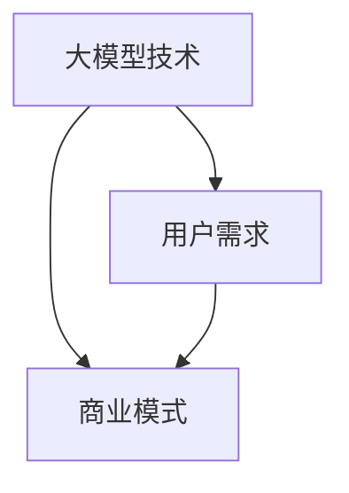

                 

关键词：AI大模型，创业，用户需求，技术策略，商业模式

> 摘要：本文将探讨在AI大模型领域创业时，如何针对未来用户需求进行战略布局，包括技术选型、商业模式设计、用户体验优化等方面的深入分析，旨在为创业者提供切实可行的指导意见。

## 1. 背景介绍

人工智能（AI）近年来取得了飞速发展，特别是大模型技术的突破，使得AI在图像识别、自然语言处理、推荐系统等领域表现出色。然而，随着技术的进步，用户对AI的应用需求也在不断升级，这给AI大模型创业者带来了前所未有的机遇和挑战。

在这个背景下，AI大模型创业不仅需要拥有顶尖的技术能力，还需要深刻理解用户需求，并能够灵活调整商业模式和策略，以适应快速变化的市场环境。本文将从多个维度探讨如何应对未来用户需求，为AI大模型创业提供一些实用的指导。

## 2. 核心概念与联系

为了更好地理解AI大模型创业，我们首先需要了解一些核心概念：

### 2.1 大模型技术

大模型技术指的是通过训练拥有数亿甚至数十亿参数的深度学习模型，以实现高度复杂的任务。如GPT-3、BERT等模型。

### 2.2 用户需求

用户需求是AI大模型应用成功的关键。这些需求可能包括对特定领域的专业能力、个性化的用户体验、高效的决策支持等。

### 2.3 商业模式

商业模式是AI大模型创业成功的重要保障。合理的商业模式可以帮助企业获得持续的收入和利润，同时满足用户需求。

下面是一个简单的Mermaid流程图，展示了这三个核心概念之间的关系：



## 3. 核心算法原理 & 具体操作步骤

### 3.1 算法原理概述

AI大模型的核心在于深度学习。深度学习是通过多层次的神经网络来模拟人类大脑的决策过程，从而实现复杂的任务。具体到大模型，其原理可以概括为：

1. **数据处理**：收集大量数据，并进行预处理，如去噪、标准化等。
2. **模型训练**：使用预处理后的数据训练神经网络，不断调整模型参数，使得模型能够更好地拟合数据。
3. **模型优化**：通过技术手段如迁移学习、增强学习等，进一步优化模型性能。

### 3.2 算法步骤详解

1. **数据收集**：选择合适的数据集，如文本、图像、音频等。
2. **数据处理**：对数据进行清洗、转换等预处理操作。
3. **模型架构设计**：选择适合的神经网络架构，如CNN、RNN、Transformer等。
4. **模型训练**：使用预处理后的数据训练模型，通过反向传播算法调整模型参数。
5. **模型评估**：使用验证集评估模型性能，并进行调优。
6. **模型部署**：将训练好的模型部署到生产环境，供用户使用。

### 3.3 算法优缺点

**优点**：

- **高精度**：大模型可以处理高度复杂的数据，实现非常精准的任务。
- **泛化能力强**：通过迁移学习等技术，大模型可以应用到不同的领域。

**缺点**：

- **训练成本高**：大模型需要大量的计算资源和时间进行训练。
- **解释性差**：深度学习模型通常缺乏透明性和解释性。

### 3.4 算法应用领域

- **自然语言处理**：如文本生成、机器翻译、情感分析等。
- **计算机视觉**：如图像识别、目标检测、图像生成等。
- **推荐系统**：如商品推荐、内容推荐等。

## 4. 数学模型和公式 & 详细讲解 & 举例说明

### 4.1 数学模型构建

深度学习中的数学模型主要包括神经网络和优化算法。以下是神经网络和优化算法的一些基本公式：

#### 神经网络

1. **前向传播**：

   $$ z_{l} = W_{l} \cdot a_{l-1} + b_{l} $$

   $$ a_{l} = \sigma(z_{l}) $$

   其中，$W_{l}$ 和 $b_{l}$ 分别是权重和偏置，$\sigma$ 是激活函数。

2. **反向传播**：

   $$ \delta_{l} = \frac{\partial L}{\partial z_{l}} \cdot \sigma'(z_{l}) $$

   $$ \frac{\partial L}{\partial W_{l}} = a_{l-1} \cdot \delta_{l} $$

   $$ \frac{\partial L}{\partial b_{l}} = \delta_{l} $$

   其中，$L$ 是损失函数，$\delta_{l}$ 是误差。

#### 优化算法

1. **梯度下降**：

   $$ W_{l} = W_{l} - \alpha \cdot \frac{\partial L}{\partial W_{l}} $$

   $$ b_{l} = b_{l} - \alpha \cdot \frac{\partial L}{\partial b_{l}} $$

   其中，$\alpha$ 是学习率。

2. **动量**：

   $$ v_{l} = \beta \cdot v_{l-1} + (1 - \beta) \cdot \frac{\partial L}{\partial W_{l}} $$

   $$ W_{l} = W_{l} - \alpha \cdot v_{l} $$

   其中，$\beta$ 是动量因子。

### 4.2 公式推导过程

以梯度下降为例，推导过程如下：

1. **损失函数**：

   $$ L = \frac{1}{2} \sum_{i=1}^{n} (\hat{y}_{i} - y_{i})^2 $$

2. **前向传播**：

   $$ z_{l} = W_{l} \cdot a_{l-1} + b_{l} $$

   $$ a_{l} = \sigma(z_{l}) $$

3. **反向传播**：

   $$ \delta_{l} = \frac{\partial L}{\partial z_{l}} \cdot \sigma'(z_{l}) $$

4. **梯度计算**：

   $$ \frac{\partial L}{\partial W_{l}} = a_{l-1} \cdot \delta_{l} $$

   $$ \frac{\partial L}{\partial b_{l}} = \delta_{l} $$

5. **更新权重和偏置**：

   $$ W_{l} = W_{l} - \alpha \cdot \frac{\partial L}{\partial W_{l}} $$

   $$ b_{l} = b_{l} - \alpha \cdot \frac{\partial L}{\partial b_{l}} $$

### 4.3 案例分析与讲解

假设我们有一个简单的神经网络，用于对数字进行分类，输入是0或1，输出是0或1。使用交叉熵损失函数进行训练。

1. **数据集**：

   - 输入：$\{0, 1\}$
   - 标签：$\{0, 1\}$

2. **模型结构**：

   - 输入层：1个神经元
   - 隐藏层：2个神经元
   - 输出层：1个神经元

3. **训练过程**：

   - 初始化权重和偏置
   - 前向传播计算输出
   - 计算损失函数
   - 反向传播计算梯度
   - 更新权重和偏置

4. **结果**：

   - 经过多次迭代训练，模型的准确率逐渐提高

通过这个案例，我们可以看到数学模型在AI大模型中的关键作用，以及如何通过优化算法提高模型性能。

## 5. 项目实践：代码实例和详细解释说明

### 5.1 开发环境搭建

为了实现AI大模型，我们需要搭建一个开发环境。以下是搭建过程：

1. 安装Python和PyTorch框架
2. 配置GPU环境，以便使用CUDA加速训练过程
3. 安装其他依赖库，如NumPy、Matplotlib等

### 5.2 源代码详细实现

以下是使用PyTorch实现一个简单神经网络进行数字分类的代码示例：

```python
import torch
import torch.nn as nn
import torch.optim as optim

# 定义模型
class SimpleModel(nn.Module):
    def __init__(self):
        super(SimpleModel, self).__init__()
        self.fc1 = nn.Linear(1, 2)
        self.fc2 = nn.Linear(2, 1)
    
    def forward(self, x):
        x = torch.relu(self.fc1(x))
        x = self.fc2(x)
        return x

# 初始化模型、损失函数和优化器
model = SimpleModel()
criterion = nn.BCELoss()
optimizer = optim.SGD(model.parameters(), lr=0.01)

# 数据集
x_train = torch.tensor([[0], [1]])
y_train = torch.tensor([[0], [1]])

# 训练过程
for epoch in range(1000):
    model.zero_grad()
    output = model(x_train)
    loss = criterion(output, y_train)
    loss.backward()
    optimizer.step()

    if (epoch + 1) % 100 == 0:
        print(f'Epoch [{epoch + 1}/{1000}], Loss: {loss.item():.4f}')

# 测试模型
x_test = torch.tensor([[0.5]])
y_test = torch.tensor([[0]])
output = model(x_test)
print(f'Predicted Output: {output.item():.4f}')
```

### 5.3 代码解读与分析

1. **模型定义**：定义了一个简单的两层神经网络，使用ReLU激活函数。
2. **损失函数**：使用BCELoss（二元交叉熵损失函数），适合二分类任务。
3. **优化器**：使用SGD（随机梯度下降）优化器，进行模型参数更新。
4. **数据集**：使用简单的二元输入和标签进行训练。
5. **训练过程**：使用前向传播、反向传播和优化器更新参数。
6. **测试模型**：对测试数据进行预测，并输出结果。

通过这个实例，我们可以看到如何使用PyTorch实现一个简单的AI大模型，并了解其关键组件和流程。

## 6. 实际应用场景

AI大模型在多个领域有着广泛的应用，以下是几个典型的实际应用场景：

### 6.1 自然语言处理

- 文本生成：使用GPT-3等大模型生成文章、故事等。
- 机器翻译：使用BERT等模型实现高效、精准的机器翻译。
- 情感分析：对社交媒体上的评论进行情感分类，帮助企业了解用户反馈。

### 6.2 计算机视觉

- 图像识别：使用ResNet、Inception等大模型识别图像中的物体。
- 目标检测：使用Faster R-CNN、YOLO等模型实现目标检测。
- 图像生成：使用GAN（生成对抗网络）生成高质量的图像。

### 6.3 推荐系统

- 商品推荐：使用协同过滤、矩阵分解等大模型推荐用户感兴趣的商品。
- 内容推荐：使用深度学习模型推荐用户感兴趣的文章、视频等。

### 6.4 未来应用展望

随着AI大模型技术的不断发展，未来其在医疗、金融、教育等领域的应用将更加广泛。例如，在医疗领域，大模型可以帮助医生进行疾病诊断、药物研发；在金融领域，大模型可以用于风险控制、投资策略等。

## 7. 工具和资源推荐

为了更好地进行AI大模型开发，以下是几个推荐的工具和资源：

### 7.1 学习资源推荐

- 《深度学习》（Goodfellow et al.）：深度学习的经典教材，适合初学者和进阶者。
- 《Python深度学习》（François Chollet）：通过实例介绍如何使用Python和TensorFlow进行深度学习。

### 7.2 开发工具推荐

- PyTorch：一个易于使用且功能强大的深度学习框架。
- TensorFlow：由Google开发的开源深度学习框架，支持多种操作系统和硬件平台。

### 7.3 相关论文推荐

- “Attention Is All You Need”（Vaswani et al.，2017）：提出了Transformer模型，是当前自然语言处理领域的核心模型。
- “Generative Adversarial Nets”（Goodfellow et al.，2014）：提出了GAN（生成对抗网络），是当前计算机视觉领域的重要模型。

## 8. 总结：未来发展趋势与挑战

### 8.1 研究成果总结

AI大模型技术在自然语言处理、计算机视觉、推荐系统等领域取得了显著成果，为各行业带来了巨大变革。随着计算能力和数据量的提升，AI大模型将继续发挥重要作用。

### 8.2 未来发展趋势

- **更高效的算法**：优化算法效率，降低训练成本。
- **更智能的应用**：AI大模型将在更多领域实现智能化，如医疗、金融等。
- **更广泛的合作**：AI大模型创业将与其他行业深度融合，推动跨行业创新。

### 8.3 面临的挑战

- **数据隐私**：如何保护用户数据隐私，是AI大模型面临的重大挑战。
- **算法透明性**：提高算法透明性，增强用户信任。
- **计算资源**：随着模型规模增大，计算资源的需求也将不断增加。

### 8.4 研究展望

未来，AI大模型将朝着更高效、更智能、更安全、更透明的发展方向迈进。创业者需要紧跟技术发展趋势，积极应对挑战，不断创新，以满足未来用户需求。

## 9. 附录：常见问题与解答

### 9.1 什么是大模型？

大模型指的是具有数十亿甚至数万亿参数的深度学习模型，如GPT-3、BERT等。

### 9.2 如何选择合适的模型架构？

选择模型架构时，需要考虑任务类型（如分类、生成）、数据规模、计算资源等因素。常见架构包括CNN、RNN、Transformer等。

### 9.3 大模型训练需要多长时间？

大模型训练时间取决于模型规模、数据量、硬件配置等因素。通常，训练一个大型模型需要数天甚至数周的时间。

### 9.4 如何优化大模型性能？

优化大模型性能可以从以下几个方面进行：

- **数据预处理**：提高数据质量，减少噪声。
- **模型架构**：选择合适的神经网络架构。
- **训练策略**：如学习率调整、批量大小等。
- **硬件加速**：使用GPU、TPU等硬件加速训练过程。

### 9.5 大模型在商业应用中如何盈利？

大模型在商业应用中的盈利途径包括：

- **产品销售**：提供基于大模型的软件或服务。
- **定制开发**：为客户提供定制化的AI解决方案。
- **数据服务**：提供高质量的数据集或数据增强服务。
- **广告收入**：通过广告支持AI模型的应用。

---

**作者：禅与计算机程序设计艺术 / Zen and the Art of Computer Programming** 

本文作者对AI大模型创业的深入探讨，旨在为创业者提供具有实际操作性的指导，帮助他们更好地应对未来用户需求，实现商业成功。希望通过这篇文章，能够激发更多创业者投身于AI大模型领域，推动人工智能技术的持续进步。

