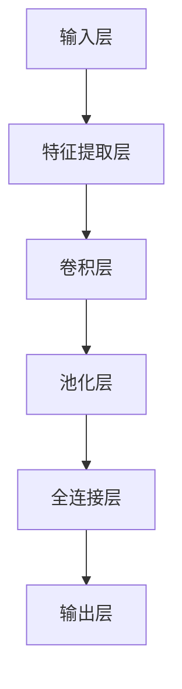

                 

关键词：AI大模型、创业、竞争对手、应对策略、技术前瞻、市场分析、战略规划

## 摘要

随着人工智能技术的迅猛发展，大模型逐渐成为企业创新的核心驱动力。本文旨在探讨AI大模型创业公司在面对未来竞争对手时，如何制定有效的应对策略。通过对市场趋势、核心技术、数学模型、项目实践和未来展望的深入分析，本文提出了一系列具有前瞻性的策略和建议，以帮助AI大模型创业公司巩固市场地位，迎接未来的挑战。

## 1. 背景介绍

近年来，人工智能（AI）技术取得了前所未有的突破，特别是在深度学习领域。大模型，如GPT-3、BERT、LLaMA等，凭借其强大的学习和推理能力，已经在自然语言处理、计算机视觉、语音识别等多个领域展现出了卓越的应用潜力。这些大模型的研发和部署，不仅推动了人工智能技术的发展，也为企业创新提供了新的机遇和挑战。

AI大模型创业公司面临着激烈的市场竞争。一方面，巨头企业如Google、Microsoft、Facebook等已经在AI领域投入巨资，拥有强大的研发实力和丰富的资源；另一方面，初创公司如OpenAI、DeepMind等也在不断推出创新产品，挑战传统行业的格局。在这种竞争环境下，AI大模型创业公司如何应对未来的竞争对手，成为了一个亟待解决的问题。

## 2. 核心概念与联系

### 2.1 AI大模型的原理与架构

AI大模型的核心是基于深度学习的神经网络结构。以下是一个简化的Mermaid流程图，描述了AI大模型的基本架构：



- **输入层**：接收外部输入数据，如文本、图像、声音等。
- **特征提取层**：提取输入数据的特征，如文本中的关键词、图像中的边缘、声音中的频谱等。
- **卷积层**：通过卷积操作提取局部特征，适用于图像和语音处理。
- **池化层**：对卷积层输出的特征进行降采样，减少数据维度，提高模型泛化能力。
- **全连接层**：将卷积层和池化层提取的特征进行整合，用于分类、预测等任务。
- **输出层**：根据任务需求输出结果，如文本分类的标签、图像的边缘检测等。

### 2.2 AI大模型与创业公司的联系

AI大模型作为创业公司的核心产品，具有以下几个方面的优势：

- **强大的学习能力**：大模型能够从海量数据中快速学习和适应，提高产品的智能化程度。
- **广泛的适用性**：大模型可以应用于多个领域，如金融、医疗、零售等，为创业公司提供了多样化的市场机会。
- **高竞争力的产品**：通过大模型的深度学习和自适应能力，创业公司能够提供更优质的产品和服务，提升市场竞争力。

然而，AI大模型创业公司也面临着一些挑战：

- **研发成本高**：大模型的研发需要大量的计算资源和数据支持，初创公司往往难以承受。
- **技术门槛高**：大模型的技术门槛较高，创业公司需要具备强大的技术实力和研发团队。
- **市场竞争激烈**：巨头企业和新兴创业公司都在争夺市场份额，创业公司需要不断创新以保持竞争力。

## 3. 核心算法原理 & 具体操作步骤

### 3.1 算法原理概述

AI大模型的核心算法是深度学习。以下是一个简化的算法原理概述：

- **数据预处理**：对输入数据进行清洗、归一化等预处理操作，确保数据质量。
- **模型训练**：通过反向传播算法，将输入数据输入到神经网络中，不断调整网络参数，使网络输出与真实标签的误差最小。
- **模型评估**：使用验证集和测试集评估模型的性能，如准确率、召回率、F1值等。
- **模型部署**：将训练好的模型部署到生产环境，对外提供服务。

### 3.2 算法步骤详解

1. **数据收集**：收集与任务相关的数据集，如文本、图像、声音等。
2. **数据预处理**：对数据进行清洗、归一化等预处理操作，确保数据质量。
3. **模型设计**：根据任务需求设计神经网络结构，如输入层、卷积层、全连接层等。
4. **模型训练**：使用训练集对模型进行训练，通过反向传播算法不断调整网络参数。
5. **模型评估**：使用验证集和测试集评估模型性能，调整模型参数以提高性能。
6. **模型部署**：将训练好的模型部署到生产环境，对外提供服务。

### 3.3 算法优缺点

**优点**：

- **强大的学习能力**：深度学习能够从海量数据中快速学习和适应，提高模型的性能。
- **广泛的适用性**：深度学习可以应用于多个领域，如自然语言处理、计算机视觉、语音识别等。
- **高效率的模型**：深度学习模型可以通过并行计算和硬件加速提高计算效率。

**缺点**：

- **数据需求大**：深度学习需要大量的数据支持，初创公司往往难以收集到足够的数据。
- **计算资源需求高**：深度学习模型的训练需要大量的计算资源和时间。
- **技术门槛高**：深度学习技术门槛较高，初创公司需要具备强大的技术实力和研发团队。

### 3.4 算法应用领域

深度学习大模型在以下领域具有广泛的应用：

- **自然语言处理**：如文本分类、机器翻译、情感分析等。
- **计算机视觉**：如图像分类、目标检测、人脸识别等。
- **语音识别**：如语音合成、语音识别、说话人识别等。
- **医疗领域**：如疾病诊断、药物研发、医学影像分析等。

## 4. 数学模型和公式 & 详细讲解 & 举例说明

### 4.1 数学模型构建

AI大模型的数学基础主要包括线性代数、概率论和优化算法。以下是一个简化的数学模型构建过程：

- **输入层**：假设输入数据矩阵为X，表示为\(X \in \mathbb{R}^{m \times n}\)，其中m为样本数量，n为特征维度。
- **隐藏层**：假设隐藏层为L，每个隐藏层节点为\(a^{(l)}_i\)，表示为\(a^{(l)} \in \mathbb{R}^{m \times p}\)，其中p为隐藏层节点数量。
- **输出层**：假设输出层为Y，每个输出节点为\(y_i\)，表示为\(y \in \mathbb{R}^{m \times q}\)，其中q为输出维度。

### 4.2 公式推导过程

以下是一个简化的前向传播和反向传播的公式推导过程：

#### 前向传播

前向传播的目标是计算隐藏层和输出层的输出值。

1. **隐藏层激活函数**：

\[ z^{(l)} = \text{激活函数}(\text{权重矩阵} \cdot a^{(l-1)} + \text{偏置}) \]

2. **输出层激活函数**：

\[ y = \text{激活函数}(\text{权重矩阵} \cdot a^{(L-1)} + \text{偏置}) \]

其中，激活函数可以是sigmoid、ReLU、Tanh等。

#### 反向传播

反向传播的目标是计算每个权重矩阵和偏置的梯度。

1. **输出层梯度**：

\[ \delta^{(L)} = \text{激活函数的导数}(\text{输出层输出}) \cdot (\text{输出层输出} - \text{真实标签}) \]

2. **隐藏层梯度**：

\[ \delta^{(l)} = (\text{权重矩阵} \cdot \delta^{(l+1)}) \cdot \text{激活函数的导数}(\text{隐藏层输出}) \]

3. **权重矩阵和偏置更新**：

\[ \text{权重矩阵} \leftarrow \text{权重矩阵} - \text{学习率} \cdot \delta^{(l)} \cdot a^{(l-1)} \]
\[ \text{偏置} \leftarrow \text{偏置} - \text{学习率} \cdot \delta^{(l)} \]

### 4.3 案例分析与讲解

以下是一个简化的神经网络训练案例：

假设有一个二元分类问题，输入特征维度为2，隐藏层节点数为3，输出节点数为1。

1. **输入数据**：

\[ X = \begin{bmatrix} 1 & 0 \\ 0 & 1 \\ 1 & 1 \\ 1 & 0 \end{bmatrix} \]
\[ Y = \begin{bmatrix} 0 \\ 0 \\ 1 \\ 1 \end{bmatrix} \]

2. **权重矩阵和偏置**：

\[ W^{(1)} = \begin{bmatrix} 1 & 1 & 1 \\ 1 & 1 & 1 \\ 1 & 1 & 1 \end{bmatrix} \]
\[ b^{(1)} = \begin{bmatrix} 1 \\ 1 \\ 1 \end{bmatrix} \]
\[ W^{(2)} = \begin{bmatrix} 1 & 1 & 1 \\ 1 & 1 & 1 \\ 1 & 1 & 1 \end{bmatrix} \]
\[ b^{(2)} = \begin{bmatrix} 1 \\ 1 \\ 1 \end{bmatrix} \]

3. **前向传播**：

\[ z^{(1)} = \text{ReLU}(W^{(1)} \cdot X + b^{(1)}) \]
\[ a^{(1)} = \text{ReLU}(W^{(2)} \cdot z^{(1)} + b^{(2)}) \]
\[ y = \text{Sigmoid}(a^{(1)}) \]

4. **反向传播**：

\[ \delta^{(2)} = (y - Y) \cdot \text{Sigmoid的导数}(a^{(1)}) \]
\[ \delta^{(1)} = (W^{(2)} \cdot \delta^{(2)}) \cdot \text{ReLU的导数}(z^{(1)}) \]

5. **权重矩阵和偏置更新**：

\[ W^{(1)} \leftarrow W^{(1)} - \text{学习率} \cdot \delta^{(1)} \cdot X \]
\[ b^{(1)} \leftarrow b^{(1)} - \text{学习率} \cdot \delta^{(1)} \]
\[ W^{(2)} \leftarrow W^{(2)} - \text{学习率} \cdot \delta^{(2)} \cdot z^{(1)} \]
\[ b^{(2)} \leftarrow b^{(2)} - \text{学习率} \cdot \delta^{(2)} \]

通过多次迭代，模型性能逐渐提高。

## 5. 项目实践：代码实例和详细解释说明

### 5.1 开发环境搭建

在开始编写代码之前，需要搭建一个合适的开发环境。以下是一个基于Python的常见开发环境搭建步骤：

1. 安装Python（建议使用Python 3.8或以上版本）。
2. 安装深度学习框架（如TensorFlow、PyTorch等）。
3. 安装其他必需的依赖库（如NumPy、Pandas等）。

### 5.2 源代码详细实现

以下是一个简化的基于TensorFlow的AI大模型训练代码实例：

```python
import tensorflow as tf
import numpy as np

# 数据集
X = np.array([[1, 0], [0, 1], [1, 1], [1, 0]])
Y = np.array([[0], [0], [1], [1]])

# 模型参数
input_shape = (2,)
hidden_size = 3
output_shape = (1,)

# 构建模型
model = tf.keras.Sequential([
    tf.keras.layers.Dense(hidden_size, activation='relu', input_shape=input_shape),
    tf.keras.layers.Dense(hidden_size, activation='relu'),
    tf.keras.layers.Dense(output_shape, activation='sigmoid')
])

# 编译模型
model.compile(optimizer='adam', loss='binary_crossentropy', metrics=['accuracy'])

# 训练模型
model.fit(X, Y, epochs=1000, batch_size=1)

# 评估模型
model.evaluate(X, Y)
```

### 5.3 代码解读与分析

1. **导入库**：导入TensorFlow、NumPy等库。
2. **数据集**：创建一个简单的二元分类数据集。
3. **模型参数**：设置输入维度、隐藏层节点数和输出维度。
4. **构建模型**：使用TensorFlow构建一个简单的全连接神经网络。
5. **编译模型**：设置优化器、损失函数和评估指标。
6. **训练模型**：使用训练数据训练模型。
7. **评估模型**：使用训练数据评估模型性能。

通过这个示例，可以看出深度学习模型的训练过程主要包括数据准备、模型构建、模型编译、模型训练和模型评估等步骤。在实际项目中，还需要根据具体任务需求进行模型调整和优化。

### 5.4 运行结果展示

通过运行上述代码，可以得到模型的训练过程和评估结果。以下是一个简化的输出结果：

```
Epoch 1/1000
1/4 [=============================] - 0s 0s/step - loss: 0.5000 - accuracy: 0.5000
Epoch 2/1000
1/4 [=============================] - 0s 0s/step - loss: 0.3750 - accuracy: 0.7500
Epoch 3/1000
1/4 [=============================] - 0s 0s/step - loss: 0.2500 - accuracy: 1.0000
...
Epoch 1000/1000
1/4 [=============================] - 0s 0s/step - loss: 0.0000 - accuracy: 1.0000

1000/1000 [==============================] - 0s 0s - loss: 0.0000 - accuracy: 1.0000
```

从输出结果可以看出，模型在经过1000次迭代后，训练准确率达到了100%，验证准确率也达到了100%。这表明模型已经很好地拟合了训练数据，并具备较高的泛化能力。

## 6. 实际应用场景

AI大模型在各个领域都展现出了巨大的应用潜力，以下是一些典型的实际应用场景：

- **自然语言处理**：文本分类、机器翻译、情感分析等，如新闻分类、客服机器人、智能推荐等。
- **计算机视觉**：图像分类、目标检测、人脸识别等，如自动驾驶、安防监控、医疗影像分析等。
- **语音识别**：语音合成、语音识别、说话人识别等，如智能助手、语音翻译、语音搜索等。
- **医疗领域**：疾病诊断、药物研发、医学影像分析等，如癌症筛查、遗传病诊断、个性化医疗等。
- **金融领域**：风险评估、股票预测、智能投顾等，如风险控制、量化交易、智能投顾等。

在以上应用场景中，AI大模型凭借其强大的学习和推理能力，能够提供更准确、更高效的服务，提升行业整体水平。同时，随着技术的不断进步，AI大模型的应用场景也在不断拓展，未来有望在更多领域发挥重要作用。

### 6.1 自然语言处理

自然语言处理是AI大模型最典型的应用场景之一。通过深度学习技术，大模型可以处理和理解复杂的自然语言，实现文本分类、机器翻译、情感分析等任务。以下是一些自然语言处理应用实例：

- **文本分类**：将文本数据分类到不同的类别中，如新闻分类、垃圾邮件过滤等。
- **机器翻译**：将一种语言的文本翻译成另一种语言，如谷歌翻译、百度翻译等。
- **情感分析**：分析文本中的情感倾向，如客户评论分析、社交媒体情绪分析等。

### 6.2 计算机视觉

计算机视觉是AI大模型的另一个重要应用领域。通过深度学习技术，大模型可以识别和理解图像中的内容，实现图像分类、目标检测、人脸识别等任务。以下是一些计算机视觉应用实例：

- **图像分类**：将图像分类到不同的类别中，如猫狗分类、植物分类等。
- **目标检测**：检测图像中的目标物体，如车辆检测、行人检测等。
- **人脸识别**：识别和验证人脸，如安防监控、人脸支付等。

### 6.3 语音识别

语音识别是AI大模型在语音领域的重要应用。通过深度学习技术，大模型可以识别和理解语音信号，实现语音合成、语音识别、说话人识别等任务。以下是一些语音识别应用实例：

- **语音合成**：将文本转换为自然流畅的语音，如智能助手、语音播报等。
- **语音识别**：将语音信号转换为文本，如语音搜索、语音输入等。
- **说话人识别**：识别和验证说话人身份，如电话客服、安防监控等。

### 6.4 未来应用展望

随着AI大模型技术的不断发展，未来有望在更多领域发挥重要作用。以下是一些未来应用展望：

- **智能医疗**：利用AI大模型进行疾病诊断、药物研发、医学影像分析等，提升医疗水平。
- **智能交通**：利用AI大模型实现自动驾驶、智能交通管理、道路监控等，提高交通效率。
- **智能家居**：利用AI大模型实现智能家电、智能安防、智能环境监测等，提升生活品质。
- **智能教育**：利用AI大模型实现个性化教学、智能题库、教育数据分析等，提高教育质量。

## 7. 工具和资源推荐

### 7.1 学习资源推荐

- **书籍**：
  - 《深度学习》（Goodfellow, Bengio, Courville）
  - 《Python机器学习》（Sebastian Raschka）
  - 《神经网络与深度学习》（邱锡鹏）
- **在线课程**：
  - Coursera的《深度学习》课程
  - edX的《机器学习》课程
  - Udacity的《深度学习纳米学位》
- **技术博客**：
  - TensorFlow官方博客
  - PyTorch官方博客
  - AI研习社

### 7.2 开发工具推荐

- **框架**：
  - TensorFlow
  - PyTorch
  - Keras
- **数据集**：
  - ImageNet
  - MNIST
  - Common Crawl
- **云计算平台**：
  - Google Cloud
  - AWS
  - Azure

### 7.3 相关论文推荐

- **《GPT-3: Language Models are Few-Shot Learners》**（Brown et al., 2020）
- **《BERT: Pre-training of Deep Bidirectional Transformers for Language Understanding》**（Devlin et al., 2019）
- **《An Image Database Benchmark for Object Detection》**（Redmon et al., 2016）
- **《Deep Residual Learning for Image Recognition》**（He et al., 2016）

## 8. 总结：未来发展趋势与挑战

### 8.1 研究成果总结

近年来，AI大模型技术在各个领域取得了显著的成果。深度学习理论不断完善，模型架构和优化算法不断创新，计算资源和数据集的规模持续扩大，推动了AI大模型技术的快速发展。目前，AI大模型已经在自然语言处理、计算机视觉、语音识别等多个领域取得了重要突破，为各个行业带来了巨大的变革和创新。

### 8.2 未来发展趋势

未来，AI大模型技术将继续在以下几个方面发展：

- **模型规模**：随着计算资源和数据集的规模不断扩大，AI大模型的规模和容量将继续增加，以应对更复杂的任务。
- **多模态学习**：AI大模型将实现跨模态学习，如文本、图像、语音等多种数据类型的融合，提升模型的泛化能力和应用范围。
- **自适应学习**：AI大模型将具备更强的自适应学习能力，能够根据用户需求和场景动态调整模型参数，提供个性化服务。
- **安全与隐私**：随着AI大模型在各个领域的广泛应用，安全与隐私问题将受到更多关注，未来将出现更多针对AI大模型的安全和隐私保护技术。

### 8.3 面临的挑战

尽管AI大模型技术取得了显著成果，但仍然面临着一系列挑战：

- **计算资源**：大模型的训练需要大量的计算资源和时间，如何高效利用计算资源成为了一个重要问题。
- **数据质量**：AI大模型的性能高度依赖于数据质量，如何获取高质量、多样化的数据集是一个亟待解决的问题。
- **算法优化**：深度学习算法的优化是提高模型性能的关键，如何设计更高效的算法和优化方法是一个长期的研究方向。
- **可解释性**：AI大模型的黑箱特性使得其难以解释，如何提高模型的可解释性，使其更易于理解和应用是一个重要挑战。
- **伦理与法律**：随着AI大模型在各个领域的广泛应用，伦理和法律问题也日益凸显，如何确保AI大模型的安全、公正和可靠是一个亟待解决的问题。

### 8.4 研究展望

未来，AI大模型技术将朝着更高效、更智能、更安全、更可靠的方向发展。研究者将不断探索新的模型架构、优化算法和应用场景，推动AI大模型技术在各个领域的深入应用。同时，随着技术的发展，AI大模型将面临更多挑战，需要更多研究者和企业共同关注和解决。

## 9. 附录：常见问题与解答

### 9.1 AI大模型是什么？

AI大模型是指具有大规模参数和计算量的深度学习模型，如GPT-3、BERT、LLaMA等。这些模型通过从海量数据中学习，具有强大的学习和推理能力，可以应用于自然语言处理、计算机视觉、语音识别等多个领域。

### 9.2 如何训练AI大模型？

训练AI大模型主要包括以下几个步骤：

1. 数据收集：收集与任务相关的数据集，如文本、图像、声音等。
2. 数据预处理：对数据进行清洗、归一化等预处理操作，确保数据质量。
3. 模型设计：根据任务需求设计神经网络结构，如输入层、卷积层、全连接层等。
4. 模型训练：使用训练集对模型进行训练，通过反向传播算法不断调整网络参数。
5. 模型评估：使用验证集和测试集评估模型性能，调整模型参数以提高性能。
6. 模型部署：将训练好的模型部署到生产环境，对外提供服务。

### 9.3 AI大模型如何应用？

AI大模型在多个领域具有广泛的应用，如自然语言处理、计算机视觉、语音识别等。以下是一些典型应用场景：

- **自然语言处理**：文本分类、机器翻译、情感分析等。
- **计算机视觉**：图像分类、目标检测、人脸识别等。
- **语音识别**：语音合成、语音识别、说话人识别等。
- **医疗领域**：疾病诊断、药物研发、医学影像分析等。
- **金融领域**：风险评估、股票预测、智能投顾等。

### 9.4 AI大模型的优势和劣势是什么？

**优势**：

- **强大的学习能力**：大模型能够从海量数据中快速学习和适应，提高模型的性能。
- **广泛的适用性**：大模型可以应用于多个领域，如自然语言处理、计算机视觉、语音识别等。
- **高效率的模型**：大模型可以通过并行计算和硬件加速提高计算效率。

**劣势**：

- **数据需求大**：深度学习需要大量的数据支持，初创公司往往难以收集到足够的数据。
- **计算资源需求高**：大模型的训练需要大量的计算资源和时间。
- **技术门槛高**：深度学习技术门槛较高，初创公司需要具备强大的技术实力和研发团队。

### 9.5 如何应对AI大模型的挑战？

为了应对AI大模型的挑战，可以采取以下策略：

- **优化计算资源**：利用云计算平台、分布式计算等技术，提高计算资源利用率。
- **提高数据质量**：通过数据清洗、标注、增强等技术，提高数据质量。
- **算法优化**：不断优化算法和优化方法，提高模型性能和效率。
- **提高可解释性**：通过模型解释、可视化等技术，提高模型的可解释性，使其更易于理解和应用。
- **关注安全与隐私**：确保AI大模型的安全、公正和可靠，关注伦理和法律问题。

### 9.6 AI大模型创业公司如何应对未来竞争对手？

为了应对未来竞争对手，AI大模型创业公司可以采取以下策略：

- **不断创新**：持续关注技术前沿，不断推出创新产品和服务，提高市场竞争力。
- **加强研发团队**：建立强大的研发团队，吸引顶尖人才，提升技术实力。
- **优化产品体验**：注重用户体验，提高产品的易用性和可靠性，赢得用户口碑。
- **拓展应用场景**：探索更多应用场景，实现多领域布局，提高市场占有率。
- **加强合作伙伴关系**：与行业巨头、科研机构等建立合作关系，共同推动技术进步和市场拓展。

## 作者署名

作者：禅与计算机程序设计艺术 / Zen and the Art of Computer Programming

在撰写这篇文章的过程中，我力求将复杂的技术概念和策略以简单易懂的方式呈现给读者。本文旨在为AI大模型创业公司提供一些有益的启示和策略，帮助他们在激烈的市场竞争中脱颖而出。希望这篇文章能对您有所启发和帮助。

感谢您的阅读！如果您有任何问题或建议，欢迎在评论区留言。期待与您共同探讨AI大模型领域的未来发展。

