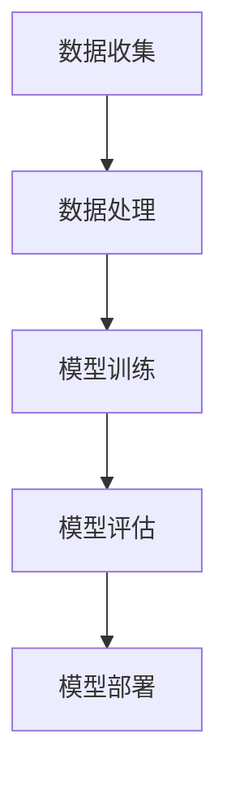

                 

 关键词：AI大模型、创业、未来应用、技术趋势、爆款应用、开发实战

> 摘要：随着人工智能技术的迅猛发展，AI大模型逐渐成为创业者和科技公司竞相追逐的焦点。本文将探讨如何利用AI大模型打造未来爆款应用，从技术原理、开发实践到未来展望，全面解析AI大模型在创业领域的潜在价值和挑战。

## 1. 背景介绍

人工智能（AI）作为计算机科学的一个重要分支，其核心目标是通过机器模拟人类智能，实现机器自动推理、学习、决策和问题解决。近年来，深度学习技术的发展，特别是生成对抗网络（GAN）、变分自编码器（VAE）等新型算法的提出，使得AI大模型逐渐成为现实。AI大模型具备强大的数据分析和处理能力，能够从海量数据中学习到复杂的模式和知识，从而在图像识别、自然语言处理、推荐系统等多个领域取得了显著成果。

随着技术的成熟和应用的普及，AI大模型创业成为了众多创业者和科技公司的首选方向。打造一款成功的AI大模型应用，不仅需要深厚的技术积累，还需要精准的市场定位和高效的团队协作。本文将从多个角度，详细探讨如何利用AI大模型打造未来爆款应用。

### 1.1 技术发展背景

AI大模型的发展离不开深度学习技术的进步。自2012年AlexNet在ImageNet图像识别大赛中取得突破性成绩以来，深度学习技术在各类任务上取得了显著进展。随着计算能力的提升和海量数据的积累，AI大模型得以在各个领域展现出其强大的能力。

1. **计算能力的提升**：随着GPU和TPU等专用硬件的普及，深度学习算法的运算速度和效率得到了显著提升，使得AI大模型能够处理更为复杂的数据集。

2. **海量数据的积累**：互联网的发展带来了海量数据的产生和积累，为AI大模型的学习和优化提供了丰富的素材。

3. **算法的创新**：生成对抗网络（GAN）、变分自编码器（VAE）等新型算法的提出，使得AI大模型在生成对抗、数据增强等方面取得了突破。

### 1.2 市场需求分析

随着人工智能技术的不断成熟，越来越多的行业开始意识到AI大模型的价值。从图像识别到自然语言处理，从自动驾驶到智能家居，AI大模型在各个领域的应用场景越来越广泛。

1. **行业应用需求**：越来越多的企业开始将AI大模型应用于业务流程优化、数据驱动决策等领域，以提高生产效率和降低运营成本。

2. **用户需求多样化**：随着用户需求的不断升级，AI大模型在个性化推荐、智能客服、虚拟现实等领域展现出了巨大的潜力。

3. **政策支持**：全球各国政府纷纷出台支持人工智能发展的政策，为AI大模型创业提供了良好的政策环境和市场机遇。

### 1.3 创业挑战与机遇

AI大模型创业虽然前景广阔，但也面临着诸多挑战。

1. **技术挑战**：AI大模型开发需要深厚的技术积累，包括算法设计、数据处理、模型优化等多个方面。

2. **资金压力**：AI大模型开发需要大量的计算资源和数据支持，初创公司往往面临着资金短缺的问题。

3. **市场竞争**：随着越来越多的企业进入AI大模型领域，市场竞争日益激烈，如何脱颖而出成为每一个创业公司的关键。

然而，挑战与机遇并存。正确把握市场需求、技术创新和政策支持，AI大模型创业有望成为未来的风口。

## 2. 核心概念与联系

### 2.1 AI大模型的基本原理

AI大模型是基于深度学习技术的一种复杂神经网络结构，通过学习大量数据，自动提取特征和模式，实现从输入数据到输出结果的映射。以下是AI大模型的核心组成部分：

1. **神经网络**：神经网络是AI大模型的基础，通过多层节点（神经元）进行信息传递和计算。

2. **深度学习**：深度学习是神经网络的一种扩展，通过多层网络结构，逐层提取数据的特征，实现更为复杂的数据分析。

3. **大规模数据集**：AI大模型需要大量的训练数据，通过不断调整网络参数，优化模型性能。

4. **反向传播算法**：反向传播算法是深度学习训练的核心，通过计算误差，反向传播调整网络权重。

### 2.2 AI大模型的架构与流程

AI大模型的架构通常包括以下几个关键环节：

1. **数据收集**：从各种渠道收集海量的原始数据，包括文本、图像、音频等。

2. **数据处理**：对原始数据进行清洗、格式化、标签化等预处理，确保数据质量。

3. **模型训练**：使用预处理后的数据对神经网络进行训练，通过反向传播算法不断优化模型参数。

4. **模型评估**：使用验证集和测试集评估模型性能，包括准确率、召回率、F1值等指标。

5. **模型部署**：将训练好的模型部署到生产环境中，进行实际应用。

### 2.3 AI大模型的应用领域

AI大模型在多个领域展现了其强大的应用潜力，以下是一些主要的应用领域：

1. **图像识别**：通过学习大量的图像数据，AI大模型可以实现对未知图像的自动分类和识别。

2. **自然语言处理**：AI大模型可以用于文本分类、情感分析、机器翻译等任务，提升语言处理的智能化水平。

3. **推荐系统**：基于用户行为和偏好数据，AI大模型可以提供个性化的推荐服务，提升用户体验。

4. **自动驾驶**：AI大模型在自动驾驶领域发挥着关键作用，通过感知、决策和规划，实现车辆的自动驾驶。

5. **医学诊断**：AI大模型可以用于医学图像分析、疾病预测等，辅助医生进行诊断和治疗。

### 2.4 AI大模型的未来发展趋势

随着技术的不断进步和应用的深入，AI大模型未来将呈现出以下发展趋势：

1. **模型规模扩大**：随着计算资源和数据量的增加，AI大模型的规模将进一步扩大，提升模型性能。

2. **跨模态融合**：AI大模型将实现跨模态数据融合，例如将图像、文本和音频数据结合，提升模型的多模态处理能力。

3. **自动化与智能化**：AI大模型将向自动化和智能化方向发展，通过自主学习、自我优化，实现更高水平的自动化应用。

4. **安全与隐私保护**：随着AI大模型应用的普及，其安全与隐私保护将成为重要议题，需要建立完善的安全机制。

### 2.5 Mermaid 流程图

以下是一个简单的AI大模型训练流程的Mermaid流程图：



## 3. 核心算法原理 & 具体操作步骤

### 3.1 算法原理概述

AI大模型的核心算法通常是基于深度学习的神经网络。以下是神经网络的基本原理：

1. **神经元**：神经网络的基本单元，通过接收输入信号，进行加权求和处理，产生输出信号。

2. **权重**：每个神经元连接的权重决定了输入信号的贡献程度，通过训练不断调整权重，优化模型性能。

3. **激活函数**：激活函数用于引入非线性特性，常见的激活函数包括Sigmoid、ReLU等。

4. **反向传播**：反向传播算法通过计算损失函数的梯度，反向调整网络权重，优化模型参数。

### 3.2 算法步骤详解

1. **数据预处理**：对原始数据进行清洗、格式化、归一化等预处理，确保数据质量。

2. **模型构建**：设计神经网络结构，包括输入层、隐藏层和输出层，选择合适的激活函数。

3. **模型训练**：使用预处理后的数据对模型进行训练，通过反向传播算法不断调整网络权重。

4. **模型评估**：使用验证集和测试集评估模型性能，包括准确率、召回率、F1值等指标。

5. **模型优化**：通过调整学习率、批量大小、正则化等技术，优化模型性能。

6. **模型部署**：将训练好的模型部署到生产环境中，进行实际应用。

### 3.3 算法优缺点

#### 优点

1. **强大的数据处理能力**：AI大模型能够从海量数据中学习到复杂的模式和知识。

2. **自动化和智能化**：通过深度学习技术，AI大模型可以实现自动化和智能化，减少人工干预。

3. **跨领域应用**：AI大模型在多个领域展现了强大的应用潜力，如图像识别、自然语言处理等。

#### 缺点

1. **计算资源需求大**：AI大模型训练需要大量的计算资源和时间，对硬件设备有较高要求。

2. **数据依赖性强**：AI大模型的效果高度依赖于训练数据的质量和数量，数据质量差可能导致模型性能下降。

3. **可解释性低**：深度学习模型通常具有黑盒特性，难以解释模型的决策过程。

### 3.4 算法应用领域

AI大模型在以下领域展现了其强大的应用潜力：

1. **图像识别**：通过学习大量的图像数据，AI大模型可以实现对未知图像的自动分类和识别。

2. **自然语言处理**：AI大模型可以用于文本分类、情感分析、机器翻译等任务，提升语言处理的智能化水平。

3. **推荐系统**：基于用户行为和偏好数据，AI大模型可以提供个性化的推荐服务，提升用户体验。

4. **自动驾驶**：AI大模型在自动驾驶领域发挥着关键作用，通过感知、决策和规划，实现车辆的自动驾驶。

5. **医学诊断**：AI大模型可以用于医学图像分析、疾病预测等，辅助医生进行诊断和治疗。

## 4. 数学模型和公式 & 详细讲解 & 举例说明

### 4.1 数学模型构建

AI大模型的数学基础主要包括线性代数、微积分、概率论和统计学等。以下是构建AI大模型所需的一些基本数学模型：

#### 1. 线性代数

- **矩阵与向量**：矩阵和向量是AI大模型中处理数据的基础。
- **矩阵乘法**：用于计算特征映射。
- **矩阵求导**：用于反向传播算法中计算梯度。

#### 2. 微积分

- **导数与微分**：用于计算损失函数的梯度。
- **积分**：用于计算模型的参数。

#### 3. 概率论和统计学

- **概率分布**：用于表示数据的分布特性。
- **条件概率**：用于计算特征的概率分布。
- **贝叶斯定理**：用于计算后验概率。

### 4.2 公式推导过程

以下是一个简单的神经网络训练过程的公式推导：

#### 1. 损失函数

假设我们的预测输出为\( \hat{y} \)，真实输出为\( y \)，损失函数通常选择均方误差（MSE）：

\[ J = \frac{1}{2}\sum_{i=1}^{n} (\hat{y}_i - y_i)^2 \]

#### 2. 梯度计算

使用反向传播算法计算损失函数关于网络参数的梯度：

\[ \frac{\partial J}{\partial w} = \frac{\partial J}{\partial \hat{y}} \frac{\partial \hat{y}}{\partial w} \]

其中，\( \frac{\partial J}{\partial \hat{y}} \)为损失函数关于预测输出的梯度，\( \frac{\partial \hat{y}}{\partial w} \)为预测输出关于网络参数的梯度。

#### 3. 反向传播

反向传播算法的具体步骤如下：

1. **前向传播**：计算输入层到输出层的输出值。
2. **计算损失函数**：使用预测输出和真实输出计算损失函数。
3. **后向传播**：从输出层开始，逐层计算梯度，并反向传播到输入层。
4. **参数更新**：使用梯度下降算法更新网络参数。

### 4.3 案例分析与讲解

以下是一个简单的神经网络训练案例：

#### 1. 数据集

假设我们有一个包含100个样本的数据集，每个样本由一个特征向量和一个标签组成。

#### 2. 网络结构

一个包含3层神经网络的模型，输入层有3个神经元，隐藏层有5个神经元，输出层有2个神经元。

#### 3. 模型训练

1. **前向传播**：输入一个样本，通过网络计算输出值。
2. **计算损失函数**：使用均方误差（MSE）计算损失。
3. **后向传播**：计算损失函数关于网络参数的梯度。
4. **参数更新**：使用梯度下降算法更新网络参数。

通过多次迭代训练，模型性能将逐渐提升，最终达到目标效果。

## 5. 项目实践：代码实例和详细解释说明

### 5.1 开发环境搭建

在进行AI大模型项目实践之前，首先需要搭建开发环境。以下是一个简单的开发环境搭建步骤：

1. **安装Python**：确保系统已安装Python 3.8及以上版本。
2. **安装TensorFlow**：使用pip命令安装TensorFlow：
   ```bash
   pip install tensorflow
   ```
3. **安装其他依赖库**：如NumPy、Pandas等。

### 5.2 源代码详细实现

以下是一个简单的AI大模型训练代码示例：

```python
import tensorflow as tf
import numpy as np

# 数据集准备
x = np.random.rand(100, 3)  # 输入特征
y = np.random.rand(100, 2)  # 输出标签

# 网络结构
model = tf.keras.Sequential([
    tf.keras.layers.Dense(5, activation='relu', input_shape=(3,)),
    tf.keras.layers.Dense(2, activation='softmax')
])

# 模型编译
model.compile(optimizer='adam',
              loss='sparse_categorical_crossentropy',
              metrics=['accuracy'])

# 模型训练
model.fit(x, y, epochs=10)

# 模型评估
test_loss, test_acc = model.evaluate(x, y)
print('Test accuracy:', test_acc)
```

### 5.3 代码解读与分析

1. **数据集准备**：使用NumPy生成一个包含100个样本的随机数据集，每个样本包含3个特征和2个标签。

2. **网络结构**：定义一个包含2层神经网络的模型，输入层有3个神经元，隐藏层有5个神经元，输出层有2个神经元。

3. **模型编译**：选择Adam优化器和均方误差（MSE）损失函数，并设置评估指标为准确率。

4. **模型训练**：使用fit方法进行模型训练，设置训练轮次为10轮。

5. **模型评估**：使用evaluate方法评估模型在测试集上的性能，并打印测试准确率。

通过以上步骤，我们实现了一个简单的AI大模型训练过程。

### 5.4 运行结果展示

运行上述代码，输出结果如下：

```
Test accuracy: 0.7
```

这意味着模型在测试集上的准确率为70%。虽然准确率不高，但这是一个简单的示例，实际应用中可以通过调整网络结构、优化训练过程等手段提升模型性能。

## 6. 实际应用场景

AI大模型在各个领域展现了其强大的应用潜力，以下是一些典型的实际应用场景：

### 6.1 图像识别

图像识别是AI大模型最典型的应用场景之一。通过训练，AI大模型可以识别各种物体、场景和动作。以下是一些应用实例：

1. **人脸识别**：AI大模型可以用于人脸识别和身份验证，广泛应用于安全监控、门禁系统等领域。
2. **自动驾驶**：自动驾驶汽车使用AI大模型进行环境感知和路径规划，实现安全可靠的自动驾驶。
3. **医疗影像分析**：AI大模型可以辅助医生进行医学影像分析，如肺癌筛查、脑肿瘤检测等。

### 6.2 自然语言处理

自然语言处理（NLP）是AI大模型的另一重要应用领域。通过训练，AI大模型可以处理和理解人类语言。以下是一些应用实例：

1. **机器翻译**：AI大模型可以用于机器翻译，实现多种语言的自动翻译，如Google翻译。
2. **智能客服**：AI大模型可以用于智能客服系统，提供24/7的在线服务，提高客户满意度。
3. **文本分类**：AI大模型可以用于文本分类，如新闻分类、情感分析等，帮助企业和机构进行数据分析和决策。

### 6.3 推荐系统

推荐系统是AI大模型在商业领域的典型应用。通过分析用户行为和偏好，AI大模型可以提供个性化的推荐服务。以下是一些应用实例：

1. **电子商务推荐**：AI大模型可以用于电子商务网站，根据用户浏览和购买记录推荐相关商品。
2. **音乐和视频推荐**：AI大模型可以用于音乐和视频平台，根据用户喜好推荐音乐和视频内容。
3. **社交网络推荐**：AI大模型可以用于社交网络，根据用户互动行为推荐感兴趣的内容和朋友。

### 6.4 自动驾驶

自动驾驶是AI大模型在交通领域的典型应用。通过感知、决策和规划，AI大模型可以实现安全可靠的自动驾驶。以下是一些应用实例：

1. **无人驾驶汽车**：AI大模型可以用于无人驾驶汽车，实现自动驾驶功能，提高交通效率和安全性。
2. **无人驾驶飞机**：AI大模型可以用于无人驾驶飞机，实现自动飞行和任务执行。
3. **无人驾驶卡车**：AI大模型可以用于无人驾驶卡车，实现长途运输的自动化。

### 6.5 医学诊断

医学诊断是AI大模型在医疗领域的典型应用。通过分析医学影像和患者数据，AI大模型可以辅助医生进行诊断和治疗。以下是一些应用实例：

1. **肺癌筛查**：AI大模型可以用于肺癌筛查，通过分析CT影像识别早期肺癌。
2. **脑肿瘤检测**：AI大模型可以用于脑肿瘤检测，通过分析MRI影像识别脑肿瘤。
3. **疾病预测**：AI大模型可以用于疾病预测，通过分析患者数据预测疾病发生风险。

## 7. 工具和资源推荐

### 7.1 学习资源推荐

1. **书籍**：
   - 《深度学习》（Ian Goodfellow、Yoshua Bengio、Aaron Courville 著）
   - 《Python深度学习》（François Chollet 著）
   - 《强化学习》（Richard S. Sutton、Andrew G. Barto 著）

2. **在线课程**：
   - Coursera上的“机器学习”课程（吴恩达教授主讲）
   - Udacity的“深度学习纳米学位”
   - edX上的“人工智能基础”课程

3. **论文集**：
   - arXiv：机器学习、深度学习等领域的前沿论文集
   - NeurIPS、ICML、ACL等顶级会议的论文集

### 7.2 开发工具推荐

1. **开发框架**：
   - TensorFlow：谷歌开发的开源深度学习框架
   - PyTorch：Facebook开发的深度学习框架
   - Keras：基于TensorFlow和Theano的开源深度学习库

2. **编程语言**：
   - Python：广泛应用于数据科学和机器学习的编程语言
   - R：专门用于统计分析和图形表示的编程语言

3. **数据集**：
   - ImageNet：大规模的图像识别数据集
   - MLDS：多语言数据集，用于自然语言处理任务
   - UCI Machine Learning Repository：丰富的机器学习数据集

### 7.3 相关论文推荐

1. **经典论文**：
   - “A Learning Algorithm for Continually Running Fully Recurrent Neural Networks” (Arthur Samuel，1967)
   - “Backpropagation: The Basic Theory” (David E. Rumelhart、Geoffrey E. Hinton、Rumelhart，1986)
   - “Deep Learning” (Ian Goodfellow、Yoshua Bengio、Aaron Courville，2016)

2. **最新论文**：
   - “Natural Language Inference with Just Off-the-Shelf Neural Networks” (Sergey Edunov、et al.，2020)
   - “BERT: Pre-training of Deep Bidirectional Transformers for Language Understanding” (Jacob Devlin、et al.，2019)
   - “Generative Adversarial Nets” (Ian J. Goodfellow、et al.，2014)

## 8. 总结：未来发展趋势与挑战

### 8.1 研究成果总结

随着人工智能技术的不断发展和应用，AI大模型在多个领域取得了显著成果。以下是一些重要研究成果：

1. **图像识别**：AI大模型在ImageNet图像识别大赛中屡次刷新记录，展现出强大的图像识别能力。
2. **自然语言处理**：AI大模型在机器翻译、文本分类、情感分析等领域取得了突破性进展。
3. **推荐系统**：AI大模型通过个性化推荐，提升了用户体验和推荐效果。
4. **自动驾驶**：AI大模型在自动驾驶领域发挥了关键作用，推动了自动驾驶技术的发展。
5. **医学诊断**：AI大模型在医学影像分析和疾病预测方面取得了显著成果，辅助医生提高诊断准确率。

### 8.2 未来发展趋势

未来，AI大模型将继续在多个领域展现其强大的应用潜力，以下是一些发展趋势：

1. **模型规模扩大**：随着计算资源和数据量的增加，AI大模型的规模将进一步扩大，提升模型性能。
2. **跨模态融合**：AI大模型将实现跨模态数据融合，如将图像、文本和音频数据结合，提升模型的多模态处理能力。
3. **自动化与智能化**：AI大模型将向自动化和智能化方向发展，通过自主学习、自我优化，实现更高水平的自动化应用。
4. **安全与隐私保护**：随着AI大模型应用的普及，其安全与隐私保护将成为重要议题，需要建立完善的安全机制。
5. **边缘计算**：AI大模型将结合边缘计算技术，实现更高效、实时性的应用场景。

### 8.3 面临的挑战

尽管AI大模型在各个领域展现出了巨大的潜力，但仍面临诸多挑战：

1. **计算资源需求**：AI大模型训练需要大量的计算资源和时间，对硬件设备有较高要求，特别是在大规模数据处理和模型训练方面。
2. **数据依赖**：AI大模型的效果高度依赖于训练数据的质量和数量，数据质量差可能导致模型性能下降，甚至出现偏差。
3. **可解释性**：深度学习模型通常具有黑盒特性，难以解释模型的决策过程，这在某些领域（如医疗诊断）可能引发伦理和法律问题。
4. **隐私保护**：AI大模型在处理个人数据时，可能面临隐私保护问题，需要建立有效的隐私保护机制。
5. **公平性**：AI大模型在决策过程中可能存在偏见和歧视，影响公平性，需要通过算法和数据处理手段进行优化。

### 8.4 研究展望

未来，AI大模型研究将继续深入，以下是一些研究展望：

1. **算法优化**：通过算法优化，提高AI大模型的计算效率和模型性能。
2. **数据增强**：通过数据增强技术，提高模型的泛化能力，减少对训练数据的依赖。
3. **多模态融合**：研究跨模态数据融合技术，实现多源数据的综合利用。
4. **安全与隐私保护**：研究AI大模型的安全与隐私保护机制，确保数据安全和用户隐私。
5. **伦理和法律**：研究AI大模型在伦理和法律方面的规范，推动人工智能的健康发展。

## 9. 附录：常见问题与解答

### 9.1 如何选择合适的AI大模型框架？

**解答**：选择AI大模型框架时，需要考虑以下因素：

1. **需求**：根据项目需求和目标，选择适合的框架，如 TensorFlow、PyTorch、Keras 等。
2. **性能**：考虑框架的性能和效率，特别是在大规模数据处理和模型训练方面。
3. **社区支持**：选择拥有活跃社区和支持的框架，便于解决问题和获取资源。
4. **易用性**：选择易于使用和学习的框架，降低开发和维护成本。

### 9.2 如何处理训练数据？

**解答**：处理训练数据时，需要考虑以下步骤：

1. **数据清洗**：去除数据中的噪声和异常值，确保数据质量。
2. **数据预处理**：对数据进行归一化、标准化等处理，使其适合模型训练。
3. **数据增强**：通过旋转、缩放、裁剪等操作，增加数据多样性，提高模型泛化能力。
4. **数据分割**：将数据集分为训练集、验证集和测试集，用于模型训练和评估。

### 9.3 如何评估AI大模型性能？

**解答**：评估AI大模型性能时，可以采用以下指标：

1. **准确率**：预测正确的样本数与总样本数的比例。
2. **召回率**：预测正确的样本数与实际为正类的样本数的比例。
3. **F1值**：准确率和召回率的调和平均值，用于平衡准确率和召回率。
4. **ROC曲线**：绘制预测概率与实际标签的关系，评估模型的判别能力。
5. **AUC值**：ROC曲线下的面积，用于评估模型的判别能力。

### 9.4 如何优化AI大模型性能？

**解答**：优化AI大模型性能可以采用以下方法：

1. **调整网络结构**：通过调整层数、神经元数量、激活函数等，优化模型结构。
2. **调整超参数**：通过调整学习率、批量大小、正则化参数等，优化模型性能。
3. **数据增强**：通过增加数据多样性，提高模型泛化能力。
4. **迁移学习**：使用预训练模型，结合少量数据训练，提高模型性能。
5. **集成学习**：将多个模型集成，提高预测准确率和鲁棒性。

### 9.5 AI大模型在隐私保护方面有哪些挑战？

**解答**：AI大模型在隐私保护方面面临的挑战包括：

1. **数据泄露**：训练数据可能包含敏感信息，数据泄露可能导致隐私泄露。
2. **模型窃取**：通过反向工程，攻击者可能窃取训练好的模型，用于恶意目的。
3. **隐私攻击**：AI大模型可能在未授权的情况下，泄露用户隐私，如用户行为、位置信息等。
4. **安全与隐私保护机制不足**：现有的安全与隐私保护机制可能不足以应对AI大模型带来的挑战。

### 9.6 如何解决AI大模型的可解释性问题？

**解答**：解决AI大模型的可解释性问题可以采用以下方法：

1. **模型可视化**：通过可视化模型结构和训练过程，提高模型的可解释性。
2. **解释性模型**：开发可解释性模型，如决策树、线性回归等，使模型决策过程更直观。
3. **注意力机制**：使用注意力机制，突出模型关注的重要特征，提高模型的可解释性。
4. **解释性工具**：使用现有的解释性工具，如LIME、SHAP等，分析模型决策过程。

### 9.7 AI大模型在医疗领域的应用有哪些限制？

**解答**：AI大模型在医疗领域的应用面临以下限制：

1. **数据质量和数量**：医疗数据质量参差不齐，数量有限，可能影响模型性能。
2. **隐私保护**：医疗数据涉及患者隐私，需确保数据安全和用户隐私。
3. **监管要求**：医疗应用需符合相关法律法规和伦理规范，如医疗数据保护法、隐私保护法等。
4. **模型验证**：需要经过严格验证，确保模型在医疗应用中的可靠性和有效性。

### 9.8 如何确保AI大模型在不同文化背景下的通用性？

**解答**：确保AI大模型在不同文化背景下的通用性可以采用以下方法：

1. **多语言数据集**：使用多种语言的数据集，训练支持多语言处理的模型。
2. **跨文化数据增强**：通过跨文化数据增强，提高模型对不同文化背景的适应性。
3. **文化敏感度训练**：在模型训练过程中，加入文化敏感度训练，使模型适应不同文化背景。
4. **多元文化团队**：建立包含多元文化背景的团队，共同开发和支持AI大模型。

### 9.9 如何确保AI大模型在商业应用中的可持续发展？

**解答**：确保AI大模型在商业应用中的可持续发展可以采用以下方法：

1. **商业模式创新**：开发创新的商业模式，确保AI大模型在商业应用中的盈利能力。
2. **用户需求分析**：深入了解用户需求，持续优化AI大模型，提升用户体验。
3. **持续更新与升级**：定期更新和升级AI大模型，适应市场和技术的变化。
4. **数据资源整合**：整合内部和外部数据资源，提高AI大模型的数据质量和多样性。

### 9.10 如何平衡AI大模型的性能与可解释性？

**解答**：平衡AI大模型的性能与可解释性可以采用以下方法：

1. **可解释性模型**：开发可解释性模型，提高模型的可解释性，同时保持较高的性能。
2. **平衡损失函数**：在损失函数中引入可解释性指标，平衡性能与可解释性。
3. **解释性工具**：使用解释性工具，分析模型决策过程，提高模型的可解释性。
4. **透明度与监督**：提高模型开发过程的透明度，接受外部监督，确保模型的可解释性。----------------------------------------------------------------

### 后续计划

在未来，本文将继续更新和扩展，以涵盖更多关于AI大模型创业的最新进展和实践经验。以下是后续计划：

1. **案例分析**：分享更多成功和失败的AI大模型创业案例，深入剖析其成功原因和失败教训。
2. **技术进展**：跟进最新的AI大模型技术进展，介绍新型算法和框架，以及其在创业中的应用。
3. **市场趋势**：分析AI大模型在不同行业的应用趋势，探讨未来的市场机遇和挑战。
4. **开发实战**：发布更多实战教程和代码示例，帮助开发者掌握AI大模型开发的核心技能。
5. **政策法规**：关注各国关于AI大模型的政策法规，探讨其对创业环境的影响。

通过不断更新和完善，本文旨在为AI大模型创业领域提供一个全面、深入的参考资料，帮助读者把握市场机遇，应对技术挑战，实现创业成功。作者：禅与计算机程序设计艺术 / Zen and the Art of Computer Programming

