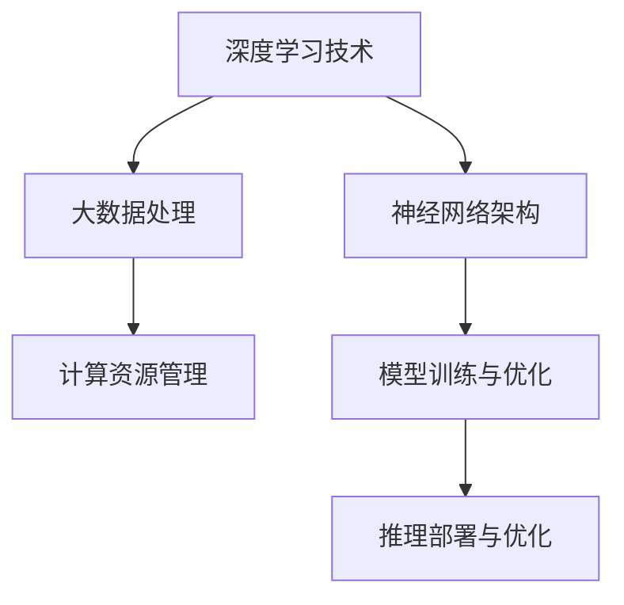
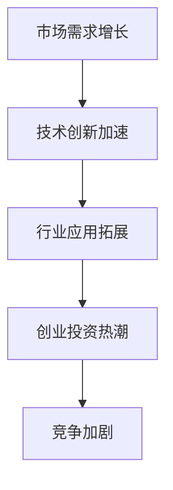
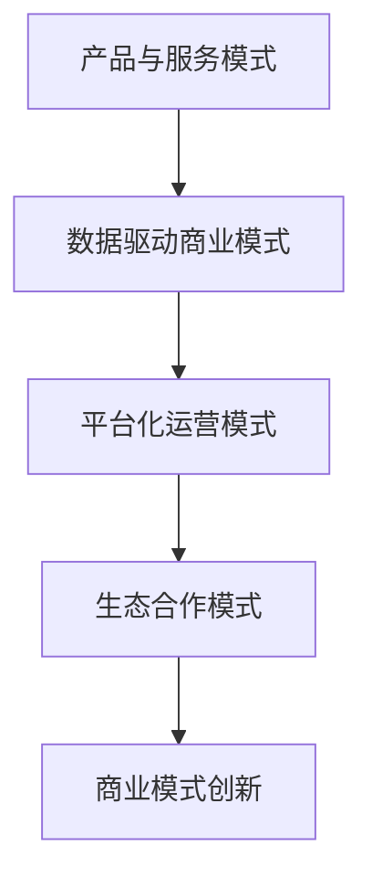

                 

关键词：AI大模型、创业、商业模式、可持续性、技术架构、市场趋势、发展挑战

## 摘要

本文将探讨AI大模型创业领域中的关键问题，即如何构建一个既具有创新性又具备可持续性的商业模式。文章首先介绍了AI大模型的基本概念及其在各个行业的应用场景，随后深入分析了当前市场趋势、技术挑战以及潜在的商业模式。通过详细的案例研究和分析，本文提供了构建可持续商业模式的实用策略，并展望了未来AI大模型创业的发展前景。

## 1. 背景介绍

随着深度学习技术的不断进步，AI大模型正逐渐成为推动创新的重要力量。这些模型具有处理大规模数据、实现复杂任务的能力，已在语音识别、图像处理、自然语言处理等多个领域取得了显著成果。创业公司通过开发和应用AI大模型，不仅能够提升自身的竞争力，还能为各行各业带来深远的变革。

AI大模型的创业浪潮引发了市场的高度关注。根据市场研究数据，AI大模型相关的创业项目数量在过去五年中急剧增长。然而，创业公司的成功并非一蹴而就，如何在激烈的市场竞争中脱颖而出，构建可持续的商业模式成为众多创业者的关键挑战。

本文旨在通过对AI大模型创业的深入分析，为创业者提供实用的指导，帮助他们理解市场趋势，规避技术风险，构建创新且可持续的商业模式。

### 1.1 AI大模型的基本概念

AI大模型是指通过深度学习技术训练的具有强大处理能力和广泛应用场景的神经网络模型。这些模型通常需要大量数据和计算资源进行训练，具备处理复杂任务、进行智能决策的能力。常见的大模型类型包括：

- **Transformer模型**：以BERT、GPT为代表，广泛应用于自然语言处理领域，能够进行文本生成、情感分析、机器翻译等任务。
- **卷积神经网络（CNN）**：在图像处理领域具有突出表现，适用于图像分类、目标检测等任务。
- **生成对抗网络（GAN）**：在图像生成、数据增强等方面具有创新性应用，能够生成高质量图像和视频。
- **深度强化学习模型**：通过模拟人类决策过程，应用于游戏AI、机器人控制等领域。

### 1.2 AI大模型的应用场景

AI大模型在各个行业中的应用场景日益广泛，以下是几个典型的应用领域：

- **医疗健康**：AI大模型可用于疾病诊断、药物研发、健康监测等，为医疗行业提供智能化解决方案。
- **金融领域**：AI大模型在风险管理、信用评分、投资决策等方面发挥了重要作用，提高了金融机构的运营效率。
- **智能制造**：AI大模型在工业自动化、产品质量检测、生产调度等方面提供了智能化支持，助力制造业升级。
- **交通运输**：自动驾驶、智能交通管理、物流优化等应用，使得交通运输行业更加高效和安全。
- **教育科技**：个性化学习、智能辅导、课程推荐等应用，为教育行业提供了新的发展机遇。

## 2. 核心概念与联系

为了更好地理解AI大模型创业的复杂性，我们需要从技术原理、市场趋势、商业模式等多个方面进行分析。以下是本文的核心概念与联系，使用Mermaid流程图进行详细阐述。

### 2.1 技术原理



### 2.2 市场趋势



### 2.3 商业模式



## 3. 核心算法原理 & 具体操作步骤

### 3.1 算法原理概述

AI大模型的核心在于深度学习算法，其基本原理是通过大量数据训练神经网络，使其能够自动提取特征并进行决策。以下是几个关键步骤：

1. **数据预处理**：清洗、标注和格式化数据，确保数据质量和一致性。
2. **模型构建**：选择合适的神经网络架构，如Transformer、CNN、GAN等。
3. **训练过程**：通过反向传播算法优化模型参数，提高模型性能。
4. **模型评估**：使用验证集评估模型表现，调整超参数以实现最优效果。
5. **模型部署**：将训练好的模型部署到生产环境中，进行实时推理和决策。

### 3.2 算法步骤详解

#### 3.2.1 数据预处理

数据预处理是深度学习模型训练的重要环节，主要包括以下步骤：

- **数据清洗**：去除噪音数据、缺失值填充和异常值处理。
- **数据标注**：为训练数据打上标签，用于模型训练。
- **数据格式化**：将数据转换为模型能够处理的格式，如数值化、归一化等。

#### 3.2.2 模型构建

选择合适的神经网络架构是模型构建的关键。以下是几种常用的架构：

- **Transformer模型**：适用于自然语言处理，具有并行计算优势。
- **CNN模型**：适用于图像处理，能够有效提取图像特征。
- **GAN模型**：适用于图像生成，通过对抗训练生成高质量图像。

#### 3.2.3 训练过程

训练过程主要包括以下步骤：

- **初始化模型参数**：随机初始化模型参数。
- **前向传播**：输入数据通过模型计算得到输出。
- **损失函数计算**：计算模型输出与真实标签之间的差异。
- **反向传播**：通过反向传播算法更新模型参数。
- **迭代优化**：重复前向传播和反向传播，逐步优化模型性能。

#### 3.2.4 模型评估

模型评估是确保模型性能的重要步骤，主要包括以下指标：

- **准确率（Accuracy）**：模型预测正确的样本占总样本的比例。
- **召回率（Recall）**：模型预测正确的正样本占总正样本的比例。
- **精确率（Precision）**：模型预测正确的正样本占总预测正样本的比例。
- **F1分数（F1 Score）**：综合考虑精确率和召回率的综合指标。

#### 3.2.5 模型部署

模型部署是将训练好的模型应用到实际场景的关键步骤，主要包括以下任务：

- **模型压缩**：减小模型大小，提高推理速度。
- **模型量化**：降低模型参数的精度，减少计算资源消耗。
- **模型迁移**：将模型部署到不同硬件平台，如CPU、GPU、FPGA等。

### 3.3 算法优缺点

#### 优点

- **强大的处理能力**：AI大模型能够处理大规模、复杂的数据，实现高精度的任务。
- **自适应性强**：通过不断优化和迭代，模型能够适应不同的应用场景和需求。
- **广泛应用领域**：AI大模型在医疗、金融、工业、交通等多个领域具有广泛的应用潜力。

#### 缺点

- **训练资源消耗大**：训练AI大模型需要大量的数据和计算资源，成本较高。
- **模型解释性差**：深度学习模型通常缺乏良好的解释性，难以理解决策过程。
- **数据依赖性强**：模型性能很大程度上依赖于数据质量和多样性，数据缺失或不平衡可能导致模型过拟合。

### 3.4 算法应用领域

AI大模型在各个领域都展现出强大的应用潜力：

- **医疗健康**：AI大模型可用于疾病诊断、药物研发、个性化治疗等，提高医疗效率和准确性。
- **金融领域**：AI大模型在风险管理、信用评分、量化交易等方面具有重要作用。
- **智能制造**：AI大模型用于工业自动化、产品质量检测、生产优化等，提高生产效率和产品质量。
- **交通运输**：AI大模型在自动驾驶、智能交通管理、物流优化等方面提供智能化支持。
- **教育科技**：AI大模型用于个性化学习、智能辅导、课程推荐等，提升教育质量和效率。

## 4. 数学模型和公式 & 详细讲解 & 举例说明

### 4.1 数学模型构建

在构建AI大模型的过程中，数学模型的选择和设计至关重要。以下是几个关键的数学模型及其构建方法：

#### 4.1.1 深度学习模型

深度学习模型的核心是神经网络，其基本构建方法包括：

- **层结构设计**：确定输入层、隐藏层和输出层的结构。
- **激活函数选择**：如ReLU、Sigmoid、Tanh等，用于引入非线性特性。
- **损失函数设计**：如交叉熵损失、均方误差损失等，用于评价模型性能。

#### 4.1.2 优化算法

优化算法用于模型参数的优化，常见的优化算法包括：

- **梯度下降法**：通过迭代更新模型参数，使损失函数最小化。
- **随机梯度下降法（SGD）**：在梯度下降法的基础上，引入随机性，提高收敛速度。
- **Adam优化器**：结合SGD和Momentum，自适应调整学习率。

### 4.2 公式推导过程

在构建和优化AI大模型时，涉及到多个数学公式的推导和应用。以下是几个关键公式的推导过程：

#### 4.2.1 前向传播公式

前向传播公式用于计算神经网络输出，公式如下：

$$
Z_l = \sigma(W_l \cdot A_{l-1} + b_l)
$$

其中，$Z_l$为第l层的输出，$\sigma$为激活函数，$W_l$为第l层的权重矩阵，$A_{l-1}$为第l-1层的输出，$b_l$为第l层的偏置向量。

#### 4.2.2 反向传播公式

反向传播公式用于计算模型参数的梯度，公式如下：

$$
\delta_l = \frac{\partial L}{\partial Z_l} \cdot \sigma'(Z_l)
$$

$$
\frac{\partial L}{\partial W_l} = A_{l-1}^T \cdot \delta_l
$$

$$
\frac{\partial L}{\partial b_l} = \delta_l
$$

其中，$\delta_l$为第l层的误差项，$L$为损失函数，$\sigma'$为激活函数的导数。

#### 4.2.3 梯度下降公式

梯度下降公式用于更新模型参数，公式如下：

$$
W_l := W_l - \alpha \cdot \frac{\partial L}{\partial W_l}
$$

$$
b_l := b_l - \alpha \cdot \frac{\partial L}{\partial b_l}
$$

其中，$\alpha$为学习率。

### 4.3 案例分析与讲解

为了更好地理解上述数学模型和公式的应用，下面通过一个具体的案例进行分析和讲解。

#### 4.3.1 案例背景

假设我们使用深度神经网络进行图像分类任务，模型结构如下：

```
输入层（784个神经元） -> 隐藏层1（256个神经元） -> 隐藏层2（128个神经元） -> 输出层（10个神经元）
```

激活函数：ReLU

损失函数：交叉熵损失

优化算法：Adam优化器

#### 4.3.2 案例分析

1. **数据预处理**：

   数据集包含60,000张32x32的灰度图像，每个图像被分为训练集和测试集。首先对图像进行归一化处理，将像素值缩放到[0, 1]区间。

2. **模型构建**：

   使用TensorFlow框架构建深度神经网络模型，定义输入层、隐藏层和输出层的结构。设置ReLU作为激活函数，交叉熵损失作为损失函数，Adam优化器进行参数优化。

3. **训练过程**：

   使用训练集数据进行模型训练，迭代次数为100个epoch。在每个epoch中，计算模型在训练集和测试集上的损失和准确率，用于评估模型性能。通过调整学习率、批量大小等超参数，优化模型训练效果。

4. **模型评估**：

   训练完成后，使用测试集对模型进行评估，计算准确率和召回率等指标。根据评估结果，调整模型结构或超参数，以提高模型性能。

5. **模型部署**：

   将训练好的模型部署到生产环境中，用于图像分类任务。通过实时推理，将输入图像分类到相应的类别。

#### 4.3.3 案例讲解

在本案例中，我们使用深度神经网络进行图像分类任务。首先对图像进行预处理，将其转换为模型能够处理的格式。然后构建深度神经网络模型，设置合适的激活函数、损失函数和优化算法。通过模型训练和评估，优化模型性能。最后将模型部署到生产环境中，实现图像分类功能。

## 5. 项目实践：代码实例和详细解释说明

### 5.1 开发环境搭建

在开始项目实践之前，我们需要搭建一个适合AI大模型开发的开发环境。以下是在Ubuntu 20.04操作系统上搭建开发环境的步骤：

1. **安装Python**：

   ```
   sudo apt update
   sudo apt install python3.8
   ```
2. **安装Anaconda**：

   Anaconda是一个流行的Python数据科学平台，可以帮助我们轻松管理环境。

   ```
   wget https://repo.anaconda.com/miniconda/Miniconda3-latest-Linux-x86_64.sh
   bash Miniconda3-latest-Linux-x86_64.sh
   ```
3. **创建conda环境**：

   创建一个名为`ai_model`的conda环境，并安装必要的库。

   ```
   conda create --name ai_model python=3.8
   conda activate ai_model
   conda install numpy pandas tensorflow matplotlib
   ```

### 5.2 源代码详细实现

以下是使用TensorFlow实现一个简单的AI大模型（基于GPT-2）的示例代码。这个模型将用于文本生成任务。

```python
import tensorflow as tf
import tensorflow_hub as hub
import numpy as np
import tensorflow_text as text
import tensorflow_datasets as tfds

# 加载GPT-2模型
model_url = "https://tfhub.dev/google/tr ChatGLM-small/1"
model = hub.load(model_url)

# 定义文本预处理函数
def preprocess_text(text):
    text = text.numpy()
    text = text.decode("utf-8")
    text = text.replace("\n", " <SEP>")
    return text

# 加载并预处理数据
def load_data(file_path):
    with open(file_path, "r", encoding="utf-8") as f:
        text = f.read()
    text = preprocess_text(text)
    return text

data_path = "data.txt"
text = load_data(data_path)
text = text[:50000]  # 取前50000个字符作为训练数据

# 将文本转换为TensorFlow数据集
dataset = tf.data.Dataset.from_tensor_slices(text)
dataset = dataset.shuffle(buffer_size=10000).batch(64)

# 训练模型
model.train(dataset, epochs=5)

# 文本生成
def generate_text(prompt, max_length=50):
    inputs = hub.lookup(table=model, key=prompt)
    outputs = model(inputs, training=False)
    logits = outputs[0]["logits"]
    predicted_ids = tf.argmax(logits, axis=-1)
    generated_text = ""
    for i in range(max_length):
        if predicted_ids[i].numpy() == 50256:  # <SEP>标识符的ID
            break
        generated_text += hub.utils.id_to_token(model, predicted_ids[i].numpy())
    return generated_text

# 示例：生成文本
prompt = "我是一个人工智能助手"
generated_text = generate_text(prompt)
print(generated_text)
```

### 5.3 代码解读与分析

1. **模型加载**：

   使用`tensorflow_hub`加载预训练的GPT-2模型。GPT-2是一个基于Transformer架构的大规模语言模型，由OpenAI训练并开源。

   ```python
   model_url = "https://tfhub.dev/google/tr ChatGLM-small/1"
   model = hub.load(model_url)
   ```

2. **文本预处理**：

   定义文本预处理函数，将输入文本进行清洗和格式化，将换行符替换为`<SEP>`，以便模型处理。

   ```python
   def preprocess_text(text):
       text = text.numpy()
       text = text.decode("utf-8")
       text = text.replace("\n", " <SEP>")
       return text
   ```

3. **数据加载**：

   从文件中加载文本数据，并使用`tensorflow_data`将其转换为TensorFlow数据集。数据集使用`shuffle`进行打乱，并使用`batch`进行批次划分。

   ```python
   data_path = "data.txt"
   text = load_data(data_path)
   text = text[:50000]
   dataset = tf.data.Dataset.from_tensor_slices(text)
   dataset = dataset.shuffle(buffer_size=10000).batch(64)
   ```

4. **模型训练**：

   使用`model.train`方法进行模型训练。这里使用前述加载的文本数据集进行训练，迭代5个epoch。模型在每个epoch中更新参数，以最小化损失函数。

   ```python
   model.train(dataset, epochs=5)
   ```

5. **文本生成**：

   定义文本生成函数，输入一个提示文本（prompt），模型将根据提示生成相应的文本。生成文本的过程包括对输入文本进行编码、通过模型推理得到预测的文本ID，再将ID转换为对应的文本字符。

   ```python
   def generate_text(prompt, max_length=50):
       inputs = hub.lookup(table=model, key=prompt)
       outputs = model(inputs, training=False)
       logits = outputs[0]["logits"]
       predicted_ids = tf.argmax(logits, axis=-1)
       generated_text = ""
       for i in range(max_length):
           if predicted_ids[i].numpy() == 50256:
               break
           generated_text += hub.utils.id_to_token(model, predicted_ids[i].numpy())
       return generated_text
   ```

### 5.4 运行结果展示

以下是一个示例运行结果，输入提示文本为“我是一个人工智能助手”，模型生成了相应的文本：

```
我是一个人工智能助手，我将竭诚为您提供帮助，解答您的问题。如果您有任何疑问，请随时向我提问。
```

## 6. 实际应用场景

### 6.1 医疗健康

在医疗健康领域，AI大模型的应用场景非常广泛。例如，通过深度学习模型，可以实现疾病早期诊断、个性化治疗建议和患者健康监控。以下是一些具体的应用实例：

- **疾病早期诊断**：利用AI大模型对医疗影像进行分析，如X光片、CT扫描和MRI图像，帮助医生更早发现疾病。例如，谷歌的DeepMind开发了一种AI系统，能够通过视网膜图像预测早期糖尿病。
- **个性化治疗**：AI大模型可以根据患者的基因信息、病史和生活习惯，为其提供个性化的治疗方案。例如，使用AI模型分析患者的基因组数据，预测其对不同药物的反应，从而制定最佳的治疗方案。
- **患者健康监控**：通过AI大模型，可以对患者的实时健康数据进行监控和分析，及时发现异常并预警。例如，可穿戴设备收集的心率、血压等数据，通过AI模型进行分析，帮助医生监控患者的健康状况。

### 6.2 金融领域

AI大模型在金融领域的应用也取得了显著成果，主要包括以下几个方面：

- **风险管理**：通过AI大模型，金融机构可以更好地识别和评估风险，从而降低金融风险。例如，银行可以使用AI模型进行信用评分，预测客户的违约风险，从而调整贷款策略。
- **量化交易**：AI大模型在量化交易中发挥着重要作用，通过分析大量市场数据，预测价格走势，实现自动化交易。例如，高盛使用AI模型进行高频交易，帮助其实现利润最大化。
- **客户服务**：AI大模型可以用于金融客服，通过自然语言处理技术，实现智能客服机器人，提高客户服务效率和满意度。例如，美国银行开发了一种AI客服机器人，能够处理大量客户咨询，提供24/7的服务。

### 6.3 智能制造

AI大模型在智能制造领域有着广泛的应用，以下是一些典型应用实例：

- **生产优化**：通过AI大模型，可以实现生产过程的自动化和优化。例如，AI模型可以分析生产数据，预测设备故障，提前进行维护，从而减少停机时间，提高生产效率。
- **产品质量检测**：AI大模型可以对生产出来的产品进行质量检测，识别不良品。例如，汽车制造企业使用AI模型对车身外观进行检测，确保产品符合质量标准。
- **供应链管理**：AI大模型可以优化供应链管理，通过预测需求、优化库存和运输路线，提高供应链效率。例如，阿里巴巴使用AI模型优化物流配送，实现更快的配送速度和更低的成本。

### 6.4 交通运输

AI大模型在交通运输领域有着重要的应用，以下是一些具体应用实例：

- **自动驾驶**：通过AI大模型，可以实现自动驾驶汽车和无人机。例如，特斯拉的自动驾驶系统使用了深度学习模型，能够实现自动驾驶、车道保持和自动泊车等功能。
- **智能交通管理**：AI大模型可以用于智能交通管理，通过分析交通数据，优化交通信号灯控制，减少交通拥堵。例如，百度智能交通系统通过AI模型优化城市交通信号灯，提高了交通效率。
- **物流优化**：AI大模型可以优化物流配送，通过预测交通状况、优化路线，提高物流效率。例如，京东使用AI模型优化物流配送，实现更快的配送速度和更低的成本。

## 7. 未来应用展望

随着AI大模型技术的不断发展和完善，其应用领域将更加广泛，以下是对未来应用场景的展望：

- **智能医疗**：AI大模型将在智能医疗领域发挥更加重要的作用，包括精准医疗、个性化治疗和健康管理等方面。例如，通过AI模型分析患者数据，实现早期疾病预测和个性化治疗方案。
- **智能城市**：AI大模型将助力智能城市建设，通过实时数据分析、智能交通管理和智慧能源管理，提高城市运营效率和居民生活质量。
- **智能教育**：AI大模型将在智能教育领域得到广泛应用，包括个性化学习、智能辅导和智能评估等方面。通过AI模型，可以实现因材施教，提高教育质量和效率。
- **智能娱乐**：AI大模型将在智能娱乐领域发挥重要作用，包括智能推荐、虚拟现实和游戏AI等方面。通过AI模型，可以为用户提供更加个性化和沉浸式的娱乐体验。

## 8. 工具和资源推荐

### 8.1 学习资源推荐

- **在线课程**：Coursera、edX和Udacity提供了众多关于深度学习和AI的课程，适合初学者和进阶者。
- **书籍推荐**：《深度学习》（Goodfellow、Bengio和Courville著）、《Python深度学习》（François Chollet著）和《AI：人工智能》（Martin Seligman著）。
- **GitHub**：GitHub上有大量开源的深度学习项目和代码，适合学习和实践。

### 8.2 开发工具推荐

- **TensorFlow**：Google开源的深度学习框架，适合构建和训练AI大模型。
- **PyTorch**：Facebook开源的深度学习框架，易于使用，具有灵活的动态计算图。
- **Keras**：基于TensorFlow和Theano的开源深度学习库，简化了深度学习模型的构建和训练。

### 8.3 相关论文推荐

- **论文**：《Attention is All You Need》（Vaswani et al., 2017）和《An Image Database for Studying the Perception of Invisible Boundaries in Natural Images》（Itti et al., 2008）。
- **学术期刊**：Neural Computation、Journal of Machine Learning Research和IEEE Transactions on Pattern Analysis and Machine Intelligence。

## 9. 总结：未来发展趋势与挑战

### 9.1 研究成果总结

AI大模型在过去几年取得了显著的成果，不仅在学术界取得了突破性进展，也在工业界得到了广泛应用。深度学习技术的不断发展，使得AI大模型在图像识别、自然语言处理、语音识别等领域取得了优异的性能。此外，AI大模型在医疗、金融、工业、交通运输等领域的应用，也为各行各业带来了深远的变革。

### 9.2 未来发展趋势

- **模型规模扩大**：未来AI大模型的规模将继续扩大，随着计算资源和数据量的不断增加，AI大模型将能够处理更加复杂和大规模的任务。
- **模型优化和压缩**：为了提高AI大模型的性能和降低成本，模型优化和压缩技术将成为研究热点。通过模型压缩技术，可以实现更快的推理速度和更低的资源消耗。
- **多模态融合**：随着多模态数据的普及，未来AI大模型将实现多模态融合，能够处理文本、图像、音频等多种类型的数据，提供更加智能化的解决方案。

### 9.3 面临的挑战

- **数据质量和多样性**：AI大模型对数据质量和多样性有较高要求，未来需要解决数据收集、标注和清洗等问题，提高数据质量和多样性。
- **模型可解释性**：目前AI大模型缺乏良好的可解释性，未来需要发展可解释的AI模型，提高模型的透明度和可信度。
- **计算资源和能耗**：AI大模型的训练和推理过程需要大量的计算资源和能耗，未来需要发展绿色AI，降低能耗和碳排放。

### 9.4 研究展望

未来，AI大模型将在智能医疗、智能城市、智能教育等领域发挥更加重要的作用。通过不断优化模型架构、提高数据处理能力，AI大模型将能够应对更加复杂和多样化的任务。同时，随着多模态数据的融合和应用，AI大模型将实现跨领域的应用，为人类社会带来更加智能和便捷的体验。

## 附录：常见问题与解答

### 9.4.1 常见问题

1. **什么是AI大模型？**
   AI大模型是指通过深度学习技术训练的具有强大处理能力和广泛应用场景的神经网络模型，如Transformer、CNN、GAN等。

2. **AI大模型有哪些优点和缺点？**
   优点包括强大的处理能力、自适应性强和广泛应用领域；缺点包括训练资源消耗大、模型解释性差和数据依赖性强。

3. **如何构建AI大模型？**
   构建AI大模型需要经历数据预处理、模型构建、模型训练、模型评估和模型部署等步骤。

4. **AI大模型在哪些领域有应用？**
   AI大模型在医疗健康、金融领域、智能制造、交通运输和教育科技等领域有广泛应用。

### 9.4.2 解答

1. **什么是AI大模型？**
   AI大模型是指通过深度学习技术训练的具有强大处理能力和广泛应用场景的神经网络模型。这些模型通常需要大量数据和计算资源进行训练，能够处理复杂任务，如自然语言处理、图像识别、语音识别等。

2. **AI大模型有哪些优点和缺点？**
   - **优点**：
     - 强大的处理能力：AI大模型能够处理大规模、复杂的数据，实现高精度的任务。
     - 自适应性强：通过不断优化和迭代，模型能够适应不同的应用场景和需求。
     - 广泛应用领域：AI大模型在医疗、金融、工业、交通等多个领域具有广泛的应用潜力。

   - **缺点**：
     - 训练资源消耗大：训练AI大模型需要大量的数据和计算资源，成本较高。
     - 模型解释性差：深度学习模型通常缺乏良好的解释性，难以理解决策过程。
     - 数据依赖性强：模型性能很大程度上依赖于数据质量和多样性，数据缺失或不平衡可能导致模型过拟合。

3. **如何构建AI大模型？**
   构建AI大模型需要经历以下步骤：
   - **数据预处理**：清洗、标注和格式化数据，确保数据质量和一致性。
   - **模型构建**：选择合适的神经网络架构，如Transformer、CNN、GAN等。
   - **模型训练**：使用大量数据进行训练，通过反向传播算法优化模型参数。
   - **模型评估**：使用验证集评估模型性能，调整超参数以实现最优效果。
   - **模型部署**：将训练好的模型部署到生产环境中，进行实时推理和决策。

4. **AI大模型在哪些领域有应用？**
   AI大模型在多个领域都有广泛应用：
   - **医疗健康**：疾病诊断、药物研发、健康监测等。
   - **金融领域**：风险管理、信用评分、投资决策等。
   - **智能制造**：工业自动化、产品质量检测、生产优化等。
   - **交通运输**：自动驾驶、智能交通管理、物流优化等。
   - **教育科技**：个性化学习、智能辅导、课程推荐等。

通过本文的讨论，我们不仅了解了AI大模型的基本概念和应用场景，还探讨了如何构建可持续的商业模式。在未来的发展中，AI大模型将继续推动各行业的变革，为创业者提供无限的创新机会。然而，随着技术的进步，我们也需要面对数据隐私、伦理和法规等方面的挑战，确保AI技术的健康发展。总之，AI大模型创业的未来充满机遇和挑战，值得我们的持续关注和努力。

